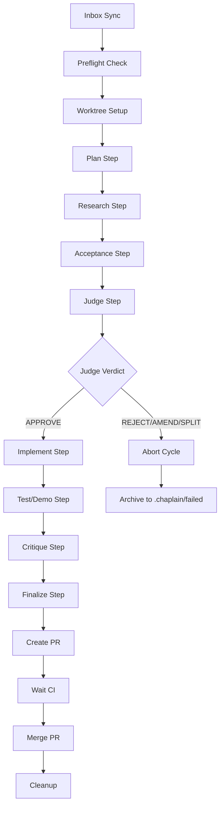

# Chaplain Automation Pipeline

The `.chaplain/` directory contains the watcher2 pipeline orchestrator and its shell library for automated feature request processing, worktree lifecycle management, and PR automation.

## Watcher2 Pipeline Overview

The watcher2 system is a sophisticated 8-step automation pipeline that processes proposals from the `.chaplain/inbox/` directory through the complete development lifecycle:

### Architecture: 4-Phase Pipeline

```
Inbox → Plan → Research → Acceptance → Judge → Enforce → PR → Merge → Cleanup
```

1. **Plan** → Research the problem and draft a feature request
2. **Research** → Gather evidence and alternatives
3. **Acceptance** → Write failing acceptance tests
4. **Judge** → Critically examine the FR for approval/rejection/amendment
5. **Enforce** → Implement (red→green TDD)
6. **Test/Demo** → Validate implementation
7. **Critique/Distill** → Finalize and document
8. **Finalize** → Pre-commit checks, PR creation, CI wait, merge

### Flow Diagram



### State Management and Session Chaining

- YAMLGraph executions pass state via `--export-state` / `--import-state`
- Shell steps between copilot invocations handle git operations
- State files: `tmp/pipeline-state.json`, `tmp/enforce-state.json`
- Session continuity maintained across all pipeline phases

### Error Handling and Forensic Preservation

- Failed cycles archived to `.chaplain/failed/` with full logs
- Each step logs to `tmp/watcher2-*.log` files
- Metrics emitted to `tmp/pipeline-metrics/` as JSON
- Worktree corruption guards prevent git state issues

## Shell Library Reference

The `.chaplain/lib/watcher/` directory contains reusable shell primitives:

### Core Worktree Operations

#### `worktree_setup.sh`
Create isolated worktrees with branch management.

**Usage:**
```bash
source .chaplain/lib/watcher/worktree_setup.sh
TOPIC_FILE=".chaplain/inbox/example.md"
worktree_setup
# Sets: WT_BRANCH, WT_DIR, MAIN_DIR
```

**Functions:**
- `worktree_setup()` - Creates `feat/watcher2-{topic}` branch and worktree
- Prunes orphaned metadata and removes stale branches
- Branch naming: `feat/watcher2-{basename-without-extension}`
- Worktree location: `tmp/worktrees/{branch-name}`

#### `worktree_teardown.sh`
Clean removal with corruption guards.

**Usage:**
```bash
source .chaplain/lib/watcher/worktree_teardown.sh
worktree_teardown
```

**Functions:**
- `worktree_teardown()` - Safely removes worktree and branch
- Git corruption prevention and orphan cleanup
- Preserves main branch state

#### `preflight.sh`
Pre-flight validation and cleanup.

**Usage:**
```bash
source .chaplain/lib/watcher/preflight.sh
preflight
```

**Functions:**
- `preflight()` - Validates environment and git state
- Checks for clean working directory
- Ensures main branch is current

### Git/GitHub Integration

#### `create_pr.sh`
PR creation with reuse logic.

**Usage:**
```bash
source .chaplain/lib/watcher/create_pr.sh
WT_BRANCH="feat/watcher2-example"
PR_TITLE="feat: example implementation"
create_pr
# Sets: PR_NUMBER, PR_URL
```

**Functions:**
- `create_pr()` - Creates PR or reuses existing one on same branch
- Automatic title updates for existing PRs
- JSON output parsing from `gh pr list`

#### `merge_pr.sh`
Squash merge with state verification.

**Usage:**
```bash
source .chaplain/lib/watcher/merge_pr.sh
merge_pr
```

**Functions:**
- `merge_pr()` - Performs squash merge via `gh pr merge --squash`
- Verifies PR state before merge attempt
- Handles merge conflicts and race conditions

#### `wait_ci.sh`
CI status polling.

**Usage:**
```bash
source .chaplain/lib/watcher/wait_ci.sh
TIMEOUT_CI=1800  # 30 minutes
wait_ci
```

**Functions:**
- `wait_ci()` - Polls PR status checks until completion
- Configurable timeout (default: 30 minutes)
- Handles pending, running, failed, and success states

#### `post_merge.sh`
Post-merge cleanup.

**Usage:**
```bash
source .chaplain/lib/watcher/post_merge.sh
post_merge
```

**Functions:**
- `post_merge()` - Updates local main branch after successful merge
- Fetches latest changes from origin
- Prepares for next cycle

### Pipeline Support

#### `inbox_sync.sh`
Remote issue synchronization.

**Usage:**
```bash
source .chaplain/lib/watcher/inbox_sync.sh
sync_github_issues
```

**Functions:**
- `sync_github_issues()` - Syncs GitHub issues with `chaplain` label to inbox
- Creates markdown files from issue body and metadata
- Removes label and closes issue after import
- Author validation against `.chaplain/allowed-authors.txt`

#### `metrics.sh`
Performance tracking.

**Usage:**
```bash
source .chaplain/lib/watcher/metrics.sh
T_CYCLE_START=$(date +%s)
CYCLE_OUTCOME="success"
TOPIC_FILE=".chaplain/processing/example.md"
write_cycle_metrics
```

**Functions:**
- `write_cycle_metrics()` - Emits JSON metrics to `tmp/pipeline-metrics/`
- Tracks pipeline timing, outcomes, and CI results
- Timestamped files for historical analysis

### Environment Variables and Configuration

| Variable | Default | Description |
|----------|---------|-------------|
| `POLL` | 10 | Seconds between inbox checks |
| `BODY_SIZE_CAP` | 10000 | Max characters for GitHub issue body |
| `TIMEOUT_CI` | 1800 | CI timeout in seconds (30 minutes) |
| `METRIC_DIR` | `tmp/pipeline-metrics` | Metrics output directory |

**Required external tools:**
- `gh` (GitHub CLI)
- `jq` (JSON processor)
- `yamlgraph` (YAMLGraph CLI)
- `pre-commit` (Pre-commit hooks)

**Git configuration:**
- Repository must be clean with no uncommitted changes
- Main branch must be up-to-date with origin
- Pre-commit hooks installed

## Usage Examples

### Running Watcher2 Daemon

```bash
# Start the daemon (runs continuously)
.chaplain/watcher2.sh

# With custom polling interval
POLL=5 .chaplain/watcher2.sh

# Check inbox manually
ls .chaplain/inbox/

# Submit a proposal
echo "Implement feature X for better performance" > .chaplain/inbox/feature-x.md
```

### Invoking Individual Shell Tools Standalone

```bash
# Set up a worktree manually
cd /path/to/yamlgraph
export TOPIC_FILE=".chaplain/inbox/my-task.md"
source .chaplain/lib/watcher/worktree_setup.sh
worktree_setup

# Create a PR manually
cd tmp/worktrees/feat/watcher2-my-task
export WT_BRANCH="feat/watcher2-my-task"
export PR_TITLE="feat: implement my task"
source .chaplain/lib/watcher/create_pr.sh
create_pr

# Clean up manually
cd /path/to/yamlgraph
source .chaplain/lib/watcher/worktree_teardown.sh
worktree_teardown
```

### Remote Issue Submission

1. Open a GitHub issue on the repository
2. Add the `chaplain` label
3. Write your proposal in the issue body
4. The watcher2 daemon will automatically import it to the inbox

### Environment Setup and Dependencies

```bash
# Install required tools
gh auth login
pip install pre-commit
pre-commit install

# Ensure YAMLGraph is available
pip install -e .

# Start the daemon
.chaplain/watcher2.sh
```

## Troubleshooting Common Issues

### Pipeline Failures

**Problem:** Cycles fail during preflight check
**Solution:** Ensure clean working directory and updated main branch
```bash
git status  # Should be clean
git checkout main
git pull origin main
```

**Problem:** Worktree creation fails
**Solution:** Clean up orphaned worktree metadata
```bash
git worktree prune
rm -rf tmp/worktrees/
```

**Problem:** PR creation fails
**Solution:** Check GitHub CLI authentication
```bash
gh auth status
gh auth refresh
```

### CI and Merge Issues

**Problem:** CI timeout or failures
**Solution:** Check CI status and increase timeout if needed
```bash
gh pr checks $PR_NUMBER
export TIMEOUT_CI=3600  # 1 hour
```

**Problem:** Merge conflicts
**Solution:** The pipeline handles this automatically, but manual resolution may be needed
```bash
cd tmp/worktrees/feat/watcher2-{topic}
git fetch origin main
git rebase origin/main
```

### Performance Issues

**Problem:** Slow pipeline execution
**Solution:** Monitor metrics and optimize bottlenecks
```bash
ls tmp/pipeline-metrics/
jq '.total_seconds' tmp/pipeline-metrics/*.json | sort -n
```

**Problem:** Large inbox backlogs
**Solution:** Process items manually or increase polling frequency
```bash
POLL=1 .chaplain/watcher2.sh  # More frequent checks
```

### Debug Mode

Enable verbose logging:
```bash
set -x  # Shell debug mode
export YAMLGRAPH_LOG_LEVEL=DEBUG
.chaplain/watcher2.sh
```

## Architecture Details

### Directory Structure and Purposes

```
.chaplain/
├── README.md                    # This documentation
├── watcher2.sh                  # Main orchestrator script
├── allowed-authors.txt          # Authorized GitHub usernames
├── inbox/                       # Incoming proposal files
├── processing/                  # Items currently being processed
├── failed/                      # Failed cycles with forensics
├── graphs/                      # YAMLGraph pipeline definitions
│   ├── watcher-plan/           # Planning phase graphs
│   └── watcher-enforce/        # Enforcement phase graphs
└── lib/                        # Shared utilities
    └── watcher/               # Shell tool library
        ├── inbox_sync.sh      # GitHub issue import
        ├── preflight.sh       # Environment validation
        ├── worktree_setup.sh  # Worktree creation
        ├── worktree_teardown.sh # Worktree cleanup
        ├── create_pr.sh       # PR management
        ├── wait_ci.sh         # CI polling
        ├── merge_pr.sh        # Squash merge
        ├── post_merge.sh      # Post-merge cleanup
        └── metrics.sh         # Performance tracking
```

### State Files and Logging

- **Pipeline state:** `tmp/pipeline-state.json` (plan → research → acceptance → judge)
- **Enforcement state:** `tmp/enforce-state.json` (implement → test → critique → finalize)
- **Execution logs:** `tmp/watcher2-*.log` (per-step output capture)
- **Metrics:** `tmp/pipeline-metrics/watcher2-{timestamp}.json`
- **Git history:** Each phase commits with descriptive messages

### Integration with YAMLGraph Execution

The watcher2 pipeline leverages YAMLGraph for LLM-powered reasoning while handling shell operations between steps:

1. **YAMLGraph phases:** Plan, Research, Acceptance, Judge, Implement, Test/Demo, Critique, Finalize
2. **Shell phases:** Git operations, PR management, CI waiting, metrics
3. **State chaining:** JSON state files passed between YAMLGraph invocations
4. **Error propagation:** YAMLGraph failures trigger shell error handlers

### Pre-commit Hook Cascade Handling

The finalize step includes sophisticated pre-commit handling:

1. **Initial attempt:** Run `pre-commit run --all-files`
2. **Auto-fix support:** Re-add files after auto-fixes and retry (up to 3 attempts)
3. **Copilot fallback:** If pre-commit still fails, invoke YAMLGraph finalize step
4. **Manual override:** Final commit uses `--no-verify` only for watcher2 automation

## Baseline Checkpointing

The baseline checkpointing system precomputes stable doctrine and context inputs for reuse across watcher2 runs, reducing token costs and improving consistency.

### Manifest Format

Baseline sources are defined in `.chaplain/baseline/manifest.yaml`:

```yaml
manifest_version: 1
sources:
  - pattern: .github/copilot-instructions.md
    mode: verbatim
  - pattern: ARCHITECTURE.md  
    mode: verbatim
  - pattern: feature-requests/*.md
    mode: summarized
exclude:
  - feature-requests/TEMPLATE.md
  - feature-requests/REJECTED-*.md
```

- **pattern**: Glob pattern for source files
- **mode**: `verbatim` preserves content exactly, `summarized` generates compressed summaries  
- **exclude**: List of exclusion patterns to skip

### Rebuild Rules

- **Deterministic hashing:** `BASELINE_ID = sha256(sorted_paths + content_hashes + manifest_version)`
- **Rebuild when:** BASELINE_ID changes due to source content or manifest updates
- **Skip rebuild when:** Matching baseline artifact already exists

### Summary Cache Behavior  

- **Cache key:** `sha256(content + prompt_version + model)` 
- **Reuse:** Cached summaries when cache key matches
- **Metadata:** Summary model, prompt version, and cache key stored for audit

### Cleanup Policy

- **Retention:** Keep latest 5 baseline artifacts automatically
- **Symlink:** `latest.json` points to current active baseline
- **Garbage collection:** Older artifacts deleted after successful rebuild

### Integration with Watcher2

```bash
# Baseline build (automated)
yamlgraph graph run .chaplain/graphs/baseline/graph.yaml \
  --export-state .chaplain/baseline/${BASELINE_ID}.json

# Watcher2 import (before plan/research)  
yamlgraph graph run step-plan.yaml \
  --import-state .chaplain/baseline/latest.json \
  --var proposal="@$INBOX_FILE"
```

## Cross-References to Related Files

- **FR-273:** Watcher2 pipeline implementation
- **FR-139:** Worktree corruption fixes
- **FR-174:** Python path cleanup
- **FR-241:** Editable install validation
- **GitHub Issues:** Remote submission via `chaplain` label
- **Main orchestrator:** `.chaplain/watcher2.sh`
- **Pipeline definitions:** `.chaplain/graphs/watcher-plan/` and `.chaplain/graphs/watcher-enforce/`
- **Shell library:** `.chaplain/lib/watcher/*.sh`
- **Configuration:** `.chaplain/allowed-authors.txt`

## Security and Safety

- **Author validation:** Only authorized users can submit via GitHub issues
- **Isolation:** Each proposal processed in isolated git worktree
- **Rollback safety:** Failed cycles preserved for analysis
- **Git integrity:** Corruption guards and orphan cleanup
- **CI gates:** All changes must pass CI before merge
- **Shell injection protection:** All user input properly quoted and validated

This documentation serves as both user guide and maintenance reference for the chaplain automation infrastructure.
