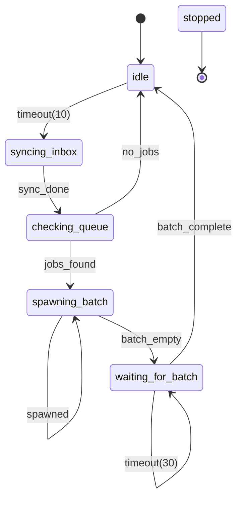
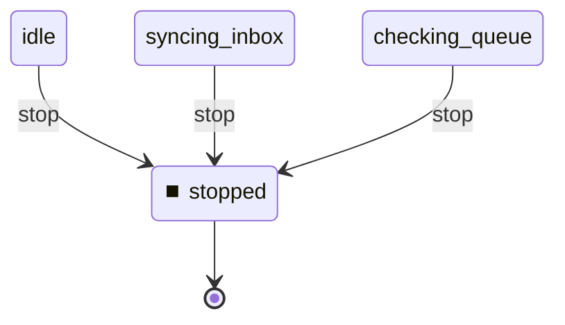

# State Machine

**Description:**

**Generated from:** `watcher-dispatcher.yaml`
**Machine Name:** `watcher2_dispatcher`
**Version:** `0.1.0`
**Job Type:** `unknown`

---

## Main State Machine Flow

---

## Stop/Shutdown Flow

---

## States Overview

| State | Description | Key Actions |
|-------|-------------|-------------|
| `idle` | Idle | N/A |
| `syncing_inbox` | Syncing Inbox | log |
| `checking_queue` | Checking Queue | log |
| `spawning_batch` | Spawning Batch | log |
| `waiting_for_batch` | Waiting For Batch | log |
| `stopped` | Stopped | log |

---

## Events Overview

| Event | Type | Description |
|-------|------|-------------|
| `timeout(10)` | Internal | Timeout(10) |
| `sync_done` | Success | Sync Done |
| `jobs_found` | Job | Jobs Found |
| `no_jobs` | Job | No Jobs |
| `spawned` | Internal | Spawned |
| `batch_empty` | Internal | Batch Empty |
| `timeout(30)` | Internal | Timeout(30) |
| `batch_complete` | Internal | Batch Complete |
| `stop` | Control | Stop |

---

## Configuration Summary

- **States:** 6
- **Events:** 9
- **Transitions:** 9
- **Initial State:** `idle`

---

*Generated by yaml_to_fsm.py*
