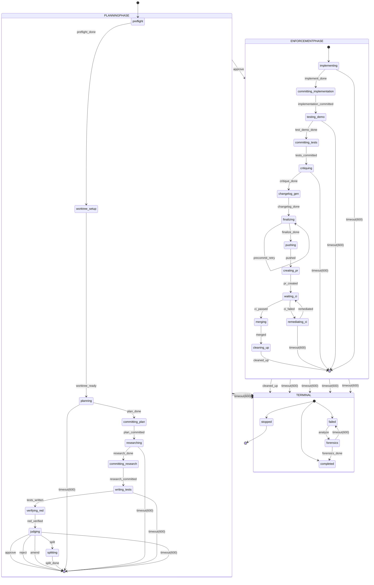
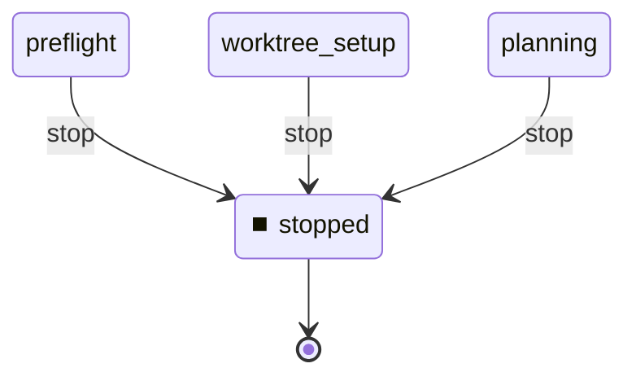

# State Machine

**Description:**

**Generated from:** `watcher-pipeline.yaml`
**Machine Name:** `watcher2_pipeline`
**Version:** `0.1.0`
**Job Type:** `unknown`

---

## Main State Machine Flow

---

## Stop/Shutdown Flow

---

## States Overview

| State | Description | Key Actions |
|-------|-------------|-------------|
| `preflight` | Preflight | log |
| `worktree_setup` | Worktree Setup | log |
| `planning` | Planning | log |
| `committing_plan` | Committing Plan | log |
| `researching` | Researching | log |
| `committing_research` | Committing Research | log |
| `writing_tests` | Writing Tests | log |
| `verifying_red` | Verifying Red | log |
| `judging` | Judging | log |
| `splitting` | Splitting | log |
| `implementing` | Implementing | log |
| `committing_implementation` | Committing Implementation | log |
| `testing_demo` | Testing Demo | log |
| `committing_tests` | Committing Tests | log |
| `critiquing` | Critiquing | log |
| `changelog_gen` | Changelog Gen | log |
| `finalizing` | Finalizing | log |
| `pushing` | Pushing | log |
| `creating_pr` | Creating Pr | log |
| `waiting_ci` | Waiting Ci | log |
| `remediating_ci` | Remediating Ci | log |
| `merging` | Merging | log |
| `cleaning_up` | Cleaning Up | log |
| `completed` | Completed | log |
| `failed` | Failed | log |
| `forensics` | Forensics | log |
| `stopped` | Stopped | log |

---

## Events Overview

| Event | Type | Description |
|-------|------|-------------|
| `preflight_done` | Success | Preflight Done |
| `worktree_ready` | Internal | Worktree Ready |
| `plan_done` | Success | Plan Done |
| `plan_committed` | Internal | Plan Committed |
| `research_done` | Success | Research Done |
| `research_committed` | Internal | Research Committed |
| `tests_written` | Internal | Tests Written |
| `red_verified` | Internal | Red Verified |
| `approve` | Internal | Approve |
| `reject` | Internal | Reject |
| `amend` | Internal | Amend |
| `split` | Internal | Split |
| `split_done` | Success | Split Done |
| `implement_done` | Success | Implement Done |
| `implementation_committed` | Internal | Implementation Committed |
| `test_demo_done` | Success | Test Demo Done |
| `tests_committed` | Internal | Tests Committed |
| `critique_done` | Success | Critique Done |
| `changelog_done` | Success | Changelog Done |
| `finalize_done` | Success | Finalize Done |
| `precommit_retry` | Internal | Precommit Retry |
| `pushed` | Internal | Pushed |
| `pr_created` | Internal | Pr Created |
| `ci_passed` | Internal | Ci Passed |
| `ci_failed` | Error | Ci Failed |
| `remediated` | Internal | Remediated |
| `merged` | Internal | Merged |
| `cleaned_up` | Internal | Cleaned Up |
| `analyze` | Internal | Analyze |
| `forensics_done` | Success | Forensics Done |
| `stop` | Control | Stop |
| `timeout(600)` | Internal | Timeout(600) |

---

## Configuration Summary

- **States:** 27
- **Events:** 32
- **Transitions:** 40
- **Initial State:** `preflight`

---

*Generated by yaml_to_fsm.py*
