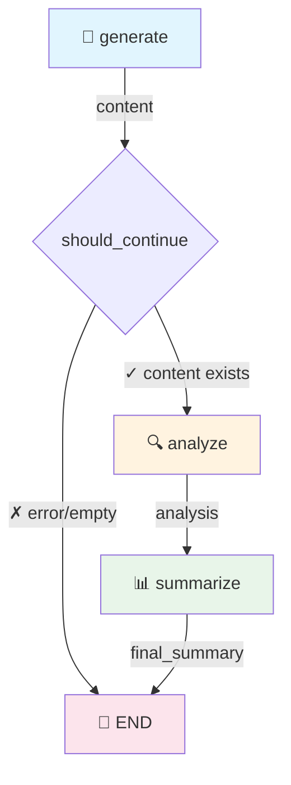
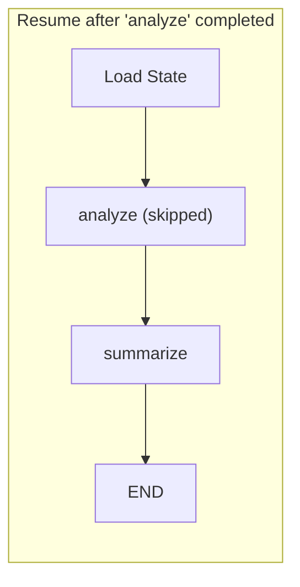

# YAMLGraph Architecture

> Single source of truth for YAMLGraph architecture, capabilities, and requirements traceability.

## Design Philosophy

### Why YAML-First?

1. **Separation of concerns**: Pipeline logic in YAML, business logic in prompts
2. **No Python required**: Non-developers can create/modify pipelines
3. **Version control friendly**: Diff-able, reviewable configuration
4. **Runtime safety**: Schema validation catches errors before execution

### Why Dynamic State?

Traditional approach requires manual state class definitions:
```python
class MyState(TypedDict):
    topic: str
    generated: str  # Must manually add for each node
```

YAMLGraph generates state automatically from graph config:
```yaml
nodes:
  generate:
    state_key: generated  # ← Auto-added to state
```

**Tradeoffs:**
- ✅ Less boilerplate, faster iteration
- ✅ State always matches graph definition
- ❌ No static type checking in IDE
- ❌ Runtime errors instead of compile-time

### Application Layer Pattern

When building applications with YAMLGraph, use a three-layer architecture:

```
┌─────────────────────────────────────┐
│  Python CLI (demo.py, run_*.py)     │ ← Presentation: colors, REPL, args
├─────────────────────────────────────┤
│  YAML Graphs (*.yaml)               │ ← Logic: LLM, state, checkpoints
├─────────────────────────────────────┤
│  Python Tools (nodes/*.py)          │ ← Side effects: API calls, files
└─────────────────────────────────────┘
```

**Presentation Layer** (Python CLI):
- Argument parsing, terminal colors, interactive prompts
- Thin wrapper around graph execution
- Calls `app.invoke()` and formats output

**Logic Layer** (YAML Graphs):
- All LLM calls, routing, state transitions
- Interrupt nodes for human-in-the-loop
- Map nodes for parallel processing
- Checkpointing and resume capability

**Side Effects Layer** (Python Tools):
- External API calls (Replicate, databases)
- File I/O (image generation, exports)
- Functions that can't be expressed in YAML

**Why this pattern?**
- Graphs are testable, traceable, and resumable
- Python handles UX where YAML can't (colors, stdin)
- Tools isolate non-deterministic operations
- Each layer can evolve independently

### Building APIs on YAMLGraph

The same pattern extends to web APIs:

```
┌─────────────────────────────────────┐
│  FastAPI / Flask                    │ ← HTTP: routes, auth, validation
├─────────────────────────────────────┤
│  YAML Graphs                        │ ← Logic: stateless or with threads
├─────────────────────────────────────┤
│  Python Tools + Storage             │ ← Persistence: DB, S3, queues
└─────────────────────────────────────┘
```

**Key integration points:**

```python
from yamlgraph.graph_loader import compile_graph, load_graph_config

# One-shot execution (stateless)
@app.post("/generate")
def generate(request: GenerateRequest):
    config = load_graph_config("graphs/generate.yaml")
    graph = compile_graph(config).compile()
    result = graph.invoke({"topic": request.topic})
    return {"result": result}

# Multi-turn with threads (stateful)
@app.post("/chat/{thread_id}")
def chat(thread_id: str, message: ChatMessage):
    config = load_graph_config("graphs/chat.yaml")
    checkpointer = get_checkpointer_for_graph(config)
    graph = compile_graph(config).compile(checkpointer=checkpointer)

    run_config = {"configurable": {"thread_id": thread_id}}
    result = graph.invoke(Command(resume=message.content), run_config)
    return {"response": result}
```

See [docs/plan-api-yamlgraph.md](docs/plan-api-yamlgraph.md) for detailed API design patterns.

### Production Example: NPC Encounter

The **examples/npc** directory demonstrates a full production pattern:

```
┌─────────────────────────────────────────────────────────────────┐
│  HTMX Frontend                                                  │
│  • HTML fragments, SSE streaming, minimal JS                    │
├─────────────────────────────────────────────────────────────────┤
│  FastAPI + Session Adapter                                      │
│  • EncounterSession wraps graph with thread_id management       │
│  • Human-in-loop via Command(resume=player_choice)              │
├─────────────────────────────────────────────────────────────────┤
│  YAMLGraph (encounter-multi.yaml)                               │
│  • Map nodes for parallel NPC generation                        │
│  • interrupt_before for player choice points                    │
├─────────────────────────────────────────────────────────────────┤
│  Prompts + Tools                                                │
│  • YAML prompts with Pydantic schemas                           │
│  • Tool functions for game mechanics                            │
└─────────────────────────────────────────────────────────────────┘
```

Key patterns demonstrated:
- **Session Adapter**: `EncounterSession` provides clean API over raw graph
- **Human-in-Loop**: `interrupt_before` + `Command(resume=...)` for player agency
- **Map Nodes**: Parallel fan-out with `Send()` for multi-NPC processing
- **HTMX Integration**: Server-rendered HTML fragments, no client framework

See [examples/npc/architecture.md](examples/npc/architecture.md) for full documentation.

### Module Organization: Concern Seams and Leaf Modules

The three-layer pattern governs *which layer* code belongs in. A second principle
governs how a single layer's package is split once it grows: **partition by concern
seam, and sink shared primitives into a leaf module so the dependency graph stays a
tree, not a cycle.**

When a module accretes several concerns and crosses the size ceiling (450 lines;
target <400), split it along the seams the code already reveals — not by mechanical
halving. Two failure modes recur when splitting:

1. **The sibling cycle.** Two new modules each need a shared substrate (accessors,
   constants, small pure helpers). Placing those primitives with their *busiest
   caller* makes the two siblings import each other. The fix is never to pick a
   winner: extract the substrate into a **leaf module** that imports neither sibling
   and is imported *by* both. The dependency graph becomes acyclic by construction.
2. **The facade hub.** Leaving re-exports in the emptied module so old call paths
   keep resolving creates a second source of truth and keeps the "split-out" symbols
   referenced from the original (defeating the decoupling). Migrate every call site
   to the new home instead — no compat shims (Commandment 8). The only re-exports
   that survive are those a *test identity contract* requires (`import x as x`).

The `examples/dungeon_master` package is the proving ground. `lifecycle_resolver`
(FR-534) and `turn_state` (FR-536) are leaf modules extracted precisely to dissolve
import cycles: the play loop and the opening gate both depend on turn/chapter
accessors, so those accessors sink below both. A generalized `test_module_size.py`
sweep enforces the ceiling across the whole package, so the drift cannot recur
silently.

A leaf module single-sources a *policy*, but the policy is only honored where it is
*applied*. When a derived value (a filtered roster, an allowed cast) is recomputed at
more than one site, sinking the resolution into one function is necessary but not
sufficient — every site that narrows the value must call it. FR-537's chapter-scoped
cast is the cautionary case: a `resolve_chapter_cast` leaf computes a chapter's focal
cast once, but two roster paths narrow it — the prose-control cast and the per-turn
intents roster built inline in the play loop. Wiring only the first leaves the
measured defect (off-chapter characters animated every turn) untouched, because the
defect lives on the *other* path. This is a SCOPE narrowing (who is in this chapter)
and is deliberately distinct from the lifecycle STATUS gates (is this character
alive/present): a present, reviewed character can still sit out a chapter, so the two
filters compose rather than subsume. Single-source the resolution; apply it at every
narrowing site; let an empty resolution fall back to the prior behavior so the
feature is additive.

| Smell | Cure |
|-------|------|
| Module > 450 lines mixing N concerns | Split along concern seams (use complexity/clone data to find them) |
| Two split siblings import each other | Sink the shared primitives into a leaf module both import |
| Old call paths kept alive by re-exports | Migrate call sites; delete the facade (keep only test-identity aliases) |
| A monkeypatch sets an attribute the call no longer reads | A patch is bound to the symbol's *module home* — retarget when the symbol moves |
| One narrowing point single-sourced but the defect rides another path | Apply the single-sourced policy at *every* site that derives the value, not just the busiest one |

### projects/ vs examples/

| Aspect | `examples/` | `projects/` |
|--------|-------------|-------------|
| **Purpose** | Demonstrate YAMLGraph patterns and capabilities | Standalone applications with domain-specific goals |
| **Requirements** | Framework-scoped (REQ-YG-XXX) | Project-scoped (OC-XXX, IC-XXX, etc.) |
| **Traceability** | Tracked by `scripts/req_coverage.py` | Own traceability, excluded from framework coverage |
| **Tests** | Optional for demos, required for complex examples | Required |
| **Scope** | Illustrate framework features | May diverge from framework patterns for domain reasons |

**Graduation criteria** — An example becomes a project when:
1. It accumulates domain-specific requirements worth tracking independently
2. It needs dedicated test coverage beyond framework validation
3. Its requirements would pollute the framework requirement namespace (see §27 Telco relocation)

---

## Module Architecture

```
┌─────────────────────────────────────────────────────────────────────────┐
│                           Entry Points                                   │
│  ┌─────────────┐  ┌─────────────┐  ┌─────────────┐                      │
│  │ cli/        │  │ builder.py  │  │ Python API  │                      │
│  │ (commands)  │  │ (high-level)│  │ (direct)    │                      │
│  └──────┬──────┘  └──────┬──────┘  └──────┬──────┘                      │
└─────────┼────────────────┼────────────────┼─────────────────────────────┘
          │                │                │
          ▼                ▼                ▼
┌─────────────────────────────────────────────────────────────────────────┐
│                         graph_loader.py                                  │
│  • load_graph_config() - Parse YAML → GraphConfig                       │
│  • compile_graph() - GraphConfig → StateGraph                           │
│  • _compile_edges() - Build edge connections                            │
└──────────────────────────────┬──────────────────────────────────────────┘
                               │
          ┌────────────────────┼────────────────────┐
          ▼                    ▼                    ▼
┌─────────────────┐  ┌─────────────────┐  ┌─────────────────┐
│ node_compiler.py│  │ map_compiler.py │  │ tools/agent.py  │
│ • compile_node()│  │ • Fan-out nodes │  │ • ReAct agents  │
│ • compile_nodes │  │ • Send() API    │  │ • Tool binding  │
│                 │  │ • Collection    │  │ • Max iterations│
└────────┬────────┘  └─────────────────┘  └─────────────────┘
         │
         ▼
┌─────────────────────────────────────────────────────────────┐
│                    node_factory/ (subpackage)                │
│  • llm_nodes.py - LLM and router nodes                      │
│  • control_nodes.py - Interrupt, passthrough                │
│  • subgraph_nodes.py - Nested graph composition             │
│  • tool_nodes.py - Tool call nodes                          │
│  • streaming.py - Token streaming support                   │
│  • base.py - Shared utilities                               │
└─────────────────────────────────────────────────────────────┘
         │
         ▼
┌─────────────────────────────────────────────────────────────────────────┐
│                          executor.py                                     │
│  • execute_prompt() - Load YAML prompt, call LLM, parse output          │
│  • format_prompt() - Variable substitution (simple or Jinja2)           │
│  • Schema resolution from YAML or Pydantic                              │
├──────────────────────────────────────────────────────────────────────────┤
│                        executor_async.py                                 │
│  • execute_prompt_async() - Async LLM calls                             │
│  • execute_prompt_streaming() - Token-by-token streaming                │
│  • run_graph_streaming_native() - Graph-level streaming (FR-029)        │
│  • load_and_compile_async() - Async graph compilation                   │
└──────────────────────────────┬──────────────────────────────────────────┘
                               │
          ┌────────────────────┼────────────────────┐
          ▼                    ▼                    ▼
┌─────────────────┐  ┌─────────────────┐  ┌─────────────────┐
│ llm_factory.py  │  │ schema_loader.py│  │ utils/prompts.py│
│ • Multi-provider│  │ • YAML → Pydantic│ │ • load_prompt() │
│ • 12 providers: │  │ • JSON Schema   │  │ • resolve_path()│
│   Anthropic,    │  └─────────────────┘  └─────────────────┘
│   DeepSeek,     │
│   Google/Gemini,│
│   Inception,    │
│   Mistral,      │
│   OpenAI,       │
│   Replicate,    │
│   RunPod,       │
│   Vertex AI,    │
│   xAI, LMStudio │
│ • Caching       │
└─────────────────┘
```

### Sync/Async Design Pattern

The codebase uses a **sync-first with async wrappers** pattern:

| Sync Module | Async Module | Relationship |
|-------------|--------------|--------------|
| `executor.py` | `executor_async.py` | Both use `executor_base.py` for shared logic |
| `llm_factory.py` | `llm_factory_async.py` | Async wraps sync via `run_in_executor` |

**Why this pattern?**
- **No duplication**: Async modules import from sync, adding only async-specific logic
- **Clean sync API**: Users not needing async get a simple, direct API
- **Async-specific features**: Streaming (`async for`), concurrent execution (`asyncio.gather`)
- **LangChain reality**: Underlying LLM clients are sync; async wrapping is appropriate

This is the idiomatic Python approach. An "async-first with `asyncio.run()` sync wrappers"
would add complexity and introduce event loop issues for sync users.

---

## End-to-End Flow

1. CLI loads YAML and validates structure.
2. Graph config is parsed and validated, with optional data file loading.
3. Dynamic state is generated from config.
4. Nodes are compiled into a LangGraph `StateGraph`.
5. Edges and routing are wired, including map and conditional edges.
6. The graph executes with prompt execution, tools, and error handling.
7. Optional persistence and export capture results and state.

Key flow anchors in code:
- Config load and loop defaults: [graph_loader.py](yamlgraph/graph_loader.py#L31) → [graph_loader.py](yamlgraph/graph_loader.py#L96) → [graph_loader.py](yamlgraph/graph_loader.py#L170)
- Compile and wire graph: [graph_loader.py](yamlgraph/graph_loader.py#L339)
- State generation: [state_builder.py](yamlgraph/models/state_builder.py#L127)
- Node compilation: [node_compiler.py](yamlgraph/node_compiler.py#L32) → [node_compiler.py](yamlgraph/node_compiler.py#L148)
- Prompt execution: [executor.py](yamlgraph/executor.py#L32) → [executor_base.py](yamlgraph/executor_base.py#L84)

---

## Capabilities & Requirements Traceability

YAMLGraph capabilities are tracked in individual YAML files under `capabilities/`.
Run `python scripts/aggregate_capabilities.py` to regenerate the sections below.

<!-- BEGIN GENERATED CAPABILITIES -->

### Capability Summary

| # | Capability | Primary Modules | Requirements |
|---|-----------|----------------|--------------|
| 1 | CAP-1 Config Loading & Validation | `cli/helpers`, `cli/helpers.GraphLoadError`, `data_loader`, `data_loader.DataFileError`, … | REQ-YG-001 – 004, 546 |
| 2 | CAP-2 Graph Compilation | `graph_loader`, `graph_loader.apply_loop_node_defaults`, `graph_loader.compile_graph`, `graph_loader.detect_loop_nodes`, … | REQ-YG-005 – 008, 220, 239 |
| 3 | CAP-3 Node Execution | `executor`, `executor_async`, `executor_base`, `node_factory/llm_nodes`, … | REQ-YG-009 – 011, 050, 223, 539 – 540 |
| 4 | CAP-4 Prompt Execution | `executor.PromptExecutor`, `executor.execute_prompt`, `executor_async`, `executor_base.format_prompt`, … | REQ-YG-012 – 016, 216, 562 |
| 5 | CAP-5 Tool & Agent Integration | `node_factory/tool_nodes`, `tools/agent`, `tools/graph_tool`, `tools/nodes`, … | REQ-YG-017 – 020, 422, 510, 576, 580 |
| 6 | CAP-6 Routing & Flow Control | `node_factory/control_nodes`, `routing`, `utils/conditions` | REQ-YG-021 – 023, 214, 552 |
| 7 | CAP-7 State Persistence | `models/state_builder`, `storage/checkpointer`, `storage/checkpointer_factory`, `storage/simple_redis` | REQ-YG-024 – 026 |
| 8 | CAP-8 Error Handling | `error_handlers`, `error_handlers.NodeResult`, `error_handlers.build_skip_error_state`, `error_handlers.check_loop_limit`, … | REQ-YG-027 – 031 |
| 9 | CAP-9 CLI Interface | `cli/__init__`, `cli/__main__`, `cli/deprecation`, `cli/graph_commands`, … | REQ-YG-032 – 035 |
| 10 | CAP-10 Export & Serialization | `cli/graph_commands.cmd_graph_codegen`, `cli/schema_commands`, `storage/export`, `storage/serializers` | REQ-YG-036 – 039, 553 |
| 11 | CAP-11 Subgraph & Map | `map_compiler`, `map_compiler.wrap_for_reducer`, `node_factory/subgraph_nodes` | REQ-YG-040 – 042 |
| 12 | CAP-12 Utilities | `config`, `constants`, `node_factory/base`, `schema_loader`, … | REQ-YG-043 – 046 |
| 13 | CAP-13 LangSmith Tracing | `cli/graph_commands`, `utils/tracing` | REQ-YG-047, 547 |
| 14 | CAP-14 Graph-Level Streaming | `executor_async` | REQ-YG-048 – 049, 065, 480 |
| 15 | CAP-15 Expression Language | `utils/conditions`, `utils/expressions`, `utils/parsing` | REQ-YG-051 – 052 |
| 16 | CAP-16 Linter Cross-Reference | `linter/checks`, `linter/checks_contracts`, `linter/checks_semantic`, `linter/graph_linter`, … | REQ-YG-053 – 054, 069, 114, 408 |
| 17 | CAP-17 Execution Safety Guards | `cli/__init__`, `cli/graph_commands`, `config`, `executor`, … | REQ-YG-055 – 062, 064, 113 |
| 18 | CAP-18 Testing & Quality | `tests/conftest`, `tests/unit/test_requirement_enforcement` | REQ-YG-063 |
| 19 | CAP-19 MCP Server Interface | `mcp_server` | REQ-YG-066 – 068 |
| 20 | CAP-20 Contrib Utilities | `contrib/progress`, `contrib/utils` | REQ-YG-070 – 071 |
| 21 | CAP-21 Diary Digest Tools | `scripts/diary_digest_tools` | REQ-YG-072 |
| 22 | CAP-22 Code Quality Lints | `scripts/lint_inline_llm` | REQ-YG-073 |
| 23 | CAP-23 Skip-If-Exists Truthiness | `node_factory/llm_nodes._should_skip_if_exists` | REQ-YG-074 |
| 24 | CAP-24 Interactive Tool Node | `interactive_tool`, `node_factory/control_nodes`, `utils/conditions` | REQ-YG-075 |
| 25 | CAP-25 Tavily Domain RAG Demo | `examples/demos/tavily_rag` | REQ-YG-076 |
| 26 | CAP-26 Streaming Error Resilience | `executor_async`, `models/streaming` | REQ-YG-077 |
| 28 | CAP-28 Graph-Level Thinking Budget | `yamlgraph/models/graph_schema.py`, `yamlgraph/utils/llm_factory.py` | REQ-YG-083 |
| 30 | CAP-30 Copilot Node | `constants.NodeType.COPILOT`, `models/schemas`, `node_compiler`, `node_factory/copilot_node`, … | REQ-YG-087, 089, 105, 356 – 357, 639 – 641 |
| 31 | CAP-31 Chaplain Diary Append | `examples/copilot/graph.yaml`, `examples/copilot/prompts/summarize.yaml`, `examples/shared/diary` | REQ-YG-090 |
| 32 | CAP-32 eBook Authoring Pipeline | `examples/ebook/nodes/writing.py`, `tests/unit/test_ebook_doctrine_validation.py` | REQ-YG-091 – 092 |
| 33 | CAP-33 Worktree Pipeline | `examples/enforce/graph.yaml`, `scripts/enforce_worktree.sh`, `utils/worktree_helpers` | REQ-YG-106 |
| 34 | CAP-34 Compiled Graph Cache | `executor_async`, `graph_cache` | REQ-YG-107 |
| 36 | CAP-36 Inquisitor Auto-Propose | `.chaplain/inquisitor.sh` | REQ-YG-118 |
| 37 | CAP-37 Architecture Provider Count Guard | `tests/unit/test_architecture_provider_count` | REQ-YG-121 |
| 38 | CAP-38 Post-Merge Finalization | `scripts/finalize_merge.sh`, `tests/unit/test_finalize_merge` | REQ-YG-125 |
| 39 | CAP-39 Inquisitor Commit-Delta Gate | `.chaplain/inquisitor.sh`, `tests/unit/test_inquisitor_gate` | REQ-YG-131 |
| 41 | CAP-41 Clean GIT Env Test Fixture | `tests/conftest.py`, `tests/unit/test_clean_git_env` | REQ-YG-140 |
| 42 | CAP-42 Inquisitor Worktree Gate | `.chaplain/inquisitor.sh`, `tests/unit/test_inquisitor_worktree_gate` | REQ-YG-142 |
| 43 | CAP-43 Copilot Session GC | `scripts/copilot_session_gc.sh`, `tests/unit/test_copilot_session_gc` | REQ-YG-141 |
| 44 | CAP-44 Judge SPLIT Verdict | `examples/copilot/prompts/judge.yaml`, `scripts/chaplain-prompts/judge.md`, `tests/unit/test_judge_split_verdict` | REQ-YG-143 |
| 45 | CAP-45 Diary Reflection Enforcement | `.pre-commit-config.yaml`, `scripts/finalize_merge.sh`, `tests/unit/test_precommit_hooks` | REQ-YG-144 |
| 46 | CAP-46 Diary Import CLI | `tests/unit/test_diary_commands`, `tests/unit/test_diary_importer`, `yamlgraph/cli/diary_commands.py`, `yamlgraph/diary/importer.py` | REQ-YG-122 |
| 47 | CAP-47 Phantom Requirement Detection | `scripts/req_coverage.py`, `tests/unit/test_req_coverage` | REQ-YG-145 |
| 48 | CAP-48 CHANGELOG Removal Completeness | `CHANGELOG.md`, `tests/unit/test_demo_cleanup_changelog` | REQ-YG-146 |
| 49 | CAP-49 Examples Documentation Audit | `examples/README.md`, `tests/unit/test_examples_readme_audit` | REQ-YG-147 |
| 50 | CAP-50 CI CHANGELOG Gate | `.github/workflows/commitlint.yml`, `scripts/gate_artifact_semantics.sh`, `tests/unit/test_ci_changelog_gate` | REQ-YG-148 |
| 51 | CAP-51 Branch Protection Documentation | `CLAUDE.md`, `reference/break-glass.md`, `tests/unit/test_branch_protection_docs` | REQ-YG-149 |
| 53 | CAP-53 CI Conflict Marker Gate | `.github/workflows/commitlint.yml`, `tests/unit/test_ci_conflict_check` | REQ-YG-151 |
| 54 | CAP-54 CI Diary Existence Gate | `.github/workflows/commitlint.yml`, `scripts/gate_artifact_semantics.sh`, `tests/unit/test_ci_diary_gate` | REQ-YG-152 |
| 55 | CAP-55 Chaplain Inbox Documentation | `CLAUDE.md`, `tests/unit/test_claude_md_chaplain_inbox` | REQ-YG-153 |
| 56 | CAP-56 Verification Gate Pattern | `yamlgraph/verification`, `node_factory/llm_nodes`, `linter/checks_contracts` | REQ-YG-154 |
| 57 | CAP-57 Verification Count Range Pydantic | `tests/unit/test_verification`, `yamlgraph/models/__init__`, `yamlgraph/verification` | REQ-YG-155 |
| 59 | CAP-59 Configurable Loop Exit Target | `tests/unit/test_loops`, `yamlgraph/edge_compiler`, `yamlgraph/graph_loader`, `yamlgraph/linter/checks_semantic`, … | REQ-YG-093 |
| 60 | CAP-60 Worktree Venv Corruption Guard | `scripts/enforce_worktree.sh`, `tests/unit/test_worktree_venv_guard`, `yamlgraph/utils/worktree_helpers` | REQ-YG-156 |
| 64 | CAP-64 Concurrency Safety Map | `docs/concurrency-safety.md`, `tests/unit/test_concurrency_safety_doc` | REQ-YG-160 |
| 65 | CAP-65 Append-Only Capability Registry | `capabilities/`, `scripts/validate_capabilities.py`, `scripts/req_coverage.py` | REQ-YG-161 |
| 66 | CAP-66 Append-Only Changelog | `changelog/`, `scripts/aggregate_changelog.py`, `scripts/migrate_changelog.py` | REQ-YG-162 |
| 67 | CAP-67 Philosopher Daemon | `examples/philosopher/`, `.chaplain/philosopher.sh` | REQ-YG-184 – 185, 194 |
| 68 | CAP-68 CI Dependency Security Scan | `.github/workflows/security.yml` | REQ-YG-186 |
| 69 | CAP-69 Knowledge Graph Graduation (FR-190) | `.github/copilot-instructions.md` | REQ-YG-187 |
| 70 | CAP-70 Knowledge Graph Graduation (FR-191) | `.github/copilot-instructions.md` | REQ-YG-188 |
| 71 | CAP-71 Release Changelog Sync Gate | `scripts/check_changelog_release_sync.py`, `scripts/release.sh`, `.github/workflows/commitlint.yml`, `.pre-commit-config.yaml`, … | REQ-YG-189 – 191 |
| 72 | CAP-72 Knowledge Graph Mass Graduation (FR-193) | `.github/copilot-instructions.md` | REQ-YG-192 |
| 73 | CAP-73 Philosopher Challenge Node (FR-195) | `examples/philosopher/models.py`, `examples/philosopher/tools.py`, `examples/philosopher/graph.yaml`, `examples/philosopher/prompts/distill.yaml`, … | REQ-YG-193 |
| 74 | CAP-74 FSM Scripture CLAUDE.md (FR-199) | `fsm/CLAUDE.md`, `tests/unit/test_fsm_claude_md_doctrine.py` | REQ-YG-195 |
| 75 | CAP-75 Portable Chaplain (FR-196) | `yamlgraph/tools/python_tool.py`, `graphs/philosopher/tools.py`, `graphs/philosopher/diary.py`, `tests/unit/test_python_nodes.py` | REQ-YG-196, 529 |
| 76 | CAP-76 Horoscope Demo | `examples/demos/horoscope` | REQ-YG-197 |
| 77 | CAP-77 Image Generation Pipeline | `examples/image_pipeline` | REQ-YG-198 |
| 78 | CAP-78 .fi Domain Crawl Demo | `examples/demos/fi-domain-crawl` | REQ-YG-199 |
| 79 | CAP-79 Demo Proof Gate | `scripts/check_demo_proof.sh`, `.github/workflows/commitlint.yml`, `.pre-commit-config.yaml` | REQ-YG-200 |
| 81 | CAP-81 A2A Protocol Server | `a2a_server`, `cli/a2a_commands` | REQ-YG-207 – 213 |
| 82 | CAP-82 Block AI Co-Author Trailers | `scripts/block_ai_coauthor.py`, `.pre-commit-config.yaml` | REQ-YG-215 |
| 83 | CAP-83 Research Agent Demo | `examples/demos/research-agent` | REQ-YG-217 |
| 84 | CAP-84 Import-Linter Architectural Boundary Enforcement | `.importlinter`, `.pre-commit-config.yaml`, `.github/workflows/workflow.yml` | REQ-YG-218 |
| 85 | CAP-85 Dependency Rationale Audit | `scripts/dependency_rationale.py`, `docs/dependency-rationale.yaml`, `.pre-commit-config.yaml` | REQ-YG-219 |
| 86 | CAP-86 Ruff Security Rules | `pyproject.toml`, `docs/confessions.md` | REQ-YG-222 |
| 87 | CAP-87 Ruff C901 Cognitive Complexity Gate | `pyproject.toml`, `docs/confessions.md` | REQ-YG-221 |
| 88 | CAP-88 Google/Vertex Thinking Budget Support | `yamlgraph/utils/llm_factory.py`, `yamlgraph/models/graph_schema.py`, `yamlgraph/linter/checks_providers.py` | REQ-YG-230 |
| 89 | CAP-89 Execution Timing Callback | `yamlgraph/utils/timing_tracker.py`, `yamlgraph/cli/graph_commands.py`, `yamlgraph/cli/__init__.py` | REQ-YG-231 |
| 90 | CAP-90 Graph Bench Command | `yamlgraph/cli/bench_commands.py`, `yamlgraph/cli/graph_commands.py`, `yamlgraph/cli/__init__.py` | REQ-YG-232 |
| 91 | CAP-91 Race Node Type | `yamlgraph/node_factory/race_node.py`, `yamlgraph/constants.py`, `yamlgraph/compile/node_compiler.py`, `yamlgraph/models/graph_schema.py`, … | REQ-YG-233, 269 |
| 92 | CAP-92 Chatterbox TTS Demo | `examples/demos/chatterbox` | REQ-YG-234 |
| 93 | CAP-93 Chatterbox Voice Clone Demo | `examples/demos/chatterbox` | REQ-YG-235, 238 |
| 94 | CAP-94 Compile-Time Pipeline Templates | `yamlgraph/compile/pipeline_template.py`, `yamlgraph/constants.py`, `yamlgraph/compile/graph_loader.py`, `yamlgraph/linter/checks.py`, … | REQ-YG-236 |
| 95 | CAP-95 Parallel Fan-Out Edges | `yamlgraph/compile/edge_compiler.py` | REQ-YG-237 |
| 96 | CAP-96 Per-Node Timeout | `yamlgraph/compile/map_compiler.py`, `yamlgraph/compile/node_compiler.py`, `yamlgraph/models/graph_schema.py`, `yamlgraph/models/schemas.py`, … | REQ-YG-078 |
| 98 | CAP-98 Pipeline Accumulated State | `yamlgraph/models/state_builder.py`, `reference/graph-yaml.md`, `tests/unit/test_state_builder_reducers.py` | REQ-YG-241 |
| 99 | CAP-99 Race and Pipeline Node Type Documentation | `reference/graph-yaml.md`, `reference/getting-started.md` | REQ-YG-240 |
| 100 | CAP-100 Chatterbox Multilingual CLI | `examples/demos/chatterbox` | REQ-YG-242 |
| 101 | CAP-101 A2A Consumer Contrib Client | `yamlgraph/contrib/a2a_client.py`, `yamlgraph/tools/python_tool.py` | REQ-YG-243 |
| 102 | CAP-102 Complete Worktree Teardown Self-Heal | `yamlgraph/utils/worktree_helpers`, `scripts/enforce_worktree.sh`, `scripts/bugfix_worktree.sh`, `tests/unit/test_worktree_teardown_self_heal` | REQ-YG-244 |
| 103 | CAP-103 A2A SDK v1.0 Compatibility | `yamlgraph/a2a/server.py`, `yamlgraph/a2a/message.py`, `yamlgraph/contrib/a2a_client.py`, `yamlgraph/cli/a2a_commands.py` | REQ-YG-245 |
| 104 | CAP-104 A2A Server Reference Documentation | `reference/a2a-server.md`, `reference/cli.md` | REQ-YG-246 |
| 105 | CAP-105 A2A Consumer Phase 2 — Agent Card, Skill Selection & Streaming | `yamlgraph/contrib/a2a_client.py` | REQ-YG-250 – 253 |
| 106 | CAP-106 GitHub Issues Remote Inbox | `.chaplain/watch.sh`, `tests/unit/test_github_issues_remote_inbox` | REQ-YG-247 |
| 107 | CAP-107 Guardrails Pattern Documentation | `reference/patterns.md`, `examples/README.md` | REQ-YG-254 |
| 108 | CAP-108 Changelog REQ Cross-Validation Gate | `scripts/check_changelog_req.py`, `graphs/enforcement/changelog-req-check.yaml`, `.pre-commit-config.yaml`, `.github/workflows/commitlint.yml` | REQ-YG-255 |
| 109 | CAP-109 Harden GitHub Issues Remote Inbox | `.chaplain/watch.sh`, `.chaplain/allowed-authors.txt` | REQ-YG-256 |
| 110 | CAP-110 Diary Index Graph | `examples/demos/diary_index` | REQ-YG-257 |
| 111 | CAP-111 Shared Graph Invocation | `graph_loader`, `discovery` | REQ-YG-206, 258 |
| 113 | CAP-113 Chaplain Research Step | `.chaplain/graphs/watcher-plan` | REQ-YG-260 |
| 114 | CAP-114 Automated Post-Merge Finalization | `scripts/lib/finalize_lib.sh`, `.chaplain/watch.sh`, `scripts/finalize_merge.sh`, `tests/unit/test_automated_post_merge_finalization` | REQ-YG-261 |
| 116 | CAP-116 Acceptance Tests Before Enforce | `.chaplain/config/watcher-pipeline-v2.yaml`, `.chaplain/graphs/watcher-plan/step-plan-unified.yaml`, `.chaplain/graphs/watcher-plan/prompts/write-acceptance-tests.yaml`, `.chaplain/graphs/watcher-plan/prompts/judge.yaml`, … | REQ-YG-263 |
| 117 | CAP-117 Race Node parse_json & Content Normalization | `yamlgraph/node_factory/race_node.py`, `yamlgraph/utils/content.py`, `yamlgraph/tools/agent.py` | REQ-YG-264 |
| 118 | CAP-118 Copilot Node Model Selection | `yamlgraph/models/graph_schema.py`, `yamlgraph/compile/node_compiler.py`, `yamlgraph/node_factory/copilot_node.py` | REQ-YG-265 |
| 119 | CAP-119 Race Node Timeout Fix | `yamlgraph/node_factory/race_node.py`, `yamlgraph/compile/node_compiler.py` | REQ-YG-266 |
| 120 | CAP-120 CLI Inter-Run State Chaining | `yamlgraph/cli/__init__.py`, `yamlgraph/cli/graph_commands.py`, `yamlgraph/cli/helpers.py`, `yamlgraph/storage/export.py` | REQ-YG-267 – 268 |
| 121 | CAP-121 Async Race Node with Cancellable Candidates | `yamlgraph/node_factory/race_node.py`, `tests/unit/test_race_node.py` | REQ-YG-270 |
| 122 | CAP-122 Router Node with Candidates Race Support | `yamlgraph/node_factory/llm_nodes.py`, `yamlgraph/utils/validators.py`, `yamlgraph/models/state_builder.py`, `yamlgraph/compile/node_compiler.py`, … | REQ-YG-271 |
| 124 | CAP-124 Watcher2 PR Reuse (FR-275) | `.chaplain/lib/watcher/create_pr.sh`, `tests/unit/test_watcher2_create_pr_reuse.py` | REQ-YG-272 |
| 125 | CAP-125 Pipeline Script Retirement (FR-276) | `.chaplain/scripts/start-system.sh`, `.chaplain/config/watcher-dispatcher.yaml`, `.chaplain/config/watcher-pipeline-v2.yaml`, `.chaplain/lib/watcher/worktree_setup.sh`, … | REQ-YG-276 |
| 126 | CAP-126 Test Speed Optimization | `pyproject.toml`, `tests/chaos_tools.py`, `tests/unit/test_map_node_timeout.py`, `tests/unit/test_race_node.py`, … | REQ-YG-275 |
| 127 | CAP-127 CI Hardening Consolidation | `.github/workflows/workflow.yml`, `.github/workflows/security.yml`, `.github/workflows/commitlint.yml`, `tests/unit/test_ci_hardening_consolidation.py` | REQ-YG-277 |
| 128 | CAP-128 Chaplain Documentation | `.chaplain/README.md`, `tests/unit/test_chaplain_readme_documentation` | REQ-YG-278 |
| 130 | CAP-130 Watcher2 Finalize Pre-commit Optimization | `.chaplain/scripts/start-system.sh`, `tests/unit/test_fr198_watcher2_finalize_optimization.py` | REQ-YG-286 |
| 131 | CAP-131 Anthropic Prompt Caching Support | `yamlgraph/executor_base.py`, `yamlgraph/utils/prompts.py`, `tests/unit/test_prompt_caching_fr276.py`, `tests/unit/test_prompt_caching_demo_fr219.py`, … | REQ-YG-287 – 293, 302 – 306 |
| 132 | CAP-132 Watcher2 CI Resilience | `.chaplain/lib/watcher/wait_ci.sh`, `tests/unit/test_fr279_watcher2_ci_resilience.py` | REQ-YG-294, 298 – 301 |
| 133 | CAP-133 Watcher2 CI Remediation Crash Fix | `.chaplain/scripts/start-system.sh`, `tests/unit/test_fr284_watcher2_ci_remediation_crash_fix.py` | REQ-YG-307 |
| 134 | CAP-134 Watcher2 Changelog Auto-Generation | `.chaplain/scripts/start-system.sh`, `.chaplain/graphs/watcher-enforce/prompts/enforce-critique-and-distill.yaml`, `.chaplain/graphs/watcher-enforce/prompts/enforce-finalize.yaml`, `.chaplain/graphs/watcher-enforce/step-ci-remediate.yaml` | REQ-YG-308 |
| 135 | CAP-135 Watcher2 Forensic Failure Diary | `.chaplain/scripts/start-system.sh`, `.chaplain/graphs/watcher-forensic/`, `.chaplain/lib/diary.py` | REQ-YG-309 |
| 136 | CAP-136 Per-Graph Typed MCP Tools | `yamlgraph/discovery.py`, `mcp_server` | REQ-YG-310 – 314 |
| 137 | CAP-137 Watcher FSM System Startup Script | `.chaplain/scripts/start-system.sh` | REQ-YG-315 |
| 138 | CAP-138 Watcher Pipeline FSM Simplification | `.chaplain/config/watcher-pipeline-v2.yaml`, `.chaplain/graphs/watcher-plan/step-judge-v2.yaml`, `.chaplain/graphs/watcher-enforce/enforce-session.yaml` | REQ-YG-316 |
| 139 | CAP-139 Root README Accuracy Contract | `README.md`, `tests/unit/test_root_readme_accuracy.py` | REQ-YG-317 |
| 140 | CAP-140 Watcher2 Validate Split Fix/Gate | `.chaplain/config/watcher-pipeline-v2.yaml`, `.chaplain/actions/changelog_gen_action.py`, `.chaplain/actions/validate_gate_action.py`, `.chaplain/graphs/watcher-enforce/validate-session.yaml`, … | REQ-YG-318 |
| 141 | CAP-141 Shared FSM Bridge Module | `yamlgraph/utils/fsm/__init__.py`, `yamlgraph/utils/fsm/helpers.py`, `yamlgraph/utils/fsm/event_sender.py`, `yamlgraph/utils/fsm/graph_runner.py`, … | REQ-YG-319 |
| 142 | CAP-142 Skill Export Portable Packaging | `skill_export` | REQ-YG-320 – 326 |
| 143 | CAP-143 Agent Export Tool-Scoped Personas | `skill_export` | REQ-YG-327 – 332 |
| 145 | CAP-145 Copilot Instrumentation Gap Closure | `scripts/copilot_instrument.sh`, `scripts/extract_copilot_events.py`, `scripts/extract_copilot_events_lib.py`, `docs/copilot-instrumentation-poc.md`, … | REQ-YG-340 – 346 |
| 146 | CAP-146 FSM Snapshot Hooks Phase 2 Subclassing | `yamlgraph/utils/fsm/snapshot.py`, `yamlgraph/utils/fsm/action.py`, `yamlgraph/utils/fsm/graph_runner.py`, `yamlgraph/utils/fsm/__init__.py`, … | REQ-YG-347 |
| 147 | CAP-147 Graph Run JSON Stdout + TypeScript Node Integration | `yamlgraph/cli/__init__.py`, `yamlgraph/cli/graph_commands.py`, `yamlgraph/cli/helpers.py`, `yamlgraph/storage/export.py`, … | REQ-YG-348 – 355 |
| 148 | CAP-148 CI Co-authored-by Trailer Gate | `.github/workflows/commitlint.yml`, `tests/unit/test_fr385_ci_copilot_trailer_gate_red.py`, `CLAUDE.md` | REQ-YG-358 |
| 149 | CAP-149 Prompt Theme Analyzer Demo | `examples/demos/prompt_theme_analyzer/graph.yaml`, `examples/demos/prompt_theme_analyzer/tools.py`, `examples/demos/prompt_theme_analyzer/prompts/classify_theme.yaml`, `examples/demos/prompt_theme_analyzer/prompts/group_themes.yaml`, … | REQ-YG-359 |
| 150 | CAP-150 Philosopher's Book Demo | `examples/demos/philosopher_book/graph.yaml`, `examples/demos/philosopher_book/editorial_graph.yaml`, `examples/demos/philosopher_book/tools.py`, `examples/demos/philosopher_book/prompts/plan_chapter.yaml`, … | REQ-YG-404 – 405 |
| 151 | CAP-151 Graph Lint JSON Output | `yamlgraph/cli/__init__.py`, `yamlgraph/cli/graph_validate.py`, `tests/unit/test_fr406_lint_json_output_red.py`, `ARCHITECTURE.md` | REQ-YG-406 |
| 152 | CAP-152 Watcher2 Dispatcher Audit Cadence | `.chaplain/config/watcher-dispatcher.yaml`, `.chaplain/actions/syncing_inbox_action.py`, `.chaplain/actions/audit_action.py`, `tests/unit/test_fr411_watcher2_dispatcher_inquisitor_audit_cadence.py`, … | REQ-YG-407 |
| 153 | CAP-153 Built-in Questionnaire Gap Utilities | `yamlgraph/tools/questionnaire.py`, `tests/unit/test_fr421_questionnaire_gap_utilities_red.py`, `reference/probe-recap-questionnaire.md`, `ARCHITECTURE.md` | REQ-YG-409 – 410 |
| 154 | CAP-154 Hook Classification Daemon | `examples/demos/hook_classifier/actions/classify_action.py`, `examples/demos/hook_classifier/config/hook-classifier.yaml`, `examples/demos/hook_classifier/graphs/classify-intent.yaml`, `examples/demos/hook_classifier/prompts/classify-tool-intent.yaml`, … | REQ-YG-411 – 416 |
| 155 | CAP-155 Schema Loader Tool Type | `yamlgraph/tools/schema_loader_tool.py`, `yamlgraph/tools/python_tool.py`, `yamlgraph/compile/graph_loader.py`, `yamlgraph/compile/node_compiler.py`, … | REQ-YG-417 – 418 |
| 156 | CAP-156 WIP Commit Subject Gate | `.pre-commit-config.yaml`, `.github/workflows/commitlint.yml`, `tests/unit/test_fr424_wip_main_gate_red.py`, `CLAUDE.md`, … | REQ-YG-419 |
| 157 | CAP-157 Graph Loader Strict Tool Load Fail Fast | `yamlgraph/compile/graph_loader.py`, `tests/unit/test_fr444_graph_loader_tool_load_mode_red.py`, `reference/graph-yaml.md`, `ARCHITECTURE.md` | REQ-YG-420 – 421 |
| 158 | CAP-158 Copilot Skill Promotion | `.github/skills/release-version/SKILL.md`, `.github/skills/chaplain-ops/SKILL.md`, `.github/skills/run-code-analysis/SKILL.md`, `.github/skills/feature-request/SKILL.md`, … | REQ-YG-423 |
| 159 | CAP-159 Standalone Planner Demo | `examples/demos/planner/graph.yaml`, `examples/demos/planner/prompts/planner.yaml`, `examples/demos/planner/tools/write_file.py`, `examples/demos/planner/demo.sh` | REQ-YG-424 |
| 160 | CAP-160 CAP Architecture Auto-Sync | `.pre-commit-config.yaml`, `scripts/aggregate_capabilities.py` | REQ-YG-425 |
| 161 | CAP-161 Standalone Enforcer Demo | `examples/demos/enforcer/graph.yaml`, `examples/demos/enforcer/prompts/enforcer.yaml`, `examples/demos/enforcer/tools/write_file.py`, `examples/demos/enforcer/tools/edit_file.py`, … | REQ-YG-426 |
| 162 | CAP-162 Enforcer Demo Safety Hardening | `examples/demos/enforcer/graph.yaml`, `examples/demos/enforcer/prompts/enforcer.yaml`, `examples/demos/enforcer/tools/write_file.py`, `examples/demos/enforcer/tools/edit_file.py`, … | REQ-YG-427 |
| 163 | CAP-163 CAP Retirement Support | `scripts/req_coverage.py`, `scripts/validate_capabilities.py`, `tests/unit/test_fr466_cap_retirement_support_red.py`, `tests/unit/test_capability_registry.py` | REQ-YG-428 |
| 164 | CAP-164 Structured Output JSON Fallback | `yamlgraph/executor.py`, `yamlgraph/node_factory/race_node.py`, `yamlgraph/utils/structured_output.py`, `yamlgraph/utils/llm_providers.py`, … | REQ-YG-464 – 465, 664 |
| 165 | CAP-165 Watcher2 Baseline Dead Code Removal | `tests/unit/test_fr278_remove_baseline_dead_code.py` | REQ-YG-466 |
| 166 | CAP-166 Meta Self-Reflective Demo | `examples/demos/meta` | REQ-YG-467 |
| 167 | CAP-167 Dungeon Master Example | `examples/dungeon_master/nodes/story_io` | REQ-YG-429 – 433 |
| 168 | CAP-168 Conditional Edge to Map Node | `yamlgraph/edge_compiler`, `yamlgraph/routing` | REQ-YG-434 |
| 169 | CAP-169 Dungeon Master Web UI | `examples/dungeon_master/api/session`, `examples/dungeon_master/api/routes/story` | REQ-YG-435 – 437 |
| 170 | CAP-170 Dungeon Master Web UI v2 (Journey-First) | `examples/dungeon_master/api/session`, `examples/dungeon_master/api/story_doc`, `examples/dungeon_master/api/routes/story` | REQ-YG-468 – 471 |
| 171 | CAP-171 Executor Plain-Text Content Normalization | `yamlgraph/executor.py`, `yamlgraph/utils/llm_factory_async.py`, `yamlgraph/utils/content.py` | REQ-YG-472 |
| 172 | CAP-172 Prompt-Monolith Linter Check (W026) | `yamlgraph/linter/checks_prompts.py`, `yamlgraph/linter/graph_linter.py` | REQ-YG-473 |
| 173 | CAP-173 Write Data File Tool | `tools/write_data_file_tool` | REQ-YG-474 – 477 |
| 174 | CAP-174 Data Files Glob Support | `data_loader` | REQ-YG-478 – 479 |
| 175 | CAP-175 Novel Fandom Canon Schema | `examples` | REQ-YG-481 – 483, 523 |
| 176 | CAP-176 Novel Fandom Enriched World Model | `examples` | REQ-YG-484 – 486 |
| 177 | CAP-177 Novel Fandom Plot Pathfinder | `examples` | REQ-YG-487 – 488 |
| 178 | CAP-178 Novel Fandom Prose and Close Loop | `examples` | REQ-YG-489 – 491 |
| 179 | CAP-179 Novel Fandom Wiki Core Types | `examples` | REQ-YG-492 – 493 |
| 180 | CAP-180 Novel Fandom World Expansion | `examples` | REQ-YG-494 – 504 |
| 181 | CAP-181 Novel Fandom Genesis Pipeline | `examples/novel_fandom` | REQ-YG-505 – 507 |
| 182 | CAP-182 Agentic Event Deepening | `examples/novel_fandom/nodes/canon_tools.py`, `examples/novel_fandom/nodes/split_thin_by_type.py`, `examples/novel_fandom/prompts/deepen_event_agent.yaml`, `examples/novel_fandom/worldgen.yaml` | REQ-YG-509 |
| 183 | CAP-183 First-Class Verification | `yamlgraph/utils/guard_runtime.py`, `yamlgraph/compile/node_compiler.py`, `yamlgraph/tools/nodes.py`, `yamlgraph/tools/python_tool.py`, … | REQ-YG-511 |
| 184 | CAP-184 Novel Fandom Duplicate Entity Prevention | `examples/novel_fandom` | REQ-YG-512 – 514 |
| 185 | CAP-185 Novel Fandom Ref Integrity Graph-Tool | `examples/novel_fandom` | REQ-YG-515 |
| 186 | CAP-186 Novel Fandom Genesis Self-Correcting Pipeline | `examples/novel_fandom` | REQ-YG-516 |
| 187 | CAP-187 Novel Fandom Semantic Dedup Graph-Tool | `examples/novel_fandom` | REQ-YG-517 |
| 188 | CAP-188 Novel Fandom Agent-First Architecture | `examples/novel_fandom/genesis.yaml`, `examples/novel_fandom/worldgen.yaml`, `examples/novel_fandom/nodes/creation_tools.py`, `examples/novel_fandom/create_character.yaml`, … | REQ-YG-518 – 522 |
| 189 | CAP-189 Worktree CLI Contract | `scripts/worktree.sh`, `scripts/wt`, `tests/unit/test_worktree_cli_red.py` | REQ-YG-524 |
| 191 | CAP-191 Instrumentation Worktree Delegation | `scripts/copilot_instrument.sh`, `tests/unit/test_copilot_instrument_worktree_delegation_red.py` | REQ-YG-526 |
| 192 | CAP-192 Branch Deny Guidance Manual Worktree Lane | `.github/hooks/scripts/pre-command-guard.sh`, `.github/hooks/tests/test_pre_command_guard.py` | REQ-YG-527 |
| 193 | CAP-193 Watcher Wrapper JSON Envelope | `.chaplain/lib/watcher/worktree_setup.sh`, `.chaplain/lib/watcher/worktree_teardown.sh`, `tests/unit/test_watcher_worktree_wrapper_red.py` | REQ-YG-528 |
| 194 | CAP-194 Novel Fandom Plot Threads and Throughlines | `examples` | REQ-YG-530 |
| 195 | CAP-195 Timeframe Recap Demo | `examples` | REQ-YG-531, 534 – 536 |
| 196 | CAP-196 Novel Fandom World Pressure | `examples` | REQ-YG-532 – 533 |
| 197 | CAP-197 Novel Fandom Event Revision | `examples` | REQ-YG-537 – 538 |
| 198 | CAP-198 Persistent Bridge Loop | `yamlgraph/utils/bridge.py`, `yamlgraph/node_factory/race_node.py`, `yamlgraph/node_factory/router_race_node.py` | REQ-YG-541 |
| 199 | CAP-199 Security and Coverage Gate Truth | `scripts/noqa_coverage.py` | REQ-YG-542 |
| 200 | CAP-200 Prompt Request Front Door | `yamlgraph/executor.py`, `yamlgraph/executor_base.py` | REQ-YG-543 |
| 201 | CAP-201 Pre-emptive Module Splits | `yamlgraph/models/graph_schema.py`, `yamlgraph/models/node_schema.py`, `yamlgraph/streaming_events.py`, `yamlgraph/executor_async.py` | REQ-YG-544 |
| 202 | CAP-202 SMT Condition Verification | `yamlgraph/linter/patterns/conditions_smt.py` | REQ-YG-545 |
| 203 | CAP-203 ICPC-2 RFE Classifier Example | `examples/icpc-2-rfe/nodes/build_catalog.py`, `examples/icpc-2-rfe/nodes/catalog.py`, `examples/icpc-2-rfe/nodes/reduce.py` | REQ-YG-548 – 551, 554 – 556 |
| 204 | CAP-204 CWE Vulnerability Classifier Example | `examples/cwe-classifier/nodes/build_catalog.py`, `examples/cwe-classifier/nodes/catalog.py`, `examples/cwe-classifier/nodes/reduce.py`, `examples/cwe-classifier/nodes/crosscheck.py` | REQ-YG-557 – 561 |
| 205 | CAP-205 World Distill Graph | `graphs/world_distill` | REQ-YG-563 |
| 206 | CAP-206 FR Triage Graph | `graphs/fr_triage` | REQ-YG-564 |
| 207 | CAP-207 Loader Error UX | `utils/prompts.check_messages_contract`, `tools/python_tool`, `linter/checks_loader_ux` | REQ-YG-565 |
| 208 | CAP-208 FR Atlas Onboarding Demo | `examples/demos/fr-atlas/nodes/collect.py`, `examples/demos/fr-atlas/nodes/coverage.py`, `examples/demos/fr-atlas/nodes/render.py` | REQ-YG-566 |
| 209 | CAP-209 Root Package Seams | `yamlgraph/a2a`, `yamlgraph/compile` | REQ-YG-567 |
| 210 | CAP-210 Edge Shape Classification | `yamlgraph/compile/edge_compiler.py` | REQ-YG-568 |
| 211 | CAP-211 Sole-Route Judge and Review Wrappers | `scripts/judge.sh`, `scripts/review.sh`, `.github/skills/judge-fr/adapters/graph.yaml`, `.github/skills/judge-fr/adapters/prompts/judge.yaml`, … | REQ-YG-569, 632, 642 |
| 212 | CAP-212 OpenTelemetry Observability Boundary | `yamlgraph/observability/otel.py`, `yamlgraph/compile/node_otel.py`, `yamlgraph/compile/node_compiler.py`, `yamlgraph/cli/graph_commands.py`, … | REQ-YG-570 |
| 213 | CAP-213 Example Dependency Taxonomy Generator | `scripts/example_taxonomy_scan.py` | REQ-YG-571 |
| 214 | CAP-214 Direct-Import Dependency Scanner | `scripts/direct_import_scan.py` | REQ-YG-572 |
| 215 | CAP-215 Style-Convert Pipeline | `examples/style_convert` | REQ-YG-573 |
| 216 | CAP-216 Tool Manifests | `tools`, `graph_loader` | REQ-YG-574 |
| 217 | CAP-217 Shared Vision Tool | `examples` | REQ-YG-575, 583 |
| 218 | CAP-218 Shared Document Splitter | `examples` | REQ-YG-577 |
| 219 | CAP-219 Book-Summary Vision Fallback | `examples` | REQ-YG-578 |
| 220 | CAP-220 Shared Shell Toolbelt Manifests | `examples` | REQ-YG-579 |
| 221 | CAP-221 Demo Graph Binding Hygiene and Grounded Synthesis Gate | `examples` | REQ-YG-581 |
| 222 | CAP-222 macOS File-Hook Example (Folder-Triggered Graph) | `examples` | REQ-YG-582 |
| 223 | CAP-223 User Self-Portrait Example (PersonalizationPortrait → Agent Context) | `examples` | REQ-YG-584 |
| 224 | CAP-224 API Discovery Leaf Tool Manifests | `examples` | REQ-YG-585 |
| 225 | CAP-225 API Discovery Endpoint-Probe Step | `examples` | REQ-YG-586 |
| 226 | CAP-226 API Discovery Page-Analysis Step | `examples` | REQ-YG-587 |
| 227 | CAP-227 Shared Python Tool Manifest Root Confinement Fix | `tools` | REQ-YG-588 |
| 228 | CAP-228 API Discovery Platform-Confirm Step | `examples` | REQ-YG-589 |
| 229 | CAP-229 Playwright Network Sniff Utility | `examples` | REQ-YG-590 |
| 230 | CAP-230 Provider Readiness Preflight | `tests` | REQ-YG-591 |
| 231 | CAP-231 API Discovery Recon Step | `examples` | REQ-YG-592 |
| 232 | CAP-232 API Discovery Browser-Sniff Step | `examples` | REQ-YG-593 |
| 233 | CAP-233 API Discovery Schema-Extract Step | `examples` | REQ-YG-594 |
| 234 | CAP-234 API Discovery Orchestrator | `examples` | REQ-YG-595 |
| 235 | CAP-235 Multi-Step Investigation Scaffold | `scripts` | REQ-YG-596 |
| 236 | CAP-236 Router-Visible Tool-Call Outputs | `node_factory`, `models`, `linter` | REQ-YG-597 |
| 237 | CAP-237 Author Brief Pre-Flight | `scripts` | REQ-YG-598 |
| 238 | CAP-238 API Discovery Orchestrator v2 — Recon and Browser-Sniff Routing | `examples` | REQ-YG-599 |
| 239 | CAP-239 Discord Hello Slash-Command Example | `examples/discord_bot` | REQ-YG-600 |
| 240 | CAP-240 FR Knowledge Graph Extraction | `scripts/extract_fr_graph.py`, `reference/fr-knowledge-graph.yaml`, `reference/fr-knowledge-graph.md`, `.github/hooks/scripts/checks/prior_art.py` | REQ-YG-601 – 603 |
| 241 | CAP-241 Weekly Recap Publication | `scripts` | REQ-YG-604 |
| 242 | CAP-242 Lint/Compile Validation Parity | `linter` | REQ-YG-605 |
| 243 | CAP-243 Requirement Witness Audit | `scripts` | REQ-YG-606 – 609 |
| 244 | CAP-244 Ramp Installer | `scripts` | REQ-YG-610 – 613 |
| 245 | CAP-245 Ramp Tailoring Graphs | `examples` | REQ-YG-614 – 617 |
| 246 | CAP-246 Scripture-dev Salvage Classification | `examples` | REQ-YG-618 – 619 |
| 247 | CAP-247 Memory-Corpus Curation (Selective Amnesia) | `examples` | REQ-YG-620 – 622 |
| 248 | CAP-248 Research Sole Route (Closed-Input Alternatives) | `examples` | REQ-YG-623, 665 |
| 249 | CAP-249 Invocation-time tool-slot binding | `tools/tool_slots`, `compile/graph_loader` | REQ-YG-624 |
| 250 | CAP-250 Corpus-census synthesize tail | `examples/demos/corpus_census` | REQ-YG-625, 633 – 634 |
| 251 | CAP-251 Copilot cost ledger — priced attribution | `scripts/vscode` | REQ-YG-626 |
| 252 | CAP-252 Shared SMTP Email Tool | `examples` | REQ-YG-627 |
| 253 | CAP-253 Org repository census with pinned-Azure delegation | `examples/demos/repo_census`, `examples/demos/corpus_census` | REQ-YG-628 |
| 254 | CAP-254 Session Worktree Lifecycle | `scripts/worktree.sh`, `scripts/vscode/now.py`, `scripts/vscode/session_join.py` | REQ-YG-629 – 630 |
| 255 | CAP-255 OS-Enforced Main-Write Lock | `scripts/worktree.sh`, `.github/hooks/scripts/checks/main_write.py`, `.github/hooks/scripts/checks/lane_guard.py`, `scripts/size_gate.py`, … | REQ-YG-631 |
| 256 | CAP-256 LAN Host Recon | `.github/skills/lan-recon/SKILL.md`, `.github/skills/lan-recon/__init__.py`, `.github/skills/lan-recon/recon.py`, `.github/skills/lan-recon/models.py`, … | REQ-YG-635 |
| 257 | CAP-257 LAN Copilot Delegation | `.github/skills/lan-delegate/SKILL.md`, `.github/skills/lan-delegate/__init__.py`, `.github/skills/lan-delegate/errors.py`, `.github/skills/lan-delegate/models.py`, … | REQ-YG-636 |
| 258 | CAP-258 Issue-Queue Delegation Runner | `.github/skills/issue-delegate/SKILL.md`, `.github/skills/issue-delegate/models.py`, `.github/skills/issue-delegate/worker.py`, `.github/skills/issue-delegate/windows_job.ps1`, … | REQ-YG-637 |
| 259 | CAP-259 Declared Text Encoding at First-Party Boundaries | `yamlgraph/cli/__init__.py`, `yamlgraph/compile/graph_loader.py`, `yamlgraph/utils/prompts.py`, `yamlgraph/schema_loader.py`, … | REQ-YG-638 |
| 260 | CAP-260 Authored-PR Visibility Cardinality | `examples/demos/corpus_census/adapters/corpus_adapters.py`, `examples/demos/person_profile_census/README.md`, `tests/unit/test_fr966_authored_pr_visibility.py` | REQ-YG-643 |
| 261 | CAP-261 Tracing Off in Tests | `tests/conftest.py`, `tests/unit/test_fr982_tracing_off_in_tests.py` | REQ-YG-644 |
| 262 | CAP-262 Map Fan-Out Concurrency Limit | `yamlgraph/compile/graph_loader.py`, `yamlgraph/cli/__init__.py`, `yamlgraph/cli/graph_run_helpers.py`, `yamlgraph/schemas/graph-v1.json`, … | REQ-YG-645 |
| 263 | CAP-263 Outsider Reader for PR Descriptions | `.github/skills/outsider-view/adapters/outsider_tools.py`, `.github/skills/outsider-view/adapters/graph.yaml`, `scripts/outsider.sh`, `tests/unit/test_fr995_outsider_reader.py`, … | REQ-YG-660 – 663 |
| 264 | CAP-264 Chaplain runtime retired | `scripts/chaplain_census.py`, `examples/demos/corpus_census/adapters/chaplain_adapters.py`, `examples/demos/corpus_census/adapters/chaplain-discover.tool.yaml`, `examples/demos/corpus_census/adapters/chaplain-extract.tool.yaml`, … | REQ-YG-666 |

> Capability numbers are stable identifiers. Gaps (e.g. 27, 29, 52, 58) indicate retired capabilities.

### 1. CAP-1 Config Loading & Validation

Load YAML graph configs, validate schemas, build state models, and ensure graph integrity through linting.

| Requirement | Description | Key Modules |
|------------|-------------|-------------|
| REQ-YG-001 | Load graph configurations from YAML files | `graph_loader.load_graph_config`, `cli/helpers`, `data_loader` |
| REQ-YG-002 | Validate graph configuration schemas and structures | `models/graph_schema`, `utils/validators` |
| REQ-YG-003 | Perform linting and pattern validation | `linter/graph_linter`, `linter/checks`, `linter/patterns/*` |
| REQ-YG-004 | Handle errors during configuration loading | `cli/helpers.GraphLoadError`, `data_loader.DataFileError` |
| REQ-YG-546 | Passthrough node output/outputs accept literal seeds (FR-721): the schema is dict[str, Any] matching the runtime contract — resolve_template's documented first branch passes non-string values through unchanged, and init nodes legitimately seed state with list/dict/bool literals. Template strings keep validating; literal types round-trip through model_dump unchanged (quoting "[]" would silently corrupt state seeding). Mapping fields (output_mapping, interrupt_output_mapping) remain genuinely string-to-string. Surfaced by ninchat NC-370 pin alignment: 8 ValidationErrors on a graph running correctly in production. | `models/node_schema` |

### 2. CAP-2 Graph Compilation

Transform validated configs into executable StateGraphs with node compilation, edge wiring, and loop detection.

**Feature Request:** FR-032

| Requirement | Description | Key Modules |
|------------|-------------|-------------|
| REQ-YG-005 | Load YAML graph definitions into StateGraphs | `graph_loader`, `graph_loader.load_and_compile` |
| REQ-YG-006 | Validate graph structures (cycle detection, loop defaults) | `graph_loader.detect_loop_nodes`, `graph_loader.apply_loop_node_defaults` |
| REQ-YG-007 | Compile individual nodes | `node_compiler.compile_node`, `node_factory` |
| REQ-YG-008 | Compile full graph configuration | `graph_loader.compile_graph`, `node_compiler.compile_nodes` |
| REQ-YG-220 | Node type registry dispatches compile_node via NODE_TYPE_HANDLERS dict; unknown types raise ValueError (FR-220) | `node_compiler` |
| REQ-YG-239 | Per-node cache field parsed as CacheConfig; resolve_cache_policy converts to LangGraph CachePolicy; passed to graph.add_node() (FR-032) | `models/graph_schema`, `node_compiler` |

### 3. CAP-3 Node Execution

Create executable node functions for LLM, streaming, tool, interrupt, and subgraph behavior.

| Requirement | Description | Key Modules |
|------------|-------------|-------------|
| REQ-YG-009 | Node creation and streaming | `node_factory/llm_nodes`, `node_factory/streaming` |
| REQ-YG-010 | Synchronous LLM factory management | `utils/llm_factory` |
| REQ-YG-011 | Asynchronous LLM factory management | `utils/llm_factory_async` |
| REQ-YG-050 | Per-node and default-level `model` override: graph YAML `model` field flows through `execute_prompt()` to `create_llm()` | `node_factory/llm_nodes`, `executor`, `executor_async`, `executor_base` |
| REQ-YG-223 | LLM node factory decomposed into composable phases: LLMNodeConfig frozen dataclass, resolve_llm_node_config() pure config resolver, _apply_verification(), _resolve_route(), _handle_error() — each independently testable, all below C901=10 (FR-223) | `node_factory/llm_nodes` |
| REQ-YG-539 | Every provider constructor in llm_providers.py bounds provider work at the client boundary (FR-708): an explicit finite request timeout (default LLM_REQUEST_TIMEOUT=30s, env-overridable, garbage values raise) and bounded retries (max_retries=2) via the wrapper-correct parameter (timeout for the ChatOpenAI/ChatAnthropic/ ChatGoogleGenerativeAI/ChatMistralAI/Azure families, request_timeout for ChatLiteLLM). Caller-supplied kwargs win over the defaults. VERTEX_TRANSPORT=rest\|grpc plumbs transport= into the google and vertex constructors (express and ADC branches); invalid values raise at the boundary. A hung provider endpoint fails within the timeout instead of hanging forever and accumulating transport channels (Fly freeze RCA 2026-07-10). | `utils/llm_providers` |
| REQ-YG-540 | LLM client cache is uniform and env-fingerprinted (FR-712 → FR-713 Part B): one caching rule for every provider — clients live their whole life on the persistent bridge loop (FR-713 Part A), so the loop affinity that condemned cached google-genai clients under the fresh-loop bridge (FR-711 Finding A: ~50% of completed calls errored) is honored by construction, and the FR-712 interim carve-out that excluded google/vertex from the cache is retired. The cache key embeds an env fingerprint (FR-227: construction is env-sensitive) — a common var set every constructor reads (LLM_REQUEST_TIMEOUT) plus a declarative per-provider list (keys, project/location, VERTEX_TRANSPORT); changing a fingerprinted var yields a new client, unchanged env is a cache hit. Vertex participates by same-class inference (FR-712 F4, symmetric: inferred out, inferred in) — witnessed for google by a warm-cached zero-errors-over-10 integration run on the bridge loop; one line to re-exclude if the field ever contradicts. | `utils/llm_factory` |

### 4. CAP-4 Prompt Execution

Load prompt YAML, validate variables, format messages, and run LLM calls sync and async.

| Requirement | Description | Key Modules |
|------------|-------------|-------------|
| REQ-YG-012 | Prompt loading and resolution | `utils/prompts` |
| REQ-YG-013 | Variable resolution and template management | `executor_base.format_prompt`, `utils/expressions`, `utils/template` |
| REQ-YG-216 | extract_variables() subtracts set-statement targets in nested blocks (FR-214) | `utils/template` |
| REQ-YG-014 | Synchronous prompt execution | `executor.PromptExecutor`, `executor.execute_prompt` |
| REQ-YG-015 | Asynchronous prompt execution | `executor_async` |
| REQ-YG-016 | JSON extraction from LLM outputs | `utils/json_extract` |
| REQ-YG-562 | Constraint fidelity through the inline-schema path: a prompt YAML schema built via schema_loader preserves ge/le constraints, defaults, and required fields through model_json_schema() so the JSON Schema is portable to external grammar-enforced runtimes (FR-731 WebLLM spike). The spike instrument is self-evidencing (FR-735): per-run console records, byte-fidelity raw downloads, and a per-session evidence.md in the FR-731 F1 tally shape with computed kill-criterion arithmetic | `schema_loader` |

### 5. CAP-5 Tool & Agent Integration

Integrate shell, Python, and graph tools into graphs, enable agent loops for tool-calling.

| Requirement | Description | Key Modules |
|------------|-------------|-------------|
| REQ-YG-017 | Dynamic tool node creation | `node_factory/tool_nodes` |
| REQ-YG-576 | tool_call inline dict args (FR-772): an inline YAML mapping as tool_call.args resolves each value via resolve_node_variables (FR-252 semantics — literals pass through, non-string types preserved, simple missing paths resolve to None); a resolved value still containing "{state." raises ValueError naming node and key; an empty inline mapping dispatches no kwargs (never whole-state); the string form "{state.X}" behaves exactly as before. | `node_factory/tool_nodes` |
| REQ-YG-580 | tool_call on_error (FR-778): on_error defaults to skip — the failure envelope {success: false, error} is byte-identical to the pre-FR behavior for callable exceptions and unknown tools. on_error: fail raises ValueError at the node naming the node, the tool, and the original error (exception chained) for both callable exceptions and unknown tools; the success-path envelope is unchanged. Graph load rejects tool_call on_error values outside skip/fail (including retry and fallback) naming the valid set. | `node_factory/tool_nodes`, `utils` |
| REQ-YG-018 | Agent-driven tool selection and execution; all-tool-calls-failed runs raise with a failure census before synthesis (FR-891 fail-closed boundary) | `tools/agent` |
| REQ-YG-019 | Shell tool integration and execution | `tools/shell`, `tools/nodes` |
| REQ-YG-020 | Python tool integration and execution | `tools/python_tool` |
| REQ-YG-422 | Agent node structured output via prompt schema (FR-448) | `tools/agent` |
| REQ-YG-510 | Graph-as-tool in-process pipeline invocation (FR-658) | `tools/graph_tool`, `graph_loader` |

### 6. CAP-6 Routing & Flow Control

Route across nodes using explicit routes, expression evaluation, and control nodes.

**Feature Request:** FR-211

| Requirement | Description | Key Modules |
|------------|-------------|-------------|
| REQ-YG-021 | Control node creation (interrupt, passthrough) | `node_factory/control_nodes` |
| REQ-YG-022 | Conditional routing functions | `routing` |
| REQ-YG-023 | Condition expression evaluation | `utils/conditions` |
| REQ-YG-214 | Router route mapping redirects interrupt targets to *_prepare and subgraph interrupt targets to *__run in conditional edge route mappings (FR-211) | `edge_compiler`, `graph_loader` |
| REQ-YG-552 | Route evidence record and regulated profile (FR-723/FR-807/FR-808). Opted-in runs emit a content-bound run header, timestamped frozen-grammar routes, and a run_end loss count; route and OTEL surfaces share UUIDv7 identity. Overlay export requires a matching header. The regulated artifact profile requires a preflighted per-run filesystem sink and judgement reference, enables evidence by default, records permitted disable overrides, and can fail strict runs on counted evidence loss. Ordinary graphs remain opt-in and non-strict. | `routing`, `utils/route_log` |

### 7. CAP-7 State Persistence

Checkpointers and Redis storage for resuming pipelines and state history.

| Requirement | Description | Key Modules |
|------------|-------------|-------------|
| REQ-YG-024 | Dynamic state class generation | `models/state_builder` |
| REQ-YG-025 | Checkpointer provisioning | `storage/checkpointer_factory` |
| REQ-YG-026 | State persistence operations (Redis) | `storage/simple_redis`, `storage/checkpointer` |

### 8. CAP-8 Error Handling

Error strategies (retry, fallback, skip), sanitization, resilience features.

| Requirement | Description | Key Modules |
|------------|-------------|-------------|
| REQ-YG-027 | Error handling strategies (skip, fail, retry, fallback) | `error_handlers` |
| REQ-YG-028 | Pre-execution validation (requirements, loop limits) | `error_handlers.check_requirements`, `error_handlers.check_loop_limit` |
| REQ-YG-029 | Error state management (NodeResult, skip updates) | `error_handlers.NodeResult`, `error_handlers.build_skip_error_state` |
| REQ-YG-030 | Error schemas and reporting | `models/schemas.PipelineError`, `models/schemas.ErrorType` |
| REQ-YG-031 | Retry capability | `executor_base.is_retryable`, `executor._invoke_with_retry` |

### 9. CAP-9 CLI Interface

Command-line commands for graph validation, execution, info display, schema export.

| Requirement | Description | Key Modules |
|------------|-------------|-------------|
| REQ-YG-032 | CLI entry point and parser setup | `cli/__init__`, `cli/__main__` |
| REQ-YG-033 | Graph command execution and information | `cli/graph_commands` |
| REQ-YG-034 | Deprecation handling for CLI commands | `cli/deprecation` |
| REQ-YG-035 | CLI utilities and schema command dispatch | `cli/helpers`, `cli/schema_commands` |

### 10. CAP-10 Export & Serialization

Export results/states in JSON/Markdown, handle serialization for persistence.

| Requirement | Description | Key Modules |
|------------|-------------|-------------|
| REQ-YG-036 | CLI schema export and access | `cli/schema_commands` |
| REQ-YG-037 | Graph code generation for IDE support | `cli/graph_commands.cmd_graph_codegen` |
| REQ-YG-038 | Export and management of pipeline results/states | `storage/export` |
| REQ-YG-039 | Serialization and deserialization utilities | `storage/serializers` |
| REQ-YG-553 | Authored-graph Mermaid export (FR-723). graph export --mermaid renders the authored YAML view (typed nodes, condition labels, router routes, loop limits, explicit loop-exit edges); --overlay renders an executed route.jsonl with taken edges and decision ordinals so the ordered route is reconstructible from the render; --diff compares two routes occurrence-aligned per (node, occurrence) naming the seam and Nth firing. Pure stdlib+yaml, no LLM. | `mermaid_export`, `cli/export_commands` |

### 11. CAP-11 Subgraph & Map

Parallel fan-out and nested subgraph execution.

| Requirement | Description | Key Modules |
|------------|-------------|-------------|
| REQ-YG-040 | Map node compilation | `map_compiler` |
| REQ-YG-041 | Output wrapping for reduction | `map_compiler.wrap_for_reducer` |
| REQ-YG-042 | Subgraph node creation | `node_factory/subgraph_nodes` |

### 12. CAP-12 Utilities

Logging, templating, JSON extraction, environment handling, and shared utilities.

| Requirement | Description | Key Modules |
|------------|-------------|-------------|
| REQ-YG-043 | Configuration and constants management | `config`, `constants` |
| REQ-YG-044 | Schema loading and model building | `schema_loader` |
| REQ-YG-045 | Node factory and resolution | `node_factory/base` |
| REQ-YG-046 | Logging and parsing utilities | `utils/logging`, `utils/parsing` |

### 13. CAP-13 LangSmith Tracing

Observability via LangSmith: trace URL retrieval, public sharing, and tracer injection.

| Requirement | Description | Key Modules |
|------------|-------------|-------------|
| REQ-YG-047 | LangSmith trace URL retrieval and sharing | `utils/tracing`, `cli/graph_commands` |
| REQ-YG-547 | Race-loser trace spans close on cancellation (FR-720): the candidate wrapper pre-generates a run_id per ainvoke attempt (passed as config={"run_id": ...} — the handle, since tracing is ambient and no callback handle exists), and on CancelledError enqueues client.update_run with end_time, terminal error ("cancelled: lost race to {provider}/{model}" on the winner path, "cancelled: race timed out" on the FR-707 drain path) and extra.metadata.race_outcome=lost before re-raising. Enqueue-only: the verdict path never waits for losers (FR-707 discipline unchanged). Skipped cleanly when tracing is disabled. Spawned by NC-367 census: 38/38 deployed vertex loser spans pending-forever rendered "cancelled by design" as "hung", taxing every trace-based investigation and blinding FR-711's deployed A/B. | `node_factory/race_node` |

### 14. CAP-14 Graph-Level Streaming

Stream LLM tokens through the compiled graph pipeline using LangGraph astream(stream_mode="messages"), enabling real-time SSE output.

**Feature Request:** FR-633

| Requirement | Description | Key Modules |
|------------|-------------|-------------|
| REQ-YG-048 | Graph-level streaming: run graph with `astream(stream_mode="messages")` yielding LLM tokens | `executor_async` |
| REQ-YG-049 | Streaming with multi-turn: `run_graph_streaming_native()` accepts `Command(resume=...)`, config with thread_id for checkpoint-based resume | `executor_async` |
| REQ-YG-065 | Native LangGraph streaming: `run_graph_streaming_native()` uses `astream(stream_mode="messages")` to stream from ALL LLM nodes, with optional `node_filter` | `executor_async` |
| REQ-YG-480 | CLI streaming: `yamlgraph graph run --stream` uses `run_graph_streaming_native()` for real-time token output to stdout | `cli` |

### 15. CAP-15 Expression Language

Value expressions, condition expressions, literal parsing, and resolve_node_variables batch resolution.

| Requirement | Description | Key Modules |
|------------|-------------|-------------|
| REQ-YG-051 | Expression language: value expressions (`{state.path}`, arithmetic, list/dict ops), condition expressions (comparisons, compound AND/OR), literal parsing, `resolve_node_variables` batch resolution | `utils/expressions`, `utils/conditions`, `utils/parsing` |
| REQ-YG-052 | Expression language hardening: quote-aware compound split, right-side state reference resolution, chained arithmetic detection | `utils/conditions`, `utils/expressions` |

### 16. CAP-16 Linter Cross-Reference

Linter cross-reference and semantic checks for edge endpoints, loop limits, state references, and contract warnings.

| Requirement | Description | Key Modules |
|------------|-------------|-------------|
| REQ-YG-053 | Linter cross-reference & semantic checks: edge endpoint validation (E006), loop_limits references (E008), passthrough output (E601), tool_call fields (E701/E702), condition syntax (W801), variable prefix (W007), fallback config (E010), conditional edge type (E802) | `linter/checks`, `linter/graph_linter` |
| REQ-YG-054 | Chaplain audit fixes: `wrap_for_reducer` non-dict return handling, LLM SKIP error recording, linter E011 retry/fallback on tool/python nodes, `prompts_relative` warning | `map_compiler`, `node_factory/llm_nodes`, `linter/checks`, `utils/prompts` |
| REQ-YG-069 | Linter E007: error when `{state.X}` in node `variables`/`output`/`over`/`args`/`input_mapping` references a field not in known state (declared `state:` + node `state_key` + `BUILTIN_STATE_FIELDS` + `COMMON_INPUT_FIELDS` + `data_files` + map `collect`). Promoted from W014 warning to E007 error (FR-110) | `linter/checks_semantic` |
| REQ-YG-114 | Linter W017: warn when node uses `on_error: skip` — silent fallback that drops failures without trace | `linter/checks_contracts`, `linter/graph_linter` |
| REQ-YG-408 | hedging_check enforces fallback-token hygiene in production Python by reporting lexical `fallback` usage as FB001, validating confession-backed allowlist mappings (`file:line -> CONF-XXX` with Code=FB001), preserving existing Pattern 1 detection, adding Pattern 2 (`X = expr or fallback`), and running pre-commit scope on both `yamlgraph/` and `scripts/`. | `scripts/hedging_check`, `.pre-commit-config.yaml`, `docs/confessions.md` |

### 17. CAP-17 Execution Safety Guards

Defense-in-depth guards against infinite loops, unbounded map fan-out, and runaway execution.

| Requirement | Description | Key Modules |
|------------|-------------|-------------|
| REQ-YG-055 | Map fan-out cap: `max_items` per node and `max_map_items` graph-level default, truncate + warn | `map_compiler` |
| REQ-YG-056 | `recursion_limit` exposure via YAML `config:` and CLI `--recursion-limit`, passed to `graph.invoke()` | `graph_loader`, `cli/graph_commands`, `cli/__init__` |
| REQ-YG-057 | `check_loop_limit()` enforced in tool, python, and passthrough nodes (not just LLM) | `tools/nodes`, `tools/python_tool`, `node_factory/control_nodes` |
| REQ-YG-058 | Linter W012: warn when cycle node has no `loop_limits` entry | `linter/checks_semantic`, `linter/graph_linter` |
| REQ-YG-059 | `max_iterations` single source of truth: default 10 everywhere (Pydantic, JSON schema, agent runtime, docs) | `tools/agent`, `models/graph_schema` |
| REQ-YG-060 | `max_tokens` wired from YAML config/node config through `execute_prompt()` to `create_llm()` provider constructor | `config`, `graph_loader`, `llm_factory`, `executor`, `node_factory/llm_nodes` |
| REQ-YG-061 | Global execution timeout via `config.timeout` and CLI `--timeout`, signal.alarm guard on Unix | `graph_loader`, `cli/graph_commands`, `cli/__init__` |
| REQ-YG-062 | Linter W013: warn when map node `over:` is a dynamic expression without `max_items` or `config.max_map_items` | `linter/checks_semantic`, `linter/patterns/map` |
| REQ-YG-064 | Token usage tracking via `TokenUsageCallbackHandler` callback injected at graph-level; accumulates `input_tokens`, `output_tokens`, `total_calls` across all LLM invocations; CLI `--token-usage` flag prints summary | `utils/token_tracker`, `cli/graph_commands`, `cli/__init__` |
| REQ-YG-113 | Linter W015: warn when cycle node has explicit `skip_if_exists: true` | `linter/checks_semantic`, `linter/graph_linter` |

### 18. CAP-18 Testing & Quality

Requirement traceability enforcement and testing infrastructure.

| Requirement | Description | Key Modules |
|------------|-------------|-------------|
| REQ-YG-063 | Requirement traceability enforcement: `pytest_collection_modifyitems` hook structurally enforces ADR-001 — framework tests in `tests/unit` and `tests/integration` must have `@pytest.mark.req`; infrastructure tests in `.github/hooks/tests` are excluded from this requirement | `tests/conftest`, `tests/unit/test_requirement_enforcement` |

### 19. CAP-19 MCP Server Interface

RETIRED by FR-910. Registration was broken for six weeks without a single failure report; the surface was unconsumed even while it worked. Agents reach graphs through the CLI adapters instead. Historical record only. Expose YAMLGraph graphs as MCP (Model Context Protocol) tools for Copilot and other AI assistants.

| Requirement | Description | Key Modules |
|------------|-------------|-------------|
| REQ-YG-066 | MCP server with stdio transport: expose `yamlgraph_list_graphs` and `yamlgraph_run_graph` tools via MCP protocol | `mcp_server` |
| REQ-YG-067 | Graph discovery: scan configured directories for `graph.yaml`, parse headers for name/description/required vars | `mcp_server` |
| REQ-YG-068 | Graph invocation via MCP: compile and invoke any discovered graph with vars, return structured result JSON | `mcp_server` |

### 20. CAP-20 Contrib Utilities

Shared utilities extracted from pipeline patterns. Eliminates copy-paste duplication across projects.

| Requirement | Description | Key Modules |
|------------|-------------|-------------|
| REQ-YG-070 | Contrib utils: `get_map_result()` unwraps single-key `_map_*_sub` dicts; `to_serializable()` converts Pydantic models to dicts recursively | `contrib/utils` |
| REQ-YG-071 | Contrib progress: `SkipReport` reads `state["errors"]` and provides human-readable skip summaries with counts and node names | `contrib/progress` |

### 21. CAP-21 Diary Digest Tools

Scheduled pipeline tools for fetching external developments and appending context-aware diary entries.

| Requirement | Description | Key Modules |
|------------|-------------|-------------|
| REQ-YG-072 | Diary digest: fetch HN/RSS sources, filter by relevance, format diary entries, append to diary.md, no-op when nothing relevant | `scripts/diary_digest_tools` |

### 22. CAP-22 Code Quality Lints

Custom lint checks enforcing architectural patterns beyond standard linters.

| Requirement | Description | Key Modules |
|------------|-------------|-------------|
| REQ-YG-073 | Inline LLM lint: detect scripts with `def main()` that import LLM execution functions without graph loading — flags orchestration code smell | `scripts/lint_inline_llm` |

### 23. CAP-23 Skip-If-Exists Truthiness

skip_if_exists checks truthiness, not existence. Empty collections, empty strings, None, 0, and False do NOT trigger skip.

| Requirement | Description | Key Modules |
|------------|-------------|-------------|
| REQ-YG-074 | skip_if_exists uses truthiness check: `[]`, `""`, `None`, `0`, `False` do not skip; only truthy values skip | `node_factory/llm_nodes._should_skip_if_exists` |

### 24. CAP-24 Interactive Tool Node

Declarative multi-turn stateful tool integration via config-level expansion.

| Requirement | Description | Key Modules |
|------------|-------------|-------------|
| REQ-YG-075 | Interactive tool node: expand `type: interactive_tool` into start/ask/step/end inline nodes with loop condition, max iterations, and interrupt-based user input | `interactive_tool`, `node_factory/control_nodes`, `utils/conditions` |

### 25. CAP-25 Tavily Domain RAG Demo

Domain-scoped RAG using Tavily search API with type:python tool nodes and map fan-out.

| Requirement | Description | Key Modules |
|------------|-------------|-------------|
| REQ-YG-076 | Tavily domain RAG: python tool retrieves context via Tavily API with optional `TAVILY_TARGET_DOMAIN` scoping; simple graph (retrieve→answer) and deep graph (plan→map(retrieve)→synthesize) | `examples/demos/tavily_rag` |

### 26. CAP-26 Streaming Error Resilience

Error propagation, timeout support, and interrupt detection for run_graph_streaming_native(). Yields StreamEvent Pydantic objects for errors and interrupts instead of crashing silently.

| Requirement | Description | Key Modules |
|------------|-------------|-------------|
| REQ-YG-077 | Streaming error resilience: wrap `astream()` with try/except to yield `StreamEvent(type="error")` on exceptions; `asyncio.timeout()` for stall detection; interrupt payload detection via `aget_state()` after stream completes; `yield_events=False` flag for opt-out (raises instead) | `executor_async`, `models/streaming` |

### 28. CAP-28 Graph-Level Thinking Budget

Graph-level and per-node thinking_budget YAML field for Anthropic extended thinking.

**Feature Request:** FR-071

| Requirement | Description | Key Modules |
|------------|-------------|-------------|
| REQ-YG-083 | `thinking_budget` YAML field on graph `defaults` and per-node; validated as `0` or `≥ 1024`; passed as `thinking={"type":"enabled","budget_tokens":N}` to `ChatAnthropic` with forced `temperature=1` (override before cache key); raises on non-Anthropic provider; included in LLM cache key | `yamlgraph/models/graph_schema.py`, `yamlgraph/utils/llm_factory.py` |

### 30. CAP-30 Copilot Node

New copilot node type that delegates graph processing to Copilot CLI, replacing shell-script orchestration with a first-class YAML-declarable node. FR-959 adds a fourth, closed backend value `claude` that delegates to the Claude Code CLI on the operator's subscription.

**Feature Request:** FR-082, FR-959

| Requirement | Description | Key Modules |
|------------|-------------|-------------|
| REQ-YG-087 | Copilot node executes via CLI backend with configurable flags and timeout; `--silent` always forced; list-based `subprocess.run()` for injection safety; graceful `FileNotFoundError` when copilot binary missing | `node_factory/copilot_node`, `node_compiler`, `constants.NodeType.COPILOT` |
| REQ-YG-089 | Copilot node composes with router, map, and FSM-router patterns; standard node guarantees apply (requires, on_error, skip_if_exists, loop protection) | `node_factory/copilot_node`, `node_compiler` |
| REQ-YG-105 | Copilot node session continuations via `--resume` and `--continue` flags; session ID captured from stderr into `CopilotResult.session_id`; state expression resolution for `cli_flags.resume` | `node_factory/copilot_node`, `models/schemas` |
| REQ-YG-356 | Copilot node supports explicit `backend: api` execution via `execute_prompt()`, while preserving default CLI behavior when backend is omitted or `cli`. | `node_factory/copilot_node`, `models/schemas` |
| REQ-YG-357 | Copilot lint rules are backend-aware: API backend warns when no explicit model signal is present and errors when API mode is combined with CLI-only `cli_flags`. | `linter/patterns/copilot`, `node_factory/copilot_node` |
| REQ-YG-639 | Copilot node supports `backend: claude`: list argv `claude -p <prompt> --output-format json` with the frozen flag mapping (`--model`, `--resume`/`--continue`, `--tools` comma grammar with `[]` meaning no tools, `--allowedTools`, `--dangerously-skip-permissions`, `--add-dir`, `--max-turns`); stdout crosses a private typed envelope (`result: str`, `session_id: str`, `is_error: bool`) before `CopilotResult(backend="claude")`; failure on non-zero exit, `is_error`, malformed envelope, missing binary, timeout; no numeric exit subtype interpreted and no usage-limit classifier. | `node_factory/copilot_runtime_claude`, `node_factory/copilot_node`, `models/schemas` |
| REQ-YG-640 | Copilot `backend` is a closed enum (`cli`, `api`, `sampling`, `claude`) at schema, compile, and lint; unknown, empty, or non-string values fail before any subprocess; Claude-only flags are typed (`ClaudeCliFlags`, strict, no extra keys) and malformed shapes fail at schema, compile, and lint before any probe; lint covers backend-incompatible flags, approval-vs-availability, provider-on-claude, and Copilot-only models. | `models/node_schema`, `models/schemas`, `node_factory/copilot_runtime`, `linter/patterns/copilot` |
| REQ-YG-641 | Claude backend payer boundary, per invocation: child env stripped of the evidenced credential and routing switches (`ANTHROPIC_API_KEY`, `ANTHROPIC_AUTH_TOKEN`, `ANTHROPIC_BASE_URL`, `CLAUDE_CODE_USE_BEDROCK`, `CLAUDE_CODE_USE_VERTEX`, `CLAUDE_CODE_USE_FOUNDRY`); exact supported-version check then fail-closed subscription auth-status check, both pinned to the committed raw probe and both run before every `-p` call with no cache; residual settings surface enumerated in docs and accepted by a named spend owner. | `node_factory/copilot_runtime_claude` |

### 31. CAP-31 Chaplain Diary Append

Extends the Plan-Judge workflow with automatic diary entry creation after each run.

**Feature Request:** FR-090

| Requirement | Description | Key Modules |
|------------|-------------|-------------|
| REQ-YG-090 | `format_diary_entry()` accepts configurable `prefix` parameter (default "World Digest"); `examples/copilot/graph.yaml` includes `summarize` (LLM) and `write_diary` (Python) nodes; `watch.sh` passes `date` and `diary_prefix` vars | `examples/shared/diary`, `examples/copilot/graph.yaml`, `examples/copilot/prompts/summarize.yaml` |

### 32. CAP-32 eBook Authoring Pipeline

A YAMLGraph pipeline that writes the development pipeline documentation as an eBook.

**Feature Request:** FR-100

| Requirement | Description | Key Modules |
|------------|-------------|-------------|
| REQ-YG-091 | `write_chapters_tool` writes formatted chapter content to disk; accepts `output_dir` and chapter state variables; creates directory if missing; returns dict with `written` list of paths | `examples/ebook/nodes/writing.py` |
| REQ-YG-092 | Chapter validation detects fabricated doctrine content; `verify_commandments_verbatim()` checks all 10 Commandments appear exactly as in source; returns `{passed, found, missing, fabricated}` dict | `tests/unit/test_ebook_doctrine_validation.py` |

### 33. CAP-33 Worktree Pipeline

Parallel development pipeline via git worktrees, enabling multiple features to be enforced simultaneously without blocking the main working tree.

**Feature Request:** FR-106

| Requirement | Description | Key Modules |
|------------|-------------|-------------|
| REQ-YG-106 | Worktree helpers derive branch names from FR paths, construct worktree paths under `tmp/worktrees/`, and validate clean working tree before creation; shell script orchestrates worktree lifecycle with trap-based cleanup; 4-phase graph (implement → test/demo → precommit → PR) chains via session continuations | `utils/worktree_helpers`, `scripts/enforce_worktree.sh`, `examples/enforce/graph.yaml` |

### 34. CAP-34 Compiled Graph Cache

Process-global compiled graph cache so load_and_compile_async() results survive module reloads and are shared across all callers within the same Python process.

**Feature Request:** FR-111

| Requirement | Description | Key Modules |
|------------|-------------|-------------|
| REQ-YG-107 | Process-global `GRAPH_CACHE` dict in installed package; `load_and_compile_async()` uses cache by default with `cache=None` opt-out; `clear_cache()` for test teardown; cache-hit logs at DEBUG, compile logs at INFO | `graph_cache`, `executor_async` |

### 36. CAP-36 Inquisitor Auto-Propose

--propose flag on inquisitor.sh detects violations persisting across consecutive Inquisitor Audit entries and writes targeted fix proposals to .chaplain/inbox/.

**Feature Request:** FR-118

| Requirement | Description | Key Modules |
|------------|-------------|-------------|
| REQ-YG-118 | `inquisitor.sh --propose` parses flag, gates a second copilot call that reads up to 5 diary audit entries, detects persistent ✗ violations (≥2 consecutive), classifies as micro-fix or structural gap, writes proposal markdown to `.chaplain/inbox/inquisitor-<slug>.md` with filename-based dedup; without `--propose` the audit-only flow is unchanged | `.chaplain/inquisitor.sh` |

### 37. CAP-37 Architecture Provider Count Guard

Cross-check test ensuring the provider count in ARCHITECTURE.md module table matches the actual ProviderType Literal in llm_factory.py.

**Feature Request:** FR-121

| Requirement | Description | Key Modules |
|------------|-------------|-------------|
| REQ-YG-121 | Test asserts ARCHITECTURE.md module table provider count for `llm_factory.py` equals `len(get_args(ProviderType))`; prevents documentation drift when providers are added or removed | `tests/unit/test_architecture_provider_count` |

### 38. CAP-38 Post-Merge Finalization

Automates three post-merge obligations after a PR from the enforce pipeline is merged: CHANGELOG entry, FR status update, and diary reflection stub.

**Feature Request:** FR-125

| Requirement | Description | Key Modules |
|------------|-------------|-------------|
| REQ-YG-125 | `scripts/finalize_merge.sh` inserts CHANGELOG entry under `[Unreleased] / ### Added`, updates FR status to `✅ Implemented`, and appends diary reflection stub with Trap/Heuristic/Seed placeholders | `scripts/finalize_merge.sh`, `tests/unit/test_finalize_merge` |

### 39. CAP-39 Inquisitor Commit-Delta Gate

inquisitor.sh commit-delta gate extracts last audit SHA from docs/diary/, counts feat:/fix: commits since that SHA, and aborts when none found.

**Feature Request:** FR-131

| Requirement | Description | Key Modules |
|------------|-------------|-------------|
| REQ-YG-131 | `inquisitor.sh` commit-delta gate extracts last audit SHA from `docs/diary/`, counts `feat:`/`fix:` commits since that SHA via `git log`, and aborts with clear message when none found; `--force` bypasses gate; gate degrades gracefully on missing diary, unparseable SHA, or first-ever audit; `--propose` respects gate; gate logic is pure shell | `.chaplain/inquisitor.sh`, `tests/unit/test_inquisitor_gate` |

### 41. CAP-41 Clean GIT Env Test Fixture

Session-scoped autouse pytest fixture strips GIT_* environment variables injected by pre-commit, preventing subprocess bleed into tests that create temporary git repos.

**Feature Request:** FR-140

| Requirement | Description | Key Modules |
|------------|-------------|-------------|
| REQ-YG-140 | `_clean_git_env` session-scoped autouse fixture strips all `GIT_*` env vars at session start, restores on teardown; no-op when vars absent; prevents pre-commit `GIT_DIR`/`GIT_WORK_TREE` from leaking into subprocess git calls in `tmp_path`-based test repos | `tests/conftest.py`, `tests/unit/test_clean_git_env` |

### 42. CAP-42 Inquisitor Worktree Gate

inquisitor.sh worktree gate detects git worktree context and exits early, suppressing audit and propose phases during enforce pipeline.

**Feature Request:** FR-142

| Requirement | Description | Key Modules |
|------------|-------------|-------------|
| REQ-YG-142 | `inquisitor.sh` worktree gate checks `-f "$REPO_ROOT/.git"` (file = worktree, directory = main), exits 0 with message when in worktree; `--force` bypasses gate; degrades gracefully when `git rev-parse` fails; gate placed before commit-delta gate (FR-131); pure shell, no Python | `.chaplain/inquisitor.sh`, `tests/unit/test_inquisitor_worktree_gate` |

### 43. CAP-43 Copilot Session GC

Shell script that prunes stale Copilot CLI sessions from ~/.copilot/session-state/ based on age.

**Feature Request:** FR-138

| Requirement | Description | Key Modules |
|------------|-------------|-------------|
| REQ-YG-141 | `copilot_session_gc.sh` removes session directories older than `--max-age` days (default 7); `--dry-run` lists candidates without deleting; active session (`$COPILOT_SESSION_ID`) is never removed; exits cleanly when directory is missing; idempotent; logs UUID and age for each removed session | `scripts/copilot_session_gc.sh`, `tests/unit/test_copilot_session_gc` |

### 44. CAP-44 Judge SPLIT Verdict

Add a fourth judge verdict (SPLIT) for multi-concern feature requests, enabling decomposition before implementation.

**Feature Request:** FR-136

| Requirement | Description | Key Modules |
|------------|-------------|-------------|
| REQ-YG-143 | Judge prompts must include `SPLIT` verdict and Scope Count rubric for multi-concern FR decomposition; unit tests verify both prompt sources and conflict fixture behavior | `examples/copilot/prompts/judge.yaml`, `scripts/chaplain-prompts/judge.md`, `tests/unit/test_judge_split_verdict` |

### 45. CAP-45 Diary Reflection Enforcement

Pre-commit hook diary-reflection-check rejects commits when staged docs/diary/ reflection files contain unfilled placeholder text or miss the literal `Seed:` marker.

**Feature Request:** FR-144

| Requirement | Description | Key Modules |
|------------|-------------|-------------|
| REQ-YG-144 | `diary-reflection-check` pre-commit hook scans staged tracked reflection files for unfilled placeholder text and missing literal `Seed:` markers, then blocks commit; `finalize_merge.sh` creates stubs as untracked files (no `git add` of `docs/diary/`); hook passes when placeholders are filled and `Seed:` is present | `.pre-commit-config.yaml`, `scripts/finalize_merge.sh`, `tests/unit/test_precommit_hooks` |

### 46. CAP-46 Diary Import CLI

CLI command to import pending diary entries and git report data into docs/diary/ with optional dry-run and source selection.

**Feature Request:** FR-124

| Requirement | Description | Key Modules |
|------------|-------------|-------------|
| REQ-YG-122 | `yamlgraph diary import` CLI command imports pending diary entries and git reports into `docs/diary/` with `--dry-run` and `--source` flags; shared importer returns structured `ImportResult` list; dry-run does not mutate source files; malformed files reported and exit non-zero; explicit missing `--source` emits warning | `yamlgraph/diary/importer.py`, `yamlgraph/cli/diary_commands.py`, `tests/unit/test_diary_importer`, `tests/unit/test_diary_commands` |

### 47. CAP-47 Phantom Requirement Detection

Detect and reject test markers that reference non-existent requirement IDs.

**Feature Request:** FR-145

| Requirement | Description | Key Modules |
|------------|-------------|-------------|
| REQ-YG-145 | Phantom requirement detection: `req_coverage.py --strict` rejects `@pytest.mark.req` markers referencing requirement IDs absent from `ALL_REQS` or `ARCHITECTURE.md` | `scripts/req_coverage.py`, `tests/unit/test_req_coverage` |

### 48. CAP-48 CHANGELOG Removal Completeness

CHANGELOG.md [Unreleased] documents significant file removals per Commandment 8.

**Feature Request:** FR-153

| Requirement | Description | Key Modules |
|------------|-------------|-------------|
| REQ-YG-146 | CHANGELOG.md `[Unreleased]` contains a `### Removed` section documenting stale demo file deletions (commit a0e6f00): `examples/cost-router/poc_granite.py`, `scripts/loopback-poc/` (419 lines); section ordering follows Keep a Changelog convention (Added → Removed → Fixed) | `CHANGELOG.md`, `tests/unit/test_demo_cleanup_changelog` |

### 49. CAP-49 Examples Documentation Audit

Every on-disk example and demo is accurately indexed in examples/README.md with categorized sections and enforced quality bar.

**Feature Request:** FR-135

| Requirement | Description | Key Modules |
|------------|-------------|-------------|
| REQ-YG-147 | `examples/README.md` lists every demo directory and top-level example on disk; demos are split into Learning / Utility / FR Validation sections; inclusion criteria are documented; each listed entry has a `README.md` and at least one runnable artifact (YAML graph, `demo.sh`, or Python script) | `examples/README.md`, `tests/unit/test_examples_readme_audit` |

### 50. CAP-50 CI CHANGELOG Gate

GitHub Actions job in commitlint.yml that blocks merge of feat and fix PRs unless changed changelog fragments under changelog/unreleased/ pass substance validation.

**Feature Request:** FR-149

| Requirement | Description | Key Modules |
|------------|-------------|-------------|
| REQ-YG-148 | `changelog-gate` job in `commitlint.yml` runs `git diff --name-only` against base/head SHAs and fails when no `changelog/unreleased/*.md` fragment is present in diff; each changed fragment must be non-empty, contain YAML front matter with `type:`, and include at least one markdown list item in the body; shared validation is sourced from `scripts/gate_artifact_semantics.sh`; job-level `if` condition restricts to `feat`/`fix` PR titles (skipped for other types); uses `actions/checkout@v4` with `fetch-depth: 0` for full history | `.github/workflows/commitlint.yml`, `scripts/gate_artifact_semantics.sh`, `tests/unit/test_ci_changelog_gate` |

### 51. CAP-51 Branch Protection Documentation

GitHub branch protection rules on main enforcing squash-merge only, required status checks, and no direct pushes.

**Feature Request:** FR-150

| Requirement | Description | Key Modules |
|------------|-------------|-------------|
| REQ-YG-149 | `reference/break-glass.md` documents emergency bypass procedure with audit trail requirements; `CLAUDE.md` contains Branch Protection section listing enforced rules, required status checks, and link to break-glass procedure | `reference/break-glass.md`, `CLAUDE.md`, `tests/unit/test_branch_protection_docs` |

### 53. CAP-53 CI Conflict Marker Gate

CI job that fails when unresolved merge conflict markers are found in tracked files, complementing the local check-merge-conflict pre-commit hook.

**Feature Request:** FR-157

| Requirement | Description | Key Modules |
|------------|-------------|-------------|
| REQ-YG-151 | CI conflict marker gate: The `conflict-check` job in `commitlint.yml` greps tracked files (excluding `.github/`) for conflict marker patterns and fails with non-zero exit when found | `.github/workflows/commitlint.yml`, `tests/unit/test_ci_conflict_check` |

### 54. CAP-54 CI Diary Existence Gate

CI gate ensuring feat/fix PRs with FR references include a diary reflection file in the diff and that the reflection passes substance validation.

**Feature Request:** FR-158

| Requirement | Description | Key Modules |
|------------|-------------|-------------|
| REQ-YG-152 | `diary-gate` job in `commitlint.yml` extracts `FR-XXX` from PR title, runs `git diff --name-only` against base/head SHAs, and fails when no `docs/diary/*reflection*fr-{number}*` file is in diff; matching files must be non-empty, exceed 100 bytes, contain at least one markdown `##` header, and include `Seed:` marker; shared validation is sourced from `scripts/gate_artifact_semantics.sh`; skips (passes) when PR title has no FR reference; job-level `if` condition restricts to `feat`/`fix` PR titles; uses `actions/checkout@v4` with `fetch-depth: 0` for full history | `.github/workflows/commitlint.yml`, `scripts/gate_artifact_semantics.sh`, `tests/unit/test_ci_diary_gate` |

### 55. CAP-55 Chaplain Inbox Documentation

Document the .chaplain/inbox/ workflow in CLAUDE.md so Claude Code sessions can discover and use the autonomous proposal pipeline.

**Feature Request:** FR-163

| Requirement | Description | Key Modules |
|------------|-------------|-------------|
| REQ-YG-153 | `CLAUDE.md` contains a "Submitting Proposals" subsection documenting the `.chaplain/inbox/` workflow, matching the canonical source in `.github/copilot-instructions.md` verbatim, placed between the "Development Process" and "Development Commands" sections | `CLAUDE.md`, `tests/unit/test_claude_md_chaplain_inbox` |

### 56. CAP-56 Verification Gate Pattern

Per-node runtime verification with deterministic pattern matching. Checks stated predictions against actual node output.

**Feature Request:** FR-164

| Requirement | Description | Key Modules |
|------------|-------------|-------------|
| REQ-YG-154 | NodeConfig accepts optional verification field (VerificationConfig) with question, on_fail, and count_range for runtime output validation | `yamlgraph/verification`, `node_factory/llm_nodes`, `linter/checks_contracts` |

### 57. CAP-57 Verification Count Range Pydantic

Count range verification claim parsed into CountRangeClaim Pydantic model with min/max validation.

**Feature Request:** FR-166

| Requirement | Description | Key Modules |
|------------|-------------|-------------|
| REQ-YG-155 | Count range verification claim parsed into `CountRangeClaim` Pydantic model with `min_count` (int, ge=0), `max_count` (int, ge=0) and `model_validator` enforcing min ≤ max. Inverted ranges raise `ValueError` at parse time. Violation `details` exposes `expected_min`, `expected_max`, `actual_count` for programmatic inspection | `yamlgraph/verification`, `yamlgraph/models/__init__`, `tests/unit/test_verification` |

### 59. CAP-59 Configurable Loop Exit Target

loop_exits graph-level config maps node names to custom exit targets when loop limit is reached.

**Feature Request:** FR-172

| Requirement | Description | Key Modules |
|------------|-------------|-------------|
| REQ-YG-093 | `loop_exits` graph-level config maps node names to custom exit targets when loop limit is reached. `GraphConfigSchema` validates as `dict[str, str]` with default `{}`. `make_expr_router_fn` accepts optional `loop_exit_target`; when `_loop_limit_reached` is True, returns configured target instead of `END`. Lint rule E009 validates keys exist in `loop_limits` and targets are valid nodes | `yamlgraph/routing`, `yamlgraph/edge_compiler`, `yamlgraph/graph_loader`, `yamlgraph/models/graph_schema`, `yamlgraph/linter/checks_semantic`, `tests/unit/test_loops` |

### 60. CAP-60 Worktree Venv Corruption Guard

Worktree venv corruption guard: validate_venv_health() raises on missing or broken venv, clean_stale_pth_entries() prevents import corruption from dangling editable installs.

**Feature Request:** FR-174

| Requirement | Description | Key Modules |
|------------|-------------|-------------|
| REQ-YG-156 | Worktree venv corruption guard: `validate_venv_health()` raises `FileNotFoundError` when `.venv` directory is missing, `bin/python` is absent, or not executable (no silent skip). `validate_venv_symlink()` raises `OSError` when worktree `.venv` symlink doesn't resolve. `clean_stale_pth_entries()` removes `.pth`/`.egg-link` files referencing a deleted worktree directory to prevent import corruption from dangling editable installs | `yamlgraph/utils/worktree_helpers`, `scripts/enforce_worktree.sh`, `tests/unit/test_worktree_venv_guard` |

### 64. CAP-64 Concurrency Safety Map

docs/concurrency-safety.md documents every concurrency pattern in YAMLGraph with verdict, model, shared state, and evidence.

**Feature Request:** FR-176

| Requirement | Description | Key Modules |
|------------|-------------|-------------|
| REQ-YG-160 | Concurrency safety map: `docs/concurrency-safety.md` documents every concurrency pattern in YAMLGraph with verdict (Safe/Conditional/Unsafe), concurrency model, shared mutable state, safety invariant, and file:line evidence. Covers 6 areas: map node fan-out, checkpoint writes, graph cache, inquisitor diary writes, MCP server, async executor. Each entry classifies shared state and serialization mechanism | `docs/concurrency-safety.md`, `tests/unit/test_concurrency_safety_doc` |

### 65. CAP-65 Append-Only Capability Registry

Replace the monolithic CAPABILITIES dict in req_coverage.py with individual YAML files under capabilities/. New FRs add files rather than editing shared artifacts, eliminating merge conflicts on traceability data.

**Feature Request:** FR-178

| Requirement | Description | Key Modules |
|------------|-------------|-------------|
| REQ-YG-161 | Append-only capability registry: individual YAML files in capabilities/ validated by scripts/validate_capabilities.py pre-commit hook, loaded by scripts/req_coverage.py. New capabilities are added as files, not edits to shared code. Pre-commit hook enforces schema on every commit. | `capabilities/`, `scripts/validate_capabilities.py`, `scripts/req_coverage.py`, `tests/unit/test_capability_registry.py` |

### 66. CAP-66 Append-Only Changelog

Replace monolithic CHANGELOG.md with fragment files under changelog/. Each change adds a markdown fragment with YAML front matter (type, scope, req). scripts/aggregate_changelog.py assembles fragments into CHANGELOG.md on demand. Eliminates merge conflicts on the changelog entirely.

**Feature Request:** FR-179

| Requirement | Description | Key Modules |
|------------|-------------|-------------|
| REQ-YG-162 | Append-only changelog fragments: individual markdown files in changelog/unreleased/ with YAML front matter (type, scope, req). scripts/aggregate_changelog.py assembles all fragments into CHANGELOG.md grouped by version and type. Pre-commit and CI gates enforce fragment existence for feat/fix PRs. CHANGELOG.md is gitignored and generated on demand. | `changelog/`, `scripts/aggregate_changelog.py`, `scripts/migrate_changelog.py`, `tests/unit/test_changelog_fragments.py` |

### 67. CAP-67 Philosopher Daemon

Automates the Philosopher role by scanning diary entries for recurring patterns (Trap, Heuristic, Seed markers) and proposing graduations to Scripture. On-demand daemon writes proposals to .chaplain/inbox/ for Chaplain to process.

**Feature Request:** FR-184

| Requirement | Description | Key Modules |
|------------|-------------|-------------|
| REQ-YG-184 | Automated diary pattern scanning and graduation proposals | `examples/philosopher/tools.py`, `examples/philosopher/graph.yaml`, `.chaplain/philosopher.sh` |
| REQ-YG-185 | Copilot node migration with Pydantic-validated JSON extraction | `examples/philosopher/models.py`, `examples/philosopher/tools.py`, `examples/shared/diary.py` |
| REQ-YG-194 | World context loading for philosopher reflection enrichment | `examples/philosopher/tools.py`, `examples/philosopher/graph.yaml`, `examples/philosopher/prompts/reflect.yaml`, `docs/world-context.md` |

### 68. CAP-68 CI Dependency Security Scan

CI workflow that runs pip-audit to scan Python dependencies for known vulnerabilities (CVEs) on every PR and version tag push.

**Feature Request:** FR-187

| Requirement | Description | Key Modules |
|------------|-------------|-------------|
| REQ-YG-186 | CI workflow runs pip-audit --strict --desc on every PR and version tag push. Produces a 'security' required status check for branch protection. | `.github/workflows/security.yml` |

### 69. CAP-69 Knowledge Graph Graduation (FR-190)

Graduates the infrastructure_self_exempt trap to the Scripture Knowledge Graph in .github/copilot-instructions.md, based on 3 confirmed diary occurrences (audits 94, 95, 97). Names the cognitive blind spot where meta-tooling exempts itself from the quality gates it enforces.

**Feature Request:** FR-190

| Requirement | Description | Key Modules |
|------------|-------------|-------------|
| REQ-YG-187 | infrastructure_self_exempt trap present in Scripture traps section with exact text, no existing traps/cures/process entries changed | `.github/copilot-instructions.md`, `tests/unit/test_knowledge_graph_fr190.py` |

### 70. CAP-70 Knowledge Graph Graduation (FR-191)

Graduates the plausible_wrong_answer trap in the Scripture Knowledge Graph in .github/copilot-instructions.md, based on 4 confirmed diary occurrences (FR-165, FR-164, FR-184, FR-185). Refines description from variant-specific ("Silent fallback") to pattern-general ("Output passes shape check but is semantically wrong → add assertion beyond type validation").

**Feature Request:** FR-191

| Requirement | Description | Key Modules |
|------------|-------------|-------------|
| REQ-YG-188 | plausible_wrong_answer trap present in Scripture traps section with exact text, old description removed, no existing traps/cures/process entries changed | `.github/copilot-instructions.md`, `tests/unit/test_knowledge_graph_fr191.py` |

### 71. CAP-71 Release Changelog Sync Gate

Three-layer enforcement preventing changelog release drift: pre-commit hook blocks version bump with orphaned fragments, atomic release script enforces correct ordering, CI tag-push job validates tag-to-changelog alignment.

**Feature Request:** FR-192

| Requirement | Description | Key Modules |
|------------|-------------|-------------|
| REQ-YG-189 | Pre-commit hook `changelog-release-sync` runs `check_changelog_release_sync.py` which blocks commit when pyproject.toml version field is changed in staged diff AND changelog/unreleased/ contains *.md files (excluding .gitkeep); allows commit when version unchanged or unreleased/ is empty; lists orphaned fragment names in error output. | `scripts/check_changelog_release_sync.py`, `.pre-commit-config.yaml`, `tests/unit/test_changelog_release_sync.py` |
| REQ-YG-190 | Atomic release script `scripts/release.sh` validates unreleased/ has fragments, freezes them to changelog/{VERSION}/, bumps pyproject.toml version, regenerates CHANGELOG.md via aggregate_changelog.py, commits with -F (file-based message to avoid dquote trap), and creates git tag; reference/release-checklist.md documents release.sh as canonical command. | `scripts/release.sh`, `reference/release-checklist.md`, `tests/unit/test_changelog_release_sync.py` |
| REQ-YG-191 | CI `release-hygiene` job in commitlint.yml triggers on tag push (v*), verifies changelog/{VERSION}/ directory exists for the tagged version, and checks for orphaned fragments in changelog/unreleased/; job has if-condition restricting execution to tag push events only. | `.github/workflows/commitlint.yml`, `tests/unit/test_changelog_release_sync.py` |

### 72. CAP-72 Knowledge Graph Mass Graduation (FR-193)

Graduates 8 recurring patterns from diary analysis into the Scripture Knowledge Graph in .github/copilot-instructions.md. Adds 5 process heuristics (automation_inherits_doctrine, changelog_ci_gate, detection_without_enforcement, enforcement_at_merge_boundary, mixed_commits_erode_auditability) and creates a new seeds: section with 3 forward-looking patterns (inquisitor_auto_escalation, req_coverage_as_universal_gate, verification_checkpoint_primitive). Based on Philosopher analysis of 220+ diary entries.

**Feature Request:** FR-193

| Requirement | Description | Key Modules |
|------------|-------------|-------------|
| REQ-YG-192 | 5 process heuristics added to process: section, new seeds: section added with 3 seed patterns, changelog_ci_gate in process (not seeds), all descriptions are one-liners following key: "trigger → redirect" convention, no existing Knowledge Graph entries changed | `.github/copilot-instructions.md`, `tests/unit/test_knowledge_graph_fr193.py` |

### 73. CAP-73 Philosopher Challenge Node (FR-195)

Adds distill + challenge copilot nodes with unwrap gates to the philosopher graph, creating an adversarial quality gate (devil's advocate) that prevents weak or coincidental patterns from reaching .chaplain/inbox/. Implements ChallengeVerdict Pydantic model, unwrap_distill/unwrap_challenge tool functions, conditional routing on verdict, and distill/challenge prompt YAMLs.

**Feature Request:** FR-195

| Requirement | Description | Key Modules |
|------------|-------------|-------------|
| REQ-YG-193 | ChallengeVerdict model with verdict/confidence/objections/surviving_arguments, unwrap_distill parses CopilotResult into Proposal or None, unwrap_challenge parses CopilotResult into ChallengeVerdict, write_proposals reads top_candidate, graph topology with conditional edges, distill/challenge prompts, reflect enriched with challenge context | `examples/philosopher/models.py`, `examples/philosopher/tools.py`, `examples/philosopher/graph.yaml`, `examples/philosopher/prompts/`, `tests/unit/test_philosopher.py` |

### 74. CAP-74 FSM Scripture CLAUDE.md (FR-199)

Upgrades fsm/CLAUDE.md (statemachine-engine/CLAUDE.md) from a four-line YAGNI/TDD/DRY/KISS summary to the full YAMLGraph doctrine: The 10 Commandments, Sermon of the Chaplain, Rite of Correction, Agents' prayer, Knowledge Graph of the Diary, FSM path/package adaptation table, and Anti-patterns table. All existing FSM-specific sections (Architecture, Usage Patterns, Communication Architecture, Troubleshooting) are preserved intact. Eliminates doctrine drift between the two codebases that share CI, Scripture, and release flow.

**Feature Request:** FR-199

| Requirement | Description | Key Modules |
|------------|-------------|-------------|
| REQ-YG-195 | fsm/CLAUDE.md contains all 10 Commandments verbatim, Sermon of the Chaplain, Rite of Correction, Agents' prayer, Knowledge Graph of the Diary (including the_one_law, traps, cures, process, seeds sections), FSM path/package adaptation table mapping yamlgraph constructs to FSM equivalents, Anti-patterns table with FSM-specific wrong/correct pairs, all existing FSM sections preserved, four-line YAGNI/TDD/DRY/KISS block replaced (not duplicated) | `fsm/CLAUDE.md`, `tests/unit/test_fsm_claude_md_doctrine.py` |

### 75. CAP-75 Portable Chaplain (FR-196)

PythonToolConfig supports a `path` field for file-path-based tool loading via importlib.util.spec_from_file_location(). When graph context is available, relative paths resolve from graph root and are confined to graph root. Enables graph-scope portability (graphs/philosopher/) by bypassing dotted-package import restrictions with deterministic graph-scoped loading.

**Feature Request:** FR-196

| Requirement | Description | Key Modules |
|------------|-------------|-------------|
| REQ-YG-196 | PythonToolConfig supports path field (mutually exclusive with module) for file-path-based Python tool loading via spec_from_file_location; path resolves relative to graph_root when provided and both relative/absolute out-of-root paths are rejected; validation rejects both-set and neither-set; parse_python_tools accepts path or module in YAML tool definitions | `yamlgraph/tools/python_tool.py`, `tests/unit/test_python_nodes.py` |
| REQ-YG-529 | All process graph configs under graphs/ and .chaplain/graphs/ compile and their declared python tools resolve at load time (FR-699); the philosopher write_diary proxy resolves the sibling graphs/philosopher/diary.py; verified by unit witness tests so loader-semantics changes condemn config drift at pre-commit instead of pipeline runtime | `graphs/philosopher`, `.chaplain/graphs`, `tests/unit/test_chaplain_graph_compile.py` |

### 76. CAP-76 Horoscope Demo

Parallel daily horoscope generator using map node with static over: list, producing a single Markdown document via exports. Pure YAML, zero Python.

**Feature Request:** FR-201

| Requirement | Description | Key Modules |
|------------|-------------|-------------|
| REQ-YG-197 | Horoscope demo: map node fans out over 12 zodiac signs in parallel, collects readings, assembles into Markdown document with exports section. Pure YAML graph with co-located prompts, date as runtime variable. | `examples/demos/horoscope` |

### 77. CAP-77 Image Generation Pipeline

End-to-end style-driven image generation pipeline: concept generation via LLM, prompt generation via batch_image_prompts subgraph, save to file, and image generation via Replicate z-image with sidecar files and best-effort EXIF.

**Feature Request:** FR-202

| Requirement | Description | Key Modules |
|------------|-------------|-------------|
| REQ-YG-198 | Image pipeline graph chains generate_concepts (LLM) → batch_image_prompts (subgraph) → save_prompts (Python tool writing prompts.txt) → generate_images (Python tool calling Replicate z-image with sidecar .txt files and best-effort EXIF embedding). | `examples/image_pipeline`, `tests/unit/test_image_pipeline.py` |

### 78. CAP-78 .fi Domain Crawl Demo

Multi-stage pipeline crawling .fi country-level domains: LLM query planning, DuckDuckGo seed discovery, parallel page crawling via map node, and LLM sitemap summarisation. Demonstrates HTTP tool nodes with map fan-out.

**Feature Request:** FR-205

| Requirement | Description | Key Modules |
|------------|-------------|-------------|
| REQ-YG-199 | .fi domain crawl demo: plan node produces search queries (parse_json), discover node filters results to .fi TLD, map node crawls pages in parallel (max_items: 10), summarise node produces sitemap overview. crawl_page handles errors gracefully, returns structured dict with title/links/snippet. No new dependencies — uses digest + websearch extras. | `examples/demos/fi-domain-crawl`, `tests/unit/test_fi_domain_crawl.py` |

### 79. CAP-79 Demo Proof Gate

CI gate and pre-commit hook requiring demo-output.log artifact when demos are created or modified, and validating log semantics (not only presence): logs must be non-empty, contain success evidence, and contain no fatal execution markers. Enforces Commandment 2 ("demonstrate with example") at the merge boundary.

**Feature Request:** FR-206

| Requirement | Description | Key Modules |
|------------|-------------|-------------|
| REQ-YG-200 | demo-gate CI job in commitlint.yml extracts changed demo directories from git diff (excluding demo-output.log itself), verifies each has a demo-output.log in the diff, then validates content semantics using shared rules: reject empty logs, reject fatal execution markers (for example Node .* failed, [ERROR], ❌ Error:, exit code [1-9]), and reject logs with no success evidence; exits 1 on violations and 0 when no demos changed; job-level if condition restricts to feat/fix PR titles; uses actions/checkout@v4 with fetch-depth: 0; pre-commit hook demo-proof-check calls scripts/check_demo_proof.sh with identical semantic rules; .gitignore negates *.log for examples/demos/*/demo-output.log; CLAUDE.md documents demo-gate in branch protection section; enforcer Phase 2 prompt instructs capturing demo-output.log | `scripts/check_demo_proof.sh`, `scripts/demo_log_semantics.sh`, `.github/workflows/commitlint.yml`, `.pre-commit-config.yaml`, `.gitignore`, `CLAUDE.md`, `.chaplain/graphs/watcher-enforce/prompts/enforce-test-demo.yaml`, `tests/unit/test_ci_demo_proof_gate.py` |

### 81. CAP-81 A2A Protocol Server

RETIRED by FR-909. No consumer for four months; the A2A server, contrib client, CLI subcommand, demos, and optional extra were deleted. Historical record only. Expose YAMLGraph graphs as A2A (Agent-to-Agent) protocol agents. Supports task lifecycle (send, get, cancel, stream) and auto-generates Agent Cards from graph YAML metadata.

**Feature Request:** FR-208

| Requirement | Description | Key Modules |
|------------|-------------|-------------|
| REQ-YG-207 | A2A server discovers graphs using shared discover_graphs() and creates YAMLGraphAgentExecutor wired to A2AStarletteApplication | `a2a_server` |
| REQ-YG-208 | Agent Card auto-generated from graph YAML metadata (name, description, skills) with streaming=True and no authentication | `a2a_server` |
| REQ-YG-209 | Message parsing strategy: JSON → key_value → single_input → fallback; missing required vars rejected; PipelineError maps to A2A error types | `a2a_server` |
| REQ-YG-210 | task/get retrieves task status via InMemoryTaskStore | `a2a_server` |
| REQ-YG-211 | task/sendSubscribe streams graph execution via SSE | `a2a_server` |
| REQ-YG-212 | task/cancel cancels running graph execution | `a2a_server` |
| REQ-YG-213 | input-required state emitted when graph hits __interrupt__ node | `a2a_server` |

### 82. CAP-82 Block AI Co-Author Trailers

Commit-msg hook that detects and blocks AI agent Co-authored-by trailers (Copilot, Claude, ChatGPT, Gemini, GPT-*) before they enter the repository. Prints the offending line(s) and penance liturgy, then exits 1 to block the commit. Human co-authors and clean messages pass silently.

**Feature Request:** FR-212

| Requirement | Description | Key Modules |
|------------|-------------|-------------|
| REQ-YG-215 | block_ai_coauthor.py commit-msg hook: regex-detects AI agent trailers, exits 1 with offending line + penance liturgy; exits 0 for clean and human-only messages; registered as block-ai-coauthor in pre-commit-config at commit-msg stage before final-summary | `scripts/block_ai_coauthor.py`, `.pre-commit-config.yaml`, `tests/unit/test_precommit_hooks.py` |

### 83. CAP-83 Research Agent Demo

5-step agentic research demo: extract intent (llm) → plan research (agent) → execute research (agent) → validate findings (llm) → synthesize report (llm). Demonstrates bounded agent pipelines with least-privilege tool assignment, explicit validation nodes, and structured Pydantic schemas.

**Feature Request:** FR-215

| Requirement | Description | Key Modules |
|------------|-------------|-------------|
| REQ-YG-217 | Research agent demo: 5-node graph with extract_intent (llm, Pydantic schema), plan_research (agent, discovery tools only), execute_research (agent, all tools), validate_findings (llm, Pydantic schema with gaps/confidence), synthesize_report (llm). Linear flow START→END. prompts_relative: true with local prompts/ directory. Shell tools use placeholder variables. Graph passes yamlgraph lint. | `examples/demos/research-agent`, `tests/unit/test_research_agent_demo.py` |

### 84. CAP-84 Import-Linter Architectural Boundary Enforcement

Mechanical enforcement of the three-layer architecture (Presentation → Logic → Side Effects) via import-linter contracts. Prevents silent degradation of module boundaries by blocking imports that violate declared layer dependencies at pre-commit and CI.

**Feature Request:** FR-218

| Requirement | Description | Key Modules |
|------------|-------------|-------------|
| REQ-YG-218 | .importlinter config at repo root declares a layers contract with three layers: Presentation (cli), Logic (graph_loader, node_factory, executor, linter, edge_compiler, node_compiler, map_compiler, routing, graph_cache, schema_loader, data_loader, discovery, executor_async, interactive_tool), Side Effects (tools, models, utils, config, constants, storage, contrib, executor_base, error_handlers, verification). lint-imports exits 0 on the current codebase. Pre-commit hook and CI step enforce the contract at every commit and PR. | `.importlinter`, `.pre-commit-config.yaml`, `.github/workflows/workflow.yml`, `tests/unit/test_import_linter.py` |

### 85. CAP-85 Dependency Rationale Audit

Audit script that verifies every pyproject.toml dependency (core and optional) has a documented rationale in docs/dependency-rationale.yaml. Follows the noqa_coverage.py registry-audit pattern. Reports undocumented packages and exits 1 in --strict mode. Registered as pre-commit hook.

**Feature Request:** FR-219

| Requirement | Description | Key Modules |
|------------|-------------|-------------|
| REQ-YG-219 | dependency_rationale.py parses pyproject.toml core and optional dependencies (stripping version specifiers and extras), loads rationale entries from docs/dependency-rationale.yaml, reports undocumented packages in summary mode, exits 1 in --strict when gaps exist, --detail prints all entries; registered as dependency-rationale pre-commit hook | `scripts/dependency_rationale.py`, `docs/dependency-rationale.yaml`, `.pre-commit-config.yaml`, `tests/unit/test_dependency_rationale.py` |

### 86. CAP-86 Ruff Security Rules

Ruff S ruleset (flake8-bandit) enabled in pyproject.toml for automated security linting. All 7 existing violations (S104, S602, S603, S607, S701) suppressed with documented noqa confessions. New security-sensitive code patterns are automatically flagged at lint time.

**Feature Request:** FR-222

| Requirement | Description | Key Modules |
|------------|-------------|-------------|
| REQ-YG-222 | Ruff S ruleset enabled in [tool.ruff.lint] select. All 7 existing violations suppressed with # noqa and documented in docs/confessions.md (CONF-005 through CONF-009, CONF-035, CONF-036). ruff check --select S yamlgraph/ exits 0. New security-sensitive code is automatically flagged. | `pyproject.toml`, `docs/confessions.md`, `tests/unit/test_ruff_security.py` |

### 87. CAP-87 Ruff C901 Cognitive Complexity Gate

Enables ruff C901 (mccabe cognitive complexity) in the lint pipeline at threshold 15, closing the gap where radon CC (grade D ≥ 21) misses deeply nested functions. Functions above threshold are suppressed with noqa and documented in docs/confessions.md. CI inherits the rule via existing ruff check yamlgraph/.

**Feature Request:** FR-221

| Requirement | Description | Key Modules |
|------------|-------------|-------------|
| REQ-YG-221 | C901 in ruff select with max-complexity = 15 in [tool.ruff.lint.mccabe]; functions above threshold suppressed with # noqa: C901 and documented in docs/confessions.md; CI inherits via existing ruff check yamlgraph/ | `pyproject.toml`, `docs/confessions.md`, `tests/unit/test_ruff_c901_gate.py` |

### 88. CAP-88 Google/Vertex Thinking Budget Support

Extends thinking_budget support to google and vertex providers. ChatGoogleGenerativeAI (langchain-google-genai 4.2.0+) accepts thinking_budget as a first-class constructor parameter. Schema validator relaxed to accept -1 (Google automatic mode) and any positive integer. Linter checks W071-1/2/4 scoped to Anthropic only; W071-3 extended with Gemini 2.5+ and Gemini 3 model substrings.

**Feature Request:** FR-230

| Requirement | Description | Key Modules |
|------------|-------------|-------------|
| REQ-YG-230 | thinking_budget accepted by create_llm for anthropic, google, and vertex; raises ValueError for other providers; _create_google_llm and _create_vertex_llm forward thinking_budget kwarg to ChatGoogleGenerativeAI when non-None; temperature not overridden for google/vertex; schema NodeConfig.thinking_budget accepts -1 (Google auto), rejects < -1; GraphConfigSchema defaults validator aligned; linter W071-1/2/4 scoped to anthropic; linter W071-3 THINKING_CAPABLE_MODELS includes gemini-2.5 and gemini-3 substrings | `yamlgraph/utils/llm_factory.py`, `yamlgraph/models/graph_schema.py`, `yamlgraph/linter/checks_providers.py`, `tests/unit/test_fr230_google_vertex_thinking.py` |

### 89. CAP-89 Execution Timing Callback

LangChain callback handler tracking wall-clock duration of each LLM call in a graph run. Follows the same injection pattern as TokenUsageCallbackHandler. CLI --timing flag displays timing summary after execution.

**Feature Request:** FR-231

| Requirement | Description | Key Modules |
|------------|-------------|-------------|
| REQ-YG-231 | ExecutionTimingCallbackHandler tracks per-call and total wall-clock LLM duration via on_llm_start/on_llm_end callbacks using time.monotonic; summary() returns total_duration_s, call_count, mean_duration_s; CLI --timing flag injects callback and prints timing summary | `yamlgraph/utils/timing_tracker.py`, `yamlgraph/cli/graph_commands.py`, `yamlgraph/cli/__init__.py`, `tests/unit/test_timing_tracker.py` |

### 90. CAP-90 Graph Bench Command

CLI command that runs a graph across multiple provider/model combinations and displays a side-by-side comparison table of execution time, token usage, and output. Supports --runs N for repetition, --export for JSON output, and --full for detailed output per model.

**Feature Request:** FR-231

| Requirement | Description | Key Modules |
|------------|-------------|-------------|
| REQ-YG-232 | yamlgraph graph bench command accepts --models provider/model specs, --runs N, --export path, --full; runs graph against each model; captures timing and token usage per model; displays comparison table; per-model errors reported gracefully without aborting other models; BenchResult Pydantic model for structured results | `yamlgraph/cli/bench_commands.py`, `yamlgraph/cli/graph_commands.py`, `yamlgraph/cli/__init__.py`, `tests/unit/test_bench_command.py` |

### 91. CAP-91 Race Node Type

A type: race node that fires the same prompt to N provider/model candidates concurrently via ThreadPoolExecutor and returns the first successful result. Enables sub-second LLM responses for latency-sensitive graphs by hedging across providers. Includes schema validation (≥2 candidates, each with provider or model), _race_winner metadata in state, graph lint checks (E301–E304), and on_error policy support for all-candidates-fail.

**Feature Request:** FR-232

| Requirement | Description | Key Modules |
|------------|-------------|-------------|
| REQ-YG-233 | type: race node fires prompt to all candidates concurrently using ThreadPoolExecutor; returns first successful result (not just first to complete); remaining candidates cancelled; all-fail triggers on_error policy; _race_winner metadata in state; candidates validated ≥2 entries each with provider or model; graph lint E301-E304; structured output works; NodeType.RACE in constants; NODE_TYPE_HANDLERS registered | `yamlgraph/node_factory/race_node.py`, `yamlgraph/constants.py`, `yamlgraph/compile/node_compiler.py`, `yamlgraph/models/graph_schema.py`, `yamlgraph/models/state_builder.py`, `yamlgraph/linter/patterns/race.py`, `yamlgraph/linter/checks.py`, `tests/unit/test_race_node.py`, `tests/unit/test_linter_patterns_race.py` |
| REQ-YG-269 | Race node must not block on losing candidates after a winner is found. ThreadPoolExecutor shut down with wait=False, cancel_futures=True after returning winner. No with ThreadPoolExecutor context manager pattern. Loser threads terminate naturally; their results are discarded. | `yamlgraph/node_factory/race_node.py`, `tests/unit/test_race_node.py` |

### 92. CAP-92 Chatterbox TTS Demo

Multilingual text-to-speech demo using map node fan-out over 5 languages, Chatterbox Multilingual TTS for audio synthesis, and structured YAML prompts. Produces WAV files for en, es, fi, sv, de.

**Feature Request:** FR-233

| Requirement | Description | Key Modules |
|------------|-------------|-------------|
| REQ-YG-234 | Chatterbox TTS demo: map node fans out over 5 languages (en, es, fi, sv, de), collects translations via structured output, synthesizes to WAV files via synthesize_audio python tool with Chatterbox Multilingual TTS. Auto-detects CUDA/CPU. Optional dependency chatterbox-tts. | `examples/demos/chatterbox` |

### 93. CAP-93 Chatterbox Voice Clone Demo

Voice cloning demo consolidated into examples/demos/chatterbox/ (FR-237). synthesize_cloned_audio in tools.py uses ChatterboxTTS (chatterbox.tts) with a caller-supplied reference audio clip (audio_prompt_path). Single-path synthesis: text + voice_prompt_path → output.wav. Device auto-detection follows cuda > mps > cpu. clone.yaml provides graph-based invocation; speak.py provides a standalone CLI. Supersedes chatterbox_clone/ (FR-236).

**Feature Request:** FR-237

| Requirement | Description | Key Modules |
|------------|-------------|-------------|
| REQ-YG-235 | Chatterbox voice cloning demo: synthesize_cloned_audio in examples/demos/chatterbox/tools.py accepts text and voice_prompt_path, synthesizes to WAV via ChatterboxTTS (not ChatterboxMultilingualTTS). Device selection follows cuda > mps > cpu priority chain. clone.yaml graph and speak.py CLI both use this tool. Optional dependency chatterbox-tts. | `examples/demos/chatterbox` |
| REQ-YG-238 | Chatterbox speak CLI: speak.py accepts --ref (reference WAV, required) and positional text; validates ref exists (exit 1 on missing); calls ChatterboxTTS.generate() without language_id; writes to outputs/chatterbox/speak.wav; prints output path to stdout. | `examples/demos/chatterbox` |

### 94. CAP-94 Compile-Time Pipeline Templates

A type: pipeline meta-node that defines a sequence of stages once, iterates over a list of items, and expands to concrete nodes + edges before graph compilation. Eliminates repetitive boilerplate in multi-chapter, multi-phase graphs by 80%+. Includes {item.field} interpolation for stage configs, sequential intra-item and inter-item chaining, external edge rewriting, and linter validation (E401–E404).

**Feature Request:** FR-235

| Requirement | Description | Key Modules |
|------------|-------------|-------------|
| REQ-YG-236 | type: pipeline meta-node expands at compile time into concrete nodes and sequential edges; {item.field} interpolation in prompt, variables, state_key; non-string fields copied verbatim; external edges rewritten to first/last expanded node; lint E401 (empty items), E402 (empty stages), E403 (unresolved item refs), E404 (missing name); NodeType.PIPELINE in constants; VALID_NODE_TYPES includes pipeline; expansion called in graph_loader after expand_interactive_tools | `yamlgraph/compile/pipeline_template.py`, `yamlgraph/constants.py`, `yamlgraph/compile/graph_loader.py`, `yamlgraph/linter/checks.py`, `yamlgraph/linter/patterns/pipeline.py`, `yamlgraph/linter/graph_linter.py`, `tests/unit/test_pipeline_template.py`, `tests/unit/test_linter_patterns_pipeline.py` |

### 95. CAP-95 Parallel Fan-Out Edges

Parallel fan-out edges allow a single node to fan out to multiple target nodes that execute concurrently, expressed as to: [a, b, c] without type: conditional. The edge compiler adds one add_edge() call per target. Handles interrupt node redirect (_prepare), map node targets (conditional edge with map function), START fan-out (conditional entry point), and END targets. Conditional routing (type: conditional) remains unchanged.

**Feature Request:** FR-234

| Requirement | Description | Key Modules |
|------------|-------------|-------------|
| REQ-YG-237 | Parallel fan-out edges: to: [a, b, c] without type: conditional compiles as parallel fan-out via multiple add_edge() calls; handles interrupt node redirect to _prepare; handles map node targets via conditional edges; START fan-out uses conditional entry point; existing conditional routing with type: conditional unchanged | `yamlgraph/compile/edge_compiler.py`, `tests/unit/test_parallel_fanout_edges.py` |

### 96. CAP-96 Per-Node Timeout

Per-node timeout bounding for map branches and all node types via ThreadPoolExecutor. Optional float timeout field on NodeConfig wraps node execution in a one-shot ThreadPoolExecutor; on concurrent.futures.TimeoutError a PipelineError with error_type=TIMEOUT_ERROR is returned. Map branches honour timeout in wrap_for_reducer; non-map nodes (llm, router, tool_call, python, agent, race) honour timeout via _maybe_wrap_timeout in node_compiler. Lint warning W203 emitted when a map node contains an agent sub-node without timeout.

**Feature Request:** FR-069

| Requirement | Description | Key Modules |
|------------|-------------|-------------|
| REQ-YG-078 | Per-node timeout: optional float timeout field on NodeConfig validated as positive; map branch timeout via wrap_for_reducer with ThreadPoolExecutor; non-map node timeout via _maybe_wrap_timeout in node_compiler handlers; TIMEOUT_ERROR error type in ErrorType enum; from_exception classification unchanged (callers pass error_type explicitly); lint warning W203 for map+agent without timeout; except concurrent.futures.TimeoutError before except Exception in both paths | `yamlgraph/compile/map_compiler.py`, `yamlgraph/compile/node_compiler.py`, `yamlgraph/models/graph_schema.py`, `yamlgraph/models/schemas.py`, `yamlgraph/linter/patterns/map.py`, `tests/unit/test_map_node_timeout.py` |

### 98. CAP-98 Pipeline Accumulated State

User-configurable reducers in the YAML state: section and documented accumulated state pattern for pipelines. REDUCER_MAP maps "add", "last_value", "sorted_add" to their functions. parse_state_config() handles dict-syntax {type: str, reducer: str}. generate_typeddict_code() extracts type strings from dict-syntax entries. reference/graph-yaml.md documents the glossary accumulation pattern, sequential execution constraint, and W021 skip_if_exists: false requirement.

**Feature Request:** FR-238

| Requirement | Description | Key Modules |
|------------|-------------|-------------|
| REQ-YG-241 | parse_state_config() handles dict-syntax state definitions {type: str, reducer: str}; REDUCER_MAP maps "add", "last_value", "sorted_add" to their functions; unknown reducer names log a warning; dict syntax without reducer key works as type-only; generate_typeddict_code() extracts type string from dict-syntax entries via CODEGEN_TYPE_MAP; reference/graph-yaml.md documents accumulated state pattern with glossary example, sequential execution constraint, and W021 skip_if_exists: false requirement | `yamlgraph/models/state_builder.py`, `reference/graph-yaml.md`, `tests/unit/test_state_builder_reducers.py` |

### 99. CAP-99 Race and Pipeline Node Type Documentation

Reference documentation for type: race (FR-232) and type: pipeline (FR-235) node types in reference/graph-yaml.md and reference/getting-started.md. Ensures graph authors can discover and configure these node types through the canonical reference docs.

**Feature Request:** FR-237

| Requirement | Description | Key Modules |
|------------|-------------|-------------|
| REQ-YG-240 | reference/getting-started.md node type table includes race and pipeline rows; reference/graph-yaml.md has dedicated sections for type: race (purpose, candidates, timeout, state_key, _race_winner, on_error, example) and type: pipeline (purpose, items, stages, expansion semantics, {item.field} interpolation, example); doc examples match demo YAMLs | `reference/graph-yaml.md`, `reference/getting-started.md`, `tests/unit/test_race_pipeline_docs.py` |

### 100. CAP-100 Chatterbox Multilingual CLI

speak.py --lang flag routes to ChatterboxMultilingualTTS for non-English language codes (fi, sv, de, es, …). English path (--lang en, default) preserves the voice-cloning behaviour using ChatterboxTTS + --ref. --ref is incompatible with non-English lang and raises a clear error. Output is always outputs/chatterbox/speak.wav regardless of path. (FR-239)

**Feature Request:** FR-239

| Requirement | Description | Key Modules |
|------------|-------------|-------------|
| REQ-YG-242 | Chatterbox multilingual CLI: speak.py --lang <code> routes to ChatterboxMultilingualTTS for non-English codes; --ref incompatible with non-English lang (parser.error); --lang en (default) preserves voice-cloning path requiring --ref; output always outputs/chatterbox/speak.wav. | `examples/demos/chatterbox` |

### 101. CAP-101 A2A Consumer Contrib Client

RETIRED by FR-909. No consumer for four months; the A2A server, contrib client, CLI subcommand, demos, and optional extra were deleted. Historical record only. A2A consumer functionality via yamlgraph.contrib.a2a_client.send_a2a_message(), invoked as a type: python node. Sends Jinja2-templated message to external A2A agent via HTTP JSON-RPC (message/send), extracts text artifacts from the response, and returns {"response": text}. Supports timeout, Agent Card fetch, skill validation, and SSE streaming. Configuration via variables: on the python node. Replaces dedicated type: a2a_call (FR-253).

**Feature Request:** FR-240

| Requirement | Description | Key Modules |
|------------|-------------|-------------|
| REQ-YG-243 | yamlgraph.contrib.a2a_client.send_a2a_message() sends Jinja2-templated message to external A2A agent URL via HTTP JSON-RPC message/send; extracts text artifacts from response; returns {"response": text}; invoked via type: python node with variables: for agent_url, message/message_template, skill, streaming, timeout; supports Agent Card fetch, skill validation, SSE streaming; uses httpx for sync and A2AClient for streaming transport | `yamlgraph/contrib/a2a_client.py`, `yamlgraph/tools/python_tool.py`, `tests/unit/test_a2a_contrib_client.py` |

### 102. CAP-102 Complete Worktree Teardown Self-Heal

Complete worktree teardown self-heal: validate_editable_install() probes import health via sys.executable; enforce_worktree.sh cleanup validates import yamlgraph after .pth cleaning and self-heals with pip install -e; bugfix_worktree.sh reaches FR-174 parity with venv health, symlink validation, .pth cleaning, import validation, and self-heal in cleanup.

**Feature Request:** FR-241

| Requirement | Description | Key Modules |
|------------|-------------|-------------|
| REQ-YG-244 | validate_editable_install() in worktree_helpers.py probes import health via sys.executable; enforce_worktree.sh cleanup validates import yamlgraph after .pth cleaning and self-heals with pip install -e; bugfix_worktree.sh has FR-174 parity: validate_venv_health before symlink, validate_venv_symlink after symlink, clean_stale_pth_entries in cleanup, import validation, and pip install -e self-heal | `yamlgraph/utils/worktree_helpers`, `scripts/enforce_worktree.sh`, `scripts/bugfix_worktree.sh`, `tests/unit/test_worktree_teardown_self_heal` |

### 103. CAP-103 A2A SDK v1.0 Compatibility

RETIRED by FR-909. No consumer for four months; the A2A server, contrib client, CLI subcommand, demos, and optional extra were deleted. Historical record only. Upgrade a2a-sdk dependency from v0.3 to v1.0 and fix all breaking changes. Protobuf-based types replace Pydantic models; Part construction uses member-name discriminator (no 'kind' field); TextPart class removed; Role/TaskState enums use SCREAMING_SNAKE_CASE; A2AStarletteApplication replaced by Starlette + route factories; EventQueue.close() removed; AgentCard.url field removed; InMemoryTaskStore API requires ServerCallContext; card JSON serialization uses MessageToDict.

**Feature Request:** FR-244

| Requirement | Description | Key Modules |
|------------|-------------|-------------|
| REQ-YG-245 | A2A SDK v1.0 compatibility: protobuf-based types replace Pydantic models; Part(text=...) replaces Part(root=TextPart(text=...)); TextPart removed; Role.ROLE_USER/ROLE_AGENT replaces Role.user/agent; TaskState.TASK_STATE_* replaces TaskState.*; A2AStarletteApplication replaced by Starlette + create_jsonrpc_routes/create_agent_card_routes; EventQueue.close() removed; AgentCard.url field removed; InMemoryTaskStore.save/get require ServerCallContext; DefaultRequestHandler requires agent_card parameter; kind discriminator removed from JSON-RPC part payloads (member-name discriminator); contrib/a2a_client.py extraction uses key-presence check; a2a_commands.py uses MessageToDict for card JSON serialization | `yamlgraph/a2a/server.py`, `yamlgraph/a2a/message.py`, `yamlgraph/contrib/a2a_client.py`, `yamlgraph/cli/a2a_commands.py`, `tests/unit/test_a2a_server.py`, `tests/unit/test_a2a_message.py`, `tests/unit/test_a2a_commands.py`, `tests/unit/test_a2a_contrib_client.py` |

### 104. CAP-104 A2A Server Reference Documentation

RETIRED by FR-909. No consumer for four months; the A2A server, contrib client, CLI subcommand, demos, and optional extra were deleted. Historical record only. User-facing reference documentation for the A2A protocol server (FR-208/209/225, CAP-81). Covers quickstart, CLI commands, Agent Card generation, message parsing, task lifecycle, error mapping, interrupts, authentication, deployment patterns, and MCP relationship. Also updates reference/cli.md with a2a subcommands and reference/README.md index.

**Feature Request:** FR-246

| Requirement | Description | Key Modules |
|------------|-------------|-------------|
| REQ-YG-246 | reference/a2a-server.md created with 10 sections: Quickstart, CLI Commands, Agent Card Generation, Message-to-State Mapping, Task Lifecycle, Error Mapping, Interrupt/Human-in-Loop, Authentication, Deployment Patterns, Relationship to MCP Server; reference/cli.md updated with a2a serve and a2a card subcommands; reference/README.md links to a2a-server.md; all examples verified against a2a_server.py, a2a_message.py, cli/a2a_commands.py | `reference/a2a-server.md`, `reference/cli.md`, `tests/unit/test_a2a_server_docs.py` |

### 105. CAP-105 A2A Consumer Phase 2 — Agent Card, Skill Selection & Streaming

RETIRED by FR-909. No consumer for four months; the A2A server, contrib client, CLI subcommand, demos, and optional extra were deleted. Historical record only. A2A consumer features in yamlgraph.contrib.a2a_client: Agent Card discovery via sync httpx.get() to /.well-known/agent.json, ContextVar-scoped caching per graph invocation, skill selection validated against Agent Card skills at runtime, and SSE streaming via A2AClient.send_message_streaming() in a dedicated thread. Replaces dedicated a2a_call node type linter checks (W901/E904) with runtime validation in contrib function (FR-253).

**Feature Request:** FR-248

| Requirement | Description | Key Modules |
|------------|-------------|-------------|
| REQ-YG-250 | send_a2a_message() fetches Agent Card via sync httpx.get() to {agent_url}/.well-known/agent.json; parsed into SDK AgentCard model via ParseDict; cached per agent_url within graph invocation using ContextVar; cache isolated across invocations; timeout configurable | `yamlgraph/contrib/a2a_client.py`, `tests/unit/test_a2a_contrib_client.py` |
| REQ-YG-251 | skill parameter in state selects a specific agent skill; validated against Agent Card skills at runtime; ValueError raised on skill ID miss with available skills listed in error message; no card fetch when skill not specified | `yamlgraph/contrib/a2a_client.py`, `tests/unit/test_a2a_contrib_client.py` |
| REQ-YG-252 | streaming: true in state uses A2AClient.send_message_streaming() via dedicated thread with own event loop; requires card.capabilities.streaming == True; result returned as complete string; streaming events logged at DEBUG level; transport-only (not FR-030 graph-level streaming) | `yamlgraph/contrib/a2a_client.py`, `tests/unit/test_a2a_contrib_client.py` |
| REQ-YG-253 | Dedicated type: a2a_call node type replaced by type: python + yamlgraph.contrib.a2a_client contrib function; NodeType.A2A_CALL removed from constants; a2a_nodes.py and linter/patterns/a2a.py deleted; W901/E904 linter checks removed (skill/streaming validated at runtime in contrib); FR-252 enables variables: resolution on type: python nodes | `yamlgraph/contrib/a2a_client.py`, `yamlgraph/tools/python_tool.py`, `tests/unit/test_a2a_contrib_client.py` |

### 106. CAP-106 GitHub Issues Remote Inbox

watch.sh syncs open GitHub Issues labeled 'chaplain' into the local inbox, removes the label after import, and closes the issue with a commit reference on successful enforcement. Gracefully degrades when gh CLI is unavailable.

**Feature Request:** FR-243

| Requirement | Description | Key Modules |
|------------|-------------|-------------|
| REQ-YG-247 | GitHub Issues remote inbox: watch.sh polls for open issues labeled 'chaplain' via two-pass gh CLI (list numbers, then view each), writes .chaplain/inbox/gh-{number}.md, removes the label after import, initializes EXIT_CODE=1 as sentinel before enforcement branches, and closes the originating issue with commit hash on EXIT_CODE=0. Sync is silently skipped when gh is not installed or not authenticated. CLAUDE.md and copilot-instructions.md document remote submission. | `.chaplain/watch.sh`, `CLAUDE.md`, `.github/copilot-instructions.md`, `tests/unit/test_github_issues_remote_inbox` |

### 107. CAP-107 Guardrails Pattern Documentation

Document the input guardrails pattern (echo → validate → respond) as Pattern 11 in reference/patterns.md. References the existing examples/openai_proxy/ implementation as a production example. Updates examples/README.md with a Guardrails category.

**Feature Request:** FR-249

| Requirement | Description | Key Modules |
|------------|-------------|-------------|
| REQ-YG-254 | Pattern 11 "Input Guardrails" in reference/patterns.md documents the echo → validate → respond pipeline with Problem/Solution sections, valid YAML graph example, Python tool implementations, prompt template, Key Points table, and Related links referencing examples/openai_proxy/; examples/README.md includes a Guardrails category in "By Feature" section | `reference/patterns.md`, `examples/README.md`, `tests/unit/test_guardrails_pattern_docs.py` |

### 108. CAP-108 Changelog REQ Cross-Validation Gate

Validates that changelog fragment req: front-matter values reference correct requirement IDs from the capabilities registry. Mechanical pre-filter for single-REQ capabilities; LLM classifier (Haiku) for multi-REQ capabilities where mechanical disambiguation is impossible.

**Feature Request:** FR-247

| Requirement | Description | Key Modules |
|------------|-------------|-------------|
| REQ-YG-255 | Changelog REQ cross-validation gate: scripts/check_changelog_req.py parses YAML front-matter req: from changelog/unreleased/*.md, validates each REQ-YG-XXX exists in capabilities/CAP-*.yaml via direct id: lookup (rejects phantoms), skips fragments without req: field; single-REQ CAPs pass mechanically; multi-REQ CAPs deferred to LLM graph graphs/enforcement/changelog-req-check.yaml (Haiku, temperature 0); --strict exits non-zero on failure; --skip-llm runs mechanical-only; pre-commit hook and CI job wired | `scripts/check_changelog_req.py`, `graphs/enforcement/changelog-req-check.yaml`, `.pre-commit-config.yaml`, `.github/workflows/commitlint.yml` |

### 109. CAP-109 Harden GitHub Issues Remote Inbox

Author allowlisting, body size cap (10,000 chars), and forensic author audit header for the GitHub Issues remote inbox (FR-243 hardening). Prevents prompt injection via untrusted issue bodies.

**Feature Request:** FR-251

| Requirement | Description | Key Modules |
|------------|-------------|-------------|
| REQ-YG-256 | watch.sh gates GitHub Issue import on .chaplain/allowed-authors.txt (one login per line); issues from unlisted authors are skipped with warning, label retained; when file absent all authors accepted; body truncated at BODY_SIZE_CAP (10000) with warning; every imported file starts with <!-- author: @login --> audit header; author login fetched before title/body for early rejection (FR-251) | `.chaplain/watch.sh`, `.chaplain/allowed-authors.txt`, `tests/unit/test_harden_remote_inbox.py` |

### 110. CAP-110 Diary Index Graph

Demo graph that reads diary entries from docs/diary/*.md, extracts structured data (traps, heuristics, seeds, FR references) via map+llm, and produces a cross-reference index at docs/diary-index.yaml. Deterministic Python aggregation, no LLM for counting.

**Feature Request:** FR-254

| Requirement | Description | Key Modules |
|------------|-------------|-------------|
| REQ-YG-257 | Diary index graph: map node fans out over diary files, LLM extracts traps/heuristics/seeds/FR refs per entry, deterministic Python aggregate_index() builds cross-reference index (traps_index sorted by frequency, seeds_index with dedup, fr_index reverse mapping, heuristics_candidates with 2+ threshold, statistics by category). write_index() persists to docs/diary-index.yaml. Graph lints clean. Inline schema on extraction prompt. model: claude-haiku-4-5 for cost. | `examples/demos/diary_index` |

### 111. CAP-111 Shared Graph Invocation

Shared graph discovery and invocation helpers used by the CLI and, formerly, by the MCP and A2A servers (FR-255; discovery requirement adopted from the retired CAP-81 by FR-909).

**Feature Request:** FR-255

| Requirement | Description | Key Modules |
|------------|-------------|-------------|
| REQ-YG-206 | Shared graph discovery: discover_graphs() and default patterns live in discovery.py and are imported by every graph-listing consumer. | `discovery` |
| REQ-YG-258 | invoke_graph(path, variables, config) in graph_loader.py: loads config, compiles graph, invokes synchronously with optional LangGraph run config. | `graph_loader` |

### 113. CAP-113 Chaplain Research Step

Research guidance in the active watcher-plan runtime. The unified planning step and watcher-plan research prompt gather strategic evidence (existing abstractions, diary precedents, usage evidence, classification signal) so Judge can distinguish technically feasible from strategically warranted (FR-257).

**Feature Request:** FR-257

| Requirement | Description | Key Modules |
|------------|-------------|-------------|
| REQ-YG-260 | Unified plan step in `.chaplain/graphs/watcher-plan/step-plan-unified.yaml` includes explicit research guidance, while `.chaplain/graphs/watcher-plan/prompts/research.yaml` preserves strategic research instructions (existing abstraction scan, diary precedent check, usage evidence, classification signal); judge prompt in watcher-plan includes strategic classification criteria (framework primitive / contrib / pattern documentation / reject) (FR-257). | `.chaplain/graphs/watcher-plan/step-plan-unified.yaml`, `.chaplain/graphs/watcher-plan/prompts/research.yaml`, `.chaplain/graphs/watcher-plan/prompts/judge.yaml` |

### 114. CAP-114 Automated Post-Merge Finalization

Shared finalization library and watch.sh integration that automatically creates finalization PRs for recently merged feature PRs, eliminating the manual finalize_merge.sh step from the Chaplain pipeline.

**Feature Request:** FR-258

| Requirement | Description | Key Modules |
|------------|-------------|-------------|
| REQ-YG-261 | Shared library `scripts/lib/finalize_lib.sh` provides `extract_fr_metadata`, `create_changelog_fragment`, `update_fr_status`, and `create_diary_stub` functions; `scripts/finalize_merge.sh` sources the library instead of inlining logic; `watch.sh` detects recently merged PRs via timestamp-based `gh pr list` query, creates finalization PRs with changelog fragment, FR status update, and diary stub, enables auto-merge, and skips already-finalized FRs idempotently | `scripts/lib/finalize_lib.sh`, `.chaplain/watch.sh`, `scripts/finalize_merge.sh`, `tests/unit/test_automated_post_merge_finalization` |

### 116. CAP-116 Acceptance Tests Before Enforce

Ensure acceptance tests are authored before enforce execution in the active FSM runtime. Setup creates the worktree, the unified plan step includes acceptance-test authoring instructions, Judge evaluates test evidence, and enforce_session executes against that contract.

**Feature Request:** FR-260

| Requirement | Description | Key Modules |
|------------|-------------|-------------|
| REQ-YG-263 | `setup` action in watcher-pipeline-v2 creates the worktree before plan; unified plan prompt includes acceptance-test authoring protocol using `@pytest.mark.req` tags and RED commit guidance; judge prompt includes criterion 8 for test evidence evaluation; enforce session prompt explicitly preserves acceptance test assertions as the contract for implementation (FR-260). | `.chaplain/config/watcher-pipeline-v2.yaml`, `.chaplain/graphs/watcher-plan/step-plan-unified.yaml`, `.chaplain/graphs/watcher-plan/prompts/write-acceptance-tests.yaml`, `.chaplain/graphs/watcher-plan/prompts/judge.yaml`, `.chaplain/graphs/watcher-enforce/prompts/enforce-session.yaml`, `.chaplain/lib/worktree.py` |

### 117. CAP-117 Race Node parse_json & Content Normalization

Race node _invoke_candidate normalizes response.content to string via shared normalize_content() in yamlgraph/utils/content.py (handles Anthropic list-of-blocks, OpenAI string, None). Race node supports parse_json: true config — skips output_model resolution at factory time and applies extract_json() after content normalization. agent.py imports from shared utility instead of inlining.

**Feature Request:** FR-264

| Requirement | Description | Key Modules |
|------------|-------------|-------------|
| REQ-YG-264 | Race node _invoke_candidate normalizes response.content to string via shared normalize_content(); supports parse_json: true skipping output_model and applying extract_json(); agent.py uses shared utility | `yamlgraph/node_factory/race_node.py`, `yamlgraph/utils/content.py`, `yamlgraph/tools/agent.py`, `tests/unit/test_race_node.py` |

### 118. CAP-118 Copilot Node Model Selection

Copilot nodes support model as a top-level node config key, consistent with LLM nodes. Falls back to defaults.model from graph metadata when not specified. cli_flags.model continues to work as the highest-priority override. Priority chain: cli_flags.model > node-level model > defaults.model > omit.

**Feature Request:** FR-266

| Requirement | Description | Key Modules |
|------------|-------------|-------------|
| REQ-YG-265 | NodeConfig has model: str \| None field; create_copilot_node accepts defaults parameter; _compile_copilot_node passes effective_defaults to factory; model resolution follows cli_flags.model > node-level model > defaults.model > omit; CopilotResult.model reflects the resolved model regardless of source | `yamlgraph/models/graph_schema.py`, `yamlgraph/compile/node_compiler.py`, `yamlgraph/node_factory/copilot_node.py`, `tests/unit/test_copilot_node_model_selection.py` |

### 119. CAP-119 Race Node Timeout Fix

Race node applies exactly one timeout mechanism — its native as_completed(timeout=...). The node compiler does not apply _maybe_wrap_timeout to race nodes (nested ThreadPoolExecutors silently drop the return value). On timeout expiry (no candidate succeeds within deadline), the race node produces a structured PipelineError(TIMEOUT_ERROR) and respects on_error configuration. Without on_error, raises AllCandidatesFailedError.

**Feature Request:** FR-267

| Requirement | Description | Key Modules |
|------------|-------------|-------------|
| REQ-YG-266 | Race node applies exactly one timeout mechanism — its native as_completed(timeout=...); _compile_race_node must NOT call _maybe_wrap_timeout; on timeout expiry (no candidate succeeds within deadline), race node produces PipelineError(TIMEOUT_ERROR) and respects on_error config; without on_error, raises AllCandidatesFailedError; race timeout is total race deadline, not per-candidate | `yamlgraph/node_factory/race_node.py`, `yamlgraph/compile/node_compiler.py`, `tests/unit/test_race_node.py` |

### 120. CAP-120 CLI Inter-Run State Chaining

--import-state and --export-state flags for yamlgraph graph run enabling external orchestrators to chain graph invocations across shell boundaries while preserving state, including CopilotResult.session_id for copilot session resume.

**Feature Request:** FR-269

| Requirement | Description | Key Modules |
|------------|-------------|-------------|
| REQ-YG-267 | --import-state loads exported JSON as initial graph state; merge order is graph_config.data < imported < --var-file < --var; missing file prints clear error and exits 1; malformed JSON prints clear error and exits 1 | `yamlgraph/cli/__init__.py`, `yamlgraph/cli/graph_commands.py`, `yamlgraph/cli/helpers.py`, `tests/unit/test_cli_inter_run_state_chaining.py` |
| REQ-YG-268 | --export-state writes full post-run state to explicit JSON path using _serialize_state(); creates parent directories; write failures print clear error and exit 1; CopilotResult.session_id survives round-trip and resolves via resolve_state_expression() | `yamlgraph/cli/graph_commands.py`, `yamlgraph/cli/helpers.py`, `yamlgraph/storage/export.py`, `tests/unit/test_cli_inter_run_state_chaining.py` |

### 121. CAP-121 Async Race Node with Cancellable Candidates

Rewrites the race node from ThreadPoolExecutor to asyncio so losing candidates are cooperatively cancelled at await points after a winner is found. Eliminates orphan HTTP connections, loser billing, and interpreter-exit delays from post-win background threads. _run_coro_sync_safe bridges sync node_fn to the async core without event-loop conflicts under both invoke and ainvoke execution paths.

**Feature Request:** FR-271

| Requirement | Description | Key Modules |
|------------|-------------|-------------|
| REQ-YG-270 | Race node rewired to asyncio: ThreadPoolExecutor removed; _invoke_candidate_async uses await llm.ainvoke(messages); _race_async uses asyncio.wait(FIRST_COMPLETED) to cancel losers after winner; _run_coro_sync_safe bridges sync node_fn to async core without event-loop conflicts; loser asyncio.Task objects cancelled and gathered before node_fn returns; deadline computed once and decremented across wait iterations; on_error: skip preserved; AllCandidatesFailedError raised when all candidates fail without skip | `yamlgraph/node_factory/race_node.py`, `tests/unit/test_race_node.py` |

### 122. CAP-122 Router Node with Candidates Race Support

Extends the router node type to accept an optional `candidates:` list (identical schema to `race`), racing them for the routing decision and cancelling losers via asyncio cooperative cancellation. Routing semantics (route_field, routes, default_route) are unchanged. Eliminates the need for a manual race+python+conditional-edges workaround for low-latency classification on the critical path. Single-provider routers are unaffected.

**Feature Request:** FR-272

| Requirement | Description | Key Modules |
|------------|-------------|-------------|
| REQ-YG-271 | Router node accepts optional candidates: list (≥2 {provider, model} dicts) for race-based routing: fires prompt concurrently, first-valid result used for routing resolution via _resolve_route; losers cancelled via asyncio.Task.cancel(); timeout: managed by _race_async (no outer _maybe_wrap_timeout); provider: + candidates: mutually exclusive (compile error); on_error: skip rejected at compile time; timeout/all-fail with on_error: fail raises AllCandidatesFailedError, with on_error: fallback/unset routes via default_route + records error; _race_winner metadata set in state; missing route_field in winner falls to default_route (no disqualification); single-provider routers unchanged | `yamlgraph/node_factory/llm_nodes.py`, `yamlgraph/utils/validators.py`, `yamlgraph/models/state_builder.py`, `yamlgraph/compile/node_compiler.py`, `tests/unit/test_router_race.py` |

### 124. CAP-124 Watcher2 PR Reuse (FR-275)

Enhanced create_pr.sh checks for existing PRs before creating new ones, reuses existing PRs to prevent automation failures and manual intervention.

**Feature Request:** FR-275

| Requirement | Description | Key Modules |
|------------|-------------|-------------|
| REQ-YG-272 | create_pr.sh checks for existing open PRs on $WT_BRANCH using gh pr list --state open --head "$WT_BRANCH" --json number,url,title --jq ".[0] \| select(.number != null)"; if existing PR found, reuses PR number and URL instead of creating new; if no existing PR found, creates new PR as before; sets PR_NUMBER and PR_URL variables correctly in both cases; logs clearly whether reusing or creating; handles network failures gracefully by falling back to creation; updates PR title when different from requested title | `.chaplain/lib/watcher/create_pr.sh`, `tests/unit/test_watcher2_create_pr_reuse.py` |

### 125. CAP-125 Pipeline Script Retirement (FR-276)

Retire obsolete pipeline scripts (watch.sh, enforce_worktree.sh, bugfix_worktree.sh) in favor of the FSM runtime entrypoint start-system.sh as sole orchestrator. Implement forensic failure preservation by keeping failed worktrees and topics for investigation rather than destroying evidence.

**Feature Request:** FR-276

| Requirement | Description | Key Modules |
|------------|-------------|-------------|
| REQ-YG-276 | All three obsolete scripts (.chaplain/watch.sh, scripts/enforce_worktree.sh, scripts/bugfix_worktree.sh) are deleted from the filesystem; any documentation references to them are updated to point to `.chaplain/scripts/start-system.sh`; start-system.sh is documented as the single entry point; failure paths preserve worktree and topic file in .chaplain/failed/ for forensic inspection; success paths clean up normally (teardown worktree, delete topic); worktree_setup.sh calls git worktree prune to clean orphaned metadata before branch creation; no functional regression (FSM runtime covers all capabilities of old scripts) | `.chaplain/scripts/start-system.sh`, `.chaplain/config/watcher-dispatcher.yaml`, `.chaplain/config/watcher-pipeline-v2.yaml`, `.chaplain/lib/watcher/worktree_setup.sh`, `CLAUDE.md`, `README.md` |

### 126. CAP-126 Test Speed Optimization

Pytest markers and configurable timing to enable faster development cycles. Adds 'slow' marker for tests >1s, configurable TEST_DELAY_SCALE for accelerated timing, and developer commands for selective test execution during rapid iteration.

**Feature Request:** FR-275

| Requirement | Description | Key Modules |
|------------|-------------|-------------|
| REQ-YG-275 | pytest slow marker infrastructure enables selective test execution. 'slow' marker defined in pyproject.toml for tests taking >1 second; tests using sleep >1s marked with @pytest.mark.slow; pytest -m "not slow" excludes slow tests for fast iteration; pytest -m "slow" runs only slow tests for full validation; CHAOS_DELAY and test timing configurable via TEST_DELAY_SCALE environment variable; development commands documented in CLAUDE.md for ultra-fast, fast, and slow-only execution; test behavior unchanged when no marker filters applied; comprehensive acceptance tests validate marker functionality | `pyproject.toml`, `tests/chaos_tools.py`, `tests/unit/test_map_node_timeout.py`, `tests/unit/test_race_node.py`, `tests/unit/test_fr275_test_speed_optimization.py`, `CLAUDE.md` |

### 127. CAP-127 CI Hardening Consolidation

Consolidate and harden CI/CD workflows with performance optimizations, security improvements, and resource management across all GitHub Actions workflows.

**Feature Request:** FR-196

| Requirement | Description | Key Modules |
|------------|-------------|-------------|
| REQ-YG-277 | CI hardening consolidation: all workflows have concurrency groups with cancel-in-progress; all setup-python steps include cache: pip; main workflow renamed to "CI"; tag pushes validate version against pyproject.toml; pip-audit has retry mechanism (3 attempts, 30s intervals); test matrix includes Python 3.11 and 3.12; existing job dependencies and triggers preserved; security scan still blocks on vulnerabilities; release process unchanged. | `.github/workflows/workflow.yml`, `.github/workflows/security.yml`, `.github/workflows/commitlint.yml`, `tests/unit/test_ci_hardening_consolidation.py` |

### 128. CAP-128 Chaplain Documentation

Comprehensive documentation for the FSM runtime orchestrator and shell library in .chaplain/README.md covering architecture, usage, and troubleshooting.

**Feature Request:** FR-195

| Requirement | Description | Key Modules |
|------------|-------------|-------------|
| REQ-YG-278 | `.chaplain/README.md` exists with comprehensive documentation covering: runtime architecture anchored on `.chaplain/scripts/start-system.sh` with dispatcher/pipeline FSM flow across plan/judge/enforce phases, shell library reference for all tools in `.chaplain/lib/watcher/*.sh` (worktree_setup.sh, worktree_teardown.sh, preflight.sh, create_pr.sh, merge_pr.sh, wait_ci.sh, post_merge.sh, inbox_sync.sh, metrics.sh), usage examples for daemon and individual tools, environment variables and configuration, troubleshooting section, architecture details, and cross-references to related files (FR-273, etc.) | `.chaplain/README.md`, `tests/unit/test_chaplain_readme_documentation` |

### 130. CAP-130 Watcher2 Finalize Pre-commit Optimization

Optimize watcher2 finalize step to reduce copilot session invocations by pre-formatting code before pre-commit loops and increasing retry attempts from 3 to 5.

**Feature Request:** FR-198

| Requirement | Description | Key Modules |
|------------|-------------|-------------|
| REQ-YG-286 | Watcher2 finalize section runs ruff check --fix and ruff format on yamlgraph/ and tests/ directories before entering the pre-commit loop; loop allows 5 attempts (was 3); failure message shows "5 attempts"; git add -A stages files before and after ruff commands; prevents copilot fallback for auto-fixable cascading issues | `.chaplain/scripts/start-system.sh`, `tests/unit/test_fr198_watcher2_finalize_optimization.py` |

### 131. CAP-131 Anthropic Prompt Caching Support

YAML system_segments field with per-segment cache control for token cost optimization. Enables Anthropic prompt caching to reduce costs by 3x for stable context prefixes.

**Feature Request:** FR-219

| Requirement | Description | Key Modules |
|------------|-------------|-------------|
| REQ-YG-287 | System segments schema validation and parsing | `yamlgraph/utils/prompts.py` |
| REQ-YG-288 | Backward compatibility with scalar system prompts | `yamlgraph/executor_base.py` |
| REQ-YG-289 | Anthropic cache_control injection for cached segments | `yamlgraph/executor_base.py` |
| REQ-YG-290 | Non-Anthropic segment flattening gracefully ignores cache flags | `yamlgraph/executor_base.py` |
| REQ-YG-291 | Async/streaming executor consistency with segments | `yamlgraph/executor_async.py` |
| REQ-YG-292 | Error handling for conflicting system and system_segments fields | `yamlgraph/utils/prompts.py` |
| REQ-YG-293 | Variable substitution and Jinja2 support in segments | `yamlgraph/utils/prompts.py` |
| REQ-YG-302 | Demo structure and files exist in proper format | `examples/demos/prompt-caching/` |
| REQ-YG-303 | Demo graph configuration uses Anthropic provider correctly | `examples/demos/prompt-caching/graph.yaml` |
| REQ-YG-304 | Demo prompts use identical cached system segments | `examples/demos/prompt-caching/prompts/` |
| REQ-YG-305 | Documentation updates explain caching benefits | `reference/prompt-yaml.md`, `examples/demos/prompt-caching/README.md` |
| REQ-YG-306 | Demo execution proof shows realistic output | `examples/demos/prompt-caching/demo-output.log` |

### 132. CAP-132 Watcher2 CI Resilience

Fix wait_ci.sh check ordering and CI resilience patterns for the watcher pipeline. v1 CI remediation artifacts (step-ci-remediate, enforce-ci-remediate) retired by FR-305; v2 handles CI fixes inside enforce_session.

**Feature Request:** FR-279

| Requirement | Description | Key Modules |
|------------|-------------|-------------|
| REQ-YG-294 | Wait logic checks IN_PROGRESS before FAILURE to avoid premature CI failure | `.chaplain/lib/watcher/wait_ci.sh` |
| REQ-YG-298 | Maximum 2 remediation attempts before escalating to human | `.chaplain/config/watcher-pipeline-v2.yaml` |
| REQ-YG-299 | Remediation covers syntax errors, missing changelog/diary fragments | `.chaplain/graphs/watcher-enforce/enforce-session.yaml` |
| REQ-YG-300 | Existing passing pipelines unaffected by CI resilience changes | `.chaplain/config/watcher-pipeline-v2.yaml` |
| REQ-YG-301 | Test coverage for wait_ci.sh ordering and CI remediation loop | `tests/unit/test_fr279_watcher2_ci_resilience.py` |

### 133. CAP-133 Watcher2 CI Remediation Crash Fix

Fix three bugs in the watcher2 CI remediation loop that cause immediate script crash: missing run ID in gh run view, relative path resolution after cd, and missing error guard.

**Feature Request:** FR-284

| Requirement | Description | Key Modules |
|------------|-------------|-------------|
| REQ-YG-307 | gh run view --log-failed uses proper run ID from gh run list | `.chaplain/scripts/start-system.sh` |

### 134. CAP-134 Watcher2 Changelog Auto-Generation

Auto-generate changelog fragments in watcher2 pipeline to eliminate manual intervention. Defense-in-depth approach with shell generation, prompt instructions, finalize verification, and CI remediation context. Extracts FR number, derives scope/type, looks up REQ-YG-XXX from capabilities registry, and prevents cross-wiring.

**Feature Request:** FR-283

| Requirement | Description | Key Modules |
|------------|-------------|-------------|
| REQ-YG-308 | Auto-generate changelog fragments in watcher2 pipeline between critique and finalize steps. Extract FR number from FR_PATH, generate filename with 40-char descriptive suffix, derive type/scope from path, lookup REQ-YG-XXX from capability registry, validate FR number to prevent cross-wiring, create YAML frontmatter and fragment content automatically. | `.chaplain/scripts/start-system.sh (lines 309-341)`, `tests/unit/test_fr283_watcher2_changelog_auto_generation.py` |

### 135. CAP-135 Watcher2 Forensic Failure Diary

Automated forensic analysis for watcher2 failures with structured diary generation. When handle_failure is called, automatically capture failure context (reason, topic content, logs, worktree state), perform LLM-driven root cause analysis, and generate structured diary entries with evidence and recommendations for institutional learning.

**Feature Request:** FR-285

| Requirement | Description | Key Modules |
|------------|-------------|-------------|
| REQ-YG-309 | Forensic failure analysis shall be automatically invoked on watcher2 handle_failure and generate structured diary entries containing root cause analysis, evidence sources, and prevention recommendations using LLM-driven investigation of failure context, logs, and worktree state | `.chaplain/scripts/start-system.sh (lines 56-89, 98)`, `.chaplain/lib/diary.py (lines 44-67, 100-123)`, `.chaplain/graphs/watcher-forensic/graph.yaml`, `tests/unit/test_fr285_watcher2_forensic_failure_diary.py` |

### 136. CAP-136 Per-Graph Typed MCP Tools

RETIRED by FR-910. Registration was broken for six weeks without a single failure report; the surface was unconsumed even while it worked. Agents reach graphs through the CLI adapters instead. Historical record only. Derive per-graph typed MCP tool definitions from graph YAML metadata (name, description, state) so each graph appears as its own named tool with a typed JSON Schema. Shared schema derivation in discovery.py.

**Feature Request:** FR-291

| Requirement | Description | Key Modules |
|------------|-------------|-------------|
| REQ-YG-310 | Input/output var separation: discovery excludes state_key targets from input_vars, exposing only user-supplied inputs. | `yamlgraph/discovery.py`, `tests/unit/test_mcp_typed_tools.py` |
| REQ-YG-311 | JSON Schema derivation from state type annotations. Maps str->string, int->integer, float->number, bool->boolean, list->array, dict->object. Parameterized types map to base type. Unknown types fall back to string. | `yamlgraph/discovery.py`, `tests/unit/test_mcp_typed_tools.py` |
| REQ-YG-312 | Per-graph MCP tool registration: each discovered graph registers as its own named MCP tool with typed inputSchema derived from input_vars. | `mcp_server`, `tests/unit/test_mcp_typed_tools.py` |
| REQ-YG-313 | Tool name normalization: graph name hyphens replaced with underscores to produce valid MCP tool names. | `yamlgraph/discovery.py`, `tests/unit/test_mcp_typed_tools.py` |
| REQ-YG-314 | Name collision detection: duplicate tool_name values across discovered graphs raise ValueError at server startup. | `mcp_server`, `tests/unit/test_mcp_typed_tools.py` |

### 137. CAP-137 Watcher FSM System Startup Script

Single startup script for the full watcher FSM system. Starts UI (creates event socket), generates diagrams, launches dispatcher with correct --initial-context in proper sequence. Signal-based cleanup kills all child processes. --inbox DIR overrides inbox directory.

**Feature Request:** FR-296

| Requirement | Description | Key Modules |
|------------|-------------|-------------|
| REQ-YG-315 | Watcher FSM system startup script: single script starts UI (event socket), generates diagrams, and launches dispatcher with correct --initial-context in proper sequence; cleanup on SIGINT/SIGTERM kills all child processes by PID with pkill fallback; --inbox DIR overrides inbox directory | `.chaplain/scripts/start-system.sh` |

### 138. CAP-138 Watcher Pipeline FSM Simplification

Simplified watcher pipeline v2: 6 operational states (setup, plan, commit_plan, judge, enforce_session, done) + 3 terminals (completed, failed, stopped). Judge uses different model from plan with fresh session. Enforce resumes plan session. Dispatcher flag-gated via pipeline_version.

**Feature Request:** FR-305

| Requirement | Description | Key Modules |
|------------|-------------|-------------|
| REQ-YG-316 | Simplified watcher pipeline v2 FSM: 6 operational states (setup, plan, commit_plan, judge, enforce_session, done) + 3 terminals (completed, failed, stopped). Judge uses different model from plan with fresh session (no resume). Enforce resumes plan session for full context continuity. Dispatcher flag-gated via pipeline_version context key. | `.chaplain/config/watcher-pipeline-v2.yaml`, `.chaplain/graphs/watcher-plan/step-judge-v2.yaml`, `.chaplain/graphs/watcher-enforce/enforce-session.yaml`, `tests/unit/test_fr305_watcher_pipeline_v2.py` |

### 139. CAP-139 Root README Accuracy Contract

Root README claims stay aligned with implemented provider support and include explicit review freshness metadata via a dedicated unit contract test.

**Feature Request:** FR-313

| Requirement | Description | Key Modules |
|------------|-------------|-------------|
| REQ-YG-317 | Root `README.md` includes all currently supported provider identifiers (`anthropic`, `azure`, `deepseek`, `google`, `inception`, `lmstudio`, `mistral`, `openai`, `replicate`, `vertex`, `xai`) in provider documentation, contains no hardcoded `all <number> reference docs` wording, and ends with `Last reviewed: 2026-05-03`; contract enforced by `tests/unit/test_root_readme_accuracy.py` (FR-313). | `README.md`, `tests/unit/test_root_readme_accuracy.py` |

### 140. CAP-140 Watcher2 Validate Split Fix/Gate

Split watcher2 post-enforce validation into deterministic micro-remediation fast path (micro_changelog + micro_title), explicit LLM remediation fallback (validate_fix), and deterministic CI-parity gate (validate_gate) with bounded retry semantics before done.

**Feature Request:** FR-316

| Requirement | Description | Key Modules |
|------------|-------------|-------------|
| REQ-YG-318 | Watcher2 pipeline routes post-enforce flow through deterministic micro_changelog then micro_title then sanity_check then validate_gate; validate_gate performs deterministic pre-commit, commit-title, branch-freshness, and diary-in-diff checks with max-attempt retry contract (pass → done, fix_needed → validate_fix, error → failed). micro-step errors fall back to validate_fix. Both done and validate_gate diary-parity trigger use a shared primary PR title selector: first feat/fix in `origin/main..HEAD`, else first non-docs/non-chore, else first subject. | `.chaplain/config/watcher-pipeline-v2.yaml`, `.chaplain/actions/changelog_gen_action.py`, `.chaplain/actions/validate_gate_action.py`, `.chaplain/lib/watcher/select_primary_pr_title.sh`, `.chaplain/graphs/watcher-enforce/prompts/validate-session.yaml`, `tests/unit/test_fr316_watcher2_validate_split_fix_gate.py`, `tests/unit/test_fr412_watcher2_micro_remediation_fast_path.py`, `tests/unit/test_fr358_watcher2_primary_pr_title_selection.py` |

### 141. CAP-141 Shared FSM Bridge Module

Extract canonical fire-and-forget FSM↔YAMLGraph bridge behavior into `yamlgraph.utils.fsm` and make fsm-router consume it via a thin wrapper. Ownership ruling (FR-755, 2026-07-21): contrib tier repeating pattern, supported for reuse but outside YAMLGraph core API identity.

**Feature Request:** FR-346

| Requirement | Description | Key Modules |
|------------|-------------|-------------|
| REQ-YG-319 | FSM bridge shared module: `yamlgraph.utils.fsm` package with `YamlgraphAsyncAction`, `extract_event`, `json_safe`, `resolve_context_ref` exported from `yamlgraph.utils.fsm`; fire-and-forget guard semantics; AF_UNIX DGRAM event dispatch; interrupt/event_map/route/success resolution cascade. | `yamlgraph/utils/fsm/__init__.py`, `yamlgraph/utils/fsm/helpers.py`, `yamlgraph/utils/fsm/event_sender.py`, `yamlgraph/utils/fsm/graph_runner.py`, `yamlgraph/utils/fsm/action.py`, `examples/fsm-router/actions/yamlgraph_async_action.py`, `tests/unit/test_fsm_bridge_shared.py` |

### 142. CAP-142 Skill Export Portable Packaging

RETIRED by FR-912. Four months, zero committed artifacts: every file under `.github/skills/` is hand-authored (CAP-158/FR-446), including the flagship graph-authoring skill written by hand while this generator existed. No script, CI job, hook, or chaplain pipeline ever invoked the exporter; its only importers were its own CLI dispatch and its own RED tests. The format specs survive in FR-348/FR-350/FR-351 and git history. Historical record only: packaged existing graphs into portable Skills bundles with deterministic filesystem artifacts for skill discovery.

**Feature Request:** FR-348

| Requirement | Description | Key Modules |
|------------|-------------|-------------|
| REQ-YG-320 | CLI parser registered the skill export command with `--format` and `--output-dir` options and dispatched to skill command handlers. | `skill_export` |
| REQ-YG-321 | Export generated required package artifacts: `SKILL.md`, executable `scripts/run.sh`, `references/`, and `assets/schema.json`. | `skill_export` |
| REQ-YG-322 | `SKILL.md` included skill metadata, typed input/output sections, and a runnable CLI invocation example. | `skill_export` |
| REQ-YG-323 | `assets/schema.json` contained top-level `input` and `output` schema objects derived from graph input vars and output state keys. | `skill_export` |
| REQ-YG-324 | Format variants mapped to expected paths for the three package layouts. | `skill_export` |
| REQ-YG-325 | Export was deterministic and non-LLM with explicit errors for invalid graph input, unsupported format, and target collisions. | `skill_export` |
| REQ-YG-326 | CLI/reference docs carried export usage and output layout examples for all format variants. | `skill_export` |

### 143. CAP-143 Agent Export Tool-Scoped Personas

RETIRED by FR-912 with its parent CAP-142. The agent persona format produced no committed artifact, and its MCP tool scoping outlived its transport when FR-910 retired the MCP server surface. Spec survives in FR-350/FR-351 and git history. Historical record only: generated GitHub Copilot agent-mode files with YAMLGraph tool scoping derived from graph metadata.

**Feature Request:** FR-350

| Requirement | Description | Key Modules |
|------------|-------------|-------------|
| REQ-YG-327 | CLI parser accepted the agent persona format and dispatched through the existing skill command handlers. | `skill_export` |
| REQ-YG-328 | The agent persona format wrote a single file under `<output-dir>/.github/agents/`. | `skill_export` |
| REQ-YG-329 | Generated frontmatter included a non-empty description, tool scoping, and a model pin. | `skill_export` |
| REQ-YG-330 | Generated body included the agent heading, inputs derived from graph schema, and invocation guidance. | `skill_export` |
| REQ-YG-331 | Export remained deterministic and non-LLM with explicit failures for invalid graph path, unsupported format, and output file collisions. | `skill_export` |
| REQ-YG-332 | CLI/reference docs carried persona usage and output layout examples. | `skill_export` |

### 145. CAP-145 Copilot Instrumentation Gap Closure

Close FR-362 follow-up instrumentation gaps by hardening runner flags and env, adding before/after git snapshots, and extracting semantic process-mining events with deterministic conformance output.

**Feature Request:** FR-364

| Requirement | Description | Key Modules |
|------------|-------------|-------------|
| REQ-YG-340 | `scripts/copilot_instrument.sh` includes `--output-format json`, `--log-dir`, and `--log-level debug` in both plan and resumed implement invocations. | `scripts/copilot_instrument.sh`, `tests/unit/test_fr364_copilot_instrumentation_gap_closure_red.py` |
| REQ-YG-341 | Runner exports `COPILOT_OTEL_EXPORTER_TYPE=file`, `COPILOT_OTEL_FILE_EXPORTER_PATH`, and `OTEL_INSTRUMENTATION_GENAI_CAPTURE_MESSAGE_CONTENT=true` for each phase. | `scripts/copilot_instrument.sh`, `tests/unit/test_fr364_copilot_instrumentation_gap_closure_red.py` |
| REQ-YG-342 | Runner captures explicit per-phase git snapshots: `git-status-before.txt`, `git-diff-before.patch`, `git-status-after.txt`, and `git-diff-after.patch`. | `scripts/copilot_instrument.sh`, `tests/unit/test_fr364_copilot_instrumentation_gap_closure_red.py` |
| REQ-YG-343 | Extracted event schema includes `source`, `success`, and `details` in all emitted JSONL events. | `scripts/extract_copilot_events.py`, `scripts/extract_copilot_events_lib.py`, `tests/unit/test_fr364_copilot_instrumentation_gap_closure_red.py` |
| REQ-YG-344 | Extractor emits semantic events (`phase_marker`, `test_run`, `lint_run`, `file_create`, `file_edit`, `failure`, `retry`) from observable tool-call telemetry patterns. | `scripts/extract_copilot_events.py`, `scripts/extract_copilot_events_lib.py`, `tests/unit/test_fr364_copilot_instrumentation_gap_closure_red.py` |
| REQ-YG-345 | Extractor supports deterministic conformance table output via `--conformance-table`. | `scripts/extract_copilot_events.py`, `scripts/extract_copilot_events_lib.py`, `tests/unit/test_fr364_copilot_instrumentation_gap_closure_red.py` |
| REQ-YG-346 | Instrumentation documentation separates raw telemetry artifacts from normalized semantic events. | `docs/copilot-instrumentation-poc.md`, `tests/unit/test_fr364_copilot_instrumentation_gap_closure_red.py` |

### 146. CAP-146 FSM Snapshot Hooks Phase 2 Subclassing

Add a typed snapshot boundary and lifecycle hook callbacks to the shared FSM bridge so domains can subclass behavior without forking dispatch flow.

**Feature Request:** FR-369

| Requirement | Description | Key Modules |
|------------|-------------|-------------|
| REQ-YG-347 | Shared FSM bridge exposes typed snapshot params (`SnapshotParams` + `snapshot_params`) and lifecycle hooks (`pre_snapshot`, `pre_dispatch`, `on_success`, `on_error`) wired through `YamlgraphAsyncAction.execute()` and `run_and_dispatch()` with dispatch suppression support. | `yamlgraph/utils/fsm/snapshot.py`, `yamlgraph/utils/fsm/action.py`, `yamlgraph/utils/fsm/graph_runner.py`, `yamlgraph/utils/fsm/__init__.py`, `tests/unit/test_fr369_fsm_snapshot_hooks_red.py` |

### 147. CAP-147 Graph Run JSON Stdout + TypeScript Node Integration

Add machine-readable JSON stdout mode for `yamlgraph graph run` and a minimal Node.js/TypeScript subprocess demo using `child_process.execFile`.

**Feature Request:** FR-375

| Requirement | Description | Key Modules |
|------------|-------------|-------------|
| REQ-YG-348 | CLI parser accepts `yamlgraph graph run --json` and defaults the flag to `False` when omitted. | `yamlgraph/cli/__init__.py`, `tests/unit/test_fr375_graph_run_json_stdout_red.py` |
| REQ-YG-349 | On success with `--json`, stdout contains only valid final-state JSON without human-oriented run/result headers or summaries. | `yamlgraph/cli/graph_commands.py`, `tests/unit/test_fr375_graph_run_json_stdout_red.py` |
| REQ-YG-350 | On failure with `--json`, stdout remains empty, error details are written to stderr, and process exits non-zero. | `yamlgraph/cli/graph_commands.py`, `yamlgraph/cli/helpers.py`, `tests/unit/test_fr375_graph_run_json_stdout_red.py` |
| REQ-YG-351 | `--json` mode is non-interactive: if execution returns `__interrupt__`, the command fails fast with non-zero exit and does not prompt for input. | `yamlgraph/cli/graph_commands.py`, `tests/unit/test_fr375_graph_run_json_stdout_red.py` |
| REQ-YG-352 | JSON mode emits full final state without display truncation and reuses existing `_serialize_state()` serialization semantics. | `yamlgraph/cli/graph_commands.py`, `yamlgraph/storage/export.py`, `tests/unit/test_fr375_graph_run_json_stdout_red.py` |
| REQ-YG-353 | JSON mode preserves run input/merge behavior for `--var`, `--var-file`, and `--import-state`, and remains compatible with `--export-state`. | `yamlgraph/cli/graph_commands.py`, `yamlgraph/cli/helpers.py`, `tests/unit/test_fr375_graph_run_json_stdout_red.py` |
| REQ-YG-354 | `examples/demos/typescript-node/` includes runnable Node.js/TypeScript assets where `src/index.ts` uses `execFile` to call `yamlgraph graph run ... --json` and parse stdout JSON. | `examples/demos/typescript-node/`, `tests/unit/test_fr375_typescript_node_demo_red.py` |
| REQ-YG-355 | CLI/examples docs describe `--json` usage and guidance for when to use subprocess JSON mode versus MCP/A2A integration patterns. | `reference/cli.md`, `examples/README.md`, `tests/unit/test_fr375_typescript_node_demo_red.py` |

### 148. CAP-148 CI Co-authored-by Trailer Gate

GitHub Actions job in commitlint.yml that blocks pull requests when any `Co-authored-by:` trailer identities are present in PR commit messages or PR body text.

**Feature Request:** FR-385

| Requirement | Description | Key Modules |
|------------|-------------|-------------|
| REQ-YG-358 | `copilot-trailer-gate` job in `commitlint.yml` deterministically scans `BASE_SHA..HEAD_SHA` commit messages and `github.event.pull_request.body` for any `Co-authored-by:` trailer line, fails with exit 1 on detection, and passes unchanged PRs otherwise. | `.github/workflows/commitlint.yml`, `tests/unit/test_fr385_ci_copilot_trailer_gate_red.py`, `CLAUDE.md` |

### 149. CAP-149 Prompt Theme Analyzer Demo

Demo graph showing list -> map -> deterministic aggregate -> llm-group -> write flow for prompt theme analysis with explicit boundary normalization.

**Feature Request:** FR-402

| Requirement | Description | Key Modules |
|------------|-------------|-------------|
| REQ-YG-359 | YAMLGraph includes `examples/demos/prompt_theme_analyzer/` with a five-node pipeline (`list_prompts -> classify_themes(map) -> aggregate_themes(python) -> group_themes(llm) -> write_report`) where `source_dir` is required, prompt text is truncated at the Python boundary, grouping consumes deterministic aggregated theme counts, and the demo ships with tests, capability traceability, diary reflection, and execution proof via `demo-output.log`. | `examples/demos/prompt_theme_analyzer/graph.yaml`, `examples/demos/prompt_theme_analyzer/tools.py`, `examples/demos/prompt_theme_analyzer/prompts/group_themes.yaml`, `tests/unit/test_fr402_prompt_theme_analyzer_red.py`, `docs/diary/2026-05-16-reflection-fr-402-prompt-theme-analyzer-demo.md` |

### 150. CAP-150 Philosopher's Book Demo

Demo pipeline generating one chapter at a time of a philosophical work on cognitive traps. Plan → write a single chapter using Copilot with diary search tools. Run with --var chapter_num=N. (FR-404)

**Feature Request:** FR-404

| Requirement | Description | Key Modules |
|------------|-------------|-------------|
| REQ-YG-404 | YAMLGraph includes `examples/demos/philosopher_book/` with a four-node pipeline (load_trap -> plan_chapter(copilot) -> write_chapter(copilot) -> save_chapter) where load_trap loads a single trap by chapter_num, search_diary searches docs/diary/ using case-insensitive substring matching, read_file validates allowed path prefixes and truncates at 8000 chars, and save_chapter writes to output_dir/chapters/. | `examples/demos/philosopher_book/graph.yaml`, `examples/demos/philosopher_book/tools.py`, `tests/unit/test_philosopher_book.py`, `docs/diary/2026-05-16-fr404-philosopher-book.md` |
| REQ-YG-405 | YAMLGraph includes a separate philosopher-book editorial graph that snapshots repo-contained chapter inputs, builds a token-bounded global editorial brief, edits chapters through a type: map LLM pass, writes edited markdown to a separate repo-contained output folder with original filenames preserved, and writes an editorial report with word-count deltas and editorial notes. | `examples/demos/philosopher_book/editorial_graph.yaml`, `examples/demos/philosopher_book/tools.py`, `examples/demos/philosopher_book/prompts/editorial_brief.yaml`, `examples/demos/philosopher_book/prompts/edit_chapter.yaml`, `tests/unit/test_philosopher_book.py`, `docs/diary/2026-05-17-fr405-philosopher-book-editorial-graph.md` |

### 151. CAP-151 Graph Lint JSON Output

Add machine-readable NDJSON output mode for `yamlgraph graph lint` while preserving default human output and existing lint exit-code semantics.

**Feature Request:** FR-406

| Requirement | Description | Key Modules |
|------------|-------------|-------------|
| REQ-YG-406 | CLI parser accepts `yamlgraph graph lint --json` (default false), JSON mode emits one `LintResult` JSON object per linted file to stdout (NDJSON), routes diagnostics/errors to stderr, and preserves existing lint exit semantics (non-zero when lint errors occur, zero for warnings-only/clean runs). | `yamlgraph/cli/__init__.py`, `yamlgraph/cli/graph_validate.py`, `tests/unit/test_fr406_lint_json_output_red.py` |

### 152. CAP-152 Watcher2 Dispatcher Audit Cadence

Reintegrates inquisitor cadence into watcher-dispatcher so no-topic cycles can trigger `.chaplain/inquisitor.sh --propose` at most once per 24 hours while preserving topic-first routing. (FR-411)

**Feature Request:** FR-411

| Requirement | Description | Key Modules |
|------------|-------------|-------------|
| REQ-YG-407 | Watcher2 dispatcher includes an `auditing` state and `last_audit_ts` context key; syncing_inbox emits `audit_needed` only when no topic is available and 24h cadence elapsed; audit runs `.chaplain/inquisitor.sh --propose`, updates `last_audit_ts` on success, and routes failures back to idle without stopping the daemon. | `.chaplain/config/watcher-dispatcher.yaml`, `.chaplain/actions/syncing_inbox_action.py`, `.chaplain/actions/audit_action.py`, `tests/unit/test_fr411_watcher2_dispatcher_inquisitor_audit_cadence.py` |

### 153. CAP-153 Built-in Questionnaire Gap Utilities

Adds framework-shipped questionnaire helpers `detect_gaps` and `normalize_extracted` in `yamlgraph.tools.questionnaire` so schema-driven probing loops can reuse deterministic gap detection and extraction normalization through existing `type: python` tool wiring. (FR-421)

**Feature Request:** FR-421

| Requirement | Description | Key Modules |
|------------|-------------|-------------|
| REQ-YG-409 | `detect_gaps(state)` returns sorted required schema field IDs missing from `state["extracted"]`, treating `None` and empty string as missing and returning `{"gaps": [...], "has_gaps": bool}`. | `yamlgraph/tools/questionnaire.py`, `tests/unit/test_fr421_questionnaire_gap_utilities_red.py` |
| REQ-YG-410 | `normalize_extracted(state)` returns `{}` when `state["extracted"]` is a dict, otherwise returns `{"extracted": {}}`; utility module remains callable via `type: python` tool config. | `yamlgraph/tools/questionnaire.py`, `yamlgraph/tools/python_tool.py`, `tests/unit/test_fr421_questionnaire_gap_utilities_red.py` |

### 154. CAP-154 Hook Classification Daemon

Warm FSM daemon that classifies VS Code Copilot hook events using YAMLGraph LLM pipeline. Async classify-and-log pattern: fire-and-forget DGRAM to statemachine engine, LLM classifies intent/danger, results appended to JSONL audit log. Phase A: demo-only in examples/demos/hook_classifier/. (FR-425)

**Feature Request:** FR-425

| Requirement | Description | Key Modules |
|------------|-------------|-------------|
| REQ-YG-411 | Classification validation enforces intent in {legitimate, suspicious, hostile}, danger_level int 1-5 (never 0), and category in valid enum set; invalid values are normalized to safe defaults (unknown/1/normal). | `examples/demos/hook_classifier/actions/classify_action.py`, `tests/unit/test_fr425_hook_classification_daemon_red.py` |
| REQ-YG-412 | Reason code mapping returns classified-{intent} for valid intents and classify-error for unknown/missing intent; classify-timeout for timeout exceptions. | `examples/demos/hook_classifier/actions/classify_action.py`, `tests/unit/test_fr425_hook_classification_daemon_red.py` |
| REQ-YG-413 | Append contract uses open(mode='a') with print(json.dumps(..., ensure_ascii=True), flush=True); entries exceeding 4096 bytes truncate detail field; concurrent writers produce no torn lines. | `examples/demos/hook_classifier/actions/classify_action.py`, `tests/unit/test_fr425_hook_classification_daemon_red.py` |
| REQ-YG-414 | Session history capped at max 50 entries with 30-minute sliding window; FIFO eviction drops oldest entries first. | `examples/demos/hook_classifier/actions/classify_action.py`, `tests/unit/test_fr425_hook_classification_daemon_red.py` |
| REQ-YG-415 | ClassifyAction on_success validates classification, appends to JSONL log, and updates session history; on_error writes deterministic fallback with intent=unknown, danger_level=1, category=error. | `examples/demos/hook_classifier/actions/classify_action.py`, `tests/unit/test_fr425_hook_classification_daemon_red.py` |
| REQ-YG-416 | Adversarial inputs (malformed LLM output, oversized payloads, prompt injection in command text) are normalized by validation layer; no crash, no bypass of danger_level=0 sentinel prohibition. | `examples/demos/hook_classifier/actions/classify_action.py`, `tests/unit/test_fr425_hook_classification_daemon_red.py` |

### 155. CAP-155 Schema Loader Tool Type

Add built-in tools.type=schema_loader for deterministic graph-relative schema loading and merge-by-topic behavior in type: python nodes without project-local loader functions. (FR-426)

**Feature Request:** FR-426

| Requirement | Description | Key Modules |
|------------|-------------|-------------|
| REQ-YG-417 | parse_schema_loader_tools recognizes type: schema_loader entries, enforces exactly-one-of path/paths_from_state plus required state_key, and supports single-file schema loading into the configured state key via python tool runtime integration. | `yamlgraph/tools/schema_loader_tool.py`, `yamlgraph/tools/python_tool.py`, `yamlgraph/compile/graph_loader.py`, `yamlgraph/compile/node_compiler.py`, `tests/unit/test_fr426_schema_loader_tool_type_red.py` |
| REQ-YG-418 | Merge mode loads schema files from paths_from_state topics under schema_dir with suffix, preserves additive ordering (existing fields first), deduplicates by deduplicate_by, and enforces graph-root path safety including traversal rejection and graph-relative resolution independent of process CWD. | `yamlgraph/tools/schema_loader_tool.py`, `yamlgraph/tools/python_tool.py`, `yamlgraph/compile/map_compiler.py`, `tests/unit/test_fr426_schema_loader_tool_type_red.py` |

### 156. CAP-156 WIP Commit Subject Gate

Adds deterministic local and CI commit-subject enforcement that blocks the standalone word `wip` (case-insensitive) on the protected main merge path. Local commit-msg checks apply only on branch `main`, while CI scans PR commit subjects in `BASE_SHA..HEAD_SHA`. (FR-424)

**Feature Request:** FR-424

| Requirement | Description | Key Modules |
|------------|-------------|-------------|
| REQ-YG-419 | Commit subject gate blocks standalone `wip` (case-insensitive) on local `main` commit-msg flow and in CI `wip-gate` pull-request commit ranges (`BASE_SHA..HEAD_SHA`) via deterministic subject scanning, while allowing non-main branches and non-boundary substrings like `swipe`. | `.pre-commit-config.yaml`, `.github/workflows/commitlint.yml`, `tests/unit/test_fr424_wip_main_gate_red.py`, `CLAUDE.md` |

### 157. CAP-157 Graph Loader Strict Tool Load Fail Fast

Graph compilation enforces explicit Python tool loading policy with strict fail-fast default and warn-mode opt-out for partial registries.

**Feature Request:** FR-444

| Requirement | Description | Key Modules |
|------------|-------------|-------------|
| REQ-YG-420 | Graph compilation defaults to strict Python tool loading and raises a compile-time ValueError when any Python tool import/symbol load fails, reporting each failed tool and root cause in one actionable error. | `yamlgraph/compile/graph_loader.py`, `tests/unit/test_fr444_graph_loader_tool_load_mode_red.py` |
| REQ-YG-421 | Graph config supports config.tool_load_mode: warn to preserve warn-and-continue behavior: failed Python tools emit warnings during compile and unresolved tools surface as runtime Unknown tool errors in tool_call nodes. | `yamlgraph/compile/graph_loader.py`, `tests/unit/test_fr444_graph_loader_tool_load_mode_red.py`, `reference/graph-yaml.md` |

### 158. CAP-158 Copilot Skill Promotion

Promote reference docs to Copilot Skills (.github/skills/) for on-demand loading in VS Code Copilot Chat.

**Feature Request:** FR-446, FR-1014

| Requirement | Description | Key Modules |
|------------|-------------|-------------|
| REQ-YG-423 | Five Tier 1 skills: release-version, chaplain-ops, run-code-analysis, feature-request (FR-446), and the graph-authoring end-to-end workflow skill (FR-765). Each skill is a self-contained SKILL.md with applyTo patterns and tool restrictions; graph-authoring adds a doctrine.md workflow contract (input closure, precedent search, artifact report, local validation, escalation, anti-patterns) composing reference/graph-yaml.md and reference/prompt-yaml.md as syntax references (the author-graph / author-prompt intermediary skills were retired 2026-07-29; their unique content folded into the reference docs), plus an executable adapter route (FR-765 round 2): a thin copilot-node adapter graph and pointer prompt launched by the scripts/author.sh operator wrapper, verified by the tmp/draft-authoring-report.md artifact contract, never exit code. The route is mechanically enforced (FR-767) by the PreToolUse guard's governed_path() predicate and the check_authoring_proof.py commit backstop; FR-1014 makes their graphs/ arm dir-aware (graphs/<name>/*.yaml and graphs/<name>/prompts/*.yaml alongside flat graphs/*.yaml) and witnesses both predicates against one provenance-labelled truth table. | `.github/skills/release-version/SKILL.md`, `.github/skills/chaplain-ops/SKILL.md`, `.github/skills/run-code-analysis/SKILL.md`, `.github/skills/feature-request/SKILL.md`, `.github/skills/graph-authoring/SKILL.md`, `.github/skills/graph-authoring/doctrine.md`, `.github/skills/graph-authoring/adapters/README.md`, `.github/skills/graph-authoring/adapters/graph.yaml`, `.github/skills/graph-authoring/adapters/prompts/author.yaml`, `scripts/author.sh`, `.github/hooks/scripts/pre-command-guard.sh`, `scripts/check_authoring_proof.py`, `.github/hooks/tests/test_authoring_guard.py`, `tests/unit/test_fr1014_authoring_proof_dir_graphs.py` |

### 159. CAP-159 Standalone Planner Demo

Standalone FR planner demo using agent node with 5 task-shaped tools (4 shell + 1 python). Transforms rough topic files into structured feature requests. Portable — runs without VS Code runtime.

**Feature Request:** FR-452

| Requirement | Description | Key Modules |
|------------|-------------|-------------|
| REQ-YG-424 | Planner demo has 5 tools (read_file, search, list_dir, git_log, write_file), agent node with max_iterations 15, PlanResult schema with 6 fields, write_file as python tool, no hardcoded model, and produces a FR file at tmp/plan-output.md. | `examples/demos/planner/graph.yaml`, `examples/demos/planner/prompts/planner.yaml`, `examples/demos/planner/tools/write_file.py`, `examples/demos/planner/demo.sh` |

### 160. CAP-160 CAP Architecture Auto-Sync

Pre-commit hook that auto-regenerates the capabilities section of ARCHITECTURE.md when capabilities/*.yaml files change. Follows the ruff-format auto-fix pattern: modifies file, pre-commit detects unstaged change and fails, developer stages.

**Feature Request:** FR-460

| Requirement | Description | Key Modules |
|------------|-------------|-------------|
| REQ-YG-425 | cap-architecture-sync pre-commit hook triggers on capabilities/*.yaml and aggregate script changes, runs aggregate_capabilities.py, exits 0, and does not pass filenames. | `.pre-commit-config.yaml`, `scripts/aggregate_capabilities.py` |

### 161. CAP-161 Standalone Enforcer Demo

Standalone FR enforcer demo using agent node with 10 task-shaped tools (7 shell + 3 python). Implements planned and judged feature requests. Portable — runs without VS Code runtime. Completes the plan→judge→enforce trilogy.

**Feature Request:** FR-462

| Requirement | Description | Key Modules |
|------------|-------------|-------------|
| REQ-YG-426 | Enforcer demo has 10 tools (read_file, search, list_dir, git_log, git_diff, lint, run_tests, write_file, edit_file, run_command), agent node with max_iterations 25, ImplementationResult schema with 4 fields, write_file/edit_file as path-restricted python tools, no hardcoded model, and produces structured implementation result. | `examples/demos/enforcer/graph.yaml`, `examples/demos/enforcer/prompts/enforcer.yaml`, `examples/demos/enforcer/tools/write_file.py`, `examples/demos/enforcer/demo.sh` |

### 162. CAP-162 Enforcer Demo Safety Hardening

Safety hardening of the enforcer demo: path-restricted write_file/edit_file, git_commit removed (separation of concerns), run_command honeypot for telemetry, git_log/lint/git_diff tools added. 10 tools total (7 shell + 3 python).

**Feature Request:** FR-463

| Requirement | Description | Key Modules |
|------------|-------------|-------------|
| REQ-YG-427 | Enforcer demo has 10 tools (7 shell + 3 python), no git_commit, path-restricted write_file and edit_file, run_command honeypot, git_log/lint/git_diff shell tools, ImplementationResult schema with 4 fields (no commit_hash), and explicit to: END edge. | `examples/demos/enforcer/graph.yaml`, `examples/demos/enforcer/prompts/enforcer.yaml`, `examples/demos/enforcer/tools/write_file.py`, `examples/demos/enforcer/tools/edit_file.py`, `examples/demos/enforcer/tools/run_command.py` |

### 163. CAP-163 CAP Retirement Support

Add status: retired support to capability YAML files. req_coverage.py excludes retired CAPs from coverage checks. validate_capabilities.py accepts retired files with relaxed field requirements. Establishes the retirement lifecycle pattern.

**Feature Request:** FR-466

| Requirement | Description | Key Modules |
|------------|-------------|-------------|
| REQ-YG-428 | CAP YAML files accept optional status: retired field (default active). req_coverage.py excludes retired CAP REQs from coverage and strict checks. validate_capabilities.py accepts retired files with empty modules/requirements. Tombstone RETIRED_CAPS dict preserved for deleted-file ID reservation. | `scripts/req_coverage.py`, `scripts/validate_capabilities.py`, `tests/unit/test_fr466_cap_retirement_support_red.py`, `tests/unit/test_capability_registry.py` |

### 164. CAP-164 Structured Output JSON Fallback

When with_structured_output() fails (provider rejects response_format), fall back to extract_json() + model_validate(). Extends FR-456 pattern from agent.py to executor.py and race_node.py. FR-998 adds the provider policy in front of it: Anthropic models are asked with constrained decoding (method="json_schema") from one shared module, with exactly one typed forced-tool-call second attempt when the model rejects output_config.

**Feature Request:** FR-464, FR-998

| Requirement | Description | Key Modules |
|------------|-------------|-------------|
| REQ-YG-464 | Executor falls back to JSON extraction when structured output rejected | `yamlgraph/executor.py` |
| REQ-YG-465 | Race node falls back to JSON extraction when structured output rejected | `yamlgraph/node_factory/race_node.py` |
| REQ-YG-664 | Anthropic constrained structured output with typed single fallback | `yamlgraph/utils/structured_output.py`, `yamlgraph/utils/llm_providers.py`, `yamlgraph/executor_base.py`, `yamlgraph/node_factory/race_node.py`, `yamlgraph/tools/agent.py` |

### 165. CAP-165 Watcher2 Baseline Dead Code Removal

Remove all FR-277 watcher2 baseline checkpointing dead code: Python modules, packages, graphs, tests, capability registrations, and documentation references.

**Feature Request:** FR-278

| Requirement | Description | Key Modules |
|------------|-------------|-------------|
| REQ-YG-466 | All baseline-related Python modules, packages, graphs, tests, capability registrations, architecture references, and documentation references are removed. No import errors from removal. No baseline references remain in Python or YAML files. Ruff check passes after removal. | `tests/unit/test_fr278_remove_baseline_dead_code.py` |

### 166. CAP-166 Meta Self-Reflective Demo

Demo graph that applies a natural-language verb to a code artifact — including the demo's own graph YAML. A read_file shell tool feeds a tool node, then an LLM node transforms the source per the verb and returns typed output (MetaResult). A typed, traced homage to the 2023 meta.js trick (node meta 'explain structure' ./meta.js), correcting its trust-by-default flaws: YAML prompt instead of hardcoded string, inline schema for typed output, shlex-escaped shell tool, output kept in state rather than piped to disk.

**Feature Request:** FR-464

| Requirement | Description | Key Modules |
|------------|-------------|-------------|
| REQ-YG-467 | Meta demo: two-node graph (load tool node + transform llm node). read_file shell tool (cat {file}) reads the target into state.source; transform llm node applies state.verb to state.source via the meta_transform prompt and writes typed MetaResult (summary, findings, suggested_code) to state.result. State declares verb and target as str inputs. transform requires source (no LLM call before read). No hardcoded model — PROVIDER/MODEL env fallthrough. Self-referential run (target = the graph's own YAML) is the headline. demo.sh accepts verb and target and runs the graph with --json. Graph lints clean. | `examples/demos/meta` |

### 167. CAP-167 Dungeon Master Example

RETIRED by FR-474. The v1 turn-loop / preplan narrative example was detached to examples/dungeon_master/purgatory/ as a reference parts bin when the DM example was restarted around a single proven loop (synopsis -> plot). Its governed test moved with it (purgatory/tests/test_dungeon_master.py), so REQ-YG-429..433 are no longer covered from the governed tree by design. Turn-based book / dungeon-master narrative example. Fuses the eBook preplanning spine with the NPC parallel turn loop and a turn-level DM steering interrupt (accept/edit/nudge/retry/next-chapter/end).

**Feature Request:** FR-466

| Requirement | Description | Key Modules |
|------------|-------------|-------------|
| REQ-YG-429 | Preplan graph compiles and runs from a premise variable | `examples/dungeon_master/nodes/story_io` |
| REQ-YG-430 | Preplan emits a valid story.json with synopsis, plot, chapters, cast | `examples/dungeon_master/nodes/story_io.save_story_tool` |
| REQ-YG-431 | plan_all map fans out one tagged plan per cast member | `examples/dungeon_master/nodes/story_io` |
| REQ-YG-432 | weave produces a non-empty beat attributing actions by character name | `examples/dungeon_master/nodes/story_io` |
| REQ-YG-433 | DM turn loop honors accept/edit/nudge/retry/next-chapter/end | `examples/dungeon_master/nodes/story_io.parse_dm_tool`, `examples/dungeon_master/nodes/story_io.commit_beat_tool` |

### 168. CAP-168 Conditional Edge to Map Node

A conditional (expression) edge whose target is a `map` node compiles to a single router on the source node. The router returns the map's Send fan-out when the matching condition selects the map target, preserving per-item parallelism and the collect reducer, while other branches (including END) route normally. Mixing an unconditional edge to a map node with conditional edges on the same source is rejected at compile time (dual-router guard).

**Feature Request:** FR-467

| Requirement | Description | Key Modules |
|------------|-------------|-------------|
| REQ-YG-434 | Conditional edge to a map node compiles to one router that fans out via Send; an unconditional+conditional dual map router is rejected, and the interrupt loop terminates on its END branch. | `yamlgraph/edge_compiler._add_conditional_edges`, `yamlgraph/routing.make_expr_router_fn` |

### 169. CAP-169 Dungeon Master Web UI

RETIRED by FR-470 (CAP-170). The v1 eager-weave board surfaced only the final woven beat after preplan. v2 is journey-first (synopsis review -> outline browse -> on-demand beat generation), superseding this interaction model. The turn-loop machinery (turn-loop.yaml, compose_dm_input) remains for the CLI. FastAPI + HTMX web board over the dungeon-master example. A stateless DMSession adapter preplans a story and drives the checkpointed turn loop beat-by-beat through HTTP, composing the six DM actions (accept/edit/nudge/retry/next-chapter/end) into the existing parse_dm grammar. Pure Layer-1 presentation reusing nodes/story_io.py untouched.

**Feature Request:** FR-468

| Requirement | Description | Key Modules |
|------------|-------------|-------------|
| REQ-YG-435 | FastAPI app + stateless DMSession drive preplan and turn over HTTP; GET / returns 200, POST /story/preplan advances the turn loop to the first interrupt and returns a beat, POST /story/turn with accept advances, end completes (is_complete via state.next), with a process-stable checkpointer and per-session story files | `examples/dungeon_master/api/session`, `examples/dungeon_master/api/routes/story` |
| REQ-YG-436 | Storybook templates render via HTMX swaps; fragments contain the story banner (logline, chapter progress, turn/beat counter), the draft_beat card, the six DM controls, and a completion panel when the session ends | `examples/dungeon_master/api/routes/story` |
| REQ-YG-437 | End-to-end scripted web session (preplan -> steer -> end) recorded to a demo log and documented in the example README Web UI section | `examples/dungeon_master/api/session` |

### 170. CAP-170 Dungeon Master Web UI v2 (Journey-First)

RETIRED by FR-474. The journey-first outline/beat board described here was over-scoped before its core loop was proven; it is detached to examples/dungeon_master/purgatory/. v2 restarts as an ungoverned prototype (FR-474 J3: no CAP/REQ/gates until the loop earns them), so REQ-YG-468..471 are intentionally uncovered. A successor FR re-lights governance on promotion. Journey-first redesign of the dungeon-master web board, superseding CAP-169. The DM reads and shapes the synopsis before any prose exists (FR-470), browses and edits the chapter/beat outline with a navigable breadcrumb (FR-471), and generates a chosen beat on demand (FR-472). A per-session story document (story_doc over story.json) is the source of truth; the v1 turn-loop checkpointer is gone from the web path (turn-loop.yaml remains for the CLI).

**Feature Request:** FR-470

| Requirement | Description | Key Modules |
|------------|-------------|-------------|
| REQ-YG-468 | Preplan stops at the skeleton (no eager weave) and renders a synopsis card with a single editable text block (one prose paragraph) shared with the beat view; regenerate re-invokes the synopsis prompt, edit persists the paragraph to the story document, and accept marks it reviewed and advances to the outline | `examples/dungeon_master/api/session`, `examples/dungeon_master/api/story_doc`, `examples/dungeon_master/api/routes/story`, `examples/dungeon_master/api/templates/components/text_block.html` |
| REQ-YG-469 | The outline lists chapters as navigation links; opening a chapter lazily materializes its beat stubs once (a materialized guard makes revisits idempotent and preserves DM edits); chapter summaries and beat stubs are editable and persist to the story document; a breadcrumb links back to the outline and names the current chapter | `examples/dungeon_master/api/session`, `examples/dungeon_master/api/story_doc`, `examples/dungeon_master/api/routes/story` |
| REQ-YG-470 | For a planned beat, Generate beat runs the stateless weave-beat.yaml graph (plan_all map over cast → weave → normalize_beat; no checkpointer, no interrupt, no loop) and yields editable prose with status generated; Accept persists the prose (verbatim or edited), appends it to the chapter file via append_beat_to_chapter, and flips status to committed; generation targets the chosen beat (arbitrary chapter/beat), not a forced forward order | `examples/dungeon_master/api/session`, `examples/dungeon_master/api/story_doc`, `examples/dungeon_master/api/routes/story`, `examples/dungeon_master/weave-beat`, `examples/dungeon_master/nodes/story_io` |
| REQ-YG-471 | The shared editable-prose card (synopsis and woven beat) is iterable: it shows the text in edit mode (autosaving on change), a 3-line prompt textarea, and Iterate + Accept controls. Iterate runs the shared refine prompt ("apply <prompt> to <text>"), replaces the text, and re-renders; an empty prompt is a pure save. Iterating a beat always yields status generated and never writes the chapter file (only Accept commits); Accept ignores the prompt field | `examples/dungeon_master/api/session`, `examples/dungeon_master/api/routes/story`, `examples/dungeon_master/api/templates/components/text_block.html` |

### 171. CAP-171 Executor Plain-Text Content Normalization

The synchronous and asynchronous plain-text invoke paths normalize response.content to a string via the shared normalize_content() utility (yamlgraph/utils/content.py), matching the structured-output fallback that already normalized (FR-264). Without this, providers that return content as a list of part-dicts — notably Google Gemini 2.5+/3.x on Vertex, which attaches thought-signature parts — leak the raw Python list into graph state instead of a clean string. Completes FR-264's boundary normalization for executor.PromptExecutor and utils/llm_factory_async.invoke_async.

**Feature Request:** FR-476

| Requirement | Description | Key Modules |
|------------|-------------|-------------|
| REQ-YG-472 | executor.PromptExecutor._invoke_with_retry (sync, no output_model) and utils/llm_factory_async.invoke_async (async, no output_model) normalize response.content to str via shared normalize_content(); list-of-parts content from Gemini-on-Vertex (with thought-signature parts) is collapsed to a string rather than leaked raw into state | `yamlgraph/executor.py`, `yamlgraph/utils/llm_factory_async.py`, `yamlgraph/utils/content.py`, `tests/unit/test_executor_retry.py` |

### 172. CAP-172 Prompt-Monolith Linter Check (W026)

A static graph-lint check, W026, flags a prompt that asks one LLM call to make too many independent judgements at once — the attention-overload anti-pattern FR-584 proved empirically costs accuracy (a single L5 prompt fusing ~12 jobs starved its load-bearing salience judgement) and FR-585 decomposes. check_prompt_complexity is graph-driven (reuses the node -> prompt-path resolution) and warning-severity only: it never changes lint exit semantics. Two complementary detectors: W026-1 counts top-level fields in an inline schema/output_schema (default threshold 4, exposed as a field_threshold function parameter — no lint-config file); W026-2 matches a small curated set of prose phrases (enumerated multi-output and global cross-unit constraints). Calibrated against the plot_modeller 7-prompt audit: fires on the four monoliths (assign_pre_eff, assign_causality, assign_affects, extract_agents) and stays silent on the two clean prompts (extract_glosses, classify_kinds).

**Feature Request:** FR-586

| Requirement | Description | Key Modules |
|------------|-------------|-------------|
| REQ-YG-473 | check_prompt_complexity emits W026 at warning severity when a prompt fuses too many independent judgements — via inline-schema top-level field count (>= field_threshold, default 4) or curated prose phrases (enumerated multi-output, global cross-unit constraint); calibrated to fire on the four plot_modeller monoliths and stay silent on the two clean prompts; graph lint exit semantics unchanged | `yamlgraph/linter/checks_prompts.py`, `yamlgraph/linter/graph_linter.py`, `tests/unit/test_linter_prompt_monolith.py` |

### 173. CAP-173 Write Data File Tool

Built-in write_data_file tool type that writes structured data (dict/list) to a YAML file within the workspace. Symmetric counterpart to data_files read directive. Graph-relative path resolution, atomic writes, path traversal guard, and self-modification guard via compile-time closure.

**Feature Request:** FR-625

| Requirement | Description | Key Modules |
|------------|-------------|-------------|
| REQ-YG-474 | parse_write_data_file_tools() extracts tools with type: write_data_file from YAML tools section and returns WriteDataFileToolConfig instances. | `tools/write_data_file_tool` |
| REQ-YG-475 | write_data_file tool writes structured data to a YAML file at a graph-relative path, creating parent directories as needed. Atomic write via tempfile + os.replace. | `tools/write_data_file_tool` |
| REQ-YG-476 | write_data_file tool rejects absolute paths and path traversal (.. segments) that escape the graph root directory. | `tools/write_data_file_tool` |
| REQ-YG-477 | write_data_file tool refuses to overwrite the graph file itself or files under its prompts_dir (self-modification guard via compile-time closure). | `tools/write_data_file_tool` |

### 174. CAP-174 Data Files Glob Support

Extends the data_files directive to accept glob patterns (e.g. wiki/*.yaml), loading all matching files into state as a dict keyed by filename stem. Completes read-write symmetry with write_data_file tool.

**Feature Request:** FR-629

| Requirement | Description | Key Modules |
|------------|-------------|-------------|
| REQ-YG-478 | data_files with glob metacharacters (* ? [) expands the pattern via Path.glob() and returns a dict keyed by filename stem. Empty matches return empty dict. Files sorted alphabetically for deterministic ordering. | `data_loader` |
| REQ-YG-479 | data_files glob rejects ** (recursive) patterns with a clear DataFileError. Glob patterns that escape graph directory raise DataFileError. Symlinks escaping graph dir are silently skipped. | `data_loader` |

### 175. CAP-175 Novel Fandom Canon Schema

Typed, multi-entity fiction canon for the novel_fandom example application. Pydantic-backed page schemas (Character, Event, Faction, Location) with lane-based immutability (static/dynamic) enforced by a reference-integrity gate. Hand-authored seed canon with cross-linked references and no orphans.

**Feature Request:** FR-637

| Requirement | Description | Key Modules |
|------------|-------------|-------------|
| REQ-YG-481 | Pydantic models (Character, Event, Faction, Location) validate canon pages. Each model enforces required fields: id, type, lane, references. Character has goals, personality, faction, relationships with typed valence. Event has participants, consequences, valid_from/valid_to for bi-temporal history. | `examples` |
| REQ-YG-482 | Reference-integrity gate rejects pages with orphan references (references that don't resolve to existing canon page ids). Reuses FR-628 gate logic with lane-immutability extension. | `examples` |
| REQ-YG-483 | Lane-immutability gate rejects writes to existing lane:static pages. Dynamic pages (lane:dynamic) can be updated. Gate checks lane field on the existing page and rejects if static and page already exists. | `examples` |
| REQ-YG-523 | Event schema carries an optional integer `sequence` field giving a global total order across all events (FR-690). Optional at the Pydantic layer so genesis/create_event keep validating; mandatory for the Floodmark canon via check_event_sequence, which enforces completeness (every event sequenced), uniqueness (no shared sequence), and year/sequence consistency (a later year never receives an earlier sequence). Arithmetic check, not an LLM task. | `examples` |

### 176. CAP-176 Novel Fandom Enriched World Model

Enriched fiction canon schema extending CAP-175 (FR-637). Adds motivation triad (driving_force/wants/needs/fears/arc_summary/role) and reactive triggers to Character, atmosphere and sensory detail to Location, and a new Rule page type for world constraints. All new fields optional with defaults. Gate validates Rule pages identically to existing types.

**Feature Request:** FR-640

| Requirement | Description | Key Modules |
|------------|-------------|-------------|
| REQ-YG-484 | Character model extended with role, driving_force, wants, needs, fears, arc_summary, and triggers fields — all optional with defaults. Existing Character pages validate unchanged. | `examples` |
| REQ-YG-485 | Location model extended with location_type, atmosphere, sensory, and significance fields — all optional with defaults. Existing Location pages validate unchanged. | `examples` |
| REQ-YG-486 | Rule page type added to schema and PAGE_MODELS registry. Fields: type, id, lane, domain, title, description, references. Gate validates Rule pages for orphan references and lane immutability identically to other page types. | `examples` |

### 177. CAP-177 Novel Fandom Plot Pathfinder

Plot pathfinder for the novel_fandom example. Given a timeline window and character roster, deterministically retrieves open tensions from canon (unmet goals, fears, internal conflicts, unresolved edges, triggers), then an LLM proposes dramatic beats that traverse those tensions. A gate verifies every beat references only existing canon entities. Traversal-not-invention: the pathfinder creates no new entities.

**Feature Request:** FR-638

| Requirement | Description | Key Modules |
|------------|-------------|-------------|
| REQ-YG-487 | retrieve_window deterministically filters canon by window and roster, returning roster pages with open tensions (unmet goals, fears, wants≠needs conflicts, unresolved relationship edges, triggers) and applicable world rules. No LLM, no mocks needed for testing. | `examples` |
| REQ-YG-488 | Path gate checks all beat references (actors, references, edge targets) resolve to existing canon entity ids. Beats with orphan references are rejected. Traversal-not-invention enforced. | `examples` |

### 178. CAP-178 Novel Fandom Prose and Close Loop

Prose drafting and close loop for the novel_fandom example. Maps plot path beats to chapter prose (S7), gates prose for entity leaks via LLM-extracted mentions, then extracts edge-level delta ops from chapters and applies them to the dynamic canon (S8). Invariants: carry-forward floor (zero ops = no change), invalidate-not-delete (bi-temporal), lane guard (static pages immutable), target validation (ops must reference existing entities).

**Feature Request:** FR-639

| Requirement | Description | Key Modules |
|------------|-------------|-------------|
| REQ-YG-489 | apply_deltas supports add_event, add_edge, update_valence, and invalidate_edge operations on the dynamic canon. Each op type individually tested. | `examples` |
| REQ-YG-490 | Carry-forward floor: zero delta ops leave the dynamic canon unchanged. Lane guard: ops targeting lane:static pages are rejected. Target validation: ops referencing non-existent entities are rejected. | `examples` |
| REQ-YG-491 | Invalidate-not-delete: contradicting facts set valid_to on the existing edge, never delete. Bi-temporal reconciliation preserves history. Prose mention gate: extracted entity mentions from prose are checked against canon, non-canon mentions rejected. | `examples` |

### 179. CAP-179 Novel Fandom Wiki Core Types

Premise and Synopsis page types for the novel_fandom canon. Premise is the thematic seed (text, genre_tags, era, themes). Synopsis is full-disclosure reveal-all prose expanding the premise. Both follow the standard canon contract (id, type, lane, references) and are validated by the existing ref_gate. Seed canon includes hand-authored premise and synopsis pages.

**Feature Request:** FR-642

| Requirement | Description | Key Modules |
|------------|-------------|-------------|
| REQ-YG-492 | Premise page type validates correctly: accepts valid premise data with text field, rejects missing text and invalid lane values, registered in PAGE_MODELS. Seed canon contains at least one premise page. | `examples` |
| REQ-YG-493 | Synopsis page type validates correctly: accepts valid synopsis data with text field, rejects missing text and invalid lane values, registered in PAGE_MODELS. Seed synopsis references premise and passes ref_gate. | `examples` |

### 180. CAP-180 Novel Fandom World Expansion

World expansion pipeline for novel_fandom. Deepens thin entities via LLM, extracts red links (new entity mentions that lack wiki pages), creates skeleton pages for red links, and loops until depth budget is reached. Pipeline decides what to deepen (deterministic thinness filter), LLM generates content, gate validates references. No LLM diagnoses gaps.

**Feature Request:** FR-643v2

| Requirement | Description | Key Modules |
|------------|-------------|-------------|
| REQ-YG-494 | Schema additions for world expansion: Character has backstory field, all page models have depth field (default 0), depth roundtrips through dict serialization. Seed canon pages are lane:dynamic. worldgen.yaml graph exists and lints clean with all loop_limits specified. | `examples` |
| REQ-YG-495 | World expansion nodes: select_thin identifies thin entities by structural field checks sorted by thin_score, collect_red_links deduplicates new entities by id and filters existing pages, validate_pages gate checks references against merged canon, persist_pages validates against Pydantic models before atomic write, reload_canon reads canon dir at runtime. | `examples` |
| REQ-YG-496 | Reflexion step (FR-646): reflect LLM node reviews canon summaries after deepening and identifies concepts mentioned in prose but lacking pages. missing_entities from reflection merge into collect_red_links alongside new_entities from deepening. Prompt sends page summaries, not full JSON. | `examples` |
| REQ-YG-497 | Event propagation pre-pass (FR-647): anchor_events Python node runs once before the worldgen loop, computing per-character event context with spatial scoping (world/regional/local) and age arithmetic from absolute dates (Character.birth_year, Event.year). Premise gains calendar_note. Deepen prompt enriched with event timeline for characters. | `examples` |
| REQ-YG-498 | Obsidian wiki output (FR-648): render_wiki.py converts canon YAML pages to Obsidian-compatible markdown with YAML frontmatter and body sections. References rendered as [[wiki_links]], relationships as linked lists, prose fields as markdown sections (not frontmatter). Standalone script. | `examples` |
| REQ-YG-499 | Persist boundary normalization (FR-649): normalize_page coerces LLM-varied shapes to schema-expected shapes before Pydantic validation. Covers relationship key variants, participant dicts, consequence dicts, reference dicts, scalar-to-list coercion, Rule.domain default, _map_index strip. Pages that still fail validation are persisted with warning (not dropped). | `examples` |
| REQ-YG-500 | Canon type subfolders (FR-650): canon pages organized into subfolders by type field (canon/character/, canon/event/, etc.). reload_canon and render_wiki use rglob for recursive reading. persist_pages writes into type subfolders with atomic tempfile in same directory. Skeleton exists-check uses rglob across subfolders. ref_gate produces type-prefixed save_path. | `examples` |
| REQ-YG-501 | Deepen temporal fields (FR-651): deepen prompt instructs LLM to set birth_year and role on characters, and year/scope/affected_locations on events, enabling timeline queries. | `examples` |
| REQ-YG-502 | Role enum normalization (FR-652): normalize_page coerces freetext character role to valid enum (protagonist/antagonist/supporting/minor), defaulting to 'supporting'. | `examples` |
| REQ-YG-503 | Robust deepen output (FR-653): persist_pages handles flat-dict deepen results (no updated_page wrapper) by using the result dict itself as the page when it contains id and type fields. | `examples` |
| REQ-YG-504 | Seed depth-0 thin bonus (FR-654): select_thin adds +2 to thin_score for pages with depth 0 or missing depth, prioritizing seed pages for deepening before newly generated skeletons. | `examples` |

### 181. CAP-181 Novel Fandom Genesis Pipeline

Premise-driven world bootstrapping via stub pipeline (FR-667): synopsis (LLM) → stubs (LLM) → validate → persist. Produces minimal entity stubs for worldgen enrichment. FR-655, FR-664, FR-667.

**Feature Request:** FR-655

| Requirement | Description | Key Modules |
|------------|-------------|-------------|
| REQ-YG-505 | genesis.yaml graph loads premise from file, generates synopsis, and produces entity stubs via generate_stubs LLM node. Validate node checks referential integrity before persist. | `examples/novel_fandom` |
| REQ-YG-506 | generate_stubs prompt converts synopsis into structured stub entities with minimal fields, referential integrity constraint, and typed schema output. | `examples/novel_fandom` |
| REQ-YG-507 | persist_genesis node flattens structured_world output, validates referential integrity (FR-664), and writes each entity to canon/{type}/ via existing persist_pages logic. | `examples/novel_fandom` |

### 182. CAP-182 Agentic Event Deepening

FR-657: Worldgen event-deepening via agent node with canon lookup tools. Events routed to agent with lookup_canon_page, list_canon_ids, and validate_draft tools. Other entity types use existing LLM map node. split_thin_by_type partitions thin_entities by type for routing.

**Feature Request:** FR-657

| Requirement | Description | Key Modules |
|------------|-------------|-------------|
| REQ-YG-509 | canon_tools.py implements lookup_canon_page (returns YAML + calendar header), list_canon_ids (all IDs with types), validate_draft (returns {valid, errors} checking year sign, participant existence, duplicate IDs). split_thin_by_type partitions thin_entities into thin_events and thin_other. worldgen.yaml routes events to agent node with tools, other types to existing LLM map node. Graph lints clean. | `examples/novel_fandom/nodes/canon_tools.py`, `examples/novel_fandom/nodes/split_thin_by_type.py`, `examples/novel_fandom/worldgen.yaml`, `tests/unit/test_fr657_agentic_event_deepening.py` |

### 183. CAP-183 First-Class Verification

Verification as a first-class DSL construct (FR-677). Guards, previously honored only on llm/router/copilot nodes, are extended to all side-effect node types (shell tool, python, agent) with a compile-time matrix that rejects guards declared on node types that cannot honor them (map, race, subgraph, tool_call, passthrough, interrupt). Side-effect nodes raise GuardHaltError on on_fail=halt (and on exhausted retries) rather than returning an error-state dict, making violations loud at the boundary where they occur. Adds a graph-level verify: block that runs terminal checks before END, and a `graph run --gate` flag that lints before executing and blocks on error-severity issues.

**Feature Request:** FR-677

| Requirement | Description | Key Modules |
|------------|-------------|-------------|
| REQ-YG-511 | Node guard parity and compile-time matrix. extract_guard_rules / enforce_pre_guards / enforce_post_guards live in the bottom-tier utils.guard_runtime module so Layer-3 tool factories may share the guard contract without crossing import boundaries. Shell tool, python, and agent nodes evaluate guards.pre before execution (halt raises GuardHaltError, skip returns a skip-error state, warn logs) and guards.post after execution (halt raises, retry re-executes bounded by max_retries, warn logs, pass returns output unchanged). Guard halts are not swallowed by on_error=skip. compile_node rejects guards declared on node types outside GUARD_SUPPORTED_TYPES (llm, router, copilot, tool, python, agent) by raising GraphConfigError. | `yamlgraph/utils/guard_runtime.py`, `yamlgraph/compile/node_compiler.py`, `yamlgraph/tools/nodes.py`, `yamlgraph/tools/python_tool.py`, `yamlgraph/tools/agent.py`, `tests/unit/test_fr677_node_guards.py` |

### 184. CAP-184 Novel Fandom Duplicate Entity Prevention

Three-layer defense against duplicate entities in novel_fandom: FR-664 genesis referential integrity gate, FR-665 worldgen semantic entity deduplication, FR-667 genesis stub pipeline. Prevents orphan IDs at genesis boundary and catches parallel-invention duplicates in worldgen map nodes.

**Feature Request:** FR-664

| Requirement | Description | Key Modules |
|------------|-------------|-------------|
| REQ-YG-512 | validate_referential_integrity checks all cross-reference fields (relationships.to, participants, references, members, affected_locations) resolve to defined entity IDs. Returns orphan_ids list and violations. Warn-only in persist_genesis. | `examples/novel_fandom` |
| REQ-YG-513 | Genesis stub pipeline uses 2 LLM calls (synopsis + stubs). Retired prompts deleted (genesis_roster, genesis_character, structure_world). parse_roster removed. generate_stubs prompt produces minimal entity stubs with referential integrity constraint. | `examples/novel_fandom` |
| REQ-YG-514 | dedup_entities node in worldgen between collect and create_skeletons. Deterministic pass merges possessive variants, the_ prefixes, and stop-word prefix matches. LLM pass gated on red_link_count > 5. Reference rewriting updates dropped IDs in deepened pages. | `examples/novel_fandom` |

### 185. CAP-185 Novel Fandom Ref Integrity Graph-Tool

FR-683: Referential integrity validation extracted to standalone ref_integrity.py and wrapped as ref_check.yaml graph-tool. Wired to worldgen deepen_events agent. Eliminates importlib hack (validate_genesis.py deleted).

**Feature Request:** FR-683

| Requirement | Description | Key Modules |
|------------|-------------|-------------|
| REQ-YG-515 | validate_referential_integrity extracted to ref_integrity.py, callable as graph-tool (ref_check.yaml) and direct import. JSON-string input normalization at graph-tool boundary. | `examples/novel_fandom` |

### 186. CAP-186 Novel Fandom Genesis Self-Correcting Pipeline

FR-685: Gate-route-fix loop in genesis.yaml. Validate node writes gate_result, conditional edge routes to fix_stubs LLM on orphans, loops back to validate with loop_limits: 3. Happy path stays at 2 LLM calls; each repair round adds 1.

**Feature Request:** FR-685

| Requirement | Description | Key Modules |
|------------|-------------|-------------|
| REQ-YG-516 | Genesis validate gate uses ref_check (FR-683) to detect orphans. Conditional edge routes to fix_stubs LLM node for repair. persist_genesis retains defense-in-depth warn-only check. | `examples/novel_fandom` |

### 187. CAP-187 Novel Fandom Semantic Dedup Graph-Tool

FR-684: LLM-based semantic entity deduplication as graph-tool. semantic_dedup.yaml compares entity summaries with negative examples. Threshold router in worldgen. dedup_check registered for deepen_events agent. TODO stub and _LLM_DEDUP_THRESHOLD removed from dedup_entities.py.

**Feature Request:** FR-684

| Requirement | Description | Key Modules |
|------------|-------------|-------------|
| REQ-YG-517 | Semantic dedup graph-tool with LLM prompt including false-positive negative example. Threshold router (>5) in worldgen routes to subgraph → apply_merge_map. dedup_check for agent prevention. | `examples/novel_fandom` |

### 188. CAP-188 Novel Fandom Agent-First Architecture

Genesis and worldgen rewritten as agent nodes that create entities one at a time via tool calls. Graph-tools for semantic validation. Primary showcase for FR-658 type: graph tools called from agent nodes.

**Feature Request:** FR-686

| Requirement | Description | Key Modules |
|------------|-------------|-------------|
| REQ-YG-518 | Genesis uses a single agent node with creation tools; no type: llm nodes for entity generation. | `examples/novel_fandom/genesis.yaml` |
| REQ-YG-519 | Each create_* tool validates the entity and persists to canon atomically, returning a single-line confirmation or error. | `examples/novel_fandom/nodes/creation_tools.py`, `examples/novel_fandom/create_character.yaml` |
| REQ-YG-520 | Worldgen uses a single agent node with deepen/create tools; no map nodes for entity processing. | `examples/novel_fandom/worldgen.yaml` |
| REQ-YG-521 | Graph-tools (ref_check, dedup_check) self-load canon data; agent passes only IDs or summaries, not full entity data. | `examples/novel_fandom/ref_check.yaml`, `examples/novel_fandom/semantic_dedup.yaml` |
| REQ-YG-522 | Deterministic terminal gate runs ref_check on full canon after agent completion, surfacing orphan refs in final output. | `examples/novel_fandom/nodes/creation_tools.py` |

### 189. CAP-189 Worktree CLI Contract

Canonical executor-neutral worktree lifecycle command in scripts/worktree.sh with verbs new, spike, list, and rm, plus scripts/wt alias wrapper.

**Feature Request:** FR-698

| Requirement | Description | Key Modules |
|------------|-------------|-------------|
| REQ-YG-524 | scripts/worktree.sh provides new/spike/list/rm lifecycle verbs, usage output, and scripts/wt delegates to canonical command. Spike teardown enforces --note policy and appends notes log. | `scripts/worktree.sh`, `scripts/wt`, `tests/unit/test_worktree_cli_red.py` |

### 191. CAP-191 Instrumentation Worktree Delegation

scripts/copilot_instrument.sh delegates disposable worktree creation and teardown to scripts/worktree.sh instead of private git worktree lifecycle logic.

**Feature Request:** FR-698

| Requirement | Description | Key Modules |
|------------|-------------|-------------|
| REQ-YG-526 | Copilot instrumentation script uses shared scripts/worktree.sh for create/remove lifecycle and no longer includes direct git worktree add/remove lifecycle commands. | `scripts/copilot_instrument.sh`, `tests/unit/test_copilot_instrument_worktree_delegation_red.py` |

### 192. CAP-192 Branch Deny Guidance Manual Worktree Lane

Pre-command guard branch-create denial guidance includes manual isolated worktree lane command scripts/worktree.sh new <name>.

**Feature Request:** FR-698

| Requirement | Description | Key Modules |
|------------|-------------|-------------|
| REQ-YG-527 | Branch-create denial text includes manual isolated-work guidance "scripts/worktree.sh new <name>" while keep deny/allow behavior unchanged. | `.github/hooks/scripts/pre-command-guard.sh`, `.github/hooks/tests/test_pre_command_guard.py` |

### 193. CAP-193 Watcher Wrapper JSON Envelope

Watcher worktree setup/teardown wrappers delegate to scripts/worktree.sh while preserving setup JSON envelope keys for FSM context mapping.

**Feature Request:** FR-698

| Requirement | Description | Key Modules |
|------------|-------------|-------------|
| REQ-YG-528 | worktree_setup.sh forwards topic/prefix/work-dir to scripts/worktree.sh new --json and preserves wt_dir/wt_branch/main_dir/work_dir output contract. worktree_teardown.sh delegates to scripts/worktree.sh rm --dir. | `.chaplain/lib/watcher/worktree_setup.sh`, `.chaplain/lib/watcher/worktree_teardown.sh`, `tests/unit/test_watcher_worktree_wrapper_red.py` |

### 194. CAP-194 Novel Fandom Plot Threads and Throughlines

Derived story layer for the novel_fandom example: plot threads (decomposition by conflict) and throughlines (decomposition by character), extracted from canon by an LLM pipeline and validated by pure mechanical gates. Threads carry a raise/release event ledger walked in `sequence` order (FR-690); throughlines walk a character's emotional deltas over the events they appear in. Gates are arithmetic set/ledger checks, not LLM tasks.

**Feature Request:** FR-691

| Requirement | Description | Key Modules |
|------------|-------------|-------------|
| REQ-YG-530 | Story gates validate threads and throughlines against canon. Citation integrity: every carrier/source/raise/release id resolves to a canon id. Ledger walk: for each thread, walking its raise/release events in FR-690 sequence order, a release without a prior open raise fails, and status=released requires a non-empty releases list. Cap and distinctness: at most eight threads, each with a distinct carrier set and non-empty opposition. Id stability: regeneration preserves ids for persisting threads and lists every dropped prior id with a reason (no-op on first run). Throughlines: every entry cites a canon event carrying a sequence, entries walk in non-decreasing sequence order, each throughline has at least one slack point or an explicit arc_taut claim, and a major character's arc may not be zero-delta. All gates are pure functions returning {valid, violations}; arithmetic, not LLM tasks. | `examples` |

### 195. CAP-195 Timeframe Recap Demo

Example graph (examples/demos/recap/) that answers "what changed in this repository in a given timeframe?" for any git repository. Deterministic collection via `type: tool` shell nodes (git log --since, --numstat, convention pathspecs); exactly one LLM node synthesizes workstreams, orphan changes (commits without FR/issue references, prompt/graph edits without changelog fragments), and hotspots. YAMLGraph-specific conventions (feature-requests/, changelog/unreleased/) are optional enrichment — a repository without them yields "convention not detected" template input, never an error or hallucinated findings. Mechanizes the Scripture's changelog_first_diagnostic cure as a runnable graph.

**Feature Request:** FR-700, FR-930

| Requirement | Description | Key Modules |
|------------|-------------|-------------|
| REQ-YG-531 | The recap demo graph loads, lints clean, and has exactly one LLM node (synthesize) with all collection done by `type: tool` nodes. All git commands use `git -C {repo_path}` (portable to any repo, no reflog syntax, no cwd assumptions). Commit collection is capped (-n 300) with truncation surfaced to the prompt via Jinja2. A repo_path that is not a git repository fails loudly (tool node on_error: fail raises); missing convention paths yield empty output without error. The synthesis prompt uses an inline schema (workstreams, orphans, hotspots) with file-kind partitioning and convention detection done by Jinja2 path heuristics in the template, not by the model (W026-clean: judgement fields only). Model-authored FR/NC references are claims (FR-930): finalize_recap reconciles them against the model-visible deterministic universe (commits/referenced, churn, fr_changes, fragments — never fr_statuses), strips unverified tokens before the status join, and records them in recap.unverified_refs. Hallucinated references cannot reach the output. | `examples` |
| REQ-YG-534 | Disposition axis and mechanized orphan detection (FR-702). fr_statuses tool collects verbatim FR Status lines at HEAD via anchored git grep (^**Status, -m 1 per file); git grep exit 1 (no matches / no convention) is normalized to success at the boundary while exit >=2 (not a repo) fails loudly. Workstream lines carry verbatim [Status: ...] tags — the model never infers disposition. Commit reference detection is a deterministic type:python pre-pass (nodes/partition.py, pattern (FR\|NC)-[0-9]+\|#[0-9]+ anywhere in subject) splitting commits into referenced/unreferenced state keys; mid-subject references can no longer be flagged as orphans. Schema stays at three fields (W026). | `examples` |
| REQ-YG-535 | Status join as deterministic post-pass (FR-703). attach_statuses runs after synthesize: parses fr_statuses grep lines to an id->status map (path and **Status:** prefix stripped, duplicate id first-wins) and appends [Status: ...] to each workstream line by joining ALL FR/NC ids found (finditer, IGNORECASE) — single tag when statuses agree, per-id tags when they differ, [no FR status] when no id resolves, untouched when the line names no id. The post-pass normalizes recap at its boundary (dict or Pydantic model). The synthesis prompt carries no disposition instructions and no fr_statuses input; it does carry a full-id formatting bound (no range/slash shorthand) so mechanical extraction cannot be starved. The model can no longer fail the join. | `examples` |
| REQ-YG-536 | Orphans bypass the model (FR-704). finalize_recap post-pass copies the unreferenced commit lines bit-exact into recap.orphans (zero model transit — kills the reproducible one-character hash corruption 703b72d->703b72e observed in two field runs) and appends deterministic convention orphans: graph/prompt-path churn entries when the window added no changelog fragment. The synthesis schema carries only judgement fields (workstreams, hotspots); the prompt has no orphan or copy instructions and no unreferenced input. Integration asserts the orphan hash field by exact equality — tolerant matching is for LLM output and orphans no longer are. | `examples` |

### 196. CAP-196 Novel Fandom World Pressure

Deficit-driven world-building layer for the novel_fandom example: an additive pass that grows canon with antagonistic structure (kinship trees, a trade network) bounded by the FR-691 plot threads. Two pure mechanical gates enforce the pass: admission (a newly created entity must cite the live thread(s) it pressurizes) and kinship reciprocity (a directed kinship edge must be acknowledged by a reverse edge). Gates are set-membership checks, not LLM tasks. Schema gains an optional `pressurizes` field on world entities.

**Feature Request:** FR-692

| Requirement | Description | Key Modules |
|------------|-------------|-------------|
| REQ-YG-532 | World-pressure admission gate. A newly created world entity is admitted only if it carries a non-empty `pressurizes` list and every cited thread id resolves to a live plot thread. Entities citing zero threads, a missing `pressurizes` key, or a nonexistent thread id are rejected; each violation names the offending entity and (for dangling citations) the missing id. Runs over the pass's candidate entities only — pre-existing canon is exempt from retroactive citation. Schema carries an optional `pressurizes` field (default empty) on Character, Faction, and Location so pre-existing pages validate. Pure function returning {valid, violations}. | `examples` |
| REQ-YG-533 | Kinship reciprocity gate. For every directed relationship `A --kind--> B` whose kind is in a bounded reciprocal-kind set (mother, father, clanmate), some reverse edge `B --*--> A` of any kind must exist — reciprocity means mutual acknowledgment, not identical reverse kind. Non-reciprocal-kind edges are ignored. Each violation names the source, target, and kind. The FR-692 repair adds the reverse edges additively to canon. Pure function returning {valid, violations}. | `examples` |

### 197. CAP-197 Novel Fandom Event Revision

Latent-thread closure layer for the novel_fandom example: an additive pass that gives every latent plot thread on-page events (a raise and a release) or an explicit waiver. Three pure mechanical gates enforce it — latent closure, waiver integrity, and byte-identity of pre-existing event files — and the create_event tool is taught to emit a total-order `sequence` value (FR-690) so revision events carry it while genesis/worldgen creates that omit it still validate. Gates are set/dict computation, not LLM tasks.

**Feature Request:** FR-693

| Requirement | Description | Key Modules |
|------------|-------------|-------------|
| REQ-YG-537 | Latent-thread closure and waiver integrity. Every thread with status=latent must carry a non-empty raises AND releases list, or its id must appear in the waiver set — the exit condition is zero unwaived latents, not zero latents. Each waiver must name a live thread id (ref check against the current thread set) and carry a non-empty reason and decided_by; dangling or under-documented waivers are violations. Non-latent threads are ignored. Pure functions returning {valid, violations}. | `examples` |
| REQ-YG-538 | Additive event revision. The create_event tool emits an optional `sequence` field when supplied (int total order, FR-690) and omits it otherwise so genesis/worldgen creates keep validating. A byte-identity gate over pre-existing event-file snapshots ({id: bytes} before/after) flags any pre-existing file whose bytes changed or that vanished; new files are permitted (revision is additive-only). Pure functions returning {valid, violations}. | `examples` |

### 198. CAP-198 Persistent Bridge Loop

One long-lived event loop thread (yamlgraph-bridge-loop) owned by the graph runtime bridges all sync→async node work (race, router-race, future async paths), replacing the per-invocation daemon-thread + asyncio.run() topology. Eliminates per-call thread churn and fresh-loop SDK reconnects (FR-711: anthropic Δp50 +0.527 s → +0.073 s locally) and makes the FR-707 shutdown-blocker and FR-712 loop-affinity defect classes unreachable by construction. The verdict-first contract, CLEANUP_GRACE drain bound, and RuntimeError-on-budget-breach semantics are preserved unchanged.

**Feature Request:** FR-713, FR-950

| Requirement | Description | Key Modules |
|------------|-------------|-------------|
| REQ-YG-541 | Persistent bridge loop substrate. Exactly ONE yamlgraph-bridge-loop daemon thread across N sequential bridge invocations; started lazily on first use, never at import, on every runtime. Fork reset is registered only when the runtime exposes os.register_at_fork: where present, the hook resets the loop handle and the LLM cache (with fresh locks) so a fork after warm-up gets a fresh lazy loop in the child; where absent (no-fork runtimes such as Windows) no fork setup is performed and import still succeeds. A dead loop thread is restarted lazily with a WARNING. The post-verdict drain is scoped to the invocation's own tasks (ContextVar task bucket via loop task factory) — concurrent invocations never wait on or WARN about each other's tasks. On verdict_budget breach the bridge cancels the submitted work so the abandoned coroutine cannot outlive cancellation + CLEANUP_GRACE (FR-708 leak-lifetime bound preserved). Client construction happens on the caller thread, never on the shared loop (head-of-line blocking); per-candidate construction failures are pre-errors in race accounting, not node failures. | `yamlgraph/utils/bridge.py`, `yamlgraph/node_factory/race_node.py`, `tests/unit/test_fr713_persistent_bridge.py` |

### 199. CAP-199 Security and Coverage Gate Truth

Every documented quality claim has an enforcing gate. Bandit (medium+ severity) runs in pre-commit over yamlgraph/; all suppressions use # nosec markers confessed in docs/confessions.md exactly like ruff noqa (the confession scanner counts both dialects). The coverage threshold documented in CLAUDE.md equals the value enforced by pytest --cov-fail-under.

**Feature Request:** FR-714

| Requirement | Description | Key Modules |
|------------|-------------|-------------|
| REQ-YG-542 | Gate-truth alignment (FR-714). The bandit pre-commit hook blocks medium+ severity findings; the five standing suppressions (B701 prompt-template jinja, 2x B104 dev-server bind defaults, B108 FSM socket prefix, B602 shell tool) carry nosec markers with confession entries. scripts/noqa_coverage.py counts nosec markers (specific and blanket) alongside noqa; an unconfessed nosec fails --strict. The documented coverage threshold in CLAUDE.md matches the enforced --cov-fail-under value (85; measured 90.36% on 2026-07-12). | `scripts/noqa_coverage.py`, `tests/unit/test_fr714_bandit_gate.py` |

### 200. CAP-200 Prompt Request Front Door

The prompt-execution front door takes one typed object. PromptRequest (frozen dataclass in executor_base) is the single source of truth for the execution parameter set; execute_prompt keeps its public keyword signature as a thin constructor, PromptExecutor.execute consumes the object, and the async front door's parameter set is a subset of the dataclass fields. Signature-parity witnesses make three-places drift (the max_tokens/thinking_budget history) structurally impossible.

**Feature Request:** FR-715

| Requirement | Description | Key Modules |
|------------|-------------|-------------|
| REQ-YG-543 | PromptRequest signature parity (FR-715). execute_prompt's keyword parameters equal PromptRequest's field names exactly; defaults are defined once on the dataclass and mirrored by the public signature; PromptExecutor.execute accepts only the request object; execute_prompt_async's parameters are a subset of the field set. The jscpd clone between execute_prompt and PromptExecutor.execute is deleted and must not return. | `yamlgraph/executor.py`, `yamlgraph/executor_base.py`, `tests/unit/test_fr715_prompt_request.py` |

### 201. CAP-201 Pre-emptive Module Splits

Size-gate pressure relieved at chosen seams before the 450 gate forces an unplanned split under deadline pressure. graph_schema.py bisected into node-config models (node_schema.py) and graph-level models; public names re-exported unchanged from yamlgraph.models. The stream-event translation loop extracted from run_graph_streaming_native (was CC 17) into streaming_events.py as pure functions, isolating the FR-057..060 streaming scar tissue in a small module.

**Feature Request:** FR-716

| Requirement | Description | Key Modules |
|------------|-------------|-------------|
| REQ-YG-544 | Module splits at chosen seams (FR-716). node_schema.py holds SubgraphNodeConfig + NodeConfig; graph_schema.py holds EdgeConfig + GraphConfigSchema (< 300 lines); yamlgraph.models re-exports are unchanged. run_graph_streaming_native is below CC 10; translate_message_event in streaming_events.py is a pure function handling subgraph-wrapped and plain message events, node filtering, and FR-058 chunk filtering (tool-call and non-string content dropped); no function in streaming_events reaches CC 10; executor_async.py is below the 400 warn line. | `yamlgraph/models/node_schema.py`, `yamlgraph/streaming_events.py`, `tests/unit/test_fr716_module_splits.py` |

### 202. CAP-202 SMT Condition Verification

Z3-backed linter check family (W803 gap, W804 overlap, W805 shadowed) over expression-edge guard groups. Conditions translate to QF_LRA + equality formulas via the EXISTING condition grammar, with a per-operator encoding faithful to evaluate_comparison's None semantics (comparisons are None→False; ==/!= are None-exempt). Every violation carries a concrete counterexample state. z3-solver is an optional extra (verify); absent z3 yields one skip notice. Solver calls are timeout-bounded.

**Feature Request:** FR-719

| Requirement | Description | Key Modules |
|------------|-------------|-------------|
| REQ-YG-545 | SMT condition verification (FR-719). Per source node's expression-edge group: W803 fires with a counterexample model (numeric or <missing>) when some state falls through to silent END; groups with an unconditional edge are W803-exempt; W804 reports pairwise-overlapping guards with a witness; W805 reports guards shadowed by earlier guards. Encoding per Judgement F1 table: comparisons carry Not(is_none), == null / != null map to the is_none companion, != lit is Or(is_none, v != lit). Unquoted right-side identifiers encode as variables iff they are known state keys, else string literals (F2). Mixed-sort groups, missing z3, and solver timeouts each produce ONE info notice, never a false verdict. Every emitted counterexample replays true through evaluate_condition (faithfulness witness). | `yamlgraph/linter/patterns/conditions_smt.py`, `tests/unit/test_fr719_conditions_smt.py` |

### 203. CAP-203 ICPC-2 RFE Classifier Example

Map/reason/reduce YAMLGraph example classifying freeform encounter transcripts into ICPC-2 Reason-for-Encounter codes. Cluster fan-out (17 chapters x components 1 and 7, max 34 items) over a catalog GENERATED locally from the Tier-1 ICPC-2e-v7.0 source (Judgement A1: the repo ships the builder with URL + sha256 pin, never the Wonca- copyrighted data); per-cluster LLM verdicts validate at the python reducer boundary; ranking is fully deterministic.

**Feature Request:** FR-722

| Requirement | Description | Key Modules |
|------------|-------------|-------------|
| REQ-YG-548 | Catalog builder + provenance (FR-722). parse_claml derives rows from Class elements: component from the SuperClass code suffix (<chapter>.<component>), cluster_id = <chapter>-C<component>; chapter headers and process codes (components 2-6) are excluded (phase-1 purge list); every row carries source_tier=1, source_reference=ICPC-2e-v7.0/<code>, provenance_status=verified assigned mechanically. verify_source refuses a zip whose sha256 differs from the pinned digest. | `examples/icpc-2-rfe/nodes/build_catalog.py` |
| REQ-YG-549 | Catalog loader (FR-722). load_rfe_catalog groups rows into chapter x component clusters each carrying its code list; provisional rows are excluded unless include_provisional is set (F6 production-mode default); a missing generated catalog raises FileNotFoundError naming build_catalog.py (A1: usable only after the user-run build step). | `examples/icpc-2-rfe/nodes/catalog.py` |
| REQ-YG-550 | Reducer determinism (FR-722). Candidates validate against a Pydantic model at the reducer boundary (bad shape raises, names the candidate); evidence spans must be substrings of the raw transcript (F3); ranking is verdict rank then confidence then code (total order); multi-label via secondary; no match yields an explicit low_confidence result naming best partials (AC-06); output meta declares catalog_version and catalog_coverage. | `examples/icpc-2-rfe/nodes/reduce.py` |
| REQ-YG-551 | Process codes phase 2 (FR-724). Builder includes components 2-6 process rubrics (chapter "-") as PROC-C<n> clusters, chapter headers still excluded; reducer F4 rule: a process-code match outranks a chapter-code match for RFE primacy (deliberate, witnessed - never asciibetical accident); reducer F1: chapter_context is derived in code as the best-ranked non-process candidate and attached only when the primary is a process code; coverage meta declares components 1-7. | `examples/icpc-2-rfe/nodes/build_catalog.py`, `examples/icpc-2-rfe/nodes/reduce.py` |
| REQ-YG-554 | Labeled crosscheck harness (FR-725). Labels live beside file-based fixtures in data/labeled/ and require rationale plus valid_for_components; evaluate_result enforces primary_any_of, must_include (any surfaced slot including chapter_context and best_partial), must_not_include (primary and secondary only) and tri-state low_confidence_expected; a coverage mismatch between label and result skips loudly by name; archives attribute by fixture basename only (stdin runs never attributed); agreement reports raw k-of-n counts with no significance computation. | `examples/icpc-2-rfe/nodes/crosscheck.py` |
| REQ-YG-555 | Process-code discipline and combined-code composition (FR-727). META_PROCESS_CODES {-43,-46,-48,-69} — encounter-form descriptors and junk drawers, pinned from a full read of all 40 rubric titles — demote match to partial_match at validation time (evidence preserved in best_partial, never primary/secondary; project curation lives in reduce.py, not the generated Tier-1 catalog); genuine process requests (-50, -62) stay primary-capable; process primaries gain combined_code composed mechanically from chapter_context (K86 + -50 = K50; chapter A when contextless); chapter primaries get no combined_code. | `examples/icpc-2-rfe/nodes/reduce.py` |
| REQ-YG-556 | Chapter-code inflation discipline (FR-730). Chapter cap = {Z10} only (empty inclusion list, pure system descriptor - A13/A23/A29 verified genuinely stateable and stay uncapped, A13 an accepted named residual); same-chapter symptom-over-diagnosis mechanizes ICPC practical rule 3 (a component-7 match demotes to partial when a component-1 match exists in the same chapter, P03 demotes P76; no cross-chapter demotion, no demotion without a competing symptom); composition context eligibility is non-process, non-capped, non-Z-chapter with component-7 diseases preferred over component-1 symptoms (opposite of RFE primacy - composition anchors to the problem managed); genuine Z RFEs (Z05) remain classifiable. | `examples/icpc-2-rfe/nodes/reduce.py` |

### 204. CAP-204 CWE Vulnerability Classifier Example

Second instance of the coded-classification pattern (reference/patterns/coded-classification.md): map/reason/reduce YAMLGraph example classifying free-text vulnerability descriptions into CWE weakness codes. View-699 category fan-out (40 categories of which 39 brief — CAT-1225 Documentation Issues is entirely Prohibited and drops out; 399 live members, 345 candidates after the build-time Prohibited strip) over a catalog GENERATED locally from cwec_v4.20.xml (versioned URL + sha256 pin; MITRE CWE is free with attribution); per-cluster LLM verdicts validate at the python reducer boundary; ranking is fully deterministic; the crosscheck harness scores against NVD gold labels partitioned by MITRE's own Mapping_Notes usage.

**Feature Request:** FR-733

| Requirement | Description | Key Modules |
|------------|-------------|-------------|
| REQ-YG-557 | Catalog builder + provenance (FR-733). parse_cwec derives rows from Weakness elements of cwec_v4.20.xml (Deprecated skipped: 969 total, 944 live); cluster_ids = CAT-<category id> for each view-699 Has_Member (multi-membership duplicates the code into every member cluster; other View_IDs never count); Prohibited codes keep their catalog row but get NO cluster membership — stripped from candidacy at BUILD time, never shown to the model (F3); every row carries abstraction, mapping_usage, ChildOf parents, source_tier=1, source_reference=cwec_v4.20/<code>; coverage meta declares view 699 / candidates 345 / excluded_prohibited 54 / catalog_total 944 (F1); check_pins asserts two-level usage counts (catalog-wide live 58/44/93, in-population 54/5/13 — F5, corrected at enforce: the judgement's 83 counted Deprecated rows) so a catalog bump is loud; verify_source refuses a zip whose sha256 differs from the versioned pin (cwec_latest is a moving pointer). | `examples/cwe-classifier/nodes/build_catalog.py` |
| REQ-YG-558 | Catalog loader (FR-733). load_cwe_clusters groups rows into view-699 category clusters via each row's cluster_ids (multi-membership rows appear in every member cluster; Prohibited rows, having no memberships, never reach a brief); briefs render code — title \| description only (F4: Description-only; caps are code-side, usage/abstraction never shown to the model); a missing generated catalog raises FileNotFoundError naming build_catalog.py. | `examples/cwe-classifier/nodes/catalog.py` |
| REQ-YG-559 | Reducer determinism (FR-733). Candidates validate against a Pydantic model at the reducer boundary; evidence spans align to the input description via the icpc _align_span discipline (case-fold + quote-strip + difflib repair >= 0.85, below the floor raises); bare numeric codes repair to CWE-<n> when the prefixed form is in the catalog (sigil analog), anything else — including Prohibited codes, absent from all clusters — raises not-in-catalog; Discouraged match claims demote to partial_match with evidence preserved (capped, primary/secondary unreachable); Allowed-with-Review matches stay primary-capable flagged review:true (analyst-assistance posture — review is an outcome, not a demotion); lowest-abstraction guard: a match whose ChildOf descendant (transitive, catalog-derived) is also matched demotes to partial, lone Class matches survive (F2 both directions); per-code dedup keeps best-ranked; no match yields explicit low_confidence naming best partials; meta carries catalog_version and the builder's coverage block. | `examples/cwe-classifier/nodes/reduce.py` |
| REQ-YG-560 | NVD-gold crosscheck harness (FR-733). Labels live beside fixture descriptions in data/labeled/ (cve_id + nvd_cwes + provenance rationale comment, rejected without one); evaluate_result scores surfaced codes against nvd_cwes PARTITIONED by MITRE usage (judgement addendum): a miss on an Allowed/Review gold code is our_miss and fails; a miss on a Discouraged/Prohibited gold code is label_questionable and never fails alone; a fixture whose ENTIRE gold set violates MITRE guidance is gold_unscoreable (passed=None, our primary reported for human read — the "more specific Allowed code than NVD's Discouraged label" success narrative); usage is computed from the generated catalog at evaluation time, committed label files stay raw provenance; agreement reports raw k-of-n counts, no significance. | `examples/cwe-classifier/nodes/crosscheck.py` |
| REQ-YG-561 | Boundary run-mortality fixes (FR-734). Off-population claims — real catalog rows without view-699 membership, volunteered by the model from prior knowledge — divert to meta.off_population_claims (code, usage, verdict, confidence, best-effort spans; unalignable spans recorded raw with span_unverified, never fatal for meta-tier claims); classification slots stay population-only (FR-733 AC-02 pin preserved verbatim); nonexistent codes still raise. Span alignment repairs interior omissions: matching blocks (size >= 3) with character coverage >= 0.85 of the claim, all inside one plausible window (<= max(2x span, span+40)), repair to the true contiguous description window restoring elided text verbatim; scattered fabrications exceed the window cap and raise. Loader returns the merged dict {cwe_clusters, usage_index} covering all catalog rows including Prohibited non-members. | `examples/cwe-classifier/nodes/reduce.py`, `examples/cwe-classifier/nodes/catalog.py` |

### 205. CAP-205 World Distill Graph

Doctrine-infrastructure graph (graphs/world_distill) that refreshes docs/world-context.md — the philosopher's world-grounding input, stale since 2026-03-13. Curated ecosystem feeds (RSS + HN keyword-filtered) → single distill LLM node with inline schema → dated markdown file. Zero-yield raises at both boundaries (Commandment 6); distill input capped at title + source + 500-char excerpt per article (F3).

**Feature Request:** FR-744

| Requirement | Description | Key Modules |
|------------|-------------|-------------|
| REQ-YG-563 | world_distill graph: fetch from curated ecosystem feed config, per-feed failure tolerated but zero total yield raises ValueError; prepare_distill_input caps each article at title + source + 500-char excerpt; distill LLM node uses inline schema (highlights, themes, open_questions); write_context renders dated header ("Last updated: YYYY-MM-DD") + prose sections and REFUSES an empty distill result. now.py displays the world pointer with age and STALE label past 14 days. | `graphs/world_distill` |

### 206. CAP-206 FR Triage Graph

Doctrine-infrastructure graph (graphs/fr_triage) running the mechanizable checklist tier on a Proposed FR: canon pass (≤3 one-line answers), pre-mortem witnesses (≤5 single lines), value-prop check. Output appended INSIDE the FR as dispositionable [pending] claims — never a verdict, never a Status change (authority_is_not_a_checklist). Reminder-only hook line at FR creation; disposition gate fires only at Status Judged+ with pending claims. Kill criterion: reviewed after the 10th judged FR carrying triage; survival must be earned in the calibration ledger (FR-745 F2).

**Feature Request:** FR-745

| Requirement | Description | Key Modules |
|------------|-------------|-------------|
| REQ-YG-564 | fr_triage graph: triage prompt with inline schema (canon_answers list ≤3, pre_mortem_witnesses list ≤5, value_prop_check) at haiku-class model; append_triage writes a "## Triage" section with [pending] markers and REFUSES to modify the Status line or append to a non-Proposed FR; empty triage output raises (zero-yield, Commandment 6); triage_gate blocks commits where an FR's Status is Judged-or-later while [pending] triage claims remain. | `graphs/fr_triage` |

### 207. CAP-207 Loader Error UX

Boundary errors at the config-parsing layer name their fix (FR-747; the two FR-744 field incidents). A prompt YAML using a `messages:` role list raises the prompt contract in load_prompt (parsed-structure detection: top-level key AND absent system:/user: — never text grep); a `module:` import failure hints `path: <mod>.py` only when the file exists next to the graph (verified existence, never speculation); `graph lint` surfaces both defects pre-run (E006/E008).

**Feature Request:** FR-747

| Requirement | Description | Key Modules |
|------------|-------------|-------------|
| REQ-YG-565 | Loader error UX: load_prompt/load_prompt_path raise an actionable ValueError on a messages: role-list prompt (both conditions, parsed structure); python_tool ImportError gains the path: hint only when <module>.py exists under graph_root, otherwise the error is unchanged; lint E006 flags the messages contract and E008 flags module: shadowed by a graph-local file, with no false positives on valid prompts using a `messages` variable. | `utils/prompts`, `tools/python_tool`, `linter/checks_loader_ux` |

### 208. CAP-208 FR Atlas Onboarding Demo

Portable onboarding atlas demo (examples/demos/fr-atlas): renders any project's feature-requests/ corpus as a newcomer narrative — 8-15 theme arcs ordered by last git activity, module axis joined mechanically (CAP registry where present, path regex otherwise), a 3-paragraph story opener whose input is the taxonomy never the raw corpus, and a graveyard section of rejected FRs. Pipeline copies the recap discipline: deterministic collection, three bounded LLM judgements (chunk themes, merge, story), code-side joins with count-in == count-out asserted.

**Feature Request:** FR-748

| Requirement | Description | Key Modules |
|------------|-------------|-------------|
| REQ-YG-566 | FR Atlas deterministic spine (FR-748). Collector: population id = filename stem, never a prefix regex (unprefixed elder files are population members — the graveyard exemplars); TEMPLATE.md and *.judgement.md companions excluded and counted in parse_notes; headerless files reported by id, never dropped; digests carry verbatim Status line, first-word status_bucket with visible other, and a Problem/Summary excerpt; a missing feature-requests/ dir raises naming the path. Chunker: every population id appears in exactly one chunk. Coverage post-pass: themes referencing unknown ids raise; duplicate assignments keep the first occurrence; unassigned ids land in an explicit misc theme; total assigned count equals population count (silent join drops impossible). Render: graveyard section lists exactly the rejected-bucket FRs with verbatim status lines. | `examples/demos/fr-atlas/nodes/collect.py`, `examples/demos/fr-atlas/nodes/coverage.py`, `examples/demos/fr-atlas/nodes/render.py` |

### 209. CAP-209 Root Package Seams

Layer 2's implicit module clusters are named packages with enforced boundaries: a2a/ (protocol server + message translation), compile/ (YAML-to-LangGraph pipeline). Import-linter contracts make the seams load-bearing via the collapsed three-layer contract. Moves are rename-witnessed; public top-level re-exports are unchanged. FR-912 retired the export/ package with its last member, and the export-seam and compile-seam forbidden contracts retired with it.

**Feature Request:** FR-717

| Requirement | Description | Key Modules |
|------------|-------------|-------------|
| REQ-YG-567 | Root-package seams (FR-717). yamlgraph.compile exists as a package holding its cluster (module names preserved in compile/); .importlinter carries the collapsed three-layer contract plus the surviving forbidden contracts; root yamlgraph/*.py module count <= 17; deep import paths updated repo-wide (code, tests, capabilities, confessions, hedging allowlist, docs). FR-912 retired the export package and its two seam contracts. | `yamlgraph/a2a`, `yamlgraph/compile`, `tests/unit/test_fr717_seams.py` |

### 210. CAP-210 Edge Shape Classification

Edge compilation is classify-then-dispatch: classify_edge names every edge form as an explicit EdgeShape (START, PARALLEL_FANOUT, MAP_TO_MAP, TO_MAP, FROM_MAP, ROUTER_CONDITIONAL, EXPRESSION, PLAIN — PLAIN is a member, not a fall-through claim), and per-shape compilers are registered in a dispatch table. An unnameable shape (fan-out list with a condition but no type: conditional — previously compiled with the condition silently dropped) raises naming the edge. The condition-map assembly for router and expression edges is extracted as pure functions, unit-testable without a compiled graph.

**Feature Request:** FR-718, FR-944

| Requirement | Description | Key Modules |
|------------|-------------|-------------|
| REQ-YG-568 | Edge-shape classification (FR-718). classify_edge is pure and exhaustive over the EdgeShape enum (member set asserted, so a new shape must register itself); classification order preserves the FR-467/FR-234/FR-060 semantics (conditional-to-map is EXPRESSION; map-to-map ignores condition; interrupt redirect precedes membership tests). A condition on an untyped fan-out list raises ValueError naming the edge instead of silently dropping the condition. No function in edge_compiler reaches CC 10. build_expression_route_mapping and build_router_route_mapping are pure (FR-467 sub-node routing, END always reachable, FR-211 interrupt and subgraph-interrupt redirects). Map-to-map compilation (FR-944) crosses one generated post-fan-in pass-through join before downstream Send expansion: the downstream router fires once on merged state, preserving one fan-out, true zero-based downstream indexes, deterministic reducer order, and correct error-row attribution; a synthetic join-name collision fails compilation naming the edge and the conflicting name. | `yamlgraph/compile/edge_compiler.py`, `tests/unit/test_fr718_edge_shapes.py`, `tests/unit/test_fr944_map_to_map_index.py` |

### 211. CAP-211 Sole-Route Judge and Review Wrappers

The judge and review governance pipelines execute through exactly one operational route each: scripts/judge.sh and scripts/review.sh (ports of csap NC-415/NC-413). Each wrapper serializes runs with an atomic mkdir lock (10-minute stale detection, holder metadata, cleanup on exit), blocks re-entry via lineage sentinels (JUDGE_EXECUTION / REVIEW_EXECUTION), resolves the yamlgraph executor explicitly (YAMLGRAPH_BIN, then PATH, then uv run — failing loudly otherwise), and verifies completion by artifact contract, never exit code: the judge draft must contain a "**Verdict:**" line; the review draft must open with "**Merge verdict:**" on line one. The wrappers contain zero judging or reviewing doctrine — the YAMLGraph adapter graphs under .github/skills/{judge-fr,review-pr}/adapters/ remain the sole execution routes.

**Feature Request:** FR-758, FR-960

| Requirement | Description | Key Modules |
|------------|-------------|-------------|
| REQ-YG-642 | Judge adapter backend selection (FR-960). The judge graph holds two copilot nodes sharing one prompt — `judge` (Copilot CLI, the default) and `judge_claude` (`backend: claude`, FR-959) — routed by a state-conditioned edge on `backend`; the Claude node restricts tool availability and approval to exactly Read, Glob, Grep, Write with no bypass flag. scripts/judge.sh reads JUDGE_BACKEND (copilot \| claude), exits 64 on any other value before taking the lock, derives a per-backend-per-FR artifact path tmp/draft-judgement-<backend>-<fr-slug>.md (a same-backend rerun replaces only its own draft; other backends' and other FRs' drafts survive), and passes backend and artifact_path as graph vars. Each live run is recorded in a committed witness whose dual-backend section inventories both drafts claim by claim (matched / contradicted / backend-only, or the explicit convergence sentinel) and carries two separate human signatures. Witnessed by stubbed wrapper tests and mocked graph-routing tests; pytest and CI never launch a judge. | `scripts/judge.sh`, `.github/skills/judge-fr/adapters/graph.yaml`, `.github/skills/judge-fr/adapters/prompts/judge.yaml`, `tests/unit/test_fr960_claude_judge_variant.py`, `tests/unit/test_fr758_judge_review_wrappers.py` |
| REQ-YG-569 | Sole-route judge/review wrapper contract (FR-758). Both wrappers exit 64 on usage error and 66 on missing FR; exit 70 when the matching lineage sentinel is set (re-entry guard); exit 73 when a fresh lock is held (printing holder metadata) and 75 on a stale lock (never auto-removing it); remove their lock on exit. The executor resolution order is YAMLGRAPH_BIN over PATH yamlgraph over uv, exiting 69 when none resolves. The artifact contract exits 65 when the draft is missing/empty, when the judge draft lacks a "**Verdict:**" line, or when the review draft's line one is not "**Merge verdict:**"; a conforming artifact from a successful graph run yields exit 0. Contract witnessed by stubbed YAMLGRAPH_BIN tests (no API keys, no real graph execution) plus one recorded manual smoke per wrapper in FR-758. | `scripts/judge.sh`, `scripts/review.sh`, `tests/unit/test_fr758_judge_review_wrappers.py` |
| REQ-YG-632 | Explicit model pin on both sole routes (FR-931; re-scoped by FR-960). The judge and review adapter graphs each define exactly one Copilot-CLI copilot node whose cli_flags.model is non-empty — never inherited from the CLI ambient default, which would change cost and behaviour with no diff in the repo — and every other copilot node on either route (FR-960's `judge_claude`) carries its own explicit, non-empty model. The two Copilot-CLI pins are equal to each other and equal to the model this repository chose deliberately (gpt-5.6-sol); changing either requires editing the witness, which requires an FR. The authoring adapter is deliberately outside this invariant and may diverge. | `.github/skills/judge-fr/adapters/graph.yaml`, `.github/skills/review-pr/adapters/graph.yaml`, `tests/unit/test_fr931_sole_route_model_pin.py` |

### 212. CAP-212 OpenTelemetry Observability Boundary

Opt-in, vendor-neutral OpenTelemetry span schema for graph-run and node-execution tracing. Disabled by default (no OTEL import, no spans, no behavior change). Enabled via YAMLGRAPH_OTEL_EXPORT=otlp; fails fast before any node executes when enabled but the `otel` extra is not installed. Emits one yamlgraph.graph.run span per invocation with a shared UUIDv7 run identity, sha256 variables hash (never raw values), and success|error|interrupted outcome; child yamlgraph.node.execute spans per node with node name/type, state keys-written (names only), and optional exception-class-name-only error attribute. Node spans are wrapped generically in node_compiler.py (llm, router, tool, python, agent, tool_call, race, passthrough, copilot, subgraph) via node_otel.py, mirroring the node_timeout.py wrapping pattern. LangSmith tracing is unaffected — this boundary is a parallel, vendor-neutral exporter path. FR-811 extends the root-span boundary to non-streaming programmatic calls made through run_graph_async.

**Feature Request:** FR-759

| Requirement | Description | Key Modules |
|------------|-------------|-------------|
| REQ-YG-570 | OTEL observability boundary (FR-759). is_otel_enabled() is a pure env-var check (YAMLGRAPH_OTEL_EXPORT=="otlp") that imports nothing; graph_run_span()/node_execution_span() no-op when disabled; OtelExtraMissingError raised before any node executes when enabled but opentelemetry is unavailable; enabled path emits yamlgraph.graph.run (yamlgraph.run.id, yamlgraph.graph.name, yamlgraph.thread.id optional, yamlgraph.variables.hash, yamlgraph.run.outcome) and child yamlgraph.node.execute (yamlgraph.node.name, yamlgraph.node.type, yamlgraph.state.keys_written, yamlgraph.node.error optional) spans sharing one trace id with correct parent/child linkage; variables_hash() is deterministic sha256 of canonical sorted-key JSON and never contains raw values. FR-811: load_and_compile_async attaches validated graph name/source metadata before caching; run_graph_async emits one root span per initial or resume call, shares its UUIDv7 with route evidence, records interrupt/error outcomes, and fails before invocation when enabled OTEL lacks the extra or required graph-name metadata. Direct invocation and native streaming remain outside the boundary. | `yamlgraph/observability/otel.py`, `yamlgraph/compile/node_otel.py`, `yamlgraph/compile/node_compiler.py`, `yamlgraph/cli/graph_commands.py`, `yamlgraph/executor_async.py`, `tests/unit/test_otel_observability.py`, `tests/unit/test_async_executor.py` |

### 213. CAP-213 Example Dependency Taxonomy Generator

scripts/example_taxonomy_scan.py mechanically discovers every example root under examples/ (every directory at any nesting depth is independently evaluated; a directory qualifies when it contains a structural graph YAML — top-level mapping with a `nodes` mapping key — a Python file with an `if __name__ == "__main__"` guard, or a README.md with a fenced runnable usage command; noise/hidden directories are pruned) and classifies each as extra-backed (every third-party import resolves to a distribution declared in pyproject.toml; the owning extra(s) are recorded) or externally-provisioned (at least one import remains undeclared; the specific package is cited, never silently added to pyproject.toml per FR-762 C-4). Reuses FR-761's scanner internals (import extraction, distribution resolution, PEP 503 normalization) rather than reimplementing them. Local sibling-module imports (the sys.path-insert fixture idiom common in example tests, e.g. `import tools`) are recognized as local, not third-party. Writes examples/dependency-taxonomy.yaml as the generated allowlist; --check mode fails when the committed file drifts from a fresh discovery run.

**Feature Request:** FR-762

| Requirement | Description | Key Modules |
|------------|-------------|-------------|
| REQ-YG-571 | Example dependency taxonomy contract (FR-762). Root discovery is mechanical: every directory under examples/ at any nesting depth is independently evaluated (nested roots get their own rows even inside another qualifying root); noise and hidden directories are pruned. A candidate becomes a root if it has a structural graph YAML (parsed document is a mapping with a top-level `nodes` mapping key — substring matches on `nodes:` are insufficient, per PR #464 review P1), a Python file with an `if __name__ == "__main__":` guard, or a README.md containing a fenced code block with a recognizable runnable command (python, yamlgraph, pytest, uvicorn, node, npm, docker, make, curl, or go as first token) — mere README existence is not sufficient. Classification has exactly two states, no third: extra-backed (owning extra(s) recorded, None when core-only) or externally-provisioned (specific undeclared distribution cited). Local per-example modules imported via sys.path-insert (matching a .py stem or subdirectory name anywhere under the same root) are excluded from third-party classification. build_taxonomy() and classify_root() accept overridable examples_root/pyproject_path/ repo_root so tests exercise isolated fixture trees, never the live repo. Root discovery is scoped to the git-tracked tree (FR-763): when examples/ sits inside a git work tree, the tracked file set is obtained once from git (never by reimplementing .gitignore semantics) and root markers are evaluated against git-tracked files only, so gitignored generator outputs (e.g. examples/yamlgraph_gen/outputs/*) and untracked half-added examples never become taxonomy rows. Outside a git work tree the scanner warns and falls back to the raw filesystem walk; an unexpected git failure inside a work tree is raised, not silently swallowed. | `scripts/example_taxonomy_scan.py`, `tests/unit/test_example_taxonomy_scan.py` |

### 214. CAP-214 Direct-Import Dependency Scanner

scripts/direct_import_scan.py walks yamlgraph/ (core, strict) plus examples/, scripts/, tests/ (report-only) via AST, extracting every third-party top-level import (including nested/lazy imports inside functions and try/except blocks) and verifying each resolved distribution is declared somewhere in pyproject.toml — core dependencies OR any optional extra, never charging an optional-extra import to core (FR-761 C-4). Distribution-name comparison is PEP 503-normalized (langchain_anthropic == langchain-anthropic). A small, explicit PENDING_GAPS table tracks imports already dispositioned to a sibling FR (FR-760's langchain-core, FR-762's litellm/starlette/ protobuf) so the gate blocks only genuinely new undeclared core imports. --strict exits 1 on any non-pending core failure; report-only findings never fail the gate.

**Feature Request:** FR-761

| Requirement | Description | Key Modules |
|------------|-------------|-------------|
| REQ-YG-572 | Direct-import scanner contract (FR-761). AST-based extraction catches nested/lazy imports, not just top-level statements. stdlib modules (via sys.stdlib_module_names) and first-party top-level packages are excluded. Import names are resolved to distribution names via an alias table (yaml->pyyaml, google-> protobuf, bs4->beautifulsoup4, z3->z3-solver, etc.) then compared against declared dependencies using PEP 503 normalization so underscore/hyphen variants match. yamlgraph/ imports are core (strict); examples/, scripts/, tests/ are report-only and never fail --strict. PENDING_GAPS entries are always reported but never block --strict, and a stale entry becomes harmless once its owning FR declares the dependency (no code change required — it simply stops matching the undeclared branch). scan() accepts overridable repo_root/pyproject_path/core_roots/report_only_roots/pending_gaps so tests exercise isolated fixture trees, never the live repo. | `scripts/direct_import_scan.py`, `tests/unit/test_direct_import_scan.py` |

### 215. CAP-215 Style-Convert Pipeline

Sibling example to image_pipeline that restyles an existing prompt file into a single target art style. It loads one prompt per nonblank line, rewrites each prompt's medium/style/artist references via a Mistral-pinned map node with a structured prompt_text schema, and reuses image_pipeline's save_prompts_node to write a one-prompt-per-line output file. It is fail-fast: if any conversion branch fails, a validate_conversions gate aborts the run before save_prompts writes, so N in == N out or nothing is written.

**Feature Request:** FR-764

| Requirement | Description | Key Modules |
|------------|-------------|-------------|
| REQ-YG-573 | Style-convert graph chains load_prompts (Python tool reading UTF-8 text, one prompt per nonblank line, stripping only leading "N. " enumerators, raising ValueError on missing/empty input and never writing the source) → convert_styles (map over prompts, LLM sub-node pinned to Mistral on the graph node with a structured schema exposing prompt_text: str) → validate_conversions (fail-fast gate that raises if any branch failed) → save_prompts (reused examples.image_pipeline.nodes.save_prompts.save_prompts_node, unchanged) → END. Successful runs preserve exact prompt count; a branch failure aborts the run before save_prompts writes, so no partial output file is produced. | `examples/style_convert`, `tests/unit/test_style_convert.py` |

### 216. CAP-216 Tool Manifests

Tool declarations reusable across graphs via manifest files: a `manifest:` key in a `tools:` entry loads a typed manifest YAML and translates it into the equivalent inline shell/python/graph tool declaration at graph load. Translation only — no new execution engine (FR-768).

**Feature Request:** FR-768

| Requirement | Description | Key Modules |
|------------|-------------|-------------|
| REQ-YG-574 | `tools.<name>.manifest` resolves relative to the referencing graph; runtime paths inside a manifest resolve relative to the manifest file. Manifest YAML is validated through typed models at graph load: missing files, invalid YAML, unknown runtime types, unknown/conflicting fields, and tool-key/name mismatches fail before invocation. Shell, python (path and module), and graph runtimes translate to configs equivalent to their inline declarations; inline declarations load unchanged. | `tools`, `graph_loader` |

### 217. CAP-217 Shared Vision Tool

Multimodal image→text capability in examples/shared: describe_image() sends a local image or URL plus an instruction through a create_llm() chat model and returns a validated ImageDescription (title, description, tags, optional QA verdict). Provider allowlist (google, anthropic) enforced before invocation; no success-shaped fallbacks (FR-769).

**Feature Request:** FR-769

| Requirement | Description | Key Modules |
|------------|-------------|-------------|
| REQ-YG-575 | describe_image(image, instruction, *, provider, model) accepts a local path (base64 data-URL content part; missing file raises naming the path) or URL (passed through as URL content part), builds a multimodal message with the instruction as text part, constructs the model via create_llm() only, and validates output into ImageDescription. Unsupported providers raise ValueError naming the provider and the supported set before any LLM invocation; malformed output raises a validation error rather than returning a partial result. | `examples` |
| REQ-YG-583 | Opt-in vision boundary cost control and schema extension (FR-781): describe_image/_image_content_part accept max_dim — a local image is downscaled (Pillow, "vision" extra) so its longest side is <= max_dim before base64 encoding, shrinking the payload; max_dim=None preserves the full-size path byte-identically; URL inputs ignore max_dim with a logged warning and are never downloaded; requesting max_dim without the Pillow extra fails before any LLM invocation naming pip install "yamlgraph[vision]". ImageDescription gains optional quote and constrained confidence (Literal high\|medium\|low, default None) fields preserving existing consumers. | `examples` |

### 218. CAP-218 Shared Document Splitter

Feeder-tool capability in examples/shared: split_document() splits a document into chunks for map fan-out. mode "page" shells to poppler (pdfinfo/pdftotext) and returns {chunks, total} with 0-based indexes and absolute page identity per chunk; mode "info" probes the page count only (FR-775). pages_per_chunk batches consecutive pages into multi-page chunks, min_chars drops sub-threshold chunks (FR-774), and allow_empty_selection opts windowed loop fetches out of the all-empty/all-filtered raises (FR-775). Declared once via an FR-768 tool manifest and consumed by the book-summary demo through a cursor-loop of tool_call windows with per-page map fan-out (FR-773, FR-775).

**Feature Request:** FR-773, FR-774, FR-775

| Requirement | Description | Key Modules |
|------------|-------------|-------------|
| REQ-YG-577 | split_document(path, mode="page", start=None, end=None, pages_per_chunk=1, min_chars=0, allow_empty_selection=False) supports mode "page" (chunking) and mode "info" (returns {total: int} from pdfinfo alone, no text extraction, FR-775). mode "page" returns {chunks, total} where each chunk carries index (0-based within the selection), text, and absolute page identity — page for single-page chunks, page_start/page_end for batched chunks (FR-775); total = whole-document page count. pages_per_chunk joins consecutive selected pages into one chunk with exactly one pdftotext -f/-l invocation per chunk; min_chars drops chunks whose stripped text is shorter, renumbering survivors while preserving absolute pages (FR-774, FR-775). ValueError naming the offending condition for: unknown mode, pages_per_chunk < 1, min_chars < 0, missing input file, missing pdfinfo/pdftotext (with a poppler install hint), nonzero subprocess exit, unparseable page-count output, all-empty extraction (scanned/image-only PDF, FR-774 vision-fallback non-goal pointer), and min_chars filtering removing every chunk — no empty-list or partial-success fallback by default; allow_empty_selection=True suppresses only the last two raises for windowed loop fetches (FR-775). The book-summary demo commits a cursor loop (10-page fetch windows, per-page LLM map with {page, summary} schema, page-identity accumulation, loop_limits 100 + loop_exits) forming a documented finite page budget covering 1000 pages. | `examples` |

### 219. CAP-219 Book-Summary Vision Fallback

Opt-in vision branch for scanned/image-only PDFs in the book-summary demo (FR-776): render_page() renders one PDF page to PNG via poppler pdftoppm, transcribe_page() returns a typed PageTranscription through the FR-769 multimodal plumbing, and the demo graph partitions each fetch window into text-bearing and empty chunks, routing empty pages through render/transcribe maps behind a provider preflight gate. The default (no vision_fallback flag) preserves the FR-774 loud failure for fully OCR-less documents via a graph-level aggregate guard while keeping FR-775 blank windows nonfatal.

**Feature Request:** FR-776

| Requirement | Description | Key Modules |
|------------|-------------|-------------|
| REQ-YG-578 | render_page(path, page, out_dir="tmp/pages", dpi=150) invokes pdftoppm without shell=True, writes PNGs only under tmp/, returns {"page": page, "image": png_path} on success, and raises naming the condition for missing PDF, invalid page, missing pdftoppm, nonzero render exit, or missing output — the surrounding tool_call node owns the success envelope. transcribe_page(image, page, *, provider, model) returns a typed PageTranscription (page, text, is_blank) validated against the page-number echo; the provider allowlist raises before any LLM call, and a preflight gate raises before any pdftoppm invocation when the vision path is enabled with an unsupported provider. The demo graph partitions fetch windows into text/empty chunks, tracks an aggregate text-presence flag, raises the FR-774 scanned/ image-only failure before combine when no text was observed and the flag is off, and merges window-filtered, page-verified, blank-dropped transcriptions with text chunks into the single sorted chunks list consumed by the summarize map — no stale collect entry, out-of-window page, duplicate page, or render/transcribe failure reaches summarize, accumulate, or combine as success-shaped state. | `examples` |

### 220. CAP-220 Shared Shell Toolbelt Manifests

First committed shell-runtime consumers of the FR-768 tool manifest feature (FR-777): the four shell tools duplicated verbatim across the planner, enforcer, and judge agent demos (read_file, search, list_dir, git_log) are extracted to examples/shared/toolbelt/ as typed shell ToolManifest files and referenced via manifest keys, unifying the previously drifted agent-facing search description into one canonical union contract. The research-agent demo converted as the fourth consumer (FR-780), replacing its truncating py-only inline variants with the canonical contracts. The toolbelt directory is runtime-neutral — shared agent tools of any manifest runtime type; demo-local variants stay inline per the fit boundary.

**Feature Request:** FR-777, FR-780

| Requirement | Description | Key Modules |
|------------|-------------|-------------|
| REQ-YG-579 | examples/shared/toolbelt/{read_file,search,list_dir,git_log}.tool.yaml validate as shell-runtime ToolManifest files with unknown fields rejected; planner, enforcer, judge, and research-agent graphs declare those four tools solely by manifest reference with zero inline copies of the four commands remaining; the effective parsed shell config of each converted tool (command, canonical description, parse, timeout == 30) equals the manifest contract; the canonical search description contains the union of the previously drifted glob example lists; and demo-specific tools (planner write_file, enforcer git_diff/lint/run_tests/write_file/ edit_file, judge run_tests, research-agent count_lines) remain inline. | `examples` |

### 221. CAP-221 Demo Graph Binding Hygiene and Grounded Synthesis Gate

Hardening of the research-agent demo against two rot classes (FR-779): node variable bindings that silently fail to resolve (bare non-state placeholders like {query} fall through resolve_template as literal strings, so the model receives the placeholder and hallucinates the topic), and fabrication from empty findings (synthesize_report runs unconditionally even when the validation node reports low confidence with zero findings). Bindings use the documented {state.X} contract; synthesis is gated by graph topology so an empty-findings/low-confidence run terminates after validate_findings with the honest verdict as the terminal output. A repo-wide guard test sweeps all committed demo graphs for the binding rot class.

**Feature Request:** FR-779

| Requirement | Description | Key Modules |
|------------|-------------|-------------|
| REQ-YG-581 | Every committed demo graph binds node variables only as whole-string {state.…} templates (or embedded {state.…} interpolations) — a whole-string bare {name} placeholder in a node variables mapping is a defect; the research-agent graph binds query/scope via {state.query}/{state.scope} with declared state fields; its edge topology routes validation.confidence == 'low' or empty findings to END after validate_findings (verdict preserved, no report produced) while non-low confidence with non-empty findings reaches synthesize_report. | `examples` |

### 222. CAP-222 macOS File-Hook Example (Folder-Triggered Graph)

Event-driven local automation example (FR-781): a launchd WatchPaths agent fires the file-hook demo graph when a watched folder changes. The graph reimplements the deviant-working ancestor with typed boundaries — scan for PNGs lacking an .md twin (pairing is the ledger; no persistent processed-files ledger), vision-describe via the shared describe_image manifest, gate on constrained confidence (only "high" publishes), write <safe-title>.md and rename the PNG fail-safe within the watched directory. Hook installer is testable without launchd via a render-only mode.

**Feature Request:** FR-781

| Requirement | Description | Key Modules |
|------------|-------------|-------------|
| REQ-YG-582 | find_unpaired(dir) returns only PNGs without an .md twin (second run after publish is a no-op; existing twin skipped without a ledger); safe_basename rejects or transforms path separators, control characters, empty and dot names, confining writes to the watched directory; duplicate titles get a numeric suffix without overwriting unrelated files; process_artwork publishes (write .md + rename PNG) only on confidence "high" — medium/low/None block and leave the source PNG unmodified with no success-shaped output; the plist template carries WatchPaths, ThrottleInterval, WorkingDirectory, StandardOutPath, StandardErrorPath, and exact ProgramArguments; install-hook.sh --render-only emits the rendered plist with absolute paths without invoking launchctl; the demo graph compiles with a map node over the unpaired set. | `examples` |

### 223. CAP-223 User Self-Portrait Example (PersonalizationPortrait → Agent Context)

Local-database → typed rows → consented LLM synthesis example (FR-782): the macOS PersonalizationPortrait database is read read-only, validated into Pydantic row models at the extraction boundary, enriched with Wikidata topic labels (stdlib HTTP, disk cache, offline degradation), and synthesized into an agent-first portrait whose primary consumer is a machine (`self-portrait.json` + `agent_briefing`) with the narrative as the secondary rendering. Personal data is the product, so the egress boundary is the mechanism: a deterministic payload build writes the exact outbound JSON to disk with byte count and SHA-256, an interrupt gate previews it, and synthesis re-verifies the payload byte-for-byte before any provider call. The repo ships the pipeline, a deterministic synthetic fixture, and a no-real-data guard — never a real portrait.

**Feature Request:** FR-782

| Requirement | Description | Key Modules |
|------------|-------------|-------------|
| REQ-YG-584 | extract_portrait opens the database via read-only SQLite URI mode and returns Pydantic-validated entity/topic/location/contact/ provenance rows with a source summary; schema drift is asserted at that boundary — unknown ne_records categories and missing required tables raise SchemaDriftError, a missing/unreadable database raises DatabaseUnreadableError naming the Full Disk Access remediation, and missing optional columns degrade to None without failing. Supplementary databases (knowledgeC, Safari, Calendar, WhatsApp) are availability probes only — present sources are reported as "present (not parsed)" and absent ones never fail the run. Wikidata resolution batches at no more than 50 Q-IDs per request, caches labels under the output directory keyed by Q-ID + language, performs no network call on a cache hit, keeps Q-IDs when offline or when the requested language label is missing, and uses only urllib from the standard library. build_payload writes the exact outbound JSON payload with byte count and SHA-256; verify_payload_identity re-reads that file and raises ConsentPayloadMismatchError unless the bytes are identical, so the consent interrupt previews exactly what synthesis sends; the graph declares a checkpointer, a single confirm_egress interrupt with resume_key consent_answer, and conditional edges routing auto_approve around the gate and a non-yes answer to an extraction-only render. Rendering emits the frozen self-portrait.json contract (schema_version, portrait_date, generated_at, source_summary, identity, social_graph, expertise, geography, rhythms, evolution, agent_briefing, provenance), a narrative Markdown, and a deterministic portrait-diff reporting new people, shifted topic scores, and dropped locations; all writes are confined to the output directory, and the committed fixture plus demo witness contain no real PersonalizationPortrait or ~/Library path. | `examples` |

### 224. CAP-224 API Discovery Leaf Tool Manifests

Shared tool manifest library for the API discovery pipeline (FR-783): curl_probe (Python wrapper returning status/redirect/content_type/body_head), fetch_page (shell, full page source), gh_code_search (shell, GitHub code search JSON), and parse_openapi (Python, deterministic OpenAPI spec parsing). Each is an FR-768 tool manifest under examples/api-discovery/tools/, consumed by step graphs FR-785..FR-790 via manifest: references.

**Feature Request:** FR-783

| Requirement | Description | Key Modules |
|------------|-------------|-------------|
| REQ-YG-585 | API discovery leaf tools exist as validated FR-768 manifests, curl_probe and parse_openapi have Python implementations with typed return contracts, and all manifests load without runtime or schema changes. | `examples` |

### 225. CAP-225 API Discovery Endpoint-Probe Step

Agent-based endpoint probing step for the API discovery pipeline (FR-785). A single agent node with curl_probe tool adaptively probes candidate URLs to identify live API endpoints, HTML portal pages, and connectivity issues. Response taxonomy doctrine encodes 403→UA retry, 404→path variants, 200+HTML/JSON/XML classification, and 000→geo_blocked.

**Feature Request:** FR-785

| Requirement | Description | Key Modules |
|------------|-------------|-------------|
| REQ-YG-586 | Endpoint-probe step graph with adaptive retry doctrine, bounded max_iterations, curl_probe tool reference, and ProbeResult schema. | `examples` |

### 226. CAP-226 API Discovery Page-Analysis Step

Agent-based page-source inspection step for the API discovery pipeline (FR-786). A single agent node with the shared fetch_page tool inspects HTML page source for embedded API references (script bodies, data-api-url attributes, explicit paths) and platform fingerprints (CKAN, PxWeb, SwaggerUI, OData, Liferay, JSF, WordPress REST, EntryScape) loaded from a data_files platform catalog, distinguishing API-bearing portal pages from SPA shells requiring browser-sniff.

**Feature Request:** FR-786

| Requirement | Description | Key Modules |
|------------|-------------|-------------|
| REQ-YG-587 | Page-analysis step graph with shared fetch_page tool reference, data_files-backed platform catalog, and PageAnalysis schema distinguishing API-found portal pages from SPA shells. | `examples` |

### 227. CAP-227 Shared Python Tool Manifest Root Confinement Fix

Fixes a composition bug between CAP-216 (tool manifest declaration reuse, FR-768) and FR-445's graph-root confinement for `type: python` file-path tools: a manifest-declared Python tool living outside the consuming graph's directory always failed FR-445's confinement check because it validated against the wrong root. Confinement is relocated to the manifest's own declaration root for manifest-sourced paths, while inline (non-manifest) `type: python` tools keep graph-root confinement unchanged. Also closes a previously-unguarded gap: a manifest's own `runtime.path` is now validated against its own manifest directory (FR-794).

**Feature Request:** FR-794

| Requirement | Description | Key Modules |
|------------|-------------|-------------|
| REQ-YG-588 | Manifest-sourced `type: python` tool paths are confined to their declaring manifest's own directory (not the consuming graph's); manifests whose own path escapes their own directory are rejected at graph-load time; inline (non-manifest) `type: python` tools keep FR-445 graph-root confinement unchanged. | `tools` |

### 228. CAP-228 API Discovery Platform-Confirm Step

Agent-based platform confirmation step for the API discovery pipeline (FR-788). A single agent node with the shared curl_probe tool confirms platform family candidates (CKAN, PxWeb, OData, OpenAPI, WordPress REST, JSON-stat) against family-specific substance predicates — proving real data was returned, not just a 200 status — and returns exactly one PlatformConfirmation result, stopping at the first satisfied candidate/base-URL pair.

**Feature Request:** FR-788

| Requirement | Description | Key Modules |
|------------|-------------|-------------|
| REQ-YG-589 | Platform-confirm step graph with shared curl_probe tool reference, frozen list[str] input cardinality, family confirmation matrix covering six platform families, and a single PlatformConfirmation output proven by live positive (CKAN) and negative (non-matching URL) smoke evidence. | `examples` |

### 229. CAP-229 Playwright Network Sniff Utility

Example-level deterministic browser probe for the API discovery pipeline (FR-784): network-sniff.js loads a URL in headless Chromium, captures XHR/fetch traffic, classifies data vs telemetry requests, flags auth/CAPTCHA walls, redacts token material, and emits one stable JSON object. Exposed as an FR-768 shell tool manifest (network_sniff.tool.yaml) with a pinned Node/Playwright package boundary under examples/api-discovery/tools/, consumed by the FR-789 browser-sniff step graph.

**Feature Request:** FR-784

| Requirement | Description | Key Modules |
|------------|-------------|-------------|
| REQ-YG-590 | network-sniff.js captures XHR/fetch requests from a local SPA fixture into a typed JSON contract (requests, auth_required, needs_manual_reason, warnings) with telemetry demotion, hard timeout, auth/CAPTCHA flagging, and token redaction; its FR-768 shell manifest declares parse json and a bounding timeout, and the Playwright dependency is pinned in a committed package boundary that fails loudly when missing. | `examples` |

### 230. CAP-230 Provider Readiness Preflight

Test-infrastructure preflight for live-provider integration tests (FR-801): key presence is not readiness (FR-798 Classes C/D). A session-memoized probe — one minimal completion per provider per pytest session, bounded via LLM_REQUEST_TIMEOUT and bracketed by clear_cache() — classifies each provider as ready, absent-after-dotenv, or erroring; consuming tests skip during fixture setup, before any product invocation, with a redacted reason (exception class + HTTP status only). No production surface: the preflight lives entirely in tests/integration/conftest.py.

**Feature Request:** FR-801

| Requirement | Description | Key Modules |
|------------|-------------|-------------|
| REQ-YG-591 | Live-provider integration tests consume a fixture-based readiness precondition that probes each provider at most once per pytest session, reads credentials after the yamlgraph.config dotenv boundary, skips before the test body with a reason naming provider, exception class, and HTTP status (never key material, response bodies, or account/request identifiers), and never converts provider errors to skips after product execution begins. | `tests` |

### 231. CAP-231 API Discovery Recon Step

Example-level recon step for the API discovery pipeline (FR-787): a single-agent graph under examples/api-discovery/steps/recon/ that mines GitHub code search (FR-783 gh_code_search shell manifest) for prior-art evidence about a hypothesized API — candidate URLs, auth patterns, and schema hints — returning a ReconResult of four required list[str] fields where empty lists are a valid outcome. Exposed to the FR-791 orchestrator as an optional graph-runtime tool manifest (recon.tool.yaml); the orchestrator never depends on it.

**Feature Request:** FR-787

| Requirement | Description | Key Modules |
|------------|-------------|-------------|
| REQ-YG-592 | The recon step graph compiles, references the shared FR-783 gh_code_search manifest without duplication, instructs domain/service/country search-term variant generation within a bounded iteration budget, and emits ReconResult via the output_schema JSON-Schema dialect with exactly candidate_urls, auth_hints, schema_hints, and evidence as required string arrays; evidence strings carry repository, path, and URL source identity, all-empty results validate, and no orchestrator artifact exists or references recon. | `examples` |

### 232. CAP-232 API Discovery Browser-Sniff Step

Example-level browser-sniff step for the API discovery pipeline (FR-789): a single-agent graph under examples/api-discovery/steps/browser-sniff/ that loads a SPA URL in headless Chromium via the FR-784 network_sniff shell manifest, retains only data-classified XHR/fetch requests as CapturedRequest entries, excludes telemetry/analytics noise, and maps auth/CAPTCHA evidence to a typed needs_manual verdict hint instead of an error. Exposed to the FR-791 orchestrator as a graph-runtime tool manifest (browser_sniff.tool.yaml) — the expensive last resort when page-analysis finds a SPA with no visible API.

**Feature Request:** FR-789

| Requirement | Description | Key Modules |
|------------|-------------|-------------|
| REQ-YG-593 | The browser-sniff step graph compiles, references the shared FR-784 network_sniff manifest without reimplementation, and emits SniffResult via the output_schema JSON-Schema dialect: api_calls items require url/method/status/content_type/ body_preview, auth_required is a required boolean, and the needs_manual path is typed (verdict_hint enum + manual_reason) with prompt doctrine retaining only data-classified requests, excluding telemetry, and treating auth/CAPTCHA as a legitimate result rather than an error. | `examples` |

### 233. CAP-233 API Discovery Schema-Extract Step

Example-level schema-extract step for the API discovery pipeline (FR-790): a routed llm graph under examples/api-discovery/steps/schema-extract/ that turns a confirmed platform identification into a CapabilityReport. v1 family coverage is frozen to OpenAPI (deterministic tool_call on the FR-783 parse_openapi manifest, then llm mapping into EndpointInfo entries) and CKAN (llm extraction of dataset count, organizations, freshness, and languages from the FR-788 sample_response); every other family returns a structured limitations entry instead of inference or error. All llm nodes fail loudly (on_error: fail). Exposed to the FR-791 orchestrator as schema_extract.tool.yaml with committed OpenAPI and CKAN smoke fixtures.

**Feature Request:** FR-790

| Requirement | Description | Key Modules |
|------------|-------------|-------------|
| REQ-YG-594 | The schema-extract graph compiles, routes on family with no agent node, calls the shared parse_openapi manifest via a deterministic tool_call, and pins CapabilityReport in every prompt's output_schema: nine required fields with EndpointInfo items requiring path and parameters as string arrays; invalid output fails Pydantic validation; the input mapping consumes exactly the FR-788 PlatformConfirmation fields plus the openapi_spec_json fixture input; committed fixtures carry the known /pets path with limit parameter and the CKAN count/organization/freshness/language signals. | `examples` |

### 234. CAP-234 API Discovery Orchestrator

Example-level v1 orchestrator for the API discovery pipeline (FR-791): examples/api-discovery/graph.yaml composes the four enforced step graph-runtime manifests (endpoint-probe, page-analysis, platform-confirm, schema-extract) through tool_call nodes with conditional skip routing, plus llm candidate generation and a terminal synthesize node. One command turns a hypothesis + purpose + country (+ optional domain_hint) into a single terminal result: a found APIProfile or a not-found/needs-manual verdict with honest steps_tried. Live-smoked both ways: stat.fi PxWeb found with real StatFin sample data; example.invalid not_found with only the actually executed steps reported. Recon and browser-sniff are excluded from v1 by judgement.

**Feature Request:** FR-791

| Requirement | Description | Key Modules |
|------------|-------------|-------------|
| REQ-YG-595 | The orchestrator compiles against the four committed step manifests via tool_call nodes only (no subgraph nodes, no recon/browser-sniff references), documents the hypothesis/purpose/country/domain_hint input contract in state, routes absent-candidate and unconfirmed-platform paths to the single synthesize terminal instead of failing, gates schema-extract on platform_confirmation.success, and pins the terminal result schema: verdict enum found/not_found/ needs_manual, required reason/steps_tried/alternatives with steps_tried minItems 1, profile requiring url/platform_family/ non-empty endpoints, additionalProperties false throughout; llm nodes fail loudly on schema drift. | `examples` |

### 235. CAP-235 Multi-Step Investigation Scaffold

Operator scaffolding script (FR-792): scripts/scaffold_investigation.py generates a working N-step investigation pipeline skeleton — routing orchestrator with tool_call nodes, per-step graph-runtime tool manifests, per-step agent graph stubs with typed output schemas, prompt stubs, and a tools/README.md — extracting the architectural contract proven by the enforced API discovery instance (FR-783.. FR-791). A --stub variant emits deterministic passthrough steps so the generated orchestrator runs end-to-end without provider keys. Script surface only: no CLI subcommand, no runtime primitives; the scaffold is not an agent-side bypass of the graph-authoring route.

**Feature Request:** FR-792

| Requirement | Description | Key Modules |
|------------|-------------|-------------|
| REQ-YG-596 | The scaffold script generates, for both 3-step and 6-step requests into non-governed directories, the exact skeleton file set (orchestrator graph.yaml, steps/{step}.tool.yaml, steps/{step}/graph.yaml, prompt stubs, tools/README.md) where the orchestrator composes steps via tool_call nodes referencing graph-runtime manifests whose paths resolve from the manifest location, step prompts pin a typed findings/confidence output schema, every generated graph passes lint, the --stub skeleton runs end-to-end deterministically with an asserted final state shape, and the README documents leaf manifests, conditional edges, and prompt replacement. | `scripts` |

### 236. CAP-236 Router-Visible Tool-Call Outputs

Opt-in parsed_key field on tool_call nodes (FR-810): when the resolved tool is a graph-runtime tool, the node parses the child graph's object output (JSON-object strings parse; dicts pass through) and exposes it under parsed_key as addressable state, so edge conditions route on the step's actual findings instead of upstream hints. The wrapper under state_key is preserved unchanged. Fail-closed: invalid JSON, lists, scalars, missing child output, failed child wrappers, and non-graph tool misuse are node failures governed by on_error (fail raises; skip returns the failure envelope and never sets parsed_key). Lint warns when parsed_key targets a statically known shell/python tool.

**Feature Request:** FR-810

| Requirement | Description | Key Modules |
|------------|-------------|-------------|
| REQ-YG-597 | A tool_call node with parsed_key on a graph-runtime tool exposes the child's object output under parsed_key while returning the wrapper under state_key unchanged, and an edge condition routes on a parsed field in a compiled graph; without parsed_key the observable behavior is unchanged; JSON-object strings parse and dicts pass through while invalid JSON, lists, scalars, missing output, and failed child wrappers are parse failures with no empty-dict substitution, honored per on_error (fail raises, skip returns the failure envelope without parsed_key); non-graph tools with parsed_key fail at runtime per on_error and warn at lint when statically known; parse_result/result_key aliases are rejected by the node config schema. | `node_factory`, `models`, `linter` |

### 237. CAP-237 Author Brief Pre-Flight

Launch-time pre-flight in the sole authoring route (FR-806): scripts/author.sh mechanically dry-runs the task brief before the copilot CLI backend is spawned. Workspace-relative paths the brief asserts as existing inputs (fixtures, fixture servers, validation prerequisites) are checked for existence; validation-section commands are statically resolved (env assignments, python -m, ./relative-script) without ever executing brief-controlled text; validation plans whose live full-pipeline smoke count risks the backend's 900s ceiling produce an advisory warning. Premise violations exit 64 quoting the violated line before any tokens are spent; --no-preflight skips only the pre-flight while sentinel arming and report-gate verification remain mandatory. No LLM call exists in the pre-flight path.

**Feature Request:** FR-806

| Requirement | Description | Key Modules |
|------------|-------------|-------------|
| REQ-YG-598 | author.sh pre-flights the brief before backend spawn: a brief asserting an absent path as an existing input/fixture/server exits 64 quoting the violated line; output paths the run is supposed to create pass; a validation command whose executable cannot be statically resolved exits 64; resolution handles env assignments, python -m, and ./relative-script forms without executing brief text; two or more live full-pipeline graph-run smokes warn citing the 900s ceiling and proceed; a clean brief passes with premises marked; --no-preflight skips only the pre-flight with sentinel and report-gate semantics unchanged; the pre-flight contains no LLM call. | `scripts` |

### 238. CAP-238 API Discovery Orchestrator v2 — Recon and Browser-Sniff Routing

Extends the FR-791 API discovery orchestrator with the two steps its judgement deferred to v2: recon (FR-787) as an optional front-of-pipe evidence source gated by a use_recon input flag defaulting true, and browser-sniff (FR-789) as the conditional last resort entered only when parsed page-analysis output proves a SPA without visible API (page_findings.is_spa == true and page_findings.api_found != true, per the FR-810 parsed_key mechanism — never candidate hints). Cross-step state handoff is frozen: recon_result feeds candidate generation, probe_findings/page_findings/sniff_findings are parsed tool outputs, sniff_url is a deterministic first-HTML-page selection with no LLM choice. The terminal schema adds manual_reason, required when the verdict is needs_manual. steps_tried remains copy-only from the actual-steps evidence section for every old and new step.

**Feature Request:** FR-809

| Requirement | Description | Key Modules |
|------------|-------------|-------------|
| REQ-YG-599 | The api-discovery orchestrator references steps/recon.tool.yaml and steps/browser_sniff.tool.yaml through type tool_call nodes with no subgraph nodes and passes graph lint; use_recon defaults true and disabling it preserves the FR-791 v1 route; endpoint-probe, page-analysis, and browser-sniff expose parsed state keys via parsed_key; browser-sniff is entered only on page_findings.is_spa == true and page_findings.api_found != true; candidate generation consumes recon_result when recon ran; sniff_url selection is deterministic; the synthesize schema carries manual_reason for needs_manual verdicts; steps_tried lists recon and browser-sniff only when their wrappers are non-empty. | `examples` |

### 239. CAP-239 Discord Hello Slash-Command Example

Minimal Discord gateway-bot example executing the unmodified hello demo graph from a guild-scoped /hello slash command via the async seam (load_and_compile_async + run_graph_async), with a pure adapter slice mapping interaction options to graph state and graph results to embeds.

**Feature Request:** FR-812

| Requirement | Description | Key Modules |
|------------|-------------|-------------|
| REQ-YG-600 | Discord hello example: pure adapter maps /hello options (name, style) to hello-graph initial state with validation, renders the structured greeting result as embed fields, and renders visible correlated error messages instead of fallback greetings. | `examples/discord_bot` |

### 240. CAP-240 FR Knowledge Graph Extraction

Deterministic extraction of typed causal and associative edges from the FR corpus into a machine-queryable YAML artifact. Supports cycle detection, transitive closure computation, cluster identification, and staleness gating. Augments the prior-art hook with graph-backed cluster lookup.

**Feature Request:** FR-814

| Requirement | Description | Key Modules |
|------------|-------------|-------------|
| REQ-YG-601 | scripts/extract_fr_graph.py deterministically generates reference/fr-knowledge-graph.yaml with typed edges (causal: depends_on, regression_of, spawned_by, substrate, supersedes; associative: prior_art, first_consumer_of, mentions), transitive closures over causal edges, cycle detection reporting exact chains, cluster identification, and corpus fingerprint for staleness detection. Prior-art hook augmented with graph-backed cluster boost. | `scripts/extract_fr_graph.py`, `reference/fr-knowledge-graph.yaml`, `.github/hooks/scripts/checks/prior_art.py`, `tests/unit/test_fr_graph.py` |
| REQ-YG-602 | FR-816: Each cluster in the knowledge graph has a semantic display name derived from member filename nouns. Stable cluster-N keys preserved. Naming is deterministic with collision resolution. | `scripts/extract_fr_graph.py`, `tests/unit/test_fr_graph.py` |
| REQ-YG-603 | FR-817: Cross-cluster mention section in the knowledge graph contains only mention edges where source and target are in different clusters. Count < 500, artifact < 500KB. | `scripts/extract_fr_graph.py`, `tests/unit/test_fr_graph.py` |

### 241. CAP-241 Weekly Recap Publication

Scheduled self-publication of a weekly repository recap to the protected main branch (scripts/weekly_recap.py + .github/workflows/weekly-recap.yml). Reuses the recap demo graph (CAP-195) unmodified; renders workstreams, orphans, and hotspots into docs/recaps/<ISO-week>.md and lands it via an automation PR (docs(recap): ...) with auto-merge, gated by the required checks. Quiet weeks are detected deterministically before any LLM call: the substantive commit window excludes prior recap-only automation commits, so the feature's own output never makes the next week noisy.

**Feature Request:** FR-821

| Requirement | Description | Key Modules |
|------------|-------------|-------------|
| REQ-YG-604 | scripts/weekly_recap.py exposes --repo-path, --since, --output-dir, and --dry-run; names output files by ISO week (%G-W%V); renders a frozen section contract (# Weekly Recap <ISO-week>, ## Workstreams, ## Orphans, ## Hotspots) from recap graph state (dict or Pydantic model, normalized at the boundary); and applies a deterministic substantive-window no-op guard before invoking the graph — commits whose subject starts with "docs(recap): weekly recap" and whose changed paths are all under docs/recaps/ are excluded, and an empty substantive set exits 0 writing nothing. Dry-run prints and never writes. | `scripts` |

### 242. CAP-242 Lint/Compile Validation Parity

yamlgraph graph lint is a strict superset of compile-time validation: lint_graph executes the loader's validate_config on the parsed graph and converts each ValueError into a severity=error LintIssue with frozen code E000, before the style/semantic checks run. Lint can no longer approve a graph the loader refuses (live witness: GitClaw intake run 32361594593 failed at compile on a grouped edge condition that lint had passed). Existing checks still run alongside a compile-validation error; JSON output and exit-code semantics are unchanged; the condition grammar is unchanged (parenthesized grouping stays rejected everywhere, flat per-branch edges are the documented workaround).

**Feature Request:** FR-842

| Requirement | Description | Key Modules |
|------------|-------------|-------------|
| REQ-YG-605 | lint_graph calls the same validate_config path used by graph loading and reports each ValueError as a LintIssue(severity=error, code=E000) whose message contains the unchanged validator text; existing lint checks still run when the parsed YAML shape allows; CLI exit codes and LintResult JSON schema are unchanged; parity is regression-tested for grouped condition syntax, missing edge from/to, invalid tool_call on_error, and graph-schema violations. | `linter` |

### 243. CAP-243 Requirement Witness Audit

LLM batch review of REQ-test-code triples answering the spine's one non-mechanical question: does the tagged test actually witness its requirement (citation vs entailment)? A deterministic constructor (scripts/req_audit_questions.py) emits one frozen-schema question file per registry requirement plus token-budgeted batches; a map-node graph (examples/demos/req_witness_audit/, authored via the governed route) grades each batch with a haiku-tier model; deterministic reconciliation (scripts/req_audit_report.py) verifies returned req_ids against batch inputs at the boundary and renders a ranked report — no, partial, unaudited first; yes collapsed to counts. Stage 1 verdicts are labeled witness plausibility (names-only payloads); Stage 2 escalation carries test bodies for entailment claims.

**Feature Request:** FR-851

| Requirement | Description | Key Modules |
|------------|-------------|-------------|
| REQ-YG-606 | scripts/req_audit_questions.py deterministically emits one JSON question file per current registry requirement (never a hard-coded count) with the frozen schema — req_id, req_text, cap_id, cap_name, declared_modules, tests each carrying a resolution class from the frozen enum coverage\|ast\|no-link-ran\|no-link-unrecorded\|doc-witness, resolved_files, evidence_depth, and the fixed audit question — plus batches ordered by req_id under a chars/4 token estimator with a configurable maximum (default 8000) where an oversized requirement is isolated in its own batch untruncated; output is byte-identical for the same tree; stage-2 emission includes test bodies for flagged requirements; no LLM is invoked. | `scripts` |
| REQ-YG-607 | scripts/req_audit_report.py reconciles model verdicts against batch inputs at the boundary: a returned req_id outside the batch's input set rejects that batch result and re-queues its inputs, duplicate req_ids keep the first occurrence and are logged, missing req_ids re-queue once then surface as unaudited; no input requirement disappears silently (audited plus unaudited equals inputs); the rendered report ranks no, partial, and unaudited first with gap and suggestion, collapses yes to counts, and carries model/provider, tree SHA, batch count, reconciliation summary, and the stage labeling (plausibility vs entailment). | `scripts` |
| REQ-YG-608 | scripts/coverage_contexts.py is the single coverage-context boundary (FR-850) consumed by both req_coverage.py --implementation and req_audit_questions.py: it hard-refuses missing, context-free, or first-test-wins-poisoned .coverage DBs (distinct contexts below 0.25 of tagged tests) with a remedy naming COVERAGE_CORE=ctrace, --cov-context=test, and sequential recording; normalizes [param]-suffixed context ids to marker keys; owns the shared five-class derive_resolution so no second resolution truth exists; and partitions declared-module reconciliation into measured yamlgraph/ never-hit findings versus unmeasured declarations, with the implementation report emitting a question-headed five-class split whose counts sum to the test-req pair denominator. | `scripts` |
| REQ-YG-609 | scripts/req_audit.sh (FR-860) orchestrates the audit as four fail-fast sequential phases — record, construct, audit, report — each tee'd to a per-phase log under the output directory; the record phase is exactly the full sequential framework-suite coverage command (COVERAGE_CORE=ctrace pytest tests/unit tests/integration -q --cov-report= --cov=yamlgraph --cov-context=test, no -n, no mark exclusions); --skip-record reuses .coverage only through the FR-850 boundary whose hard refusal exits non-zero with the remedy and no report; the CLI is --out/--skip-record/--model/--provider with frozen defaults (claude-haiku-4-5/anthropic) and no environment precedence; the script writes a frozen-schema run-manifest.json carrying git SHA, dirty flag, pytest command, coverage core, recorded-context and tagged-test counts, skip count, versions, provider, model, and per-phase command/exit/log; the report header embeds the same provenance; no report.md exists unless every phase succeeded. | `scripts` |

### 244. CAP-244 Ramp Installer

Mechanical, idempotent, reversible installer (scripts/ramp.sh → scripts/ramp_installer.py) that copies curated domain-free governance assets from ramp/assets/tier{1,2,3}/ into a target repository per ramp/manifest.yaml. No LLM, no network, no git command against the target. Tier 1 = live basics (curated pre-commit config, curated Copilot guard, inert CI setup stub, AGENTS.md stub); Tier 2 adds governance templates, judge/review wrappers and skill doctrine; Tier 3 adds the capability-registry shape and a generic req-coverage gate. Curated assets stay consumed here: mirror_exact entries are byte-equality-tested against live counterparts, curated entries carry curation-diff records, and the curated Tier-1 pre-commit config runs against a committed fixture scratch repo in the test path (FR-865 A-1/A-2).

**Feature Request:** FR-865

| Requirement | Description | Key Modules |
|------------|-------------|-------------|
| REQ-YG-610 | ramp/manifest.yaml enumerates every shipped asset file-by-file with relative normalized source and destination, tier, overwrite policy matching implemented behavior, executable-mode metadata where needed, and exactly one provenance field (authored, mirror_exact, or curation_diff); validation rejects absolute paths, ".." traversal, directory sources, missing sources, symlink sources unless explicitly allowed, generated/cache/log paths, and duplicate destinations; tier expansion is monotonic set containment derived from the manifest, never a hardcoded list. | `scripts` |
| REQ-YG-611 | The installer plans create/skip-exists/overwrite actions per tier; --dry-run prints every action plus any would-be consumer row and writes zero files with exit 0; a Tier-1 install into a scratch supported repo creates all Tier-1 destinations byte-identical to curated sources; a second identical run changes no asset content or mtime and reports skips; the installer prints the pre-commit install command for the operator and never executes it. | `scripts` |
| REQ-YG-612 | The installer refuses with non-zero exit and zero writes: a non-repo path, a linked worktree (.git file), a nested subdirectory, this repository itself, an unsupported target shape (Tier-1 contract: pyproject.toml + pytest tests/ + ruff config), and any destination escaping the target root; an already-present AGENTS.md survives without --force; --force backs up before overwriting and records before/after hashes; <target>/docs/ramp-manifest.md records destination, source, action, source commit SHA and content hashes sufficient for rollback; and rollback deletes only created files and restores forced-overwrite backups. | `scripts` |
| REQ-YG-613 | Consumption and provenance stay mechanical: the curated Tier-1 pre-commit config is validated and executed against the committed fixture scratch repo in the test path; every mirror_exact entry matches its live counterpart byte-for-byte and every curation_diff entry has a record in ramp/curation-diffs.md naming live source, curated asset, removed/changed material and reason; source scans prove the installer performs no LLM/network call and no target-mutating git command and Tier-1 assets carry no yamlgraph-only path assumptions; ramp/consumers.md has a documented slug-only row schema with idempotent append/update keyed on (target, tier, manifest hash) and rejects absolute paths and credential-bearing URLs. | `scripts` |

### 245. CAP-245 Ramp Tailoring Graphs

Three demo graphs derive target-specific governance artifacts a copier cannot produce: ramp_doctrine (tailored AGENTS.md draft, strict subset of source Scripture by stable id), ramp_rtm (proposed requirement registry derived from existing tests), and ramp_incidents (incident records repatriated from the source repo's FR/diary corpus). All drafts land under tmp/ramp/ only; landing in a target is a human act (FR-867), never a graph act.

**Feature Request:** FR-866

| Requirement | Description | Key Modules |
|------------|-------------|-------------|
| REQ-YG-614 | ramp_doctrine derives a doctrine draft whose entries are selected from the source Scripture by stable id across all three families (trap, cure, question); invented ids, missing target evidence on applies/tailor verdicts, and missing reasons on rejections are validation errors; kept entries form a strict per-family subset. | `examples` |
| REQ-YG-615 | ramp_rtm derives requirement candidates from a target's test inventory: every emitted entry has status proposed and cites at least one witness test that exists in the inventory; tests witnessing no requirement are reported as gaps; low counts are reported, never padded. | `examples` |
| REQ-YG-616 | ramp_incidents classifies every corpus document as an incident record (date, defect, root_cause, cure, witness, resolvable source_ref) or not_an_incident; the disposition reconciles count-in == count-out over the scanned corpus with no silently dropped documents. | `examples` |
| REQ-YG-617 | Shared runtime contract: all three graphs lint clean, write drafts only to tmp/ramp/ (doctrine-draft, rtm-draft, incidents-draft .md/.json), and contain no git commit, git push, or gh invocation in any graph, prompt, or node source. | `examples` |

### 246. CAP-246 Scripture-dev Salvage Classification

salvage_classify demo graph classifies every tracked file of a frozen scripture-dev ref against this repo's current equivalents, emitting a human-review disposition draft (duplicate|lift|obsolete) under tmp/ramp/ only. Lifts land at ramp/salvage/<original-path>; archive of the source repo is hard-gated on written human approval (FR-868).

**Feature Request:** FR-868

| Requirement | Description | Key Modules |
|------------|-------------|-------------|
| REQ-YG-618 | salvage_classify's disposition reconciles count-in == count-out over the frozen source manifest with zero unknown verdicts; every verdict is duplicate, lift, or obsolete; every duplicate names a yamlgraph_equivalent path that exists in this repo; every lift names a destination under ramp/salvage/ plus source SHA and rationale; destinations outside the namespace are validation errors. | `examples` |
| REQ-YG-619 | salvage_classify shared runtime contract: the graph lints clean, writes drafts only to tmp/ramp/salvage-disposition.md and tmp/ramp/salvage-disposition.json, and contains no git commit, git push, or gh invocation in any graph, prompt, or node source. | `examples` |

### 247. CAP-247 Memory-Corpus Curation (Selective Amnesia)

examples/memory-curation judges every repo-scope memory note against a declared audience premise and renders a human-review disposition draft (keep/redact/forget + audience + staleness) under tmp/memory-curation/ only. Deterministic collect freezes the corpus (manifest + copies); a map-node graph judges the frozen snapshot; reconcile validates count-in == count-out with zero unknown verdicts; apply executes amnesia only under a hash-bound written human sign-off and refuses on live-file drift.

**Feature Request:** FR-875

| Requirement | Description | Key Modules |
|------------|-------------|-------------|
| REQ-YG-620 | memory-curation code-stage contract: collect reads only the repo scope of an explicitly configured memory root, writes manifest (path, sha256, size, mtime) plus note copies strictly under the out-dir, and rejects symlink escapes; reconcile Pydantic-validates dispositions with exact enums and cross-field invariants (redacted_draft iff redact, staleness_evidence iff dated/expired), proves count-in == count-out with each manifest path exactly once and zero unknown verdicts, and stamps outputs with the manifest hash; apply refuses without a sign-off line binding manifest and disposition hashes, refuses all mutation on any live-hash drift, executes forget=delete / redact=replace / keep=untouched, and is idempotent on re-run. | `examples` |
| REQ-YG-621 | FR-878 reversible amnesia and tiered approval: forget archives to an op-id collision-safe shelf and redact stashes its original as a backup, both tombstoned with schema rows in a protected _tombstones.md that apply refuses to forget or redact; restore is conflict-safe (refuses diverged live bytes) and idempotent only for recorded restorations; approval tier is computed from disposition content with precedence export_publication > forget > redact > keep-only, where premise_kind is a validated enum failing closed to tier 3, tier 1 requires a machine-checked DELEGATION provenance line plus an audit record, tiers 2/3 require recorded human response artifacts; re-derivation advisory fires only against forget tombstones (never redaction backups) with zero LLM or network calls. | `examples` |
| REQ-YG-622 | FR-877 staleness advisory: apply writes a versioned post-apply .curation-state.json baseline (live repo notes only — forgotten paths absent, so a forget-run yields zero immediate drift); advisory.py is pure stdlib, compares the live corpus (regular non-symlink repo/*.md incl. _tombstones.md, marker excluded) to the baseline by sha256, is silent below threshold, prints exactly one line at/above threshold or for a never-curated non-empty corpus, and exits nonzero with bounded stderr on malformed markers; the SessionStart hook wrapper is env-overridable and fail-open with one bounded JSONL failure record, never blocking a session and never faking no-drift. | `examples` |

### 248. CAP-248 Research Sole Route (Closed-Input Alternatives)

scripts/research.sh runs the examples/demos/research-route map+reduce graph — five personas with orthogonal priors (OS/infra primitivist, data/process planner, YAMLGraph-native planner, subtractionist, web-grounded librarian), each receiving only a closed problem brief — producing tmp/draft-alternatives.md: a dispositioned alternatives table with precedent citations and planner disagreement preserved as rows. A deterministic stdlib preflight rejects solution-contaminated briefs before any tokens are spent; the wrapper serializes runs, exports a lineage sentinel, and verifies the artifact by schema shape rather than graph exit code.

**Feature Request:** FR-890, FR-896, FR-926, FR-938, FR-1005

| Requirement | Description | Key Modules |
|------------|-------------|-------------|
| REQ-YG-623 | Research route contract: the brief preflight is deterministic stdlib code requiring problem statement, closed-enum classification, constraints, and witnessed incidents while rejecting proposed-solution/candidate sections (exit 64); the LLM-free reducer writes tmp/draft-alternatives.md with the frozen columns candidate/persona/class/verdict/precedent/is_this_a_graph/ effort-risk/rationale, closed solution_class and verdict enums (echo is reducer-only), no empty required cells, max_length=400 rejection (never truncation), disagreement preserved as separate rows, convergence annotated convergent xN with distinct-class count advisory only, and a grounding gate of at least three non-echo traceable findings (FR-896); precedent claims are validated in code — committed FR/CAP/path/Scripture-key/demo-dir identifiers pass, a bounded none-retrieved claim is accepted only when the retrieval block came back empty, brief-echo is rejected outright, markers count only when claimed as the whole cell or as a leading marker: prefix, fabricated identifiers fail with named violations, and the librarian citation URL is reconciled against recorded librarian_tool_results, failing closed on error strings, missing URLs, or fabrication; personas receive a deterministic bounded committed-context block; scripts/research.sh enforces usage (64), missing brief (66), re-entry sentinel (70), lock (73/75), and artifact contract (65) taxonomy, verifies the artifact by schema shape, and appends an integrity provenance line (brief/artifact SHA-256, code git SHA) to feature-requests/research-runs.jsonl checkable via research_preflight.py --verify-promotion; when a persona key is missing, the gather boundary cites the causes already recorded in state["errors"] (node, category, exception type, message) for PipelineError and dict entries alike, ignoring unstructured ones and preserving the terse missing-key message when the channel is empty (FR-926). | `examples` |
| REQ-YG-665 | Research route row-failure containment (FR-1005): gather_findings emits exactly one entry per canonical persona slot, and a missing persona key becomes a typed FailedPersona record (outcome, canonical state_key, non-empty cause) only when exactly one recorded error belongs to that key's explicitly mapped graph node and is a model-owned structured-output/schema validation failure; the librarian, zero or ambiguous matches, and non-model failures stay fatal with FR-926's diagnostics. The reducer attributes by slot: a present finding that fails PersonaFinding validation (over-length, closed-enum miss, empty cell) is contained with a cause naming the field and Pydantic error type, never truncated or repaired; more findings than slots, non-mapping entries, misplaced records, a failed librarian, two failures, fewer than four valid or three grounded rows, fabricated precedent and librarian reconciliation failures raise before any artifact is written. The artifact carries JSON accounting (persona keys executed / personas failed) whose invariants — unique known keys, disjoint, conserved against the five persona keys, row count equal to executed count, non-empty cause, at most one failure, librarian executed, no failure line on a full run — are enforced by the reducer and re-checked by research_preflight.verify_artifact with mirrored constants. | `examples` |

### 249. CAP-249 Invocation-time tool-slot binding

Graph `tools:` entries may declare `slot: true` with a `contract:` block (runtime allowlist, required args); callers bind FR-768 tool manifests at invocation via repeatable `--tool SLOT=manifest.yaml`. Contaminated bindings (missing, duplicate, undeclared slot, missing/invalid manifest, contract mismatch) fail closed with ToolSlotBindingError before any node or LLM executes. Translation and execution reuse the FR-768 manifest runtimes exactly; binding paths resolve relative to CWD. Reference consumer: examples/demos/corpus_census (discover–extract–map–reduce census pipeline with fail-closed 8-column evidence ledger). Sibling consumer: examples/demos/pattern_model_census (FR-896; same slot mechanism, mercury-pinned dual-lens map fan-out, LLM-free reducer with a path-prefix guard and repo-alias public-safe summary).

**Feature Request:** FR-892, FR-893, FR-896, FR-943

| Requirement | Description | Key Modules |
|------------|-------------|-------------|
| REQ-YG-624 | Tool slots bind FR-768 manifests at invocation; all contaminated bindings fail closed with a typed error before execution; the corpus-census reducer preserves abstention rows and rejects structural index/completeness failures and invalid ledger cells | `tools/tool_slots`, `compile/graph_loader` |

### 250. CAP-250 Corpus-census synthesize tail

The corpus-census pipeline ends in a human-readable brief: a bounded, column-allowlisted synthesis input (top-N ledger rows), a single pinned structured-claims LLM call, and an LLM-free citation boundary that validates every claim citation against the source artifact before rendering. Validation failure emits no brief — only a .REJECTED.md artifact carrying the deterministic summary head and rejection reasons. Missing brief inputs fail loudly before any synthesis call.

**Feature Request:** FR-895, FR-940, FR-943

| Requirement | Description | Key Modules |
|------------|-------------|-------------|
| REQ-YG-625 | Census brief emission is fail-closed: claims with fabricated, missing, or out-of-source citations are rejected mechanically (LLM-free); accepted briefs carry the deterministic summary head, cited findings, and run provenance; synthesis input is bounded and restricted to the public-safe column allowlist | `examples/demos/corpus_census` |
| REQ-YG-633 | Census judgement labels are normalized at the ledger boundary by a deterministic LLM-free algorithm (prefix strip, separator cut, grammar gate, optional caller vocabulary with canonical spelling); non-conforming values are demoted to abstain with a frozen reason, never dropped; raw_judgement/repaired audit fields and the frozen normalization summary line record every reconciliation; the judge and synthesis model is caller-selectable via the model variable with provenance carrying the effective model | `examples/demos/corpus_census` |
| REQ-YG-634 | Attributable model-owned failures (map-error findings with usable _map_index, error-string judgements, envelope validation errors wholly rooted in model-owned fields) are contained as fail-closed abstained ledger rows with exact frozen cells, a bounded "row failed:" reason, and complete causal evidence preserved in raw_judgement; the internal count carries exactly four keys and the markdown summary uses the revised normalization line; structural impossibilities remain batch-fatal | `examples/demos/corpus_census` |

### 251. CAP-251 Copilot cost ledger — priced attribution

The scripts/vscode/ledger.py cost estimator prices prompt tokens with the real models.json schema keys (cache_read_price, cache_write_price), adds the cache-write term to the calibrated best bound, attributes requests to workspaces/repos via workspace.json, and reports monthly cost split by (repo, model) with per-repo and grand totals. Verified against the August 2026 invoice within ~5% (FR-900 evidence).

**Feature Request:** FR-900

| Requirement | Description | Key Modules |
|------------|-------------|-------------|
| REQ-YG-626 | Cost estimation reads cache_read_price and cache_write_price from the price sheet (never the nonexistent cache_price key); the best bound charges fresh tokens input+cache-write and cached tokens cache-read; requests carry workspace/repo attribution; --month/--by-repo prints a repo-by-model cost table with totals; CLI --help/--tap remain green | `scripts/vscode` |

### 252. CAP-252 Shared SMTP Email Tool

FR-907: a reusable FR-768 python-runtime tool manifest that sends email over SMTP for any graph that has produced text a human should receive. The tool is transport only — it accepts already-rendered strings and has no opinion about what it carries, so digests, audit findings, review verdicts, and pipeline failure notices share one delivery primitive. Replaces the vendor-bound Resend node in examples/daily_digest, whose module-level API-key read made a late-set key silently unauthenticated. Configuration is validated before any socket is opened, credentials are read at call time, header injection is refused, and every failure raises rather than returning a success-shaped result.

**Feature Request:** FR-907

| Requirement | Description | Key Modules |
|------------|-------------|-------------|
| REQ-YG-627 | examples/shared/smtp_email.tool.yaml validates as a python-runtime ToolManifest and examples/shared/smtp_email.py exposes send_email with subject/text/html/to/cc/attachments plus keyword-only smtp_factory/smtp_ssl_factory test seams; every missing SMTP_* key is reported in one error before any socket is opened; a missing recipient and a missing attachment path both raise before connecting; SMTP_PORT 465 selects implicit TLS and any other port selects STARTTLS; html=None yields a single text part while html yields multipart/alternative with a non-empty text part; to and cc accept single or comma-separated addresses; CR or LF in subject, to, or cc is refused; and SMTP_PASSWORD reaches neither log records nor exception strings, with the raw smtplib exception unchained. | `examples` |

### 253. CAP-253 Org repository census with pinned-Azure delegation

Repository-census invocation of the corpus-census pipeline: gh-backed discover/extract adapters enumerate an organization's repositories and build bounded per-repo evidence bundles; an Azure preflight node fails loudly before any discovery when the pinned endpoint configuration is missing; every LLM node pins provider azure; the LLM judges only one-sentence repository purpose while activity and persons are computed deterministically in an LLM-free fail-closed reducer; the corp brief is rendered through the existing citation boundary; committed demo artifacts are mechanically audited for the pinned public-safe org.

**Feature Request:** FR-899

| Requirement | Description | Key Modules |
|------------|-------------|-------------|
| REQ-YG-628 | Org repo census is compliance-pinned and fail-closed: Azure preflight runs before gh discovery; gh adapters use fixed argument vectors with mechanical bounds and loud failures; every LLM node carries provider azure with no fallback; activity and persons are code-owned (never LLM-judged); the RepoLedgerRow reducer rejects missing, duplicate, empty-purpose, malformed-activity, and dangling-citation findings; committed demo artifacts carry only the pinned public-safe org | `examples/demos/repo_census`, `examples/demos/corpus_census` |

### 254. CAP-254 Session Worktree Lifecycle

Manual session-lane tooling: `scripts/worktree.sh session <id>` creates an isolated worktree lane (tmp/worktrees/session/<session-id>, branch session/<session-id>) idempotently, lossless GC classifies lanes and prunes only merged/stale-clean ones, now.py lists lanes read-only, and a join script correlates event-store requests to historical checkpoint commits with model/credit provenance. The FR-902 hook machinery (SessionStart lane creation, PreToolUse ownership guard, Stop-hook checkpoints) was retired by FR-927.

**Feature Request:** FR-902, FR-925, FR-927

| Requirement | Description | Key Modules |
|------------|-------------|-------------|
| REQ-YG-629 | Session lane creation is idempotent and refusal-safe (full-UUID ids only, never deletes session branches, setup leaves the tree clean), and lane creation is manual only: no SessionStart/Stop lane hooks, no PreToolUse lane-ownership arbitration, and no lane escape variable exist in the hook chain. | `scripts/worktree.sh`, `.github/hooks/tests/test_fr902_retired.py` |
| REQ-YG-630 | GC classifies session lanes losslessly and prunes only merged or stale-clean lanes without --force or -D; now.py lists session lanes without deleting; the join script correlates requests to checkpoint shas with model and credit provenance. | `scripts/worktree.sh`, `scripts/vscode/now.py`, `scripts/vscode/session_join.py`, `.github/hooks/tests/test_session_lane_gc_join.py` |

### 255. CAP-255 OS-Enforced Main-Write Lock

Governed enforcement roots on the main checkout are OS-locked (chmod -R u-w) via scripts/worktree.sh lock-main/unlock-main/sync; the pre-command guard retains only edit-tool classification and a lock-mutator fence (git never fenced, sudo passes), with the FR-888 shell grammar deleted and a widened shrink-only file-size gate that also enforces the FR-942 instruction byte ceiling (33,966 combined bytes for .github/copilot-instructions.md + CLAUDE.md).

**Feature Request:** FR-889, FR-942

| Requirement | Description | Key Modules |
|------------|-------------|-------------|
| REQ-YG-631 | Main-checkout governed roots are locked at the filesystem; unlock and sync are audited verbs; edit-tool writes and bare lock-mutator commands on main are denied with executable cures; the widened size gate enforces the 450-line limit with a shrink-only baseline and the FR-942 instruction byte ceiling (33,966 combined bytes for the two per-turn instruction files). | `scripts/worktree.sh`, `.github/hooks/scripts/checks/main_write.py`, `scripts/size_gate.py`, `.github/hooks/tests/test_main_write_guard.py`, `.github/hooks/tests/test_size_gate.py` |

### 256. CAP-256 LAN Host Recon

Read-only WinRM inventory of a single LAN Windows host as a repo-local agent skill (.github/skills/lan-recon/). Given a DNS/mDNS name or an IP literal with --computer-name, opens a WinRM 5985 session under the Option A transport contract (auth=negotiate + encryption=always + banned Basic/CredSSP + pinned resolved LAN address + explicit finite timeouts), runs a fixed ASCII PowerShell inventory script as a non-admin account, and returns a Pydantic-validated LanHostInventory JSON document under tmp/lan/<safe-slug>.json. Refuses admin accounts, non-LAN targets, unqualified IP inputs, unsafe slugs, and leaks the password token into no error, log, or artifact. Consumed by the FR-945/946/947 LAN work-delegation arc as the read-only foundation before any mutation script runs against a target host.

**Feature Request:** FR-945

| Requirement | Description | Key Modules |
|------------|-------------|-------------|
| REQ-YG-635 | Read-only LAN host recon skill. Boundary contract: target = DNS/mDNS name OR IP literal + --computer-name; DNS leftmost label derives COMPUTERNAME when valid, else the flag is required; resolution pinned to a single RFC1918 / CGN / IPv4 link-local / IPv6 ULA / IPv6 link-local address, loopback/multicast/public refused; LAN_RECON_USER bare local-account, qualified as <COMPUTERNAME>\<user> before the handshake, already-qualified or domain-shaped values refused in v1; pypsrp.client.Client kwargs are exactly auth=negotiate, encryption=always, ssl=False, port=5985, pinned host, finite connection_timeout + operation_timeout, Basic and CredSSP structurally absent; inventory.ps1 is pure ASCII, no caller interpolation, uses SID S-1-5-32-580 for Remote Management Users (locale-safe), emits exactly one JSON document, no Get-SmbShare and no Get-SmbServerConfiguration; output at tmp/lan/<safe-slug>.json, safe-slug cannot escape, Pydantic-validated before atomic write; LAN_RECON_PASS is scrubbed from every exception message, log record, and JSON artifact; admin=true probe response is refused for least privilege. Enforced by tests/unit/test_lan_recon.py covering all 12 refusal paths, kwarg assertion, password redaction, and semantic fixture values from the witnessed Huutokauppakone probe. | `.github/skills/lan-recon/SKILL.md`, `.github/skills/lan-recon/__init__.py`, `.github/skills/lan-recon/recon.py`, `.github/skills/lan-recon/models.py`, `.github/skills/lan-recon/inventory.ps1`, `tests/unit/test_lan_recon.py`, `tests/fixtures/lan_recon/huutokauppakone.json` |

### 257. CAP-257 LAN Copilot Delegation

Stateless per-run delegation of a Copilot CLI workload to a FR-945-recon-verified LAN Windows host over WinRM, executed inside a disposable per-run detached git worktree with a wrapper-owned process-tree deadline, returning a Pydantic-validated LanDelegationResult and copied artifacts via SMB. Reuses FR-945's Option A transport (auth=negotiate + encryption=always + banned Basic/CredSSP + pinned resolved LAN address + finite timeouts) and pypsrp>=0.9,<1.0 dependency. Passes GH_TOKEN as a WinRM param binding (never in script literal), captures stdout/stderr in memory (never raw to disk), byte-scans every candidate artifact for literal token bytes before copy, refuses recursive delegation via YAMLGRAPH_LAN_DELEGATED=1 marker. v1 is stateless: no --resume, no source upload/fetch/clone, no remote runtime installation. Wall-clock timeout is the sole preventive spend cap; reported credits are post-run diagnostics only. Human safety + spend decisions dated 2026-09-01. Consumed by future FR-949+ that adds `remote:` to the yamlgraph copilot node.

**Feature Request:** FR-948

| Requirement | Description | Key Modules |
|------------|-------------|-------------|
| REQ-YG-636 | Stateless LAN Copilot delegation skill. Boundary contract: input = clean-committed local tree (git status --porcelain empty) + local HEAD SHA + FR-945 receipt (age <= RECON_MAX_AGE_MIN, admin=false, remote_management_users_member=true) + prompt file (UTF-8, <= 32 KiB) + run-id (^[A-Za-z0-9._-]+$, <= 64) + LAN_RECON_USER/PASS + GH_TOKEN; refuses via 10 typed pre-launch exceptions before any DNS / WinRM connect / file write (DirtyLocalTreeError, MissingReconError, StaleReconError, ReconDisqualifyingFieldError, MissingCredentialError, UnsafeHostError, PromptFileError, UnsafeRunIdError, LocalPathCollisionError, RecursiveDelegationError); YAMLGRAPH_LAN_DELEGATED=1 in caller env triggers RecursiveDelegationError. Transport: pypsrp.client.Client kwargs exactly auth=negotiate, encryption=always, ssl=False, port=5985, FR-945 pinned resolved address, operation_timeout == timeout_s + WSMAN_CLEANUP_MARGIN_S; Basic and CredSSP structurally absent. Wrapper.ps1 pure ASCII, no caller interpolation, runs non-LLM RemoteCopilotPrerequisites preflight (git, node major>=22, copilot CLI, canonical clone contains local SHA, run worktree free, SMB destination free) before `git worktree add --detach`, captures stdout/stderr in memory via Start-Job/Receive-Job (no -RedirectStandardOutput to filesystem), enforces bounded capture with OUTPUT_CAPTURE_FAIL, redacts literal GH_TOKEN bytes in memory before disk write, uses taskkill /PID <root> /T /F for full process-tree termination on deadline expiry (typed PROCESS_TREE_KILL_FAIL on failure), byte-scans every candidate artifact under .delegate-out for token match (typed TOKEN_LEAK_DETECTED, skips copy), runs cleanup (worktree remove + $env:GH_TOKEN clear) in outer finally. DelegationPolicyStatus is a 19-value closed enum with total precedence resolution (TOKEN_LEAK_DETECTED > PROCESS_TREE_KILL_FAIL > WRAPPER_JSON_MALFORMED > OUTPUT_CAPTURE_FAIL > TIMEOUT > WORKTREE_ADD_FAIL > OUTPUT_DIR_CREATE_FAIL > WRAPPER_EXEC_FAIL > WINRM_AUTH_FAIL > WINRM_CONNECT_FAIL > WINRM_TRANSPORT_TIMEOUT > PREFLIGHT_FAIL > SMB_DEST_EXISTS > COPILOT_NONZERO > CREDIT_FAIL_HIGH > CREDIT_FAIL_UNPARSEABLE > ARTIFACT_COPY_FAIL > WORKTREE_CLEANUP_FAIL > OK); phase invariants documented in LanDelegationResult. remote_sha independently obtained from `git rev-parse HEAD` in the detached worktree; OK requires sha_matched=True. Credits parsed from Copilot tail as post-run diagnostic (CreditStatus enum: OK, FAIL_HIGH, FAIL_UNPARSEABLE, NOT_APPLICABLE); no preventive cap claim. Artifact copy scoped to <worktree>/.delegate-out only; SMB destination \\<host>\Images\yamlgraph-delegations\<run-id>\; artifact_root: str \| None with UNC semantics; artifacts as root-relative POSIX strings. Live witnesses: AC-19 short-timeout witness proves process-tree termination + no surviving worktree + zero literal-token bytes in persisted outputs; AC-20 success witness invokes named run-code-analysis skill through --add-dir <run-worktree>, proves --add-dir skill loading path unexercised by the earlier spike. | `.github/skills/lan-delegate/SKILL.md`, `.github/skills/lan-delegate/__init__.py`, `.github/skills/lan-delegate/errors.py`, `.github/skills/lan-delegate/models.py`, `.github/skills/lan-delegate/delegate.py`, `.github/skills/lan-delegate/wrapper.ps1`, `tests/unit/test_lan_delegate_scaffold.py`, `tests/unit/test_lan_delegate_wire.py` |

### 258. CAP-258 Issue-Queue Delegation Runner

Delegation channel C (FR-949): a private comms-only GitHub repository receives one delegate-labeled issue per workload; a self-hosted GitHub Actions runner (v1: Huutokauppakone Windows service) claims the issue-triggered workflow, checks out the requested target repository (free-form owner/name field, default sheikkinen/yamlgraph; the checkout PAT's grant set is the sole target authorization boundary) at the issue-pinned SHA with persist-credentials false and proven post-checkout credential isolation, runs the payload (closed enum judge|research) under a two-tier timeout (fixed 25-minute inner deadline in windows_job.ps1, static 30-minute outer Actions kill switch never publishable as TIMEOUT) with a Windows Job Object owning the full process tree, and publishes the full redacted agent output (operator override O-2: no trimming; mechanical chunking to GitHub's per-comment limit only) plus the verified task artifact as issue comments before one atomic terminal label/close mutation. Execution truth (closed DelegationStatus with total precedence) is separated from publication outcome (closed PublicationStatus). Queue, claim, wall-clock kill, logs, and worker liveness are GitHub platform primitives. Coexists with channel A (CAP-257/FR-948) until a separate disposition FR retires one channel.

**Feature Request:** FR-949

| Requirement | Description | Key Modules |
|------------|-------------|-------------|
| REQ-YG-637 | Issue-queue delegation worker bundle. Boundary contract: issue body carries exactly one fenced YAML mapping parsed by Pydantic DelegationRequest (schema_version==1, task judge\|research, lowercase 40-hex sha that must be an ancestor of the target repo's freshly fetched default branch, free-form owner/name repo field with syntactic validation only, 0 < max_reported_credits <= 60 with the worker max authoritative, extra=forbid, duplicate keys fail); payload grammar rejects absolute/traversing/backslash/control-character/option-like/wrong-directory/wrong-type paths before checkout or launch. DelegationStatus is a closed enum with total precedence TOKEN_LEAK_DETECTED > PROCESS_TREE_KILL_FAIL > TIMEOUT > CREDENTIAL_ISOLATION_FAIL > CHECKOUT_FAIL > SHA_UNREACHABLE > INVALID_REQUEST > ARTIFACT_MISSING > ARTIFACT_INVALID > PAYLOAD_NONZERO > CREDIT_FAIL_HIGH > CREDIT_FAIL_UNPARSEABLE > CLEANUP_FAIL > OK; PublicationStatus is a separate closed enum NOT_ATTEMPTED\|OK\|COMMENT_POST_FAIL\|TERMINAL_MUTATION_FAIL; comments post before one atomic terminal mutation and a comment failure can never close an issue as done. TIMEOUT is emitted only when the 25-minute inner deadline fired AND the Job Object reports zero active processes AND every recorded PID is absent, else PROCESS_TREE_KILL_FAIL. One worker.py redactor mediates all worker-controlled bytes before publication; a literal configured secret yields TOKEN_LEAK_DETECTED and no artifact publication. Full redacted output is published (O-2): chunks <= 60000 UTF-8 bytes including headers, never splitting a code point, ordered reassembly byte-identical; invalid UTF-8 replaced with U+FFFD, unterminated final line retained. Task artifacts are verified fresh and well-formed (judge: non-empty draft judgement with a verdict line; research: alternatives artifact passing the committed verifier); missing/stale/malformed artifacts fail even on payload exit 0. | `.github/skills/issue-delegate/models.py`, `.github/skills/issue-delegate/worker.py`, `tests/unit/test_issue_delegate.py`, `tests/unit/test_issue_delegate_bundle.py` |

### 259. CAP-259 Declared Text Encoding at First-Party Boundaries

FR-951: every first-party text boundary declares its codec instead of inheriting the host's. All 496 PLW1514 sites across .chaplain/, .github/, examples/, scripts/, tests/ and yamlgraph/ pass encoding="utf-8", the CLI reconfigures its own stdout/stderr to UTF-8 with backslashreplace at main(), and a dedicated blocking Linux CI step plus a focused windows-latest witness job keep the class closed. Closes three failure modes reproduced on Windows: a crash on bytes undefined in cp1252 (U+201D's trailing 0x9d), a silent mojibake decode that passes every type and shape check, and a diagnostic that destroys itself by writing a status glyph to an undeclared stream.

**Feature Request:** FR-951

| Requirement | Description | Key Modules |
|------------|-------------|-------------|
| REQ-YG-638 | Cross-platform text encoding contract. Every first-party read and write of a text file states encoding="utf-8" explicitly; the CLI entry point declares UTF-8 with the backslashreplace error handler on its own stdout and stderr before dispatch. Enforcement: PLW1514 is selected in [tool.ruff.lint] under preview = true with explicit-preview-rules = true, so no other selected prefix gains preview rules, and `ruff check --select PLW1514 --preview .` runs as a dedicated blocking step in the required `test` job. A windows-latest job installs the project, asserts locale.getencoding() resolves to cp1252, and runs the focused witnesses; the full Windows unit suite remains a diagnostic. Witnesses load UTF-8 fixtures containing U+201D and U+20AC through the graph, prompt and schema loaders in a PYTHONUTF8=0 subprocess and compare every loaded value against an explicit-UTF-8 reference, so a successful-but-wrong cp1252 decode fails; the CLI witnesses run the installed console entry with PYTHONIOENCODING=cp1252 and byte pipes and require both streams to decode as UTF-8, carry their status glyph, and name neither UnicodeDecodeError nor UnicodeEncodeError. | `yamlgraph/cli/__init__.py`, `pyproject.toml`, `.github/workflows/workflow.yml`, `tests/unit/test_fr951_utf8_boundaries.py`, `tests/unit/test_fr951_cli_streams.py` |

### 260. CAP-260 Authored-PR Visibility Cardinality

FR-966: authored-PR discovery refuses a visibility filter the platform cannot satisfy. `gh search prs` renders repeated `--visibility` flags as conjoined `is:` qualifiers, and a pull request has exactly one visibility, so any list of two or more classes matches nothing by construction. The adapter previously accepted such a list — per-entry validation passed, the defect was combinational — issued the query, and attributed the empty population to the author/owner/since triple. GitHub offers no disjunctive escape: `is:private OR is:internal` is rejected with HTTP 422 ("Logical operators only apply to text, not to qualifiers") and the parenthesised form is accepted as free text and silently returns zero. The cardinality is therefore refused at the input boundary, after every existing per-entry check and before any network call, with a diagnostic that names the conjunction mechanism, reproduces the operator's list in its original order and spelling, and states the one-class-per-run remedy.

**Feature Request:** FR-966

| Requirement | Description | Key Modules |
|------------|-------------|-------------|
| REQ-YG-643 | Visibility filter satisfiability at the discovery boundary. `_parse_visibility` accepts a JSON list drawn from {public, private, internal} and returns a casefold-canonicalised list; it raises when the resulting list holds more than one class, because repeated `--visibility` flags are conjoined and no pull request carries two visibilities. The check is the last statement before return, so the six prior failure classes — malformed JSON string, non-list JSON value, empty list, non-string entry, unknown class, casefold duplicate — each retain their existing message and are reached first. The conjunction error contains the parsed list's repr in original order and spelling (not the canonicalised form), names the repeated-flag conjunction, and states the one-class-per-run remedy. Enforcement: witnesses in tests/unit/test_fr966_authored_pr_visibility.py drive a fail-if-called `_gh` stub, proving the rejection precedes every GitHub invocation; a parametrised case pins each prior failure class; a mixed-case single-element list is asserted to produce exactly one `--visibility` flag carrying the canonical value in the captured argv; and an accepted response is asserted to keep the sorted <owner>/<repo>#<number> identity shape. No witness touches the network. | `examples/demos/corpus_census/adapters/corpus_adapters.py`, `tests/unit/test_fr966_authored_pr_visibility.py` |

### 261. CAP-261 Tracing Off in Tests

FR-982: the unit suite is hermetic with respect to observability. `yamlgraph.config` loads `.env` at import, so on a developer machine whose `.env` sets `LANGSMITH_TRACING=true` every graph the unit suite compiles and invokes was traced to the operator's LangSmith project (100 root runs in 90 minutes carrying test-fixture names and stub inputs), and one FR-960 test failed locally while CI was green because the tracer's `get_runtime_environment()` shelled out and consumed a positional `subprocess.run` stub. The tracer is forced off at the pytest session boundary — the FR-140 `_clean_git_env` pattern — by overriding all four recognised aliases to the string "false" (override, not delete: dotenv never overwrites an existing key) and clearing the lru_cache on `langsmith.utils.get_env_var`; prior values are restored at teardown.

**Feature Request:** FR-982

| Requirement | Description | Key Modules |
|------------|-------------|-------------|
| REQ-YG-644 | Test-session tracing hermeticity. A session-scoped autouse fixture in tests/conftest.py saves the prior values of LANGSMITH_TRACING_V2, LANGCHAIN_TRACING_V2, LANGSMITH_TRACING and LANGCHAIN_TRACING, sets each to "false" before any test body runs, clears langsmith.utils.get_env_var's cache, and restores absence or the exact prior value (clearing the cache again) at teardown. Inside a test, langsmith.utils.tracing_is_enabled() is False and langchain_core.tracers.context._tracing_v2_is_enabled() is falsy. A test may still opt in by setting the highest-priority alias LANGSMITH_TRACING_V2=true and clearing the cache; the result is independent of test order. No production module under yamlgraph/ changes. Enforcement: tests/unit/test_fr982_tracing_off_in_tests.py. | `tests/conftest.py`, `tests/unit/test_fr982_tracing_off_in_tests.py` |

### 262. CAP-262 Map Fan-Out Concurrency Limit

Graph-level `config.max_concurrency` and the `--max-concurrency` CLI override reach LangGraph's `RunnableConfig["max_concurrency"]`, bounding how many parallel `Send` branches run at once for every map node in an invocation. Absent everywhere, no key is passed and LangGraph's default pool width applies. Throttling is wholly delegated to LangGraph.

**Feature Request:** FR-984

| Requirement | Description | Key Modules |
|------------|-------------|-------------|
| REQ-YG-645 | `GraphConfig.max_concurrency` is `None` when `config.max_concurrency` is absent and a positive int when present; booleans, strings, fractional, zero and negative values fail at load naming `max_concurrency`. `--max-concurrency` accepts a positive int and rejects zero/negative at the parser naming the option. The run-config builder omits the key when neither source supplies it, uses the YAML value when the CLI is silent, and lets the CLI override YAML. `graph-v1.json` publishes the key as integer, minimum 1. A compiled map over 40 python-tool items peaks at <= 2 with `max_concurrency: 2` and > 2 unthrottled, on both `invoke` and `ainvoke`, returning every result. | `yamlgraph/compile/graph_loader.py`, `yamlgraph/cli/__init__.py`, `yamlgraph/cli/graph_run_helpers.py`, `yamlgraph/schemas/graph-v1.json`, `tests/unit/test_fr984_map_max_concurrency.py` |

### 263. CAP-263 Outsider Reader for PR Descriptions

A reader with no project context reads a pull request's title and body — and nothing else — and reports what it understood, what it could not understand, and what a merge decision would still need. The model's text is normalised at the boundary into a typed report or rejected; the YES/NO verdict is derived in code from the validated report, never taken from the model; the durable record of a run is the PR comment it posts, carrying a typed observation marker (FR-1004 — no committed ledger). Manual, advisory, runs from a directory outside the repository with no file or tool access. Spike record: docs/spikes/outsider-reader-2026-09-05/.

**Feature Request:** FR-995, FR-1004

| Requirement | Description | Key Modules |
|------------|-------------|-------------|
| REQ-YG-660 | Model output is parsed into a Pydantic report requiring the four numbered headings exactly once and in order, a non-empty restatement, a YES/NO opinion line, at most 8 quoted section-3 items and at most 10 section-4 items; the literal `nothing` is an empty list; missing, duplicate, reordered, malformed or over-cap sections raise ReportFormatError (fail closed). The rendered report front-loads the derived verdict and labels the model's opinion as non-authoritative. | `.github/skills/outsider-view/adapters/outsider_tools.py` |
| REQ-YG-661 | The derived verdict is YES iff the validated report has at most 2 section-3 items and its restatement contains none of the hedge markers "does not say", "something called", "not stated", "cannot tell" (case-insensitive); otherwise NO. All nine committed spike reports derive NO or are rejected; none derives YES. | `.github/skills/outsider-view/adapters/outsider_tools.py` |
| REQ-YG-662 | Every rendered report carries exactly one typed observation marker (`<!-- outsider reader \| ts \| repo \| pr \| head \| input \| model \| prompt \| tool \| verdict \| s3 \| s4 -->`): UTC `Z` timestamp, repo, PR number, full 40-hex PR head SHA, full 64-hex SHA-256 of the exact title+body bytes, pinned model, prompt digest, local tool git SHA, derived verdict and the section-3/section-4 counts; no `source:` or temp path; `-` placeholders for repo/pr/head on non-PR reports. The marker round-trips through parse_observation. One observation is countable only when a validated real-PR report is successfully posted as a PR comment (FR-1004); the committed ledger and `report_path` are retired, no mode writes under docs/ or any tracked file, and the distinct-PR count is a GitHub search over comments. | `.github/skills/outsider-view/adapters/outsider_tools.py` |
| REQ-YG-663 | The wrapper runs the graph with the child working directory outside the repository and containing no `.github/`, pins gpt-5.6-sol with neither allow_all_paths nor allow_all_tools in the adapter, removes the temporary input on success and failure, preserves the validated report under repo tmp/, rejects recursive execution via OUTSIDER_EXECUTION, and calls `gh pr comment` only under explicit --comment. | `scripts/outsider.sh`, `.github/skills/outsider-view/adapters/graph.yaml` |

### 264. CAP-264 Chaplain runtime retired

Phase 2 of FR-1010: the Chaplain FSM runtime (.chaplain/) is removed from main after a census decides, item by item, which chaplain-coupled tests and capability records witness the retired runtime and which witness live behaviour. The census reuses the shipped corpus_census graph unchanged; scripts/chaplain_census.py is the sole fail-closed invocation surface (frozen discovery rule, marker-AST requirement fan-in, ceilings enforced before the first provider call, deterministic Pydantic reconciliation, withheld canaries). Its source is reachable only via the chaplain-archive tag and the archived source-only repository.

**Feature Request:** FR-1012

| Requirement | Description | Key Modules |
|------------|-------------|-------------|
| REQ-YG-666 | The Chaplain runtime is absent from main; its source is reachable only via the chaplain-archive tag and the archived repository; the census delete/retire sets equal the enacted sets. The census that authorises those sets is produced only by scripts/chaplain_census.py: it refuses, before any provider call, a source SHA that does not descend from the three prerequisite merges, more than 120 items, more than 1.5 MB in total, any item over 48 KB, more than 130 model calls, or credential-bearing input; its reconciler rejects illegal kind/verdict pairs, abstained or failed rows, unknown, duplicate or missing rows, evidence spans that are not exact payload spans, and any unresolved manual-review row; both withheld canary families must match. | `scripts/chaplain_census.py`, `examples/demos/corpus_census/adapters/chaplain_adapters.py`, `tests/unit/test_fr1012_chaplain_census.py` |

<!-- END GENERATED CAPABILITIES -->

### 75. Portable Chaplain (FR-196)

Path-based Python tool loading and Chaplain subsystem portability.

**Feature Request:** FR-196

| REQ-YG-196 | PythonToolConfig supports path field (mutually exclusive with module) for file-path-based Python tool loading via spec_from_file_location; when graph_root is provided, relative paths resolve from graph root and both relative/absolute out-of-root paths are rejected; validation rejects both-set and neither-set; parse_python_tools accepts path or module in YAML tool definitions | `yamlgraph/tools/python_tool.py`, `tests/unit/test_python_nodes.py` |

---

### 76. Horoscope Demo (FR-201)

Parallel daily horoscope generator using map node with static over: list.

| REQ-YG-197 | Map node fans out over 12 zodiac signs in parallel, collects readings, assembles into Markdown document with exports section. Pure YAML graph with co-located prompts, date as runtime variable. | `examples/demos/horoscope`, `tests/integration/test_horoscope_demo.py` |

### 77. Image Generation Pipeline (FR-202)

End-to-end style-driven image generation: concept → subgraph prompt generation → save → Replicate z-image.

| REQ-YG-198 | Image pipeline graph chains generate_concepts (LLM) → batch_image_prompts (subgraph) → save_prompts (Python tool writing prompts.txt) → generate_images (Python tool calling Replicate z-image with sidecar .txt files and best-effort EXIF embedding). | `examples/image_pipeline`, `tests/unit/test_image_pipeline.py` |

### 78. .fi Domain Crawl Demo

Multi-stage pipeline for crawling .fi country-level domains: LLM query planning, DuckDuckGo seed discovery, parallel page crawling via map node, and LLM sitemap summarisation.

| REQ-YG-199 | .fi domain crawl demo: plan node produces search queries (parse_json), discover node filters to .fi TLD, map node crawls pages in parallel (max_items: 10), summarise node produces sitemap overview. crawl_page handles errors gracefully. No new dependencies. | `examples/demos/fi-domain-crawl`, `tests/unit/test_fi_domain_crawl.py` |

| REQ-YG-200 | `demo-gate` CI job in `commitlint.yml` extracts changed demo directories from `git diff` (excluding `demo-output.log` itself), verifies each has a `demo-output.log` in the diff, then validates content semantics with shared rules: reject empty logs, reject fatal execution markers (for example `Node .* failed`, `[ERROR]`, `❌ Error:`, `exit code [1-9]`), and reject logs with no success evidence; exits 1 on violations and 0 when no demos changed; job-level `if` condition restricts to `feat`/`fix` PR titles; uses `actions/checkout@v4` with `fetch-depth: 0`; pre-commit hook `demo-proof-check` calls `scripts/check_demo_proof.sh` with identical semantic rules; `.gitignore` negates `*.log` for `examples/demos/*/demo-output.log`; `CLAUDE.md` documents `demo-gate` in branch protection section; enforcer Phase 2 prompt instructs capturing `demo-output.log` | `scripts/check_demo_proof.sh`, `scripts/demo_log_semantics.sh`, `.github/workflows/commitlint.yml`, `.pre-commit-config.yaml`, `CLAUDE.md`, `tests/unit/test_ci_demo_proof_gate.py` |

### 80. Standalone Scripture Template (FR-207)

Extract governance methodology into standalone template repository (`scripture-dev`).

| REQ-YG-201 | Template parameterization via `scripture.yaml` + `render.sh`: POSIX shell script reads YAML config and applies `sed` substitutions on `_templates/` source files; re-rendering from `_templates/` after config change replaces all `__PLACEHOLDER__` markers with new values | `projects/scripture-dev/render.sh`, `projects/scripture-dev/scripture.yaml`, `projects/scripture-dev/_templates/` |
| REQ-YG-202 | Rendered Scripture (copilot-instructions.md, pre-commit-config, hooks) contains zero framework-specific references (yamlgraph, LangGraph, Pydantic, LangSmith, REQ-YG, LangChain); no YAMLGraph-specific hooks included | `projects/scripture-dev/_templates/.github/copilot-instructions.md`, `projects/scripture-dev/_templates/.pre-commit-config.yaml` |
| REQ-YG-203 | Shell-based changelog aggregation (`aggregate_changelog.sh`) generates CHANGELOG.md from fragment files without Python dependency; Python aggregator (`aggregate_changelog.py`) available as opt-in upgrade | `projects/scripture-dev/scripts/aggregate_changelog.sh`, `projects/scripture-dev/scripts/aggregate_changelog.py` |
| REQ-YG-204 | Configurable requirement traceability: `req_coverage.py` accepts `--prefix` flag (default: `REQ`), no YAMLGraph module imports | `projects/scripture-dev/scripts/req_coverage.py` |
| REQ-YG-205 | Knowledge graph governance template: valid YAML with empty sections for boundaries, traps, cures, process, seeds | `projects/scripture-dev/templates/knowledge-graph.yaml` |
| REQ-YG-206 | `yamlgraph/discovery.py` extracts shared `discover_graphs()` from `mcp_server.py`; both MCP and A2A servers import from it; all existing MCP server tests pass | `yamlgraph/discovery.py`, `yamlgraph/mcp_server.py`, `tests/unit/test_discovery.py` |
| REQ-YG-207 | `yamlgraph/a2a_server.py` discovers graphs using shared `discover_graphs()` and creates `YAMLGraphAgentExecutor` wired to `A2AStarletteApplication` via `DefaultRequestHandler` | `yamlgraph/a2a_server.py`, `tests/unit/test_a2a_server.py` |
| REQ-YG-208 | Agent Card auto-generated from graph YAML metadata (name, description, skills) with streaming=True and no authentication; `build_agent_card()` produces valid `AgentCard` | `yamlgraph/a2a_server.py`, `tests/unit/test_a2a_server.py` |
| REQ-YG-209 | `task/send` invokes graph with variables parsed via Message Parsing Strategy (JSON → key_value → single_input → fallback); missing required vars rejected with `missing_variables` error; `PipelineError` maps to A2A error types | `yamlgraph/a2a_server.py`, `tests/unit/test_a2a_server.py` |
| REQ-YG-210 | `task/get` retrieves task status via `InMemoryTaskStore` (task_id = thread_id) | `yamlgraph/a2a_server.py` |
| REQ-YG-211 | `task/sendSubscribe` streams graph execution via SSE using `run_graph_streaming_native()` | `yamlgraph/a2a_server.py` |
| REQ-YG-212 | `task/cancel` cancels running graph execution via `YAMLGraphAgentExecutor.cancel()` emitting `canceled` TaskState | `yamlgraph/a2a_server.py`, `tests/unit/test_a2a_server.py` |
| REQ-YG-213 | `input-required` state emitted when graph hits `__interrupt__` node | `yamlgraph/a2a_server.py` |
| REQ-YG-214 | Router conditional edge route mapping redirects interrupt node targets to `{name}_prepare` and subgraph interrupt targets to `{name}__run`, while keeping original names as route labels for `make_router_fn` matching (FR-211) | `yamlgraph/edge_compiler`, `yamlgraph/graph_loader` |
| REQ-YG-215 | `scripts/block_ai_coauthor.py` commit-msg hook scans `Co-authored-by:` trailers for AI agent patterns (copilot, claude, chatgpt, gemini, gpt-?[0-9]+, github copilot), exits 1 with penance liturgy on match, exits 0 for clean messages and human co-authors; registered as `block-ai-coauthor` in `.pre-commit-config.yaml` at `commit-msg` stage before `absolution` | `scripts/block_ai_coauthor.py`, `.pre-commit-config.yaml`, `tests/unit/test_precommit_hooks.py` |
| REQ-YG-216 | `extract_variables()` subtracts `` assignment targets (including those inside nested ``/`` blocks) from the undeclared-variables set so that locally-assigned names are never reported as required caller-supplied inputs (FR-214) | `yamlgraph/utils/template.py`, `tests/unit/test_template.py` |
| REQ-YG-217 | Research agent demo: 5-node graph with extract_intent (llm, Pydantic schema), plan_research (agent, discovery tools only), execute_research (agent, all tools), validate_findings (llm, Pydantic schema with gaps/confidence), synthesize_report (llm). Linear flow START→END. prompts_relative: true with local prompts/ directory. Shell tools use placeholder variables. Graph passes yamlgraph lint. (FR-215) | `examples/demos/research-agent`, `tests/unit/test_research_agent_demo.py` |
| REQ-YG-219 | `scripts/dependency_rationale.py` parses `pyproject.toml` core and optional dependencies (stripping version specifiers and extras), loads rationale entries from `docs/dependency-rationale.yaml`, reports undocumented packages in summary mode, and exits 1 in `--strict` when gaps exist; `--detail` prints all rationale entries; registered as `dependency-rationale` pre-commit hook (FR-219) | `scripts/dependency_rationale.py`, `docs/dependency-rationale.yaml`, `.pre-commit-config.yaml`, `tests/unit/test_dependency_rationale.py` |
| REQ-YG-222 | Ruff `S` ruleset (flake8-bandit security checks) enabled in `[tool.ruff.lint] select` in `pyproject.toml`. All 7 existing violations suppressed with `# noqa` and documented in `docs/confessions.md` (CONF-005 through CONF-009, CONF-035, CONF-036). `ruff check --select S yamlgraph/` exits 0. New security-sensitive code is automatically flagged at lint time. (FR-222) | `pyproject.toml`, `docs/confessions.md`, `tests/unit/test_ruff_security.py` |

### 84. Import-Linter Architectural Boundary Enforcement (FR-218)

Mechanical enforcement of three-layer architecture via `import-linter` contracts.

| REQ-YG-218 | `.importlinter` config at repo root declares a `layers` contract with three layers: Presentation (`yamlgraph.cli`), Logic (graph_loader, node_factory, executor, linter, edge_compiler, node_compiler, map_compiler, routing, graph_cache, schema_loader, data_loader, discovery, executor_async, interactive_tool), Side Effects (tools, models, utils, config, constants, storage, contrib, executor_base, error_handlers, verification). `lint-imports` exits 0 on the current codebase. Pre-commit hook and CI step enforce the contract at every commit and PR. (FR-218) | `.importlinter`, `.pre-commit-config.yaml`, `.github/workflows/workflow.yml`, `tests/unit/test_import_linter.py` |

### 86. Ruff Security Rules (FR-222)

Ruff `S` ruleset (flake8-bandit) enabled for automated security linting.

| REQ-YG-222 | Ruff `S` ruleset enabled in `[tool.ruff.lint] select`. All 7 existing violations (S104 ×2, S602, S603, S607 ×2, S701) suppressed with `# noqa` and documented in `docs/confessions.md`. `ruff check --select S yamlgraph/` exits 0. (FR-222) | `pyproject.toml`, `docs/confessions.md`, `tests/unit/test_ruff_security.py` |

### 128. Chaplain Documentation

Comprehensive documentation for the watcher2 pipeline orchestrator and shell library in `.chaplain/README.md` covering architecture, usage, and troubleshooting.

**Feature Request:** FR-195

| Requirement | Description | Key Modules |
|------------|-------------|-------------|
| REQ-YG-278 | `.chaplain/README.md` exists with comprehensive documentation covering: watcher2 pipeline architecture (4-phase: Plan → Research → Acceptance → Judge → Enforce), shell library reference for all tools in `.chaplain/lib/watcher/*.sh` (worktree_setup.sh, worktree_teardown.sh, preflight.sh, create_pr.sh, merge_pr.sh, wait_ci.sh, post_merge.sh, inbox_sync.sh, metrics.sh), usage examples for daemon and individual tools, environment variables and configuration, troubleshooting section, architecture details, and cross-references to related files (FR-273, etc.) | `.chaplain/README.md`, `tests/unit/test_chaplain_readme_documentation` |
| REQ-YG-287 | System segments schema validation and parsing: YAML prompts support `system_segments` field as list of content/cache objects alongside existing scalar `system` field. Schema validation ensures proper structure and type checking | `yamlgraph/utils/prompts.py` |
| REQ-YG-288 | Backward compatibility with scalar system prompts: Existing `system: "text"` and `system: ["line1", "line2"]` formats continue working unchanged. No breaking changes to existing prompt YAML files | `yamlgraph/executor_base.py` |
| REQ-YG-289 | Anthropic cache_control injection for cached segments: When using Anthropic provider, segments with `cache: true` get `cache_control: {"type": "ephemeral"}` metadata injected into message structure | `yamlgraph/executor_base.py` |
| REQ-YG-290 | Non-Anthropic segment flattening: Non-Anthropic providers (OpenAI, Google, etc.) flatten system_segments into single system message, gracefully ignoring cache flags without error | `yamlgraph/executor_base.py` |
| REQ-YG-291 | Async/streaming executor consistency: Async executor paths (`prepare_messages_async`, streaming) handle system_segments identically to sync paths with same cache behavior | `yamlgraph/executor_async.py` |
| REQ-YG-292 | Error handling for conflicting system fields: Using both `system` and `system_segments` in same prompt raises clear validation error. Empty system_segments list raises validation error | `yamlgraph/utils/prompts.py` |
| REQ-YG-293 | Variable substitution and Jinja2 support in segments: Both simple `{var}` and Jinja2 `{{ var }}` template syntax work within segment content strings, same as scalar system prompts | `yamlgraph/utils/prompts.py` |
| REQ-YG-302 | Demo structure and files exist: Prompt caching demo has complete structure with graph.yaml, prompts/ directory, README.md, and demo-output.log files in proper format | `examples/demos/prompt-caching/` |
| REQ-YG-303 | Demo graph configuration: Demo graph uses Anthropic provider correctly with two LLM nodes following cache optimization pattern | `examples/demos/prompt-caching/graph.yaml` |
| REQ-YG-304 | Demo prompts use identical cached system segments: analyze.yaml and reflect.yaml contain identical cached system_segments with cache: true for cost optimization | `examples/demos/prompt-caching/prompts/` |
| REQ-YG-305 | Documentation updates explain caching benefits: README and reference documentation explain token cost reduction, cache behavior, and usage patterns | `reference/prompt-yaml.md`, `examples/demos/prompt-caching/README.md` |
| REQ-YG-306 | Demo execution proof shows realistic output: demo-output.log contains complete execution trace showing Anthropic API calls and cache effectiveness | `examples/demos/prompt-caching/demo-output.log` |
| REQ-YG-307 | gh run view --log-failed uses proper run ID from gh run list | `.chaplain/scripts/start-system.sh` |
| REQ-YG-308 | Auto-generate changelog fragments in watcher2 pipeline between critique and finalize steps. Extract FR number from FR_PATH, generate filename with 40-char descriptive suffix, derive type/scope from path, lookup REQ-YG-XXX from capability registry, validate FR number to prevent cross-wiring, create YAML frontmatter and fragment content automatically | `.chaplain/scripts/start-system.sh` |
| REQ-YG-309 | Forensic failure analysis shall be automatically invoked on watcher2 handle_failure and generate structured diary entries containing root cause analysis, evidence sources, and prevention recommendations using LLM-driven investigation of failure context, logs, and worktree state | `.chaplain/scripts/start-system.sh`, `.chaplain/lib/diary.py`, `.chaplain/graphs/watcher-forensic/` |
| REQ-YG-294 | Wait logic checks IN_PROGRESS before FAILURE to avoid premature CI failure: wait_ci.sh evaluates IN_PROGRESS status before FAILURE to prevent early termination when slow tests are still running | `.chaplain/lib/watcher/wait_ci.sh` |

| REQ-YG-298 | Maximum 2 remediation attempts before escalating to human: CI remediation loop has hard limit to prevent infinite fix attempts and ensure human oversight for complex failures | `.chaplain/scripts/start-system.sh` |
| REQ-YG-299 | Remediation covers syntax errors, missing changelog/diary fragments: Automated fixes handle IndentationError, missing files, and mechanical pre-commit failures but exclude logic errors and security issues | `.chaplain/graphs/watcher-enforce/prompts/enforce-ci-remediate.yaml` |
| REQ-YG-300 | Existing passing pipelines unaffected (backwards compatibility): CI remediation only triggers on actual CI failure; successful pipelines skip remediation entirely with no behavioral changes | `.chaplain/scripts/start-system.sh` |
| REQ-YG-301 | Test coverage for wait_ci.sh ordering and CI remediation loop: Comprehensive test suite validates check ordering fix and remediation loop functionality with stateful mocks | `tests/unit/test_fr279_watcher2_ci_resilience.py` |
| REQ-YG-310 | Input/output var separation: discovery excludes state_key targets from input_vars, exposing only user-supplied inputs | `yamlgraph/discovery.py` |
| REQ-YG-311 | JSON Schema derivation from state type annotations: str→string, int→integer, float→number, bool→boolean, list→array, dict→object; parameterized types map to base type; unknown types fall back to string | `yamlgraph/discovery.py` |
| REQ-YG-312 | Per-graph MCP tool registration: each discovered graph registers as its own named MCP tool with typed inputSchema derived from input_vars | `yamlgraph/mcp_server.py` |
| REQ-YG-313 | Tool name normalization: graph name hyphens replaced with underscores to produce valid MCP tool names | `yamlgraph/discovery.py` |
| REQ-YG-314 | Name collision detection: duplicate tool_name values across discovered graphs raise ValueError at server startup | `yamlgraph/mcp_server.py` |
| REQ-YG-315 | Watcher FSM system startup script: single script starts UI (event socket), generates diagrams, and launches dispatcher with correct `--initial-context` in proper sequence; cleanup on SIGINT/SIGTERM kills all child processes by PID with pkill fallback; `--inbox DIR` overrides inbox directory | `.chaplain/scripts/start-system.sh` |
| REQ-YG-316 | Simplified watcher pipeline v2 FSM: 6 operational states (setup, plan, commit_plan, judge, enforce_session, done) + 3 terminals (completed, failed, stopped). Judge uses different model from plan with fresh session (no resume). Enforce resumes plan session for full context continuity. Dispatcher flag-gated via pipeline_version context key. | `.chaplain/config/watcher-pipeline-v2.yaml`, `.chaplain/graphs/watcher-plan/step-judge-v2.yaml`, `.chaplain/graphs/watcher-enforce/enforce-session.yaml`, `tests/unit/test_fr305_watcher_pipeline_v2.py` |
| REQ-YG-317 | Root `README.md` includes all currently supported provider identifiers (`anthropic`, `azure`, `deepseek`, `google`, `inception`, `lmstudio`, `mistral`, `openai`, `replicate`, `vertex`, `xai`) in provider documentation, contains no hardcoded `all <number> reference docs` phrasing, and ends with `Last reviewed: 2026-05-03`; enforced by dedicated root README contract test (FR-313). | `README.md`, `tests/unit/test_root_readme_accuracy.py` |
| REQ-YG-318 | Watcher2 post-enforce flow inserts deterministic micro-remediation (`micro_changelog`, `micro_title`) before gate validation; micro-step errors fall back to `validate_fix` (LLM remediation); `validate_gate` (deterministic CI-parity gate) enforces pre-commit, commit-title contract, branch freshness vs `origin/main`, and diary-in-diff parity with bounded retry (`pass → done`, `fix_needed → validate_fix`, `error → failed`). Done PR title selection and validate_gate diary-parity trigger use the primary PR title selector policy: first feat/fix in `origin/main..HEAD`, else first non-docs/non-chore, else first subject. | `.chaplain/config/watcher-pipeline-v2.yaml`, `.chaplain/actions/changelog_gen_action.py`, `.chaplain/actions/validate_gate_action.py`, `.chaplain/lib/watcher/select_primary_pr_title.sh`, `.chaplain/graphs/watcher-enforce/prompts/validate-session.yaml`, `tests/unit/test_fr316_watcher2_validate_split_fix_gate.py`, `tests/unit/test_fr358_watcher2_primary_pr_title_selection.py`, `tests/unit/test_fr412_watcher2_micro_remediation_fast_path.py` |
| REQ-YG-319 | FSM bridge shared module: `yamlgraph.utils.fsm` package with `YamlgraphAsyncAction`, `extract_event`, `json_safe`, `resolve_context_ref` exported from `yamlgraph.utils.fsm`; fire-and-forget guard semantics; AF_UNIX DGRAM event dispatch; interrupt/completion-phase/done/event_map/route/success resolution cascade. | `yamlgraph/utils/fsm`, `examples/fsm-router/actions/yamlgraph_async_action.py`, `tests/unit/test_fsm_bridge_shared.py`, `tests/unit/test_fr346_fsm_bridge_shared_module_red.py`, `tests/unit/test_fr391_fsm_phase_aware_event_resolution.py` |
| REQ-YG-404 | YAMLGraph includes `examples/demos/philosopher_book/` with a four-node pipeline (load_trap → plan_chapter(copilot) → write_chapter(copilot) → save_chapter), where load_trap loads a single trap by chapter_num, diary search and file reading tools are available to copilot nodes, and save_chapter writes the chapter to `output_dir/chapters/`. | `examples/demos/philosopher_book/`, `tests/unit/test_philosopher_book.py` |
| REQ-YG-405 | YAMLGraph includes a separate philosopher-book editorial graph that snapshots repo-contained chapter inputs, builds a token-bounded global editorial brief, edits chapters through a `type: map` LLM pass, writes edited markdown to a separate repo-contained output folder with original filenames preserved, and writes an editorial report with word-count deltas and editorial notes. | `examples/demos/philosopher_book/editorial_graph.yaml`, `examples/demos/philosopher_book/tools.py`, `examples/demos/philosopher_book/prompts/editorial_brief.yaml`, `examples/demos/philosopher_book/prompts/edit_chapter.yaml`, `tests/unit/test_philosopher_book.py` |
| REQ-YG-406 | CLI parser accepts `yamlgraph graph lint --json` (default false), JSON mode emits one `LintResult` JSON object per linted file to stdout (NDJSON), routes diagnostics/errors to stderr, and preserves existing lint exit semantics (non-zero when lint errors occur, zero for warnings-only/clean runs). | `yamlgraph/cli/__init__.py`, `yamlgraph/cli/graph_validate.py`, `tests/unit/test_fr406_lint_json_output_red.py` |
| REQ-YG-407 | Watcher2 dispatcher includes `auditing` cadence routing with in-memory `last_audit_ts`: syncing_inbox emits `audit_needed` only when no topic is available and 24h elapsed, topic_found keeps priority, and audit action runs `.chaplain/inquisitor.sh --propose`, updates `last_audit_ts` on success, and returns `error` non-fatally to idle on failures. | `.chaplain/config/watcher-dispatcher.yaml`, `.chaplain/actions/syncing_inbox_action.py`, `.chaplain/actions/audit_action.py`, `tests/unit/test_fr411_watcher2_dispatcher_inquisitor_audit_cadence.py` |

---

## Key Data Flows

### 1. Graph Compilation

```
YAML file → load_graph_config() → GraphConfig
                                      │
                    ┌─────────────────┼─────────────────┐
                    ▼                 ▼                 ▼
            build_state_class()  parse_tools()   compile_graph()
                    │                 │                 │
                    ▼                 ▼                 ▼
            Dynamic TypedDict   Tool Registry    StateGraph
                                                       │
                                              graph.compile()
                                                       │
                                                       ▼
                                              CompiledGraph
```

### 2. Node Execution

```
CompiledGraph.invoke(state)
         │
         ▼
    Node Function (from node_factory)
         │
         ├──→ check_requirements() - Verify required state keys
         │
         ├──→ check_loop_limit() - Prevent infinite loops
         │
         ├──→ skip_if_exists check - Resume support
         │
         ▼
    execute_prompt(prompt_name, variables, schema)
         │
         ├──→ load_prompt() - Load YAML prompt file
         │
         ├──→ format_prompt() - Substitute variables
         │
         ├──→ create_llm() - Get LLM instance
         │
         └──→ llm.with_structured_output() - Parse to Pydantic
                    │
                    ▼
              Return {state_key: result}
```

### 3. Error Handling

```
Node execution raises Exception
         │
         ▼
    on_error setting?
         │
    ┌────┼────┬────────┬──────────┐
    ▼    ▼    ▼        ▼          ▼
  skip  fail  retry  fallback  default
    │    │      │       │          │
    │    │      │       │          ▼
    │    │      │       │    PipelineError
    │    │      │       │    to state.errors
    │    │      │       │
    │    │      │       ▼
    │    │      │   Try alternate provider
    │    │      │
    │    │      ▼
    │    │   Loop up to max_retries
    │    │
    │    ▼
    │   Raise immediately
    │
    ▼
  Log warning, return {}
```

### 4. Pipeline Flow



**Node Outputs:**

| Node | Output Type | Description |
|------|-------------|-------------|
| `generate` | Inline schema | Title, content, word_count, tags |
| `analyze` | Inline schema | Summary, key_points, sentiment, confidence |
| `summarize` | `str` | Final combined summary |

Output schemas are defined inline in YAML prompt files using the `schema:` block.

### 5. Resume Flow

Pipelines can be resumed from any checkpoint. The resume behavior uses `skip_if_exists`:
nodes check if their output already exists in state and skip LLM calls if so.



```bash
# Resume an interrupted run (using checkpointer)
yamlgraph graph run graphs/my-graph.yaml --thread abc123
```

When resumed:
- Nodes with existing outputs are **skipped** (no duplicate LLM calls)
- Only nodes without outputs in state actually run
- State is preserved via SQLite checkpointing

---

## Extension Points

### Tutorial: Adding a New Node (YAML-First Approach)

Let's add a "fact_check" node that verifies generated content.

**Step 1: Create the prompt** (`prompts/fact_check.yaml`):
```yaml
system: |
  You are a fact-checker. Analyze the given content and identify
  claims that can be verified. Assess the overall verifiability.

user: |
  Content to fact-check:
  {content}

  Identify key claims and assess their verifiability.
```

**Step 2: Add the node to your graph** (`graphs/yamlgraph.yaml`):
```yaml
nodes:
  generate:
    type: llm
    prompt: generate
    output_schema:  # Inline schema - no Python model needed!
      title: str
      content: str
    state_key: generated

  fact_check:  # ✨ New node - just YAML!
    type: llm
    prompt: fact_check
    output_schema:  # Define schema inline
      is_accurate: bool
      issues: list[str]
    requires: [generated]
    variables:
      content: generated.content
    state_key: fact_check

edges:
  - from: START
    to: generate
  - from: generate
    to: fact_check
  - from: fact_check
    to: END
```

That's it! No Python node code needed. The graph loader dynamically generates the node function.

**Step 3 (optional): Define reusable schema** (`yamlgraph/models/schemas.py`):
```python
class FactCheck(BaseModel):
    """Structured fact-checking output."""
    claims: list[str] = Field(description="Claims identified in content")
    verified: bool = Field(description="Whether claims are verifiable")
    confidence: float = Field(ge=0.0, le=1.0, description="Verification confidence")
```

### Tutorial: Adding Conditional Branching

Route to different nodes based on analysis results (all in YAML):

```yaml
edges:
  - from: analyze
    to: rewrite_node
    condition:
      type: field_equals
      field: analysis.sentiment
      value: negative

  - from: analyze
    to: enhance_node
    condition:
      type: field_equals
      field: analysis.sentiment
      value: positive

  - from: analyze
    to: summarize  # Default fallback
```

### Adding a New Node Type

1. **Add to constants.py**:
   ```python
   class NodeType(StrEnum):
       MY_NODE = "my_node"
   ```

2. **Create factory function** in `node_factory.py`:
   ```python
   def create_my_node(node_name: str, node_config: dict) -> Callable:
       def node_fn(state: dict) -> dict:
           # Process state
           return {"result_key": result}
       return node_fn
   ```

3. **Register in node_compiler.py** `compile_node()`:
   ```python
   elif node_type == NodeType.MY_NODE:
       node_fn = create_my_node(node_name, node_config)
       graph.add_node(node_name, node_fn)
   ```

4. **Add tests** in `tests/unit/test_my_node.py`

5. **Document** in `reference/graph-yaml.md`

### Adding a New LLM Provider

1. **Add to config.py** `DEFAULT_MODELS`:
   ```python
   DEFAULT_MODELS = {
       "anthropic": os.getenv("ANTHROPIC_MODEL", "claude-haiku-4-5"),
       "my_provider": os.getenv("MY_PROVIDER_MODEL", "my-model"),
   }
   ```

2. **Update llm_factory.py**:
   ```python
   elif selected_provider == "my_provider":
       from langchain_my_provider import ChatMyProvider
       llm = ChatMyProvider(model=selected_model, temperature=temperature)
   ```

3. **Add to pyproject.toml** dependencies (optional extra)

4. **Update reference docs** (graph-yaml.md defaults section)

### Adding a New Tool Type

1. **Create parser** in `yamlgraph/tools/my_tool.py`:
   ```python
   def parse_my_tools(tools_config: dict) -> list[BaseTool]:
       """Parse tools with type: my_tool."""
       tools = []
       for name, config in tools_config.items():
           if config.get("type") == "my_tool":
               tools.append(create_my_tool(name, config))
       return tools
   ```

2. **Register in graph_loader.py**:
   ```python
   from yamlgraph.tools.my_tool import parse_my_tools

   # In compile_graph():
   all_tools.extend(parse_my_tools(config.tools))
   ```

3. **Add tests and docs**

---

## Testing Strategy

### Test Categories

| Category | Location | Purpose |
|----------|----------|---------|
| Unit | `tests/unit/` | Single module isolation |
| Integration | `tests/integration/` | Multi-module flows |

### Key Fixtures (conftest.py)

```python
@pytest.fixture
def mock_llm():
    """Mock LLM that returns predictable structured output."""

@pytest.fixture
def temp_graph_file(tmp_path):
    """Create temporary YAML graph files for testing."""

@pytest.fixture
def sample_state():
    """Common test state dictionary."""
```

### Testing Patterns

**1. Mock LLM for unit tests:**
```python
def test_node_execution(mock_llm, monkeypatch):
    monkeypatch.setattr("yamlgraph.executor.create_llm", lambda **k: mock_llm)
    result = execute_prompt("test", {})
    assert result is not None
```

**2. Real LLM for integration tests:**
```python
@pytest.mark.integration
@pytest.mark.skipif(not os.getenv("ANTHROPIC_API_KEY"), reason="No API key")
def test_full_pipeline():
    ...
```

**3. YAML fixture files:**
```python
def test_router(tmp_path):
    graph_yaml = tmp_path / "test.yaml"
    graph_yaml.write_text("""
version: "1.0"
nodes:
  classify:
    type: router
    ...
""")
    config = load_graph_config(graph_yaml)
```

### Requirement Traceability (ADR-001)

ADR-001 defines explicit traceability tiers:

1. **Tier 1 (framework tests):** `tests/unit/` and `tests/integration/` require
   `@pytest.mark.req("REQ-YG-XXX")` on each test.
2. **Tier 2 (infrastructure hook tests):** `.github/hooks/tests/` is explicitly
   exempt from REQ-YG markers because these tests validate hook operational
   guards, not framework capability requirements.
3. **Tier 3 (demo/proof docs):** no REQ marker mandate.

Tier 1 tests are linked to one or more requirements via `@pytest.mark.req`:

```python
@pytest.mark.req("REQ-YG-014", "REQ-YG-031")
def test_invoke_with_retry_succeeds_after_transient_failure(mock_llm):
    ...
```

#### `scripts/req_coverage.py`

Generates a traceability matrix from `@pytest.mark.req` markers using AST
parsing for Tier 1 framework scope only (`tests/unit`, `tests/integration`).
Infrastructure hook tests under `.github/hooks/tests` are intentionally excluded.

| Command | Purpose |
|---------|---------|
| `python scripts/req_coverage.py` | Summary: per-capability coverage |
| `python scripts/req_coverage.py --detail` | Full mapping: every test → requirement |
| `python scripts/req_coverage.py --strict` | CI gate: exits non-zero if any REQ uncovered **or undocumented in ARCHITECTURE.md** |

#### Current Coverage (v0.4.21)

```
Requirements: 47/47 covered | Tagged tests: 1341 unique, 1671 test-req pairs

 ✅  1. Config Loading & Validation:  4/4 reqs, 202 tests
 ✅  2. Graph Compilation:            4/4 reqs, 109 tests
 ✅  3. Node Execution:               3/3 reqs,  99 tests
 ✅  4. Prompt Execution:             5/5 reqs, 295 tests
 ✅  5. Tool & Agent Integration:     4/4 reqs,  90 tests
 ✅  6. Routing & Flow Control:       3/3 reqs, 109 tests
 ✅  7. State Persistence:            3/3 reqs, 191 tests
 ✅  8. Error Handling:               5/5 reqs,  82 tests
 ✅  9. CLI Interface:                4/4 reqs,  72 tests
 ✅ 10. Export & Serialization:       4/4 reqs, 169 tests
 ✅ 11. Subgraph & Map:              3/3 reqs,  88 tests
 ✅ 12. Utilities:                    4/4 reqs, 139 tests
 ✅ 13. LangSmith Tracing:           1/1 reqs,  26 tests
```

See `docs/adr/001-test-requirement-traceability.md` for decision rationale.

---

## Code Quality Rules

### Module Size Limits
- **Target**: < 400 lines
- **Maximum**: 500 lines
- **Action**: Split into submodules if exceeded

### Type Hints
- All public functions must have type hints
- Use `|` for unions (Python 3.11+)
- Use `TypedDict` for state dictionaries

### Logging
- Use `logging.getLogger(__name__)`
- User-facing prints use emojis: 📝 🔍 ✓ ✗ 🚀

### Error Handling
```python
from yamlgraph.models import PipelineError

try:
    result = risky_operation()
except Exception as e:
    error = PipelineError.from_exception(e, node="node_name")
    return {"errors": state.get("errors", []) + [error]}
```

---

## Key Design Decisions

### 1. No State Mutation
Nodes return dicts with state updates. Never mutate state directly:
```python
# ❌ Wrong
def node_fn(state):
    state["key"] = value
    return state

# ✅ Correct
def node_fn(state):
    return {"key": value}
```

### 2. YAML Prompts Only
All prompts live in `prompts/*.yaml`. Never hardcode prompts in Python:
```python
# ❌ Wrong
llm.invoke("Generate a summary of {topic}")

# ✅ Correct
execute_prompt("summarize", {"topic": topic})
```

### 3. Factory Pattern for LLMs
Use the factory, not direct imports:
```python
# ❌ Wrong
from langchain_anthropic import ChatAnthropic
llm = ChatAnthropic(model="claude-3")

# ✅ Correct
from yamlgraph.utils.llm_factory import create_llm
llm = create_llm(provider="anthropic")
```

### 4. Thread-Safe Caching
LLM instances and loading stacks use thread-local storage:
```python
_llm_cache: dict[tuple, BaseChatModel] = {}
_cache_lock = threading.Lock()

_loading_stack: ContextVar[list[Path]] = ContextVar("loading_stack")
```

---

## File Reference

| File | Purpose | Capabilities |
|------|---------|-------------|
| `graph_loader.py` | YAML → LangGraph compilation | 1, 2 |
| `node_compiler.py` | Node dispatch to factories | 2 |
| `node_factory/` | Node function creation (subpackage) | 3, 5, 6, 11 |
| `node_factory/llm_nodes.py` | LLM and router nodes | 3 |
| `node_factory/streaming.py` | Token streaming support | 3 |
| `node_factory/control_nodes.py` | Interrupt and passthrough nodes | 6 |
| `node_factory/tool_nodes.py` | Tool call nodes | 5 |
| `node_factory/subgraph_nodes.py` | Nested graph composition | 11 |
| `node_factory/base.py` | Shared utilities (resolve_class, output models) | 12 |
| `executor.py` | Sync prompt execution with retry | 4 |
| `executor_base.py` | Shared executor logic (format, messages, retry check) | 4, 8 |
| `executor_async.py` | Async prompt execution and streaming | 4, 14 |
| `map_compiler.py` | Parallel fan-out with Send() | 11 |
| `routing.py` | Edge condition evaluation | 6 |
| `error_handlers.py` | Error strategies (skip, fail, retry, fallback) | 8 |
| `data_loader.py` | Load external data files into state | 1 |
| `schema_loader.py` | YAML schema → Pydantic models | 12 |
| `tools/agent.py` | ReAct agent creation | 5 |
| `tools/shell.py` | Shell tool execution | 5 |
| `tools/python_tool.py` | Python tool integration | 5 |
| `tools/nodes.py` | Tool node creation | 5 |
| `utils/llm_factory.py` | Multi-provider LLM factory (12 providers) | 3 |
| `utils/llm_factory_async.py` | Async LLM factory | 3 |
| `utils/expressions.py` | Template and state path resolution | 4 |
| `utils/conditions.py` | Condition expression evaluation | 6 |
| `utils/prompts.py` | Prompt loading and path resolution | 4 |
| `utils/template.py` | Variable extraction and validation | 4 |
| `utils/json_extract.py` | JSON extraction from LLM text | 4 |
| `utils/validators.py` | Config validation functions | 1 |
| `utils/logging.py` | Structured logging | 12 |
| `utils/parsing.py` | Literal parsing utilities | 12 |
| `utils/sanitize.py` | Input sanitization | 12 |
| `models/state_builder.py` | Dynamic state class generation | 7 |
| `models/graph_schema.py` | Pydantic graph config schema | 1 |
| `models/schemas.py` | PipelineError, ErrorType, GenericReport | 8, 12 |
| `config.py` | Centralized paths and settings | 12 |
| `constants.py` | NodeType, ErrorHandler, EdgeType enums | 12 |
| `storage/checkpointer_factory.py` | Checkpointer provisioning | 7 |
| `storage/checkpointer.py` | State persistence operations | 7 |
| `storage/simple_redis.py` | Redis-based checkpointer | 7 |
| `storage/serializers.py` | Serialization/deserialization helpers | 10 |
| `storage/export.py` | Export results/state to JSON | 10 |
| `linter/graph_linter.py` | Graph linting entry point | 1 |
| `linter/checks.py` | Individual lint checks | 1 |
| `linter/patterns/` | Pattern validators (agent, interrupt, map, router, subgraph) | 1 |
| `cli/__init__.py` | CLI entry point and parser | 9 |
| `cli/graph_commands.py` | graph run, info, codegen | 9, 10 |
| `cli/graph_validate.py` | graph validate, lint | 9 |
| `cli/schema_commands.py` | schema export, path | 10 |
| `cli/helpers.py` | Shared CLI utilities | 9 |
| `cli/deprecation.py` | Deprecated command handling | 9 |

---

## Contributing

1. **Read this doc first** - Understand the architecture
2. **TDD approach** - Write tests before implementation
3. **Small PRs** - One feature per PR
4. **Update docs** - Reference docs and docstrings
5. **Run full test suite**: `pytest tests/ -q`
