# LangGraph Showcase App

A minimal, self-contained demonstration / template of a LLM pipeline using:

- **YAML Prompts** - Declarative prompt templates with Jinja2 support
- **Pydantic Models** - Structured LLM outputs
- **Multi-Provider LLMs** - Support for Anthropic, Mistral, and OpenAI
- **LangGraph** - Pipeline orchestration
- **SQLite** - State persistence
- **LangSmith** - Observability and tracing
- **JSON Export** - Result serialization

## Quick Start

### 1. Setup Environment

```bash
# Clone or copy the showcase directory
cd showcase

# Create virtual environment
python -m venv .venv
source .venv/bin/activate  # Windows: .venv\Scripts\activate

# Install as editable package
pip install -e .

# Configure environment
cp .env.sample .env
# Edit .env with your ANTHROPIC_API_KEY
```

### 2. Run the Pipeline

```bash
# Using the CLI command (after pip install -e .)
showcase run --topic "machine learning" --style casual

# Or using python -m
python -m showcase.cli run --topic "machine learning" --style casual

# With export
showcase run -t "climate change" -s informative -w 500 --export

# View recent runs
showcase list-runs

# Resume a run
showcase resume --thread-id abc123

# View execution trace (requires LangSmith)
showcase trace --verbose
```

## Architecture

```
showcase/
├── README.md
├── pyproject.toml        # Package definition with CLI entry point
├── requirements.txt      # Dependencies
├── .env.sample           # Environment template
├── run.py                # Simple entry point
│
├── showcase/             # Main package
│   ├── __init__.py       # Package exports
│   ├── builder.py        # Graph builders + pipeline runner
│   ├── config.py         # Centralized configuration
│   ├── executor.py       # YAML prompt executor
│   ├── cli.py            # CLI commands
│   │
│   ├── models/           # Pydantic models
│   │   ├── __init__.py
│   │   ├── schemas.py    # Output schemas (Analysis, GeneratedContent, etc.)
│   │   └── state.py      # LangGraph state definition
│   │
│   ├── nodes/            # Graph node functions
│   │   ├── __init__.py
│   │   └── content.py    # generate, analyze, summarize nodes
│   │
│   ├── storage/          # Persistence layer
│   │   ├── __init__.py
│   │   ├── database.py   # SQLite wrapper
│   │   └── export.py     # JSON export
│   │
│   └── utils/            # Utilities
│       ├── __init__.py
│       └── langsmith.py  # Tracing helpers
│
├── prompts/              # YAML prompt templates
│   ├── greet.yaml
│   ├── analyze.yaml
│   ├── analyze_list.yaml # Jinja2 example with loops/filters
│   ├── generate.yaml
│   └── summarize.yaml
│
├── tests/                # Test suite
│   ├── conftest.py       # Shared fixtures
│   ├── unit/             # Unit tests
│   └── integration/      # Integration tests
│
└── outputs/              # Generated files (gitignored)
```

## Pipeline Flow

```mermaid
graph TD
    A["📝 generate"] -->|GeneratedContent| B{should_continue}
    B -->|"✓ content exists"| C["🔍 analyze"]
    B -->|"✗ error/empty"| F["🛑 END"]
    C -->|Analysis| D["📊 summarize"]
    D -->|final_summary| F
    
    style A fill:#e1f5fe
    style C fill:#fff3e0
    style D fill:#e8f5e9
    style F fill:#fce4ec
```



### Node Outputs

| Node | Output Type | Description |
|------|-------------|-------------|
| `generate` | `GeneratedContent` | Title, content, word_count, tags |
| `analyze` | `Analysis` | Summary, key_points, sentiment, confidence |
| `summarize` | `str` | Final combined summary |

### Resume Flow

Pipelines can be resumed from any checkpoint:


```bash
# Resume an interrupted run
showcase resume --thread-id abc123
```

## Key Patterns

### 1. YAML Prompt Templates

**Simple Templating (Basic Substitution)**:
```yaml
# prompts/generate.yaml
system: |
  You are a creative content writer...

user: |
  Write about: {topic}
  Target length: approximately {word_count} words
```

**Advanced Templating (Jinja2)**:
```yaml
# prompts/analyze_list.yaml
template: |
  Analyze the following {{ items|length }} items:
  
  
  ### {{ loop.index }}. {{ item.title }}
  Topic: {{ item.topic }}
  
  Tags: {{ item.tags | join(", ") }}
  
  
```

**Template Features**:
- **Auto-detection**: Uses Jinja2 if `{{` or `{%` present, otherwise simple formatting
- **Loops**: `...`
- **Conditionals**: `...`
- **Filters**: `{{ text[:50] }}`, `{{ items | join(", ") }}`, `{{ name | upper }}`
- **Backward compatible**: Existing `{variable}` prompts work unchanged

### 2. Structured Executor

```python
from showcase.executor import execute_prompt
from showcase.models import GeneratedContent

result = execute_prompt(
    "generate",
    variables={"topic": "AI", "word_count": 300},
    output_model=GeneratedContent,
)
print(result.title)  # Typed access!
```

### 3. Multi-Provider LLM Support

```python
from showcase.executor import execute_prompt

# Use default provider (Anthropic)
result = execute_prompt(
    "greet",
    variables={"name": "Alice", "style": "formal"},
)

# Switch to Mistral
result = execute_prompt(
    "greet",
    variables={"name": "Bob", "style": "casual"},
    provider="mistral",
)

# Or set via environment variable
# PROVIDER=openai showcase run ...
```

Supported providers:
- **Anthropic** (default): Claude models
- **Mistral**: Mistral Large and other models  
- **OpenAI**: GPT-4 and other models

Provider selection priority:
1. Function parameter: `execute_prompt(..., provider="mistral")`
2. YAML metadata: `provider: mistral` in prompt file
3. Environment variable: `PROVIDER=mistral`
4. Default: `anthropic`

### 4. LangGraph Pipeline

```python
from showcase.graph import build_showcase_graph

graph = build_showcase_graph().compile()
result = graph.invoke(initial_state)
```

### 5. State Persistence

```python
from showcase.storage import ShowcaseDB

db = ShowcaseDB()
db.save_state("thread-123", state)
state = db.load_state("thread-123")
```

### 6. LangSmith Tracing

```python
from showcase.langsmith_utils import print_run_tree

print_run_tree(verbose=True)
# 📊 Execution Tree:
# └─ showcase_graph (12.3s) ✅
#    ├─ generate (5.2s) ✅
#    ├─ analyze (3.1s) ✅
#    └─ summarize (4.0s) ✅
```

## Environment Variables

| Variable | Required | Description |
|----------|----------|-------------|
| `ANTHROPIC_API_KEY` | Yes* | Anthropic API key (* if using Anthropic) |
| `MISTRAL_API_KEY` | No | Mistral API key (required if using Mistral) |
| `OPENAI_API_KEY` | No | OpenAI API key (required if using OpenAI) |
| `PROVIDER` | No | Default LLM provider (anthropic/mistral/openai) |
| `ANTHROPIC_MODEL` | No | Anthropic model (default: claude-sonnet-4-20250514) |
| `MISTRAL_MODEL` | No | Mistral model (default: mistral-large-latest) |
| `OPENAI_MODEL` | No | OpenAI model (default: gpt-4o) |
| `LANGCHAIN_TRACING_V2` | No | Enable LangSmith tracing |
| `LANGCHAIN_API_KEY` | No | LangSmith API key |
| `LANGCHAIN_ENDPOINT` | No | LangSmith endpoint URL |
| `LANGCHAIN_PROJECT` | No | LangSmith project name |

## Testing

Run the test suite:

```bash
# Run all tests
pytest tests/ -v

# Run only unit tests
pytest tests/unit/ -v

# Run only integration tests
pytest tests/integration/ -v

# Run with coverage
pytest tests/ --cov=showcase --cov-report=term-missing
```

## Extending the Pipeline

### Adding a New Node (Complete Example)

Let's add a "fact_check" node that verifies generated content:

**Step 1: Define the output schema** (`showcase/models/schemas.py`):
```python
class FactCheck(BaseModel):
    """Structured fact-checking output."""
    
    claims: list[str] = Field(description="Claims identified in content")
    verified: bool = Field(description="Whether claims are verifiable")
    confidence: float = Field(ge=0.0, le=1.0, description="Verification confidence")
    notes: str = Field(description="Additional context")
```

**Step 2: Create the prompt** (`prompts/fact_check.yaml`):
```yaml
system: |
  You are a fact-checker. Analyze the given content and identify
  claims that can be verified. Assess the overall verifiability.

user: |
  Content to fact-check:
  {content}
  
  Identify key claims and assess their verifiability.
```

**Step 3: Add the node function** (`showcase/nodes/content.py`):
```python
from showcase.models import FactCheck

def fact_check_node(state: ShowcaseState) -> dict:
    """Fact-check the generated content."""
    generated = state.get("generated")
    if not generated:
        error = PipelineError(
            type=ErrorType.STATE_ERROR,
            message="No content to fact-check",
            node="fact_check",
            retryable=False,
        )
        return {**_add_error(state, error), "current_step": "fact_check"}
    
    print(f"🔎 Fact-checking: {generated.title}")
    
    try:
        result = execute_prompt(
            "fact_check",
            variables={"content": generated.content},
            output_model=FactCheck,
            temperature=0.2,  # Low temp for accuracy
        )
        print(f"   ✓ Verified: {result.verified} (confidence: {result.confidence:.2f})")
        return {"fact_check": result, "current_step": "fact_check"}
    except Exception as e:
        error = PipelineError.from_exception(e, node="fact_check")
        return {**_add_error(state, error), "current_step": "fact_check"}
```

**Step 4: Add to state** (`showcase/models/state.py`):
```python
class ShowcaseState(TypedDict, total=False):
    # ... existing fields ...
    fact_check: FactCheck | None  # Add new field
```

**Step 5: Wire into the graph** (`showcase/builder.py`):
```python
from showcase.nodes import fact_check_node

def build_showcase_graph() -> StateGraph:
    graph = StateGraph(ShowcaseState)
    
    graph.add_node("generate", generate_node)
    graph.add_node("fact_check", fact_check_node)  # New node
    graph.add_node("analyze", analyze_node)
    graph.add_node("summarize", summarize_node)
    
    graph.set_entry_point("generate")
    graph.add_conditional_edges("generate", should_continue, {
        "continue": "fact_check",  # Route to fact_check first
        "end": END,
    })
    graph.add_edge("fact_check", "analyze")  # Then to analyze
    graph.add_edge("analyze", "summarize")
    graph.add_edge("summarize", END)
    
    return graph
```

Resulting pipeline:


### Adding Conditional Branching

Route to different nodes based on analysis results:

```python
def route_by_sentiment(state: ShowcaseState) -> str:
    """Route based on sentiment analysis."""
    analysis = state.get("analysis")
    if not analysis:
        return "default"
    
    if analysis.sentiment == "negative" and analysis.confidence > 0.8:
        return "handle_negative"
    elif analysis.sentiment == "positive":
        return "celebrate"
    return "default"

# In build_showcase_graph():
graph.add_conditional_edges(
    "analyze",
    route_by_sentiment,
    {
        "handle_negative": "rewrite_node",
        "celebrate": "enhance_node", 
        "default": "summarize",
    }
)
```

### Add a New Prompt

1. Create `prompts/new_prompt.yaml`:
```yaml
system: Your system prompt...
user: Your user prompt with {variables}...
```

2. Call it:
```python
result = execute_prompt("new_prompt", variables={"var": "value"})
```

### Add Structured Output

1. Define model in `showcase/models/schemas.py`:
```python
class MyOutput(BaseModel):
    field: str = Field(description="...")
```

2. Use with executor:
```python
result = execute_prompt("prompt", output_model=MyOutput)
```

## Known Issues & Future Improvements

This project demonstrates solid production patterns but underutilizes some LangGraph capabilities:

### Completed Features

| Feature | Status | Notes |
|---------|--------|-------|
| Jinja2 Templating | ✅ | Hybrid auto-detection (simple {var} + advanced Jinja2) |
| Multi-Provider LLMs | ✅ | Factory pattern supporting Anthropic/Mistral/OpenAI |

### Missing LangGraph Features

| Feature | Status | Notes |
|---------|--------|-------|
| Branching/Parallel Nodes | ❌ | Current graph is linear; doesn't show conditional routing or parallel execution |
| Human-in-the-Loop | ❌ | No `interrupt_before` / `interrupt_after` demonstration |
| Streaming | ❌ | No streaming output support |
| Native Checkpointing | ❌ | Uses custom SQLite instead of LangGraph's `SqliteSaver` / `MemorySaver` |
| Tool/Agent Patterns | ❌ | No ReAct agent or tool calling examples |
| Sub-graphs | ❌ | No nested graph composition |
| Async Nodes | ❌ | Everything is synchronous |

### Potential Enhancements

1. **Add parallel nodes** - Run `sentiment_analysis` and `topic_extraction` concurrently
2. **Add a cycle** - Content → review → revise loop with max iterations
3. **Use LangGraph's checkpointer** - Replace custom DB with native persistence
4. **Add streaming** - `--stream` CLI flag for real-time output
5. **Add agent example** - Demonstrate tool calling patterns

## License

MIT

## Remember

Prompts in yaml templates, shared executor, pydantic, data stored in sqllite, langgraph, langsmith, venv, tdd red-green-blue, refactor modules to < 400 lines, kiss
