# LangGraph Showcase App

A minimal, self-contained demonstration / template of a LLM pipeline using:

- **YAML Graph Configuration** - Declarative pipeline definition with schema validation
- **YAML Prompts** - Declarative prompt templates with Jinja2 support
- **Pydantic Models** - Structured LLM outputs
- **Multi-Provider LLMs** - Support for Anthropic, Mistral, and OpenAI
- **LangGraph** - Pipeline orchestration with resume support
- **SQLite** - State persistence
- **LangSmith** - Observability and tracing
- **JSON Export** - Result serialization

## Quick Start

### 1. Setup Environment

```bash
# Clone or copy the showcase directory
cd showcase

# Create virtual environment
python -m venv .venv
source .venv/bin/activate  # Windows: .venv\Scripts\activate

# Install as editable package
pip install -e .

# Configure environment
cp .env.sample .env
# Edit .env with your ANTHROPIC_API_KEY
```

### 2. Run a Pipeline

```bash
# Run any YAML graph with the universal graph runner
showcase graph run graphs/showcase.yaml --var topic="AI" --var style=casual
showcase graph run graphs/router-demo.yaml --var message="I love this!"
showcase graph run graphs/reflexion-demo.yaml --var topic="climate change"
showcase graph run graphs/git-report.yaml --var input="What changed recently?"
showcase graph run graphs/memory-demo.yaml --var input="Show me recent commits"

# Animated storyboard with parallel fan-out (type: map)
showcase graph run examples/storyboard/animated-character-graph.yaml \
  --var concept="A brave mouse knight" --var model=hidream

# Graph utilities
showcase graph list                         # List available graphs
showcase graph info graphs/router-demo.yaml # Show graph structure
showcase graph validate graphs/*.yaml       # Validate graph schemas

# State management
showcase list-runs                          # View recent runs
showcase resume --thread-id abc123          # Resume a run
showcase export --thread-id abc123          # Export run to JSON

# Observability (requires LangSmith)
showcase trace --verbose                    # View execution trace
showcase mermaid                            # Show pipeline as Mermaid diagram
```

## Documentation

See the [reference/](reference/) folder for comprehensive YAML configuration guides:

- [Quick Start](reference/quickstart.md) - Create your first pipeline in 5 minutes
- [Graph YAML Reference](reference/graph-yaml.md) - All graph configuration options
- [Prompt YAML Reference](reference/prompt-yaml.md) - Schema and template syntax
- [Map Nodes](reference/map-nodes.md) - Parallel fan-out/fan-in processing
- [Common Patterns](reference/patterns.md) - Router, loops, agents, and more

## Architecture

```
showcase/
├── README.md
├── pyproject.toml        # Package definition with CLI entry point and dependencies
├── .env.sample           # Environment template
│
├── graphs/               # YAML graph definitions
│   ├── showcase.yaml     # Main pipeline definition
│   ├── router-demo.yaml  # Tone-based routing demo
│   ├── reflexion-demo.yaml # Self-refinement loop demo
│   └── git-report.yaml   # AI agent demo with shell tools
│
├── showcase/             # Main package
│   ├── __init__.py       # Package exports
│   ├── builder.py        # Graph builders (loads from YAML)
│   ├── graph_loader.py   # YAML → LangGraph compiler
│   ├── config.py         # Centralized configuration
│   ├── executor.py       # YAML prompt executor
│   ├── cli.py            # CLI commands
│   │
│   ├── models/           # Pydantic models
│   │   ├── __init__.py
│   │   ├── schemas.py    # Framework schemas (ErrorType, PipelineError, GenericReport)
│   │   └── state.py      # LangGraph state definition
│   │
│   ├── tools/            # Tool execution
│   │   ├── __init__.py
│   │   ├── shell.py      # Shell command executor
│   │   ├── nodes.py      # Tool node factory
│   │   └── agent.py      # Agent node factory
│   │
│   ├── storage/          # Persistence layer
│   │   ├── __init__.py
│   │   ├── database.py   # SQLite wrapper
│   │   └── export.py     # JSON export
│   │
│   └── utils/            # Utilities
│       ├── __init__.py
│       ├── llm_factory.py # Multi-provider LLM creation
│       └── langsmith.py  # Tracing helpers
│
├── prompts/              # YAML prompt templates
│   ├── greet.yaml
│   ├── analyze.yaml
│   ├── analyze_list.yaml # Jinja2 example with loops/filters
│   ├── generate.yaml
│   ├── summarize.yaml
│   └── router-demo/      # Tone routing prompts
│       ├── classify_tone.yaml
│       ├── respond_positive.yaml
│       ├── respond_negative.yaml
│       └── respond_neutral.yaml
│
├── reference/            # YAML configuration reference docs
│   ├── README.md         # Overview and key concepts
│   ├── quickstart.md     # 5-minute getting started guide
│   ├── graph-yaml.md     # Graph YAML reference
│   ├── prompt-yaml.md    # Prompt YAML reference
│   └── patterns.md       # Common patterns and examples
│
├── tests/                # Test suite
│   ├── conftest.py       # Shared fixtures
│   ├── unit/             # Unit tests
│   └── integration/      # Integration tests
│
└── outputs/              # Generated files (gitignored)
```
```

## Pipeline Flow

```mermaid
graph TD
    A["📝 generate"] -->|content| B{should_continue}
    B -->|"✓ content exists"| C["🔍 analyze"]
    B -->|"✗ error/empty"| F["🛑 END"]
    C -->|analysis| D["📊 summarize"]
    D -->|final_summary| F

    style A fill:#e1f5fe
    style C fill:#fff3e0
    style D fill:#e8f5e9
    style F fill:#fce4ec
```



### Node Outputs

| Node | Output Type | Description |
|------|-------------|-------------|
| `generate` | Inline schema | Title, content, word_count, tags |
| `analyze` | Inline schema | Summary, key_points, sentiment, confidence |
| `summarize` | `str` | Final combined summary |

Output schemas are defined inline in YAML prompt files using the `schema:` block.

### Resume Flow

Pipelines can be resumed from any checkpoint. The resume behavior uses `skip_if_exists`:
nodes check if their output already exists in state and skip LLM calls if so.


```bash
# Resume an interrupted run
showcase resume --thread-id abc123
```

When resumed:
- Nodes with existing outputs are **skipped** (no duplicate LLM calls)
- Only nodes without outputs in state actually run
- State is preserved via SQLite checkpointing

## Key Patterns

### 1. YAML Prompt Templates

**Simple Templating (Basic Substitution)**:
```yaml
# prompts/generate.yaml
system: |
  You are a creative content writer...

user: |
  Write about: {topic}
  Target length: approximately {word_count} words
```

**Advanced Templating (Jinja2)**:
```yaml
# prompts/analyze_list.yaml
template: |
  Analyze the following {{ items|length }} items:

  
  ### {{ loop.index }}. {{ item.title }}
  Topic: {{ item.topic }}
  
  Tags: {{ item.tags | join(", ") }}
  
  
```

**Template Features**:
- **Auto-detection**: Uses Jinja2 if `{{` or `{%` present, otherwise simple formatting
- **Loops**: `...`
- **Conditionals**: `...`
- **Filters**: `{{ text[:50] }}`, `{{ items | join(", ") }}`, `{{ name | upper }}`
- **Backward compatible**: Existing `{variable}` prompts work unchanged

### 2. Structured Executor

```python
from showcase.executor import execute_prompt
from showcase.models import GenericReport

result = execute_prompt(
    "generate",
    variables={"topic": "AI", "word_count": 300},
    output_model=GenericReport,
)
print(result.title)  # Typed access!
```

### 3. Multi-Provider LLM Support

```python
from showcase.executor import execute_prompt

# Use default provider (Anthropic)
result = execute_prompt(
    "greet",
    variables={"name": "Alice", "style": "formal"},
)

# Switch to Mistral
result = execute_prompt(
    "greet",
    variables={"name": "Bob", "style": "casual"},
    provider="mistral",
)

# Or set via environment variable
# PROVIDER=openai showcase run ...
```

Supported providers:
- **Anthropic** (default): Claude models
- **Mistral**: Mistral Large and other models
- **OpenAI**: GPT-4 and other models

Provider selection priority:
1. Function parameter: `execute_prompt(..., provider="mistral")`
2. YAML metadata: `provider: mistral` in prompt file
3. Environment variable: `PROVIDER=mistral`
4. Default: `anthropic`

### 4. YAML Graph Configuration

Pipelines are defined declaratively in YAML and compiled to LangGraph:

```yaml
# graphs/showcase.yaml
version: "1.0"
name: showcase
description: Content generation pipeline

defaults:
  provider: mistral
  temperature: 0.7

nodes:
  generate:
    type: llm
    prompt: generate
    output_schema:  # Inline schema - no Python model needed!
      title: str
      content: str
      word_count: int
      tags: list[str]
    temperature: 0.8
    variables:
      topic: "{state.topic}"
      word_count: "{state.word_count}"
      style: "{state.style}"
    state_key: generated

  analyze:
    type: llm
    prompt: analyze
    output_schema:  # Inline schema
      summary: str
      key_points: list[str]
      sentiment: str
      confidence: float
    temperature: 0.3
    variables:
      content: "{state.generated.content}"
    state_key: analysis
    requires: [generated]

  summarize:
    type: llm
    prompt: summarize
    temperature: 0.5
    state_key: final_summary
    requires: [generated, analysis]

edges:
  - from: START
    to: generate
  - from: generate
    to: analyze
    condition: continue
  - from: generate
    to: END
    condition: end
  - from: analyze
    to: summarize
  - from: summarize
    to: END
```

**Load and run**:
```python
from showcase.builder import build_showcase_graph

graph = build_showcase_graph().compile()  # Loads from graphs/showcase.yaml
result = graph.invoke(initial_state)
```

### 5. State Persistence

```python
from showcase.storage import ShowcaseDB

db = ShowcaseDB()
db.save_state("thread-123", state)
state = db.load_state("thread-123")
```

### 6. LangSmith Tracing

```python
from showcase.langsmith_utils import print_run_tree

print_run_tree(verbose=True)
# 📊 Execution Tree:
# └─ showcase_graph (12.3s) ✅
#    ├─ generate (5.2s) ✅
#    ├─ analyze (3.1s) ✅
#    └─ summarize (4.0s) ✅
```

### 7. Shell Tools & Agent Nodes

Define shell tools and let the LLM decide when to use them:

```yaml
# graphs/git-report.yaml
tools:
  recent_commits:
    type: shell
    command: git log --oneline -n {count}
    description: "List recent commits"

  changed_files:
    type: shell
    command: git diff --name-only HEAD~{n}
    description: "List files changed in last n commits"

nodes:
  analyze:
    type: agent              # LLM decides which tools to call
    prompt: git_analyst
    tools: [recent_commits, changed_files]
    max_iterations: 8
    state_key: analysis
```

Run the git analysis agent:

```bash
showcase git-report -q "What changed recently?"
showcase git-report -q "Summarize the test directory"
```

**Node types:**
- `type: llm` - Standard LLM call with structured output
- `type: router` - Classify and route to different paths
- `type: map` - Parallel fan-out over lists with `Send()`
- `type: python` - Execute custom Python functions
- `type: agent` - LLM loop that autonomously calls tools

## Environment Variables

| Variable | Required | Description |
|----------|----------|-------------|
| `ANTHROPIC_API_KEY` | Yes* | Anthropic API key (* if using Anthropic) |
| `MISTRAL_API_KEY` | No | Mistral API key (required if using Mistral) |
| `OPENAI_API_KEY` | No | OpenAI API key (required if using OpenAI) |
| `PROVIDER` | No | Default LLM provider (anthropic/mistral/openai) |
| `ANTHROPIC_MODEL` | No | Anthropic model (default: claude-sonnet-4-20250514) |
| `MISTRAL_MODEL` | No | Mistral model (default: mistral-large-latest) |
| `OPENAI_MODEL` | No | OpenAI model (default: gpt-4o) |
| `LANGCHAIN_TRACING` | No | Enable LangSmith tracing |
| `LANGCHAIN_API_KEY` | No | LangSmith API key |
| `LANGCHAIN_ENDPOINT` | No | LangSmith endpoint URL |
| `LANGCHAIN_PROJECT` | No | LangSmith project name |

## Testing

Run the test suite:

```bash
# Run all tests
pytest tests/ -v

# Run only unit tests
pytest tests/unit/ -v

# Run only integration tests
pytest tests/integration/ -v

# Run with coverage report
pytest tests/ --cov=showcase --cov-report=term-missing

# Run with HTML coverage report
pytest tests/ --cov=showcase --cov-report=html
# Then open htmlcov/index.html
```

**Current coverage**: 60% overall, 98% on graph_loader, 100% on builder/llm_factory.

## Extending the Pipeline

### Adding a New Node (YAML-First Approach)

Let's add a "fact_check" node that verifies generated content:

**Step 1: Define the output schema** (`showcase/models/schemas.py`):
```python
class FactCheck(BaseModel):
    """Structured fact-checking output."""

    claims: list[str] = Field(description="Claims identified in content")
    verified: bool = Field(description="Whether claims are verifiable")
    confidence: float = Field(ge=0.0, le=1.0, description="Verification confidence")
    notes: str = Field(description="Additional context")
```

**Step 2: Create the prompt** (`prompts/fact_check.yaml`):
```yaml
system: |
  You are a fact-checker. Analyze the given content and identify
  claims that can be verified. Assess the overall verifiability.

user: |
  Content to fact-check:
  {content}

  Identify key claims and assess their verifiability.
```

**Step 3: Add to state** (`showcase/models/state.py`):
```python
class ShowcaseState(TypedDict, total=False):
    # ... existing fields ...
    fact_check: FactCheck | None  # Add new field
```

**Step 4: Add the node to your graph** (`graphs/showcase.yaml`):
```yaml
nodes:
  generate:
    type: prompt
    prompt: generate
    output_schema:  # Inline schema - no Python model needed!
      title: str
      content: str
    variables:
      topic: topic
    output_key: generated

  fact_check:  # ✨ New node - just YAML!
    type: prompt
    prompt: fact_check
    output_schema:  # Define schema inline
      is_accurate: bool
      issues: list[str]
    requires: [generated]
    variables:
      content: generated.content
    output_key: fact_check

  analyze:
    # ... existing config ...

edges:
  - from: START
    to: generate
  - from: generate
    to: fact_check
    condition:
      type: has_value
      field: generated
  - from: fact_check
    to: analyze
  # ... rest of edges ...
```

That's it! No Python node code needed. The graph loader dynamically generates the node function.

Resulting pipeline:


### Adding Conditional Branching

Route to different nodes based on analysis results (all in YAML):

```yaml
edges:
  - from: analyze
    to: rewrite_node
    condition:
      type: field_equals
      field: analysis.sentiment
      value: negative

  - from: analyze
    to: enhance_node
    condition:
      type: field_equals
      field: analysis.sentiment
      value: positive

  - from: analyze
    to: summarize  # Default fallback
```

### Add a New Prompt

1. Create `prompts/new_prompt.yaml`:
```yaml
system: Your system prompt...
user: Your user prompt with {variables}...
```

2. Call it:
```python
result = execute_prompt("new_prompt", variables={"var": "value"})
```

### Add Structured Output

1. Define model in `showcase/models/schemas.py`:
```python
class MyOutput(BaseModel):
    field: str = Field(description="...")
```

2. Use with executor:
```python
result = execute_prompt("prompt", output_model=MyOutput)
```

## Known Issues & Future Improvements

This project demonstrates solid production patterns with declarative YAML-based configuration.

### Completed Features

| Feature | Status | Notes |
|---------|--------|-------|
| YAML Graph Configuration | ✅ | Declarative pipeline definition in `graphs/showcase.yaml` |
| Jinja2 Templating | ✅ | Hybrid auto-detection (simple {var} + advanced Jinja2) |
| Multi-Provider LLMs | ✅ | Factory pattern supporting Anthropic/Mistral/OpenAI |
| Dynamic Node Generation | ✅ | Nodes compiled from YAML at runtime |

### Implemented Patterns

| Feature | Status | Notes |
|---------|--------|-------|
| Branching/Routing | ✅ | `type: router` for LLM-based conditional routing |
| Self-Correction Loops | ✅ | Reflexion pattern with critique → refine cycles |
| Tool/Agent Patterns | ✅ | Shell tools + agent nodes with LangChain tool binding |
| Per-Node Error Handling | ✅ | `on_error: skip/retry/fail/fallback` |
| Conversation Memory | ✅ | Message accumulation via `AgentState.messages` |
| Native Checkpointing | ✅ | `SqliteSaver` from `langgraph-checkpoint-sqlite` |
| State Export | ✅ | JSON/Markdown export with `export_result()` |
| LangSmith Share Links | ✅ | Auto-generate public trace URLs after runs |

### Missing LangGraph Features

| Feature | Status | Notes |
|---------|--------|-------|
| Fan-out/Fan-in | ✅ | `type: map` with `Send()` for item-level parallelism |
| Human-in-the-Loop | ❌ | No `interrupt_before` / `interrupt_after` demonstration |
| Streaming | ❌ | No streaming output support |
| Sub-graphs | ❌ | No nested graph composition |

### Potential Enhancements

1. **Add streaming** - `--stream` CLI flag for real-time output
2. **JSON Schema validation** - Validate `graphs/*.yaml` against schema
3. **Sub-graphs** - Nested graph composition for complex workflows

## License

MIT

## Remember

Prompts in yaml templates, graphs in yaml, shared executor, pydantic, data stored in sqlite, langgraph, langsmith, venv, tdd red-green-refactor, modules < 400 lines, kiss
