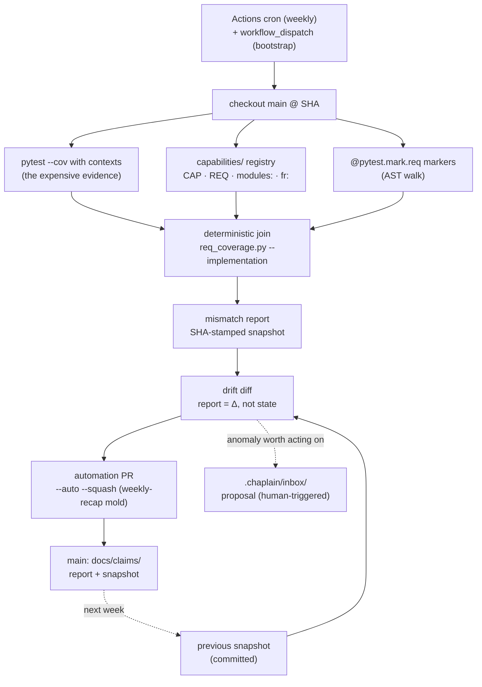

# Architecture Claims Pipeline — Planning Document

**Date:** 2026-08-21 / Copied from YAMLGraph
**Status:** Revised 2026-08-21 — review findings C1–C7 folded into the body; the review is retained below as record. Implementation FRs are repo-specific and live in adopting repositories (they own richer artifact sets: issue tracker, infra manifests, their own PR workflow).
**Scope:** Generic process design; no project-specific bindings
**Mirroring:** This plan is mirrored in two repos — `customer-service-agent-platform/docs/architecture-claims-pipeline-plan.md` and `yamlgraph/docs/2026-08-21-plan-architecture-claims-pipeline.md`. Edit both or note the divergence. Divergence: this copy carries a yamlgraph-local "Current status — 2026-08-22" section not mirrored to csap.

## Problem

Architecture documents drift. A hand-written overview is stale the moment a
PR merges, and nothing mechanical detects it: prose claims ("storage is
backend X", "component A sends messages via B") carry no anchors that a
diff can invalidate. Documents cite other documents, laundering staleness
through transitive references. Ticket boards drift from code in both
directions. The failure is structural: **we maintain a document when we
should be running a process** whose document is merely the rendered output.

## Design premise

The pipeline inverts authority. Nothing hand-written is canonical; the
canonical artifact is a **store of verified claims**, and the architecture
document (e.g. a C4 composition view) is **generated** from it. The
process has four stages with strictly separated cognitive jobs:

```
premise (constraint)                     — what the system is expected to contain
   ↓
1. EXTRACT   claims from the change stream    [LLM, per-source, stateless]
   ↓
2. PLAN      claim → verification task        [lookup table; LLM only for novel types]
   ↓
3. EXECUTE   run checks, attach evidence      [pure code: grep, render, test, API]
   ↓
4. SYNTHESIZE render the architecture doc     [LLM, grounded in verified claims only]
```

Sources for stage 1: feature requests, PR diffs and descriptions, issue
tracker state, dependency manifests, infra manifests, CI configs.

## The premise: claim identity solved at the boundary

Claim identity (is "FR-12 added library X for storage" the same subject as
"PR-90 moved storage to service Y"?) is the hard problem if solved
downstream by similarity matching. It is trivial if solved **at the entry
boundary**: the process starts from a **system premise** — a small,
human-owned ontology of expected contents (slots). Every claim binds to a
slot at extraction time.

**Typed subject keys (C2).** A bare `(slot, aspect)` pair cannot express
architecture relations: one component may call several targets over
different protocols, or use different stores per environment — those are
simultaneous facts, not successive values of one subject. Two key types:

- **Entity property:** `(slot_id, property, scope…)` — e.g.
  `(persistence.records, storage_backend, env=prod)`.
- **Relationship:** `(source_slot_id, relation, target_slot_id, scope…)` —
  scope dimensions such as environment, deployment, protocol, data class.

Binding at extraction stays O(n) — the boundary normalization survives —
but **supersession is an explicit causal assertion** ("this claim replaces
CLM-x"), validated for compatible scope, never inferred from merge time:
reverts, parallel migrations, and phased rollouts all break time ordering.
Premise amendments preserve stable slot IDs and define migrations for slot
splits and merges.

### Universal skeleton

Every software system instantiates roughly the same top-level slots:

- **ingress** — how requests/data/events enter
- **egress** — every outbound call, message, or write
- **processing** — the components that transform and decide
- **state** — what persists, where, and for how long
- **configuration & secrets** — how config and credentials reach runtime
- **identity & auth** — who may do what, enforced where
- **observability** — logs, metrics, traces, and their homes
- **deployment** — build, ship, run topology

A concrete premise instantiates these into named slots (components,
boundaries, stores). The skeleton and the "dozens of slots, O(n) binding"
scale assumption are the **first pilot hypothesis, not universal
invariants** (C6): multi-service and cross-repository systems need
hierarchy and composition, and the system-versus-repository ownership
question must be resolved before claim IDs freeze — it controls identity,
permissions, and invalidation boundaries, not just rollout configuration.
Each slot carries metadata: owner, scope, cardinality, requiredness,
lifecycle. Without declared cardinality an empty slot is ambiguous —
required, optional, intentionally absent, decommissioned, or merely
undocumented.

### Double-entry accounting

The premise is falsifiable in both directions, and both mismatches are
findings, never silently dropped rows:

| Condition | Meaning | Handling |
|---|---|---|
| Claim binds to no slot | System contains something unexpected | Discovery → premise amendment (human-reviewed PR) |
| Slot accrues no claims | Expected capability nobody asserts anything about | Interpret via the slot's cardinality/requiredness metadata; without it the flag is ambiguous |
| Same subject, incompatible verified claims, no supersession order | The system's record contradicts itself | Drift alarm — stays visible until a verifier or human resolves it |

### Two change velocities

Claims flow continuously (per PR). The premise changes rarely and only
through human-reviewed amendment — constitution vs statutes. This keeps
the LLM out of the vocabulary it binds against.

## Cold start: reconstructing the premise for an unknown system

For a system with no premise, the pipeline bootstraps by schema induction:

1. **Open sweep** — run extraction over all sources with a
   domain-agnostic prompt, the universal skeleton as the only prior.
   Claims emerge with free-text subjects.
2. **Abduction pass** — cluster free-text subjects into an induced
   ontology (the one genuinely creative LLM judgement in the pipeline),
   instantiate the skeleton slots, re-bind all claims.

The skeleton prior matters: it forces questions the sources may not
emphasize ("where is your egress? where are your secrets?"), preventing
the induced ontology from mirroring documentation bias.

**Calibration experiment (C7-revised):** choose a bounded corpus with an
explicit sampling rule — never "all sources", which would contradict the
no-backfill mitigation. A human adjudicates a gold set of slots, claims,
bindings, and expected evidence *before* scoring. Report precision,
recall, misbinding rate, unslotted rate, and verification coverage
separately. A raw diff between induced and declared ontology is a
findings queue, not an accuracy measure: a missed slot may be extraction
failure, absent source evidence, or a stale declared architecture.

## Assertions, evidence, applicability — three records, one projection

A single lifecycle (`asserted → verified → superseded/refuted`) conflates
three different things (C3). The store keeps them separate:

- **Assertions** — immutable history: source S claimed X at time T, typed
  by **modality** (C5): `planned | declared | implemented | tested |
  observed`, plus scope. An accepted FR states intent; a manifest states
  declared configuration; a rendered manifest states resolved
  configuration; a live probe states observed behavior in one environment.
- **Evidence observations** — immutable, revision-addressed: repository,
  revision, verifier ID/version, check-spec digest, observed artifact
  paths or requirement IDs, result, timestamp. Every verifier also emits
  **invalidation selectors**: artifact paths whose change voids the
  observation (C1).
- **Applicability** — a *projection* computed over assertions, evidence,
  scope, current revision, and explicit supersession:
  `current | stale | refuted | superseded | unobserved-in-scope`.
  **`stale` ≠ `refuted`**: stale means the evidence no longer covers the
  current revision; refuted means a current check contradicted the claim.

Modality also defines promotion — which evidence may promote `planned` →
`implemented` → `tested` → `observed` — and no source wins a
cross-modality conflict automatically ("tracker says Done" verifies
tracker state, not runtime behavior); conflicts stay visible until
resolved.

Document sections are projections, not stored states:

```
asserted, no promoting evidence            → "Planned work"
current                                    → "Overview" (doc body)
recent subject events                      → "Latest changes"
refuted / cross-modality contradiction     → drift alarms
```

The architecture changelog is a stream of explicit subject events
(introduced, verified, invalidated, superseded, restored) — not a section
populated from an enum value.

## Record sketch

```yaml
assertion:
  id: AST-0042
  subject:
    kind: relationship
    source: processing.teardown
    relation: writes_to
    target: state.records_volume
    scope: {environment: prod}
  modality: implemented
  text: "Records are mirrored to an object-storage volume at teardown"
  source_ref: {kind: pr, ref: "165", quote: "..."}   # binding carries evidence quote
  supersedes: AST-0017        # explicit causal assertion, scope-validated

observation:
  id: OBS-0107
  asserts: AST-0042
  repository: <repo>
  revision: abc1234
  verifier: {id: manifest-render, version: "1.2.0", check_spec_digest: "sha256:..."}
  observed: [infra/overlays/prod/deployment.yaml]
  invalidation_selectors: ["infra/overlays/prod/**", "services/records.py"]
  result: pass
  at: 2026-08-21T09:12:00Z
```

Applicability is never stored — it is recomputed from these records plus
the current revision.

## Verification templates (stage 2 lookup)

| Claim type | Verification |
|---|---|
| Dependency ("manifest links library L") | Parse the manifest |
| Egress/boundary ("component uses SDK S") | Grep + import scan |
| Deployment ("env var / volume / port configured") | Render manifests, inspect output |
| Process/intent ("tracker says X is done") | Tracker API state, cross-checked against code |
| Behavioral ("A sends payload P to B") | Execute the requirement-marked tests that witness it |

Where a test-to-requirement traceability convention exists (test markers
referencing FR/ticket IDs), stage 3 reuses it wholesale: the marked tests
are standing claim evidence, re-executed rather than re-derived.

Every verifier emits invalidation selectors alongside its result; an
observation without selectors cannot participate in the staleness path
and is rejected at write time (C1).

## LLM contract discipline

Two LLM stages, each a single judgement with closed inputs and a
validator-covered output shape:

- **Extract (stage 1):** one source document in, list of claim records
  out; schema-validated; binding must quote its evidence; low-confidence
  bindings emit `needs_human` instead of forcing a slot.
- **Synthesize (stage 4):** the factual core is rendered
  **deterministically from typed claim fields** (C4). If an LLM is
  retained for composition, it only arranges and paraphrases claim-backed
  blocks whose factual fields are supplied by code; each output block
  carries its claim IDs; facts, entities, and relations absent from the
  records are rejected. The previous rendering supplies layout and style
  only. Witnesses: mutation tests where (a) a sentence cites a real but
  unrelated claim ID and (b) the previous rendering contains a stale
  uncited fact — both must fail. A citation lint alone is a presence
  check, not entailment.

Stages 2–3 are code. The anti-pattern to refuse: one graph performing all
four stages — abstraction span explodes and validator coverage collapses.

LLM output enters the repository only via reviewable diffs (PR commits or
suggested changes), advisory until a human merge decision. An LLM that
can block a merge is an LLM inside the enforcement chain and must be
treated as adversarial input.

## Failure modes and mitigations

| Failure | Mitigation |
|---|---|
| Silent invalidation (PR removes behavior without asserting anything) | Invalidation selectors + the pre-render invalidation pass — the controlling path (C1) |
| Misbinding (claim in wrong slot) — quieter than a duplicate | Small slot count; evidence quote required; `needs_human` escape |
| Premise ossification | Unslotted claims are blocking findings that force amendment |
| Extraction flood at bootstrap (large FR/PR corpus) | No backfill: seed from one manual investigation, run incrementally per PR; history enters lazily when a new claim's subject demands context |
| Self-triggering loops (doc update re-triggers pipeline) | Skip when the diff touches only generated artifacts |
| Expensive behavioral verification | Modality ladder: `declared` checks always run; `tested`/`observed` scheduled |
| Renderer inventing facts | Deterministic factual core + mutation-test witnesses (C4) |

## Incremental operation

Per PR, **invalidation runs before extraction** (C1): map the diff's
changed artifacts against all observations' invalidation selectors;
affected observations are re-run or their claims projected `stale`. This
is the controlling path — a PR can invalidate a claim without asserting
anything (rename an env var, remove an outbound call, stop mounting a
volume), so extraction alone can never keep the store true. Then:
extract claims from the PR + its FR (small closed input), bind, verify
the cheap modalities, merge into the store, re-render, attach the
rendering diff to the PR.

Acceptance witness: seed a verified claim at revision N, then submit a PR
that changes only the implementing code and contains no architecture
prose — the pipeline must stop presenting the claim as current in that
PR's rendering.

Periodic sweep: re-execute higher-modality evidence, age out stale
verifications, re-run the double-entry accounting.

## Rollout order

0. **Spike — gate for everything below.** One repository, five manually
   entered claims (one dependency, one egress relation, one deployment
   setting, one behavioral requirement, one deliberately false),
   revision-addressed observations, then five fixture diffs: preserve,
   invalidate, supersede, scope-split, silently remove. Pass iff the
   deterministic middle assigns the expected current / stale / refuted /
   superseded projections **without reading PR prose**. No LLM anywhere.
1. Premise schema + claim schema (constraint artifacts — the irreplaceable part)
2. Seeded claim store from one manual investigation
3. Stage 3 executor (pure code) + invalidation pass + double-entry accounting report
4. Stage 1 extraction graph (per-source)
5. Stage 4 deterministic renderer (+ optional composition LLM) + mutation tests
6. Cold-start abduction pass + gold-set calibration experiment

The deterministic middle ships before either LLM end — and the spike
ships before the middle: it tests the one novel hypothesis, that a claim
store plus invalidation model can remain truer than the document it
replaces. Extraction and synthesis are deferred until that path works
end to end.

## Open questions

- Aspect/property vocabulary: fixed enum per slot type, or free-text
  normalized on first use?
- Rendering granularity: regenerate the whole document per change, or
  patch per-claim sections?
- Scope dimension set: is `environment` enough for a pilot, or are
  deployment/protocol dimensions needed from day one?

Resolved by review: evidence aging (by invalidation selector + revision,
not wall time); cross-repo ownership (must be resolved before claim IDs
freeze — pilots are single-repo).

---

## Review — 2026-08-21

**Verdict: REVISE before promotion to an FR.** The four-stage decomposition is
sound, especially the separation of extraction, deterministic verification,
and rendering. However, the current design does not yet satisfy its central
promise: detecting when a code change makes an already-rendered architecture
claim stale. The following findings are ordered by severity.

### C1 — Evidence invalidation is the missing controlling path (blocking)

The incremental flow extracts claims only from the current PR and FR. A PR can
invalidate an existing claim without asserting a replacement: rename an env
var, remove an outbound call, bypass an auth check, or stop mounting a volume.
No new claim then enters stage 1, so nothing causes the old claim to be
re-verified. A periodic sweep detects this late, not at the change that caused
the drift.

The evidence sketch also cannot reproduce or invalidate an observation. It
records a date and a prose check, but not the repository, revision, verifier
identity/version, check-spec digest, observed artifacts, or dependency
footprint.

**Required revision:** make evidence an immutable observation containing at
least repository, revision, verifier ID/version, check-spec digest, observed
artifact paths or requirement IDs, result, and timestamp. Each verifier must
emit invalidation selectors. Before rendering a PR diff, map changed artifacts
to affected observations and either re-run them or mark their claims `stale`.
`stale` must be distinct from `refuted`: the former means the evidence no longer
covers the current revision; the latter means a current check contradicted the
claim.

**Acceptance witness:** seed a verified claim at revision N, then submit a PR
that changes only the implementing code and contains no architecture prose. The
pipeline must stop presenting the claim as current in that PR's rendering.

### C2 — `(slot, aspect)` does not solve claim identity (blocking)

Binding identity at entry is the correct boundary, but the proposed key is not
expressive enough for architecture relations. One component may call several
targets over different protocols, use different stores by environment, or
have two deployments with different auth boundaries. Those are simultaneous
facts, not successive values of one `(slot, aspect)` subject. Merge time also
does not establish supersession: reverts, parallel migrations, phased rollout,
and planned-but-unshipped work all break that ordering.

**Required revision:** define typed subject keys for entity properties and
relationships. A relationship needs stable source and target slot IDs plus the
relevant scope dimensions (for example environment, deployment, protocol, or
data class). Premise amendments must preserve stable IDs and define migrations
for slot splits/merges. Supersession must be an explicit causal assertion,
validated for compatible scope, rather than inferred from timestamp alone.

### C3 — Claim state conflates assertion, evidence, and current applicability

`asserted → verified → superseded/refuted` is not one lifecycle. A source
assertion is immutable history; evidence is a set of observations at revisions;
and whether a claim is current is a projection over scope, revision, and
supersession. Conflating them loses useful states such as "asserted and refuted",
"previously verified but now stale", and "verified in staging but unobserved in
production". It also makes `superseded → Latest changes` misleading: a claim can
be superseded long after it was a latest change, or by a rollback to an older
architecture.

**Required revision:** model assertions, evidence observations, and
applicability separately. Derive the rendered status from those records. Make
the architecture changelog a stream of explicit subject events (introduced,
verified, invalidated, superseded, restored), not a section populated directly
from one enum value.

### C4 — Claim-ID citation lint does not prevent renderer invention (blocking)

The synthesis input includes the previous rendering and unspecified
"background", despite the rule that verified claims are the only factual
source. Either can reintroduce stale statements. Requiring a claim ID proves
only that a citation exists; it does not prove that the sentence is entailed by
that claim. A renderer can attach `CLM-0042` to an unsupported assertion and
pass the proposed lint.

**Required revision:** render the factual core deterministically from typed
claim fields. If an LLM is retained for composition, constrain it to arranging
or paraphrasing claim-backed blocks whose factual fields are supplied by code;
make each output block carry its claim IDs; and reject facts, entities, and
relations absent from those records. Previous output may supply layout/style
only. Add mutation tests where a sentence cites a real but unrelated claim ID
and where the previous rendering contains a stale uncited fact; both must fail.

### C5 — Source authority and modality are undefined

FRs, PR descriptions, issue status, manifests, tests, and live observations do
not make the same kind of statement. "Ticket is Done" verifies tracker state,
not runtime behavior. An accepted FR states intent; a manifest states declared
configuration; a rendered manifest states resolved configuration; a live probe
states observed behavior in one environment. Merge order cannot adjudicate a
conflict across those modalities.

**Required revision:** type every assertion by modality (`planned`, `declared`,
`implemented`, `tested`, `observed`) and scope. Define which evidence may
promote which modality and which source wins no conflict automatically. A
conflict should remain visible until a verifier or human decision resolves it.

### C6 — The premise's universal and scale claims are unproven

The proposed skeleton is a useful checklist, but its entries are concern
categories, not necessarily identity-bearing slots. "Dozens, never hundreds"
and O(n) binding are design assumptions that fail for multi-service or
cross-repository systems unless the premise supports hierarchy and composition.
An empty slot is also ambiguous without declared cardinality: it may be
required, optional, intentionally absent, decommissioned, or merely
undocumented.

**Required revision:** present the skeleton as the first pilot hypothesis, not
a universal invariant. Add premise metadata for owner, scope, cardinality,
requiredness, and lifecycle. Resolve the system-versus-repository ownership
question before freezing claim IDs; it controls identity, permissions, and
invalidation boundaries rather than only rollout configuration.

### C7 — The cold-start strategy contradicts the flood mitigation

Cold start says to sweep all sources, while the failure table says "no
backfill" and lazy history. The calibration experiment also treats differences
from a hand-written document as measurements without an adjudicated gold set:
a missed slot may be extraction failure, absent source evidence, or a stale
declared architecture.

**Required revision:** choose a bounded corpus and sampling rule for the first
experiment. Have a human adjudicate a gold set of slots, claims, bindings, and
expected evidence before scoring extraction. Report precision, recall,
misbinding rate, unslotted rate, and verification coverage separately; a raw
ontology diff is a findings queue, not an accuracy measure.

### Recommended proof before an FR

Run one narrow, non-LLM spike against a single repository and five manually
entered claims: one dependency, one egress relation, one deployment setting,
one behavioral requirement, and one deliberately false claim. Store
revision-addressed evidence, then apply five fixture diffs that preserve,
invalidate, supersede, scope-split, and silently remove those facts. The spike
passes only if the deterministic middle assigns the expected current, stale,
refuted, and superseded projections without reading PR prose.

That experiment tests the novel architectural claim here: not whether an LLM
can extract or rewrite prose, but whether a claim store plus invalidation model
can remain truer than the document it replaces. Defer extraction and synthesis
until that path works end to end.

## Note — 2026-08-21: FRs as claims; the mismatch grid (backfill candidate)

Status context: the spike (VBOT-101-A) PASSed and the advisory per-PR check
(VBOT-101-B) merged, both 2026-08-21. This note records the next-step framing.

An FR is an elaborate claim. The mapping is nearly 1:1: acceptance criterion →
assertion; witness test run → observation; blast radius → source_ref; FR
status → projection; "SUPERSEDED by" → `supersedes:`. The structural
difference: an FR is a **delta claim** ("after this change, X holds") frozen
at enforcement time, while an assertion is a **standing claim** kept live by
invalidation selectors. FR statuses never decay; assertions do — that decay is
the point. An FR is a claim proposal plus its enforcement record; the
assertion is the durable residue that should be extracted at merge time.

Test coverage is the observation layer, already half-built: every
`@pytest.mark.req(...)` marker is a candidate observation (verifier = run the
req-marked subset; selectors = files the test touches), and every FR
acceptance criterion is a candidate assertion. Infra manifests are the
observation layer for `declared`-modality claims (the kustomize verifier
already parses them statically). One subject can climb a modality ladder:
declared (FR/doc) → implemented (code scan) → tested (req-marked test) →
deployed (manifest parse).

The deliverable of a backfill is the **mismatch grid**, not the populated
store:

- **Test with no FR/assertion** → unslotted evidence: an unrecorded claim
  (extract it) or a test guarding something nobody claims (dead weight, or
  implicit doctrine deserving promotion — cf. the twilio_auth exception the
  spike tripped on).
- **FR without test** → assertion projecting `unobserved-in-scope`: a claim
  running on faith.
- Cross-modality cells: implemented-but-never-tested,
  tested-but-not-deployed, declared-but-no-code-hit. F-SILENT-REMOVE is one
  cell of this grid; the full grid is its systematic form.

The join and mismatch report stay deterministic; LLM extraction (parsing AC
prose into typed assertions) is the only LLM-dependent stage and can lag. The
human reads the two anomaly lists, not the store.

## Current status — 2026-08-22 (yamlgraph)

YAMLGraph-local section (not mirrored to csap). Records the edge audit of the
existing traceability spine read through this plan's vocabulary, and the core
steps for adoption here. Full reflection:
`docs/diary/diary-2026-08-22-the-spine-is-a-claim-store.md`.

### Where yamlgraph already stands

The spine (CAP → REQ → test → changelog, `docs/development-process.md` §4) is
already a claim store whose verification strategy is **total re-observation
per commit** rather than invalidation selectors. `stale` cannot exist on
gated edges because every commit re-runs every verifier — viable because
those verifiers are cheap, hermetic AST/YAML walks. The csap machinery
(revision-addressed observations, selectors, stale/refuted) targets the
opposite regime: evidence too expensive to re-run per commit. The two designs
are duals; adoption here means applying selector machinery **only to the
expensive edges**, not replacing the gates.

Edge audit:

| Edge | Mechanism | Verification |
|---|---|---|
| CAP → REQ | `capabilities/` registry (225 files) | Gated: id uniqueness, schema validation, `cap-architecture-sync` renders the RTM |
| CAP/REQ → FR | `fr:` field | Presence only; 23 CAPs say `fr: legacy`; FR statuses frozen at enforcement, never decay |
| REQ → test | `@pytest.mark.req` (ADR-001) | Gated both directions: `req-coverage-strict` (REQ without test) + phantom-marker detection (test citing nonexistent REQ) |
| test → code | `.coverage` contexts + AST import resolution (`req_coverage.py --implementation`) | **Advisory only** — DB not committed, not revision-addressed, degrades silently |

The weak edges are exactly the expensive-evidence edges — the
`detection_without_enforcement` pattern inside the flagship spine. Also: a
`req` marker is a citation, not an entailment (C4 in different clothes);
nothing verifies a tagged test meaningfully exercises its requirement. The
spine is modality-monochrome: every REQ implicitly claims `tested`; CAP
`modules:` bindings are declared-modality claims never reconciled against
observed coverage.

### Core steps for yamlgraph (reusing existing contents)

0. **No re-spike.** The deterministic middle is proven (csap VBOT-101-A,
   PASS 2026-08-21). The premise/assertion layer here is already populated:
   CAP files are premise slots, REQ entries are assertions, `req` markers are
   assertion→evidence bindings, `req_coverage --strict` is the accounting
   gate at HEAD.
1. **Classify edges by re-verification cost.** Cheap edges (CAP→REQ,
   REQ→test presence, both mismatch directions) keep their gates — no claims
   machinery, no regression.
2. **Re-observe the expensive edge weekly by cron — frequency replaces
   invalidation.** yamlgraph's human flow is direct pushes to main, so
   csap's per-PR advisory check (VBOT-101-B) has no trigger surface here;
   a scheduled workflow samples main regardless of how commits arrived. At
   weekly cadence, full `pytest --cov` with contexts is affordable again —
   no invalidation selectors, no observation voiding, no incremental
   machinery. The cron is the third regime alongside per-commit gates and
   selector-based invalidation: re-observe everything, weekly. Staleness
   bounded by one week — acceptable for an advisory drift report whose
   subject is drift. Local mold: `.github/workflows/weekly-recap.yml`
   (FR-821) — schedule + workflow_dispatch, concurrency group, PAT-created
   automation PR with `--auto --squash` (branch protection here exists for
   automation; gitclaw's `cron.yml` is the thinner no-commit-back variant).
   Cron is best-effort ("roughly weekly", satellite-mold diary 2026-08-19) —
   fine for this reader.
3. **Bootstrap = the first cron run, manually dispatched.** Full suite with
   coverage contexts → per-test file map → `req_coverage.py
   --implementation` + `modules:` reconciliation → mismatch report stamped
   with the producing git SHA (Scripture seed
   `artifact_carries_code_identity`), committed back via automation PR as
   the seed snapshot. Every later weekly report diffs against the previous
   snapshot, so the report shows drift, not just state.
4. **Reconcile `modules:` declarations against observations.** Declared vs
   implemented mismatch report per CAP: declared module never hit by any
   tagged test's coverage → anomaly. First cross-modality cell of the
   mismatch grid, computable from artifacts that already exist.
5. **Disposition `fr: legacy`.** 23 CAPs with unknown FR provenance — a
   triage list, not a backfill project; disposition each (link, or record
   provenance-unknown as an accepted state).
6. **Deferred: FR residue extraction at merge** (each AC → standing
   assertion with selectors). Gated on `would_you_use_this`: name the first
   reader of the mismatch report before building the extractor.

Deliverable at every step is the mismatch list, not the populated store.
Selector machinery (csap C1) stays out of yamlgraph entirely unless a
consumer needs per-commit freshness the weekly snapshot cannot give.

### Weekly re-observation flow



The gated per-commit edges (id uniqueness, req-coverage-strict,
phantom-marker detection) are not in this flow — they keep running in
pre-commit/CI and need nothing from the cron.

### Sample report (short version, envisioned)

```markdown
# Claims drift report — 2026-W40

**Snapshot:** a1b2c3d (main, 2026-10-01) · previous: 9f8e7d6 (2026-W39)
**Suite:** 1613 passed · coverage contexts: 1240 tests mapped

## Drift since last week (the part a human reads)

- NEW modules-without-coverage-hit: `utils/retry_backoff` (CAP-08,
  REQ-YG-031) — declared in registry, no tagged test touched it.
  Introduced by 6f05d33d.
- RESOLVED: `linter/patterns/subgraph` (CAP-01) — now exercised by
  test_lint_subgraph_edges (was anomalous 3 weeks).
- NEW test-without-REQ-relevance candidate: test_executor_timeout hits
  only `utils/timeouts.py`, but is tagged REQ-YG-014 (retry) — citation
  may not entail the requirement.

## Standing anomalies (unchanged, aging)

| Anomaly | Count | Oldest |
|---|---|---|
| Declared module, no coverage hit | 7 | 2026-W37 |
| fr: legacy (provenance unknown) | 23 | pre-registry |
| REQ tested by exactly one test | 41 | — |

## Totals

225 CAPs · 580 REQs · 0 REQ-without-test (gated) · 0 phantom markers
(gated) · 7/1240 declared-module anomalies (0.6%)
```

The "Drift since last week" section is the deliverable; standing anomalies
age visibly until dispositioned; totals exist to prove the gated edges stay
at zero. An empty drift section is a no-op week — the mold's no-PR path.

### Implementation FR breakdown

Four FRs, ordered so each is independently shippable and the first two have
no dependency on the claims work at all.

1. **FR: GitHub-cron automation cookbook.** Promote the pattern already
   proven three times (`weekly-recap.yml` FR-821, `daily-digest.yml` FR-819,
   gitclaw `cron.yml`) from instances to a recipe: a reference doc plus a
   template workflow whose fixed steps are repeated verbatim — `schedule:` +
   `workflow_dispatch:`, concurrency group (single-writer by construction),
   scoped PAT (PAT-created PRs trigger required checks; `GITHUB_TOKEN` PRs
   do not), checkout → setup-python → install, run payload, no-op detection
   (skip PR on empty output), automation PR with `--auto --squash`. **All
   variability is confined to the payload** — named in one place; the mold
   itself contains no LLM and no per-instance logic. **Payload contract,
   decided by one question — does the payload need an LLM?**
   - **LLM use case → the payload is a yamlgraph graph** (governed authoring
     route) with all side effects via tools; a thin deterministic wrapper
     may precede it for no-op detection so quiet runs cost zero LLM calls —
     the exact shape of `scripts/weekly_recap.py` delegating to the
     `examples/demos/recap` graph, and of gitclaw's `cron.yml` running its
     graph directly.
   - **No LLM → plain Python/shell suffices.** Wrapping a deterministic
     script in a graph is the `framework_costume` trap (<50% of nodes using
     core features = wrong tool). The claims report (2b below) is this
     branch.
   Cookbook style per the repo's own precedent
   (documenting the pattern beat implementing URL prompt loading,
   `reference/prompt-deployment.md`). Deliverable: `reference/` recipe +
   template; acceptance = a new cron automation instantiable by editing only
   the payload line and the schedule.
2. **FR: polish the existing report into usable form.** → **Filed as
   [FR-850](../feature-requests/FR-850-req-coverage-usable-form.md)** — the
   first executable step, before any new tool: `req_coverage.py
   --implementation` currently omits its own primary-path count (summary
   reports only AST/no-link), silently accepts a sysmon-poisoned coverage DB
   (Py3.14 + coverage 7.15 first-test-wins contexts — found 2026-08-22, no
   warning emitted), misfiles parametrized tests as no-link, and offers no
   anomaly-first view. Fix in place; the gated `--strict` path untouched.
   The existing report must earn its place: FR-850 carries a value-added /
   issues-learned table (AC-07) that becomes the decision input for the
   deferred drift script below.

2a. **FR: requirement-witness audit.** → **Filed as
   [FR-851](../feature-requests/FR-851-requirement-witness-audit.md)** —
   the citation-vs-entailment question (diary Addendum 4, question 7),
   tackled first because in this repo it is the *easiest*: deterministic
   constructor emits one question file per REQ (full text, tests,
   resolution class, resolved files) into `tmp/req-audit/`; a map-node
   graph batches them to a haiku-tier model for typed
   `witnessed: yes|partial|no` verdicts with improvement suggestions.
   Instantiates both payload-contract branches in one feature; graph
   authored solely via `scripts/author.sh`.

2b. **Deferred: claims snapshot + drift report script** — gated on FR-850's
   usage evidence, not filed until the polished census has taught something
   ≥2 more times. The deterministic payload, no LLM: a sibling
   `scripts/claims_report.py` reusing `req_coverage.py`'s AST/registry
   loaders (sibling chosen over extending, to keep the gated `--strict`
   path untouched) to emit (a)
   a SHA-stamped per-test coverage snapshot, (b) the `modules:`
   declared-vs-observed reconciliation, (c) the drift diff against the
   previous committed snapshot, (d) the three-part report above. Bootstrap
   semantics in the same FR: no previous snapshot → emit seed snapshot,
   report is state-not-drift, exit no-op-false so the first PR commits the
   baseline. Testable entirely offline with fixture snapshots (the csap
   spike's fixture-diff method).
3. **FR: instantiate the cron for claims.** Apply FR-1's cookbook with
   the drift script (2b) as payload: weekly schedule, `workflow_dispatch`
   for the bootstrap run, output committed to `docs/claims/` via automation
   PR. Should be a near-trivial FR — if it isn't, FR-1's recipe failed its
   own acceptance criterion.
4. **FR: `fr: legacy` disposition.** Consume the first real report: triage
   the 23 unknown-provenance CAPs (link an FR, or record provenance-unknown
   as accepted), plus disposition of the initial declared-module anomalies.
   Pure registry edits; the report is the input, the shrunk standing-anomaly
   table is the witness.

Deferred (unnumbered until `would_you_use_this` is answered by FR-4's
triage experience): FR-residue extraction at merge — each AC becoming a
standing assertion. The first four FRs need no LLM anywhere.
