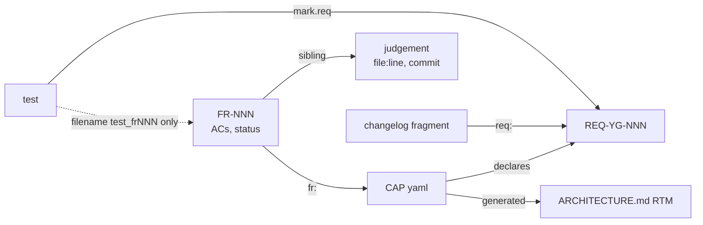

# Process Fit for a Completely New Domain

**Date:** 2026-10-10
**Question:** How well does the YAMLGraph development process fit a completely new
domain (example: a game engine) — independent of YAMLGraph as a technology?
**Scope:** process and artifacts only. Counts measured on the working tree 2026-10-10.

---

## 1. The process today: four modes, one governed

| # | Mode | Unit | Artifacts (count) | Governance |
|---|---|---|---|---|
| 1 | **Feature increment** | feature (`FR-NNN`) | 1022 FRs, 267 judgements, 265 CAP files, 434 active REQs, 6803/6930 tagged tests, changelog fragments | full: judge, four enforcement rings, traceability |
| 2 | **Research** | question | 29 `docs/*research*.md`, `FR-*.research.md`, `scripts/research.sh` (FR-890) | only as FR input: the FR's `**Research:**` field must link it |
| 3 | **Spike / throwaway prototype** | hypothesis | 4 `docs/spikes/`, `scripts/spikes/` | none of its own |
| 4 | **Domain / product exploration** | product or domain | 45 `examples/`, 68 `docs-planning/` | demo-gate only |

1. **Feature increment** — one well-defined feature at a time; spec frozen before work,
   independently judged, traced CAP → REQ → test → changelog, gated at every ring. Works
   well for bounded, gap-filling work.
2. **Research** — exists only to feed an FR. A "don't build" or domain-map conclusion has
   no place to land.
3. **Spike** — probe + raw output, but no timebox, no verdict field, no mandatory disposal.
   Findings and code outlive their purpose (the command book records FR-1001 shipping
   "without a disposition of spike 2").
4. **Exploration** — no ID, no status, no record of what was learned, no provenance grading;
   versioned by filename (`image_pipeline_v2/v3`, `plan-impl-agent-v2/v3/v4`,
   `reference_driven_story_generation_plan-5`).

### 1.1 Traceability models features, not knowledge

The spine has slots for feature, requirement, test, change. It has none for **question,
hypothesis, finding, decision, or abandoned direction** — the outputs of modes 2–4.

Known gaps even inside mode 1:

- `req_coverage.py --strict` checks REQ → test (434/434), not that a tagged test exercises
  its REQ.
- Acceptance criteria frozen by the judge are not traced to tests; tests are tagged at REQ
  granularity (~16 tests/REQ).
- Lifecycle state is convention: "done" is spelled `implemented` / `enforced` / `completed`
  / `✅`; 193 of 265 CAP files have no `status:`.

---

## 2. Fit per mode for a new domain

A new domain traverses the modes **in order** — research → spikes → exploration →
features — with each subsystem graduating to feature mode as it stabilizes. The current
process governs only the last step, the one a new domain reaches last.

### Mode 1 — Feature increment: wrong entry point, right end state

- Needs a freezable spec plus doctrine, code, and prior art for the judge. A new domain has
  none: early FRs freeze guesses, and the judge approves them on internal consistency.
- CAP/REQ IDs churn; coverage, size, and entropy gates tax code meant to be thrown away.
- Fits once a subsystem is stable (interfaces settled, performance budget known). Even
  then, perceptual qualities (rendering, game feel, frame pacing) need **non-test
  witnesses** — benchmarks, golden images, replays, playtest records — which the process
  has no slot for.

### Mode 2 — Research: the right entry mode, currently subordinate

- In a new domain research comes first and is largest: prior art (existing engines,
  post-mortems), core design decisions (e.g. ECS vs OO, fixed vs variable timestep,
  scripting model), risk questions with expected answers written before investigation.
- Must stand alone: question → analysis → decision. "Don't build" and "build differently"
  are valid outcomes.

### Mode 3 — Spike: the main learning engine, least governed

- Each high-risk question becomes a hypothesis tested by a timeboxed probe.
- A new domain needs dozens. Without timebox, verdict, and disposal, spike code becomes
  the product by drift, and refuted findings — the most valuable output — are lost.

### Mode 4 — Exploration: where a new domain lives longest, with no contract

- A vertical slice (one small, complete, playable thing) tests integration.
- With filename versioning and no provenance grading, the plan series becomes an
  unagreed canon (`plan_as_canon`), and the slice becomes the product without a decision.

---

## 3. Fit per process element

| Element | Fit in a new domain | Why |
|---|---|---|
| Frozen-spec FR | poor early, good late | spec unknowable before spikes |
| Independent judge | weak early | nothing in-repo to judge against; model falls back on generic domain knowledge |
| TDD RED → GREEN | split | fits deterministic core; not perceptual/emergent behaviour |
| CAP/REQ traceability | premature | requirements do not exist yet |
| Gates (coverage, size, entropy) | wrong early | language- and maturity-specific; tax throwaway code |
| Worktree / PR / CI per change | costly early | fixed overhead suits steady increments, not fast probe loops |
| Diary → Scripture loop | transfers best | domain-independent; most valuable when learning rate is highest; content starts empty |
| Author/judge separation, operator verdicts, boundary law | transfer | method, not content |

### Risk inversion

In a known domain the agent is grounded by code, prior FRs, and Scripture. In a new
domain it has no grounding, so `continuation_bias` and `plan_as_canon` peak exactly when
the judge is weakest. The guard must come from outside the repo: external prior art, raw
spike output (`read_raw_output_first`), and provenance-graded operator decisions.

---

## 4. What a new domain needs

### 4.1 One contract per mode

| | Research | Spike | Exploration | Feature |
|---|---|---|---|---|
| ID | Q-NNN | SPK-NNN | EXP-NNN | FR-NNN |
| Written before | question + expected answer | hypothesis + timebox | domain + stopping rule | ideal result + ACs |
| Output | analysis | raw output + verdict | decision + findings | code + tests |
| Witness | cited sources | probe + raw output | runnable slice | tagged tests, non-test witnesses |
| Disposal | n/a | code deleted, finding kept | slice → reference example or retired | retire step |
| Feeds | Q / SPK / FR / kill | FR / kill | FRs / new product / kill | CAP/REQ |

### 4.2 A graduation rule into feature mode

A subsystem enters feature mode when:

1. its interface is stable across at least one exploration iteration,
2. alternatives are refuted and recorded (SPK verdicts),
3. a vertical slice exercising it runs.

Gates and CAP/REQ are applied per subsystem at graduation, not repo-wide at day 0.

### 4.3 Provenance grading for plans

Every plan detail is graded: operator's words / accepted artifacts > bulk-approved >
model-only. Analysis runs on the top tier; lower tiers are options, not constraints.

### 4.4 Non-test witnesses

Benchmarks, golden outputs, replays, and playtest records need a traceable slot beside
`mark.req`, or perceptual requirements stay untraced.

---

## 5. Conclusion

The process transfers at the **method** layer — author/judge separation, diary loop,
boundary normalization, TDD for the deterministic core, operator verdicts — but not at the
**content** layer: its strength is accumulated doctrine, gates, and capability registry,
all of which start empty in a new domain. Without contracts for research, spikes, and
exploration, a new domain is either forced into the FR shape too early (ceremony freezing
guesses) or bypasses the process entirely — the repository's own record already shows the
latter (83% direct pushes, May–July 2026).

**Seed:** if each mode had its own ID and exit criterion, would the traceability spine
extend backwards — FR → EXP → SPK → Q — so that every feature could cite the question that
justified it and the alternatives that were refuted?
