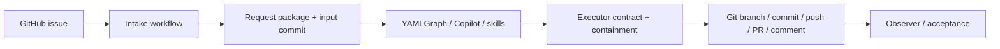
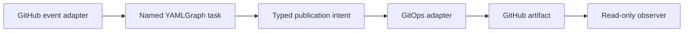

# GitClaw Architecture Shape-Loss Analysis

**Date:** 2026-08-21
**Subject:** `sheikkinen/gitclaw` at `69fc2ce`
**Evidence:** repository inventory/history, FR-845 through FR-849, and live issue
`#4` / Actions run `32443301071`

## Conclusion

The operator diagnosis is correct: GitClaw has lost its architectural shape.
The problem is not primarily module size. It is that no document names the
owners of intake, reasoning, artifact authority, Git publication, scheduling,
and observation. In that vacuum, every incident added a local gate where the
symptom appeared. The result is a second orchestration system around YAMLGraph.

GitClaw's README describes behavior and trust assumptions. The control-bundle
trace describes mirrored-file provenance. Neither is architecture: neither
defines component responsibilities, allowed dependencies, state transitions,
or the end-to-end event chain. The implementation therefore became the only
architecture record, and tests froze each local reaction as policy.

## Measured Shape

The current YAMLGraph executor is 45 lines. Its generic prompt is 72 lines.
Around that sit 966 lines on the issue-to-publication path:

| Surface | Lines | Current responsibilities |
|---|---:|---|
| `intake.yml` | 140 | trust gate, environment install, command dispatch, PR fetch, request creation, reference staging, Git commit, credential setup, graph invocation, verification, publication |
| `executor_contract.py` | 244 | command grammar, path grammar, Git status expansion, content gates, authority classification, report creation, authoring-report promotion |
| `executor_publish.py` | 125 | branch selection, staging, commit, Git authentication, push, PR lookup/create, issue comment |
| `request_contract.py` | 178 | issue schema, canonical JSON, size bounds, path creation, hashing, atomic write, full revalidation |
| `reference_assets.py` | 211 | issue-body parsing, Git provenance, file policy, copy/staging, manifest generation, hashing, verification |
| `contain.py` | 43 | platform and authority path policy |
| `slug.py` | 25 | issue-derived naming |

The focused tests add 1,230 lines. The acceptance script adds another 291-line
lifecycle orchestrator. Non-mirrored production/orchestration measured in the
audit totals 1,773 lines. These counts are not defects by themselves; the ratio
is the signal. The framework graph is 2.5% of that measured surface.

Cron was the clearest earlier witness. Scheduling one graph had expanded into a
439-line runtime plus 563 focused test lines because cron discovered tasks,
injected inputs, interpreted state, composed dependencies, rendered output, and
published Git. FR-847 restored one owner: cron schedules; the task owns behavior.
The same ownership correction has not yet reached issue intake.

## The Missing Architecture

The system currently has five implicit components but only three named ones.

Only Issue, YAMLGraph, and PR are visible in the product story. Request
packaging, contract reconciliation, publication, and observation evolved as
implementation details. They now make product decisions without an architecture
contract.

The missing document would have needed to answer:

1. Who owns interpretation of an issue command?
2. Is an issue itself the immutable request, or must it become a repository
   artifact?
3. Which artifacts constitute authority for each operation?
4. Who may inspect artifact semantics: the skill, the model, or deterministic
   code?
5. Does intake own Git commits, or does a GitOps component receive a publication
   intent?
6. What partial side effects are possible, and who reconciles them?
7. Is acceptance an observer or another lifecycle orchestrator?

Because these questions were unanswered, the code answered them repeatedly and
inconsistently.

## Mixed Intake and GitOps

The intake workflow is the central composition defect.

It first writes `features/issue-<n>-<run>/request.json`, commits that request to
the local checkout, and records the commit as `INPUT_HEAD`. The agent then edits
the same working tree. The publisher switches a branch from that history,
commits verified output paths, pushes, creates a PR, and comments on the issue.

This mixes three different responsibilities:

- **intake:** receive and authorize an event;
- **execution:** produce an operation result; and
- **GitOps:** publish an already-decided result.

The live FR-849 RED made the coupling visible. Plan generated and verified an FR
plus judgement. Publication then:

1. created branch `gitclaw/issue-4-plan`;
2. committed the two authority files;
3. pushed commit `a4076a9`; and
4. failed while creating the PR.

The branch comparison against `main` contains three files: request, FR, and
judgement. The request belongs to intake provenance but leaked into the product
PR because intake and publication share Git history. The desired plan-only
contract was already impossible before the publisher ran: current Plan requires
both FR and judgement.

The publisher is also non-transactional by construction. Push succeeds before
PR creation; issue comment follows PR creation. A later failure leaves an
orphan branch and an uncommented issue. No component owns reconciliation. The
failure is not an edge case around otherwise atomic behavior; it is the normal
side-effect order.

The repository settings exposed another undocumented architecture dependency:
Actions are enabled, but default workflow permissions are read and pull-request
approval permission is false. GitClaw's workflow requests write permissions and
assumes branch/PR/issue publication will work. That platform precondition lives
neither in architecture nor as a startup check. It appeared only after the
branch was pushed.

## Invented Quality Gates

The deterministic gates are not all useless. They are locally rational. The
problem is that they became a shadow specification and are placed inside the
wrong owner.

### Command grammar

`executor_contract.py` interprets exact English titles with regex. This makes a
presentation detail the lifecycle API. Adding Judge, Test, or Run requires
changing a parser, workflow outputs, prompt behavior, verifier, publisher, and
tests. The grammar does not merely validate a command; it defines the product
state machine without documenting one.

### Artifact content filters

Plan verification checks required Markdown headings and a request hash.
Judgement verification checks for a verdict line. Review verification requires
an exact first-line merge verdict and exact filename. These checks duplicate
the feature-request, judge, and review skills, but with weaker semantics. A file
can satisfy headings and still be a bad plan; a correct artifact can fail due to
format drift. Shape checks became authority checks.

### Path containment

Containment forbids broad path classes after generation. This protects the
happy-path publisher from accidental staging, but it is explicitly not a
sandbox against the model. It cannot stop network exfiltration or direct GitHub
actions by a malicious process. Its cost and assurance are mismatched: it is
strict enough to block legitimate platform evolution while too weak to enforce
the stated threat boundary.

### Immutable request package

Canonical JSON, strict key sets, path bounds, byte bounds, duplicate-key
rejection, hashing, and repeated verification provide strong accidental-drift
protection. But the system already trusts the issue author and GitHub event. The
package's repository commit creates more lifecycle coupling than the hash
removes. The issue and run identifiers already provide immutable platform
provenance; GitClaw invented a second record and then had to protect it.

### Reference assets

The reference channel has its own mini artifact system: exact issue syntax,
tracked-clean checks, file counts, byte limits, reserved names, temporary copy,
manifest, hashes, and revalidation. It is 211 lines before tests. There is no
current retained reference example or named acceptance consumer. This is a
capability-shaped quality gate without a demonstrated product workflow.

### Executable control bundle

The bundle has a legitimate goal: agents need the real skills and adapters, not
summaries. But GitClaw copied YAMLGraph's entire doctrine and enforces byte/mode
closure through a local verifier. This imports framework governance into a demo
repository and makes updating the agent runtime a manifest-management problem.
The bundle is provenance infrastructure, not application architecture, yet it
is the best-documented part of the repository.

## The Acceptance Script Repeated the Pattern

The agent response to missing lifecycle acceptance was to write 291 lines of
shell. It performs repository validation, token policy, workflow correlation,
issue creation, polling, log capture, PR discovery, changed-file validation,
authority merging, phase summaries, skip propagation, and semantic output
inspection.

That is not merely a test script. It is a third lifecycle implementation:

1. the intended product lifecycle;
2. the workflow/Python shadow lifecycle; and
3. the acceptance shell lifecycle.

This was my repetition of the cron mistake. I treated every uncertainty as a
guard to add rather than evidence that the product lacked one stable operation
contract. The script became long because it had to reconstruct state from issue
comments, workflow titles, branches, and PR diffs. A coherent architecture
would expose those phase results directly; the observer would remain small.

The script's own first failure was interactive `gh run watch`, which had to be
replaced with API polling before the product RED could be observed. Again, the
observer began acquiring runtime responsibilities.

## What Remains Essential

The analysis does not imply removing every deterministic boundary. Four are
load-bearing:

1. **Trusted trigger:** decide who may spend credentials and inference budget.
2. **Credential separation:** the reasoning process must not receive repository
   write authority; Git publication remains deterministic.
3. **Explicit operation artifacts:** each operation must name its required
   input and produced output, including PR/head identity where relevant.
4. **Human merge authority:** generated implementation is not automatically
   merged.

Everything else must justify itself as part of one of those boundaries. A gate
that checks Markdown formatting, duplicates a skill, packages already-trusted
input, or reconstructs lifecycle state from incidental text is suspect.

## Architectural Direction, Not Plan

No implementation is proposed here. The shape suggested by the evidence is:

- The event adapter authorizes and translates; it does not commit files.
- A named YAMLGraph task owns one operation and its semantic artifacts.
- The task returns a typed publication intent rather than leaving arbitrary
  working-tree state for a scanner to interpret.
- GitOps owns branch/commit/push/PR/comment and partial-side-effect
  reconciliation.
- Acceptance observes typed outcomes; it does not reproduce lifecycle logic.

Whether this exact shape is adopted requires a separately researched and judged
feature request. The immediate conclusion is narrower: adding more gates to the
current composition will deepen the loss of shape.

## Decision

GitClaw should be considered architecture-incomplete, not feature-incomplete.
The next corrective work should begin with an architecture document that freezes
owners, operation contracts, and allowed dependencies before any parser,
publisher, acceptance, or lifecycle feature is repaired.

Until then:

- do not add lifecycle commands;
- do not repair the publisher in isolation;
- do not add acceptance-script gates;
- do not infer architecture from current tests; and
- preserve issue #4 / run `32443301071` / branch `gitclaw/issue-4-plan` as the
  raw composition witness.
