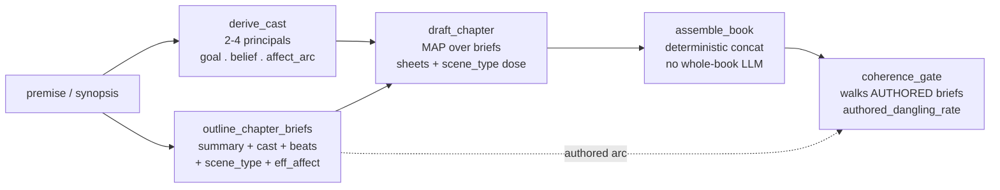

# Architecture — The Walking-Skeleton Generation Process

**Status:** Design of record for the plot_modeller round-trip skeleton (FR-610..615).
**Scope:** how a synopsis becomes a multi-chapter draft, and how the draft is measured for
coherence, built thinnest-loop-first.
**Authoritative sources:** the feature requests `feature-requests/FR-610..615`, the phased build
order in `examples/plot_modeller/docs/plan-roundtrip-phased.md`, the build spec in
`examples/plot_modeller/docs/plan-roundtrip-skeleton.md`, and the destination architecture in
`examples/plot_modeller/docs/plan-generative-roundtrip.md`.

---

## 1. Why a walking skeleton

The prior modelling effort was **bottom-up**: build layers L1–L7, perfect each in isolation, grade
each on recall. L7 (affect throughline) stalled AMBER-RED for weeks — **because it was graded
alone**, with no downstream artifact to show what its misses cost.

The walking skeleton inverts the order. Build the **thinnest loop that runs end to end** —
synopsis → characters + chapter briefs → prose → assembled book → coherence number — then thicken
only the one stage the end-to-end output proves is dropping signal. The skeleton is not a demo; it
is the **instrument** that says which lane to fix next. Every phase ends on a runnable graph and a
gradeable artifact, never on "it compiles."

Two structural commitments fall out of this:

- **All flow lives in YAML.** One graph file, `graphs/roundtrip_skeleton.yaml`, run via
  `yamlgraph graph run` — no Python pipeline driver. Python appears only in leaf tools.
- **scene_type is authored, not recognised.** A chapter brief is an artifact we write, so the
  control axis that decides emotional dose (`scene_type: proactive | reactive`) is **declared** on
  the brief, not classified back out of finished prose. This sidesteps the recognition problem that
  blocked the bottom-up path entirely.

---

## 2. The generation process



The pipeline is a single LangGraph compiled from YAML. Reading left to right:

1. **`derive_cast`** (LLM) — from the synopsis, name 2–4 principals and author an **interiority
   sheet** for each: `{name, goal, belief, affect_arc}`. This is the A/B-validated character model
   from the interiority falsification experiment.
2. **`outline_chapter_briefs`** (LLM) — split the synopsis into ordered **chapter briefs**. Each
   brief is the load-bearing object of the whole system (Section 3).
3. **`draft_chapter`** (LLM, **map** node) — fan out over the briefs; draft each chapter from its
   brief + the cast sheets for its characters + a **scene_type affect-dose clause** (proactive →
   interior sparingly, feeling spent in action; reactive → interior foregrounded). Fan in to
   `chapter_drafts`.
4. **`assemble_book`** (Python leaf) — concatenate `chapter_drafts` in explicit `chapter_id` order
   into `book`. Deterministic, **no whole-book LLM call** (the FR-492 discipline).
5. **`coherence_gate`** (Python leaf) — the measurement that makes the skeleton a test harness
   (Section 4).

---

## 3. The data objects

### Character interiority sheet (the "who")

Per principal, authored once from the synopsis and fed to every chapter the character appears in:

```yaml
name: Mara
goal:   <what she is trying to achieve>
belief: <the conviction that shapes her choices>
affect_arc: <the emotional movement across the book>
```

### Chapter brief (the "what + how")

The brief is dungeon_master's `chapter_outline` object — already a near-complete contract —
**plus two authored fields** the skeleton adds:

```yaml
chapter_id: 3
title:   "Chapter 3 — The Drive in Her Bag"
summary: <one paragraph: events, where it leaves off>
cast:    [Mara, Jonas]              # focal principals (inherited)
beats:   [...]                      # 3-6 ordered key events (inherited)
entry_state: <config true as it opens>   # hand-off contract (inherited)
exit_state:  <config true as it closes>  # hand-off contract (inherited)
scene_type:  reactive               # ADDED: proactive | reactive (authored)
eff_affect:                         # ADDED: authored affect open/close ops
  - {op: open,  char: Mara, kind: guilt}
  - {op: close, char: Mara, kind: guilt}
mode: dialogue                      # ADDED (optional): action|dialogue|feeling|thought
```

- `scene_type` drives the emotional dose in `draft_chapter` (Swain's proactive/reactive taxonomy).
- `eff_affect` is the authored emotional arc of the chapter — the list of feelings opened and
  closed. **It is what the coherence gate walks.** This is the dungeon_master `eff_affect` model
  (`docs/v5/genre-plots/*.yaml`), lifted to the chapter level.

The inherited `entry_state`/`exit_state` give a hand-off contract between consecutive chapters for
free; the inherited `beats` give a completion checklist; the new fields give the affect-control and
affect-measurement axes.

---

## 4. The coherence-measurement architecture (the load-bearing decision)

A skeleton without a gradeable output is a demo. The gate is what makes it a harness. The central
design decision — **what does the gate measure?** — was resolved deliberately, because it determines
where every later fix lands.

### Decision (a): measure the authored plan, not the prose

The gate measures the **authored briefs' affect arc** — it walks the `eff_affect` open/close ops the
briefs carry and reports how many opens never close. It does **not** run an LLM classifier over the
generated prose.

```
authored_dangling_rate = unclosed authored opens / authored opens   (split by scene_type)
```

The reuse is `validators/affects.py` `check_affect_closure(PlotPlan, order)` (FR-571) — a
deterministic open/close pop-walk that already exists.

**Why (a) and not "classify the prose":** measuring the plan keeps the gate **deterministic and
judge-free**, and — critically — it keeps the eventual fix off the **shared** affect classifier
`affect_throughline.yaml`, which baselines the prior affect-arc work. The two questions are split
cleanly across phases:

| Question | Where it is answered |
|---|---|
| Is the **plan** internally balanced? (every opened feeling is closed) | **P3** — `coherence_gate`, deterministic, over the authored briefs |
| Does the **prose** honor the plan? (the authored close is actually delivered) | **P5** — `classify_affect_prose`, comparison side, off the critical path |

This naming discipline matters: the P3 number is **authored-plan closure**, *not* "dangling opens in
the book." Calling it the latter would claim a prose property the gate never checks.

### The located root cause this measures

The affect close-op is **proactive-only**. `affect_throughline.yaml` defines closure in purely
action terms — *"a resolution beat shows a forceful or positive action that ENDS an earlier negative
feeling."* A feeling resolved by **recognition, naming, or decision** (a *reactive* close, in
dialogue or thought) matches nothing, emits no close, and the open dangles. So **reactive chapters
dangle by construction**. `scene_type` is the missing *input* to the close decision, not a cosmetic
tag.

Under decision (a) the fix is an **authoring-rule** change: for `scene_type == reactive`, the brief
author may emit a recognition/decision `close` op. It is applied to the **roundtrip-local** authoring
prompt, never to the shared classifier — so the prior baselines are untouched and the blast radius is
zero.

**The tautology guard (the binding criterion).** Under decision (a), P4 edits the very rule that
authors the metric — so `authored_dangling_rate` falls *by fiat*: instruct the author to emit reactive
closes and the number drops whether or not the prose delivers a single one. The rate proves
**emission, not fidelity** (a textbook plausible-wrong-answer: it passes the shape check, semantically
empty). The binding success criterion is therefore the **paired** result, recorded *both or neither*:
the rate falls **AND** every new reactive close is witnessed deliverable in the prose (the K≥5 raw
read). A bare rate win is forbidden. P5 mechanizes this cross-check across all chapters; until it lands
the manual K≥5 read is the sole, HARD guard — which is why **P5 is not truly optional** for the
skeleton to make an honest fidelity claim.

---

## 5. High-level implementation: reuse map

The skeleton is mostly **wiring proven assets**. Only the brief's two new fields and one new
validator are net-new.

| Stage | Reused from | Concrete asset |
|---|---|---|
| Spine shape (synopsis → units → map-prose), pure `graph run`, no runner | `demos/novel_generator` | `graph.yaml` (map node + gates, ~130 lines) |
| Character sheets | `plot_modeller` interiority A/B | `graphs/interiority_ab.yaml` `derive_cast` + `prompts/interiority/interiority_sheets.yaml` |
| Chapter briefs (90% of the object) | `dungeon_master` | `prompts/chapter_outline.yaml` |
| Authored affect arc on the brief | `dungeon_master` `eff_affect` model | `docs/v5/genre-plots/*.yaml` |
| Per-chapter prose (map fan-out) | `demos/novel_generator` | `prompts/prose/generate_beat.yaml` |
| Deterministic assembly (no whole-book LLM) | `dungeon_master` Book compose | FR-492 pattern → new leaf in `nodes/tools.py` |
| Affect-closure walk | `plot_modeller` validators | `validators/affects.py` `check_affect_closure` (FR-571) |

Models: writers run on **haiku**; only judge / gate-LLM nodes (none on the P0–P4 critical path) get
`claude-sonnet-4-6`.

---

## 6. Build order (phases → FRs)

Each phase produces a runnable graph and a gradeable artifact; each is the authority gate for its
work (see the per-phase FR for acceptance criteria and Judgement).

| Phase | FR | Produces | Gradeable signal |
|---|---|---|---|
| **P0** scaffold | FR-610 | lint-green stub loop; `briefs` state reserves `scene_type` + `eff_affect` | `graph lint` passes; END reached; `assemble_book` really concatenates |
| **P1** cast + briefs | FR-611 | real sheets + briefs carrying authored `scene_type` **and** `eff_affect` | every brief has both fields; scene_type labels match summaries |
| **P2** draft + assemble | FR-612 | scene_type-dosed chapters, deterministically assembled `book` | readable book; **visible** (not yet validated) dose contrast |
| **P3** coherence gate | FR-613 | `authored_dangling_rate` baseline, split by scene_type | first number — the baseline P4 must move |
| **P4** authoring-rule fix | FR-614 | reactive close branch in the roundtrip-local authoring prompt | **paired**: reactive `authored_dangling_rate` falls AND each new reactive close witnessed in prose (K≥5); proactive stable; a bare rate win is not a pass |
| **P5** round-trip closure (deferred) | FR-615 | `reconstruct_synopsis`, `roundtrip_diff`, prose-vs-plan + scene_type preservation checks | reconstruction fidelity; prose honors the plan |

**Topology freeze:** P0 freezes the **spine** (premise → cast → briefs → draft-map → assemble →
gate). Later phases may add nodes **off the critical path** (P5's `reconstruct_synopsis` /
`roundtrip_diff`) without violating the freeze.

**Stop point:** after P3 yields a real baseline, re-read the gate before committing to P4 as the lane
to thicken — the skeleton exists precisely so that decision is made on a number, not an intuition.

---

## 7. The throughline in one sentence

A synopsis is expanded into authored characters and chapter briefs that **declare** their emotional
type and arc; the briefs drive both the prose (dose) and a deterministic coherence gate (closure);
the gate measures the **plan**, the deferred round-trip measures whether the **prose** honors it —
and the whole thing is one YAML graph that grows one gradeable node at a time.
