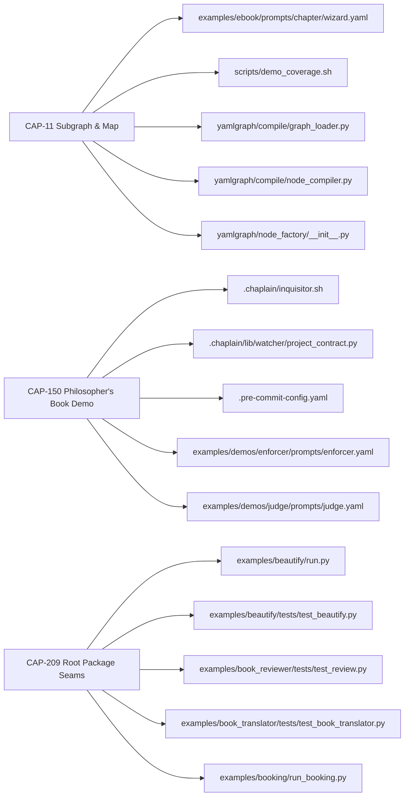
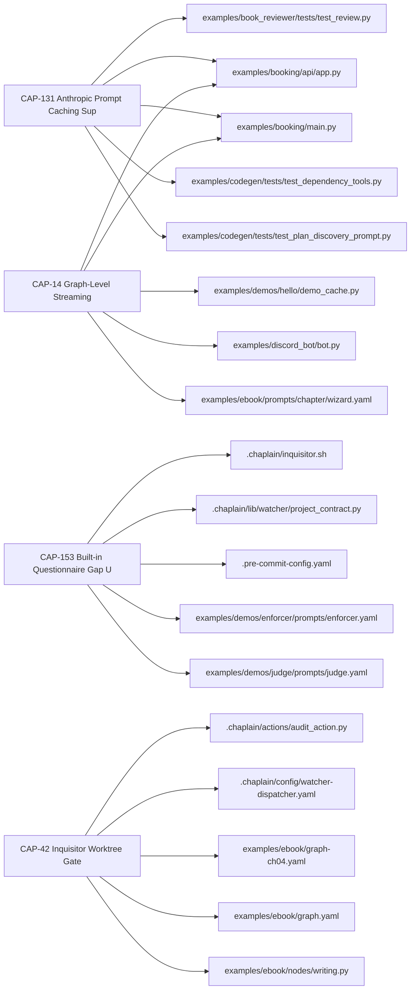
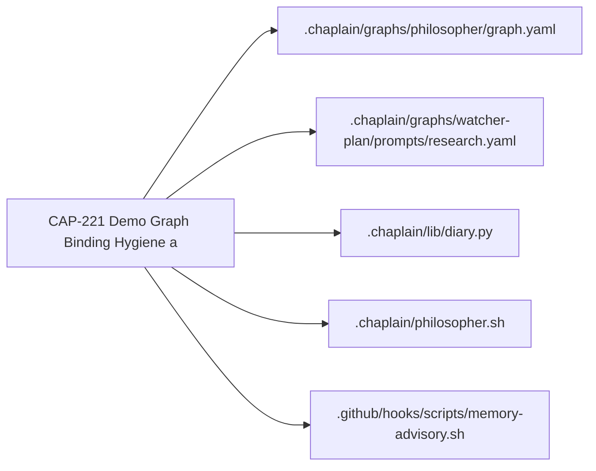
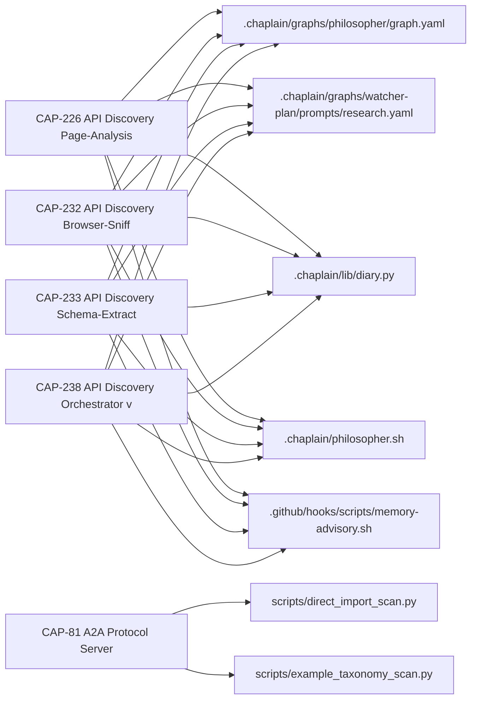
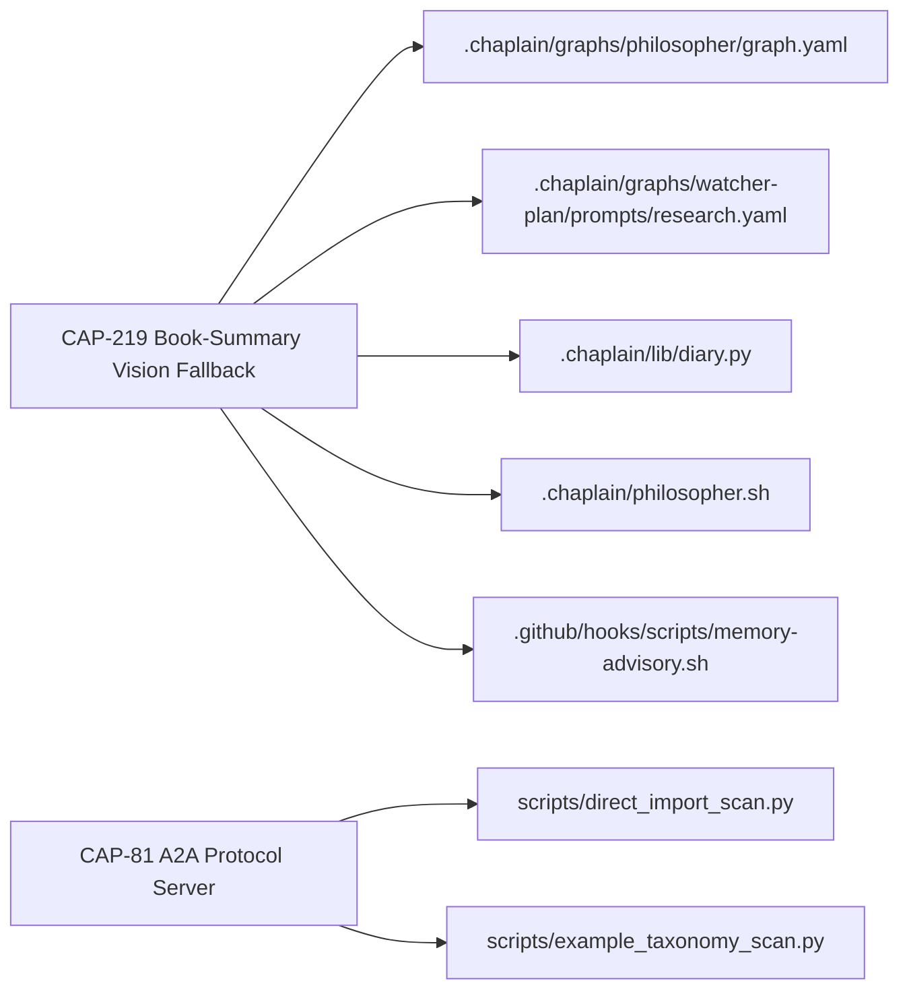
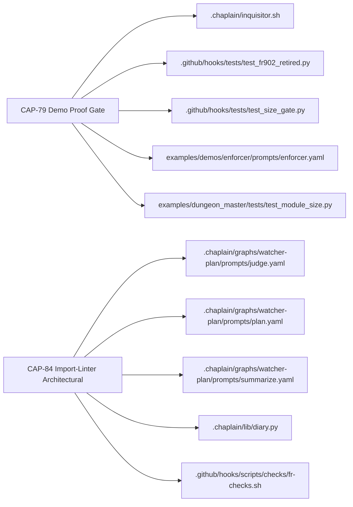
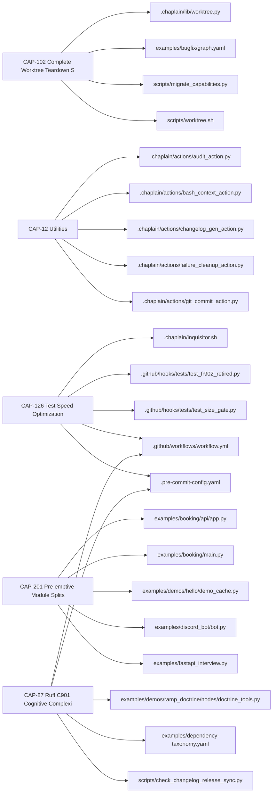

# CAP Journey Census Ledger

- rows: 30  judged: 25  row_failed: 5  abstained: 0
- model: claude-haiku-4-5  git_sha: a3945008  prompt: judge_cap.v1
- canary misses: 5 — CAP-131: consumer_cited 'examples/demos/prompt-caching/graph.yaml' misses ['llm_factory', 'executor_base', 'prompts']; CAP-203: row_failed (evidence_span is not a substring of the CAP yaml or FR head); CAP-11: journeys ['author_graph'] miss ['run_operate', 'census_classify']; CAP-11: consumer_cited 'yamlgraph/compile/node_compiler.py' misses ['corpus_census', 'diary_census', 'person_profile_census', 'repo_census']; CAP-108: row_failed (evidence_span is not a substring of the CAP yaml or FR head)

## Journey × CAP matrix

| journey | CAPs | keep | extend | retire | contested |
|---|---:|---:|---:|---:|---:|
| author_graph | 6 | 5 | 0 | 0 | 1 |
| run_operate | 4 | 4 | 0 | 0 | 0 |
| debug_observe | 1 | 1 | 0 | 0 | 0 |
| integrate | 5 | 4 | 0 | 0 | 0 |
| serve_embed | 3 | 1 | 0 | 0 | 0 |
| census_classify | 0 | 0 | 0 | 0 | 0 |
| govern_process | 2 | 2 | 0 | 0 | 0 |
| audit_comply | 0 | 0 | 0 | 0 | 0 |
| conversational_app | 0 | 0 | 0 | 0 | 0 |
| none_internal | 5 | 5 | 0 | 0 | 0 |

off-catalog labels: none

## Disposition table

| CAP | name | disposition | effective | extend_to | consumer_cited | anchor violations |
|---|---|---|---|---|---|---|
| CAP-142 | Skill Export Portable Packaging | already_retired | already_retired | - | - | - |
| CAP-81 | A2A Protocol Server | already_retired | already_retired | - | yamlgraph/discovery.py | - |
| CAP-150 | Philosopher's Book Demo | keep | contested | - | examples/demos/philosopher_book/graph.yaml | keep without a consumer from the mechanical list |
| CAP-102 | Complete Worktree Teardown Self-Heal | keep | keep | - | yamlgraph/utils/worktree_helpers.py | - |
| CAP-11 | Subgraph & Map | keep | keep | - | yamlgraph/compile/node_compiler.py | - |
| CAP-12 | Utilities | keep | keep | - | .chaplain/actions/audit_action.py | - |
| CAP-126 | Test Speed Optimization | keep | keep | - | .github/workflows/workflow.yml | - |
| CAP-131 | Anthropic Prompt Caching Support | keep | keep | - | examples/demos/prompt-caching/graph.yaml | - |
| CAP-14 | Graph-Level Streaming | keep | keep | - | yamlgraph/cli/graph_commands.py | - |
| CAP-153 | Built-in Questionnaire Gap Utilities | keep | keep | - | examples/demos/enforcer/prompts/enforcer.yaml | - |
| CAP-184 | Novel Fandom Duplicate Entity Prevention | keep | keep | - | examples/novel_fandom/nodes/persist_genesis.py | - |
| CAP-201 | Pre-emptive Module Splits | keep | keep | - | yamlgraph/executor_async.py | - |
| CAP-209 | Root Package Seams | keep | keep | - | yamlgraph/compile/__init__.py | - |
| CAP-219 | Book-Summary Vision Fallback | keep | keep | - | examples/demos/book-summary/tools.py | - |
| CAP-221 | Demo Graph Binding Hygiene and Grounded  | keep | keep | - | .chaplain/graphs/philosopher/graph.yaml | - |
| CAP-226 | API Discovery Page-Analysis Step | keep | keep | - | examples/api-discovery/steps/page_analysis.tool.yaml | - |
| CAP-232 | API Discovery Browser-Sniff Step | keep | keep | - | examples/api-discovery/steps/browser_sniff.tool.yaml | - |
| CAP-233 | API Discovery Schema-Extract Step | keep | keep | - | examples/api-discovery/steps/schema_extract.tool.yaml | - |
| CAP-238 | API Discovery Orchestrator v2 — Recon an | keep | keep | - | examples/api-discovery/tools/fetch_page.tool.yaml | - |
| CAP-42 | Inquisitor Worktree Gate | keep | keep | - | .chaplain/inquisitor.sh | - |
| CAP-77 | Image Generation Pipeline | keep | keep | - | yamlgraph/compile/map_compiler.py | - |
| CAP-78 | .fi Domain Crawl Demo | keep | keep | - | examples/demos/fi_domain_crawl/graph.yaml | - |
| CAP-79 | Demo Proof Gate | keep | keep | - | scripts/check_demo_proof.sh | - |
| CAP-84 | Import-Linter Architectural Boundary Enf | keep | keep | - | .chaplain/graphs/watcher-plan/prompts/judge.yaml | - |
| CAP-87 | Ruff C901 Cognitive Complexity Gate | keep | keep | - | pyproject.toml | - |

## Value

value_unstated: 0 / 25

| CAP | for whom | pain | versus |
|---|---|---|---|
| CAP-102 | none_internal | Developers no longer encounter ModuleNotFoundError after worktree teardown because the ins | manual diagnosis and repair of broken editable installs afte |
| CAP-11 | author_graph | Enables graph authors to compose parallel fan-out and nested subgraph execution patterns w | Raw LangGraph node composition or manual subgraph orchestrat |
| CAP-12 | none_internal | Provides shared logging, templating, JSON extraction, and configuration utilities that int | Duplicating these utilities across each consumer or using ad |
| CAP-126 | none_internal | Developers experience slow test feedback during rapid iteration, with test suite taking ~7 | Running the full test suite without selective filtering, tak |
| CAP-131 | run_operate | Reduces token costs by 3x for stable context prefixes through Anthropic prompt caching. | Manual prompt engineering or vendor-specific caching APIs wi |
| CAP-14 | run_operate | CLI users must write Python to access streaming instead of using the YAML-first paradigm w | raw Python scripts or writing custom code to call run_graph_ |
| CAP-142 | serve_embed | Graph authors can publish reusable, agent-discoverable skill bundles directly from YAMLGra | runtime-only interoperability via MCP or A2A server setup |
| CAP-150 | author_graph | Demonstrates how to author a multi-stage LLM pipeline using YAMLGraph with tool integratio | Raw LangGraph or manual orchestration without declarative gr |
| CAP-153 | run_operate | FSM pipeline operators avoid silent routing misconfigurations by catching invalid event_ma | manual validation scripts or silent failures propagating thr |
| CAP-184 | author_graph | Prevents orphan IDs and parallel-invention duplicates from corrupting the novel_fandom kno | Manual post-hoc deduplication or accepting corrupted entity  |
| CAP-201 | none_internal | Preemptive module splits relieve size-gate pressure before unplanned splits occur under de | Unplanned split under deadline pressure when the next featur |
| CAP-209 | author_graph | Eliminates implicit module clusters and enforces architectural seams via import-linter con | Flat 27-module root package with no enforced boundaries betw |
| CAP-219 | serve_embed | Scanned PDF documents without extractable text now receive summaries instead of a refusal  | The prior loud failure (ValueError: no extractable text … vi |
| CAP-221 | debug_observe | Prevents silent variable binding failures and fabrication from empty findings in demo grap | Unguarded demo graphs that silently produce plausible but fa |
| CAP-226 | integrate | Developers can distinguish portal pages hosting APIs from plain websites by inspecting HTM | Manual page inspection or browser-sniff on every HTML respon |
| CAP-232 | integrate | Developers can now discover APIs hidden behind client-side rendering in SPAs without manua | Manual page inspection or static analysis that fails on Java |
| CAP-233 | integrate | Eliminates manual schema parsing and capability extraction by providing a routed LLM graph | Manual parsing scripts or vendor-specific adapters for each  |
| CAP-238 | integrate | Verdicts that are wrong only because the router never consulted evidence the pipeline alre | manually re-running recon or browser-sniff as standalone gra |
| CAP-42 | run_operate | Eliminates wasteful Inquisitor audits and API calls on intermediate commits during enforce | Running full audit and propose phases on every worktree comm |
| CAP-77 | author_graph | Graph authors no longer need to manually glue together fragmented image workflow pieces; t | manually chaining batch_image_prompts, file I/O, and zimage- |
| CAP-78 | author_graph | Graph authors lack a reusable crawl-and-summarise pattern combining HTTP tool nodes, map-b | raw LangGraph or custom scripts without structured YAMLGraph |
| CAP-79 | govern_process | Demos ship with syntax errors and broken imports because no proof of execution is committe | Manual review or skipped demo validation (~99% of the time). |
| CAP-81 | integrate | Graphs can now be exposed as A2A agents without Python glue code, enabling interoperabilit | Raw LangGraph or manual FastAPI/MCP wiring to expose graphs  |
| CAP-84 | govern_process | Prevents silent degradation of module boundaries by mechanically enforcing declared layer  | Convention-only enforcement documented in ARCHITECTURE.md bu |
| CAP-87 | none_internal | Cognitive complexity violations are caught at commit time instead of in code review or pro | Discovering complexity-driven refactor debt in code review o |

## Blast by journey

### author_graph

### run_operate

### debug_observe

### integrate

### serve_embed

### govern_process

### none_internal

## Failed / abstained rows

| CAP | status | reason |
|---|---|---|
| CAP-108 | row_failed | evidence_span is not a substring of the CAP yaml or FR head |
| CAP-158 | row_failed | evidence_span is not a substring of the CAP yaml or FR head |
| CAP-178 | row_failed | journey 'example_only' neither in catalog nor off_catalog:<label> |
| CAP-198 | row_failed | evidence_span is not a substring of the CAP yaml or FR head |
| CAP-203 | row_failed | evidence_span is not a substring of the CAP yaml or FR head |
