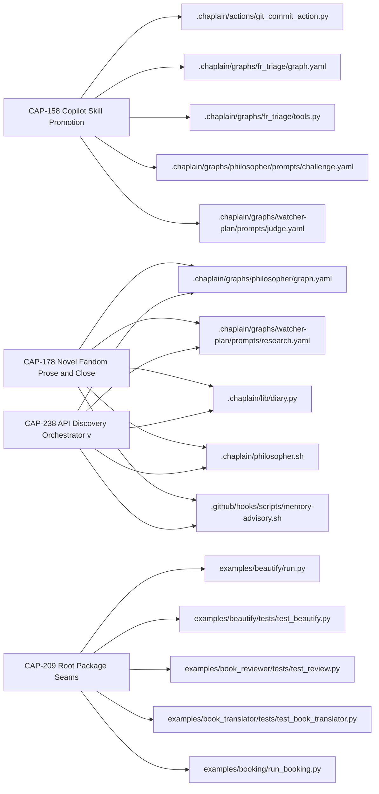
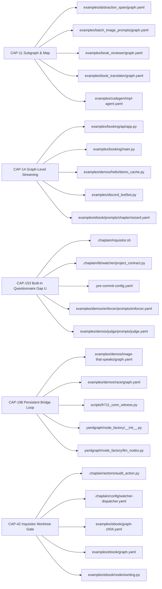
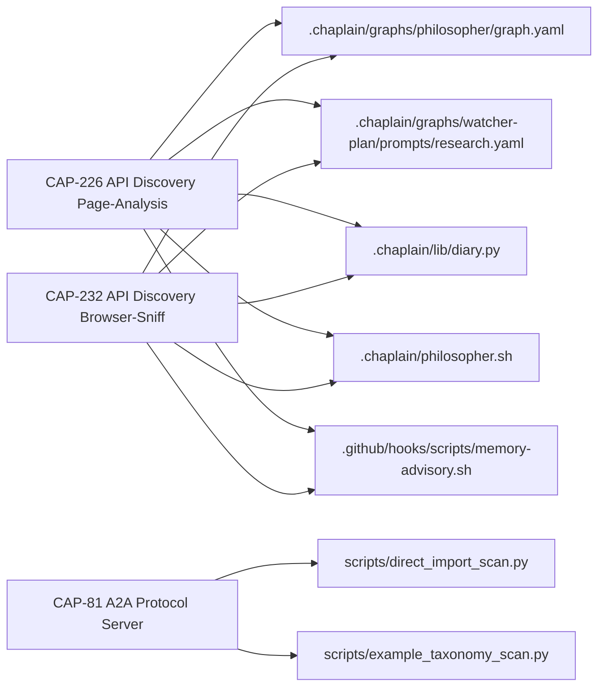
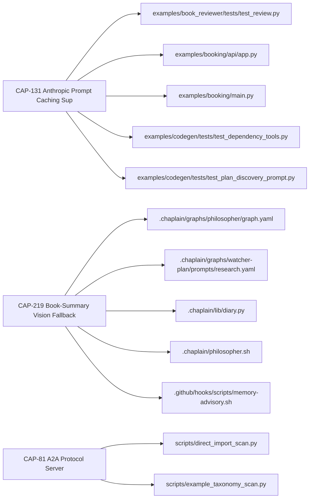
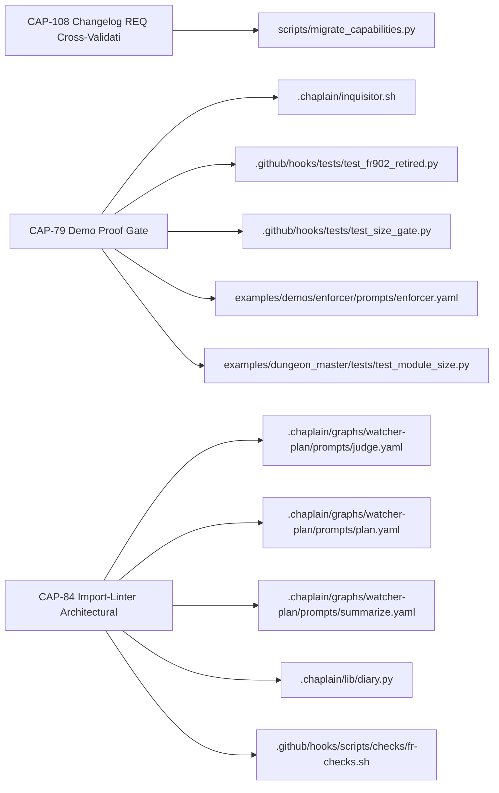
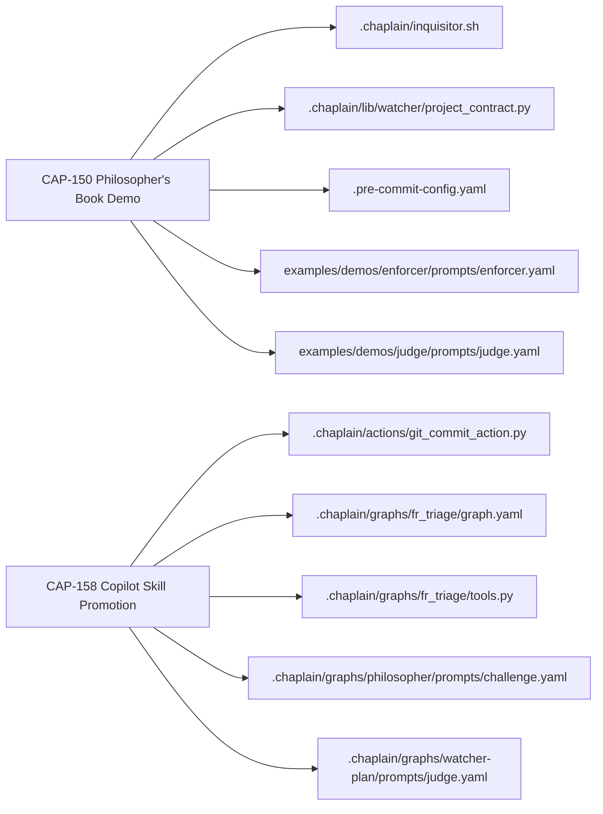
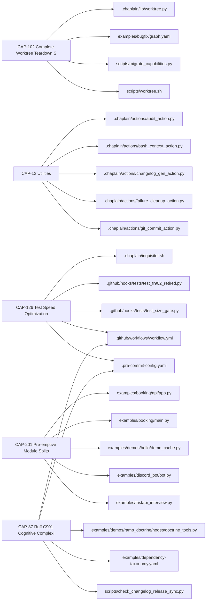

# CAP Journey Census Ledger

- rows: 30  judged: 28  row_failed: 2  abstained: 0
- model: claude-haiku-4-5  git_sha: a3945008  prompt: judge_cap.v1
- canary misses: 7 — CAP-131: journeys ['serve_embed'] miss ['run_operate']; CAP-203: journeys ['author_graph'] miss ['census_classify']; CAP-203: disposition keep != extend; CAP-203: extend_to None not in ['audit_comply', 'census_classify']; CAP-11: consumer_cited 'examples/demos/map/graph.yaml' misses ['corpus_census', 'diary_census', 'person_profile_census', 'repo_census']; CAP-108: disposition keep != extend; CAP-108: extend_to None not in ['audit_comply']

## Journey × CAP matrix

| journey | CAPs | keep | extend | retire | contested |
|---|---:|---:|---:|---:|---:|
| author_graph | 8 | 7 | 0 | 0 | 1 |
| run_operate | 5 | 4 | 0 | 0 | 1 |
| debug_observe | 0 | 0 | 0 | 0 | 0 |
| integrate | 3 | 2 | 0 | 0 | 0 |
| serve_embed | 4 | 2 | 0 | 0 | 0 |
| census_classify | 0 | 0 | 0 | 0 | 0 |
| govern_process | 3 | 3 | 0 | 0 | 0 |
| audit_comply | 0 | 0 | 0 | 0 | 0 |
| conversational_app | 2 | 0 | 0 | 0 | 2 |
| none_internal | 5 | 5 | 0 | 0 | 0 |

off-catalog labels: none

## Disposition table

| CAP | name | disposition | effective | extend_to | consumer_cited | anchor violations |
|---|---|---|---|---|---|---|
| CAP-142 | Skill Export Portable Packaging | already_retired | already_retired | - | - | - |
| CAP-81 | A2A Protocol Server | already_retired | already_retired | - | yamlgraph/discovery.py | - |
| CAP-150 | Philosopher's Book Demo | keep | contested | - | examples/demos/philosopher_book/graph.yaml | keep without a consumer from the mechanical list |
| CAP-153 | Built-in Questionnaire Gap Utilities | keep | contested | - | yamlgraph/tools/python_tool.py | keep without a consumer from the mechanical list |
| CAP-158 | Copilot Skill Promotion | keep | contested | - | .github/skills/graph-authoring/adapters/graph.yaml | keep without a consumer from the mechanical list |
| CAP-102 | Complete Worktree Teardown Self-Heal | keep | keep | - | yamlgraph/utils/worktree_helpers.py | - |
| CAP-108 | Changelog REQ Cross-Validation Gate | keep | keep | - | scripts/check_changelog_req.py | - |
| CAP-11 | Subgraph & Map | keep | keep | - | examples/demos/map/graph.yaml | - |
| CAP-12 | Utilities | keep | keep | - | .chaplain/actions/audit_action.py | - |
| CAP-126 | Test Speed Optimization | keep | keep | - | .github/workflows/workflow.yml | - |
| CAP-131 | Anthropic Prompt Caching Support | keep | keep | - | examples/demos/prompt-caching/graph.yaml | - |
| CAP-14 | Graph-Level Streaming | keep | keep | - | yamlgraph/cli/graph_commands.py | - |
| CAP-178 | Novel Fandom Prose and Close Loop | keep | keep | - | examples/novel_fandom/close.yaml | - |
| CAP-184 | Novel Fandom Duplicate Entity Prevention | keep | keep | - | examples/novel_fandom/nodes/persist_genesis.py | - |
| CAP-198 | Persistent Bridge Loop | keep | keep | - | yamlgraph/node_factory/__init__.py | - |
| CAP-201 | Pre-emptive Module Splits | keep | keep | - | yamlgraph/executor_async.py | - |
| CAP-203 | ICPC-2 RFE Classifier Example | keep | keep | - | examples/icpc-2-rfe/graph.yaml | - |
| CAP-209 | Root Package Seams | keep | keep | - | yamlgraph/compile/__init__.py | - |
| CAP-219 | Book-Summary Vision Fallback | keep | keep | - | examples/demos/book-summary/tools.py | - |
| CAP-226 | API Discovery Page-Analysis Step | keep | keep | - | examples/api-discovery/steps/page_analysis.tool.yaml | - |
| CAP-232 | API Discovery Browser-Sniff Step | keep | keep | - | examples/api-discovery/steps/browser_sniff.tool.yaml | - |
| CAP-238 | API Discovery Orchestrator v2 — Recon an | keep | keep | - | examples/api-discovery/tools/fetch_page.tool.yaml | - |
| CAP-42 | Inquisitor Worktree Gate | keep | keep | - | .chaplain/inquisitor.sh | - |
| CAP-77 | Image Generation Pipeline | keep | keep | - | yamlgraph/compile/map_compiler.py | - |
| CAP-78 | .fi Domain Crawl Demo | keep | keep | - | examples/demos/fi_domain_crawl/graph.yaml | - |
| CAP-79 | Demo Proof Gate | keep | keep | - | scripts/check_demo_proof.sh | - |
| CAP-84 | Import-Linter Architectural Boundary Enf | keep | keep | - | .github/workflows/commitlint.yml | - |
| CAP-87 | Ruff C901 Cognitive Complexity Gate | keep | keep | - | pyproject.toml | - |

## Value

value_unstated: 0 / 28

| CAP | for whom | pain | versus |
|---|---|---|---|
| CAP-102 | none_internal | Developers no longer encounter ModuleNotFoundError after worktree teardown because the ins | manual diagnosis and repair of broken editable installs afte |
| CAP-108 | govern_process | Maintainers prevent silent traceability drift by validating changelog req: front-matter re | Manual review or no validation gate, allowing cross-wired fr |
| CAP-11 | run_operate | Enables parallel fan-out and nested subgraph execution for scalable workflow orchestration | Manual sequential node execution or external orchestration f |
| CAP-12 | none_internal | Eliminates duplication of logging, templating, JSON extraction, and environment handling a | Reimplementing these utilities in each action or graph modul |
| CAP-126 | none_internal | Developers experience slow test feedback during rapid iteration, with test suite taking ~7 | Running full test suite without selective filtering, forcing |
| CAP-131 | serve_embed | Reduces token costs by 3x for stable context prefixes through Anthropic prompt caching. | Raw Anthropic API without declarative cache control in YAML. |
| CAP-14 | run_operate | CLI users must write Python to access streaming instead of using the YAML-first paradigm w | raw Python scripts or writing custom code to call run_graph_ |
| CAP-142 | serve_embed | Graph authors can publish reusable, agent-discoverable skill bundles directly from YAMLGra | runtime-only interoperability via MCP or A2A server setup |
| CAP-150 | conversational_app | Demonstrates how to build a multi-turn LLM pipeline that uses tool-based search and file I | Raw LangGraph or manual prompt orchestration without integra |
| CAP-153 | run_operate | Schema-driven questionnaire loops can now reuse deterministic gap detection and extraction | Manual gap detection and extraction normalization in each qu |
| CAP-158 | author_graph | Graph authoring reference docs are invisible unless manually read; promoting them to Copil | Manual reading of reference/graph-yaml.md or relying on gene |
| CAP-178 | author_graph | Authors can now close the loop by drafting prose that deterministically updates the dynami | Manual canon updates or prose that drifts from the underlyin |
| CAP-184 | author_graph | Prevents orphan IDs and parallel-invention duplicates from corrupting the novel_fandom kno | Manual post-hoc deduplication or accepting corrupted entity  |
| CAP-198 | run_operate | Eliminates per-call thread churn and fresh-loop SDK reconnects, reducing latency and preve | Per-invocation daemon-thread + asyncio.run() topology with f |
| CAP-201 | none_internal | Preemptive module splits relieve size-gate pressure before unplanned splits occur under de | Unplanned split under deadline pressure when the next featur |
| CAP-203 | author_graph | Clinical teams can author a transparent, reproducible YAMLGraph-based ICPC-2 RFE classifie | manual free-text encounter coding or vendor black-box classi |
| CAP-209 | author_graph | Removes implicit module clusters by enforcing package boundaries via import-linter contrac | Flat 27-module root structure with no enforced seams between |
| CAP-219 | serve_embed | Scanned PDF documents without extractable text can now be summarized via vision fallback i | The prior default behavior (FR-774) which raised ValueError  |
| CAP-226 | integrate | Distinguishing portal pages hosting APIs from plain websites by inspecting HTML source for | Manual inspection or browser-sniff on all HTML responses wit |
| CAP-232 | integrate | Developers can now discover APIs hidden behind client-side rendering in SPAs without manua | Manual page inspection or static analysis that fails on Java |
| CAP-238 | author_graph | Eliminates wrong not_found verdicts by exhausting the orchestrator's own step inventory be | manually re-running recon or browser-sniff as standalone gra |
| CAP-42 | run_operate | Eliminates wasteful Inquisitor audits and API calls on intermediate commits during enforce | Running full audit and propose phases on every worktree comm |
| CAP-77 | author_graph | Graph authors no longer need to manually glue together fragmented image workflow pieces; t | manually chaining batch_image_prompts, file I/O, and zimage- |
| CAP-78 | author_graph | Graph authors lack a reusable crawl-and-summarise pattern combining HTTP tool nodes, map-b | raw LangGraph or custom scripts without structured YAMLGraph |
| CAP-79 | govern_process | Demos ship with syntax errors and broken imports because no gate verifies demos were actua | Manual review or skipping demo execution enforcement entirel |
| CAP-81 | integrate | Graphs can now be exposed as A2A agents without Python glue code, enabling interoperabilit | Raw LangGraph or manual FastAPI/MCP wiring to expose graphs  |
| CAP-84 | govern_process | Architectural layer violations are caught at pre-commit and CI instead of silently degradi | Convention-only enforcement with no mechanical gate, allowin |
| CAP-87 | none_internal | Cognitive complexity violations are caught at commit time instead of in code review or pro | Discovering complexity-driven refactor debt in code review o |

## Blast by journey

### author_graph

### run_operate

### integrate

### serve_embed

### govern_process

### conversational_app

### none_internal

## Failed / abstained rows

| CAP | status | reason |
|---|---|---|
| CAP-221 | row_failed | journey 'example_only' neither in catalog nor off_catalog:<label> |
| CAP-233 | row_failed | journey 'example_only' neither in catalog nor off_catalog:<label> |
