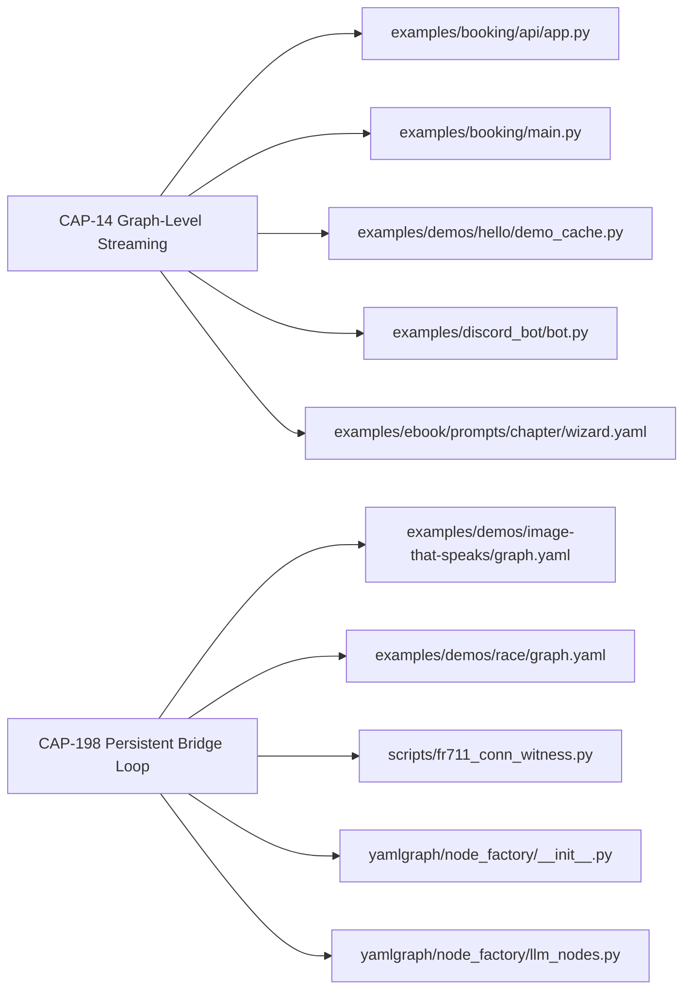
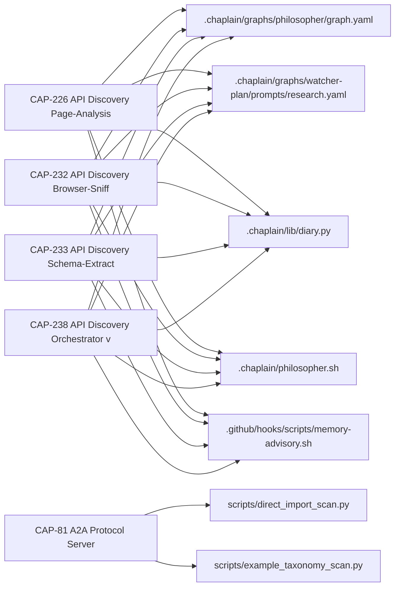
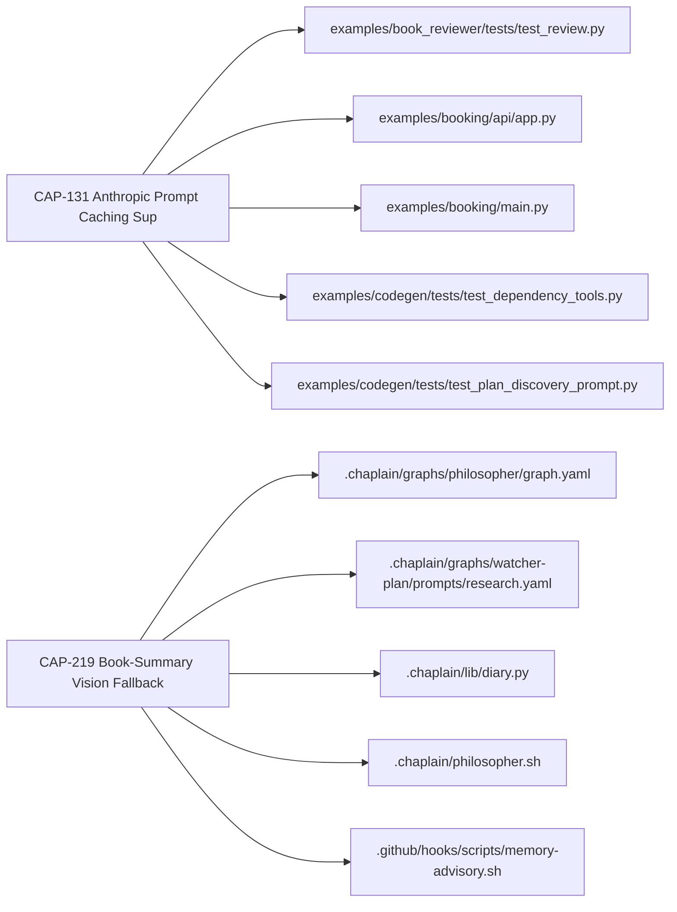
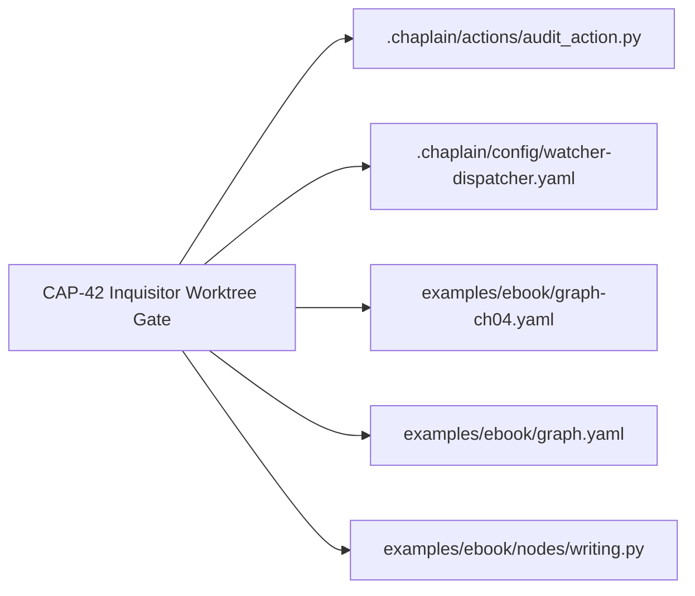
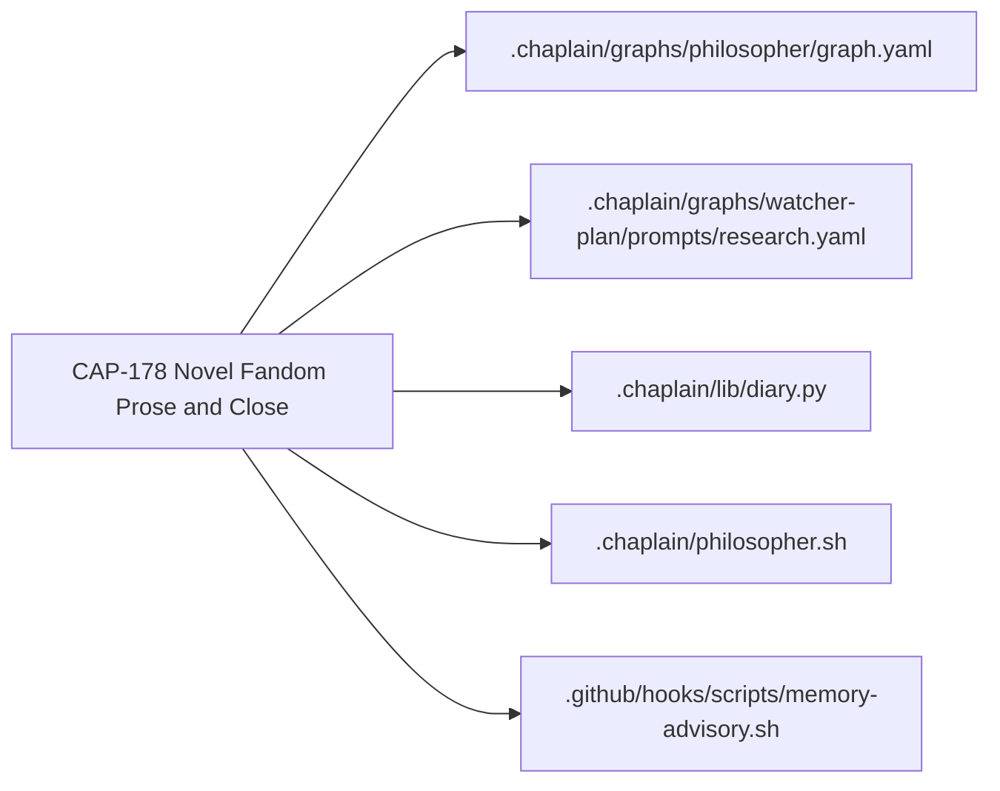
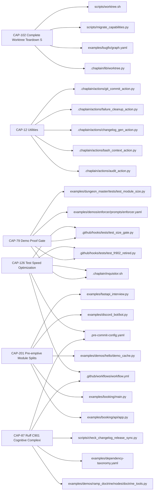

# CAP Journey Census Ledger

- rows: 30  judged: 30  row_failed: 0  abstained: 0
- model: claude-haiku-4-5  git_sha: a110a103  prompt: judge_cap.v1
- canary misses: 5 — CAP-131: consumer_cited 'yamlgraph/executor.py' misses ['llm_factory', 'executor_base', 'prompts', 'prompt-caching']; CAP-203: journeys [] miss ['census_classify']; CAP-203: extend_to None not in ['codingproof_callcensus']; CAP-108: journeys ['author_graph'] miss ['govern_process', 'audit_comply']; CAP-108: extend_to None not in ['portable_spine', 'auditpack']

## Journey × CAP matrix

| journey | CAPs | keep | wedge | retire | contested |
|---|---:|---:|---|---:|---:|
| author_graph | 10 | 5 | - | 0 | 4 |
| run_operate | 2 | 2 | - | 0 | 0 |
| debug_observe | 0 | 0 | - | 0 | 0 |
| integrate | 5 | 4 | - | 0 | 0 |
| serve_embed | 3 | 2 | - | 1 | 0 |
| census_classify | 0 | 0 | - | 0 | 0 |
| govern_process | 1 | 1 | portable_spine | 0 | 0 |
| audit_comply | 0 | 0 | - | 0 | 0 |
| conversational_app | 1 | 1 | - | 0 | 0 |
| none_internal | 6 | 6 | - | 0 | 0 |

off-catalog labels: {'example_only': 1, 'clinical_encounter_coding': 1}

## Disposition table

| CAP | name | disposition | effective | extend_to | consumer_cited | anchor violations |
|---|---|---|---|---|---|---|
| CAP-142 | Skill Export Portable Packaging | already_retired | already_retired | - | - | - |
| CAP-81 | A2A Protocol Server | already_retired | already_retired | - | yamlgraph/discovery.py | - |
| CAP-150 | Philosopher's Book Demo | retire | contested | - | - | retire with 11 mechanical consumers |
| CAP-153 | Built-in Questionnaire Gap Utilities | keep | contested | - | yamlgraph/tools/questionnaire.py | keep without a consumer from the mechanical list |
| CAP-203 | ICPC-2 RFE Classifier Example | keep | contested | - | - | keep without a consumer from the mechanical list |
| CAP-221 | Demo Graph Binding Hygiene and Grounded  | keep | contested | - | examples/abstraction_span/graph.yaml | author_graph junk-drawer on example_only |
| CAP-77 | Image Generation Pipeline | keep | contested | - | yamlgraph/compile/map_compiler.py | author_graph junk-drawer on example_only |
| CAP-78 | .fi Domain Crawl Demo | retire | contested | - | - | author_graph junk-drawer on example_only |
| CAP-102 | Complete Worktree Teardown Self-Heal | keep | keep | - | yamlgraph/utils/worktree_helpers.py | - |
| CAP-108 | Changelog REQ Cross-Validation Gate | keep | keep | - | scripts/check_changelog_req.py | - |
| CAP-11 | Subgraph & Map | keep | keep | - | examples/abstraction_span/graph.yaml | - |
| CAP-12 | Utilities | keep | keep | - | .chaplain/actions/audit_action.py | - |
| CAP-126 | Test Speed Optimization | keep | keep | - | .github/workflows/workflow.yml | - |
| CAP-131 | Anthropic Prompt Caching Support | keep | keep | - | yamlgraph/executor.py | - |
| CAP-14 | Graph-Level Streaming | keep | keep | - | yamlgraph/cli/graph_commands.py | - |
| CAP-158 | Copilot Skill Promotion | keep | keep | - | .github/hooks/tests/test_copilot_instructions_hooks_docs_red.py | - |
| CAP-178 | Novel Fandom Prose and Close Loop | keep | keep | - | examples/novel_fandom/close.yaml | - |
| CAP-198 | Persistent Bridge Loop | keep | keep | - | yamlgraph/node_factory/__init__.py | - |
| CAP-201 | Pre-emptive Module Splits | keep | keep | - | yamlgraph/executor_async.py | - |
| CAP-209 | Root Package Seams | keep | keep | - | examples/beautify/run.py | - |
| CAP-219 | Book-Summary Vision Fallback | keep | keep | - | examples/demos/book-summary/tools.py | - |
| CAP-226 | API Discovery Page-Analysis Step | keep | keep | - | examples/api-discovery/steps/page_analysis.tool.yaml | - |
| CAP-232 | API Discovery Browser-Sniff Step | keep | keep | - | examples/api-discovery/steps/browser_sniff.tool.yaml | - |
| CAP-233 | API Discovery Schema-Extract Step | keep | keep | - | examples/api-discovery/steps/schema_extract.tool.yaml | - |
| CAP-238 | API Discovery Orchestrator v2 — Recon an | keep | keep | - | examples/api-discovery/tools/fetch_page.tool.yaml | - |
| CAP-42 | Inquisitor Worktree Gate | keep | keep | portable_spine | .chaplain/inquisitor.sh | - |
| CAP-79 | Demo Proof Gate | keep | keep | - | scripts/check_demo_proof.sh | - |
| CAP-84 | Import-Linter Architectural Boundary Enf | keep | keep | - | .github/workflows/commitlint.yml | - |
| CAP-87 | Ruff C901 Cognitive Complexity Gate | keep | keep | - | pyproject.toml | - |
| CAP-184 | Novel Fandom Duplicate Entity Prevention | retire | retire | - | - | - |

## Value

stated: 18  value_generic: 11  value_unstated: 1  / 30

| CAP | for whom | pain | versus |
|---|---|---|---|
| CAP-102 | none_internal | Developers no longer encounter ModuleNotFoundError after worktree teardown because the ins | manual diagnosis and reinstallation after worktree teardown |
| CAP-108 | author_graph | Maintainers get immediate feedback when a changelog fragment references the wrong requirem | manual changelog validation or ungated fragments shipping wi |
| CAP-11 | author_graph | Enables graph authors to compose parallel fan-out and nested subgraph execution patterns w | raw LangGraph without map and subgraph node abstractions |
| CAP-12 | none_internal | Shared logging, templating, JSON extraction, and configuration utilities reduce duplicatio | duplicating utility functions across each internal tool and  |
| CAP-126 | none_internal | Developers experience slow test feedback during rapid iteration, with test suite taking ~7 | running the full test suite without selective filtering |
| CAP-131 | serve_embed | Reduces token costs by 3x for stable context prefixes through Anthropic prompt caching. | Anthropic prompt caching without YAMLGraph integration, requ |
| CAP-14 | run_operate | CLI users no longer must write Python to access real-time LLM token streaming, eliminating | raw LangGraph astream() or writing Python scripts to access  |
| CAP-142 | author_graph | Graph authors can now package reusable, agent-discoverable skill bundles directly from YAM | manual packaging or runtime-only MCP/A2A exposure |
| CAP-150 | author_graph | Developers can study a complete end-to-end YAMLGraph pipeline that demonstrates LLM-driven | hand-written scripts or raw LangGraph implementations |
| CAP-153 | author_graph | Graph authors can now reuse deterministic gap detection and extraction normalization throu | custom schema-driven probing loops without framework helpers |
| CAP-158 | author_graph | Graph authors must manually search reference docs instead of having curated procedural ski | manually reading reference/graph-yaml.md and reference/promp |
| CAP-178 | conversational_app | Enables story-driven applications to accumulate canonical state changes across chapters in | manual prose-to-state reconciliation or regenerating the ent |
| CAP-184 | serve_embed | Prevents orphan IDs and duplicate entities from corrupting the novel_fandom knowledge grap | manual post-hoc deduplication and orphan cleanup after genes |
| CAP-198 | run_operate | Eliminates per-call thread churn and fresh-loop SDK reconnects, reducing latency and preve | per-invocation daemon-thread + asyncio.run() topology |
| CAP-201 | none_internal | Preemptive module splits relieve size-gate pressure and isolate complexity before unplanne | unplanned split under deadline pressure the next time a feat |
| CAP-203 | off_catalog:clinical_encounter_coding | Clinical and operations teams eliminate manual, inconsistent encounter-to-ICPC-2-code mapp | manual coding or free-text inconsistent analysis |
| CAP-209 | author_graph | Enforces architectural seams within Layer 2 through import-linter contracts, preventing in | flat bag of 27 modules with no enforced boundaries |
| CAP-219 | serve_embed | Owners of scanned books can now get real summaries instead of a refusal when vision fallba | the FR-774 loud failure (ValueError: no extractable text … v |
| CAP-221 | author_graph | Prevents silent variable binding failures and fabrication from empty findings in committed | Unguarded demo graphs that silently hallucinate when binding |
| CAP-226 | integrate | Distinguishing portal pages hosting APIs from plain websites by inspecting HTML source for | manual HTML inspection or browser-sniff on all pages |
| CAP-232 | integrate | Developers can now discover APIs hidden behind client-side rendering in SPAs without manua | static analysis of page source, which fails for JavaScript-r |
| CAP-233 | integrate | Eliminates manual parsing and schema extraction from confirmed platform identifications by | manual schema parsing and response inference from sample dat |
| CAP-238 | integrate | Verdicts that are wrong only because the router never consulted evidence the pipeline alre | manually re-running recon or browser-sniff as standalone gra |
| CAP-42 | govern_process | Eliminates wasteful Inquisitor audits and misleading findings on incomplete work-in-progre | Running the full Inquisitor audit on every intermediate comm |
| CAP-77 | author_graph | Graph authors no longer need to manually glue together disconnected image workflow pieces  | manually chaining batch_image_prompts, copying output to fil |
| CAP-78 | author_graph | Graph authors lack a reusable pattern combining HTTP tool nodes, map-based parallelism, an | writing custom LangGraph or raw Python scripts for web crawl |
| CAP-79 | none_internal | Demos ship with syntax errors and broken imports because no gate verifies demos were actua | manual demo execution verification or skipping demo validati |
| CAP-81 | integrate | Graphs can now be exposed as A2A agents for interoperability with multi-agent systems with | raw LangGraph or manual FastAPI exposure |
| CAP-84 | author_graph | Architectural layer violations are caught at pre-commit and CI rather than silently degrad | convention-only enforcement documented in ARCHITECTURE.md |
| CAP-87 | none_internal | Developers catch cognitive complexity violations at commit time instead of code review or  | radon CC (grade D ≥ 21) which misses deeply-nested functions |

## Blast by journey

### author_graph

```mermaid
graph LR
  CAP-108["CAP-108 Changelog REQ Cross-Validati"] --> m600210["scripts/migrate_capabilities.py"]
  CAP-11["CAP-11 Subgraph & Map"] --> m846064["examples/abstraction_span/graph.yaml"]
  CAP-11["CAP-11 Subgraph & Map"] --> m767008["examples/batch_image_prompts/graph.yaml"]
  CAP-11["CAP-11 Subgraph & Map"] --> m274695["examples/book_reviewer/graph.yaml"]
  CAP-11["CAP-11 Subgraph & Map"] --> m629698["examples/book_translator/graph.yaml"]
  CAP-11["CAP-11 Subgraph & Map"] --> m148424["examples/codegen/impl-agent.yaml"]
  CAP-153["CAP-153 Built-in Questionnaire Gap U"] --> m658192[".chaplain/inquisitor.sh"]
  CAP-153["CAP-153 Built-in Questionnaire Gap U"] --> m867735[".chaplain/lib/watcher/project_contract.py"]
  CAP-153["CAP-153 Built-in Questionnaire Gap U"] --> m130315[".pre-commit-config.yaml"]
  CAP-153["CAP-153 Built-in Questionnaire Gap U"] --> m821103["examples/demos/enforcer/prompts/enforcer.yaml"]
  CAP-153["CAP-153 Built-in Questionnaire Gap U"] --> m456968["examples/demos/judge/prompts/judge.yaml"]
  CAP-158["CAP-158 Copilot Skill Promotion"] --> m895973[".chaplain/actions/git_commit_action.py"]
  CAP-158["CAP-158 Copilot Skill Promotion"] --> m785384[".chaplain/graphs/fr_triage/graph.yaml"]
  CAP-158["CAP-158 Copilot Skill Promotion"] --> m582854[".chaplain/graphs/fr_triage/tools.py"]
  CAP-158["CAP-158 Copilot Skill Promotion"] --> m256124[".chaplain/graphs/philosopher/prompts/challenge.yaml"]
  CAP-158["CAP-158 Copilot Skill Promotion"] --> m33895[".chaplain/graphs/watcher-plan/prompts/judge.yaml"]
  CAP-209["CAP-209 Root Package Seams"] --> m922878["examples/beautify/run.py"]
  CAP-209["CAP-209 Root Package Seams"] --> m774311["examples/beautify/tests/test_beautify.py"]
  CAP-209["CAP-209 Root Package Seams"] --> m357819["examples/book_reviewer/tests/test_review.py"]
  CAP-209["CAP-209 Root Package Seams"] --> m967430["examples/book_translator/tests/test_book_translator.py"]
  CAP-209["CAP-209 Root Package Seams"] --> m109810["examples/booking/run_booking.py"]
  CAP-221["CAP-221 Demo Graph Binding Hygiene a"] --> m585745[".chaplain/graphs/philosopher/graph.yaml"]
  CAP-221["CAP-221 Demo Graph Binding Hygiene a"] --> m38843[".chaplain/graphs/watcher-plan/prompts/research.yaml"]
  CAP-221["CAP-221 Demo Graph Binding Hygiene a"] --> m925452[".chaplain/lib/diary.py"]
  CAP-221["CAP-221 Demo Graph Binding Hygiene a"] --> m567244[".chaplain/philosopher.sh"]
  CAP-221["CAP-221 Demo Graph Binding Hygiene a"] --> m879877[".github/hooks/scripts/memory-advisory.sh"]
  CAP-84["CAP-84 Import-Linter Architectural "] --> m33895[".chaplain/graphs/watcher-plan/prompts/judge.yaml"]
  CAP-84["CAP-84 Import-Linter Architectural "] --> m211137[".chaplain/graphs/watcher-plan/prompts/plan.yaml"]
  CAP-84["CAP-84 Import-Linter Architectural "] --> m688461[".chaplain/graphs/watcher-plan/prompts/summarize.yaml"]
  CAP-84["CAP-84 Import-Linter Architectural "] --> m925452[".chaplain/lib/diary.py"]
  CAP-84["CAP-84 Import-Linter Architectural "] --> m179466[".github/hooks/scripts/checks/fr-checks.sh"]
```

### run_operate

### integrate

### serve_embed

### govern_process

### conversational_app

### none_internal

## Failed / abstained rows

| CAP | status | reason |
|---|---|---|
