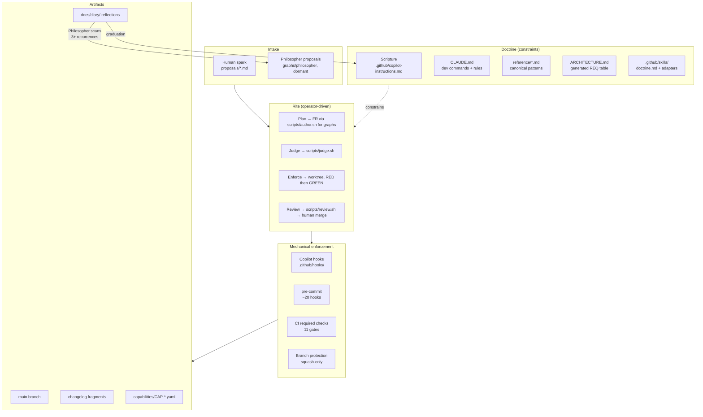
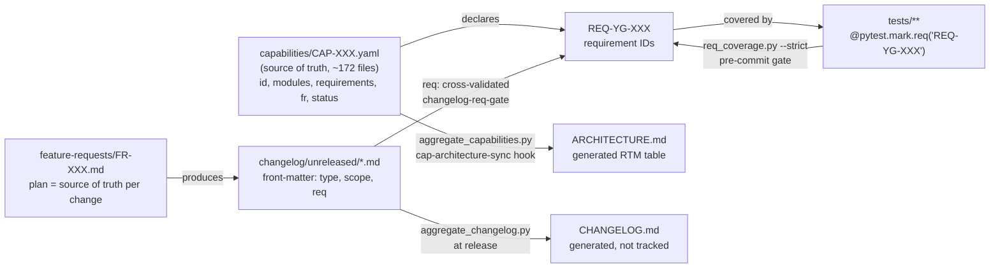
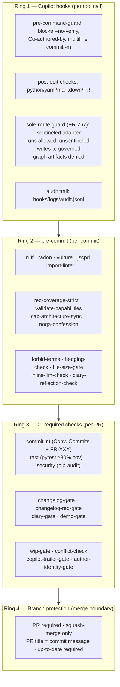
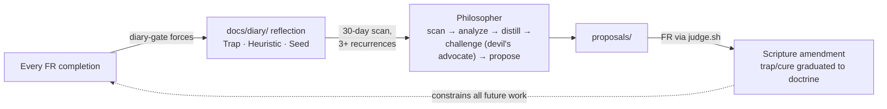

# The YAMLGraph Development Process — A Self-Reflection

YAMLGraph is not just a framework; it is a **self-hosting development organism**. The repository
contains its own doctrine (the Scripture, codified in
[.github/copilot-instructions.md](../.github/copilot-instructions.md)), its own operator-driven
rite (one-word verdicts executed through sole-route scripts), its own philosopher
(diary-pattern graduation), and its own demo workloads (autogenerated books). Every layer is
enforced mechanically — violations are defects, not suggestions. The guiding thesis, graduated
from the diary itself:

> **constraint_over_code** — *"216 lines of Scripture produce 21k lines of Python; the constraint
> is irreplaceable, the code is regenerable."*

---

## 1. The Big Picture

Ideas enter as plain-text proposals; doctrine-governed automation turns them into merged,
traceable, reflected-upon code — and the reflections feed back into the doctrine.

The loop is closed: **code produces diary entries → diary entries produce doctrine → doctrine
constrains the next code**.

For the historical lineage of this rite--feature requests as a small-batch
descendant of waterfall-era requirements, stage-gate, change-control, V-model,
and traceability practices--see
[Feature-Request Methodology in Historical Context](feature-request-methodology.md).

---

## 2. The Doctrine Layer

The Scripture ([.github/copilot-instructions.md](../.github/copilot-instructions.md)) is executable
doctrine: 10 Commandments (research first, TDD, Pydantic types, no silent fallbacks, kill entropy…),
the Sermon (Plan → Judge → Enforce → Purge → Submit → Distill), and a **Knowledge Graph of the
Diary** — a YAML catalog of cognitive *traps* (e.g. `continuation_bias`, `symptom_patch`,
`metric_archaeology_before_reading_output`) and *cures* (e.g. `read_raw_output_first`,
`changelog_first_diagnostic`), each citing the incident that earned it.

Doctrine is not advisory. Every rule maps to a mechanical gate:

| Doctrine rule | Enforcing mechanism |
|---|---|
| "backward compatibility" / "pre-existing failure" forbidden | pre-commit `forbid-terms` |
| TDD red-green, condemning test first | `verify_red_action.py` in pipeline; RED/GREEN commits |
| No hardcoded prompts | pre-commit `inline-llm-check` |
| No untyped dicts / silent fallbacks | Pydantic everywhere; `hedging-check` hook |
| Every `# noqa` confessed | `noqa-confession` → [docs/confessions.md](confessions.md) (CONF-XXX) |
| Modules < 450 lines, complexity < D | `file-size-gate`, `radon-complexity` |
| 3-layer architecture (cli → logic → tools) | `import-linter` (`.importlinter`), CI `lint-imports` |
| Linter must stay LLM-free | forbidden-import contract on `yamlgraph.linter` |
| Reflection after every FR | CI `diary-gate` + `diary-reflection-check` (substance, not presence) |

### 2.1 Doctrine is federated: the skills layer

Since the sole-route FRs (FR-767 and the judge/review contracts), doctrine no longer lives in
one file. Three skills under [.github/skills/](../.github/skills/) carry their own canonical
`doctrine.md` that the Scripture *defers to* — the Scripture names the contract, the skill
defines it, an adapter script executes it, and a mechanical layer enforces the route:

| Skill | Canonical contract | Sole execution route | Enforcing mechanism |
|---|---|---|---|
| `graph-authoring` | `doctrine.md` (the ONLY way to author graphs) | `scripts/author.sh` via adapter | FR-767 PreToolUse sentinel guard: adapter arms a per-run sentinel; unsentineled writes to governed graph paths denied |
| `judge-fr` | `doctrine.md` (rubric, verdicts, input closure) | `scripts/judge.sh` → judge graph | Atomic lock, `JUDGE_EXECUTION` lineage sentinel (NC-414 re-entry guard), artifact contract (`tmp/draft-judgement.md` with verdict line — verified by artifact, never exit code) |
| `review-pr` | `doctrine.md` (review vs frozen scope) | `scripts/review.sh` → review graph | Same pattern: lock + lineage sentinel + draft-review artifact contract |
| `check-langsmith-trace` · `feature-request` · `release-version` · `run-code-analysis` · `session-introspection` | SKILL.md only (operational knowledge) | none — procedures, not routes | ordinary Ring 2–4 gates |
| [.github/agents/code-analysis.agent.md](../.github/agents/code-analysis.agent.md) | agent definition (autonomous analysis) | `runSubagent` | read-only analysis; recommendations enter via `proposals/` and FRs |

The skills↔hooks edge is the notable one: the FR-767 guard is a Ring-1 hook whose *policy is
defined in a skill* — hook-side detail in [.github/hooks/README.md](../.github/hooks/README.md).

---

## 3. The rite as practised: Plan → Judge → Enforce → Review

The process is operator-driven. One person types one-word verdicts
(`reference/command-book.md`); the agent executes each word through a sole route and leaves a
witness artifact:

1. **Plan** — the FR under `feature-requests/`; graphs and prompts only through
   `scripts/author.sh` with a committed brief.
2. **Judge** — `scripts/judge.sh <fr>` renders `<fr>.judgement.md`; never in the author's
   session; re-run after any material amendment.
3. **Enforce** — in a worktree (`scripts/worktree.sh new`), RED commit before GREEN, exactly
   the frozen deliverables.
4. **Review** — `scripts/outsider.sh <pr>` (a reader with no context) then
   `scripts/review.sh <pr> <fr>` (the informed adversary); both advisory.
5. **Merge** — CI green, both reviews read, diary present; then the human's word; squash to `main`.

Plan and Judge run in separate model sessions so the judge is not anchored on the author's
narrative (`judge_as_junior_pr`); deterministic gates (changelog fragment, PR title, diary)
run at commit and CI, before any model-driven remediation.

An autonomous FSM (the Chaplain) ran the same rite unattended from February to July 2026 and was
retired in September 2026 (FR-1010 … FR-1019); its design is preserved in
[docs/archive/chaplain-system.md](archive/chaplain-system.md) and its source in
[docs/archive/chaplain.md](archive/chaplain.md).

### 3.1 Reality check: the manual rite dominates

The FSM was the *formalization* of the process, never its primary execution path. Measured
over May–July 2026: **~568 commits on main, of which ~94 (17%) arrived via PR (chaplain path)
and ~474 (83%) were direct pushes** from operator-driven Copilot sessions. Most actual change
followed the **manual plan-judge-enforce loop**: the operator states a problem, the agent plans,
the operator judges (often with a one-word verdict — "reflect", "diary", "commit push"), the
agent enforces, and pre-commit hooks + the operator's read are the gates. What the FSM left
behind is the explicitness it forced: gates, prompts and judgement contracts precise enough
that any executor is constrained identically. Branch creation in the main worktree is blocked
(FR-889 OS lock); isolated work goes through `scripts/worktree.sh new`, so there is one git
topology.

**Why the manual loop won** (operator's diagnosis, recorded 2026-07 before the retirement;
historical — the pipeline it compares against is archived in
[docs/archive/chaplain.md](archive/chaplain.md)):

1. **Latency.** The pipeline was slow: plan (≤10 min) + judge (≤10 min) + enforce (≤1 h) +
   CI wait (≤30 min) per topic. The manual loop replaces each stage boundary with an
   operator's one-word verdict issued in seconds.
2. **Task-shape mismatch.** The pipeline fitted *fill-in-the-gaps* development — bounded,
   well-specified changes where an FR can be frozen before code exists. Exploration inverts
   the rite: you *enforce first* (prototype) to discover what the plan should be, and the
   prototype might legitimately fail. The pipeline treated failure as a defect; exploration
   treats failure as the purchased information.
3. **Transaction cost.** Worktree setup, PR creation, CI polling, squash-merge, teardown —
   fixed overhead per change that the direct-to-main loop simply doesn't pay.

The lesson that survived the comparison: **route by task shape, not by habit** — frozen-spec,
bounded work runs the full rite (`reference/command-book.md`); exploratory or judgement-dense
work prototypes first and files the FR afterwards. Formalizing a spike wastes an hour to learn
what a 5-minute prototype would have shown; skipping the rite for routine gap-filling
normalizes gate bypasses.

---

## 4. The Traceability Spine: CAP → REQ → Test → Changelog

Every capability, requirement, test, and changelog entry is cross-linked and mechanically verified.

- **Capabilities registry** is the single source of truth; ARCHITECTURE.md's RTM is generated.
- `req-coverage-strict` (pre-commit) fails if any active REQ lacks a tagged test.
- `validate-id-registry` guarantees REQ uniqueness across CAPs.
- Retiring phantom capabilities is a first-class act (`growth_as_default` trap: mature systems
  benefit more from pruning claims than planting features).
- CHANGELOG.md is **generated from fragments** — merge conflicts are structurally impossible.

---

## 5. Enforcement Rings: Four Concentric Gates

Enforcement happens at four boundaries, from innermost (per-tool-call) to outermost (merge).

Doctrinal principles behind the rings:

- **enforcement_at_merge_boundary** — the PR merge is the last gate; everything must block there.
- **detection_without_enforcement** — lint without a gate is advisory theatre; add a CI block or
  remove the claim.
- **substance_over_presence** — gates check content (filled diary sections, non-trivial demo
  logs), not just file existence; a 1-byte file must not satisfy any gate.
- **automation_inherits_doctrine** — scripts and adapters obey the same hooks as humans; no bypasses.
- **instruction_boundary** — LLM output that touches enforcement infrastructure is reviewed as
  adversarial input (`copilot-trailer-gate`, `model_as_trusted_peer` trap).

---

## 6. The Self-Correction Loop: Diary → Philosopher → Scripture

The process improves itself through a mechanical graduation pipeline.

- **Distill** is the final Sermon step: every task list ends with a metacognitive diary entry
  naming the trap, the heuristic, and a forward-looking **Seed:** question.
- Heuristics recurring 3+ times (including across sibling projects like `ninchat_voice`)
  graduate into the Scripture's trap/cure knowledge graph.
- The Philosopher (`graphs/philosopher/`, dormant) is the learning system: its proposals enter
  `proposals/` and are judged like any spark (`audit_gate`: an audit without a blocking
  mechanism is a post-mortem before the incident). The former auditor is retired
  ([docs/archive/chaplain.md](archive/chaplain.md)); its lesson stands: detection authority ≠
  prescription authority — a detector-originated proposal needs a premise gate
  (`unchallenged_premise`, PR #458, 2026-07-07).

---

## 7. Dogfooding: The Framework Develops Itself

YAMLGraph is exercised by its own development process at every level:

| Layer | Dogfooding instance |
|---|---|
| Judge / review / authoring / outsider adapters | Each is a YAMLGraph graph (`.github/skills/*/adapters/graph.yaml`) with copilot or llm nodes; `fr_triage` and `world_distill` live in `graphs/` |
| Philosopher & diary-index | YAMLGraph graphs over `docs/diary/` |
| **Autogenerated books** | [examples/dungeon_master](../examples/dungeon_master) generates novel-length fiction (cards → synopsis → chapters → book); [examples/ebook](../examples/ebook) generates a 9-chapter eBook about YAMLGraph's own doctrine via a Write→Judge→Amend loop |
| Demos as proofs | `examples/demos/` must ship `demo-output.log` in PR diffs (demo-gate) — *"code that has not been run must not be demoed"* |
| Quality analysis | `code-analysis` agent + skills run ruff/bandit/radon/vulture on the framework |

The books are not decoration: they are **long-horizon stress workloads** that expose prompt
contract failures, state-boundary bugs, and metric blind spots (e.g. FR-596–598
"kill the novel", which graduated `read_raw_output_first` into the Scripture and into the
Judge's mandate: no metric-tooling FR is approved without evidence of raw-sample reads).

---

## 8. Reflection: Strengths and Tensions

**What works**

- *Closed feedback loop*: incidents → diary → graduation → gates. Nothing learned is lost;
  everything learned eventually blocks a merge.
- *Constraint over code*: the doctrine (~200 lines) is the durable asset; implementations are
  regenerable. Reimplementation triage ranks components by **incident density**
  (diary entries ÷ source lines), not size.
- *Separation of judgement from generation*: fresh-session Judge, adversarial review of
  agent output, deterministic gates before LLM remediation — all counter known LLM failure
  modes (anchoring, continuation bias, plausible-wrong-answers).
- *Filesystem as state machine*: inbox/processing/done/failed and git worktrees give the
  automation crash-safe, forensically inspectable state.

**Standing tensions**

- *Gate proliferation vs. throughput*: four enforcement rings and ~30 gates make each change
  heavier; the doctrine accepts this ("when hooks feel slow, let that be the sign they guard"),
  but each new gate must pass its own `audit_as_ritual` test.
- *Substance-checking is asymptotic*: gates keep being upgraded from presence to substance
  (`gate_checks_shape_not_substance`), yet a sufficiently motivated generator can always
  satisfy structural markers — the Judge's human/model review remains the true backstop.
- *Self-exemption risk*: meta-tooling (hooks, chaplain scripts) historically drifted from the
  gates it enforces (`infrastructure_self_exempt`); scope contracts (FR-436) manage but do not
  eliminate this.

**Seed:** if the diary→Scripture graduation were fully mechanized (`diary_graduation_pipeline`
seed), would the doctrine converge — or does the Philosopher's devil's-advocate gate need a
human heartbeat to avoid graduating its own noise?
