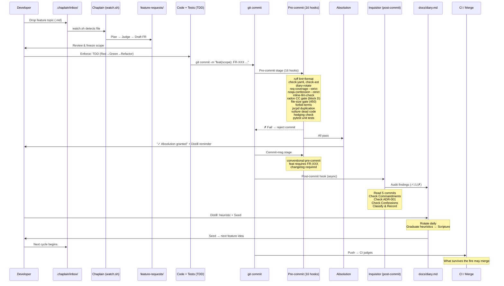

# Chapter 00: Introduction: Self-Documenting Machinery

Welcome to the YAMLGraph Development Pipeline eBook. This project is more than just an LLM pipeline framework; its development process is itself a self-documenting machine. From the moment an idea sparks to the final commit, the system observes, judges, and refines its own evolution, ensuring that best practices and architectural doctrine are not merely suggested, but mechanically enforced.

## The Problem: Unruly Development

In many development environments, knowledge is scattered across wikis, tribal lore, and forgotten design documents. Architectural rules and coding standards often rely on voluntary adherence, leading to drift, technical debt, and inconsistencies over time. Without built-in mechanisms for self-reflection and continuous improvement, development pipelines can become opaque, difficult to maintain, and prone to repeating past mistakes. This lack of a coherent, auditable narrative hinders both efficiency and long-term project health.

## The Solution: A Mechanically Enforced Doctrine

The YAMLGraph development pipeline tackles these challenges head-on by integrating a suite of automated tools designed to guide, enforce, and document every step of the journey. Our core insight is that "60-80% of AI workflows can be defined entirely in YAML (graphs + prompts + schemas) without writing Python code," and this YAML-first philosophy extends to our development process. By constraining the API surface, we trade some flexibility for dramatically faster prototyping, easier maintenance, and built-in best practices.

The pipeline ensures that doctrine, such as architectural rules, coding standards, and requirement traceability, is **mechanically enforced**, not voluntarily followed. It achieves this through four main pillars:

### 1. Pre-commit Quality Gates

Before any code can even be committed, it must pass through a rigorous gauntlet of **16 pre-commit hooks**. These gates include comprehensive linting and formatting, static analysis for dead code and duplication, complexity checks, and strict enforcement of requirement traceability. This ensures that only high-quality, compliant code ever enters the repository, living up to our mantra: "What survives the fire may merge."

### 2. The Chaplain: Automated Feature Planning

The Chaplain is an agent that watches an inbox for new feature proposals. When a topic file is dropped, the Chaplain initiates a "Plan → Judge" workflow using YAMLGraph's own capabilities. It drafts structured feature requests, complete with problem statements, proposed solutions, and acceptance criteria, ensuring that every new feature is well-researched and clearly defined before development even begins.

### 3. The Inquisitor: Background Compliance Audit

Operating as a post-commit hook, the Inquisitor agent performs an asynchronous audit of recent commits against "the Scripture"—the project's foundational 10 Commandments and architectural sermons. It classifies findings as compliant, drifting, or outright violations, appending an audit entry to the project diary. This continuous scrutiny ensures ongoing adherence to our executable doctrine.

### 4. The Diary System: Metacognitive Reflection

At the heart of our self-improving system is the `docs/diary.md`. This metacognitive journal serves as a repository for development reflections, Inquisitor audits, emergent heuristics, and "Seeds"—forward-looking questions that inspire future features. The diary is rotated daily, archiving old entries and creating a fresh canvas for new insights, fostering a closed feedback loop where the project's own tooling documents, judges, and improves the development process at every commit.

## The YAMLGraph Development Pipeline in Action

The following diagram illustrates the full development pipeline, from initial idea generation to final merge, showcasing how each component interacts to create a robust, self-auditing, and self-documenting system.

## How to Read This Book

This eBook is structured to guide you through the YAMLGraph development pipeline, detailing each component and its role in maintaining a high standard of code quality and architectural integrity.

*   **Chapter 01: The Pre-Commit Gauntlet** dives deep into the 16 pre-commit hooks, explaining their individual functions and how they collectively enforce code quality.
*   **Chapter 02: Planning with the Chaplain** explores the automated feature request generation process and the "Plan → Judge" workflow.
*   **Chapter 03: Auditing with the Inquisitor** details the post-commit compliance checks against "the Scripture" and how doctrine is maintained.
*   **Chapter 04: Reflecting in the Diary** covers the metacognitive journal, daily rotation, and the evolution of heuristics into doctrine.
*   **Chapter 05: The Scripture and Doctrine** presents the foundational "10 Commandments" and "Sermon" that govern the project's development.

## Authoring Note

It is noteworthy that this eBook itself was conceived and drafted through the very YAMLGraph development pipeline it describes (Feature Request FR-100). This serves as a testament to the pipeline's effectiveness in generating structured, compliant documentation and code.
