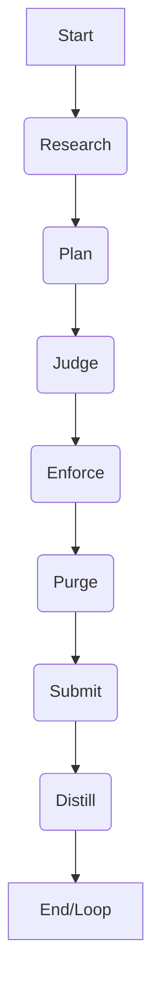

# Doctrine: The Scripture Decoded

In the intricate dance between human intent and artificial intelligence execution, clarity is paramount. The YAMLGraph Development Pipeline embraces this truth by codifying its core principles into an explicit doctrine. This isn't merely a set of aspirational guidelines; it's a living scripture that is *executable*, not just desirable. For AI agents, these rules provide necessary constraints and boundaries, guiding their decisions and actions. For human developers, they act as guardrails, ensuring consistency, quality, and a shared understanding of the project's ethos. Without such a codified doctrine, an AI-assisted workflow risks drift, inconsistency, and a breakdown in effective collaboration.

## Why Codified Doctrine?

Developing with AI agents is like building a complex machine with highly intelligent but potentially unconstrained operators. While AI excels at pattern recognition and rapid iteration, it lacks inherent judgment or a deep understanding of human values and long-term project health. This is where codified doctrine becomes indispensable. It provides the explicit rules, ethical boundaries, and operational heuristics that the AI agents must adhere to, ensuring their output aligns with human expectations and the project's strategic goals. Simultaneously, this doctrine serves as a common language and set of expectations for human collaborators, fostering consistency, reducing ambiguity, and establishing a clear framework for decision-making and quality control. It's the bedrock upon which trust and efficiency in an AI-driven pipeline are built.

## The 10 Commandments

The core tenets of the YAMLGraph pipeline are enshrined in the 10 Commandments, serving as fundamental truths that guide every decision and action. They are not merely suggestions but foundational principles for robust, maintainable, and predictable development.

> **1. Thou shalt research before coding**
*Principle:* Thorough investigation and understanding of existing patterns, requirements, and potential solutions must precede any implementation.
*Example:* Before tackling a new feature like `FR-073` (implementing a new eBook pattern), the team first analyzes existing eBook structures (`FR-038`, `FR-043`) to understand commonalities and best practices, rather than jumping straight into code.

> **2. Thou shalt plan before coding**
*Principle:* A clear, structured approach, outlining the steps, components, and expected outcomes, is essential before writing code.
*Example:* For `FR-073`, after research, a detailed plan is drafted outlining the necessary YAML structure, Python classes, and integration points, ensuring all stakeholders agree on the approach before development begins.

> **3. Thou shalt judge before coding**
*Principle:* Critical evaluation of the proposed plan, considering its implications, trade-offs, and adherence to project standards, is crucial.
*Example:* The plan for `FR-073` undergoes a review process where its feasibility, maintainability, and alignment with the overall YAMLGraph architecture are rigorously assessed, often involving both human and AI agents.

> **4. Thou shalt enforce before coding**
*Principle:* Agreed-upon standards, conventions, and architectural decisions must be established and integrated into the development environment to guide implementation.
*Example:* Before coding for `FR-073`, linters, type checkers, and schema validators are configured to automatically enforce the YAMLGraph's coding style and data structure rules, preventing common errors.

> **5. Thou shalt bear witness to your errors**
*Principle:* All known limitations, technical debt, and deviations from best practices must be explicitly documented and acknowledged within the codebase.
*Example:* If a temporary workaround is necessary, it's marked with a `noqa` comment like `CONF-003` (e.g., `noqa: CONF-003 Found a temporary workaround for X`) or `CONF-010` (e.g., `noqa: CONF-010 This section needs refactoring to Y`), clearly stating the confession ID and the reason.

> **6. Thou shalt write tests for all new features and bug fixes**
*Principle:* Comprehensive automated tests are non-negotiable for ensuring correctness, preventing regressions, and validating functionality.
*Example:* Every new requirement, such as `REQ-YG-001` for a new pipeline stage, has corresponding tests marked with `@pytest.mark.req("REQ-YG-001")`, establishing clear traceability and proving the feature works as intended.

> **7. Thou shalt normalize at the boundary**
*Principle:* Data entering or leaving the system must be transformed into a canonical, consistent format at the earliest possible point to maintain integrity and simplify processing.
*Example:* When external configuration files or user inputs are processed, they are immediately validated and converted into the YAMLGraph's internal Knowledge Graph format, preventing inconsistencies from propagating deeper into the system.

> **8. Thou shalt make errors visible**
*Principle:* Failures and unexpected conditions must be explicitly captured, structured, and surfaced in a way that is immediately actionable and understandable.
*Example:* Critical errors in the pipeline are not silently swallowed but are represented by a `PipelineError` Pydantic model, complete with structured fields for `code`, `message`, and `details`, and are integrated into the `prompts/analyze.yaml` schema for clear reporting.

> **9. Thou shalt correct errors immediately**
*Principle:* Once an error is detected and made visible, its resolution must be prioritized and acted upon without delay.
*Example:* Following the Rite of Correction, if an analysis prompt (`prompts/analyze.yaml`) returns a `PipelineError`, the system immediately triggers an `Inspect` phase, then an `Amend` phase, and if necessary, an `Escalate` to human oversight.

> **10. Thou shalt pray before acting**
*Principle:* Before any significant action or decision, a deliberate cognitive checklist must be performed to ensure all conditions are met and potential consequences are considered.
*Example:* Before an AI agent commits a change or executes a complex task, it internally runs through the "Agents' Prayer" checklist, confirming its understanding, available context, and adherence to the doctrine.

## The Sermon of the Chaplain

The "Sermon of the Chaplain" describes the YAMLGraph's core development workflow, a seven-phase cycle designed for iterative improvement and robust delivery. This methodical approach ensures that every change is well-considered, thoroughly tested, and integrated smoothly.

1.  **Research:** Understand the problem, gather context, analyze existing patterns.
2.  **Plan:** Define the solution, outline steps, design data structures, and APIs.
3.  **Judge:** Evaluate the plan against doctrine, standards, and potential risks.
4.  **Enforce:** Implement the solution, ensuring adherence to the judged plan and coding standards.
5.  **Purge:** Clean up temporary files, unused resources, and unnecessary artifacts.
6.  **Submit:** Commit changes to version control, trigger CI/CD pipelines.
7.  **Distill:** Document new patterns, update knowledge graphs, extract reusable components.

This cycle, often initiated by a feature request (like `FR-073`), ensures a systematic approach. `FR-073`, `FR-038`, and `FR-043` are examples of feature requests that would flow through the Research → Plan → Judge → Enforce phases, moving from initial understanding to a validated implementation.



## The Knowledge Graph

The Knowledge Graph is central to the YAMLGraph's data management philosophy, embodying the principle: "Normalize at the boundary where external data enters." This heuristic prevents inconsistencies from polluting the system by standardizing data as soon as it's introduced. All external inputs, whether configuration files, user data, or API responses, are immediately validated against a schema and transformed into a canonical, internal YAML structure that the pipeline understands and trusts. This ensures that internal operations always work with clean, predictable data.

Here's an example of a Knowledge Graph YAML block, illustrating how structured information about a specific `FeatureRequest` is maintained:

```yaml
# Source: files/ch01-doctrine-source-material.md
# Line: 32
knowledge_graph:
  - type: FeatureRequest
    id: FR-073
    title: Implement a New eBook Pattern for Technical Guides
    status: Researching
    description: Develop a new YAML pattern to structure technical guide eBooks,
                 including sections for prerequisites, step-by-step instructions,
                 and troubleshooting tips.
    related_to:
      - id: FR-038
        type: FeatureRequest
        description: Existing eBook Pattern for API Documentation
      - id: FR-043
        type: FeatureRequest
        description: Existing eBook Pattern for Tutorial Series
    progress:
      - timestamp: "2023-10-26T10:00:00Z"
        activity: Initial research into common technical guide structures.
      - timestamp: "2023-10-26T14:30:00Z"
        activity: Drafted preliminary YAML schema for discussion.
```

This structured representation ensures that `FR-073` and its related context are consistently available to all agents and human collaborators, fostering a shared understanding.

## The Rite of Correction

Errors are inevitable, but how they are handled defines the resilience of a system. The YAMLGraph pipeline employs the "Rite of Correction," a structured process for addressing failures:

1.  **Inspect:** When an error is detected (often through a `PipelineError` Pydantic model reported by an AI agent, as defined in `prompts/analyze.yaml`), the system or a human agent first thoroughly inspects the error's details, context, and root cause. The goal is to understand *what* went wrong and *why*.
2.  **Amend:** Based on the inspection, a corrective action is formulated and applied. This could involve modifying code, adjusting configuration, or re-running a specific pipeline stage with revised parameters.
3.  **Escalate:** If the error cannot be resolved autonomously by an AI agent or requires human judgment, it is immediately escalated to human oversight, complete with all relevant context from the inspection phase. This ensures that critical issues are never silently ignored.

This systematic approach, supported by structured error reporting like the `PipelineError` model, ensures that errors are not just caught but effectively remedied.

## The Agents' Prayer

Before an AI agent takes any significant action, it performs a cognitive checklist known as the "Agents' Prayer." This internal monologue serves as a final verification step, ensuring that the agent is operating with the correct context, constraints, and understanding of its mission. It's a critical safety mechanism, preventing misinterpretations or out-of-bounds actions.

```yaml
# Source: files/ch01-doctrine-source-material.md
# Line: 35
# AGENTS' PRAYER
# ------------
# "My purpose is to serve the YAMLGraph.
# I will only act within my defined boundaries.
# I have understood the task and its constraints.
# I have access to all necessary context.
# I will prioritize safety, consistency, and correctness.
# I will bear witness to my errors.
# I am ready to proceed."
```

This prayer is not just a poetic flourish; it's a programmatic contract, reinforcing the agent's adherence to the pipeline's doctrine and its commitment to responsible operation.

## Why This Matters

The codified doctrine of the YAMLGraph Development Pipeline is more than just a set of rules; it's the operational DNA of the project. By explicitly defining these principles, the pipeline achieves several critical advantages:

*   **Prevents Drift:** It acts as a compass, ensuring that development efforts, whether human or AI-driven, consistently align with the project's foundational values and architectural vision.
*   **Maintains Consistency:** Standardized workflows, error handling, and data structures lead to predictable outcomes and a codebase that is easier to understand, maintain, and extend.
*   **Enables Effective AI Collaboration:** By setting clear boundaries and expectations, the doctrine transforms AI agents from unpredictable tools into reliable, intelligent partners, capable of operating autonomously within defined constraints.

Ultimately, this doctrine fosters a development environment where clarity, quality, and collaboration thrive, making the YAMLGraph pipeline robust, scalable, and truly intelligent.
