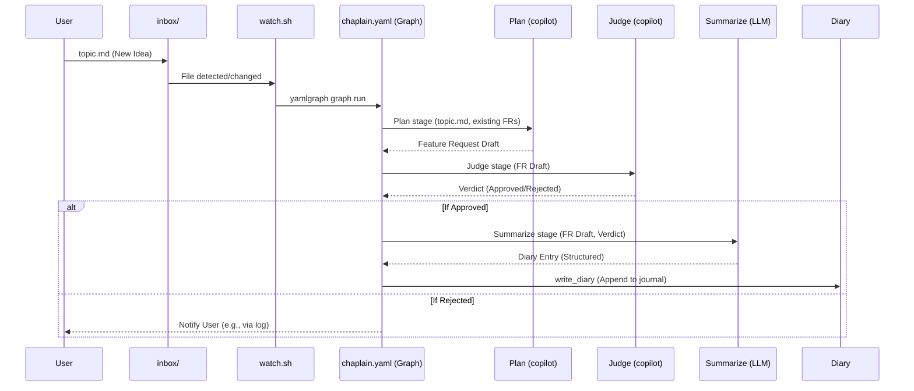

# Chaplain Pipeline: Automated Feature Planning

The YAMLGraph development pipeline is designed to automate and streamline various aspects of software development. A cornerstone of this automation is the **Chaplain Pipeline**, an innovative workflow that transforms nascent ideas into structured feature requests and valuable diary entries. Its purpose is to provide an automated "thought partner" that helps refine concepts, document decisions, and maintain a living history of project evolution, freeing human developers to focus on implementation rather than administrative overhead.

## The Watch Loop: Keeping an Eye on Inspiration

At the heart of the Chaplain is a simple yet effective mechanism: the `watch.sh` script. This script acts as a persistent sentinel, continuously monitoring a designated input directory, specifically `.chaplain/inbox/`. The *why* behind this is to create a low-friction way for developers to inject new ideas into the system. Instead of navigating complex UIs or command-line arguments, one simply drops a Markdown file containing a topic description into the inbox.

When a new file appears or an existing one is modified in `.chaplain/inbox/`, `watch.sh` springs into action. It incorporates a debouncing mechanism, which is crucial for preventing redundant processing during rapid file changes. This ensures that the pipeline isn't triggered multiple times for minor edits, optimizing resource usage. Once a stable change is detected, `watch.sh` invokes the core of our automation: `yamlgraph graph run`. This command instructs the YAMLGraph engine to execute the `chaplain.yaml` graph, passing the newly detected topic file as input. This design decision, migrating from earlier inline scripting, standardized the Chaplain's execution under the robust and configurable YAMLGraph framework.

## The Full Chaplain Pipeline

The Chaplain pipeline orchestrates several intelligent stages to convert a raw idea into actionable development artifacts. This sequence ensures that ideas are not only processed but also refined, judged, and documented systematically.

## Stage Details: From Idea to Action

Each stage within the Chaplain pipeline serves a distinct purpose, building upon the output of the previous one to progressively refine and document the initial idea.

#### Plan (copilot node)

The `Plan` stage is the initial creative engine of the Chaplain. It leverages a `copilot` node, which is a specialized YAMLGraph node type designed to interface directly with large language models (LLMs).
*   **Prompt**: This node is fed a carefully crafted prompt instructing the LLM to act as a "feature planner." The prompt encourages the LLM to think critically about the user's topic, considering user needs, potential impacts, and implementation scope.
*   **Reads**: It reads the `topic.md` file provided by the user, which contains the raw idea. Crucially, it also has access to existing feature requests (FRs). This context allows the LLM to avoid proposing duplicate features and to build upon existing work, ensuring coherence across the project.
*   **Produces**: The output of the `Plan` stage is a detailed feature request draft. This draft adheres to a predefined structure, often including sections for problem statement, proposed solution, acceptance criteria, and potential edge cases. This draft is saved into the `.chaplain/drafts/` directory, making it available for review and for the subsequent `Judge` stage.

#### Judge (copilot node)

Following the initial planning, the `Judge` stage steps in to critically evaluate the generated feature request draft. This is another `copilot` node, but with a different persona and prompt.
*   **Checks**: The `Judge` node's prompt directs the LLM to act as a "project manager" or "architect." It scrutinizes the feature request draft against a set of predefined criteria, which might include: feasibility, alignment with project goals, potential for technical debt, clarity, and completeness. It also cross-references against existing FRs and the overall project vision.
*   **Verdict**: Based on its evaluation, the `Judge` renders a verdict: either `Approved` or `Rejected`. This verdict is a critical decision point for the pipeline.
*   **Rejection Handling**: If the feature request is `Rejected`, the pipeline can be configured to take various actions. Typically, it might log the rejection with a reason, move the draft to a "rejected" folder, or even prompt the `Plan` stage for a revised attempt. This prevents unviable ideas from proceeding further, saving downstream effort.

#### Summarize (LLM node)

If the `Judge` approves the feature request, the pipeline proceeds to the `Summarize` stage. This stage is responsible for distilling the essence of the new feature into a concise and structured diary entry.
*   **Distills**: It takes the approved feature request draft and the judge's verdict as input. Its purpose is to extract the core information: what was proposed, why it was approved, and its key implications.
*   **Schema**: The output of this stage is a structured diary entry, typically following a schema that includes:
    *   `theme`: A short, descriptive title for the entry.
    *   `body`: A paragraph or two summarizing the feature and its significance.
    *   `seed`: Keywords or tags that can be used for future search and retrieval.
    This structured output makes the diary entries easily searchable and consumable.

#### write_diary (Python tool)

The final step in the Chaplain pipeline for an approved feature is to record its existence in the project's development diary.
*   **Destination**: The `write_diary` tool is a custom Python script (extracted to `examples/shared/diary.py` for reusability) that appends the structured summary from the `Summarize` stage to the project's canonical development diary, often located at `docs/diary.md` or a similar central log.
*   **Format**: It ensures the entry is formatted consistently, typically with a timestamp, the `theme`, and the `body`, making the diary a chronological and readable account of project evolution. This automated documentation ensures that every significant decision and feature addition is recorded, providing invaluable context for current and future team members.

## Feature Request History: Building the Chaplain

The Chaplain pipeline itself is a product of iterative development, with each major capability introduced through a structured feature request. Understanding its evolution highlights the power of the YAMLGraph approach.

| FR     | Title                     | What It Added                               |
| :----- | :------------------------ | :------------------------------------------ |
| FR-068 | Chaplain watch loop       | Initial concept for `watch.sh`              |
| FR-081 | Copilot node type         | Enabled direct LLM integration within graphs |
| FR-084 | Migration to graph        | `watch.sh` invokes `yamlgraph graph run`    |
| FR-093 | Diary append              | Automatic generation of diary entries       |
| FR-097 | Shared diary utils        | Reusable `write_diary` Python utility       |
| FR-098 | Consolidated graph        | Single, canonical `chaplain.yaml` graph     |

## Running the Chaplain

Leveraging the Chaplain pipeline is designed to be as straightforward as possible:

1.  **Drop a topic**: Create a new Markdown file (e.g., `my-new-idea.md`) in the `.chaplain/inbox/` directory. Populate it with your idea, problem statement, or any initial thoughts.
2.  **Wait for processing**: The `watch.sh` script, running in the background, will detect your new file. After a brief debounce period, it will automatically trigger the `chaplain.yaml` graph.
3.  **Retrieve the draft**: Once the pipeline completes, you will find a generated feature request draft in the `.chaplain/drafts/` directory. If approved, a corresponding entry will also be appended to your project's development diary.

This simple interaction loop allows developers to quickly prototype ideas, receive automated feedback, and ensure that all significant project changes are documented without manual effort, embodying the core principles of the YAMLGraph Development Pipeline.
