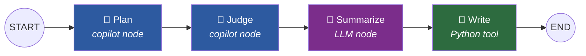
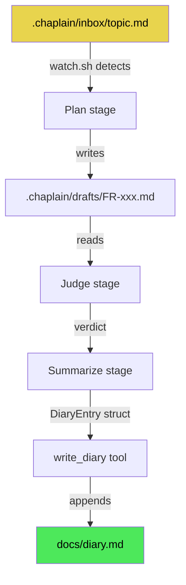

# Chapter 03: The Chaplain Pipeline

> *"Let agents scour competing systems and return with truth."*
> — Sermon of the Chaplain, The Scripture

---

## What is the Chaplain?

Every development team has an implicit quality loop: someone writes a proposal, someone else reviews it, the outcome is recorded. In most projects, this loop lives in people's heads — informal, inconsistent, easily skipped under deadline pressure.

The Chaplain is YAMLGraph's answer to that problem. It is an automated quality guardian — a pipeline that watches for new feature ideas, transforms them into structured proposals, critically examines them, and records the results in the project diary. The entire workflow runs without human intervention once triggered, yet it produces artifacts that humans review and act upon.

The name comes from the project's Scripture metaphor: just as a chaplain witnesses and blesses, this pipeline witnesses every feature proposal and renders judgement. The pipeline embodies the Sermon's sequence — **Research, Plan, Judge, Enforce, Distill** — compressed into four automated stages.

What makes the Chaplain interesting is that it combines two fundamentally different execution models in a single graph:

1. **Copilot nodes** — stages where GitHub Copilot CLI performs complex, agentic tasks (reading files, researching codebases, writing documents)
2. **LLM nodes** — stages where a language model performs focused, structured analysis
3. **Python tool nodes** — stages where deterministic code handles side effects (writing to disk)

This mix of agent, model, and tool is the Chaplain's defining characteristic. It demonstrates that YAMLGraph graphs are not limited to LLM-only pipelines — they orchestrate heterogeneous execution backends under a single declarative structure.

---

## The Watch Loop

The Chaplain's entry point is a shell script that implements a simple polling loop. As defined in `.chaplain/watch.sh`:

```bash
#!/usr/bin/env bash
# .chaplain/watch.sh — Thin polling wrapper for Plan → Judge workflow
set -euo pipefail
cd "$(dirname "$0")/.."

INBOX=".chaplain/inbox"
DRAFTS=".chaplain/drafts"
POLL=5

echo "👀 Watching $INBOX/"

while true; do
    topic_file=$(find "$INBOX" -name "*.md" -type f 2>/dev/null | head -1)
    [[ -z "$topic_file" ]] && { sleep "$POLL"; continue; }

    echo "📋 Processing: $topic_file"
    yamlgraph graph run examples/copilot/graph.yaml \
        --var topic_file="$topic_file" \
        --var drafts_dir="$DRAFTS" \
        --var date="$(date +%Y-%m-%d)" \
        --var diary_prefix="Chaplain" \
        --full

    echo ""
done
```

*Source: `.chaplain/watch.sh`*

### How It Works

The loop follows a **mailbox pattern** — a design as old as Unix itself:

1. **Poll**: Every 5 seconds, scan `.chaplain/inbox/` for Markdown files
2. **Pick**: Take the first file found (FIFO by filesystem order)
3. **Dispatch**: Pass the file path to the YAMLGraph pipeline as a variable
4. **Repeat**: Loop back and check for the next file

The watch script is deliberately thin — just 15 lines of bash. It contains zero business logic. All intelligence lives in the YAML graph and its prompts. The script's only job is to detect a trigger condition (a new `.md` file in the inbox) and invoke the pipeline with the right variables.

### The Variable Handoff

Four variables flow from the shell into the graph:

| Variable | Value | Purpose |
|----------|-------|---------|
| `topic_file` | Path to the inbox file | What to plan |
| `drafts_dir` | `.chaplain/drafts` | Where to write the draft |
| `date` | Current date (`YYYY-MM-DD`) | Diary entry timestamp |
| `diary_prefix` | `"Chaplain"` | Distinguishes Chaplain entries from other diary sources |

This is a clean boundary: the shell handles filesystem detection and date generation (side effects), while the graph handles all reasoning and document production (logic). The three-layer architecture in action.

### Using the Watch Loop

To start the Chaplain watching for proposals:

```bash
# Start the watcher
bash .chaplain/watch.sh

# In another terminal, drop a topic into the inbox
echo "# Idea: Add streaming support for map nodes" > .chaplain/inbox/streaming.md
```

The watcher picks up `streaming.md`, runs the full pipeline, and the topic file is deleted by the Plan stage upon completion. The result: a feature request in `.chaplain/drafts/`, a judgement rendered, and a diary entry appended to `docs/diary.md`.

---

## The Pipeline Stages

The Chaplain pipeline is a linear four-stage graph. As defined in `examples/copilot/graph.yaml`:



Each stage has a distinct execution model and a specific role in the workflow.

### Stage 1: Plan

**Node type:** `copilot`
**Prompt:** `prompts/plan.yaml`
**State key:** `plan_result`

The Plan stage reads the raw topic file and transforms it into a structured feature request. This is the heaviest stage — it involves reading files, researching the codebase, and writing a multi-section document.

As defined in `examples/copilot/prompts/plan.yaml`:

```yaml
system: |
  You are a feature request planner. Your task is to transform a rough topic
  into a well-structured feature request document.

user: |
  **Plan.** Read {topic_file}. Write the feature request in {drafts_dir}/.

  Follow this process:
  1. Read and understand the topic/idea in the file
  2. Research existing patterns in the codebase
  3. Define clear objectives and constraints
  4. Write acceptance criteria
  5. Propose an implementation approach

  Follow the template in feature-requests/TEMPLATE.md.
  Delete {topic_file} when complete.

  Ensure the feature request is:
  - Clear and unambiguous
  - Minimal in scope (single responsibility)
  - Testable (has measurable acceptance criteria)
  - Aligned with existing architecture
```

The prompt instructs Copilot to follow the project's existing feature request template — maintaining consistency with manually-written proposals. The `cli_flags` grant Copilot full filesystem access (`allow_all_paths`) and tool access (`allow_all_tools`), since the Plan stage needs to read source files, examine the codebase structure, and write the draft document.

The stage has a 500-second timeout, reflecting the fact that agentic work — reading multiple files, reasoning about architecture, writing a document — takes substantially longer than a single LLM call.

**Example output:** A complete feature request document in `.chaplain/drafts/` following the project template, with objectives, constraints, acceptance criteria, and implementation approach.

### Stage 2: Judge

**Node type:** `copilot`
**Prompt:** `prompts/judge.yaml`
**State key:** `judge_result`

The Judge stage examines the draft feature request and renders a verdict. This stage embodies the Scripture's principle: *"When I feel certain, let that be the sign to Judge."*

As defined in `examples/copilot/prompts/judge.yaml`:

```yaml
system: |
  You are a feature request reviewer. Your task is to critically examine
  feature requests and render a verdict: APPROVE, AMEND, or REJECT.

user: |
  **Judge.** Examine the feature request in {drafts_dir}/.

  Critically evaluate:
  1. Is the scope clear and minimal?
  2. Are there contradictions or ambiguities?
  3. Are acceptance criteria measurable?
  4. Is the implementation approach feasible?
  5. Does it align with existing architecture?

  Render your verdict:

  **APPROVE:** If the feature request is clear, minimal, and internally consistent.
  - Freeze the scope
  - Grant authority to implement
  - Move the file to feature-requests/

  **AMEND:** If the feature request needs work.
  - List specific issues to address
  - Write issues into the file
  - Move the file back to .chaplain/inbox/

  **REJECT:** If the feature request is unfeasible.
  - Add **Status:** Rejected to the file
  - Document the reason for rejection
  - Move to feature-requests/
```

The Judge doesn't just say "good" or "bad" — it takes action. An approved feature request is moved to `feature-requests/` (ready for implementation). An amended feature request is moved back to the inbox, where the watch loop will pick it up again for another Plan→Judge cycle. This creates an implicit feedback loop: proposals can bounce between Plan and Judge until they meet the quality bar.

The five evaluation criteria map directly to the Scripture's quality standards: clarity, minimality, consistency, measurability, and architectural alignment.

**Example output:** A verdict with specific reasoning, plus the feature request file moved to its final destination.

### Stage 3: Summarize

**Node type:** `llm`
**Prompt:** `prompts/summarize.yaml`
**State key:** `diary_entry`

The Summarize stage is where the pipeline shifts from agentic work to focused analysis. An LLM reads the outputs of both Plan and Judge stages, then distills them into a structured diary entry.

As defined in `examples/copilot/prompts/summarize.yaml`:

```yaml
metadata:
  provider: anthropic
  model: claude-sonnet-4-20250514

system: |
  You are a reflective analyst who distills FR planning sessions into
  concise diary entries for `docs/diary.md`.

  Produce structured output with:
  - **theme**: A short title capturing the session's main topic (3-7 words)
  - **body**: A ~100-word reflection on what was planned or judged
  - **seed**: A forward-looking question to promote new ideas

user: |
  Analyze the following Plan→Judge workflow output and create a diary entry.

  **Plan Output:**
  {{ plan_output | default("No plan available") }}

  **Judge Output:**
  {{ judge_output | default("No judgement available") }}

  Summarize the key decisions, insights, and any cognitive traps encountered.
  End with a seed question that promotes future exploration.

schema:
  name: DiaryEntry
  fields:
    theme:
      type: str
      description: "Short title for the diary entry (3-7 words)"
    body:
      type: str
      description: "~100-word reflection on the session"
    seed:
      type: str
      description: "Forward-looking question to promote new ideas"
```

Several design choices are worth noting:

1. **Explicit provider pinning** — The metadata section specifies `anthropic` and a specific model. Unlike the copilot nodes (which delegate to whatever Copilot CLI provides), the summarize node uses a predictable, consistent model for structured output.

2. **Jinja2 templates** — The `{{ }}` syntax with `default()` filters shows Jinja2 in action. If either stage produced no output, the template gracefully degrades rather than failing.

3. **Inline schema** — The `DiaryEntry` schema is defined directly in the prompt YAML, producing a Pydantic-validated structured output with exactly three fields. No untyped dicts wandering the codebase (Commandment V).

**Example output:**
```json
{
  "theme": "Streaming Support for Map Nodes",
  "body": "The session explored adding streaming callbacks to parallel map node execution. The Plan identified three approaches: per-chunk streaming, batch-then-stream, and hybrid. The Judge approved the hybrid approach as minimal and testable, noting that per-chunk streaming would require reworking the executor's synchronous core. Key insight: streaming reveals what batch conceals — failures surface earlier when output flows incrementally.",
  "seed": "Could streaming map nodes enable real-time progress bars in the CLI?"
}
```

### Stage 4: Write Diary

**Node type:** `python` (tool)
**Tool:** `write_diary_tool`
**State key:** `written`

The final stage is pure Python — no LLM, no agent. It takes the structured `DiaryEntry` from the Summarize stage and appends it to `docs/diary.md`.

As defined in `examples/shared/diary.py`:

```python
def write_diary(state: dict) -> dict:
    """Format and append diary entry from synthesized LLM output.

    Graph tool — reads diary_entry from state (Pydantic model with
    theme, body, seed fields), formats it, and appends to docs/diary.md.
    """
    entry_data = state.get("diary_entry", {})
    date_str = state.get("date", "unknown")
    prefix = state.get("diary_prefix", "World Digest")

    # Handle Pydantic model, dict, or string representation
    if isinstance(entry_data, str):
        # Parse string representation like: theme='...' body='...' seed='...'
        theme_match = re.search(r"theme='([^']+)'", entry_data)
        # Body can contain quotes, so match until ' seed='
        body_match = re.search(r"body='(.+?)'\s+seed='", entry_data, re.DOTALL)
        seed_match = re.search(r"seed='([^']+)'", entry_data)
        theme = theme_match.group(1) if theme_match else "Developments"
        body = body_match.group(1) if body_match else "No content."
        seed = seed_match.group(1) if seed_match else "What did we miss?"
    else:
        theme = getattr(entry_data, "theme", None) or entry_data.get(
            "theme", "Developments"
        )
        body = getattr(entry_data, "body", None) or entry_data.get(
            "body", "No content."
        )
        seed = getattr(entry_data, "seed", None) or entry_data.get(
            "seed", "What did we miss?"
        )

    entry = format_diary_entry(
        date_str=date_str,
        theme=theme,
        body=body,
        seed=seed,
        prefix=prefix,
    )

    append_to_diary(DIARY_PATH, entry)
    logger.info(f"✓ Entry appended to {DIARY_PATH}")

    return {"written": True}
```

The tool demonstrates **defensive normalization** — the `entry_data` might arrive as a Pydantic model, a dict, or a string representation, depending on the LLM provider and serialization path. The tool handles all three forms, extracting the same three fields regardless of input shape. This is the One Law in practice: *normalize at the boundary where external data enters*.

The `format_diary_entry` function produces the canonical diary format:

```markdown
---

## 2026-02-25: Chaplain — Streaming Support for Map Nodes

The session explored adding streaming callbacks to parallel map node execution...

**Seed:** Could streaming map nodes enable real-time progress bars in the CLI?
```

---

## The Graph Structure

Here is the complete graph definition that ties all four stages together. As defined in `examples/copilot/graph.yaml`:

```yaml
version: "1.0"
name: copilot-workflow
description: Feature request workflow using copilot nodes for planning and judgement

prompts_relative: true
prompts_dir: prompts

state:
  topic_file: str
  drafts_dir: str
  date: str
  diary_prefix: str
  diary_entry: dict
  written: bool

tools:
  write_diary_tool:
    type: python
    module: examples.shared.diary
    function: write_diary

nodes:
  plan:
    type: copilot
    prompt: plan
    backend: cli
    cli_flags:
      allow_all_paths: true
      allow_all_tools: true
    variables:
      topic_file: "{state.topic_file}"
      drafts_dir: "{state.drafts_dir}"
    state_key: plan_result
    timeout: 500

  judge:
    type: copilot
    prompt: judge
    backend: cli
    cli_flags:
      allow_all_paths: true
      allow_all_tools: true
    variables:
      drafts_dir: "{state.drafts_dir}"
    state_key: judge_result
    timeout: 500

  summarize:
    type: llm
    prompt: summarize
    variables:
      plan_output: "{state.plan_result}"
      judge_output: "{state.judge_result}"
    state_key: diary_entry

  write_diary:
    type: python
    tool: write_diary_tool
    state_key: written

edges:
  - from: START
    to: plan
  - from: plan
    to: judge
  - from: judge
    to: summarize
  - from: summarize
    to: write_diary
  - from: write_diary
    to: END
```

### Structural Observations

**Explicit state declaration.** The `state:` block declares every field that flows through the graph. This is not just documentation — the state builder uses these declarations to generate a typed `TypedDict` at compile time. The graph won't compile if a node references a state key that doesn't exist.

**Prompts as references.** The `prompts_relative: true` and `prompts_dir: prompts` settings mean each node's `prompt:` field is resolved relative to the graph file. `plan` resolves to `examples/copilot/prompts/plan.yaml`. This keeps prompts co-located with the graph that uses them.

**Tool registration.** The `write_diary_tool` is declared in `tools:` with a Python module path and function name. The node `write_diary` references it by name. YAMLGraph's tool registry resolves this at compile time and injects the function into the node's execution context.

**Linear edges.** The `edges:` section defines a simple chain: `START → plan → judge → summarize → write_diary → END`. There are no conditional branches or routers — this pipeline always runs all four stages in sequence.

**Mixed execution backends.** The same graph seamlessly combines three node types:

| Node | Type | Backend | What it does |
|------|------|---------|-------------|
| `plan` | `copilot` | CLI agent | Reads files, researches code, writes draft |
| `judge` | `copilot` | CLI agent | Reviews draft, renders verdict, moves files |
| `summarize` | `llm` | Anthropic API | Distills outputs into structured diary entry |
| `write_diary` | `python` | Python function | Formats and appends entry to disk |

This heterogeneity is the graph's key demonstration. A single YAML file coordinates an agent that explores a codebase, an agent that reviews a document, a model that produces structured output, and a function that writes to disk. Four different execution models, one declarative pipeline.

---

## Integration with the Diary

The Chaplain's final output is an entry in `docs/diary.md` — the project's metacognitive journal. The integration is mediated by the shared `write_diary` tool in `examples/shared/diary.py`, which serves as the single write path for all diary-producing pipelines.

### The Diary Entry Lifecycle



The Chaplain's diary entries are distinguished from other sources by their prefix. The watch script passes `diary_prefix="Chaplain"`, which produces entries headed:

```
## 2026-02-25: Chaplain — Theme Goes Here
```

Other pipelines using the same `write_diary` tool might use `"World Digest"` or `"Inquisitor"` as their prefix, but the format is identical. This shared tool ensures every diary entry — regardless of origin — follows the canonical format with a date, prefix, theme, body, and seed question.

### The Seed Question

Every Chaplain diary entry ends with a **Seed** — a forward-looking question planted for future development. This is not decorative. The Scripture's Distill step requires it: *"Plant a Seed — a forward-looking question to grow new ideas."*

Seeds serve as connective tissue between development sessions. A Seed planted by Monday's Chaplain run might inspire Tuesday's feature topic. Over time, the diary accumulates a garden of unanswered questions — a backlog of ideas generated not by human brainstorming, but by automated reflection on the project's own evolution.

### Why a Shared Tool?

The `write_diary` function lives in `examples/shared/diary.py` rather than in the Chaplain's own directory. As noted in the module's docstring (FR-097), it was extracted for neutral ownership — multiple pipelines need diary write access, and duplicating the formatting logic would violate Commandment VIII (*kill all entropy*).

The tool handles three input shapes — Pydantic model, dict, and string — because different LLM providers and serialization paths produce different representations of the same structured data. This defensive normalization at the tool boundary means the upstream graph nodes don't need to worry about output format compatibility. The tool absorbs the variance.

---

## Summary

The Chaplain Pipeline demonstrates several core YAMLGraph patterns:

1. **Shell as trigger, YAML as logic** — The watch loop is a thin dispatcher; all intelligence lives in the graph definition and its prompts.

2. **Mixed node types** — Copilot agents, LLM calls, and Python tools coexist in a single graph, each handling the task best suited to its capabilities.

3. **Structured intermediate state** — The Pydantic-validated `DiaryEntry` schema ensures that the handoff between Summarize and Write is typed and predictable.

4. **Shared side-effect tools** — The diary writer is a reusable component, not embedded in the pipeline. Multiple workflows share it without duplication.

5. **The Sermon in code** — Plan, Judge, Distill — the Scripture's development ceremony, automated and repeatable.

The Chaplain is not the project's most complex pipeline. It has no routers, no conditional branches, no parallel execution. Its value lies in demonstrating that a linear four-stage graph, combining three execution backends, can automate a development workflow that would otherwise require manual coordination between tools, models, and documentation practices.

In the next chapter, we'll examine more complex graph structures — routers that branch based on LLM decisions, and map nodes that fan out into parallel execution.

