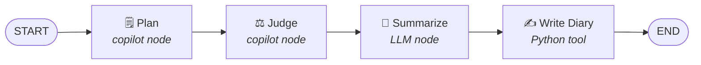

# Chapter 03: The Chaplain Pipeline

*From the YAMLGraph Development Pipeline eBook*

---

## 1. What is the Chaplain?

The Chaplain is YAMLGraph's automated quality guardian — a pipeline that watches for new ideas, transforms them into structured feature requests, critically reviews them, and records its reflections in a persistent diary. It is the embodiment of the Sermon's cycle: **Plan → Judge → Summarize → Write**.

Where a human developer might skip the review step under time pressure, the Chaplain never does. It enforces the doctrine mechanically: every idea must survive planning *and* judgement before it earns a place in the project's memory. The Chaplain doesn't write code — it writes the specifications that code must satisfy.

The pipeline is defined entirely in YAML, orchestrated by YAMLGraph, and triggered by a simple shell loop. It demonstrates a core thesis of the framework: that even meta-development workflows — the process of managing process — can be captured declaratively.

---

## 2. The Watch Loop

The Chaplain's entry point is a thin polling script that monitors an inbox directory for new topics.

### How It Works

> As defined in `.chaplain/watch.sh`:

```bash
#!/usr/bin/env bash
set -euo pipefail
cd "$(dirname "$0")/.."

INBOX=".chaplain/inbox"
DRAFTS=".chaplain/drafts"
POLL=5

echo "👀 Watching $INBOX/"

while true; do
    topic_file=$(find "$INBOX" -name "*.md" -type f 2>/dev/null | head -1)
    [[ -z "$topic_file" ]] && { sleep "$POLL"; continue; }

    echo "📋 Processing: $topic_file"
    yamlgraph graph run examples/copilot/graph.yaml \
        --var topic_file="$topic_file" \
        --var drafts_dir="$DRAFTS" \
        --var date="$(date +%Y-%m-%d)" \
        --var diary_prefix="Chaplain" \
        --full

    echo ""
done
```

### The Mechanics

**What it watches:** The `.chaplain/inbox/` directory for any `.md` files. A developer (or another agent) drops a markdown file containing a rough idea into this folder.

**How it monitors:** A `while true` loop with a 5-second polling interval (`POLL=5`). On each iteration, `find` checks for the first available `.md` file. If the inbox is empty, the loop sleeps and retries. No filesystem events, no complexity — just a reliable poll.

**When it triggers:** The moment a `.md` file appears in the inbox, the script invokes `yamlgraph graph run` with four variables:

| Variable | Source | Purpose |
|---|---|---|
| `topic_file` | The discovered `.md` path | Input for the Plan stage |
| `drafts_dir` | `.chaplain/drafts` | Working directory for feature request drafts |
| `date` | `$(date +%Y-%m-%d)` | Timestamp for the diary entry |
| `diary_prefix` | `"Chaplain"` | Labels diary entries as Chaplain-originated |

The `--full` flag ensures complete output, making the pipeline's reasoning visible in the terminal.

---

## 3. The Pipeline Stages

The Chaplain pipeline is a four-stage linear graph. Each stage has a single responsibility, and the output of each feeds the next.



### Stage 1: Plan

**What it does:** Reads the raw topic file from the inbox and transforms it into a structured feature request following the project's template. The Plan stage researches existing patterns in the codebase, defines objectives and constraints, writes acceptance criteria, and proposes an implementation approach. It deletes the topic file from the inbox when finished.

**Node type:** `copilot` — delegates to the GitHub Copilot CLI, which has full filesystem access (`allow_all_paths: true`) and tool access (`allow_all_tools: true`).

> As defined in `examples/copilot/prompts/plan.yaml`:

```yaml
system: |
  You are a feature request planner. Your task is to transform a rough topic
  into a well-structured feature request document.

user: |
  **Plan.** Read {topic_file}. Write the feature request in {drafts_dir}/.

  Follow this process:
  1. Read and understand the topic/idea in the file
  2. Research existing patterns in the codebase
  3. Define clear objectives and constraints
  4. Write acceptance criteria
  5. Propose an implementation approach

  Follow the template in feature-requests/TEMPLATE.md.
  Delete {topic_file} when complete.

  Ensure the feature request is:
  - Clear and unambiguous
  - Minimal in scope (single responsibility)
  - Testable (has measurable acceptance criteria)
  - Aligned with existing architecture
```

**Example output:** A markdown file in `.chaplain/drafts/` following the feature request template — with a title, status, objectives, constraints, acceptance criteria, and implementation plan.

**Timeout:** 500 seconds, reflecting the depth of research expected.

---

### Stage 2: Judge

**What it does:** Critically examines the feature request drafted by the Plan stage. The Judge evaluates five dimensions: scope clarity, internal contradictions, measurability of acceptance criteria, implementation feasibility, and architectural alignment. It renders one of three verdicts:

- **APPROVE** — Scope is frozen, authority granted, file moved to `feature-requests/`
- **AMEND** — Issues documented in the file, returned to `.chaplain/inbox/` for re-planning
- **REJECT** — Status set to Rejected with rationale, filed in `feature-requests/`

**Node type:** `copilot` — same CLI delegation with full access, allowing the Judge to read both the draft and the existing codebase for context.

> As defined in `examples/copilot/prompts/judge.yaml`:

```yaml
system: |
  You are a feature request reviewer. Your task is to critically examine
  feature requests and render a verdict: APPROVE, AMEND, or REJECT.

user: |
  **Judge.** Examine the feature request in {drafts_dir}/.

  Critically evaluate:
  1. Is the scope clear and minimal?
  2. Are there contradictions or ambiguities?
  3. Are acceptance criteria measurable?
  4. Is the implementation approach feasible?
  5. Does it align with existing architecture?

  Render your verdict:

  **APPROVE:** If the feature request is clear, minimal, and internally consistent.
  - Freeze the scope
  - Grant authority to implement
  - Move the file to feature-requests/

  **AMEND:** If the feature request needs work.
  - List specific issues to address
  - Write issues into the file
  - Move the file back to .chaplain/inbox/

  **REJECT:** If the feature request is unfeasible.
  - Add **Status:** Rejected to the file
  - Document the reason for rejection
  - Move to feature-requests/
```

**Example output:** A verdict with reasoning — either the draft is approved and moved to `feature-requests/`, amended with inline issues and returned to the inbox, or rejected with documented rationale.

---

### Stage 3: Summarize

**What it does:** Distills the combined Plan and Judge outputs into a structured diary entry. This is the reflective stage — it extracts the key decisions, identifies cognitive traps encountered during planning, and produces a forward-looking seed question.

**Node type:** `llm` — a standard LLM call (not a Copilot delegation), using Anthropic's Claude Sonnet model. This is deliberate: summarization is a pure language task that doesn't need filesystem access.

> As defined in `examples/copilot/prompts/summarize.yaml`:

```yaml
system: |
  You are a reflective analyst who distills FR planning sessions into
  concise diary entries for `docs/diary.md`.

  Produce structured output with:
  - **theme**: A short title capturing the session's main topic (3-7 words)
  - **body**: A ~100-word reflection on what was planned or judged
  - **seed**: A forward-looking question to promote new ideas

user: |
  Analyze the following Plan→Judge workflow output and create a diary entry.

  **Plan Output:**
  {{ plan_output | default("No plan available") }}

  **Judge Output:**
  {{ judge_output | default("No judgement available") }}

  Summarize the key decisions, insights, and any cognitive traps encountered.
  End with a seed question that promotes future exploration.
```

The prompt uses Jinja2 templating (note the `{{ }}` syntax with `default` filters) to safely handle cases where earlier stages produced no output.

**Schema enforcement:** The output is validated against a Pydantic-style inline schema:

```yaml
schema:
  name: DiaryEntry
  fields:
    theme:
      type: str
      description: "Short title for the diary entry (3-7 words)"
    body:
      type: str
      description: "~100-word reflection on the session"
    seed:
      type: str
      description: "Forward-looking question to promote new ideas"
```

This guarantees the LLM produces exactly three fields with the right types — no unstructured prose, no missing fields.

**Example output:**

```json
{
  "theme": "Streaming Subgraph Integration",
  "body": "The session explored adding subgraph parameters to the streaming subsystem. The Plan identified that existing StreamState lacked subgraph context, while the Judge caught a scope creep risk in the proposed checkpoint integration. Key insight: normalize subgraph references at the graph compilation boundary, not at streaming time. The trap of downstream fixing was avoided by anchoring the change in graph_loader.py rather than the streaming layer.",
  "seed": "Could subgraph streaming metadata enable runtime graph visualization?"
}
```

---

### Stage 4: Write Diary

**What it does:** Takes the structured `DiaryEntry` from the Summarize stage and appends a formatted markdown entry to `docs/diary.md`.

**Node type:** `python` — a pure Python tool function, no LLM involved. This is the side-effect boundary: all prior stages are reasoning; this stage is action.

> As defined in `examples/shared/diary.py`:

```python
def write_diary(state: dict) -> dict:
    """Format and append diary entry from synthesized LLM output."""
    entry_data = state.get("diary_entry", {})
    date_str = state.get("date", "unknown")
    prefix = state.get("diary_prefix", "World Digest")

    # Extract theme, body, seed from Pydantic model, dict, or string
    theme = ...
    body = ...
    seed = ...

    entry = format_diary_entry(
        date_str=date_str, theme=theme, body=body,
        seed=seed, prefix=prefix,
    )

    append_to_diary(DIARY_PATH, entry)
    return {"written": True}
```

The `write_diary` function is resilient to three input formats: Pydantic models (from structured LLM output), plain dicts (from JSON), and string representations (from serialized state). This boundary normalization follows the project's core law: *"Normalize at the boundary where external data enters, not downstream where it manifests."*

The formatted output follows the diary's canonical format:

```markdown
---

## 2026-02-26: Chaplain — Streaming Subgraph Integration

The session explored adding subgraph parameters to the streaming subsystem...

**Seed:** Could subgraph streaming metadata enable runtime graph visualization?
```

---

## 4. The Graph Structure

The entire pipeline is defined in a single YAML file. Here is the complete graph structure with its key architectural decisions annotated.

> As defined in `examples/copilot/graph.yaml`:

### State Declaration

```yaml
state:
  topic_file: str        # Path to the topic file (e.g., .chaplain/inbox/topic.md)
  drafts_dir: str        # Output directory for drafts
  date: str              # Date for diary entry (YYYY-MM-DD)
  diary_prefix: str      # Diary entry prefix (default: Chaplain)
  diary_entry: dict      # Output from summarize node (theme, body, seed)
  written: bool          # True after diary append
```

Six state fields — four provided as input variables by the watch loop, two produced internally by the pipeline. The state is fully declarative: no Python class needed, no manual TypedDict.

### Node Types in Action

The pipeline showcases three of YAMLGraph's node types working together:

| Node | Type | Engine | Purpose |
|---|---|---|---|
| `plan` | `copilot` | GitHub Copilot CLI | Research and draft feature request |
| `judge` | `copilot` | GitHub Copilot CLI | Critical review and verdict |
| `summarize` | `llm` | Anthropic Claude | Distill into structured diary entry |
| `write_diary` | `python` | Python function | Append to `docs/diary.md` |

This demonstrates a key YAMLGraph pattern: **mixing execution engines in a single graph**. The copilot nodes delegate to an external agent (Copilot CLI) for tasks requiring filesystem interaction. The LLM node calls a language model directly for pure reasoning. The Python node handles the side effect of writing to disk. Each node uses the right tool for its job.

### Edge Flow

```yaml
edges:
  - from: START
    to: plan
  - from: plan
    to: judge
  - from: judge
    to: summarize
  - from: summarize
    to: write_diary
  - from: write_diary
    to: END
```

A strictly linear pipeline — no conditionals, no branches, no loops. This is intentional. The Chaplain's value comes from the *content* of each stage, not from complex control flow. The Judge's AMEND verdict doesn't trigger a programmatic loop back to Plan; instead, it moves the file back to the inbox, where the watch loop's *next iteration* will re-trigger the pipeline. This keeps the graph simple and the retry mechanism external.

---

## 5. Integration with the Diary

The diary (`docs/diary.md`) is the Chaplain's persistent memory — a chronological record of every planning session it conducts.

### The Write Path

```
Summarize (LLM) → DiaryEntry {theme, body, seed} → write_diary (Python) → docs/diary.md
```

The `write_diary` tool reads three values from state:

1. **`diary_entry`** — The structured output from the Summarize stage
2. **`date`** — Passed through from the watch loop's `$(date +%Y-%m-%d)`
3. **`diary_prefix`** — Set to `"Chaplain"` by the watch loop, distinguishing these entries from other diary sources (e.g., `"World Digest"` from the news pipeline)

> As defined in `examples/shared/diary.py`:

```python
DIARY_PATH = Path(__file__).resolve().parent.parent.parent / "docs" / "diary.md"

def format_diary_entry(date_str: str, theme: str, body: str, seed: str, prefix: str = "World Digest") -> str:
    return f"\n---\n\n## {date_str}: {prefix} — {theme}\n\n{body}\n\n**Seed:** {seed}\n"

def append_to_diary(path: Path, entry: str) -> None:
    with open(path, "a") as f:
        f.write(entry)
```

The formatting is append-only — no reads, no parsing, no risk of corrupting existing entries. The `DIARY_PATH` is resolved relative to the module's location, ensuring it always points to `docs/diary.md` regardless of the working directory.

### Shared Ownership

The `write_diary` tool lives in `examples/shared/diary.py` — not inside the Chaplain's directory. This is deliberate. The diary is a shared resource used by multiple pipelines (the Chaplain, the diary digest workflow, and potentially others). The shared module was extracted specifically to prevent ownership conflicts, as documented in its header: *"FR-097: Extracted from examples/diary_digest/nodes/writing.py for neutral ownership."*

### The Seed Pattern

Every diary entry ends with a **Seed** — a forward-looking question generated by the Summarize stage. This isn't decoration. Seeds serve as future topic candidates: a developer reading the diary might pick up a seed, write it into a `.md` file, and drop it in `.chaplain/inbox/`. The Chaplain would then plan around it, judge the plan, summarize the session, and plant a new seed. The diary becomes a self-referential loop of ideas.

---

## Summary

The Chaplain pipeline demonstrates that development process automation doesn't require bespoke tooling. Four nodes — two Copilot delegations, one LLM call, one Python function — orchestrated by a YAML graph and triggered by a shell loop, create a quality guardian that:

- **Transforms** rough ideas into structured feature requests
- **Reviews** those requests against five quality dimensions
- **Distills** the session into a reflective diary entry
- **Records** everything in a persistent, append-only log

The entire system is defined in three files: a 20-line shell script, an 82-line YAML graph, and a shared Python module. No framework extensions. No custom orchestration code. Just YAML, prompts, and the tools they invoke.

---

*Next chapter: The Diary — how structured reflections compound into institutional memory.*
