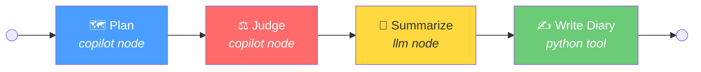
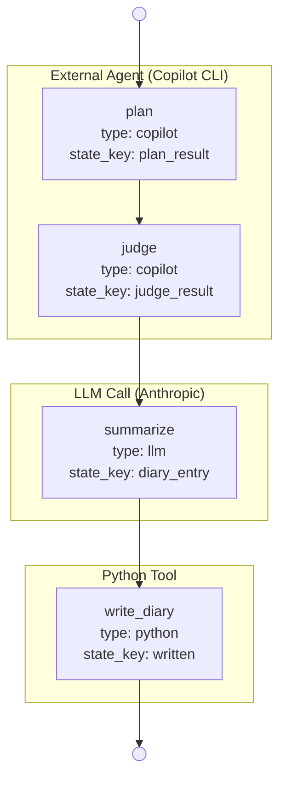

# Chapter 03: The Chaplain Pipeline

*YAMLGraph Development Pipeline eBook — Volume 1*

---

## 1. What is the Chaplain?

The Chaplain is YAMLGraph's automated quality guardian — a background process that watches for incoming development topics, transforms them into structured feature requests, critically evaluates them, and records the resulting insights in a project diary. It is the Sermon of the Chaplain made executable: **Research → Plan → Judge → Enforce → Distill**, collapsed into a single YAML graph that runs without human intervention.

Where Chapter 01 defined *what* the doctrine demands, the Chaplain enforces *how* those demands are met in practice. Every topic dropped into the inbox emerges as a reviewed, scoped feature request with a diary entry capturing the cognitive residue — the insights, traps, and seeds for future work.

The pipeline embodies three of the Scripture's commandments simultaneously:

- **Commandment 1** (research before coding): The Plan stage explores the codebase before proposing anything.
- **Commandment 3** (config is truth): The entire workflow lives in YAML — no hardcoded logic.
- **Commandment 10** (preserve the doctrine): Every run appends to the diary, refining institutional memory.

---

## 2. The Watch Loop

The Chaplain's heartbeat is a thin Bash polling loop defined in `.chaplain/watch.sh`. It is deliberately simple — all intelligence lives in the YAML graph it delegates to.

> As defined in `.chaplain/watch.sh`:

```bash
#!/usr/bin/env bash
# .chaplain/watch.sh — Thin polling wrapper for Plan → Judge workflow
set -euo pipefail
cd "$(dirname "$0")/.."

INBOX=".chaplain/inbox"
DRAFTS=".chaplain/drafts"
POLL=5

echo "👀 Watching $INBOX/"

while true; do
    topic_file=$(find "$INBOX" -name "*.md" -type f 2>/dev/null | head -1)
    [[ -z "$topic_file" ]] && { sleep "$POLL"; continue; }

    echo "📋 Processing: $topic_file"
    yamlgraph graph run examples/copilot/graph.yaml \
        --var topic_file="$topic_file" \
        --var drafts_dir="$DRAFTS" \
        --var date="$(date +%Y-%m-%d)" \
        --var diary_prefix="Chaplain" \
        --full

    echo ""
done
```

### How It Works

| Aspect | Detail |
|--------|--------|
| **What it watches** | `.chaplain/inbox/` for any `.md` files |
| **Poll interval** | Every 5 seconds |
| **Processing order** | First file found (FIFO by filesystem order) |
| **Delegation** | `yamlgraph graph run examples/copilot/graph.yaml` |
| **Variables passed** | `topic_file`, `drafts_dir`, `date`, `diary_prefix` |

The loop follows a strict contract:

1. **Poll** — Scan the inbox for Markdown files.
2. **Dispatch** — If a file exists, invoke the full pipeline via `yamlgraph graph run`.
3. **Repeat** — Return to polling. The graph itself handles file cleanup (the Plan stage deletes the topic file after drafting).

The `--full` flag ensures all state is printed at completion, giving operators visibility into each stage's output. The `--var` flags inject runtime context: the current date, the file path, the output directory, and the diary prefix (`"Chaplain"` to distinguish automated entries from manual ones).

> **Design note:** The watch loop contains zero business logic. It does not parse topics, evaluate quality, or format output. It is a scheduling primitive — a cron job with a faster heartbeat. This separation means the pipeline can be tested, modified, and extended entirely in YAML without touching the shell script.

---

## 3. The Pipeline Stages

The Chaplain pipeline is a four-stage linear graph. Each stage has a distinct responsibility and node type:



> As defined in `examples/copilot/graph.yaml`:

```yaml
version: "1.0"
name: copilot-workflow
description: Feature request workflow using copilot nodes for planning and judgement

edges:
  - from: START
    to: plan
  - from: plan
    to: judge
  - from: judge
    to: summarize
  - from: summarize
    to: write_diary
  - from: write_diary
    to: END
```

The edges form a simple linear chain: `START → plan → judge → summarize → write_diary → END`. There are no conditional branches — every topic passes through all four stages. This is intentional: the Judge stage handles rejection by writing status into the file and moving it, not by short-circuiting the graph. The diary still captures what happened, preserving institutional memory even for rejected ideas.

---

### Stage 1: Plan

**Node type:** `copilot` (delegates to GitHub Copilot CLI)

The Plan stage reads a raw topic file and transforms it into a structured feature request document.

> As defined in `examples/copilot/prompts/plan.yaml`:

```yaml
system: |
  You are a feature request planner. Your task is to transform a rough topic
  into a well-structured feature request document.

user: |
  **Plan.** Read {topic_file}. Write the feature request in {drafts_dir}/.

  Follow this process:
  1. Read and understand the topic/idea in the file
  2. Research existing patterns in the codebase
  3. Define clear objectives and constraints
  4. Write acceptance criteria
  5. Propose an implementation approach

  Follow the template in feature-requests/TEMPLATE.md.
  Delete {topic_file} when complete.

  Ensure the feature request is:
  - Clear and unambiguous
  - Minimal in scope (single responsibility)
  - Testable (has measurable acceptance criteria)
  - Aligned with existing architecture
```

**What it does:**

1. Reads the topic file from the inbox.
2. Researches the codebase to understand existing patterns and constraints.
3. Drafts a complete feature request following the project template.
4. Writes the draft to the `drafts_dir` directory.
5. Deletes the original topic file (inbox cleanup).

**Key configuration** (from the graph node definition):

```yaml
plan:
  type: copilot
  prompt: plan
  backend: cli
  cli_flags:
    allow_all_paths: true    # Copilot can read any file in the repo
    allow_all_tools: true    # Copilot can use all available tools
  variables:
    topic_file: "{state.topic_file}"
    drafts_dir: "{state.drafts_dir}"
  state_key: plan_result
  timeout: 500
```

The `copilot` node type delegates to GitHub Copilot CLI with full filesystem access (`allow_all_paths: true`) so it can research the codebase. The 500-second timeout accommodates complex topics that require extensive exploration.

**Example output** (written to `.chaplain/drafts/FR-xxx.md`):

```markdown
# FR-105: Add Graph Visualization Export

**Status:** Draft
**Priority:** Medium

## Objective
Export compiled graph topology as Mermaid or DOT format for documentation.

## Constraints
- Must work without additional dependencies beyond stdlib
- Output must be valid Mermaid syntax renderable in GitHub markdown

## Acceptance Criteria
- [ ] `yamlgraph graph export <file> --format mermaid` produces valid diagram
- [ ] All node types (llm, copilot, python, router) rendered correctly
- [ ] Edge labels included for conditional routing

## Implementation Approach
Add `export` subcommand to CLI using existing `GraphConfig` traversal...
```

---

### Stage 2: Judge

**Node type:** `copilot` (delegates to GitHub Copilot CLI)

The Judge stage critically examines the draft feature request and renders a verdict.

> As defined in `examples/copilot/prompts/judge.yaml`:

```yaml
system: |
  You are a feature request reviewer. Your task is to critically examine
  feature requests and render a verdict: APPROVE, AMEND, or REJECT.

user: |
  **Judge.** Examine the feature request in {drafts_dir}/.

  Critically evaluate:
  1. Is the scope clear and minimal?
  2. Are there contradictions or ambiguities?
  3. Are acceptance criteria measurable?
  4. Is the implementation approach feasible?
  5. Does it align with existing architecture?

  Render your verdict:

  **APPROVE:** If the feature request is clear, minimal, and internally consistent.
  - Freeze the scope
  - Grant authority to implement
  - Move the file to feature-requests/

  **AMEND:** If the feature request needs work.
  - List specific issues to address
  - Write issues into the file
  - Move the file back to .chaplain/inbox/

  **REJECT:** If the feature request is unfeasible.
  - Add **Status:** Rejected to the file
  - Document the reason for rejection
  - Move to feature-requests/
```

**What it does:**

The Judge applies five critical tests to every feature request:

| Test | Question |
|------|----------|
| Scope | Is it clear and minimal (single responsibility)? |
| Consistency | Are there contradictions or ambiguities? |
| Measurability | Are acceptance criteria testable? |
| Feasibility | Is the implementation approach realistic? |
| Alignment | Does it fit the existing architecture? |

**Three possible verdicts:**

- **APPROVE** → File moves to `feature-requests/`, scope is frozen, implementation is authorized.
- **AMEND** → Issues are written into the file, which moves back to `.chaplain/inbox/` for another Plan cycle.
- **REJECT** → Status is set to "Rejected" with documented reasoning, file moves to `feature-requests/` as a record.

Note the AMEND path creates a natural feedback loop: the file returns to the inbox, the watch loop picks it up again, and Plan re-processes it with the Judge's annotations. This cycle continues until the feature request reaches APPROVE or REJECT — the Chaplain is patient and thorough.

---

### Stage 3: Summarize

**Node type:** `llm` (direct LLM call with structured output)

The Summarize stage distills the combined Plan→Judge output into a structured diary entry.

> As defined in `examples/copilot/prompts/summarize.yaml`:

```yaml
metadata:
  provider: anthropic
  model: claude-sonnet-4-20250514

system: |
  You are a reflective analyst who distills FR planning sessions into
  concise diary entries for `docs/diary.md`.

  Produce structured output with:
  - **theme**: A short title capturing the session's main topic (3-7 words)
  - **body**: A ~100-word reflection on what was planned or judged
  - **seed**: A forward-looking question to promote new ideas

user: |
  Analyze the following Plan→Judge workflow output and create a diary entry.

  **Plan Output:**
  {{ plan_output | default("No plan available") }}

  **Judge Output:**
  {{ judge_output | default("No judgement available") }}

  Summarize the key decisions, insights, and any cognitive traps encountered.
  End with a seed question that promotes future exploration.

schema:
  name: DiaryEntry
  fields:
    theme:
      type: str
      description: "Short title for the diary entry (3-7 words)"
    body:
      type: str
      description: "~100-word reflection on the session"
    seed:
      type: str
      description: "Forward-looking question to promote new ideas"
```

**What it does:**

1. Receives `plan_result` and `judge_result` from state (outputs of the two copilot stages).
2. Uses Jinja2 templating (`{{ plan_output | default(...) }}`) to inject the outputs into the prompt.
3. Produces a `DiaryEntry` Pydantic model with three fields: `theme`, `body`, and `seed`.

This is the only stage that uses a direct LLM call (not Copilot CLI). The structured `schema` block ensures the output is always a validated object — never freeform text. This is Commandment 5 in action: *"All data shall pass through the fire of Pydantic."*

**Example output:**

```json
{
  "theme": "Graph Export for Documentation",
  "body": "The session explored adding Mermaid export to the CLI. The Plan correctly identified that existing GraphConfig traversal could be reused, avoiding new abstractions. The Judge approved with a scope freeze, noting that DOT format should be deferred to a separate FR. Key insight: visualization is a read-only operation on an already-validated structure — no new validation layer needed. The trap of feature creep (adding interactive rendering) was caught early by the single-responsibility check.",
  "seed": "Could graph visualization be generated automatically as part of `yamlgraph graph lint` to catch disconnected nodes visually?"
}
```

---

### Stage 4: Write Diary

**Node type:** `python` (calls a Python tool function)

The Write Diary stage formats the structured `DiaryEntry` and appends it to `docs/diary.md`.

> As defined in `examples/shared/diary.py`:

```python
def write_diary(state: dict) -> dict:
    """Format and append diary entry from synthesized LLM output."""
    entry_data = state.get("diary_entry", {})
    date_str = state.get("date", "unknown")
    prefix = state.get("diary_prefix", "World Digest")

    # Handle Pydantic model, dict, or string representation
    theme = ...  # extracted from entry_data
    body = ...   # extracted from entry_data
    seed = ...   # extracted from entry_data

    entry = format_diary_entry(
        date_str=date_str, theme=theme, body=body,
        seed=seed, prefix=prefix,
    )
    append_to_diary(DIARY_PATH, entry)
    return {"written": True}
```

**What it does:**

1. Extracts `diary_entry`, `date`, and `diary_prefix` from graph state.
2. Handles multiple input formats (Pydantic model, dict, or string representation) — a boundary normalization pattern.
3. Formats the entry using the canonical diary format.
4. Appends to `docs/diary.md`.
5. Returns `{"written": True}` to signal completion.

The formatting function produces this canonical structure:

```python
def format_diary_entry(date_str, theme, body, seed, prefix="World Digest"):
    return f"\n---\n\n## {date_str}: {prefix} — {theme}\n\n{body}\n\n**Seed:** {seed}\n"
```

**Example diary entry** (appended to `docs/diary.md`):

```markdown
---

## 2026-02-26: Chaplain — Graph Export for Documentation

The session explored adding Mermaid export to the CLI. The Plan correctly
identified that existing GraphConfig traversal could be reused, avoiding
new abstractions. The Judge approved with a scope freeze, noting that DOT
format should be deferred to a separate FR. Key insight: visualization is
a read-only operation on an already-validated structure — no new validation
layer needed.

**Seed:** Could graph visualization be generated automatically as part of
`yamlgraph graph lint` to catch disconnected nodes visually?
```

---

## 4. The Graph Structure

The complete graph definition reveals how YAMLGraph's node types compose into a heterogeneous pipeline — mixing AI agents, LLM calls, and Python tools in a single declarative flow.

> As defined in `examples/copilot/graph.yaml`:

### State Declaration

```yaml
state:
  topic_file: str        # Path to the topic file (e.g., .chaplain/inbox/topic.md)
  drafts_dir: str        # Output directory for drafts
  date: str              # Date for diary entry (YYYY-MM-DD)
  diary_prefix: str      # Diary entry prefix (default: Chaplain)
  diary_entry: dict      # Output from summarize node (theme, body, seed)
  written: bool          # True after diary append
```

The state schema declares six fields. Four are inputs (injected by the watch loop via `--var`), and two are outputs produced by the pipeline (`diary_entry` from Summarize, `written` from Write Diary). Each node writes to its `state_key`, and downstream nodes read from state — no node-to-node coupling exists.

### Node Type Composition



| Node | Type | Provider | Input | Output |
|------|------|----------|-------|--------|
| `plan` | `copilot` | GitHub Copilot CLI | `topic_file`, `drafts_dir` | `plan_result` |
| `judge` | `copilot` | GitHub Copilot CLI | `drafts_dir` | `judge_result` |
| `summarize` | `llm` | Anthropic (Claude) | `plan_result`, `judge_result` | `diary_entry` |
| `write_diary` | `python` | Local function | `diary_entry`, `date`, `diary_prefix` | `written` |

### Tool Registration

```yaml
tools:
  write_diary_tool:
    type: python
    module: examples.shared.diary
    function: write_diary
```

The `write_diary` Python function is registered as a tool in the graph, then referenced by the `write_diary` node via `tool: write_diary_tool`. This indirection means the same function can be reused across multiple graphs — the diary_digest workflow (`examples/diary_digest/`) uses the same `examples.shared.diary` module with a different graph structure.

---

## 5. Integration with the Diary

The diary (`docs/diary.md`) is YAMLGraph's institutional memory — a chronological record of development sessions, automated digests, and Chaplain reviews. The Chaplain pipeline is one of several contributors to this living document.

### The Diary Entry Format

Every entry follows a canonical format enforced by `format_diary_entry()`:

```markdown
---

## YYYY-MM-DD: Prefix — Theme

Body text (~100 words).

**Seed:** Forward-looking question.
```

The `prefix` distinguishes entry sources:

| Prefix | Source | Trigger |
|--------|--------|---------|
| `Chaplain` | Chaplain pipeline | Topic dropped in `.chaplain/inbox/` |
| `World Digest` | Diary digest pipeline | Scheduled news analysis |

### The Diary Path

> As defined in `examples/shared/diary.py`:

```python
DIARY_PATH = Path(__file__).resolve().parent.parent.parent / "docs" / "diary.md"
```

The path is resolved relative to the module's location, always pointing to `docs/diary.md` at the repository root. This means the diary tool works regardless of the current working directory — a boundary normalization that prevents path-related failures.

### Boundary Normalization

The `write_diary()` function handles three possible input formats for `diary_entry`:

1. **Pydantic model** — Direct attribute access (`entry_data.theme`)
2. **Dict** — Key lookup (`entry_data.get("theme")`)
3. **String** — Regex extraction from stringified Pydantic output

This defensive parsing follows the Knowledge Graph's "one law": *Normalize at the boundary where external data enters, not downstream where it manifests.* The LLM's structured output might arrive as any of these forms depending on serialization context, and the diary tool handles all three without requiring upstream changes.

### The Seed Chain

Every diary entry ends with a **Seed** — a forward-looking question designed to promote new ideas. These seeds form a chain of inquiry across entries:

```
Session 1 Seed: "Could graph visualization catch disconnected nodes?"
    ↓ (inspires next topic)
Session 2 Seed: "What if lint rules were themselves YAML-defined?"
    ↓ (inspires next topic)
Session 3 Seed: "Could a meta-graph lint other graphs?"
```

Seeds are the Chaplain's mechanism for self-directed evolution. A developer reading the diary might pick up a seed, write a topic file, drop it in the inbox — and the cycle continues. The Chaplain doesn't just review; it plants questions that generate future work.

---

## Summary

The Chaplain Pipeline demonstrates YAMLGraph's core thesis: complex development workflows — mixing AI agents, LLM calls, and Python tools — can be expressed as a single YAML graph. The watch loop is 20 lines of Bash. The graph is 80 lines of YAML. The diary tool is 110 lines of Python. Together, they implement an autonomous quality guardian that plans, judges, reflects, and remembers.

| Component | File | Lines | Role |
|-----------|------|-------|------|
| Watch loop | `.chaplain/watch.sh` | ~20 | Poll inbox, dispatch graph |
| Graph definition | `examples/copilot/graph.yaml` | ~80 | Define pipeline stages and edges |
| Plan prompt | `examples/copilot/prompts/plan.yaml` | ~25 | Instruct Copilot to draft FR |
| Judge prompt | `examples/copilot/prompts/judge.yaml` | ~35 | Instruct Copilot to review FR |
| Summarize prompt | `examples/copilot/prompts/summarize.yaml` | ~35 | Instruct LLM to distill diary entry |
| Diary tool | `examples/shared/diary.py` | ~110 | Format and append to diary |

The pipeline is the Sermon made executable. Where the doctrine says *"Plan → Judge → Enforce → Distill"*, the Chaplain runs `plan → judge → summarize → write_diary`. What survives the fire may merge.


