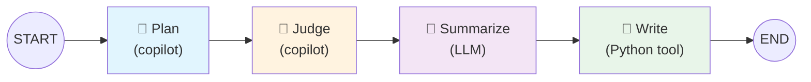

# Chapter 03: The Chaplain Pipeline

## What is the Chaplain?

The Chaplain is YAMLGraph's automated quality guardian — a thin polling loop that watches for development topics, transforms them into feature requests, critically reviews its own output, and records the entire cognitive process to the project diary. It embodies the Sermon of the Chaplain from the Scripture: **Research → Plan → Judge → Enforce → Distill**.

Where manual code review depends on human availability, the Chaplain runs continuously. Drop a markdown file into the inbox, and the pipeline activates: a plan is drafted, a verdict is rendered, and a diary entry captures what was learned. The entire workflow is defined in YAML — no Python orchestration code, no hardcoded prompts, no manual hand-offs.

---

## The Watch Loop

The Chaplain's outer shell is a minimal Bash polling loop defined in `.chaplain/watch.sh`:

> As defined in `.chaplain/watch.sh`:

```bash
INBOX=".chaplain/inbox"
DRAFTS=".chaplain/drafts"
POLL=5

echo "👀 Watching $INBOX/"

while true; do
    topic_file=$(find "$INBOX" -name "*.md" -type f 2>/dev/null | head -1)
    [[ -z "$topic_file" ]] && { sleep "$POLL"; continue; }

    echo "📋 Processing: $topic_file"
    yamlgraph graph run examples/copilot/graph.yaml \
        --var topic_file="$topic_file" \
        --var drafts_dir="$DRAFTS" \
        --var date="$(date +%Y-%m-%d)" \
        --var diary_prefix="Chaplain" \
        --full

    echo ""
done
```

### How It Works

| Aspect | Detail |
|--------|--------|
| **What it watches** | `.chaplain/inbox/` for any `*.md` files |
| **Poll interval** | Every 5 seconds (`POLL=5`) |
| **Trigger condition** | First `.md` file found by `find` |
| **What it runs** | `yamlgraph graph run examples/copilot/graph.yaml` with four `--var` arguments |
| **Output location** | Drafts land in `.chaplain/drafts/` |

The watch script is deliberately thin — it handles only file discovery and variable injection. All intelligence lives in the graph. This follows Commandment 3: *"Keep configuration separate and validated, for code is logic and config is truth."*

Four variables are passed to the graph at runtime:

- **`topic_file`** — Path to the inbox markdown (e.g., `.chaplain/inbox/streaming-support.md`)
- **`drafts_dir`** — Where the plan stage writes its output (`.chaplain/drafts/`)
- **`date`** — Current date in `YYYY-MM-DD` format for the diary entry
- **`diary_prefix`** — Set to `"Chaplain"` to distinguish automated entries from manual ones

---

## The Pipeline Stages

The Chaplain pipeline is a four-stage linear graph. Each stage has a distinct responsibility and node type:



### Stage 1: Plan — Draft the Feature Request

> As defined in `examples/copilot/graph.yaml`, node `plan`:

```yaml
plan:
  type: copilot
  prompt: plan
  backend: cli
  cli_flags:
    allow_all_paths: true
    allow_all_tools: true
  variables:
    topic_file: "{state.topic_file}"
    drafts_dir: "{state.drafts_dir}"
  state_key: plan_result
  timeout: 500
```

**What it does:** The Plan stage delegates to GitHub Copilot CLI (`type: copilot`), which reads the topic file, researches existing patterns in the codebase, and drafts a complete feature request following the project template.

**The prompt** (`prompts/plan.yaml`) instructs Copilot to follow a five-step process:

> As defined in `examples/copilot/prompts/plan.yaml`:

1. Read and understand the topic/idea in the file
2. Research existing patterns in the codebase
3. Define clear objectives and constraints
4. Write acceptance criteria
5. Propose an implementation approach

The prompt enforces quality gates — the feature request must be *"clear and unambiguous, minimal in scope, testable, and aligned with existing architecture."* When complete, Copilot deletes the topic file from the inbox, preventing re-processing.

**Example output:** A feature request document written to `.chaplain/drafts/FR-099-streaming-support.md` following `feature-requests/TEMPLATE.md`, with objectives, constraints, acceptance criteria, and implementation approach.

### Stage 2: Judge — Render the Verdict

> As defined in `examples/copilot/graph.yaml`, node `judge`:

```yaml
judge:
  type: copilot
  prompt: judge
  backend: cli
  cli_flags:
    allow_all_paths: true
    allow_all_tools: true
  variables:
    drafts_dir: "{state.drafts_dir}"
  state_key: judge_result
  timeout: 500
```

**What it does:** A second Copilot invocation reads the draft from the previous stage and critically examines it. This is the Chaplain's adversarial review — the same system that planned now faces its own work under scrutiny.

**The prompt** (`prompts/judge.yaml`) evaluates five criteria:

> As defined in `examples/copilot/prompts/judge.yaml`:

1. Is the scope clear and minimal?
2. Are there contradictions or ambiguities?
3. Are acceptance criteria measurable?
4. Is the implementation approach feasible?
5. Does it align with existing architecture?

The Judge renders one of three verdicts:

| Verdict | Action |
|---------|--------|
| **APPROVE** | Scope is frozen, authority is granted, file moves to `feature-requests/` |
| **AMEND** | Specific issues are documented, file returns to `.chaplain/inbox/` for re-processing |
| **REJECT** | Status is set to Rejected with documented reasoning, file moves to `feature-requests/` |

Note the feedback loop: an **AMEND** verdict moves the file back to the inbox, where the watch loop will pick it up again on its next poll cycle — creating an automatic revision loop until the feature request meets the bar.

### Stage 3: Summarize — Distill into Diary Entry

> As defined in `examples/copilot/graph.yaml`, node `summarize`:

```yaml
summarize:
  type: llm
  prompt: summarize
  variables:
    plan_output: "{state.plan_result}"
    judge_output: "{state.judge_result}"
  state_key: diary_entry
```

**What it does:** This stage shifts from Copilot to a standard LLM node (`type: llm`). It takes the raw outputs from both Plan and Judge and distills them into a structured diary entry — the metacognitive reflection that the Scripture mandates after every task.

**The prompt** (`prompts/summarize.yaml`) uses Jinja2 templating and produces a structured Pydantic output:

> As defined in `examples/copilot/prompts/summarize.yaml`:

```yaml
schema:
  name: DiaryEntry
  fields:
    theme:
      type: str
      description: "Short title for the diary entry (3-7 words)"
    body:
      type: str
      description: "~100-word reflection on the session"
    seed:
      type: str
      description: "Forward-looking question to promote new ideas"
```

The LLM is instructed to *"summarize the key decisions, insights, and any cognitive traps encountered"* and *"end with a seed question that promotes future exploration."* This mirrors the Distill step from the Sermon: after completing a task, name the cognitive trap, extract a heuristic, plant a Seed.

**Example output:**
```json
{
  "theme": "Streaming Subgraph Integration",
  "body": "The session explored adding streaming support to subgraphs. The Plan identified...",
  "seed": "Could streaming state updates replace polling in the watch loop itself?"
}
```

### Stage 4: Write — Append to the Diary

> As defined in `examples/copilot/graph.yaml`, node `write_diary`:

```yaml
write_diary:
  type: python
  tool: write_diary_tool
  state_key: written
```

**What it does:** The final stage is a Python tool node that formats and appends the structured diary entry to `docs/diary.md`. No LLM involvement — pure deterministic file I/O.

The tool is registered in the graph's `tools` section:

```yaml
tools:
  write_diary_tool:
    type: python
    module: examples.shared.diary
    function: write_diary
```

---

## The Graph Structure

The complete graph demonstrates three of YAMLGraph's node types working in concert:

> As defined in `examples/copilot/graph.yaml`:

```yaml
version: "1.0"
name: copilot-workflow
description: Feature request workflow using copilot nodes for planning and judgement

state:
  topic_file: str        # Path to the topic file (e.g., .chaplain/inbox/topic.md)
  drafts_dir: str        # Output directory for drafts
  date: str              # Date for diary entry (YYYY-MM-DD)
  diary_prefix: str      # Diary entry prefix (default: Chaplain)
  diary_entry: dict      # Output from summarize node (theme, body, seed)
  written: bool          # True after diary append

edges:
  - from: START
    to: plan
  - from: plan
    to: judge
  - from: judge
    to: summarize
  - from: summarize
    to: write_diary
  - from: write_diary
    to: END
```

### Node Types in Play

| Node | Type | Engine | Purpose |
|------|------|--------|---------|
| `plan` | `copilot` | GitHub Copilot CLI | Reads codebase, drafts feature request |
| `judge` | `copilot` | GitHub Copilot CLI | Reviews draft, renders verdict |
| `summarize` | `llm` | Claude Sonnet | Distills session into structured entry |
| `write_diary` | `python` | Python function | Appends formatted entry to diary |

The **copilot** nodes are the distinguishing feature here. Unlike standard `llm` nodes that make a single API call, copilot nodes delegate to the GitHub Copilot CLI — a full agent with file access, tool use, and codebase awareness. The `cli_flags` grant it `allow_all_paths` and `allow_all_tools`, giving it the autonomy to read files, search code, and write outputs directly to the filesystem.

The **state** flows linearly: `plan_result` feeds into `judge`, both feed into `summarize` via Jinja2 variable interpolation (`{state.plan_result}`, `{state.judge_result}`), and the resulting `diary_entry` dict is consumed by `write_diary`.

---

## Integration with Diary

The final link in the chain is the `write_diary` function from `examples/shared/diary.py`. This shared utility handles the formatting and file append:

> As defined in `examples/shared/diary.py`:

```python
def format_diary_entry(
    date_str: str, theme: str, body: str, seed: str,
    prefix: str = "World Digest",
) -> str:
    return f"\n---\n\n## {date_str}: {prefix} — {theme}\n\n{body}\n\n**Seed:** {seed}\n"
```

When the Chaplain runs, the `diary_prefix` variable is set to `"Chaplain"`, producing entries like:

```markdown
---

## 2026-02-26: Chaplain — Streaming Subgraph Integration

The session explored adding streaming support to subgraphs. The Plan identified
three integration points in the executor pipeline. The Judge approved with a
single amendment: the state schema needed an explicit `stream_buffer` field.
The quick-confidence trap was avoided by requiring measurable acceptance criteria
before granting implementation authority.

**Seed:** Could streaming state updates replace polling in the watch loop itself?
```

The `write_diary` function handles three input formats — Pydantic models, dicts, and string representations — making it resilient to variations in how different LLM providers serialize structured output. This is the One Law in practice: *normalize at the boundary where external data enters.*

### The Diary as Knowledge Graph

Each entry's **Seed** is not decoration — it is a forward-looking question designed to promote new ideas. Over time, the diary becomes a searchable knowledge graph of cognitive traps encountered, heuristics extracted, and seeds planted. When a seed's insight proves recurring, the Scripture mandates graduating it to doctrine:

> *"If the heuristic proves recurring, graduate it to this Scripture."*
>
> — `.github/copilot-instructions.md`

---

## Summary

The Chaplain Pipeline transforms a simple file-watch loop into an autonomous quality process:

1. **Watch** — Poll `.chaplain/inbox/` for topic files
2. **Plan** — Copilot drafts a feature request with codebase awareness
3. **Judge** — Copilot critically reviews its own output, rendering APPROVE/AMEND/REJECT
4. **Summarize** — An LLM distills the session into a structured diary entry
5. **Write** — A Python tool appends the reflection to `docs/diary.md`

The pipeline demonstrates YAMLGraph's core thesis: by composing copilot nodes, LLM nodes, and Python tools in a declarative YAML graph, complex multi-agent workflows become readable, testable, and reproducible — without writing a single line of orchestration code.
