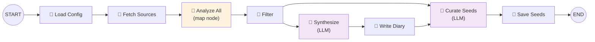

# Chapter 05: The Diary System

## What is the Diary?

The diary is YAMLGraph's metacognitive log — a development journal where every significant decision, cognitive trap, and forward-looking question is recorded in structured markdown. It lives at `docs/diary.md` and serves as the project's institutional memory.

Where git history records *what* changed, the diary records *why* — and more importantly, *what was learned*. Every feature request cycle, every audit finding, and every debugging session produces a diary entry that names the cognitive process behind the code. The Sermon of the Chaplain makes this explicit in the **Distill** step:

> *After completing a task list, add a metacognitive entry to `docs/diary.md`. Name the cognitive trap or insight. Extract a heuristic. Plant a **Seed:** — a forward-looking question to grow new ideas. If the heuristic proves recurring, graduate it to this Scripture.*

The diary is not optional documentation. It is doctrine.

---

## Entry Schema

Every diary entry follows a canonical structure enforced by the shared utility in `examples/shared/diary.py`. The `format_diary_entry` function defines the format:

```python
# examples/shared/diary.py

def format_diary_entry(
    date_str: str,
    theme: str,
    body: str,
    seed: str,
    prefix: str = "World Digest",
) -> str:
    return f"\n---\n\n## {date_str}: {prefix} — {theme}\n\n{body}\n\n**Seed:** {seed}\n"
```

This produces entries with four structural elements:

### 1. Header: Date, Prefix, and Theme

```markdown
## 2026-02-25: FR-103 Judge-Amend Subgraph — The Normalize-at-Boundary Trap
```

The header follows the pattern `## YYYY-MM-DD: Prefix — Theme`. The prefix identifies the entry's origin — `World Digest` for automated digests, `Chaplain` for pipeline-generated entries, `Inquisitor Audit` for compliance checks, or simply a feature request identifier for development reflections.

### 2. Context and Body

The body opens with a `**Context:**` block that anchors the entry to a specific commit, feature request, or situation. This is followed by the substantive content: findings, analysis, technical details.

### 3. Heuristic

A distilled, reusable lesson extracted from the experience:

```markdown
**Heuristic:** When hallucination appears late in pipeline, trace backward to find
where verbatim content was converted to summary. The fix is moving the raw source
access closer to the generation point — ideally into the same prompt.
```

### 4. Seed Question

A forward-looking question that opens new lines of inquiry:

```markdown
**Seed:** Could the judge-amend subgraph pattern be generalized as a reusable
validation primitive?
```

### The Full Pattern

Here is an excerpt from a development reflection entry in the diary, demonstrating all four elements in practice:

> **Source:** `docs/diary.md`, entry dated 2026-02-25

```markdown
## 2026-02-25: FR-103 Judge-Amend Subgraph — The Normalize-at-Boundary Trap

**Context:** FR-100 pipeline ran successfully but produced 9/10 fabricated
Commandments in Ch01 Doctrine. Root cause: research→write split lost verbatim
quotes. The LLM invented content from summaries instead of citing source files.

**Trap:** *Downstream Fix.* Initial reaction (FR-101) proposed elaborate 32-node
pipeline with per-section persistence and 24 checkpoint calls. This was treating
the symptom (hallucination visible late) rather than the cause (verbatim quotes
lost at research boundary).

**Insight:** The Scripture's `the_one_law` applies directly: "Normalize at the
boundary where external data enters, not downstream where it manifests."

**Heuristic:** When hallucination appears late in pipeline, trace backward to find
where verbatim content was converted to summary. The fix is moving the raw source
access closer to the generation point — ideally into the same prompt.

**Seed:** Could the judge-amend subgraph pattern be generalized as a reusable
validation primitive?
```

### Entry Types

The diary accumulates several distinct types of entries, each serving a different metacognitive purpose:

| Prefix | Origin | Purpose |
|--------|--------|---------|
| **FR-XXX** | Developer reflection | Captures traps, insights, and heuristics from feature work |
| **Inquisitor Audit** | Compliance check | Records doctrine adherence findings per commit range |
| **Chaplain** | Automated pipeline | Summarizes feature request planning and judgement cycles |
| **World Digest** | Digest pipeline | Connects external developments to project concerns |
| **Environment Issue** | Ad-hoc debugging | Documents tooling failures and workarounds |

---

## Why Metacognition?

The diary system exists because code alone doesn't capture the reasoning behind decisions. The Scripture's Knowledge Graph codifies the causal chain that makes metacognition essential:

```yaml
the_one_law: |
  Normalize at the boundary where external data enters,
  not downstream where it manifests.

boundaries: [schema, provider, state, streaming, platform]
traps: [quick_confidence, downstream_fix, symptom_patch, intent_drift]
```

Each trap listed here was first discovered in a diary entry. The Distill step requires three specific metacognitive acts:

### Naming Cognitive Traps

A trap that has no name cannot be recognized when it recurs. The diary forces explicit naming:

> **Trap:** *Accretion through iteration.* Each FR iteration added complexity to solve perceived problems.

> **Trap:** *Downstream Fix.* Initial reaction proposed elaborate 32-node pipeline with per-section persistence.

Once named, traps become detectable patterns. When a developer recognizes "this feels like accretion through iteration," the diary provides prior art — what happened last time, and what the resolution was.

### Extracting Heuristics

Every diary entry distills experience into a reusable rule. These heuristics are the operational output of reflection:

From an Inquisitor audit entry:

> **Heuristic:** When the corrective mechanism produces more entropy than the defects it finds, the mechanism itself needs correction.

From a feature development entry:

> **Heuristic:** When you find yourself wishing for partial execution flags, you've designed the wrong unit of work. A good pipeline is composed of small, independently-runnable graphs — not a monolith with escape hatches.

From an environment debugging entry:

> **Heuristic:** When tool reports success but behavior doesn't match, verify file content with `cat` or `head` in terminal before debugging logic.

### Planting Seeds

Seeds are the diary's mechanism for continuity. Each entry ends with a question that the *next* development cycle might answer:

> **Seed:** Could a pre-commit hook parse the commit message type (`feat`/`fix`) and reject commits that don't include staged changes to CHANGELOG.md?

> **Seed:** Should `docs/diary.md` be split into `docs/diary.md` (development reflections only) and `docs/audit-log.md` (Inquisitor findings)?

Seeds create a pull-based knowledge system. Rather than prescribing what to build next, they pose questions that naturally surface when relevant work begins. The digest pipeline (covered below) actively curates these Seeds, keeping the most actionable ones visible.

---

## Rotation Logic

A diary that grows without bound violates Commandment 8: *"Kill all entropy and false idols."* The rotation script `scripts/diary_rotate.py` prevents diary bloat by archiving entries daily.

### When Rotation Happens

The script compares the most recent entry date in `docs/diary.md` against today's date. If the latest entry is from a previous day, rotation triggers:

> **Source:** `scripts/diary_rotate.py`

```python
DIARY = Path("docs/diary.md")
DATE_RE = re.compile(r"^## (\d{4}-\d{2}-\d{2}):")

def latest_entry_date(path: Path) -> date | None:
    """Extract the most recent ## YYYY-MM-DD: header date."""
    latest: date | None = None
    for line in path.read_text().splitlines():
        m = DATE_RE.match(line)
        if m:
            d = date.fromisoformat(m.group(1))
            if latest is None or d > latest:
                latest = d
    return latest
```

The trigger condition is simple: `latest < today`. If the most recent entry is from yesterday or earlier, the current diary is stale and needs archiving.

### How Archives Are Named

Archived diaries are named by their latest entry date:

```python
def archive_path(entry_date: date) -> Path:
    """Return docs/diary-YYYY-MM-DD.md, appending -N if file exists."""
    base = Path(f"docs/diary-{entry_date.isoformat()}.md")
    if not base.exists():
        return base
    n = 1
    while True:
        candidate = Path(f"docs/diary-{entry_date.isoformat()}-{n}.md")
        if not candidate.exists():
            return candidate
        n += 1
```

This produces a chain of dated archive files:

```
docs/diary.md              ← current (today's entries)
docs/diary-2026-02-24.md   ← yesterday's archive
docs/diary-2026-02-23.md   ← two days ago
docs/diary-2026-02-22.md   ← ...
```

The `-N` suffix handles edge cases where multiple rotations occur on the same date (e.g., after a missed day). The archive chain visible in the repository confirms this works in practice — eight archive files spanning `diary-2026-02-17.md` through `diary-2026-02-24.md` exist alongside the active diary.

### The Rotation Sequence

The full rotation sequence performs four steps:

1. **Import** — Pending entries from `~/scheduled-yamlgraphs/outputs/` are appended to the current diary before archiving. This ensures scheduled digest entries (from overnight runs) are captured in the correct day's archive.

2. **Move** — The current `docs/diary.md` is moved to `docs/diary-YYYY-MM-DD.md`.

3. **Create** — A fresh `docs/diary.md` is created with a header and a `Previous:` link to the archive:

```python
def create_fresh_diary(prev_filename: str, prev_summary: str) -> None:
    DIARY.write_text(
        "# Development Diary\n"
        "\n"
        "Metacognitive reflections on development process.\n"
        "\n"
        f"Previous: [{prev_filename}]({prev_filename})"
        f" — {prev_summary}.\n"
        "\n"
        "---\n"
    )
```

4. **Stage** — Both the archive and the fresh diary are `git add`-ed so the rotation is included in the next commit.

### Pre-commit Integration

The rotation script is designed to run as a pre-commit hook:

```bash
python scripts/diary_rotate.py          # rotate if needed
python scripts/diary_rotate.py --check  # dry-run, exit 0 = no rotation needed
```

The `--check` flag enables dry-run mode for CI validation — it reports whether rotation is needed without performing it. This fits the pre-commit pattern where hooks should be idempotent and fast.

---

## The Digest Pipeline

While manual diary entries capture developer reflections, the **diary digest pipeline** (`examples/diary_digest/graph.yaml`) automates the capture of external developments. It fetches articles from RSS feeds and Hacker News, scores their relevance to YAMLGraph, and synthesizes the relevant ones into a World Digest diary entry.

### Pipeline Architecture

> **Source:** `examples/diary_digest/graph.yaml`



The pipeline has eight nodes spanning three node types:

| Node | Type | Purpose |
|------|------|---------|
| `load_config` | Python tool | Load `feeds.yaml`, `seeds.yaml`, and raw Seeds from diary archives |
| `fetch_sources` | Python tool | Fetch articles from Hacker News and configured RSS feeds |
| `analyze_all` | Map node | Score each article's relevance (up to 50 articles in parallel) |
| `filter_relevant` | Python tool | Keep only articles above the relevance threshold |
| `synthesize_entry` | LLM | Write the World Digest diary entry from relevant articles |
| `write_diary` | Python tool | Format and append the entry to `docs/diary.md` |
| `curate_seeds` | LLM | Maintain a curated list of the 10 most actionable Seeds |
| `save_seeds` | Python tool | Write curated Seeds back to `seeds.yaml` |

### Relevance Scoring

The map node fans out across all fetched articles, sending each through the `analyze_relevance` prompt:

> **Source:** `examples/diary_digest/prompts/analyze_relevance.yaml`

```yaml
schema:
  name: RelevanceScore
  fields:
    title: { type: str, description: "Original article title" }
    relevance_score: { type: float, description: "0.0-1.0 relevance to topics" }
    reason: { type: str, description: "One sentence explaining the score" }
```

The scoring uses a calibrated scale: 0.0 for completely unrelated content, 0.5–0.7 for moderately relevant items (LLM frameworks, agent protocols), and 0.8–1.0 for directly relevant developments (LangGraph updates, Anthropic releases, MCP protocol changes). The `filter_relevant` tool then applies a threshold, passing only scored articles forward.

### Entry Synthesis

The `synthesize_entry` node receives the filtered articles plus recent Seeds from the diary, and produces a structured entry:

> **Source:** `examples/diary_digest/prompts/synthesize_diary_entry.yaml`

```yaml
schema:
  name: DiaryDigestEntry
  fields:
    theme: { type: str, description: "Short theme name, 2-5 words" }
    body: { type: str, description: "Diary entry body in markdown" }
    seed: { type: str, description: "Forward-looking question inspired by today's developments" }
```

The prompt instructs the LLM to identify a unifying theme, briefly describe each development, connect them to the project where possible, and end with a Seed. The output is a Pydantic-validated model that the `write_diary` tool formats using the canonical `format_diary_entry` function from `examples/shared/diary.py`.

### Conditional Branching

The pipeline includes a conditional edge: if no articles pass the relevance filter (`relevant_count == 0`), the pipeline skips synthesis entirely and jumps directly to seed curation. This prevents empty diary entries on quiet news days — the digest is a silent no-op when there's nothing relevant to report.

```yaml
edges:
  - from: filter_relevant
    to: synthesize_entry
    condition: relevant_count > 0
  - from: filter_relevant
    to: curate_seeds
    condition: relevant_count == 0
```

### Seed Curation

The final LLM node maintains a rolling list of the 10 most actionable Seeds across the entire diary history. The `curate_seeds` prompt receives both the currently curated list and all raw Seeds extracted from diary files, then applies four operations:

> **Source:** `examples/diary_digest/prompts/curate_seeds.yaml`

1. **ADD** new Seeds from the raw list that aren't already curated
2. **RETIRE** Seeds that have been answered or superseded by newer entries
3. **CONDENSE** related Seeds into sharper, single questions
4. **CAP** the list at 10 Seeds maximum — prioritize actionable over abstract

This creates a living index of open questions that feeds back into the next digest run, connecting today's external developments to the project's active concerns.

---

## Graduating Heuristics

The diary is not the final destination for insights. The Scripture declares:

> *"If the heuristic proves recurring, graduate it to this Scripture."*

Graduation is the process by which a diary observation — tested by repetition — becomes permanent doctrine. The Knowledge Graph at the top of the Scripture was itself graduated from diary patterns:

```yaml
the_one_law: |
  Normalize at the boundary where external data enters,
  not downstream where it manifests.

boundaries: [schema, provider, state, streaming, platform]
traps: [quick_confidence, downstream_fix, symptom_patch, intent_drift]
```

Every trap name in that list (`quick_confidence`, `downstream_fix`, `symptom_patch`, `intent_drift`) was first identified in a diary entry, given a name, and recorded as a heuristic. When the same trap appeared across multiple entries — across different features, different weeks, different developers — it proved recurring enough to graduate.

### The Graduation Path

The lifecycle of a heuristic follows a clear progression:

```
Diary Entry (observation)
    → Named Trap (pattern recognition)
        → Heuristic (reusable rule)
            → Recurring Heuristic (multiple entries cite it)
                → Scripture (permanent doctrine)
```

**Stage 1: Observation.** A developer encounters a problem and records it:

> *"FR-101 proposed elaborate 32-node pipeline. This was treating the symptom rather than the cause."*

**Stage 2: Naming.** The observation is given a trap name:

> **Trap:** *Downstream Fix.*

**Stage 3: Heuristic.** A reusable rule is extracted:

> **Heuristic:** When hallucination appears late in pipeline, trace backward to find where verbatim content was converted to summary.

**Stage 4: Recurrence.** The same pattern appears in later entries. An Inquisitor audit entry observes:

> **Heuristic:** When the corrective mechanism produces more entropy than the defects it finds, the mechanism itself needs correction.

This is a different manifestation of the same `downstream_fix` trap — fixing symptoms rather than causes.

**Stage 5: Graduation.** The heuristic is promoted to the Scripture's Knowledge Graph, where it becomes a named trap available to all future development.

### Why Graduation Matters

Graduated heuristics change behavior at the point of decision, not after the fact. When `downstream_fix` lives in the Scripture, every developer (and every AI agent) sees it before they start coding. The diary captured the lesson; graduation makes it preventive.

The Agents' Prayer reflects this directly:

> *May I fix at the callsite, not the utility.*
> *May I normalize at the boundary, trusting no provider's type.*

These lines are graduated diary wisdom, compressed into doctrine that shapes how every node, every prompt, and every pipeline is built.

---

## Summary

The diary system is YAMLGraph's mechanism for turning experience into institutional knowledge. It operates at three time scales:

| Time Scale | Mechanism | Output |
|------------|-----------|--------|
| **Per-task** | Manual Distill entries | Named traps, heuristics, Seeds |
| **Daily** | Rotation script + digest pipeline | Archived journals, World Digest entries |
| **Long-term** | Graduation to Scripture | Permanent doctrine, Knowledge Graph updates |

The `format_diary_entry` utility enforces structural consistency. The `diary_rotate.py` script prevents entropy. The digest pipeline connects external developments to project concerns. And the graduation process ensures that hard-won insights don't remain buried in archived files — they become the laws that govern how the next feature is built.

The diary answers a question that git blame never can: *"What did we learn?"*
