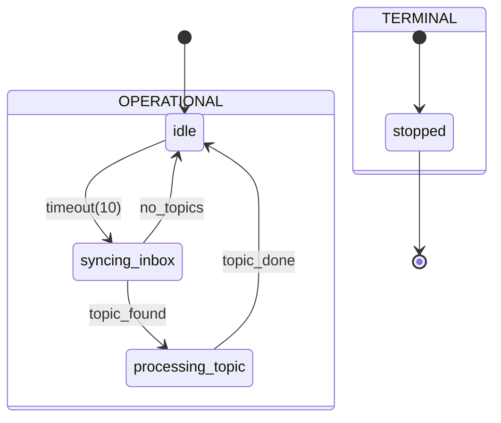
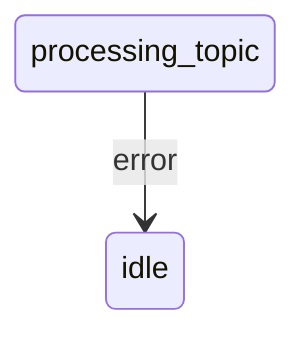
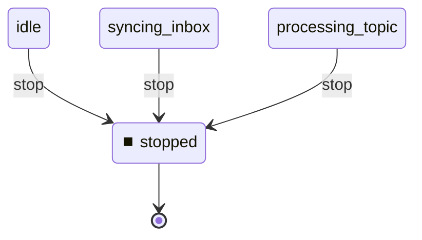

# State Machine

**Description:**

**Generated from:** `watcher-dispatcher.yaml`
**Machine Name:** `watcher-dispatcher`
**Version:** `1.1.0`
**Job Type:** `unknown`

---

## Main State Machine Flow

---

## Error Handling Flow

---

## Stop/Shutdown Flow

---

## States Overview

| State | Description | Key Actions |
|-------|-------------|-------------|
| `idle` | Idle | N/A |
| `syncing_inbox` | Syncing Inbox | bash_context |
| `processing_topic` | Processing Topic | bash |
| `stopped` | Stopped | N/A |

---

## Events Overview

| Event | Type | Description |
|-------|------|-------------|
| `timeout(10)` | Internal | Timeout(10) |
| `topic_found` | Internal | Topic Found |
| `no_topics` | Internal | No Topics |
| `topic_done` | Success | Topic Done |
| `error` | Error | Error |
| `stop` | Control | Stop |

---

## Configuration Summary

- **States:** 4
- **Events:** 6
- **Transitions:** 6
- **Initial State:** `idle`

---

*Generated by yaml_to_fsm.py*
