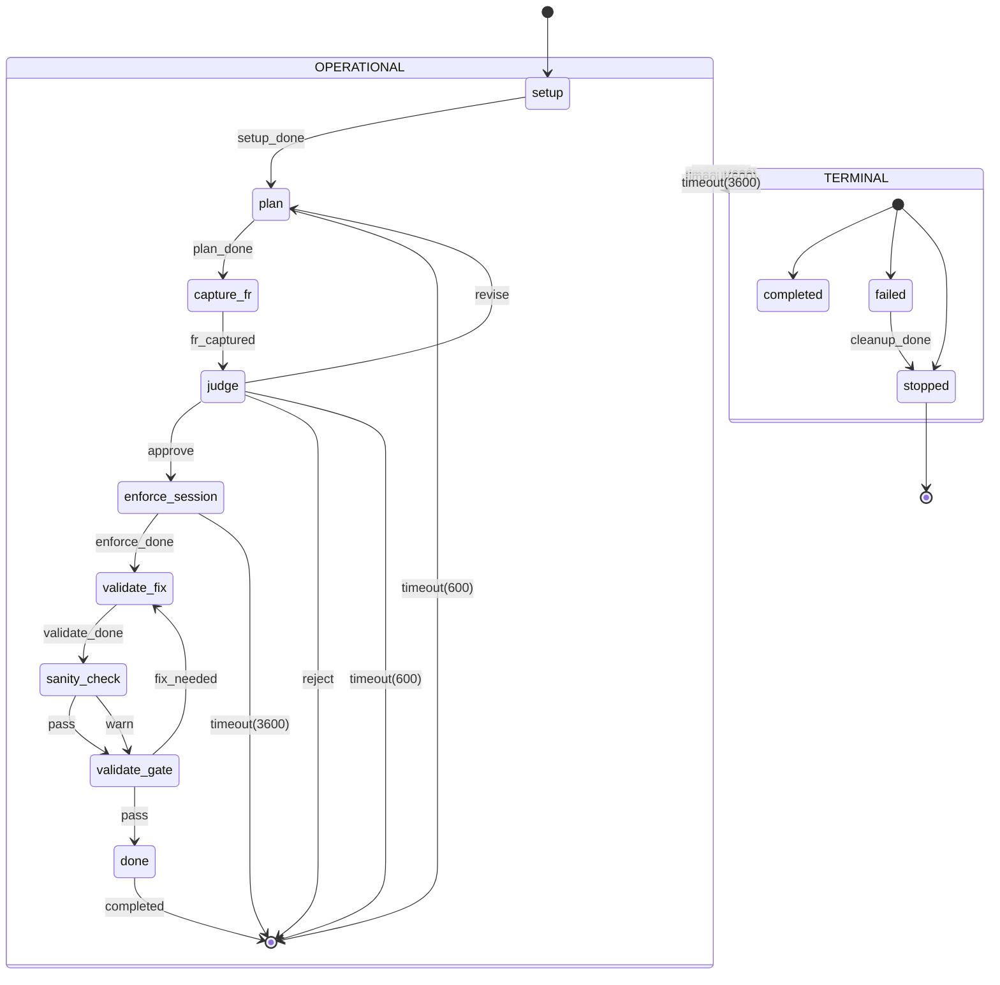
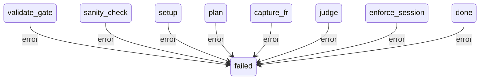
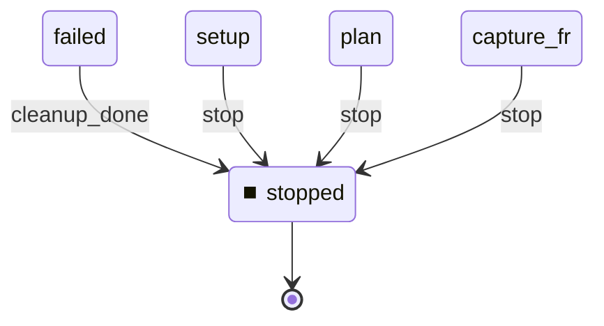

# State Machine

**Description:**

**Generated from:** `watcher-pipeline-v2.yaml`
**Machine Name:** `watcher-pipeline-v2`
**Version:** `1.0.0`
**Job Type:** `unknown`

---

## Main State Machine Flow

---

## Error Handling Flow

---

## Stop/Shutdown Flow

---

## States Overview

| State | Description | Key Actions |
|-------|-------------|-------------|
| `setup` | Setup | bash_context |
| `plan` | Plan | yamlgraph_async |
| `capture_fr` | Capture Fr | bash_context |
| `judge` | Judge | yamlgraph_async |
| `enforce_session` | Enforce Session | yamlgraph_async |
| `validate_fix` | Validate Fix | yamlgraph_async |
| `sanity_check` | Sanity Check | yamlgraph_async |
| `validate_gate` | Validate Gate | validate_gate |
| `done` | Done | bash |
| `completed` | Completed | N/A |
| `failed` | Failed | bash |
| `stopped` | Stopped | bash |

---

## Events Overview

| Event | Type | Description |
|-------|------|-------------|
| `setup_done` | Success | Setup Done |
| `plan_done` | Success | Plan Done |
| `fr_captured` | Internal | Fr Captured |
| `approve` | Internal | Approve |
| `revise` | Internal | Revise |
| `reject` | Internal | Reject |
| `enforce_done` | Success | Enforce Done |
| `validate_done` | Success | Validate Done |
| `fix_needed` | Internal | Fix Needed |
| `pass` | Internal | Pass |
| `warn` | Internal | Warn |
| `completed` | Internal | Completed |
| `cleanup_done` | Success | Cleanup Done |
| `error` | Error | Error |
| `stop` | Control | Stop |
| `timeout(600)` | Internal | Timeout(600) |
| `timeout(3600)` | Internal | Timeout(3600) |

---

## Configuration Summary

- **States:** 12
- **Events:** 17
- **Transitions:** 26
- **Initial State:** `setup`

---

*Generated by yaml_to_fsm.py*
