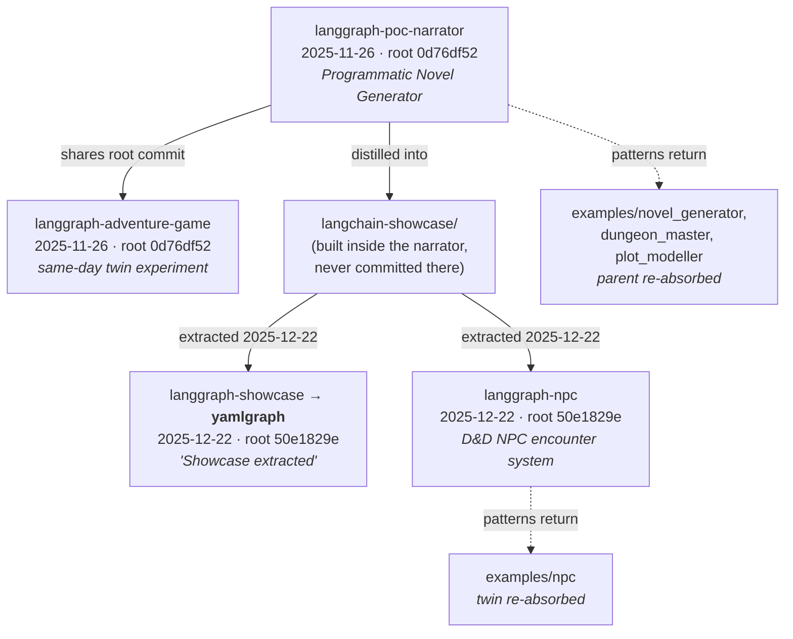

# The Origin Story of YAMLGraph

*An archaeology of the pre-FR era, reconstructed 2026-08-23 from git histories
across four sibling repositories. Every claim below is anchored to a commit
hash or an on-disk fossil; nothing is reconstructed from memory.*

---

## The question

The FR record begins on **2026-01-19** with FR-001 (interrupt nodes,
`3508b805`). The repository begins on **2025-12-22** with a single,
fanfare-free commit:

```
50e1829e  2025-12-22  Showcase extracted
```

Twenty-four files, 1,719 lines, arriving fully formed: a `showcase/` package
with executor, builder, CLI, Pydantic schemas, YAML prompts, SQLite storage,
and LangSmith utilities. No manifesto, no README explaining where it came
from. Even the project's own Philosopher retrospective
([diary/2026-04-18-genesis.md](diary/2026-04-18-genesis.md)) shrugs at Act I:
*"code already existed somewhere else, and was pulled out into its own
shape."*

This document answers the question the genesis diary could not:
**extracted from what?**

---

## The lineage



Four repositories, two root commits:

| Repo | Root commit | Born | Role |
|------|-------------|------|------|
| `langgraph-poc-narrator` | `0d76df52` | 2025-11-26 | The parent: a novel-generation POC |
| `langgraph-adventure-game` | `0d76df52` | 2025-11-26 | Same-day twin of the narrator |
| **`yamlgraph`** | `50e1829e` | 2025-12-22 | The extracted showcase, later the framework |
| `langgraph-npc` | `50e1829e` | 2025-12-22 | Identical twin of yamlgraph, diverged 2025-12-26 |

The narrator and the adventure game share a root commit — one history, two
divergent working copies. YAMLGraph and langgraph-npc share a *different*
root commit — the extraction itself. The same seed was planted twice on the
same day.

---

## Act 0 — The Narrator (2025-11-26 → 2025-12-22)

`langgraph-poc-narrator` is a **Programmatic Novel Generator**: LangGraph
state machines with review-revise loops, YAML prompt templates, Pydantic
models, SQLite persistence, editorial pipelines. It was built fast — "first
commit", "Phase 2", "phase 3" all land on 2025-11-26.

Its README carries a paragraph titled **"Remember"** that is, verbatim, the
proto-Scripture:

> Remember: prompts in yaml templates, shared executor, pydantic, data stored
> in sqllite, langgraph, langsmith, check venv, tdd red-green-blue, refactor
> modules to < 400 lines, kiss. no implementation before demonstration of the
> plan with failing tests. update readme.

Every clause of that paragraph survives today as enforced doctrine: YAML
prompts only (CLAUDE.md Critical Rule 1), the shared `execute_prompt()`
executor, Pydantic for all LLM outputs (Commandment 5), TDD red-green
(Commandment 7), the 400-line module cap, the demo gate. **The Commandments
existed as a README paragraph before YAMLGraph existed as a repository.**

The narrator was not a throwaway. It kept living after the extraction and
actually shipped its product: *"publish: The Mermaid's Alchemist (28,857
words)"* — 2026-01-04. The parent completed its own mission while the child
was still learning to walk.

## Act I — The Unrecorded Creation (December 2025)

Somewhere between 2025-11-26 and 2025-12-22, the generic pipeline machinery
inside the narrator was distilled into a minimal, self-contained
**"LangGraph Showcase App"** — the 1,719 lines of `50e1829e`. This
distillation has **no version-control record anywhere**. The narrator's git
history never tracked a `langchain-showcase/` directory as real files; the
showcase's first appearance under version control *is* the extraction commit.

This is the genuinely unexplained creation: the single most consequential
artifact in the project's history — the seed containing executor, prompts,
schemas, state, storage, tracing — was written outside any commit history,
in the space between two repos. The framework that would later gate every
change behind FR → Judge → RED → GREEN → diary was itself born ungoverned,
unwitnessed, and untested by its own future standards.

**The fossil that proves the parentage:** the narrator still contains a
broken symlink, committed 2025-12-23 — one day after the extraction:

```
langchain-showcase -> ../langgraph-showcase/
```

The directory was moved out to become its own repo (`langgraph-showcase`,
first commit "Showcase extracted"), and a symlink was left pointing at it.
When the child renamed itself to `yamlgraph` on 2026-01-17, the link broke.
The parent still points at a child that no longer answers to that name.

## Act II — Two Children, One Seed (2025-12-22 → 2025-12-26)

The extracted showcase was planted twice:

- **`langgraph-showcase`** (later yamlgraph) — kept generalizing.
- **`langgraph-npc`** — shares yamlgraph's exact first four commits, then
  diverges on 2025-12-26 into a D&D NPC encounter system: multi-NPC turns,
  narration, Replicate image generation per turn.

The twin was later re-absorbed as `examples/npc` — today the canonical
"production application pattern" example (session adapters, human-in-loop,
map nodes). The parent was re-absorbed too: novel generation returned as
FR-034 (novel-generator demo), and its descendants live on in
`examples/dungeon_master` and `examples/plot_modeller`. **YAMLGraph spent
its later life re-ingesting, as governed examples, the stories its ancestors
were built to tell.**

## Act III — The Sections Era (2025-12-22 → 2026-01-19)

152 commits, four weeks, zero FRs. Development was driven by a **"Sections"
roadmap** living in the README ("Known Issues / Future" `bc55c872`, "Add open
issues from critical review" `29c2e21a`):

| Section | Delivered | Commit anchor |
|---------|-----------|---------------|
| Section 1 | `on_error` reliability handling | `ba73c1b1` |
| Section 2 | Router pattern, tone-based routing demo | `de1d4b0c` |
| Section 3 | Self-correction loops (Reflexion) | `875e4334` |
| Section 4 | Shell tools and agent nodes | `bb6cef08` |
| Section 6 | State & memory architecture (61 tests) | `4ae6637b` |
| Phase 7 | CLI redesign, universal graph runner | `79681e5f`…`5eabc863` |

Plan-driven — but the plan was mutable, unreviewed, and lived in the same
file as the marketing copy. This is precisely the failure mode the FR
pipeline was later built to prevent: no frozen scope, no independent
judgement, no permanent record of what was decided and why.

Three days in this era deserve their own markers:

**2026-01-15/16 — the identity insight, disguised as a refactor.** A
five-phase arc ("Phase 1: Decouple state.py from demo-specific models" →
"Phase 4: Remove all demo models from Python core" → `ce6ee9ce` "feat:
dynamic state generation from graph YAML") transformed a demo app into a
framework. Auto-generated TypedDict state from `state_key` declarations —
the core thesis that YAML can replace 60-80% of pipeline Python — landed
with no FR, no judgement, no diary entry. The most important design decision
in the codebase has the thinnest paper trail.

**2026-01-17 — naming day.** In a single day: `showcase` → `yamlgraph`
(`956b62a3`, `a696df35` — "no backward compat", the future taboo phrase
already an instinct), LICENSE and PyPI publish workflow (`c16281eb`),
v0.1.1 released (`8e53d139`). The project received its name **26 days after
its first commit** and roughly seven weeks after its earliest ancestor line
of code.

**2026-01-18 — first self-analysis.** The code-analysis graph runs on its
own repository (`6a513628`), and the LICENSE gains the Self-Awareness Clause
(`acb53860`, commit message: *"Because yamlgraph can analyze itself now"*):

> THE SOFTWARE IS NOT SENTIENT (YET).
> THIS CLAUSE SHALL BE UPDATED AS NEEDED SHOULD THE SITUATION CHANGE.

A joke that turned out to be a roadmap: the Chaplain, the Inquisitor, the
Philosopher, and the entire self-governing pipeline descend from this day's
capability.

## Act IV — The Record That Ate Itself (2026-01-19 → ~2026-02)

The FR era begins 2026-01-19 (`3508b805`, FR-001/002) — but FRs were not yet
permanent artifacts. On **2026-01-23** (`944ca655`, *"chore: remove
implemented feature requests, add template"*), twelve completed FRs were
**deleted on completion**: 001–004, 006, plus seven *unnumbered* ones
(`json-extraction.md`, `bug-prompts-relative-executor.md`,
`chainmap-serialization.md`…). The early record survives only in git.

Numbering was chaotic: two files both claimed 011 (split into 011a/011b),
012 fragmented into 012-0/012-1/012-2/012-3, numbers 021 and 030 were each
issued twice, and gaps abound. All 39 devoured FRs have since been recovered
from git and preserved in
[docs/memento/feature-requests/](memento/feature-requests/README.md).
The oldest FR still alive in the tree is
[feature-requests/005-session-manager.md](../feature-requests/005-session-manager.md) —
deferred on 2026-01-23 and untouched since: the coelacanth of the
collection. The modern discipline — `FR-XXX-` prefix, FR as permanent
source of truth, judgement before enforcement — solidifies only around
FR-071 (the earliest surviving prefixed FR).

Reading the recovered corpus itself (not just its deletion record) revises
the picture — the FR mechanic was born far more mature than the numbering
chaos suggests:

**The FR was a customer channel before it was a governance mechanic.**
FR-001 and FR-002 were not introspective planning — they were demands from
a real external consumer: `questionnaire-api`, a sibling application running
on Fly.io whose auto-scaling instances needed interrupts and a Redis
checkpointer. Twelve of the 39 recovered FRs cite questionnaire-api by file
path (`src/questionnaire/recap/checkpointer.py`, `graph_handlers.py`). The
first FRs were bug reports and feature demands from downstream — the
"agents-first consumer" thesis in practice before it was a thesis.

**The anatomy predates the doctrine.** Across the 39 recovered files:
Summary (31), Related (30), Proposed Solution (29), **Acceptance Criteria
(24)**, Problem (23), **Alternatives Considered (18)**. The modern FR
template's skeleton was already the de-facto norm in week one — what was
missing was not structure but *permanence* and *independence*.

**Zero-latency governance.** FRs 001–004 all record `Requested: 2026-01-19,
Implemented: 2026-01-19, Commit: 3508b80` — requested, written, implemented,
and closed in a single commit. The FR was documentation *of* a decision, not
a gate *before* it. The entire modern pipeline (freeze scope → judge →
enforce) exists to insert daylight into that same-day loop.

**Rejection came before the Judge.** 011a/011b were REJECTED on their
request day (2026-01-28) with structured rationale — "Duplicates existing
functionality", "Scope creep… LangSmith exists… Maintenance treadmill" —
proto-verdicts written by the same hand that proposed them. Then, on
**2026-02-17**, FR-040 and FR-042 gain explicit `## Judgment` sections with
`**Verdict:** DEFER` / `**Verdict:** REJECT` and reasoning about framework
surface area — **three days before the Chaplain shipped** (FR-055,
2026-02-20). The Judge existed as a written ritual before it existed as a
pipeline; the Chaplain automated a practice, it did not invent one. Both
verdicts already apply what would become doctrine: "users can already wire
this from existing primitives" — spec_kill avant la lettre.

**Even FR-040's rejection is self-referential:** it proposed LLM-as-judge
quality gates as default pipeline behavior, was itself judged and deferred —
and its core idea (judge, threshold, regenerate) is precisely the mechanic
the project later adopted for governing *itself* rather than its map nodes.

## Act V — Self-Government (2026-02-20 →)

The machinery that builds features arrives a month into the FR era:

- `a87bc7e1` 2026-02-20 — **FR-055**: the Chaplain, an autonomous
  plan → judge → amend pipeline.
- `ccf046c5` 2026-02-21 — **FR-068**: the chaplain watch loop.
- `180f5d58` 2026-02-23 — **FR-076**: the Inquisitor audit script.
- `37267153` 2026-02-25 — **FR-093**: diary append wired into Plan-Judge.

From this point the project stops being merely *built* and starts being
*governed*. The rest of the story — the Scripture, the traps catalogue, the
gates, the adversarial turn of April 2026 — is told in the diary itself,
beginning with [diary/2026-04-18-genesis.md](diary/2026-04-18-genesis.md).

Scale at the time of this archaeology (2026-08-23): 2,447 commits, 948 FR
files (FR numbering at 869), 1,244 diary entries.

---

## The Evolution of the Law

Two files carry the doctrine: `.pre-commit-config.yaml` (the mechanical law,
60 commits) and `.github/copilot-instructions.md` (the written law, 103
commits). Sampling both at month-ends shows how the constitution grew:

| Month-end | Pre-commit hooks | Instruction lines | Named traps |
|-----------|-----------------:|------------------:|------------:|
| 2026-01-31 | 7 | 97 | 0 |
| 2026-02-28 | 27 | 130 | 0 |
| 2026-03-31 | 33 | 181 | 12 |
| 2026-04-30 | 36 | 189 | 16 |
| 2026-05-31 | 39 | 221 | 26 |
| 2026-06-30 | 39 | 223 | 27 |
| 2026-07-31 | 45 | 259 | 28 |
| 2026-08-23 | 45 | 260 | 28 |

### The mechanical law: what each month added

- **January — hygiene.** Born 2026-01-17 (`74d47497`) as a ruff-only config,
  during the ungoverned spike itself. By month-end: 7 hooks — formatting,
  YAML checks, and (from 2026-01-29, week two of the FR era) **the full unit
  test suite on every commit**. TDD was mechanized before the Judge existed.
- **February — the law gets teeth.** 7 → 27 in one month, the largest
  expansion ever, synchronized with the Chaplain's birth: `forbid-terms`
  (the "backward compatibility" phrase ban), `hedging-check`,
  `inline-llm-check`, `feat-requires-fr`, `changelog-required`,
  `req-coverage-strict`, `noqa-confession`, `absolution`,
  `inquisitor-background`, `diary-rotate`, plus the entropy triad
  (`jscpd`, `radon`, `vulture`). Doctrine-specific enforcement — hooks no
  generic project would have — all landed in the month self-government
  shipped.
- **March — provenance.** `block-ai-coauthor`, `demo-proof-check`,
  `diary-reflection-check`, `validate-capabilities`, `validate-id-registry`.
  The vendor-trailer block predates the April adversarial turn by a month —
  the immune system reacted before the crisis was articulated.
- **April — architecture as contract.** `import-linter` (the three-layer
  pattern moves from diagram to gate), `changelog-req-cross-check`,
  `dependency-rationale`.
- **May — boundary guards, and a new enforcement layer.** `gitignore-boundary-guard`,
  `cap-architecture-sync`, `block-wip-main-subject` — and, outside
  pre-commit entirely, the **Copilot hooks layer** (`.github/hooks/`,
  PreToolUse/PostToolUse, FR-414 audit logging). Enforcement migrated
  upstream: from the merge boundary (CI, Feb–Mar) to the commit boundary
  (pre-commit) to the **tool-call boundary** — the earliest point where an
  agent's action enters the world. The One Law applied to enforcement
  itself: normalize where the action enters, not downstream where it lands.
- **June — zero additions.** First consolidation plateau.
- **July — process governance.** `prior-art-gate`, `fr-board-check`,
  `triage-gate`, `authoring-proof`, `bandit-security`,
  `direct-import-scan`. The gates stop policing code and start policing
  *how decisions are made* — prior art must be dispositioned, authoring must
  go through the governed route.
- **August — zero additions.** The law is stable; new energy flows into
  skills and adapters instead.

### The written law: prose leads, mechanism follows

`copilot-instructions.md` predates the FR era — born 2026-01-14, mid-spike,
as ~90 lines of conventions. Its milestones consistently *precede* their
mechanical enforcement:

- **2026-02-05** (`d8c828ca`): **The 10 Commandments** arrive — fifteen days
  before the Chaplain, in the same month the hook count quadrupled. The
  constitution was written first; the police force was hired the same month.
- **2026-02-21** (`a7b8a6a6`): **The Knowledge Graph of the Diary** and
  `the_one_law` appear — *one day after* the Chaplain shipped. The moment
  the system could enforce, it began compressing diary experience into
  machine-readable doctrine (boundaries, traps, cures).
- Traps grow 0 → 12 → 16 → 26 → 27 → 28 and then saturate. The deceleration
  is informative: either the trap space is finite, or graduated traps stop
  recurring because their cures became hooks — the Scripture's own
  `two_strike_split` (instruction text that fails twice becomes code)
  drains the prose catalogue into the mechanical one.

### The macro-shape

Three observations fall out of the curves:

1. **The constraint stays compact while the system grows.** Instructions
   grew 2.7× in seven months (97 → 260 lines) while the codebase grew an
   order of magnitude and the hook count 6×. This is `constraint_over_code`
   measured longitudinally: the written law compresses; the mechanical law
   accumulates.
2. **Every enforcement wave follows an incident wave.** Hygiene follows the
   spike; doctrine hooks follow the Chaplain; provenance hooks precede-echo
   the adversarial turn; process gates follow the FR-737 prior-art
   resurrection. The pre-commit config is a fossil record of what went
   wrong, one month delayed — the graduation pipeline
   (diary → Scripture → hook) rendered as YAML.
3. **Plateaus are synchronized.** June and August show near-zero growth in
   *both* files simultaneously. The system alternates between expansion
   (February, July) and consolidation — the same rhythm the diary notes as
   `growth_as_default` resistance: mature systems prune claims instead of
   planting features.

---

## Timeline

| Date | Event | Evidence |
|------|-------|----------|
| 2025-11-26 | Narrator + adventure-game born; proto-Scripture written as README "Remember" paragraph | root `0d76df52` |
| Nov–Dec 2025 | Showcase distilled inside the narrator — **no git record** | absence of history; symlink fossil |
| 2025-12-22 | "Showcase extracted" — yamlgraph and langgraph-npc both begin | root `50e1829e` |
| 2025-12-23 | Narrator commits symlink `langchain-showcase -> ../langgraph-showcase/` (now broken) | narrator repo, on disk |
| 2025-12-26 | langgraph-npc diverges into D&D encounter system | npc repo log |
| 2026-01-04 | Parent publishes *The Mermaid's Alchemist* (28,857 words) | narrator repo log |
| 2026-01-15/16 | Demo models purged; dynamic state generation — showcase becomes framework | `b2767eaa`, `ce6ee9ce` |
| 2026-01-17 | Renamed showcase → yamlgraph; PyPI; v0.1.1 | `956b62a3`, `8e53d139` |
| 2026-01-18 | First self-analysis; Self-Awareness Clause added to LICENSE | `6a513628`, `acb53860` |
| 2026-01-19 | FR era begins — FR-001/002 requested, implemented, and closed same day, driven by questionnaire-api | `3508b805` |
| 2026-01-23 | Twelve completed FRs deleted; TEMPLATE.md added; FRs not yet permanent | `944ca655` |
| 2026-01-28 | First rejections (011a/011b) — structured rationale, same-day, self-judged | `5eab27b7` |
| 2026-02-17 | First explicit `## Judgment` + `**Verdict:**` sections (FR-040 DEFER, FR-042 REJECT) — the Judge as ritual, pre-Chaplain | memento corpus |
| 2026-02-20/23 | Chaplain (FR-055) and Inquisitor (FR-076) — self-government begins; the ritual becomes a pipeline | `a87bc7e1`, `180f5d58` |

---

## The shape of the story

Every layer of today's doctrine is a fossilized reaction to the era beneath
it:

1. The narrator's one-paragraph **"Remember"** became the **Scripture**.
2. The mutable README **Sections roadmap** became **judged, frozen FRs**.
3. The **self-deleting FRs** of January became the **permanent traceability
   spine** (FR → REQ → CAP → test).
4. The **self-awareness joke** in the LICENSE became the **Chaplain,
   Inquisitor, and Philosopher**.
5. The hand-written **`## Judgment` sections** of mid-February became the
   **automated Judge** three days later — every pipeline stage was a manual
   ritual before it was code.
6. The **ungoverned four-week spike** that built the framework became the
   reason the framework refuses to let anything be built that way again.

The deepest irony is structural: YAMLGraph's most consequential code — the
seed extraction, the dynamic-state insight, the framework thesis itself —
predates and would not survive its own gates. The project is, in the most
literal sense, a system built to prevent its own origin story from
happening twice. And its later life is a homecoming: the NPC twin and the
novel-generating parent both returned as governed examples, the framework
re-ingesting the stories it was born from.
