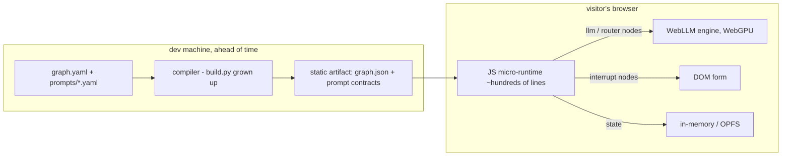

# Plan: Browser Micro-Runtime — WebLLM as the Engine Under Exported Graphs

**Date:** 2026-07-15
**Status:** Parked — gated on a second consumer (NC-372 graduation criterion)
**Source:** `docs/2026-07-14-research-browser-llm-webgpu.md` (Path 4, Seeds 5-6),
integration-options analysis 2026-07-15 (option C)
**Lineage:** FR-731 (rung-1 spike: prompt compile, kill-criterion event, JSON
directive), FR-735/FR-736 (self-evidencing instrument + trace format)

## The inversion

Options A/B keep Python-yamlgraph as the runtime asking an LLM server for
completions. This plan removes the Python runtime entirely: graph YAML is
compiled **ahead of time** into a static artifact, and a small JS runtime in
the visitor's browser executes the graph, calling WebLLM in-tab for every
`llm`/`router` node. Zero server, zero key, weights in the browser cache —
the FR-731 demo's premise scaled from one prompt to one graph.

Different product than local inference (option B): **any visitor gets a
working yamlgraph pipeline with zero installation** — landing-page "try
it", icpc-style classification as a private in-browser tool (data never
leaves the machine), the questionnaire example as a standalone page.

## Why the runtime is small

Semantics are frozen in YAML and witnessed by ~4,900 tests; the JS runtime
re-implements only the execution loop for a **declared subset**:

| Portable naturally | Portable with work | Not portable |
|---|---|---|
| `llm`, `router` → WebLLM | `python` tools → JS callables | `tool`/shell (no sandbox) |
| `map` = `Promise.all`, `race` = `Promise.race` | checkpointing → OPFS/IndexedDB | `copilot`, `a2a` |
| `interrupt` — a browser form, *more* natural than CLI | `subgraph` | |
| condition expressions + loop limits (tiny grammar, no eval) | | |

`interrupt` is the sleeper: the reflexion loop (draft → critique → refine
until score ≥ 0.8) runs entirely in-tab, and human-in-loop is what pages
are *for*. First target subset: `llm` + `interrupt` + conditions — enough
for the reflexion demo, nothing more.

## Named hazards and their pre-built cures

1. **`framework_costume` in reverse** — claiming "yamlgraph runs in the
   browser" when a subset does. Cure = **Seed 5**: a `browser-safe` lint
   profile that mechanically verifies a graph uses only the portable
   subset. The claim is generated-or-gated, never hand-written (FR-729
   lesson, applied prospectively).
2. **Second-implementation drift** — a JS runtime silently diverges from
   Python semantics. Cure = **Seed 6**: FR-723's route log is a
   runtime-independent execution trace; run the same fixture graphs in
   both runtimes and `graph export --diff` their route.jsonl — **the
   empty diff is the conformance witness**. Adopt before the first line
   of JS exists. FR-736's trace format extends conformance one level
   down: message-level request/response pairs as cross-runtime
   regression fixtures.

## Laws already banked by the rung-1 spike (would have been runtime bugs)

- **Grammar runtimes need prompt-side JSON steering** — the compiler must
  append the JSON directive; template + schema alone floods whitespace
  deterministically (FR-731 kill-criterion event, upstream-confirmed).
- **Defaulted fields may be omitted** from grammar-enforced output (not
  in `required`) — the runtime must apply schema defaults client-side.
- **Bound max_tokens** — an unbounded degenerate run cost 87 s; bounded,
  ~10 s.
- Grammar overhead is measurable and small (`grammar_init_s` ≈ 0.38,
  per-token ≈ 0.000135 — FR-736 trace, apple metal-3).

## Ladder (strict order, each rung gates the next)

1. **Rung 1 — CLOSE FIRST:** FR-731 10-run tally verdict on the amended
   artifact + merged FR-735/736 format witness. The instrument is frozen
   until this runs.
2. **Rung 2 — Seed 5:** `browser-safe` lint profile (mechanical subset
   verification). Small FR; reuses linter architecture; the
   `linter-llm-free` import contract is the portability certificate
   precedent.
3. **Rung 3 — Seed 6:** conformance harness — fixture graphs + route-log
   diff runner, Python side only (defines the bar the JS runtime must
   clear before it exists).
4. **Rung 4 — the runtime:** smallest subset (`llm` + `interrupt` +
   conditions), reflexion demo as the acceptance fixture, conformance
   diff empty, browser-safe lint green on the fixture.

**Stop rule:** Path 4 waits for a **second consumer** beyond the
landing-page demo. If nobody asks for rung 2, the ladder correctly ends —
`growth_as_default` names the alternative. No FR for rungs 2–4 is filed
until the rung-1 verdict is written into FR-731.

## Explicitly out of scope

- WebLLM as a `create_llm()` provider (impossible: browser-only, no
  Python binding; see option A analysis).
- MLC-LLM serve via the lmstudio provider (option B — a separate
  30-minute verification spike if local inference is wanted; different
  product, different plan).
- Model picker, streaming UI, service workers, telemetry — the demo
  purge lists carry forward.
