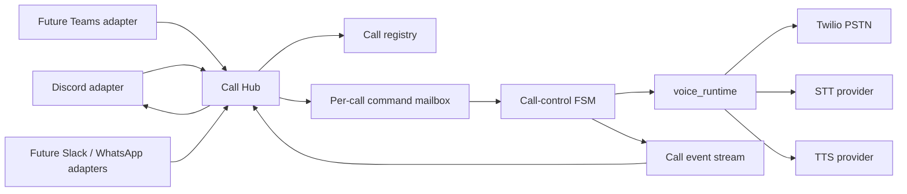
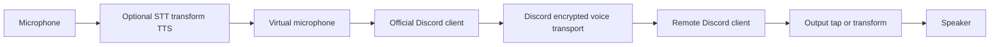

# Plan: Chat-Initiated Outbound Calls

**Date:** 2026-08-17
**Status:** Proposed internal proof
**First consumer:** An internal operator starting and controlling an outbound
phone call from Discord
**Decision:** Build a Discord adapter over a channel-neutral Call Hub; preserve
the existing telephony and speech runtimes

## Ideal Result

An authorized operator starts a PSTN call from a chat application, reads the
remote party's speech as live transcript messages, and answers either by typing
text or selecting an approved voice macro. The operator never handles audio,
and adding another chat channel does not change Twilio, STT, TTS, or call-state
logic.

The first proof serves one internal Discord operator. Discord is an adapter,
not the owner of call semantics. Microsoft Teams or Slack can later implement
the same command and event contracts. WhatsApp remains deferred because its business
onboarding, opt-in, template, and conversation-window requirements add product
work without validating the voice-control mechanism.

## Product Decisions

| Question | Decision |
|---|---|
| First user | Internal demo operator |
| Call direction | Chat starts an outbound call |
| Operator input | Free text plus server-defined voice macros |
| First chat channel | Discord guild |
| Telephony | Existing Twilio Programmable Voice and Media Streams |
| Speech | Existing `voice_runtime` STT/TTS providers |
| Concurrency | One call for the first live proof; contracts remain call-scoped |
| Real-call testing | Billable and run only after explicit human approval |

## Operator Experience

1. An authorized operator runs `/call start number:+358...` in a restricted
   Discord channel.
2. The bot validates the number against an allowlist, starts the call, and
   creates a dedicated thread bound to the hub-minted `call_id`.
3. The thread reports `dialing`, `ringing`, `connected`, and terminal status.
4. Final remote-party transcripts appear in the thread as they are committed.
5. A normal message from the assigned operator in the armed thread is queued
   for TTS and spoken to the remote party.
6. The operator can instead select a macro button or run `/call macro`.
7. `/call hangup` or the Hang Up button ends the call idempotently.
8. The thread closes with duration, outcome, and an audit summary.

`/call say text:...` remains available as an explicit fallback. It allows the
proof to work without ordinary-message ingestion and provides a safer control
mode if Discord's Message Content intent is undesirable.

## Architecture



### Ownership Boundaries

- **Chat adapter:** translates Discord interactions and messages into commands;
  renders call events into a thread. It never invokes TTS or Twilio directly.
- **Call Hub:** authorizes commands, binds a chat context to one call, records
  idempotency, resolves `call_id` to one worker, and projects events back to
  adapters.
- **Call-control FSM:** serializes dial, listen, speak, macro, and hangup
  transitions. It remains the sole routing owner.
- **Voice bridge:** executes FSM commands against `voice_runtime` and publishes
  transport and speech events. It contains no Discord-specific logic.
- **Providers:** Twilio, STT, and TTS remain replaceable behind existing runtime
  interfaces.

The production worker isolation in
[`projects/ninchat_voice/services/supervisor.py`](../projects/ninchat_voice/services/supervisor.py)
and [`projects/ninchat_voice/services/supervisor_slots.py`](../projects/ninchat_voice/services/supervisor_slots.py)
is the concurrency precedent. Bridge execution stays in
[`projects/ninchat_voice/services/bridge_handlers.py`](../projects/ninchat_voice/services/bridge_handlers.py),
while the append-safe, call-scoped audit approach follows
[`projects/ninchat_voice/services/call_transcript.py`](../projects/ninchat_voice/services/call_transcript.py).

## Command And Event Contracts

All boundary payloads are validated Pydantic models. The Call Hub mints an
internal `call_id` when it accepts `dial` — before any provider SID exists —
and `call_id` is the only routing key in commands and events. The Twilio
`call_sid` is attached to the call session as provider metadata once Twilio
returns it (surfaced on `call.created`), and appears elsewhere only in audit
records. Chat-platform identifiers are likewise audit metadata.

```json
{
  "command_id": "uuid",
  "call_id": "hub-uuid",
  "type": "say",
  "text": "Hetkinen, tarkistan asian.",
  "operator_id": "discord:1234",
  "channel_context": "discord:thread:5678"
}
```

Required command types:

- `dial`: validated destination and selected call profile; the accepting hub
  response carries the newly minted `call_id`
- `say`: free text to synthesize once
- `macro`: immutable macro ID resolved server-side to text or pre-baked audio
- `hangup`: idempotent termination request
- `status`: read-only query returning a full call snapshot — call state,
  provider `call_sid`, last event sequence, armed flag, and transcript tail —
  sufficient for an adapter to rebuild its display after restart without
  replaying commands

```json
{
  "event_id": "uuid",
  "call_id": "hub-uuid",
  "sequence": 17,
  "type": "transcript.final",
  "speaker": "remote",
  "text": "Voitteko soittaa huomenna uudelleen?"
}
```

Required event types:

- `call.created`, `call.ringing`, `call.connected`
- `transcript.final`
- `speech.queued`, `speech.started`, `speech.completed`
- `call.ended`, `call.failed`

Events carry a monotonic per-call sequence. Commands carry unique IDs so a
Discord retry cannot repeat speech or hang up a successor call.

## Routing And Safety Invariants

Every mutating command must resolve to exactly one active `call_id` and one
worker. The Call Hub fails closed when the call is unknown, completed,
ambiguous, or belongs to another chat context. The shared monitoring event
socket must never be used as a command broadcast path.

Only a message satisfying all of these conditions becomes speech:

- it was authored by the operator assigned to the call;
- it was created in the thread immutably bound to that `call_id`;
- the call is active and the thread is armed for ordinary-message speech;
- it is new text, not an edit, bot message, attachment, replay, or duplicate;
- its generated `command_id` has not already been accepted.

Speech commands enter a per-call mailbox. The FSM either serializes them after
the current utterance or rejects them with an explicit state error. The adapter
does not decide whether concurrent TTS is safe.

Additional controls for the internal proof:

- Restrict commands and thread access to an operator role.
- Permit only configured E.164 destinations or prefixes.
- Redact phone numbers from routine Discord messages and logs.
- Keep macros server-defined; button payloads contain macro IDs, never speech.
- Disable controls immediately on terminal call events.
- Record operator identity, command, result, timestamp, `call_id`, and the
  provider `call_sid` once known.
- Define transcript retention and deletion before using production callers.

## Reuse Strategy

### Reuse

- **voice_runtime:** outbound call initiation
  (`transports/twilio_call.initiate_outbound_call`, with the mock replacement
  in `transports/mock_bridge`), Twilio transport, persistent STT, TTS
  streaming, marks, echo suppression, and disconnect behavior. Pin the current
  release; do not inherit outcaller's stale `voice-runtime>=0.1.3` pin.
- **outcaller:** the demonstrated single-call outbound wiring. Its
  call-initiation code was extracted into voice_runtime (NC-152/OC-015), so
  reuse the library, not the shim.
- **ninchat_voice:** supervisor/worker isolation, fail-closed worker routing,
  FSM ownership, and call-scoped transcripts.
- **csap-black-box-tests:** mock transport, correlation assertions, and the
  explicitly approved real-call test pattern.

### Do Not Reuse As Product Contracts

- outcaller's module-global active session; it is a single-call demonstration
  convenience, not a concurrent call registry;
- the shared monitoring event socket as a control channel;
- the Ninchat messaging session as an operator console;
- direct bridge-handler invocation from Discord, which would bypass FSM state.

## Delivery Ladder

Each phase is one feature request; the phase gate is that FR's acceptance
boundary, and Phase 1 is chaplain-inbox-ready as written. The Call Hub, the
operator voice-bridge glue, and the Discord adapter live in a new sibling
project under `projects/` (working name `call_hub`); voice_runtime and the
core Ninchat Voice bridge gain no new dependencies.

### Phase 1: Contract-Only Vertical Slice

Define call session, command, event, and macro models. Implement an in-memory
Call Hub with a fake worker and fake chat adapter.

Acceptance criteria:

- A deterministic test executes `dial -> transcript -> say -> hangup`.
- Duplicate command IDs are acknowledged without repeating side effects.
- Unknown and terminal call IDs are rejected.
- No Discord, Twilio, STT, TTS, or API credentials are required.

**Gate:** Do not start provider integration until the routing and idempotency
tests pass.

### Phase 2: Operator-Controlled Voice Worker

Add an operator-call FSM profile and per-call command mailbox. Publish
committed STT and lifecycle events, and drive TTS only through FSM actions.

Acceptance criteria:

- Mock transport carries remote text into `transcript.final` events.
- `say` and `macro` produce one ordered mock TTS utterance each.
- Hangup during listen or speak reaches one terminal state.
- Bridge and FSM tests assert intermediate transitions, not only final state.

**Gate:** No chat adapter until the mock voice loop is deterministic.

### Phase 3: Discord Adapter

Register guild-scoped `/call start|say|macro|status|hangup` commands. Create one
thread per call, render lifecycle and transcript events, and add macro and
hangup components.

Acceptance criteria:

- Unauthorized users cannot start, speak into, inspect, or end a call.
- Each thread is bound once to one `call_id` and one assigned operator.
- Ordinary thread text speaks only while explicitly armed.
- Discord retries and reconnects do not replay speech.
- Terminal calls visibly disable controls and archive the thread.

**Gate:** The complete Discord flow must pass against mock transport.

### Phase 4: Isolation And Recovery

Exercise two workers even though the first live proof allows one active call.
Deliberately cross-address commands, reorder events, and restart the adapter.

Acceptance criteria:

- No transcript, speech, macro, status, or hangup crosses calls.
- Stale thread commands cannot affect a reused worker slot.
- Event sequence gaps are visible and duplicates are harmless.
- Adapter restart reconstructs display state from the `status` snapshot
  without replaying commands.
- Worker teardown removes the active `call_id` mapping, and its provider
  `call_sid` association, atomically.

**Gate:** Zero cross-call effects in the isolation suite.

### Phase 5: Explicitly Approved Live Proof

Place one allowlisted outbound call using the existing paid providers. Verify
ringing, connection, transcript delivery, typed TTS, one macro, hangup, and the
audit record.

Record measured timestamps for remote speech commit, transcript publication,
operator command acceptance, TTS start, and playback completion. Use those raw
events to set latency objectives after the proof; do not invent thresholds
before observing the end-to-end system.

**Gate:** A human explicitly approves the destination and billable run.

## Channel Sequence

| Priority | Channel | Rationale |
|---|---|---|
| 1 | Discord | Fast guild-scoped setup, threads, slash commands, buttons, and role restrictions |
| 2 | Teams | Strong enterprise fit; map bot conversations and Adaptive Cards to the same contracts |
| 3 | Slack | Viable when operators already work there; no Call Hub changes required |
| 4 | WhatsApp | Defer business onboarding, opt-in, templates, and conversation-window policy work |

A second adapter is justified only after the Discord proof demonstrates a
repeated operator workflow. The adapter boundary is proven by contract tests,
not by implementing two chat platforms prematurely.

## Explicitly Out Of Scope

- Inbound calls, call transfer, conferencing, or operator microphone audio.
- Autonomous LLM replies or replacing the human operator.
- Public self-service access or arbitrary destination dialing.
- Audio recording unless separately approved with retention and consent rules.
- A new STT, TTS, telephony, or generic workflow engine.
- WhatsApp or Teams implementation in the first proof.
- Production latency objectives before raw live measurements exist.

## Risks And Kill Criteria

| Risk | Required response |
|---|---|
| FSM cannot accept external operator commands without bypassing state ownership | Stop and define the command mailbox boundary before Discord work |
| Echo suppression drops remote speech after operator TTS | Reproduce in mock/real transport and correct at the speech boundary |
| Discord ordinary-message ingestion requires unacceptable privileges | Ship `/call say` as the only free-text path |
| Worker lookup can return stale or multiple matches | Fail closed; do not place a live call |
| Transcript or audit retention lacks an owner | Keep the proof on synthetic data |
| Operator workflow is not reused after the demo | Stop before Teams, Slack, or WhatsApp adapters |

## Alternative: Operator Computer Audio via Voice Runtime (Three-Party Bridge)

**Date added:** 2026-08-17

Discord handles **chat only** — text commands, transcripts, macros,
transliteration display. The operator's live voice travels through
`voice_runtime` as a local computer audio transport (mic in, speaker out),
**not** through a Discord voice channel. This keeps Discord as a pure text
control plane and puts all audio ownership in the runtime where echo, codec,
and mixing are already solved problems.

### Architecture

```
┌─────────────────────────────────────────────────────────┐
│  Operator workstation                                    │
│                                                          │
│  ┌──────────────────────┐   ┌─────────────────────────┐ │
│  │ Discord (chat only)  │   │ voice_runtime            │ │
│  │ /call, macros, text  │   │ (computer audio transport│ │
│  │ transcripts, translit│   │  mic → bridge            │ │
│  │                      │   │  bridge → speaker)       │ │
│  └──────────┬───────────┘   └────────────┬────────────┘ │
└─────────────┼────────────────────────────┼──────────────┘
              │ commands/events             │ audio (PCM)
              │                            │
    ┌─────────▼────────────────────────────▼────────┐
    │                 Call Hub                        │
    │   command routing, FSM, mix policy, audit      │
    └────────┬──────────────┬──────────────┬────────┘
             │              │              │
   ┌─────────▼──────┐ ┌────▼───────┐ ┌───▼────────┐
   │ Twilio PSTN    │ │ TTS engine │ │ STT engine │
   │ (remote party) │ │ (typed/    │ │ (remote →  │
   │                │ │  macros)   │ │  transcript)│
   └────────────────┘ └────────────┘ └────────────┘
```

### Input/Output Paths

| Direction | Path | Owner |
|-----------|------|-------|
| **Operator speaks** | Physical mic → voice_runtime computer audio transport → bridge → Twilio | voice_runtime |
| **Operator types** | Discord text → Call Hub → TTS → bridge → Twilio | Call Hub + TTS |
| **Operator clicks macro** | Discord button → Call Hub → pre-rendered/TTS → bridge → Twilio | Call Hub |
| **Remote party speaks** | Twilio → bridge → STT → transcript → Discord thread | voice_runtime + Discord |
| **Remote party heard** | Twilio → bridge → voice_runtime computer audio transport → physical speaker | voice_runtime |

The operator hears the remote party through their speaker (via voice_runtime)
and sees the transcript in Discord (via STT). They respond by speaking into
their mic OR typing in Discord — both reach the same PSTN call.

### Why Voice Runtime Owns Audio (Not Discord Voice)

| Concern | Discord voice channel | voice_runtime computer audio |
|---------|----------------------|------------------------------|
| Echo cancellation | Discord's built-in (not tuned for bridged PSTN) | Runtime's proven echo suppression from production telephony |
| Codec path | 48 kHz Opus → bridge → 8 kHz µ-law (double transcode) | Direct PCM ↔ µ-law (one transcode, same as current Twilio path) |
| Playback completion | No mark equivalent; timing guesses | Twilio mark echo already implemented |
| Mix policy | Discord mixes all channel participants | Runtime controls exactly what enters the PSTN stream |
| Latency | Discord relay servers add hop | Local process, direct to Twilio |
| Separation of concerns | Discord owns audio AND chat | Discord = chat; runtime = audio (clean boundary) |

### Computer Audio Transport (New in voice_runtime)

A new transport alongside `transports/twilio_call.py`:

```python
# transports/computer_audio.py
class ComputerAudioTransport:
    """Bridges local mic/speaker to the call session."""

    def __init__(self, input_device: str, output_device: str): ...
    def start(self) -> None: ...        # open audio streams
    def send_audio(self, frames) -> None:  # play to speaker
    def receive_audio(self) -> bytes: ...   # read from mic
    def stop(self) -> None: ...
```

Uses PyAudio, sounddevice, or Core Audio bindings. Operates at the runtime's
native frame rate. The session treats it identically to a Twilio stream —
same FSM, same echo handling, same mark/completion model.

### Voice Mode State

```yaml
voice_mode:
  muted: Text and macros only; mic not bridged to call
  live: Operator mic streams to remote party in real time
  push_to_talk: Mic bridged only while PTT key held

mix_policy:
  preempt: Operator voice interrupts queued TTS immediately
  complete_then_voice: Current TTS utterance finishes, then mic opens
  exclusive: Only one source active at a time (safest default)
```

Default: `muted`. Operator escalates to voice with `/call unmute` or a PTT
keybind. The FSM tracks which input source is active for audit.

### Transliteration

Operates purely in the text domain within Discord:

- Remote party transcript displayed in original script + romanized form
- Operator types in Latin; optional reverse-transliteration before TTS
  (TTS handles native script better)
- No audio-domain transformation — zero added latency
- ICU/CLDR deterministic transforms for known script pairs;
  LLM fallback only for ambiguous cases

### Challenges

| Challenge | Mitigation |
|-----------|-----------|
| **Echo:** remote party audio from speaker re-enters mic | Runtime's existing echo suppression; headphones for first proof; PTT eliminates the path |
| **Device selection:** must pick correct mic/speaker | Config or auto-detect; same problem as any VoIP client |
| **Platform dependency:** Core Audio (macOS), WASAPI (Windows), ALSA (Linux) | Use `sounddevice` (PortAudio wrapper) for cross-platform; or platform-specific for lowest latency |
| **Mix of voice + TTS:** both reach PSTN | FSM enforces exclusive or priority policy; bridge tags source |
| **Audit:** which words were live voice vs. TTS | Transport logs mic-active intervals; STT of operator's own voice provides ground truth |

### Relation to Primary Plan

- **Phases 1–2** (contracts, mock voice loop): unchanged — computer audio
  transport is just another mock-replaceable transport.
- **Phase 3** (Discord adapter): Discord remains chat-only as already planned.
  No voice channel commands needed.
- **Phase 4** (isolation): must additionally prove operator audio and TTS
  do not cross; transport device locking prevents two calls sharing one mic.
- **Phase 5** (live proof): can start in muted mode (text-only, identical to
  primary plan) and add live voice as a follow-up with measured echo.

### Phased Voice Proof

| Step | What | Gate |
|------|------|------|
| 5a | Muted mode: text + macros only (= primary plan Phase 5) | Call completes, audit clean |
| 5b | Speaker output: operator hears remote party through local speaker | Audio quality acceptable, no echo when muted |
| 5c | Push-to-talk: operator speaks, remote hears, no echo | Round-trip latency < 500ms, echo suppression holds |
| 5d | Live mode: open mic with echo cancellation | Conversation flows naturally; fallback to PTT if echo |

### Decision Summary

- **Discord** = chat control plane (commands, transcripts, transliteration,
  macros, buttons). No audio. No voice channel.
- **voice_runtime** = audio plane (operator mic/speaker + Twilio PSTN).
  New `computer_audio` transport, same session model.
- **Call Hub** = coordination (routes commands from Discord to the runtime
  session, projects events back to Discord threads).

## Definition Of Done

The internal proof is complete when an authorized Discord operator can place
one approved outbound call, read only that call's final transcripts, speak
typed text and an approved macro exactly once, hang up safely, and inspect a
redacted audit trail. Mock tests must additionally prove two-call isolation and
fail-closed stale routing. The proof must add no Discord dependency to
`voice_runtime` or the core Ninchat Voice bridge.

## Future Direction: Discord Voice Channel Voicebot

**Date added:** 2026-08-17
**Status:** Exploratory; transport feasibility not yet proven

The outbound-calls plan routes PSTN audio through Twilio Media Streams. The
same product architecture may eventually support a direct Discord voice
session, but the current `voice_runtime` is not a media-neutral substrate. Its
session, STT, TTS, mixer, and playback completion contracts are built around
8 kHz G.711 mu-law and Twilio mark echoes. Discord voice instead requires
48 kHz stereo Opus, per-user streams, RTP/UDP, and mandatory DAVE end-to-end
encryption.

The PSTN proof remains the priority and is unchanged. For Discord-native voice,
Discord remains the audio transport through its official clients. External
sidecars process endpoint audio around that transport:



The official Discord clients own DAVE, Opus, RTP, reconnect, channel identity,
and audio delivery. A sidecar uses OS audio taps or virtual devices and receives
no bot token. Passive mode transcribes microphone and speaker audio in parallel
without altering it. Transform mode performs STT -> translation or YAMLGraph ->
TTS before a virtual microphone sends the resulting audio through Discord.

This requires sidecar software at each processed endpoint. It does create a
communal voice because Discord carries the transformed audio to everyone in the
channel; it does not require a bot to receive or transmit voice.

Only a named requirement for centralized operation without endpoint software
justifies a separate bot media feasibility spike, not a sixth delivery phase of
this plan:

1. Join one private voice channel through a DAVE-capable media edge.
2. Play one fixed local fixture and receive one consenting user's audio.
3. Record frame counts and format metadata only; use no STT, TTS, LLM, or audio
  retention.
4. Prove sender identity, playback completion, disconnect, and resume behavior.

Only after that witness should a judged FR define a shared behavioral contract
for session lifecycle, transcripts, speak, interrupt, playback completion, and
failure events. Twilio marks and codec frames remain transport details. Current
evidence favors a separate `@discordjs/voice` media edge; Python voice receive
support has not yet demonstrated DAVE compatibility.

Translation, transliteration, and TTS pronunciation preparation are separate
operations. Transliteration should use a named ICU transform, preserve the
original text, and record transform provenance. It should first serve transcript
display or cross-script search; romanizing source text before TTS may degrade
pronunciation.

Full evidence, opportunity ranking, proof gates, and kill criteria:
[`research-discord-voice-runtime-yamlgraph-2026-08-17.md`](research-discord-voice-runtime-yamlgraph-2026-08-17.md).

## Seed

If typed chat becomes speech, should the durable operator primitive be
"send text now" or an explicit draft-and-commit turn that can support review,
translation, and compliance without changing the voice worker?

If the Discord media edge proves stable, should the shared product be a voice
runtime package or a governed session protocol that keeps each transport
independently replaceable?
