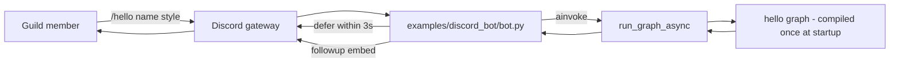

# Plan: Discord × YAMLGraph PoC — `/hello` Slash Command

**Date:** 2026-08-17
**Status:** Proposed proof of concept
**First consumer:** An internal Discord guild member running `/hello` and
receiving the output of `examples/demos/hello/graph.yaml`
**Relation:** Phase-0 evidence for
[plan-chat-initiated-outbound-calls.md](plan-chat-initiated-outbound-calls.md) —
proves the Discord adapter seam (interaction → command → result message) with
zero telephony, zero new graph authoring.

## Ideal Result

A guild member types `/hello name:Maija style:playful` and, within a few
seconds, the bot replies in-channel with the structured greeting the hello
graph produced. The graph is executed unmodified; Discord is a presentation
layer only. Removing the bot leaves YAMLGraph untouched.

## Decisions

| Question | Decision | Why |
|---|---|---|
| Transport | Gateway bot (`discord.py` v2 app commands) | No public HTTPS endpoint, no signature verification — PoC-minimal |
| Command scope | Guild-scoped, single test guild | Registers instantly; global commands cache up to 1h |
| Graph | Reuse `examples/demos/hello` as-is | No graph authoring → graph-authoring doctrine not triggered |
| Execution API | `load_and_compile_async` + `run_graph_async` | Existing async seam; OTEL/route-log compatible for free |
| Placement | `examples/discord_bot/` | Presentation layer per three-layer pattern; not a `yamlgraph/` core module |
| Dependency | `discord.py` documented in the example README only | No new core or dev extra for a PoC |

## Architecture

Three-layer mapping:

- **Presentation (Python):** `bot.py` — token, command registration, option
  parsing, defer/followup, embed rendering, error messages.
- **Logic (YAML):** `examples/demos/hello/graph.yaml` — unchanged.
- **Side effects:** none beyond the LLM call the graph already makes.

## Command Contract

Slash command `/hello`:

| Option | Type | Constraint |
|---|---|---|
| `name` | string, required | 1–80 chars |
| `style` | string, required | choices: `formal`, `casual`, `playful` |

Graph state in: `{"name": ..., "style": ...}`. Result out:
`state["greeting"]` = `{greeting, emoji, formality_level}` (schema in
`prompts/greet.yaml`). Render as one embed:
title = `emoji + greeting`, footer = `formality_level`.

## Hard Constraints

1. **3-second ack:** Discord voids the interaction if not acknowledged in 3s.
   LLM latency exceeds that — always `defer()` first, then `followup.send()`
   (token stays valid 15 min).
2. **Compile once:** load and compile the graph at bot startup; per-interaction
   work is `run_graph_async` only. Concurrent interactions are independent
   `ainvoke` calls — no shared mutable state.
3. **No prompts in Python, no direct provider imports** — the adapter never
   builds LLM messages.
4. **Fail visibly:** exceptions surface as an ephemeral error message with a
   correlation ID logged server-side; no silent fallback greeting
   (`plausible_wrong_answer`).
5. **Secrets:** `DISCORD_BOT_TOKEN`, `DISCORD_GUILD_ID` via env / `.env`; never
   logged. Existing `PROVIDER` / provider keys unchanged.

## Delivery Ladder

### Rung 1 — Adapter unit slice (no Discord, no LLM)

Extract the pure mapping `interaction options → initial state → embed fields`
into functions testable without a gateway connection. Test with a stubbed
runner returning a canned `greeting` dict, plus the error path.

**Gate:** mapping and rendering tests green with zero network.

### Rung 2 — Live bot in test guild

`bot.py` wires discord.py: on_ready syncs the guild command; handler defers,
runs the graph, sends the embed. Manual acceptance in the test guild:

- happy path for each `style` choice;
- two overlapping invocations return correct, non-crossed replies;
- provider failure (unset key) yields the ephemeral error, not a hang;
- bot restart re-syncs the command without duplicates.

**Gate:** all four observed; paste run log into the example README.

### Rung 3 — Stop

PoC ends here. Explicitly **not** built: generic `/run <graph>` command,
streaming token updates, interrupt/HITL via modals, multi-turn threads,
persistence, public/global rollout. Each requires its own FR with a named
consumer (`growth_as_default`).

## Risks

| Risk | Response |
|---|---|
| Graph latency > 15 min followup window | Not plausible for hello; guard with `asyncio.timeout` well below it |
| Command-name collision in shared guild | Prefix `yg-` if the test guild has other bots |
| Temptation to expose arbitrary graphs | Out of scope; a generic runner is an authorization surface, not a PoC |
| discord.py version drift | Pin exact version in example README install line |

## Definition Of Done

A tester in the designated guild runs `/hello`, gets the structured greeting
as an embed for all three styles, sees a clean ephemeral error when the
provider key is absent, and `git diff` shows changes only under
`examples/discord_bot/` plus its tests.

## Seed

If a slash command is just `variables → graph → state_key → message`, is the
durable artifact a per-graph bot — or a YAML manifest that declares
`command: /hello, graph: ..., render: greeting` so new commands are config,
not code?
