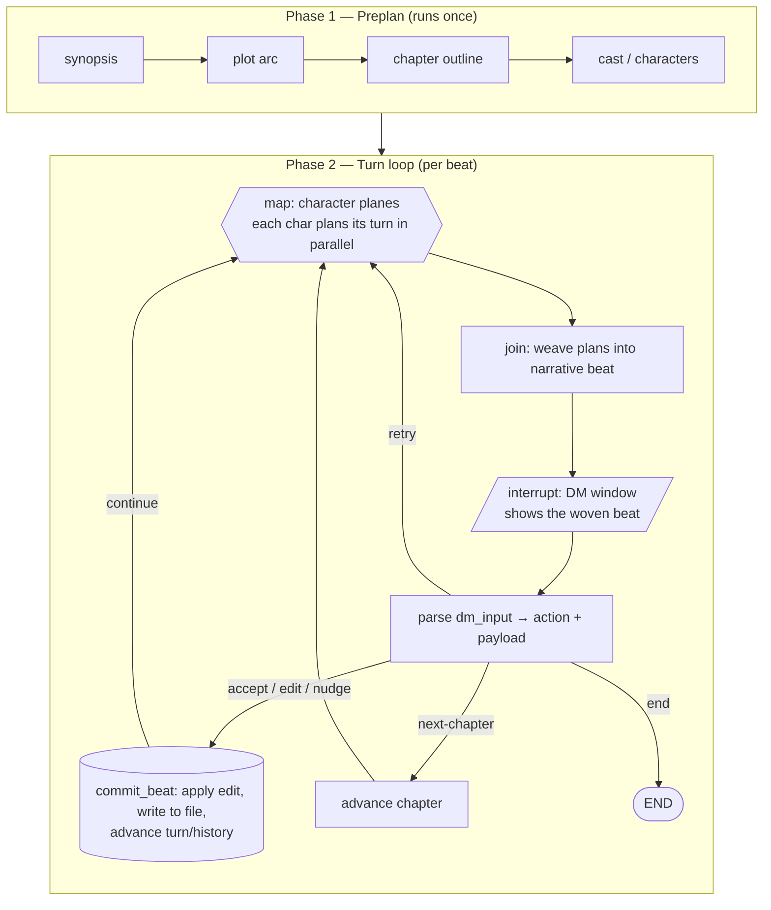

# Plan: Turn-Based Book / Dungeon Master

A YAMLGraph example that fuses the **eBook** preplanning spine with the **NPC encounter** turn loop, adding a Dungeon Master steering window so the user can adjust the story as it unfolds.

## Inspiration & Background

### eBook (`examples/ebook/`)
Provides the **preplanning spine**: a structure decided up front, then content produced section by section through a `write → judge → amend` rite, with artifacts flowing through **files** rather than complex state.

- Strength: deterministic, resumable, *structured-before-generated*.
- Pattern reused: linear preplanning pipeline + file-based artifacts.

### NPC Encounter (`examples/npc/`)
Provides the **turn engine**: a checkpointed loop where `interrupt` pauses for the DM, `map` nodes fan characters out to act **in parallel** ("separate planes"), and a `summarize`/`narrate` node weaves those parallel actions into one coherent beat ("join narrative in the middle").

- Strength: human-in-the-loop, parallel agency, session persistence.
- Pattern reused: `interrupt` + `Command(resume=...)`, `map` fan-out/fan-in, SQLite/Redis checkpointer, session adapter for web UI.

### Reflection
The concept is the marriage of the two: **eBook's preplanned skeleton + NPC's parallel turn loop, with the DM as a steering wheel rather than a co-author.**

| User phrase | Mechanism | Position |
|---|---|---|
| characters' plans in **separate planes** | `type: map` over `state.cast`, one parallel branch per character | top / sides |
| the **join narrative in the middle** | `type: llm` join node, fans-in `collect`ed plans → one beat | center |
| **DM char window at the end** | `type: interrupt` at end of each turn, `resume_key: dm_input` | bottom |

## Architecture



**Commit-after-decision:** `weave` writes only `state.beat`; the file write and turn/history advance happen in `commit_beat`, reached only on committing actions. Retry re-rolls the same turn with no commit and no counter change.

## Two Graphs (mirrors NPC's split)

### 1. `preplan.yaml`
Linear pipeline, like `npc-creation.yaml`. Runs once.

```
START → synopsis → plot → chapters → cast → END
```

Writes `story.json` + per-chapter outline files (eBook's file-based pattern).

### 2. `turn-loop.yaml`
Checkpointed play loop.

| Node | Type | Role |
|---|---|---|
| `plan_all` | `map` over `{state.cast}`, `as: char`, `collect: turn_plans` | Each character privately plans its move, conditioned on chapter goal + recent history + active steering var. Each plan is **tagged with the character name** so `weave` attributes by identity, not list order. **The "separate planes."** |
| `weave` | `llm` | Joins `turn_plans` into one narrative passage written to `state.beat` only. **The "middle."** |
| `dm_window` | `interrupt`, `resume_key: dm_input` | DM reads the beat and steers **every turn**. **The "end window."** |
| `parse_dm` | `passthrough` | Splits `dm_input` into `dm_action` + `dm_payload`. |
| `commit_beat` | `python` tool | Applies edit, appends final beat to the chapter file, advances `turn_number`/`history`. Only on accept/edit/nudge/next-chapter. |

The Nudge steering var becomes an input to the next `plan_all` (then is cleared), so the next-turn plans bend to the DM's adjustment — **the story stays preplanned but steerable as it unfolds.**

### DM Control Model (decided)

**Turn-level control, default to accept/edit.** Input is parsed into a structured action so Edit and Nudge are unambiguous. CLI grammar:

| DM action | `dm_input` (CLI) | Commits? | Effect |
|---|---|---|---|
| **Accept** (default) | empty / `accept` | yes | Commit the beat as-is, advance. Enter-through = autonomous run. |
| **Edit** | `edit: <text>` | yes | Replace the woven beat with `<text>`, commit, advance. Overrides *this* turn. |
| **Nudge** | `nudge: <text>` | yes | Commit current beat **and** steer the next `plan_all` with `<text>`. Steers the *next* turn. |
| **Retry** | `retry` | no | Re-run `plan_all` + `weave` for the same turn; no commit, no counter change. |
| **Next chapter** | `next-chapter` | yes | Commit and advance `chapter_index`. |
| **End** | `end` | — | Stop the run. |

The default path (Accept) means the DM can let the story run on its own and only intervene when a beat needs correction — *low-friction oversight, full authority when wanted.* Edit acts on the **current** beat; Nudge influences the **next** one and is consumed after one turn.

## State Sketch

```yaml
state:
  premise: str
  synopsis: dict          # preplan output
  plot: dict              # arc / acts
  chapters: list          # preplanned outline
  cast: list              # characters (each: name, voice, goals, arc)
  chapter_index: int
  turn_number: int
  turn_plans: list        # collected from map (per-character plane); each tagged with char name
  beat: str               # joined narrative this turn (pre-commit, editable)
  history: list           # past beats
  dm_input: str           # raw DM input (CLI grammar)
  dm_action: str          # parsed: accept | edit | nudge | retry | next-chapter | end
  dm_payload: str         # parsed edit/nudge text
  steer: str              # active nudge for next plan_all; cleared after consumption
```

## UI Layout (optional, follows NPC's HTMX adapter)

A three-zone board served by the same `EncounterSession` / `Command(resume=...)` pattern:
- N character-plane cards across the top, streaming each plane's plan
- The woven beat in a wide center column (editable in place)
- A sticky DM input bar at the bottom: **Accept (default)** / edit beat / nudge / retry / next chapter / end
## Proposed Location

`examples/dungeon-master/` alongside `npc` and `ebook`:

```
examples/dungeon-master/
├── preplan.yaml
├── turn-loop.yaml
├── prompts/
│   ├── synopsis.yaml
│   ├── plot.yaml
│   ├── chapters.yaml
│   ├── character_plan.yaml
│   └── weave.yaml
├── run.py
└── README.md
```

## Open Questions

1. **Scope** — formalized as a phased Feature Request: [FR-466](../feature-requests/FR-466-dungeon-master-example.md) (4 phases: preplan → planes+weave → turn loop+DM → optional HTMX board).

> **Resolved — DM granularity:** Turn-level control with a default to accept/edit. The DM is prompted every turn; pressing Enter (Accept) commits the beat and runs autonomously, while editing overrides the current beat and nudging steers the next. See [DM Control Model](#dm-control-model-decided).
