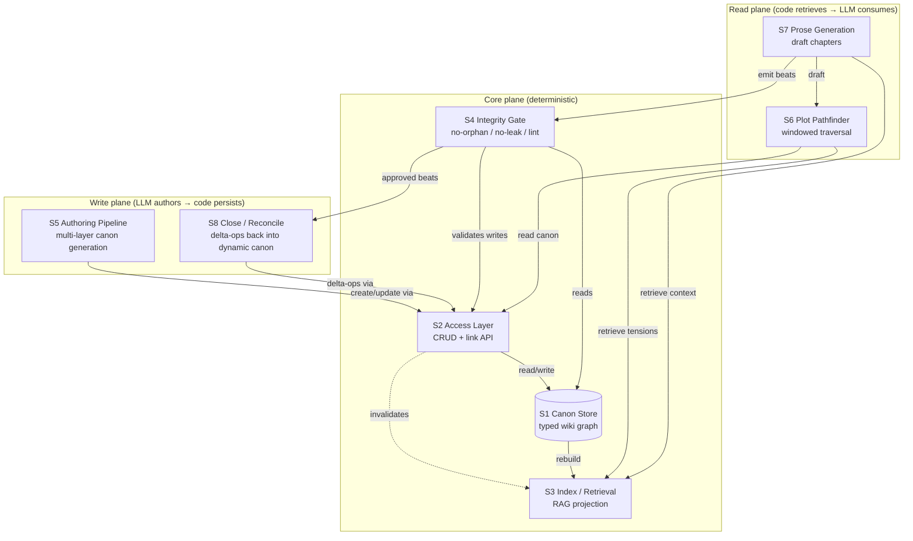
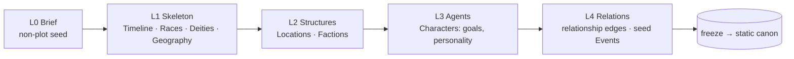

# Fandom Generation — System Architecture

**Status:** Design north-star (no authority granted; companion to
[plan-fandom-generation.md](plan-fandom-generation.md)).
**Scope:** the *subsystems* and their contracts. The generation plan answers
*why canon-first*; this answers *what parts exist, who owns what, and how data
flows between them*.

**Governing law (carried from the generation plan):**
*The LLM authors meaning; deterministic code authors persistence.* Every
subsystem below is sorted into exactly one of those two columns, and the
architecture's job is to keep the seam between them sharp.

---

## 1. The big picture

Eight subsystems across three planes. The **canon store** is the single source
of truth; everything else is either a *projection* of it (index), a *guard* on
it (gate), a *writer* into it (authoring, close), or a *reader* of it (pathfinder,
prose).



Two facts the diagram encodes:

- **The canon store is written only through the Access Layer (S2)**, never
  directly. That choke point is where the gate (S4) attaches and where the index
  (S3) gets invalidated. No subsystem touches files behind S2's back.
- **The index (S3) is a cache, not a source.** It can be deleted and rebuilt from
  the store at any time. Nothing is ever *only* in the index.

---

## 2. The subsystems

Each subsystem named with: its one responsibility, its interface, whether it is
**LLM** (authors meaning) or **CODE** (authors persistence), and the existing
asset it builds on.

### S1 — Canon Store (the wiki) · CODE

The typed knowledge graph on disk. Substrate = markdown + YAML front-matter in a
git directory (per [plan-fandom-generation.md](plan-fandom-generation.md) §2, §11;
[OKF](https://github.com/GoogleCloudPlatform/knowledge-catalog/blob/main/okf/SPEC.md)
convention: path = identity, front-matter links = edges).

- **Responsibility:** hold the 8 page types as the single source of truth; nothing
  else is canonical.
- **Layout:** `canon/<type>/<id>.md` — typed front-matter (the graph) + prose body
  (the meaning).
- **Two lanes** (generation plan §3): `canon/static/**` (immutable carry-forward
  floor) and `canon/dynamic/**` (delta-mutated relationships + events).
- **Interface:** *none directly* — reached only through S2.
- **Builds on:** [`data_files`](../reference/graph-yaml.md) read primitive +
  [FR-625 `write_data_file`](../feature-requests/FR-625-write-data-file-tool.md).

### S2 — Access Layer (CRUD + link API) · CODE

The repository / DAO over the store. **The only writer.** This is the "maintenance
subsystem offering a CRUD interface" — turned into a narrow, typed contract so that
the gate and index can hang off a single seam.

- **Responsibility:** typed, validated, transactional access to canon; the place
  where every write is gated and every write invalidates the index.
- **Interface (a leaf tool, Layer 3):**

  | Op | Signature (conceptual) | Notes |
  |---|---|---|
  | `create_page` | `(type, id, infobox, body) -> Page` | rejects duplicate id; gated |
  | `read_page` | `(id) -> Page` | verbatim; no LLM |
  | `update_page` | `(id, delta) -> Page` | dynamic lane only; static is immutable |
  | `invalidate` | `(id, valid_to)` | **deprecate, never delete** (Graphiti rule) |
  | `link` / `unlink` | `(src, edge_type, dst)` | edge must resolve or gate fails |
  | `query` | `(type?, edge?, window?) -> list[Page]` | structured filter, not search |
  | `neighbors` | `(id, depth) -> subgraph` | bounded traversal for scoped lint |

- **Transactionality:** a write is *propose → gate → commit*. If the gate (S4)
  rejects, nothing is persisted and the index is untouched.
- **Builds on:** FR-625 (write), `data_files` (read), the bi-temporal
  invalidate-not-delete discipline from
  [FR-515](../feature-requests/FR-515-dm-v2-bitemporal-ledger-reconciliation.md).

### S3 — Index / Retrieval (RAG) · CODE

A rebuildable projection of the store for *similarity* and *full-text* reads — what
structured `query` (S2) cannot answer (e.g. "which unresolved tensions resemble this
beat?").

- **Responsibility:** fast top-K retrieval over canon prose + edges; strictly a
  cache derived from S1.
- **Two retrieval modes** (generation plan §11):
  - **structured** — graph queries via S2 (`query`, `neighbors`): exact, the
    default, no embeddings.
  - **semantic** — SQLite **FTS5** + on-device embeddings with reciprocal-rank
    fusion, or [ChromaDB](https://www.trychroma.com); for fuzzy "find related
    tensions" reads only.
- **Invalidation contract:** every S2 write marks affected ids dirty; the index
  rebuilds those nodes + neighbors lazily. **The index is never authoritative.**
- **Interface:** `search(query, k, filter) -> list[(id, score)]` → caller re-reads
  canon through S2 (retrieve ids, not content, so the store stays the source).
- **Builds on:** bounded top-K retrieval discipline
  ([FR-516](../feature-requests/FR-516-dm-v2-ranked-topk-ledger-retrieval.md)).

### S4 — Integrity Gate / Lint (keeping the wiki in order) · CODE

The deterministic guard. **Realizes [FR-627](../feature-requests/FR-627-canon-link-gate.md).**
Non-LLM, blocking, reproducible — the no-orphan / no-leak gate plus scheduled lint.

- **Responsibility:** refuse any write or beat that breaks a structural invariant.
- **Two trigger points:**
  - **inline (per write)** — S2 calls the gate before commit: no-orphan (edge
    targets resolve), no-leak (referenced entity is authored canon), schema-valid
    front-matter, static-immutability (no write under `canon/static/**`).
  - **scheduled (maintenance lint)** — over *changed nodes + 1st/2nd-degree
    neighbors* (scoped delta lint, generation plan §11): staleness, duplicate
    detection, contradiction tokens, coverage gaps.
- **Verdict:** structured `list[Violation{file, reason}]`; non-empty ⇒ write
  rejected / commit blocked. The *refusal* is the value (advisory lint rots).
- **Builds on:** [`test_no_world_codex.py`](../examples/dungeon_master/tests/test_no_world_codex.py)
  generalized; the commit-gate pattern (Karpathy status-token sweep).

### S5 — Authoring Pipeline (multi-layer canon generation) · LLM → CODE

The "multiple layers of generating wiki things." Canon is built **bottom-up in
topological order** so that no page can reference an entity that does not yet exist
— the no-orphan invariant is enforced *by build order*, not just by the gate.



- **Responsibility:** seed the static canon graph, one tier at a time, each tier
  gated against all prior tiers before the next runs.
- **Per-tier loop:** LLM drafts pages from the brief + already-frozen tiers →
  S2 `create_page` (gated by S4) → on pass, tier freezes.
- **Why tiers:** a character (L3) may name a faction (L2) and a deity (L1); those
  must already exist or the gate rejects. Build order makes "author canon before
  it is referenced" mechanical. This is the §9 fork made concrete:
  **Option A** = humans author tiers; **Option B** = LLM bootstraps each tier then
  the **freeze boundary is the gate** ([FR-550](../feature-requests/FR-550-dm-v2-rollback-world-codex.md)
  wound closed only here).
- **Builds on:** [FR-552 world bible](../feature-requests/FR-552-dm-v2-world-bible.md)
  (ground-truth thesis), [FR-626](../feature-requests/FR-626-write-data-file-demo.md)
  (accumulating-wiki demo).

### S6 — Plot Pathfinder (traversal) · CODE-retrieve → LLM-search

The first of the two play-loop subsystems. The only *generative* step in the play
loop (generation plan §5).

- **Responsibility:** given a Timeline window + roster subset, find a storyline that
  moves *existing* tensions toward resolution.
- **Flow:** S2/S3 retrieve (window, roster, open relationship edges, unmet goals,
  looming events) → LLM proposes a beat sequence over those fixed tensions → each
  beat is gated (S4) so it references only canon entities.
- **Output:** a typed `PlotPath{beats: [Beat{window, actors, stakes, references}]}`
  — every `reference` must resolve to canon (no-leak).
- **Builds on:** goal/affect vocabulary from
  [plot_modeller vision.md](../examples/plot_modeller/docs/vision.md); inverts
  [roundtrip_skeleton.yaml](../examples/plot_modeller/graphs/roundtrip_skeleton.yaml).

### S7 — Prose Generation (draft) · CODE-retrieve → LLM-draft

- **Responsibility:** turn an approved plot path into chapter prose, grounded in
  retrieved canon (not re-invented).
- **Flow:** for each beat, S3 retrieves the relevant canon context (actor pages,
  location, era) → LLM drafts the chapter (a `map` over beats) → emitted prose is
  scanned by S4 for leaked entities before it is allowed to persist.
- **Output:** `Chapter` artifacts + a set of *candidate* delta-ops (new events,
  relationship valence shifts) handed to S8.
- **Builds on:** the existing `draft_chapter` map node shape.

### S8 — Close / Reconcile (delta back into dynamic canon) · LLM-extract → CODE-apply

Closes the play loop by committing what *happened* in the prose back into the
dynamic canon — post-action grounding, the safe direction (generation plan §4).

- **Responsibility:** extract the chapter's consequences as **diff ops** and apply
  them to `canon/dynamic/**` via S2 — append events, reconcile relationship edges,
  decay stale valence. **Never regenerate the store.**
- **Reconcile rule:** a contradicting fact *invalidates* the old edge
  (sets `valid_to`), it does not delete it (Graphiti / bi-temporal,
  [FR-515](../feature-requests/FR-515-dm-v2-bitemporal-ledger-reconciliation.md)).
- **Carry-forward floor:** zero ops ⇒ inherited dynamic canon is left intact; it
  cannot spontaneously empty ([plan-ledger-memory.md](plan-ledger-memory.md)).
- **Builds on:** [FR-513–518](../feature-requests/FR-513-dm-v2-emotional-state-in-world-ledger.md)
  delta-ledger discipline.

---

## 3. Mapping to the three-layer law

The architecture must obey the repo's three-layer separation (CLAUDE.md). Where
each subsystem lives:

| Layer | Owns | Subsystems |
|---|---|---|
| **Presentation** (Python CLI/API) | invocation, run dirs, REPL, HTTP | run driver only |
| **Logic** (YAML graphs) | the loops, routing, LLM calls, map fan-out | S5 authoring graph, S6 pathfinder graph, S7 prose graph, S8 close graph |
| **Side effects** (Python leaf tools) | file I/O, index, deterministic checks | S1 store, S2 CRUD, S3 index, S4 gate |

The generative subsystems (S5–S8) are **YAML graphs** that *call* the deterministic
leaf tools (S1–S4). No leaf tool calls a graph; no graph touches the filesystem
except through S2. This is the same import-boundary the repo already enforces with
`import-linter`.

---

## 4. The two loops

The system has exactly two control loops. Keeping them separate is what prevents the
[FR-550](../feature-requests/FR-550-dm-v2-rollback-world-codex.md) leak.

### Build loop (cold path, runs rarely → freezes)

```
brief → S5 author tier → S4 gate → freeze → (next tier) → static canon ready
```

Produces immutable static canon. Ends at a freeze boundary. After freeze, the static
store is read-only for the entire play loop.

### Play loop (hot path, runs per story)

```
S6 find_plot_path → S4 gate
        → S7 draft_chapter (map) → S4 gate
        → S8 close (delta-ops) → S2 apply → dynamic canon grows
        → (next window)
```

Only the dynamic lane mutates here; the static lane is a fixed floor. Each arrow that
crosses into the store passes through S4 first.

---

## 5. Interface contracts (the seams that must stay sharp)

Three contracts carry the whole design. If these three are typed and tested, the rest
is mechanical.

1. **Write contract (S2 + S4):** every persist is `propose(Page|Delta) → Violation[]
   → commit|reject`. No write bypasses the gate; a rejected write leaves store and
   index byte-identical.
2. **Retrieval contract (S3):** `search/query` returns **ids + scores**, never
   authoritative content; callers re-read through S2. The index is disposable.
3. **No-leak contract (S4):** every entity named by a Beat (S6) or Chapter (S7) must
   resolve to an authored canon id, or the artifact is rejected before it can become
   a foundation. This is [FR-627](../feature-requests/FR-627-canon-link-gate.md).

---

## 6. Subsystem → asset / FR map

| Subsystem | Status | Anchor asset / FR |
|---|---|---|
| S1 Canon Store | partial | `data_files` shipped; typed schema **not built** |
| S2 Access Layer (CRUD) | **not built** | depends on [FR-625](../feature-requests/FR-625-write-data-file-tool.md) |
| S3 Index / Retrieval | **not built** | discipline from [FR-516](../feature-requests/FR-516-dm-v2-ranked-topk-ledger-retrieval.md) |
| S4 Integrity Gate | specced | [FR-627](../feature-requests/FR-627-canon-link-gate.md); generalizes [test_no_world_codex.py](../examples/dungeon_master/tests/test_no_world_codex.py) |
| S5 Authoring Pipeline | **not built** | [FR-552](../feature-requests/FR-552-dm-v2-world-bible.md), [FR-626](../feature-requests/FR-626-write-data-file-demo.md) |
| S6 Plot Pathfinder | **not built** | inverts [roundtrip_skeleton.yaml](../examples/plot_modeller/graphs/roundtrip_skeleton.yaml) |
| S7 Prose Generation | partial | `draft_chapter` map shape shipped |
| S8 Close / Reconcile | specced | [FR-513–518](../feature-requests/FR-513-dm-v2-emotional-state-in-world-ledger.md), [FR-515](../feature-requests/FR-515-dm-v2-bitemporal-ledger-reconciliation.md) |

---

## 7. Build sequencing (composition order)

Bottom-up, each a separate FR with a RED test. The order is forced by dependency:
you cannot gate what you cannot write, cannot author tiers without a gate, cannot
traverse without authored canon.

1. **S1 + S2** — typed canon schema + CRUD leaf tool (on
   [FR-625](../feature-requests/FR-625-write-data-file-tool.md)). *Test:* create →
   read → update round-trips; static lane rejects writes.
2. **S4** — the integrity gate ([FR-627](../feature-requests/FR-627-canon-link-gate.md)),
   wired into S2's commit path. *Test:* orphan edge + leaked entity → 3 violations.
3. **S5** — tiered authoring graph; freeze boundary calls S4. *Test:* a tier naming
   a not-yet-authored entity is rejected at its freeze.
4. **S3** — index projection + invalidation. *Test:* write marks ids dirty; rebuild
   matches store; index deletion is harmless.
5. **S6** — `find_plot_path` over frozen canon. *Test:* every beat reference traces
   to a canon id.
6. **S7 + S8** — draft + delta-close. *Test:* zero-op close preserves dynamic canon
   (carry-forward floor); contradicting fact invalidates, not deletes.

Steps 1–2 unblock everything and contain no LLM — they can land first and stand alone.

---

## 8. Risks / open questions (decide before the first FR)

- **Seeding fork (inherited from §9):** S5 Option A (hand-authored tiers) vs Option B
  (LLM-bootstrap + freeze-gate). Architecture supports both; B is safe *only* because
  S4 sits on the freeze boundary.
- **Index staleness vs cost:** lazy rebuild (S3) risks a window where index lags
  store. Mitigation: retrieval returns ids only (contract §5.2), so a stale index
  surfaces a wrong *candidate set*, never wrong *content* — the gate still catches
  leaks. Acceptable.
- **CRUD granularity:** is `update_page(delta)` the right unit, or should S8 emit
  edge-level ops directly? Lean edge-level to match the delta-ledger
  ([FR-513–518](../feature-requests/FR-513-dm-v2-emotional-state-in-world-ledger.md)).
- **Contradiction detection depth:** S4's scheduled lint can catch *structural*
  contradictions (two `valid` exclusive edges) deterministically, but *semantic*
  contradictions in prose need an LLM pass — which reopens the cost/trust question.
  Keep semantic contradiction *advisory + logged*, structural *blocking*.

---

## 9. Related

- [plan-fandom-generation.md](plan-fandom-generation.md) — the why/what this
  architecture implements (the inversion, two canons, no-leak, prior art, tooling).
- [FR-627 canon-link gate](../feature-requests/FR-627-canon-link-gate.md) — S4.
- [FR-625](../feature-requests/FR-625-write-data-file-tool.md) /
  [FR-626](../feature-requests/FR-626-write-data-file-demo.md) — S1/S2/S5 substrate.
- [FR-552](../feature-requests/FR-552-dm-v2-world-bible.md) — static-canon ground truth.
- [FR-513–518](../feature-requests/FR-513-dm-v2-emotional-state-in-world-ledger.md) /
  [FR-515](../feature-requests/FR-515-dm-v2-bitemporal-ledger-reconciliation.md) — S8 delta + reconcile.
- [FR-516](../feature-requests/FR-516-dm-v2-ranked-topk-ledger-retrieval.md) — S3 retrieval discipline.
- [plan-ledger-memory.md](plan-ledger-memory.md) — dynamic-canon mutation model.
- [the-ledger-was-a-memory-system](diary/diary-2026-06-17-the-ledger-was-a-memory-system.md) — the boundary law.
