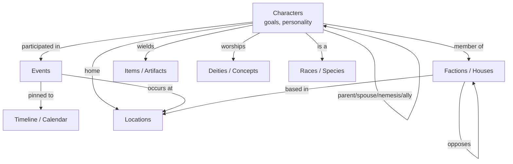

# Fandom-Style Canon-First Generation

**Status:** Design north-star (no authority granted; precedes any FR).
**Thesis:** Model the world, its characters, and its major events as a typed,
cross-linked **canon graph** *before* any story is envisioned. Plotting is then a
*traversal* — finding a storyline between predefined characters and their fixed
goals — not a top-down derivation from a premise.

---

## 1. The inversion

The current round-trip skeleton derives everything from a premise, top-down:

```
premise -> derive_cast -> outline_briefs -> draft -> gate(self-report)
```

This is the shape [FR-550](../feature-requests/FR-550-dm-v2-rollback-world-codex.md)
condemned: a world derived *from plot* leaks plot into the world (non-roster
characters appear; "factions" come out as plot groupings). It is also the shape the
plot_modeller refutation found hollow — the affect gate graded the author's own
*self-report*, not the prose (see
[plan-roundtrip-skeleton.md](../examples/plot_modeller/docs/plan-roundtrip-skeleton.md)).

Canon-first inverts the dependency:

```
canon graph (authored / post-action ground truth, no LLM)
        |
        v
find_plot_path  (LLM searches a storyline connecting fixed character goals)
        |
        v
draft_chapter (map)
        |
        v
gate-against-canon  (deterministic: no entity outside canon; no contradiction)
        |
        v
chapter_close -> delta-ops -> dynamic canon (append / reconcile / decay)
```

The generative act shrinks to one node — *find the path* — and the gate becomes a
consistency check against fixed ground truth instead of a tautological self-report.

---

## 2. What "fandom scope" means (the canon graph)

A Fandom wiki is not a bible file. It is a **typed knowledge graph** of dozens-to-
hundreds of cross-linked entity pages. Reading a mature character page (e.g.
Forgotten Realms' Drizzt, the Witcher's Geralt) reveals a constant structure:

- **Infobox** — machine-readable typed fields: identity (aliases, titles), physical
  (race, gender), personal (profession, **affiliation**, patron deity), **dates**
  (born/died), **family** (parents, spouse, siblings, children). Every field that
  names another entity is an **edge**.
- **Body sections** — fixed skeleton: `Description -> Personality -> Abilities ->
  Possessions -> History -> Relationships`. Two of these carry the plot engine:
  - **History, divided into ERAS** — each era a self-contained arc pinned to the
    **timeline** (DR calendar / regnal years).
  - **Relationships, per-character** — typed, directional, **time-evolving emotional
    edges** ("love of his life", "arch-nemesis", "uneasy ally"). This is the affect
    axis as *canon derived from committed history*, not as an authored guess.
- **The link mesh** — every proper noun links to its own page. **No entity is an
  orphan.** That invariant is the wiki's integrity and our enforcement hook.

The universe decomposes into ~8 first-class page types:



Salvatore did not derive Menzoberranzan from a plot; he built the city, the houses,
the calendar, and Drizzt's pacifism-vs-"Hunter" tension — **then wrote each novel as
one path through the fixed graph.** That is the model.

---

## 3. Two canons, two memory disciplines

The graph splits along the axis the DM line already paid for
([FR-551](../feature-requests/FR-551-dm-v2-supporting-cast-tier.md)):

| Canon kind | Pages | Mutation discipline | Precedent |
|---|---|---|---|
| **Static** (depth axis) | Locations, Factions, Deities, Races, Timeline | immutable **carry-forward floor** — loaded verbatim, never rewritten | [FR-552 world bible](../feature-requests/FR-552-dm-v2-world-bible.md) |
| **Dynamic** (coherence axis) | Character relationships, emotional valence, new Events | **delta-ledger** — append / reconcile / decay, never regenerate | [plan-ledger-memory.md](plan-ledger-memory.md), [FR-513](../feature-requests/FR-513-dm-v2-emotional-state-in-world-ledger.md)–[FR-518](../feature-requests/FR-518-dm-v2-ledger-consolidation-pass.md) |

The **boundary law** from the memory research holds throughout: *the LLM authors
meaning, the code authors persistence* (see
[the-ledger-was-a-memory-system](diary/diary-2026-06-17-the-ledger-was-a-memory-system.md)).
A story commit proposes diff operations against the dynamic canon; deterministic code
applies them. The static canon is never touched.

---

## 4. The load-bearing constraint (no-leak)

The one rule that makes canon-first real rather than aspirational, ported from
[FR-550](../feature-requests/FR-550-dm-v2-rollback-world-codex.md):

> **Canon is authored or post-action-grounded — never plot-derived.**

A Fandom wiki is written by readers *after* canon is published — post-action
grounding. The failure mode was asking an LLM to invent the graph *from a premise*.
The mechanical enforcement is the wiki's own invariant: **every entity named by a
plot beat or a drafted chapter must already have a canon page, or it is flagged.**
This generalizes the existing regression guard
[test_no_world_codex.py](../examples/dungeon_master/tests/test_no_world_codex.py) from
one example to the whole graph.

---

## 5. How plotting becomes traversal

"Finding the storyline between predefined characters" is mechanically:

1. **Select a slice** — a window on the Timeline + a roster subset of Characters.
2. **Read the open tensions already in canon** — relationship edges with unresolved
   valence, unmet character goals, faction conflicts, a looming Event.
3. **Search for a storyline** — the LLM proposes a beat sequence that moves those
   *existing* tensions toward resolution. This is the only generative step.
4. **Gate against canon (deterministic)** — every named entity exists; no beat
   contradicts an infobox fact or an established relationship edge (the no-leak gate).

The affect arc the round-trip skeleton tries to *declare* is here *derived*: fixed
goals constrain the dramatic path, so the arc is searched-for and checkable — which
is exactly what the reground work was reaching for.

---

## 6. What exists vs. what is missing

| Piece | Asset | Status |
|---|---|---|
| Persistence primitive (write canon back) | [FR-625 `write_data_file`](../feature-requests/FR-625-write-data-file-tool.md) | judged, **not built** |
| Accumulating-wiki demo | [FR-626 world bible demo](../feature-requests/FR-626-write-data-file-demo.md) | judged, **not built** |
| Read primitive (`data_files`) | [reference/graph-yaml.md](../reference/graph-yaml.md) | shipped |
| Ground-truth world bible (static canon thesis) | [FR-552](../feature-requests/FR-552-dm-v2-world-bible.md) | approved; no authored canon yet |
| Delta-mutation discipline (dynamic canon) | [plan-ledger-memory.md](plan-ledger-memory.md) | north-star; FR-514–518 |
| No-leak invariant | [test_no_world_codex.py](../examples/dungeon_master/tests/test_no_world_codex.py) | shipped (one example) |
| Top-down skeleton to invert | [roundtrip_skeleton.yaml](../examples/plot_modeller/graphs/roundtrip_skeleton.yaml), [roundtrip_tools.py](../examples/plot_modeller/nodes/roundtrip_tools.py) | shipped |
| Goal/affect vocabulary the path search reuses | [plot_modeller vision.md](../examples/plot_modeller/docs/vision.md) | shipped |

Nothing here composes the three pieces yet. This is materially larger than a tweak to
the existing skeleton — it is a new example with a typed multi-entity canon store.

---

## 7. Sequencing (cheapest, highest-leverage first)

1. **Persistence** — build `write_data_file` ([FR-625](../feature-requests/FR-625-write-data-file-tool.md))
   and prove the read->augment->write cycle ([FR-626](../feature-requests/FR-626-write-data-file-demo.md)).
   Prerequisite for an accumulating canon.
2. **Canon schema** — typed Pydantic models for the 8 page types + infobox /
   relationship / timeline edges. Static vs. dynamic lanes declared.
3. **Verbatim canon loader** — load the static graph as ground truth (no LLM), in the
   spirit of [FR-552](../feature-requests/FR-552-dm-v2-world-bible.md).
4. **No-leak gate** — deterministic check that every named entity exists in canon;
   generalize [test_no_world_codex.py](../examples/dungeon_master/tests/test_no_world_codex.py).
5. **`find_plot_path` node** — windowed traversal proposing a storyline over fixed
   goals; gate its output against canon.
6. **Delta-close** — commit new Events / relationship updates as diff ops against the
   dynamic canon ([plan-ledger-memory.md](plan-ledger-memory.md) discipline).

Each is a separate FR with its own RED test. Steps 1–4 are independent of the LLM
search and can land first.

---

## 8. Acceptance shape (what "canon-first" means, testably)

- **No-leak:** a plot path or chapter that names an entity absent from canon is
  rejected. *(Test: inject a non-canon name -> gate flags it.)*
- **Static immutability:** a generation run leaves every static-canon page byte-for-
  byte unchanged. *(Test: hash static pages before/after a run.)*
- **Dynamic delta floor:** a chapter close emitting zero ops leaves the inherited
  dynamic canon intact — it cannot spontaneously empty. *(Carry-forward floor, per
  [plan-ledger-memory.md](plan-ledger-memory.md).)*
- **Traversal, not invention:** the plot path references only roster characters and
  existing tensions; goals are read from canon, not authored at plot time. *(Test:
  every beat's actors and stakes trace to a canon page.)*
- **Grounded gate:** coherence is judged against canon facts, not the author's self-
  report. *(Replaces the refuted self-report metric.)*

---

## 9. Open fork (decide before drafting the FR)

How is the canon graph seeded?

- **(A) Authored by hand** — purest; zero leak risk; matches
  [FR-552](../feature-requests/FR-552-dm-v2-world-bible.md) Option A. Higher upfront
  authoring cost.
- **(B) LLM-bootstrap each page type once from a non-plot brief, then freeze** — more
  convenient, but reopens the [FR-550](../feature-requests/FR-550-dm-v2-rollback-world-codex.md)
  wound unless the no-leak gate is enforced **at the freeze boundary**.

Option A is the safe default; Option B is viable only with the freeze-boundary gate
in place.

---

## 10. Prior art: the wiki-memory pattern

This design is a specific instance of a pattern that converged publicly in 2026.

- **Harrison Chase, [*Wiki Memory*](https://www.langchain.com/blog/wiki-memory)** (LangChain,
  Jun 30 2026): "use an agent to turn raw source data into a compact, persistent,
  agent-readable knowledge layer." Defining properties: *persistent, structured,
  inspectable, updated over time.* Substrate = **files**. Scope = durable domain
  knowledge, **not** conversation state. Distinct from RAG: a wiki *precomputes and
  maintains* synthesis instead of re-retrieving raw chunks per query.
- **Andrej Karpathy, [*LLM Wiki*](https://gist.github.com/karpathy/442a6bf555914893e9891c11519de94f)**:
  the reference architecture. Three layers — **raw sources** (immutable ground truth),
  **the wiki** (LLM-owned markdown), **the schema** (a `CLAUDE.md`/`AGENTS.md` that makes
  the LLM a *disciplined maintainer*, not a chatbot). Operations loop: **Ingest → Query
  → Lint.** He explicitly cites *fan wikis like Tolkien Gateway* and *reading a book,
  building pages for characters/themes/plot threads* as the motivating example — i.e.
  exactly this plan's domain.
- **Codebase variants:** [DeepWiki (Cognition)](https://cognition.ai/blog/deepwiki),
  [Factory AutoWiki](https://factory.ai/news/wiki) — auto-generated, self-updating repo
  documentation.
- **Lineage:** Vannevar Bush's **Memex** (1945) — curated store with associative trails;
  "the part he couldn't solve was who does the maintenance. The LLM handles that."

**Where this plan extends the pattern:** Chase lists *"best format for compressed data?"*
as an open question and Karpathy's wiki uses **untyped** markdown wikilinks. This plan's
answer is a **typed** canon graph (§2) with a deterministic **no-leak gate** (§4) — two of
the open questions resolved. The pattern's safety also rests on compressing *real
artifacts that already happened* (post-action grounding), which is precisely the
[FR-550](../feature-requests/FR-550-dm-v2-rollback-world-codex.md) discipline.

---

## 11. Wiki-maintenance tooling landscape

What the ecosystem actually uses to *maintain* an agent wiki, mapped to our analogs.
The recurring division of labor: **the LLM authors meaning; deterministic code does the
bookkeeping** — the same boundary law as [plan-ledger-memory.md](plan-ledger-memory.md).

| Concern | Tools / libs in the wild | Our analog |
|---|---|---|
| **Substrate** | markdown + YAML frontmatter in a git repo; [Obsidian](https://obsidian.md) as browser; [Open Knowledge Format (OKF) v0.1](https://github.com/GoogleCloudPlatform/knowledge-catalog/blob/main/okf/SPEC.md) (path = identity, links = edges) | [FR-625 `write_data_file`](../feature-requests/FR-625-write-data-file-tool.md) on YAML files |
| **Schema-as-config** | `CLAUDE.md` / `AGENTS.md` describing ingest/query/lint conventions ("the schema file is everything") | graph YAML + [copilot-instructions](../.github/copilot-instructions.md) |
| **Navigation** | `index.md` (one-line catalog) + `log.md` (append-only, `grep`-parseable timeline) | run logs, `demo-output.log` |
| **Search/retrieval** | [qmd](https://github.com/tobi/qmd) (BM25+vector+rerank, CLI+MCP); SQLite **FTS5** trigram + on-device embeddings (Ollama) with reciprocal-rank fusion; [ChromaDB](https://www.trychroma.com); [NetworkX](https://networkx.org) for graph traversal | bounded top-K retrieval ([FR-516](../feature-requests/FR-516-dm-v2-ranked-topk-ledger-retrieval.md)) — a leaf tool |
| **Temporal knowledge graph** | [Graphiti (Zep)](https://github.com/getzep/graphiti): bi-temporal **validity windows**, fact **invalidation not deletion**, episodes/provenance, **prescribed (Pydantic) or learned ontology**, hybrid retrieval; backends Neo4j/FalkorDB | bi-temporal reconcile ([FR-515](../feature-requests/FR-515-dm-v2-bitemporal-ledger-reconciliation.md)) — *we already specced this independently* |
| **Managed memory layers** | [Mem0](https://docs.mem0.ai), [LangMem](https://docs.langchain.com/oss/python/concepts/memory), [Letta](https://www.letta.com), [Zep](https://www.getzep.com) — add/search/update/delete over a hosted store | the world-ledger as memory ([FR-513–518](../feature-requests/FR-513-dm-v2-emotional-state-in-world-ledger.md)) |
| **Ontology / drift control** | Per-Entity **Seeded Ontology**: *strict* (allowed edge types) vs *emergent* (LLM invents) vs *off* — controls taxonomy drift (`company`/`Company`/`Org`) | the typed canon schema; **strict = §9 Option A, emergent = Option B** |
| **Maintenance loop** | **Lint** passes: schema integrity, staleness, **orphan check**, duplicate detection, coverage gaps, contradiction detection | the no-leak gate (§4) as a scheduled lint |

**Two findings worth importing directly:**

1. **The deterministic commit gate.** The strongest community pattern is a *non-LLM*
   commit gate: a Python `os.walk` + `grep` over the wiki for a machine-readable status
   token (e.g. `Contradiction severity: hard` / `Status: Unresolved`). It touches every
   file but never the context window — "scan the whole repo on every commit costs
   ~nothing." This is the same shape as our [`test_no_world_codex.py`](../examples/dungeon_master/tests/test_no_world_codex.py)
   guard and the repo's pre-commit hooks: cheap, deterministic, zero-context enforcement.
2. **Scoped (delta) linting.** Reasoning-heavy checks (contradiction, missing
   cross-references) run only over **nodes changed since last lint plus their 1st/2nd-degree
   graph neighbors**, never the full repo — bounded by the graph, O(neighborhood) not
   O(n²). This is the `read_raw_output_first` + bounded-retrieval discipline applied to
   maintenance, and it is how the no-leak gate stays cheap as canon grows.

The convergent lesson across every production report: **drift (the agent under-updating
cross-references on ingest) is the dominant failure mode, and the lint pass is not
optional.** For us that lint *is* the no-leak gate — making it a scheduled, blocking
check rather than an advisory one is the difference between a wiki that compounds and one
that rots.

---

## 12. Related

- [plan-fandom-architecture.md](plan-fandom-architecture.md) — the subsystem architecture (8 subsystems, two loops, interface contracts) that implements this plan.
- [plan-ledger-memory.md](plan-ledger-memory.md) — the dynamic-canon mutation model.
- [FR-552](../feature-requests/FR-552-dm-v2-world-bible.md) — world bible as ground-truth input (static canon).
- [FR-551](../feature-requests/FR-551-dm-v2-supporting-cast-tier.md) — cast (coherence) vs. world bible (depth) axes.
- [FR-550](../feature-requests/FR-550-dm-v2-rollback-world-codex.md) — the plot-derived-world rollback + permanent guard.
- [FR-625](../feature-requests/FR-625-write-data-file-tool.md) / [FR-626](../feature-requests/FR-626-write-data-file-demo.md) — canon persistence primitive + accumulating-wiki demo.
- [roundtrip_skeleton.yaml](../examples/plot_modeller/graphs/roundtrip_skeleton.yaml) — the top-down skeleton this inverts.
- [plot_modeller vision.md](../examples/plot_modeller/docs/vision.md) — goal/affect vocabulary the path search reuses.
- [the-ledger-was-a-memory-system](diary/diary-2026-06-17-the-ledger-was-a-memory-system.md) — the boundary law (LLM authors meaning, code authors persistence).

### External prior art

- [Harrison Chase — *Wiki Memory*](https://www.langchain.com/blog/wiki-memory) (LangChain, 2026) — the named pattern.
- [Andrej Karpathy — *LLM Wiki*](https://gist.github.com/karpathy/442a6bf555914893e9891c11519de94f) — raw/wiki/schema layers, ingest→query→lint loop.
- [Graphiti (Zep)](https://github.com/getzep/graphiti) — temporal knowledge-graph engine; bi-temporal facts, prescribed/learned ontology.
- [Open Knowledge Format (OKF) v0.1](https://github.com/GoogleCloudPlatform/knowledge-catalog/blob/main/okf/SPEC.md) — md + YAML frontmatter, path = identity.
- [LangGraph memory concepts](https://docs.langchain.com/oss/python/concepts/memory) — semantic/episodic/procedural; Profile vs Collection.
- [Mem0](https://docs.mem0.ai) · [DeepWiki](https://cognition.ai/blog/deepwiki) · [Factory AutoWiki](https://factory.ai/news/wiki) — managed memory + codebase-wiki variants.
