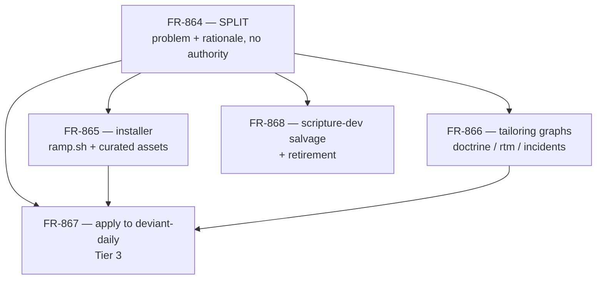

# Plan: Ramp — installing the process into a repo that has gone live

**Status:** planning frozen 2026-08-23; FR-865…FR-868 judged, revisions
folded, authority active. FR-865 amendments A-1/A-2 re-judged APPROVED
WITH REVISIONS, folded. FR-869 (spike-end detector) judged APPROVED
WITH REVISIONS, folded. No implementation started.
**Reader / moment:** whoever picks up ramp implementation, and whoever
is standing in front of a *new* repo that just went to production.
Read this first, then the child FR you are about to enforce.

## Why this exists

`deviant-daily` went to production on 2026-08-19 — commits `71e80b9`
(first public DeviantArt publish) and `eeca704` (cron enabled). Nothing
noticed. Four days later it had:

| | |
|---|---|
| pre-commit hooks | **0** (`.git/hooks/` empty; ~10 commits ran unvalidated) |
| CI jobs running its 145 tests | **0** |
| doctrine file | **none** |
| production failures on 2026-08-23 | **4**, in two hours |

Meanwhile this repo has 45 pre-commit hooks, 11 CI gates and 260 lines
of doctrine. The doctrine *travelled* — TDD reflexes and boundary
vocabulary came along — but everything that says **no** stayed behind,
and knowing the rule turned out to be a different physical event from
being stopped by it.

Evidence and reasoning:
[the doctrine that did not travel](diary/diary-2026-08-23-the-doctrine-that-did-not-travel.md) ·
[nothing announces the absent guard](diary/diary-2026-08-23-nothing-announces-the-absent-guard.md) ·
[process transfers by practice](diary/diary-2026-08-23-process-transfers-by-practice.md) ·
[the spike ends at a commit](diary/diary-2026-08-23-the-spike-ends-at-a-commit.md)

## The two counter-examples that shaped the design

| | `scripture-dev` (FR-207) | `customer-service-agent-platform` |
|---|---|---|
| mechanism | template repo + `render.sh` | live adoption, then divergence |
| last commit | 2026-03-29 | 2026-08-22 |
| hooks | 16, frozen | 23, current |
| consumers | 2 toy repos | a production voicebot |
| contributions back | none | **four traps in this repo's Scripture** (NC-141, NC-203, NC-414, FR-371) |

A distributor that is not a consumer has nothing forcing it to stay
true. That single observation decides the architecture: **the ramp ships
from this repo, which runs the same assets on every commit.**

## The family

| FR | Surface | Criteria | Depends on |
|---|---|---|---|
| [FR-864](../feature-requests/FR-864-ramp-spike-to-governed.md) | problem statement, design rationale. **SPLIT — no implementation authority** | — | — |
| [FR-865](../feature-requests/FR-865-ramp-installer.md) | `scripts/ramp.sh`, `ramp/manifest.yaml`, curated `ramp/assets/tier{1,2,3}/` | 15 | none — **build this first** |
| [FR-866](../feature-requests/FR-866-ramp-tailoring-graphs.md) | `ramp_doctrine`, `ramp_rtm`, `ramp_incidents` graphs | 16 | none (fixture-tested) |
| [FR-867](../feature-requests/FR-867-ramp-deviant-daily.md) | applying the ramp to `deviant-daily` | 19 | FR-865 + FR-866, by recorded artifact |
| [FR-868](../feature-requests/FR-868-scripture-dev-salvage.md) | classify, lift, retire `scripture-dev` | 17 | none (decoupled destination) |

FR-865, FR-866 and FR-868 are independently buildable. Only FR-867
composes.

## Tier model

Tiers are keyed to the **event that triggered the ramp**, not to
perceived maturity, and are monotonic — Tier 3 installs 1 + 2 + 3. An
explicit operator ruling may set the tier above the triggering event;
the ruling is recorded verbatim and counts as the trigger.

| Tier | Trigger | Installs |
|---|---|---|
| 0 spike | new repo | nothing, deliberately |
| 1 live | `schedule:` / secret / first external write | pre-commit basics, Copilot guard set, CI asset, `AGENTS.md` **stub** |
| 2 governed | second contributor, or first incident costing money or reputation | + FR/judgement/diary templates, `judge.sh`/`review.sh` + skills, diary and changelog gates |
| 3 regulated | IEC 62304 / MDR context | + registry shape, `req_coverage.py`, `--strict` gate |

`deviant-daily` is Tier 3 (operator ruling: "62304 styled rtm, skills,
hooks, precommit — the works").

## Decisions already frozen — do not relitigate

These were argued and settled in judgement. Reopening one needs a new FR.

1. **Assets are curated, not copied from this repo's live root.** Our
   root `.pre-commit-config.yaml` carries authoring proof, capability
   validation, radon/bandit against `yamlgraph/`, demo proof and
   FR-board gates. Shipping it would install a yamlgraph-specific config
   under the label "domain-free basics". (FR-865 R-1)
2. **Tier 1 has a supported target contract**: Python + `pyproject.toml`
   + pytest + ruff. "Works against any path" was an overclaim; anything
   else is refused. (FR-865 R-3)
3. **The installer never runs `git` against the target.** Repo-root
   detection is filesystem-only; linked worktrees are refused rather
   than guessed. (FR-865 R-5)
4. **Graphs write drafts to `tmp/ramp/` only.** Landing a draft into a
   target is a human act recorded in FR-867, never a graph's. (FR-866
   R-1, FR-867 R-3)
5. **Doctrine tailoring covers traps, cures *and* questions** — the
   first draft mapped traps alone and would have silently dropped the
   questions canon. (FR-866 R-3)
6. **`ramp_rtm` has no candidate floor.** A low count is a finding about
   the target, not a failure of the graph. A floor plus a no-padding
   rule cannot both hold under pressure. (FR-866 R-4)
7. **Local pre-commit blocks; CI detects.** `deviant-daily` has no
   branch protection and no required contexts, so a red run does not
   stop a push. Claiming otherwise would be
   `detection_without_enforcement` written into an acceptance criterion.
   (FR-867 R-4)
8. **`req_coverage --strict` may honestly fail.** Gaps are enumerated
   and accepted; padding a registry to make a gate green is forbidden.
   (FR-867 R-5)
9. **Archiving `scripture-dev` is hard-gated** on recorded human
   approval *and* a consumer-impact finding that is either "no impact"
   or explicitly accepted. Archive, never delete. (FR-868 R-5)

Two post-judgement amendments to FR-865 await re-judgement — they are
proposals, not frozen:

- **A-1: the curated tree must be consumed here.** Decision 1 fixed
  domain leakage but severed the founding property — this repo runs its
  root config, not the curated copies, making `ramp/assets/` a
  photograph (the FR-207 mechanism one level down). Cure: CI runs the
  curated Tier-1 config against a fixture repo on every push, plus a
  drift test against live counterparts. (FR-865 AC-16/AC-17)
- **A-2: `ramp/consumers.md`.** The flow-back measure below has no
  mechanism without a registry of ramped repos; it also feeds a future
  `ramp.sh --check` staleness diff. (FR-865 AC-18)

## Explicitly out of scope

- **The spike detector and unenforced-repo warning** — out of the
  *family's* scope because they modify `pre-command-guard.sh`,
  enforcement infrastructure. Now filed as their own FR:
  [FR-869](../feature-requests/FR-869-spike-end-detector.md), warn-only,
  both checks. Without it the "next repo, same week" measure is
  unreachable — detection is the trigger, the ramp is the response.
- **Branch protection on `deviant-daily`** — repository administration,
  the operator's decision.
- **Changing this repo's live hooks, CI, or judge/review/authoring
  doctrine.** The ramp adds a curated asset set; it does not touch the
  apparatus it copies from. (FR-869 touches the guard and is therefore
  judged separately, as parent C-5 requires.)

## Sequence

1. **Re-judge FR-865** (A-1/A-2 amendments), **judge FR-869**.
2. **FR-865** — installer + curated assets. Nothing else can be
   witnessed without it.
3. **FR-866** — the three graphs, fixture-tested. Parallelisable with 2.
4. **FR-868** — salvage, lift into `ramp/salvage/`, close out FR-207,
   gated archive. Independent.
5. **FR-867** — apply to `deviant-daily`. Composes 2 and 3; requires the
   activation record filled in with paths and SHAs.
6. **FR-869** — the detector, once judged. Independent of 2–5.

## The measure of success

Not "the ramp exists". The measure is that the **next** repo to go live
gets its gates the same week — which requires FR-869's warning to fire
at the transition commit — and that `deviant-daily`'s cron still
publishes the morning after it is ramped — gates must not break the
product that pays for them (FR-867 AC-16).

The longer-term measure is the one csap passes and `scripture-dev`
failed: does anything ever flow *back*? A ramped repo that eventually
contributes a trap to this Scripture has genuinely acquired the process.
One that only ever receives has a copy of it.
