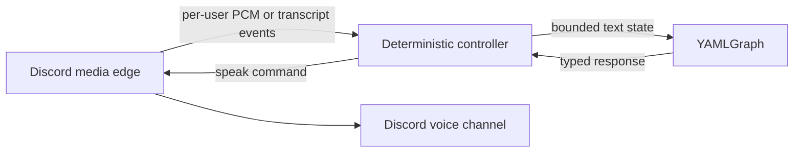

# Discord, Voice Runtime, and YAMLGraph Opportunities

**Date:** 2026-08-17
**Scope:** Discord chat, Discord voice channels, `voice_runtime`, YAMLGraph,
multilingual speech, translation, and transliteration
**Verdict:** Pursue Discord as a presentation and media edge. Do not extend the
current telephony runtime into a generic Discord runtime before a live voice
receive spike proves the boundary.

## Executive Finding

There are three different opportunities, with different confidence levels:

1. **Discord chat invoking YAMLGraph is proven.** FR-812 exercised the complete
   interaction -> async graph -> Discord response path against a live guild.
2. **Discord controlling PSTN calls is architecturally credible.** The planned
   Call Hub can keep Discord outside telephony, speech, and FSM ownership.
3. **A direct Discord voicebot is feasible but not a `voice_runtime` transport
   plug-in today.** Discord media is 48 kHz stereo Opus over encrypted RTP/UDP,
   while the runtime's executable audio contract is 8 kHz mono G.711 mu-law and
   Twilio mark echoes. The reusable asset is the runtime's learned behavior,
   not its current frame queues.

The best next experiment is a separate Discord media-edge spike that joins one
private voice channel, receives one consenting user's audio under DAVE, and
plays one generated response. It should publish typed session and transcript
events to Python. YAMLGraph enters only after audio receive/playback works.

## Evidence Read

### Repository evidence

- `examples/discord_bot/` proves guild-scoped slash commands, immediate
  `defer()`, bounded `run_graph_async()`, independent overlapping calls, and
  correlated error replies. It does not exercise Discord voice.
- `docs/plan-chat-initiated-outbound-calls.md` already defines the stronger
  control boundary: Discord adapter -> Call Hub -> FSM -> voice bridge. That is
  the correct PSTN direction.
- `projects/voice_runtime/voice_runtime/session.py` hard-codes 160-byte frames,
  meaning 20 ms of 8 kHz mu-law audio. Its completion primitive is a Twilio-like
  mark sent through the transport and echoed back.
- ElevenLabs and Azure STT providers explicitly accept mu-law at 8 kHz. Both TTS
  providers explicitly request mu-law at 8 kHz. Codec policy therefore lives
  in the providers and session, not only in `transports/twilio_*`.
- `projects/voice_runtime/README.md` claims a generic `create_transport()`
  factory, but no such function exists. The documentation also calls the
  runtime provider-agnostic while documenting G.711 as its sole audio codec.
- FR-359 approved a Pipecat `YAMLGraphProcessor`, but the proposed demo does not
  exist. FR-803 later found that Pipecat media/workers compose with YAMLGraph,
  while Pipecat Flows does not replace the deterministic FSM.
- Current Pipecat source lists Daily, LiveKit, local, SmallWebRTC, WebSocket,
  WhatsApp, and other transports, but no Discord transport.

### Current external evidence

- Discord's voice documentation requires Voice Gateway v8 and describes
  48 kHz stereo Opus, RTP/UDP, SSRC-based senders, transport encryption, and
  the DAVE end-to-end encryption protocol. Discord states that only E2EE voice
  is supported from 2026-03-01.
- `discord.py` 2.7.0 added DAVE support; 2.7.1 fails loudly if its DAVE
  dependency is absent. Its public voice API supports sending/playback, not
  receiving users' audio.
- `discord-ext-voice-recv` provides per-user Opus/PCM sinks, speaking events,
  and SSRC mapping, but its latest PyPI release is an alpha prerelease from
  2025-06-18. It warns that stability is not guaranteed. Its published material
  does not establish compatibility with `discord.py` 2.7 DAVE sessions.
- `@discordjs/voice` 0.19.2 exposes `VoiceReceiver`, per-user receive streams,
  DAVE sessions, Opus processing, and active releases. It still warns that
  receiving audio is not a documented Discord API guarantee.
- Unicode ICU defines transliteration as script conversion, not translation.
  It provides standardized, deterministic transforms and explicitly warns that
  inverse transforms are not always exact and transliteration is not always a
  pronunciation guide.
- Discord's developer terms require a clear privacy policy, purpose-limited
  processing, deletion mechanisms, encryption at rest, and compliance with
  GDPR/ePrivacy. The developer policy requires explicit permission before
  initiating a process on a user's behalf. A visible bot presence alone is not
  sufficient consent to transcribe or retain speech.

## Boundary Diagnosis

The current architecture has four planes:

| Plane | Current owner | Discord opportunity |
|---|---|---|
| Presentation | `discord.py` PoC | Commands, threads, buttons, consent, transcript display |
| Deterministic control | statemachine-engine / Call Hub | Session lifecycle, authorization, barge-in, failure and timeout routing |
| Stochastic reasoning | YAMLGraph | Typed intent, retrieval, questionnaire logic, response generation |
| Media | Twilio-specific `voice_runtime` | Discord DAVE, Opus, per-user streams, VAD, playback |

The planes should remain separate. Discord voice should not import YAMLGraph,
and YAMLGraph should never process audio frames. The media edge should emit
validated text and lifecycle events; the deterministic controller decides when
to invoke a graph and whether its result may be spoken.

### Why direct `voice_runtime` extension is the wrong first move

A nominal `discord_voice.py` transport would still need to compensate for:

- 48 kHz stereo PCM/Opus versus 8 kHz mono mu-law;
- Discord playback completion versus Twilio mark echo;
- multiple SSRC/user streams versus one caller queue;
- UDP, DAVE, and reconnect semantics versus inbound Media Streams WebSocket;
- Discord speaking/VAD events versus the runtime's echo-discard assumptions;
- TTS providers that currently synthesize directly into Twilio's codec.

Putting all conversions in the Discord transport would make the transport own
provider policy and session semantics. Generalizing the runtime first would be
a speculative refactor with no proven second media consumer.

## Ranked Opportunities

| Rank | Opportunity | Value | Evidence | Decision |
|---|---|---|---|---|
| 1 | Discord-controlled outbound PSTN call | High | Architecture planned; chat seam and telephony runtime separately proven | **Proceed through the Call Hub phases** |
| 2 | Discord workflow bot for bounded graphs | High | Live FR-812 proof | **Extend by named workflows, not generic `/run`** |
| 3 | One-user Discord voicebot | High learning value | Ecosystem supports it, but receive stability is uncertain | **Run a gated media spike** |
| 4 | Live transcript plus typed Discord controls | High operational value | Reuses Call Hub events and Discord threads | **Build after mock call isolation** |
| 5 | Multilingual voice workflow | Medium/high | STT/TTS providers already expose language selection | **Model language as session policy** |
| 6 | Transliteration and pronunciation normalization | Medium/niche | ICU provides deterministic transforms | **Add only for a named language/script pair** |
| 7 | Multi-user meeting assistant | Potentially high, high risk | Discord exposes per-user streams; runtime assumes one speaker | **Defer until one-user voice is stable** |
| 8 | Generic Discord graph runner | Broad but unsafe | No authorization or output policy contract | **Reject** |
| 9 | Generic media rewrite of `voice_runtime` | Unclear | No second proven consumer yet | **Reject for now** |

## Product Opportunities

### 1. Chat-controlled PSTN operator console

This is the nearest product rather than a technology demo. Discord supplies the
operator surface while the existing runtime keeps doing telephony. YAMLGraph is
optional for the first proof because the operator authors every spoken word.
Later graph uses can include typed call summaries, disposition coding, and
approved response suggestions, never command routing.

First event: an authorized operator starts one allowlisted call, reads final
transcripts, sends one utterance exactly once, and hangs up from the bound
thread.

### 2. Named Discord workflow library

FR-812 proved one graph. The useful extension is a small catalog of explicitly
authorized workflows such as `/triage-demo`, `/summarize-thread`, or
`/prepare-call`, each with its own input and output adapter. A generic graph
runner would expose arbitrary tools, prompts, and state through Discord and
would erase the safety value of the presentation boundary.

### 3. Direct Discord voicebot

A private channel voicebot can run the same two-plane pattern as
ninchat_voice:

The first proof should be half-duplex and one-user-only. Multi-user mixing,
speaker arbitration, and meeting summarization are separate products, not
acceptance criteria for the transport.

### 4. Multilingual interpreter or accessibility bot

This opportunity has three distinct transforms:

1. **Translation:** preserve meaning across languages, for example Finnish
   speech -> English text/speech. This belongs in a typed graph step or a
   dedicated translation provider.
2. **Transliteration:** preserve written form across scripts, for example
   Cyrillic -> Latin. Use ICU/CLDR rules, retain the original text, and record
   the transform ID. Do not ask an LLM to silently rewrite names.
3. **Pronunciation preparation:** generate text or phonemes suitable for a TTS
   voice. This is provider- and language-specific and is not equivalent to
   transliteration.

The best first transliteration consumer is transcript display or cross-script
search, not TTS. TTS should normally receive the original language and script
with the correct language/voice setting. Romanizing text before TTS often makes
pronunciation worse.

## Recommended Architecture

### Discord media edge

For the experimental voice path, prefer a separate TypeScript service using
`@discordjs/voice` because it currently has the strongest evidenced combination
of receive streams and DAVE support. Keep the existing Python `discord.py` bot
for chat commands if desired; both can share one application or communicate
through a narrow internal session API.

The edge owns:

- Discord gateway and voice connection lifecycle;
- DAVE, RTP, Opus, UDP, SSRC/user mapping, and reconnect;
- decode/encode and playback completion;
- channel permission checks and visible consent state;
- raw media buffers, which should be ephemeral by default.

The Python boundary validates events such as:

- `session.started`, `session.ended`, `session.failed`;
- `participant.joined`, `participant.left`, `participant.speaking`;
- `transcript.partial`, `transcript.final`;
- `speech.started`, `speech.completed`, `speech.interrupted`.

Do not send audio as JSON/base64. If Python must own STT/TTS, use a binary media
channel with an explicit `AudioFormat` contract. Otherwise, let the media edge
or Pipecat own STT/TTS and exchange only text and lifecycle events.

### `voice_runtime` disposition

Keep the existing runtime focused on telephony until another transport is
proven. The first useful extraction after a Discord voice spike would be a
small media-neutral contract, not a codec-general rewrite:

- session identity and lifecycle events;
- transcript callbacks;
- speak, interrupt, and disconnect intents;
- playback completion and provider failure events.

Twilio marks and mu-law frames should remain in the telephony implementation.
If both transports then implement the same behavioral contract, rename or split
the package in a judged FR. Until then, describe it honestly as a telephony
voice runtime.

### YAMLGraph disposition

YAMLGraph should own only bounded reasoning where its strengths bind:

- typed intent and response schemas;
- retrieval and tool use;
- language/session policy decisions;
- structured summaries and audit records;
- graph version and route evidence attached to each spoken response.

It should not own VAD, packet timing, codec conversion, speaker arbitration,
barge-in dispatch, or safety-critical session transitions.

## Gated Proof Sequence

1. **Media feasibility:** join a private voice channel, play a fixed local Opus
   fixture, receive one consenting user's stream, and write only frame counts
   plus format metadata. No STT, TTS, LLM, or retention.
2. **DAVE/reconnect witness:** repeat across disconnect/resume and prove the
   selected library handles mandatory E2EE. Pin exact package versions and raw
   logs.
3. **One-user mock speech loop:** fake STT consumes decoded frames; fake TTS
   returns deterministic audio. Assert user/SSRC isolation and playback
   completion.
4. **Live STT/TTS:** add one provider at a time. Measure raw timestamps before
   defining latency objectives.
5. **YAMLGraph reasoning:** insert one bounded graph between final transcript
   and speak command with generation gating so stale graph output is never
   spoken.
6. **Language transform:** add one named translation or ICU transliteration
   pair, preserving source text and transform provenance.
7. **Multi-user decision:** only after the one-user path is reused. Choose
   explicit speaker selection or per-user sessions; do not silently mix.

## Kill Criteria

Stop or change direction if any of these holds:

- the receive library cannot prove DAVE operation under current Discord voice;
- sender identity cannot remain stable across reconnect and SSRC remapping;
- playback completion cannot be observed without timing guesses;
- consent and deletion cannot be made explicit and testable;
- the first product requires arbitrary public guilds rather than one controlled
  private channel;
- generalizing `voice_runtime` requires Discord-specific conditionals in its
  telephony session or Twilio-specific behavior in a generic interface;
- raw measurements show graph latency dominates the conversational experience
  and acknowledgment/generation gating cannot hide it.

## Keep, Build, Retire

### Keep

- FR-812's defer/follow-up and pure-adapter pattern;
- the Call Hub command/event/idempotency model;
- deterministic FSM ownership of real-time session transitions;
- `voice_runtime`'s incident knowledge: interruption, echo handling, failure
  escalation, isolation, and teardown.

### Build

- the contract-only Call Hub slice already planned;
- one Discord media-edge feasibility spike;
- a Pydantic session/event boundary into Python;
- one bounded YAMLGraph voice response after media proof;
- explicit consent, retention, deletion, and provider-egress records.

### Retire or correct

- the claim that `voice_runtime` already has a generic transport factory;
- the assumption that adding `discord_voice.py` is sufficient;
- FR-359 implementation expectations unless a current consumer is named;
- the missing `docs/plan-discord-yamlgraph-poc.md` citation or the absent file;
- transliteration examples that imply it is translation or a universal TTS
  pronunciation solution.

## Final Recommendation

The opportunity is real, but it is not one combined framework feature.

- Ship chat-controlled PSTN first because its boundaries are already understood.
- Explore direct Discord voice through a separate DAVE-capable media edge.
- Reuse behavior and contracts from `voice_runtime`, not its 8 kHz frame model.
- Use YAMLGraph as a governed reasoning processor after final transcripts, not
  as the voice runtime.
- Treat translation, transliteration, and pronunciation as three explicit,
  provenance-carrying transforms.

**Heuristic:** A second transport earns a shared runtime only after both
transports independently prove the same behavioral contract; codec similarity
is not the contract.

**Seed:** If the Discord media edge proves stable, is the durable shared product
a `voice_runtime` package, or a governed session protocol that lets Twilio,
Discord, Pipecat, and future transports remain independently replaceable?

## Sources

- Discord Voice Connections:
  <https://docs.discord.com/developers/topics/voice-connections>
- Discord Developer Policy:
  <https://support-dev.discord.com/hc/articles/8563934450327-Discord-Developer-Policy>
- Discord Developer Terms of Service:
  <https://support-dev.discord.com/hc/articles/8562894815383-Discord-Developer-Terms-of-Service>
- discord.py changelog:
  <https://discordpy.readthedocs.io/en/latest/whats_new.html>
- discord-ext-voice-recv:
  <https://pypi.org/project/discord-ext-voice-recv/>
- @discordjs/voice:
  <https://discord.js.org/docs/packages/voice/main>
- Pipecat transports:
  <https://github.com/pipecat-ai/pipecat/tree/main/src/pipecat/transports>
- Unicode ICU transforms:
  <https://unicode-org.github.io/icu/userguide/transforms/general/>
- Unicode LDML transforms:
  <https://www.unicode.org/reports/tr35/tr35-general.html#Transforms>
