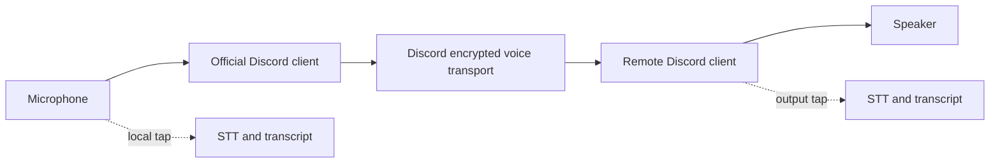
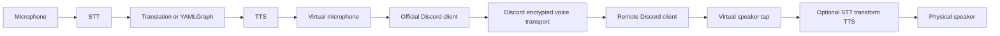
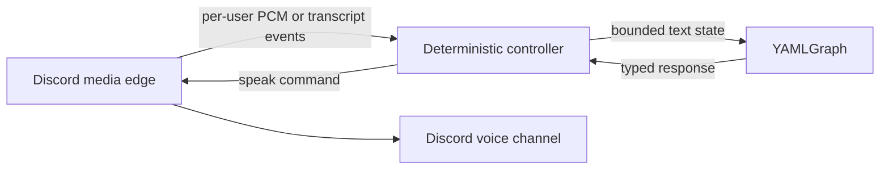

# Discord, Voice Runtime, and YAMLGraph Opportunities

**Date:** 2026-08-17
**Scope:** Discord chat, Discord voice channels, `voice_runtime`, YAMLGraph,
multilingual speech, translation, and transliteration
**Verdict:** Use Discord as the audio transport through its official client.
Keep transcription, translation, transliteration, and optional voice synthesis
in endpoint sidecars around the microphone and speaker paths.

## Executive Finding

There are three different opportunities, with different confidence levels:

1. **Discord chat invoking YAMLGraph is proven.** FR-812 exercised the complete
   interaction -> async graph -> Discord response path against a live guild.
2. **Discord controlling PSTN calls is architecturally credible.** The planned
   Call Hub can keep Discord outside telephony, speech, and FSM ownership.
3. **An endpoint audio sidecar is the lowest-risk voice path.** The official
  Discord client still transfers audio. Local processing either taps the
  microphone/speaker streams for captions or transforms speech before it enters
  Discord and after it leaves Discord.
4. **A direct Discord voicebot is feasible but not a `voice_runtime` transport
   plug-in today.** Discord media is 48 kHz stereo Opus over encrypted RTP/UDP,
   while the runtime's executable audio contract is 8 kHz mono G.711 mu-law and
   Twilio mark echoes. The reusable asset is the runtime's learned behavior,
   not its current frame queues.

The best next experiment is a sidecar connected to virtual microphone and
speaker devices around the official Discord client. Discord owns DAVE, Opus,
RTP, identity, and network transport. The sidecar owns STT and optional
translation/TTS. A bot media-edge spike is justified only if processing must
occur centrally without endpoint software.

## Evidence Read

### Repository evidence

- `examples/discord_bot/` proves guild-scoped slash commands, immediate
  `defer()`, bounded `run_graph_async()`, independent overlapping calls, and
  correlated error replies. It does not exercise Discord voice.
- `docs/plan-chat-initiated-outbound-calls.md` already defines the stronger
  control boundary: Discord adapter -> Call Hub -> FSM -> voice bridge. That is
  the correct PSTN direction.
- `projects/voice_runtime/voice_runtime/session.py` hard-codes 160-byte frames,
  meaning 20 ms of 8 kHz mu-law audio. Its completion primitive is a Twilio-like
  mark sent through the transport and echoed back.
- ElevenLabs and Azure STT providers explicitly accept mu-law at 8 kHz. Both TTS
  providers explicitly request mu-law at 8 kHz. Codec policy therefore lives
  in the providers and session, not only in `transports/twilio_*`.
- `projects/voice_runtime/README.md` claims a generic `create_transport()`
  factory, but no such function exists. The documentation also calls the
  runtime provider-agnostic while documenting G.711 as its sole audio codec.
- FR-359 approved a Pipecat `YAMLGraphProcessor`, but the proposed demo does not
  exist. FR-803 later found that Pipecat media/workers compose with YAMLGraph,
  while Pipecat Flows does not replace the deterministic FSM.
- Current Pipecat source lists Daily, LiveKit, local, SmallWebRTC, WebSocket,
  WhatsApp, and other transports, but no Discord transport.

### Current external evidence

- Discord's voice documentation requires Voice Gateway v8 and describes
  48 kHz stereo Opus, RTP/UDP, SSRC-based senders, transport encryption, and
  the DAVE end-to-end encryption protocol. Discord states that only E2EE voice
  is supported from 2026-03-01.
- `discord.py` 2.7.0 added DAVE support; 2.7.1 fails loudly if its DAVE
  dependency is absent. Its public voice API supports sending/playback, not
  receiving users' audio.
- `discord-ext-voice-recv` provides per-user Opus/PCM sinks, speaking events,
  and SSRC mapping, but its latest PyPI release is an alpha prerelease from
  2025-06-18. It warns that stability is not guaranteed. Its published material
  does not establish compatibility with `discord.py` 2.7 DAVE sessions.
- `@discordjs/voice` 0.19.2 exposes `VoiceReceiver`, per-user receive streams,
  DAVE sessions, Opus processing, and active releases. It still warns that
  receiving audio is not a documented Discord API guarantee.
- Unicode ICU defines transliteration as script conversion, not translation.
  It provides standardized, deterministic transforms and explicitly warns that
  inverse transforms are not always exact and transliteration is not always a
  pronunciation guide.
- Discord's developer terms require a clear privacy policy, purpose-limited
  processing, deletion mechanisms, encryption at rest, and compliance with
  GDPR/ePrivacy. The developer policy requires explicit permission before
  initiating a process on a user's behalf. A visible bot presence alone is not
  sufficient consent to transcribe or retain speech.

## Boundary Diagnosis

The current architecture has four planes:

| Plane | Current owner | Discord opportunity |
|---|---|---|
| Presentation | `discord.py` PoC | Commands, threads, buttons, consent, transcript display |
| Deterministic control | statemachine-engine / Call Hub | Session lifecycle, authorization, barge-in, failure and timeout routing |
| Stochastic reasoning | YAMLGraph | Typed intent, retrieval, questionnaire logic, response generation |
| Media | Twilio-specific `voice_runtime` | Discord DAVE, Opus, per-user streams, VAD, playback |

The planes should remain separate. Discord voice should not import YAMLGraph,
and YAMLGraph should never process audio frames. The media edge should emit
validated text and lifecycle events; the deterministic controller decides when
to invoke a graph and whether its result may be spoken.

### Why direct `voice_runtime` extension is the wrong first move

A nominal `discord_voice.py` transport would still need to compensate for:

- 48 kHz stereo PCM/Opus versus 8 kHz mono mu-law;
- Discord playback completion versus Twilio mark echo;
- multiple SSRC/user streams versus one caller queue;
- UDP, DAVE, and reconnect semantics versus inbound Media Streams WebSocket;
- Discord speaking/VAD events versus the runtime's echo-discard assumptions;
- TTS providers that currently synthesize directly into Twilio's codec.

Putting all conversions in the Discord transport would make the transport own
provider policy and session semantics. Generalizing the runtime first would be
a speculative refactor with no proven second media consumer.

## Approach Comparison: Operator Voice + Discord + PSTN

Five architectures were considered for combining operator voice, Discord, and
PSTN bridging. Evaluated 2026-08-17 after reviewing voice_runtime internals
(AudioMixer already provides speaker output via ffplay).

### A. Discord Chat Only + Text/Macro TTS (Primary Plan)

Discord = commands + transcripts. No operator voice. All speech is synthesized.

| Pros | Cons |
|------|------|
| Simplest implementation — no audio on operator side | Operator can never speak naturally to caller |
| No echo, no mic, no codec bridging | Synthetic-only speech limits rapport |
| Discord needs zero special permissions | Latency on every response (TTS synthesis) |
| Proven seam (FR-812) | Cannot handle emotional/urgent moments fluidly |
| Clean audit — every word is text before speech | Remote party always hears a robot |

### B. Discord Voice Channel as Operator Line

Discord = commands + transcripts + operator voice via Discord voice channel.
Bridge transcodes Discord Opus → Twilio µ-law.

| Pros | Cons |
|------|------|
| Single app for operator (chat + voice in Discord) | Double transcode: 48 kHz Opus → PCM → 8 kHz µ-law |
| Familiar UX — operators already know Discord voice | Discord echo cancellation not tuned for PSTN bridge |
| Discord handles mic/speaker device selection | Discord relay servers add latency hop |
| No custom audio code on operator machine | No Twilio mark equivalent — playback completion is guesswork |
| Works on any platform Discord supports | Discord owns audio mixing — limited control over what enters PSTN |
| | discord.py voice receive less battle-tested + DAVE complexity |
| | Two audio owners (Discord + voice_runtime) — split responsibility |

### C. voice_runtime Computer Audio Transport

Discord = chat only. voice_runtime owns all audio: operator mic → bridge,
bridge → operator speaker. Same process as Twilio transport.

| Pros | Cons |
|------|------|
| One audio owner — voice_runtime controls everything | Requires audio software on operator machine |
| Speaker output already exists (AudioMixer → ffplay) | Platform-specific audio device handling (Core Audio/WASAPI/ALSA) |
| Direct PCM ↔ µ-law — single transcode, same as Twilio today | Operator needs two "apps" (Discord for chat, runtime for audio) |
| Echo suppression already battle-tested in production | New transport to build (computer_audio.py) |
| Mark/completion model works unchanged | Device selection/configuration adds setup complexity |
| Lowest latency — local process, no relay | Not portable to mobile (desktop only) |
| FSM controls exactly what enters PSTN stream | |
| Clean boundary: Discord never touches audio | |
| Proven mixing (caller + agent deques in AudioMixer) | |
| WAV recording built in | |

### D. Endpoint Audio Sidecar Around Discord Client

Discord = chat + voice transport (official client carries audio). Sidecar taps
mic/speaker around the Discord client via virtual audio devices. No bot voice
connection.

| Pros | Cons |
|------|------|
| Discord handles all encrypted voice transport | Requires virtual audio devices (BlackHole/Loopback) |
| No Discord bot voice token or DAVE needed | Extra indirection (physical → virtual → Discord → virtual → physical) |
| Sidecar processes only endpoint PCM — simpler than transport | Only works on desktop with virtual device support |
| Could serve non-PSTN use cases (Discord↔Discord translation) | Not useful for PSTN bridging — Discord carries audio to another Discord user, not to Twilio |
| Official client handles reconnect, identity, encryption | Sidecar failure can cause silent audio loss |
| | Transform mode adds STT→TTS latency before Discord even transmits |

### E. Bot-Managed Discord Media Edge (Direct Voicebot)

Bot joins Discord voice channel directly via `@discordjs/voice`. Receives user
audio, runs STT/LLM/TTS, plays back. No PSTN.

| Pros | Cons |
|------|------|
| Centralized — no endpoint software needed | discord.py receive is immature; @discordjs/voice requires Node.js |
| Works for any guild member without setup | DAVE E2EE mandatory — complex implementation |
| Natural for Discord-native voicebot (no phone) | 48 kHz stereo Opus ≠ voice_runtime's 8 kHz µ-law — major codec gap |
| Multi-user potential (per-SSRC streams) | Receiving audio not a documented Discord API guarantee |
| | Multi-speaker handling unsolved (current FSM assumes one) |
| | Playback completion has no mark equivalent |
| | Speculative refactor of voice_runtime with no proven second consumer |

### Summary Matrix

| Approach | Operator voice? | PSTN? | Complexity | Audio owner | First proof distance |
|----------|----------------|-------|------------|-------------|---------------------|
| **A. Chat only** | ❌ | ✅ | Low | voice_runtime (TTS only) | Nearest |
| **B. Discord voice** | ✅ | ✅ | Medium-high | Split (Discord + runtime) | Medium |
| **C. Runtime computer audio** | ✅ | ✅ | Medium | voice_runtime (unified) | Medium (speaker exists) |
| **D. Endpoint sidecar** | ✅ | ❌ (Discord↔Discord) | Medium | Sidecar + Discord | Far for PSTN use |
| **E. Bot media edge** | ❌ (bot speaks) | ❌ (Discord only) | High | Bot + runtime | Furthest |

### Recommendation

**Start A → graduate to C.** Ship the text-only plan (A) first — it proves
the Call Hub, FSM, and Discord adapter with zero audio complexity. Then add
mic input to voice_runtime (C) as the operator voice path, since speaker
output already works via AudioMixer. Skip B (Discord voice) — it splits audio
ownership and adds a transcode hop for no gain over C. D and E serve different
products (Discord-native voice, not PSTN bridging).

## Ranked Opportunities

| Rank | Opportunity | Value | Evidence | Decision |
|---|---|---|---|---|
| 1 | Discord-controlled outbound PSTN call | High | Architecture planned; chat seam and telephony runtime separately proven | **Proceed through the Call Hub phases** |
| 2 | Discord workflow bot for bounded graphs | High | Live FR-812 proof | **Extend by named workflows, not generic `/run`** |
| 3 | Endpoint audio sidecar around Discord | High | Official client already solves encrypted audio transfer | **Preferred voice proof** |
| 4 | Live transcript plus typed Discord controls | High operational value | Reuses Call Hub events and Discord threads | **Build after mock call isolation** |
| 5 | One-user direct Discord voicebot | High learning value | Ecosystem supports it, but receive stability is uncertain | **Spike only for shared channel audio** |
| 6 | Multilingual voice workflow | Medium/high | STT/TTS providers already expose language selection | **Model language as session policy** |
| 7 | Transliteration and pronunciation normalization | Medium/niche | ICU provides deterministic transforms | **Add only for a named language/script pair** |
| 8 | Multi-user meeting assistant | Potentially high, high risk | Discord exposes per-user streams; runtime assumes one speaker | **Defer until one-user voice is stable** |
| 9 | Generic Discord graph runner | Broad but unsafe | No authorization or output policy contract | **Reject** |
| 10 | Generic media rewrite of `voice_runtime` | Unclear | No second proven consumer yet | **Reject for now** |

## Product Opportunities

### 1. Chat-controlled PSTN operator console

This is the nearest product rather than a technology demo. Discord supplies the
operator surface while the existing runtime keeps doing telephony. YAMLGraph is
optional for the first proof because the operator authors every spoken word.
Later graph uses can include typed call summaries, disposition coding, and
approved response suggestions, never command routing.

First event: an authorized operator starts one allowlisted call, reads final
transcripts, sends one utterance exactly once, and hangs up from the bound
thread.

### 2. Named Discord workflow library

FR-812 proved one graph. The useful extension is a small catalog of explicitly
authorized workflows such as `/triage-demo`, `/summarize-thread`, or
`/prepare-call`, each with its own input and output adapter. A generic graph
runner would expose arbitrary tools, prompts, and state through Discord and
would erase the safety value of the presentation boundary.

### 3. Endpoint audio sidecar

Discord remains the audio transfer. External processing sits around the
official client rather than replacing the voice network.

For captions, transcription is a parallel tap and does not alter audio:

For an interpreter or voice transformation, each endpoint processes audio in
series through virtual devices:

The official clients handle DAVE, Opus, RTP, jitter, reconnect, and channel
identity. The sidecar handles only endpoint PCM and text transformations. It
uses OS audio routing or virtual devices, not Discord bot tokens or user-account
automation.

The serial mode adds an STT -> transform -> TTS delay before Discord transmits
speech. It also replaces prosody and may degrade natural turn-taking. The first
proof should therefore be the passive caption tap; translated speech is a
second proof with measured latency.

#### Feasibility sanity check

**Verdict: feasible on desktop, conditional for transformed speech.** Nothing
in the design requires access to Discord's decrypted packets. The official
client selects ordinary Core Audio input/output devices and remains responsible
for the encrypted voice session.

| Path | Feasible | Mechanism | Main limitation |
|---|---|---|---|
| Microphone -> Discord plus local STT tap | Yes | Discord and sidecar read the physical input concurrently | Consent and endpoint identity |
| Discord output -> speaker plus local STT tap | Yes | ScreenCaptureKit app-audio capture or Loopback monitoring | Screen Recording permission or commercial dependency |
| STT/transform/TTS -> Discord | Yes | Sidecar writes PCM to a virtual input selected as Discord's microphone | Added turn latency; synthesized audio is attributed to the user |
| Discord output -> transform -> speaker | Yes | Discord outputs to a virtual device; sidecar forwards processed audio to the physical device | Sidecar failure causes silence unless bypass is explicit |
| Transparent full-duplex interpretation | Not yet proven | Streaming STT, incremental transform, and streaming TTS | Corrections, echo, overlapping speakers, and cumulative latency |
| Mobile Discord endpoint | No current path | Desktop virtual-device architecture does not transfer to iOS/Android | Requires a different platform integration |

On the inspected Mac (macOS 26.3.1), the built-in microphone, speakers, iPhone
microphone, and USB device all operate at 48 kHz, matching Discord's native
rate and avoiding mandatory endpoint resampling. No general virtual loopback
device is currently registered. `ParrotAudioPlugin.driver` is installed but is
not exposed by `system_profiler` as a selectable input/output. Transformed-speech
testing therefore requires BlackHole, Loopback, or an equivalent signed Core
Audio device; passive capture can begin without it.

Operational constraints:

- Use headphones for the first proof. With speakers, remote audio can re-enter
  the physical microphone before STT, and Discord's echo canceller may not
  compensate correctly for sidecar and virtual-device delay.
- Prefer push-to-talk or explicit turn commit for translated speech. Final STT,
  transformation, and TTS startup produce human-visible delay; speaking from
  partial transcripts risks corrections after audio has already been sent.
- Disable or separately test Discord noise suppression, automatic gain control,
  and voice-activity gating. They may alter synthesized speech or clip its
  beginning; push-to-talk provides the clearest first witness.
- Configure all aggregate or multi-output devices at 48 kHz, select one clock
  source, and enable drift correction on the others. Otherwise long sessions
  can develop glitches.
- Preserve a direct bypass. Passive mode must leave Discord audio unchanged;
  transform mode must visibly fail rather than silently routing to a dead
  virtual device.
- This is endpoint-assisted speech under the logged-in user's Discord identity,
  not an autonomous Discord bot identity. A named bot speaker still requires a
  bot-managed voice connection.
- Transcription and recording require explicit participant disclosure,
  purpose-limited retention, and deletion controls regardless of where STT
  executes.

### 4. Direct Discord voicebot

A private channel voicebot can run the same two-plane pattern as
ninchat_voice:

The first proof should be half-duplex and one-user-only. Multi-user mixing,
speaker arbitration, and meeting summarization are separate products, not
acceptance criteria for the transport.

### 5. Multilingual interpreter or accessibility bot

This opportunity has three distinct transforms:

1. **Translation:** preserve meaning across languages, for example Finnish
   speech -> English text/speech. This belongs in a typed graph step or a
   dedicated translation provider.
2. **Transliteration:** preserve written form across scripts, for example
   Cyrillic -> Latin. Use ICU/CLDR rules, retain the original text, and record
   the transform ID. Do not ask an LLM to silently rewrite names.
3. **Pronunciation preparation:** generate text or phonemes suitable for a TTS
   voice. This is provider- and language-specific and is not equivalent to
   transliteration.

The best first transliteration consumer is transcript display or cross-script
search, not TTS. TTS should normally receive the original language and script
with the correct language/voice setting. Romanizing text before TTS often makes
pronunciation worse.

## Recommended Architecture

### Endpoint audio sidecar (preferred)

Start with one local process that can read the selected microphone and Discord
output device. In passive mode it forwards no audio and publishes only final
transcripts. In transform mode it emits synthesized PCM to a virtual microphone
selected by Discord and reads Discord output through a virtual speaker device
before forwarding it to the physical speaker.

Discord is authoritative for voice-channel membership and audio delivery. A
separate Hub is authoritative only for transcript sequencing, transformation
jobs, YAMLGraph execution, and audit. Discord text threads may project the
transcripts but are not required for audio to flow.

Required invariants:

- no Discord bot token reaches the sidecar; it relies on the logged-in official
  client for audio transport;
- provider secrets remain local or in an authenticated transformation service;
- one sidecar instance maps to one endpoint and selected input/output device;
- passive mode never delays, suppresses, or replaces Discord audio;
- duplicate utterance IDs cannot repeat transformation or synthesized speech;
- stale transformed responses are generation-gated before the virtual mic;
- source transcript, transformed text, and spoken text remain distinct audit
  fields;
- sidecar failure restores or clearly exposes the direct microphone/speaker
  path rather than creating silent audio loss.

The first proof uses the real Discord audio path and synthetic audio fixtures:
one endpoint sends a fixture through Discord, the receiving sidecar produces
one final transcript, and direct speaker playback remains audible. No graph or
TTS is needed.

### Direct Discord media edge (conditional)

For the experimental voice path, prefer a separate TypeScript service using
`@discordjs/voice` because it currently has the strongest evidenced combination
of receive streams and DAVE support. Keep the existing Python `discord.py` bot
for chat commands if desired; both can share one application or communicate
through a narrow internal session API.

The edge owns:

- Discord gateway and voice connection lifecycle;
- DAVE, RTP, Opus, UDP, SSRC/user mapping, and reconnect;
- decode/encode and playback completion;
- channel permission checks and visible consent state;
- raw media buffers, which should be ephemeral by default.

The Python boundary validates events such as:

- `session.started`, `session.ended`, `session.failed`;
- `participant.joined`, `participant.left`, `participant.speaking`;
- `transcript.partial`, `transcript.final`;
- `speech.started`, `speech.completed`, `speech.interrupted`.

Do not send audio as JSON/base64. If Python must own STT/TTS, use a binary media
channel with an explicit `AudioFormat` contract. Otherwise, let the media edge
or Pipecat own STT/TTS and exchange only text and lifecycle events.

### `voice_runtime` disposition

Keep the existing runtime focused on telephony until another transport is
proven. The first useful extraction after a Discord voice spike would be a
small media-neutral contract, not a codec-general rewrite:

- session identity and lifecycle events;
- transcript callbacks;
- speak, interrupt, and disconnect intents;
- playback completion and provider failure events.

Twilio marks and mu-law frames should remain in the telephony implementation.
If both transports then implement the same behavioral contract, rename or split
the package in a judged FR. Until then, describe it honestly as a telephony
voice runtime.

### YAMLGraph disposition

YAMLGraph should own only bounded reasoning where its strengths bind:

- typed intent and response schemas;
- retrieval and tool use;
- language/session policy decisions;
- structured summaries and audit records;
- graph version and route evidence attached to each spoken response.

It should not own VAD, packet timing, codec conversion, speaker arbitration,
barge-in dispatch, or safety-critical session transitions.

## Gated Proof Sequence

1. **Passive endpoint tap:** send a synthetic audio fixture through two official
  Discord clients. The receiving endpoint plays it normally and emits one final
  transcript from its output tap.
2. **Bidirectional captions:** tap microphone and speaker paths without delaying
  either. Correlate transcripts to endpoint/session identity and display them
  in a Discord thread or companion UI.
3. **Endpoint isolation and recovery:** two sidecars cannot cross transcripts;
  sidecar restart does not disconnect Discord or leave the audio route silent.
4. **Translated speech loop:** STT -> one named transform -> TTS -> virtual mic
  reaches the remote Discord speaker exactly once. Measure added latency and
  preserve source/transformed/spoken artifacts.
5. **YAMLGraph reasoning:** add one bounded graph only if the transform requires
  reasoning beyond deterministic translation or transliteration.
6. **Product decision:** stop here unless centralized operation without endpoint
  software has a named consumer.
7. **Bot media feasibility, if required:** join a private voice channel, play a fixed local Opus
   fixture, receive one consenting user's stream, and write only frame counts
   plus format metadata. No STT, TTS, LLM, or retention.
8. **DAVE/reconnect witness:** repeat across disconnect/resume and prove the
   selected library handles mandatory E2EE. Pin exact package versions and raw
   logs.
9. **One-user mock Discord-media loop:** fake STT consumes decoded frames; fake TTS
   returns deterministic audio. Assert user/SSRC isolation and playback
   completion.
10. **Live Discord-media STT/TTS:** add one provider at a time. Measure raw timestamps before
   defining latency objectives.
11. **Bot-side YAMLGraph reasoning:** insert one bounded graph between final transcript
   and speak command with generation gating so stale graph output is never
   spoken.
12. **Language transform:** add one named translation or ICU transliteration
   pair, preserving source text and transform provenance.
13. **Multi-user decision:** only after the one-user path is reused. Choose
   explicit speaker selection or per-user sessions; do not silently mix.

## Kill Criteria

Stop or change direction if any of these holds:

- the receive library cannot prove DAVE operation under current Discord voice;
- sender identity cannot remain stable across reconnect and SSRC remapping;
- playback completion cannot be observed without timing guesses;
- consent and deletion cannot be made explicit and testable;
- the first product requires arbitrary public guilds rather than one controlled
  private channel;
- generalizing `voice_runtime` requires Discord-specific conditionals in its
  telephony session or Twilio-specific behavior in a generic interface;
- raw measurements show graph latency dominates the conversational experience
  and acknowledgment/generation gating cannot hide it.

## Keep, Build, Retire

### Keep

- FR-812's defer/follow-up and pure-adapter pattern;
- the Call Hub command/event/idempotency model;
- deterministic FSM ownership of real-time session transitions;
- `voice_runtime`'s incident knowledge: interruption, echo handling, failure
  escalation, isolation, and teardown.

### Build

- the contract-only Call Hub slice already planned;
- one passive endpoint sidecar around official Discord audio;
- a Pydantic session/event boundary into Python;
- one serial STT/transform/TTS virtual-microphone proof after passive taps work;
- one bounded YAMLGraph transform only if deterministic language tools do not
  suffice;
- one bot media-edge feasibility spike only if centralized operation without
  endpoint software has a named consumer;
- explicit consent, retention, deletion, and provider-egress records.

### Retire or correct

- the claim that `voice_runtime` already has a generic transport factory;
- the assumption that adding `discord_voice.py` is sufficient;
- FR-359 implementation expectations unless a current consumer is named;
- the missing `docs/plan-discord-yamlgraph-poc.md` citation or the absent file;
- transliteration examples that imply it is translation or a universal TTS
  pronunciation solution.

## Final Recommendation

The opportunity is real, but it is not one combined framework feature.

- Ship chat-controlled PSTN first because its boundaries are already understood.
- Keep audio transfer in the official Discord clients and prove passive endpoint
  transcription first.
- Add virtual-device STT/transform/TTS only after measuring the direct audio
  path; Discord still carries the resulting audio.
- Explore a bot-managed DAVE media edge only when endpoint software is
  unacceptable.
- Reuse behavior and contracts from `voice_runtime`, not its 8 kHz frame model.
- Use YAMLGraph as a governed reasoning processor after final transcripts, not
  as the voice runtime.
- Treat translation, transliteration, and pronunciation as three explicit,
  provenance-carrying transforms.

**Heuristic:** A second transport earns a shared runtime only after both
transports independently prove the same behavioral contract; codec similarity
is not the contract.

**Seed:** If the Discord media edge proves stable, is the durable shared product
a `voice_runtime` package, or a governed session protocol that lets Twilio,
Discord, Pipecat, and future transports remain independently replaceable?

## Sources

- Discord Voice Connections:
  <https://docs.discord.com/developers/topics/voice-connections>
- Discord Developer Policy:
  <https://support-dev.discord.com/hc/articles/8563934450327-Discord-Developer-Policy>
- Discord Developer Terms of Service:
  <https://support-dev.discord.com/hc/articles/8562894815383-Discord-Developer-Terms-of-Service>
- discord.py changelog:
  <https://discordpy.readthedocs.io/en/latest/whats_new.html>
- discord-ext-voice-recv:
  <https://pypi.org/project/discord-ext-voice-recv/>
- @discordjs/voice:
  <https://discord.js.org/docs/packages/voice/main>
- Pipecat transports:
  <https://github.com/pipecat-ai/pipecat/tree/main/src/pipecat/transports>
- Unicode ICU transforms:
  <https://unicode-org.github.io/icu/userguide/transforms/general/>
- Unicode LDML transforms:
  <https://www.unicode.org/reports/tr35/tr35-general.html#Transforms>
