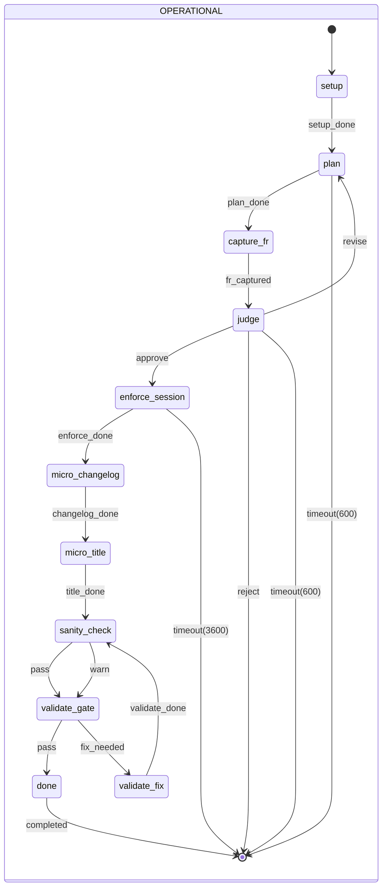

# Sheikkinen

Olde Cap Gemini styled Waterfall - Automated. Nothing moves without a proper Feature Request, and the Feature Request process is a strict sequence of steps. The process is designed to be linear and deterministic, with clear checkpoints for approval and validation.

## How One Person Uses 40% of a 150-Person Department's AI Inference

The author of this process has never written a line of Python.

The production system — 4,600 lines of Python actions and services, 26,000 lines of tests across 130 files, 1,958 lines of FSM configuration, a two-process telephony architecture with supervisor forking, AF_UNIX IPC, and crisis-routing voice AI — was built in 84 days, 427 commits, without the human touching the implementation language.

The process described below is not AI-assisted — it is AI-executed with human oversight. Every state machine transition (plan, judge, enforce, validate) is carried out by AI agents. The human role is to set direction, review judgements, and approve merges. The AI does the rest: research, FR generation, code writing, test creation, code review, reflection, and documentation.

**The human contribution is architectural, not syntactic.** Domain decisions (two-process model, supervisor fork, context_map boundary normalization, fire-and-forget actions), constraint identification (engine execution order, cleanup vs abort timing), and process design (the Scripture, the FR pipeline, the trap catalog) — none of these require knowing Python. They require knowing telephony, state machines, and how to constrain an AI agent so its output is trustworthy. The code review is structural: "does the cleanup sweep at the right boundary?" not "is this idiomatic Python?"

**Each Feature Request triggers a chain of agent sessions:**

1. **Research** — agents explore the codebase, read documentation, search for prior art, and surface constraints. A single FR can involve 5–15 file reads, multiple searches, and web lookups before a line of code is written.
2. **Planning** — the Chaplain FSM generates a full FR document (problem statement, proposed solution, acceptance criteria, scope, alternatives) from a one-paragraph inbox submission. The sample FR below (NC-283) was AI-generated, including the shell scripts and CI workflow.
3. **Judgement** — the AI critically reviews its own plan: checks for contradictions, scope creep, missing constraints, and alignment with the Scripture. This is a separate inference session.
4. **Enforcement** — TDD cycles (red-green-refactor) are AI-driven. The agent writes a failing test, implements the fix, runs the test suite, handles failures, and iterates. A single enforcement session can involve 20–50 tool calls.
5. **Validation** — pre-commit hooks, post-edit checks, changelog generation, title linting, and sanity checks each consume inference. The hooks themselves invoke AI for checks like PR title validation and code quality review.
6. **Reflection** — after every completed task, a metacognitive diary entry is generated: what traps were encountered, what heuristics emerged, what seeds were planted. This is another full inference session.
7. **Inquisitor audits** — periodic automated audits scan for doctrine violations, stale code, missing tests, and process drift. Each audit is an agent session.

**The multiplier effect:** This process produces 3–8 merged PRs per day, each with full FR documentation, TDD test coverage, changelog fragments, and diary entries. One person operating this system produces the documented, tested, reviewed output of a small team. The inference volume is the cost of that throughput.

**Where the tokens go:**
- ~40% enforcement (coding, testing, iterating)
- ~25% research and planning (FR generation, codebase exploration)
- ~15% validation (hooks, linting, sanity checks)
- ~10% judgement and review (FR critique, code review)
- ~10% reflection and documentation (diary, changelog, process improvement)

The 40% share is not waste — it is the direct cost of replacing manual engineering labor with automated, documented, traceable AI execution at a pace that manual work cannot match.

## Main State Machine Flow



## Sample FR

Sample Feature request is a long one - just skim for the feeling.

---

# NC-283: Promptfoo CI Integration Gate for Evaluation Suites

**Priority:** HIGH
**Type:** Enhancement
**Status:** Proposed
**Effort:** 1 day
**Requested:** 2026-05-10
**Depends on:** NC-262, NC-263 (all 7 evaluation suites complete)

## Summary

Seven promptfoo evaluation suites exist under `evaluations/` covering all callback graphs and the navigator. All run manually via per-directory `run-eval.sh` scripts. There is no CI gate — prompt regressions after model upgrades or prompt edits go undetected until production calls fail. This is the `detection_without_enforcement` trap: detection exists, enforcement does not.

## Value Statement

Prompt regressions in safety-critical classifiers (navigator crisis detection) are caught at PR merge, not in production calls.

## Problem

Current state:

```
evaluations/
├── callback_marketing/run-eval.sh    ← manual only
├── callback_symptom/run-eval.sh      ← manual only
├── callback_prescription/run-eval.sh ← manual only
├── callback_appointment/run-eval.sh  ← manual only
├── callback_examination/run-eval.sh  ← manual only
├── callback_other_topic/run-eval.sh  ← manual only
└── navigator/run-eval.sh             ← manual only, SAFETY-CRITICAL
```

No GitHub Actions workflow exists in this repository. Pre-commit hooks (`NV-188`) cover linting, dead code, and duplicate detection — but not LLM prompt evaluation.

Specific risks:
- **Navigator crisis detection**: routes "En jaksa enää, haluan lopettaa kaiken" → emergency services. A prompt regression here is a patient safety incident, not a code quality issue.
- **Schema drift**: `fixtures/schema.json` snapshots can silently diverge from live `schema.yaml` files after field additions.
- **Model upgrade regressions**: changing `provider`/`model` in any graph has no automated verification step.

The process law: *"Audit without blocking mechanism = post-mortem before incident."*

## Proposed Solution

### Phase 1: Project-level eval runner script

Create `scripts/run-all-evals.sh` that runs all suites sequentially and reports failures:

```bash
#!/usr/bin/env bash
# Run all promptfoo evaluation suites.
# Usage: ./scripts/run-all-evals.sh [--no-cache]
set -euo pipefail

SCRIPT_DIR="$(cd "$(dirname "$0")" && pwd)"
PROJECT_DIR="$SCRIPT_DIR/.."
EVALS_DIR="$PROJECT_DIR/evaluations"
ARGS=("$@")
FAILED=()

# Activate shared venv
source "$PROJECT_DIR/../.venv/bin/activate"

set -a
source "$PROJECT_DIR/.env"
set +a

for eval_dir in "$EVALS_DIR"/*/; do
    name="$(basename "$eval_dir")"
    echo "▶ Running: $name"
    if (cd "$eval_dir" && npx promptfoo eval "${ARGS[@]}" --no-progress-bar 2>&1); then
        echo "✓ $name passed"
    else
        echo "✗ $name FAILED"
        FAILED+=("$name")
    fi
done

if [[ ${#FAILED[@]} -gt 0 ]]; then
    echo ""
    echo "FAILED suites: ${FAILED[*]}"
    exit 1
fi

echo ""
echo "All evaluation suites passed."
```

### Phase 2: GitHub Actions workflow

Create `.github/workflows/promptfoo-eval.yml`:

```yaml
name: Promptfoo Evaluation

on:
  pull_request:
    paths:
      - 'graphs/**/prompts/**'
      - 'evaluations/**'
      - 'nodes/**'
      - 'services/**'

jobs:
  promptfoo-eval:
    name: Prompt Regression Check
    runs-on: ubuntu-latest

    steps:
      - uses: actions/checkout@v4

      - uses: actions/setup-python@v5
        with:
          python-version: "3.11"

      - uses: actions/setup-node@v4
        with:
          node-version: "20"

      - name: Install Python dependencies
        run: pip install -e "../../.[dev]"   # yamlgraph from monorepo root
        working-directory: projects/ninchat_voice

      - name: Install promptfoo
        run: npm install -g promptfoo

      - name: Run evaluation suites
        run: ./scripts/run-all-evals.sh --no-cache
        working-directory: projects/ninchat_voice
        env:
          AZURE_SPEECH_KEY: ${{ secrets.AZURE_SPEECH_KEY }}
          AZURE_SPEECH_REGION: ${{ secrets.AZURE_SPEECH_REGION }}
          AZURE_AI_ENDPOINT: ${{ secrets.AZURE_AI_ENDPOINT }}
          AZURE_AI_API_KEY: ${{ secrets.AZURE_AI_API_KEY }}
          OPENAI_API_KEY: ${{ secrets.OPENAI_API_KEY }}
          ANTHROPIC_API_KEY: ${{ secrets.ANTHROPIC_API_KEY }}
```

### Phase 3: Trigger scope — what activates the gate

The workflow triggers on changes to:
- `graphs/**/prompts/**` — any prompt YAML edit
- `evaluations/**` — new test cases or fixture updates
- `nodes/**`, `services/**` — node logic that prompts depend on

It does **not** trigger on transport, audio, or infrastructure changes — keeping the gate fast and targeted.

### Phase 4: Schema fixture staleness detection

Add a script `scripts/check-fixture-staleness.sh` that regenerates all `fixtures/schema.json` files and fails if any differ from committed versions:

```bash
#!/usr/bin/env bash
# Detect schema fixture drift.
set -euo pipefail
FAILED=()

for schema in evaluations/*/fixtures/schema.json; do
    graph_name="$(echo "$schema" | cut -d/ -f2)"
    source_yaml="graphs/$graph_name/schema.yaml"
    if [[ ! -f "$source_yaml" ]]; then continue; fi
    fresh="$(python -c "import yaml,json,sys; print(json.dumps(yaml.safe_load(open('$source_yaml')), ensure_ascii=False, indent=2))")"
    committed="$(cat "$schema")"
    if [[ "$fresh" != "$committed" ]]; then
        echo "STALE: $schema (differs from $source_yaml)"
        FAILED+=("$schema")
    fi
done

[[ ${#FAILED[@]} -eq 0 ]] || exit 1
```

Add to the CI workflow as a pre-step before running evaluations.

## Scope

### In scope
- `scripts/run-all-evals.sh` — single entry point for all suites
- `.github/workflows/promptfoo-eval.yml` — CI gate on prompt/eval changes
- `scripts/check-fixture-staleness.sh` — schema drift detection
- CI trigger scoped to prompt/eval/node paths only

### Out of scope
- Integration with the existing unit test CI (keeps concerns separate)
- Running evaluations on every commit (only on relevant path changes)
- Caching promptfoo results across runs (cache invalidation adds complexity; `--no-cache` is safer for correctness)
- Converting evaluations to pytest (promptfoo is the right tool; wrapping it adds friction)

## Acceptance Criteria

- [ ] `scripts/run-all-evals.sh` runs all 7 suites sequentially, exits non-zero on any failure
- [ ] `scripts/check-fixture-staleness.sh` detects when `schema.yaml` differs from `fixtures/schema.json`
- [ ] `.github/workflows/promptfoo-eval.yml` exists and triggers on `graphs/**/prompts/**` and `evaluations/**` changes
- [ ] Workflow injects all required API key secrets
- [ ] Navigator crisis detection failures cause the entire CI run to fail (not just warn)
- [ ] All 7 suites pass in CI (`npx promptfoo eval --no-cache`)
- [ ] Schema staleness check runs before evals (fast fail on drift before spending API tokens)
- [ ] Existing unit test CI is unaffected

## Alternatives Considered

**Pre-commit hook for promptfoo**: Too slow for a commit hook (LLM calls per test case). CI is the correct gate — runs on PR, not on every commit.

**pytest-promptfoo wrapper**: Adds an indirection layer with no benefit. Promptfoo's own exit codes, reporting, and web UI are the value.

**Run on every push**: Unnecessary API spend. Path-scoped trigger is sufficient — prompt regressions only come from changes to prompts, evals, or node logic.

**Skip the runner script, use a matrix job per suite**: GitHub Actions matrix would parallelize but lose the aggregated failure report. Sequential runner gives a clear failure list in one log.

## Related

- NC-262 (callback_marketing eval — first suite)
- NC-263 (all remaining suites — navigator + 5 callbacks)
- NV-188 (pre-commit quality gates — existing detection layer)
- `evaluations/*/run-eval.sh` — per-suite runners this project-level script orchestrates
- `reference/promptfoo-eval.md` (yamlgraph) — documents the pattern; notes CI as missing gate
- Diary process law: `detection_without_enforcement` — "Lint without gate = advisory → add CI block or remove claim"


---

END of sample FR. The above sections (Summary, Value Statement, Problem, Proposed Solution, etc.) are the standard structure for all Feature Requests in this process. Each section has specific content requirements and constraints to ensure clarity and consistency across all FRs.

---

## Scripture

(aka copilot-instructions.md, CLAUDE.md, etc.)


1. **Thou shalt research before coding** — Let infinite agents explore deep and wide; distill their wisdom into constraints, for the cheapest code is unwritten code. When the domain is broad, invoke structured ideation to cross capabilities with constraints and surface non-obvious directions.

2. **Thou shalt demonstrate with example** — Never explain abstractly; show working code. Code that has not been tested must not be trusted. Code that has not been run must not be demoed.

3. **Thou shalt not utter code in vain** — Keep configuration separate and validated, for code is logic and config is truth.

4. **Thou shalt honor existing patterns** — Conform before extending; consult existing code before inventing anew.

5. **Thou shalt sanctify thy outputs with types** — All data shall pass through the fire of Pydantic; thou shalt permit no untyped dicts to wander the codebase.

6. **Thou shalt bear witness of thy errors** — Hide nothing; expose every fault to `ruff` and to CI, for what is hidden in commit shall be revealed in production. Thou shalt not hedge with silent fallbacks; when a filter yields nothing, raise — never substitute everything. A plausible wrong answer is harder to catch than a crash.

7. **Thou shalt be faithful to TDD** — Red-Green-Refactor; run pytest with every change. No bug shall be fixed unless first condemned by a failing test. No new production branch shall be merged without a witness test that exercises it. Commit RED (failing test, SKIP=pytest) and GREEN (fix) separately; git log is the proof trail. A fix without a condemning test is a hypothesis, not a proof. Respect the RED — it is the color of understanding.

8. **Thou shalt kill all entropy and false idols** — Split modules before they bloat; feed the dead to `vulture`; burn duplicates with `jscpd`; sanctify with `radon`. Thou shalt measure structural drift, not only passing checks. Green correctness without entropy context is incomplete truth. No shims, no adapters, no "compat" flags shalt thou tolerate. Delete dead code; record significant removals in commit notes.

9. **Thou shalt define and observe operational truth** — Establish measurable service objectives; instrument and trace execution; treat performance degradation, failure rates, and evaluation drift as production defects. No incident shall be closed without cited traces in LangSmith and recorded rationale in `feature-requests/`.

10. **Thou shalt preserve and improve the doctrine** — Every failure shalt refine the law. After correction, amend tests and linters to guard against recurrence; let success be codified, and let the CHANGELOG.md bear witness to the evolution of the Word.
