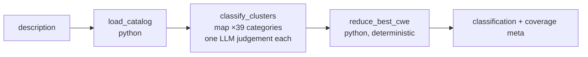

# CWE Vulnerability Classifier (FR-733)

> **Purpose: YAMLGraph demo and research vehicle** — the second,
> proving instance of the
> [Coded-Classification Pattern](../../reference/patterns/coded-classification.md)
> (the first is [icpc-2-rfe](../icpc-2-rfe/README.md)). Classifies
> free-text vulnerability descriptions (CVE submissions, bug reports,
> pentest findings) into CWE weakness codes with quoted evidence —
> analyst assistance for CVE→CWE assignment: it **proposes with an
> audit trail; humans dispose**. Never an autonomous assignment tool,
> never a security-decision tool.

## Architecture



The reducer treats every model output as a **claim**:

| Claim | Reconciliation |
|---|---|
| Evidence span | Aligned to the description: exact → verbatim; interior omission (≥2 blocks, coverage ≥ 0.85, window-capped) → repaired to the true contiguous window restoring elided text; scattered/below-floor → run fails |
| Code | Catalog membership; bare `79` repairs to `CWE-79`; a real catalog row outside view-699 (the model volunteering a famous Discouraged Class) diverts to `meta.off_population_claims`; a nonexistent code → rejected |
| `match` on a MITRE-**Discouraged** code | Demoted to partial (capped, evidence preserved) — primary unreachable |
| `match` on **Allowed-with-Review** | Stays primary-capable, flagged `review: true` |
| `match` on a Class whose ChildOf descendant also matched | Demoted (map to the lowest abstraction — MITRE's own rule) |

## Setup

The catalog is a **generated artifact** (18 MB Tier-1 source, MITRE CWE
— free with attribution; the versioned zip is pinned by sha256,
`cwec_latest` is a moving pointer and is refused):

```bash
curl -L -o tmp/cwec_v4.20.xml.zip https://cwe.mitre.org/data/xml/cwec_v4.20.xml.zip
python examples/cwe-classifier/nodes/build_catalog.py
# ✓ 944 weaknesses, 345 candidates in 39 view-699 clusters (54 Prohibited stripped)
```

The build also pin-checks MITRE's curation counts at two levels
(catalog-wide 58/44/93, in-population 54/5/13 for
Prohibited/Discouraged/Review) — a vocabulary bump that shifts the
curation fails loudly instead of drifting.

## Run

```bash
examples/cwe-classifier/classify.sh examples/cwe-classifier/data/labeled/cve-2024-49038.md
echo "SQL injection in the login form parameter" | examples/cwe-classifier/classify.sh
```

Every run is archived (`logs/cwe-classifier/<name>-<stamp>.result.json`)
for the harness.

## Crosscheck harness (NVD gold labels)

`data/labeled/` holds eleven NVD-labeled CVE fixtures (US-government
public data, provenance-stamped, fetched live 2026-07-15): XSS, OS
command injection, path traversal, OOB read/write, off-by-one vs
OOB-write specificity pair, code injection, two multi-label cases
(Log4Shell, PHP-FPM), one terse near-underdetermined description
(Citrix), and **two fixtures whose NVD gold label is a MITRE
Mapping-Discouraged code** (Drupalgeddon2→CWE-20, Struts→CWE-755).

```bash
python examples/cwe-classifier/nodes/crosscheck.py            # evaluate archives
python examples/cwe-classifier/nodes/crosscheck.py --runs 3   # fresh runs first (slow, keys)
```

NVD labels are analyst opinions, not ground truth. Disagreements
partition mechanically by MITRE's own `Mapping_Notes/Usage`:

- `our_miss` — an Allowed/Review gold code we failed to surface: fails.
- `label_questionable` — a Discouraged/Prohibited gold code we did not
  surface: recorded, never fails alone.
- `gold_unscoreable` — every gold code violates MITRE guidance: our
  primary is reported for the human read. A more specific Allowed code
  than NVD's Discouraged label is a **success narrative, not a miss**.

## Contracts (CAP-204)

| REQ | Contract |
|---|---|
| REQ-YG-557 | Builder: versioned pin + sha256 refusal, Deprecated skip, view-699 multi-membership duplication, build-time Prohibited strip, two-level usage pins |
| REQ-YG-558 | Loader: category clusters, Description-only briefs, actionable absence error |
| REQ-YG-559 | Reducer: span boundary, prefix repair, usage caps, review flag, lowest-abstraction guard both directions |
| REQ-YG-560 | Harness: usage-partitioned NVD-gold scoring, k-of-n agreement, no significance |

See [FR-733](../../feature-requests/FR-733-cwe-classifier-second-instance.md)
for the judgement (candidate population re-measured: 399 view-699
members of 944 live rows, not 944), and the pattern doc for what this
instance forced that ICPC didn't.
