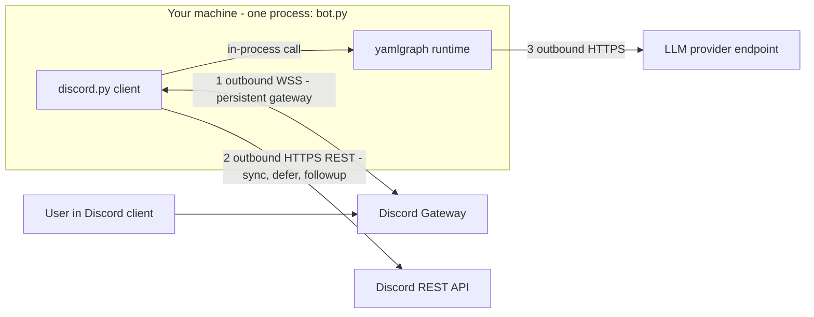

# Discord `/hello` Bot Example

Guild-scoped Discord slash command that executes the unmodified
[hello demo graph](../demos/hello/) and replies with the structured greeting
as an embed. Presentation layer only — deleting this directory leaves
YAMLGraph untouched (FR-812).

```
/hello name:Maija style:playful  →  🌞 Hyvä päivänjatko, Maija! (footer: playful)
```

## Layout

| File | Role |
|------|------|
| `adapter.py` | Pure mapping: options → graph state, greeting result → embed fields, error text. No discord.py import — unit-testable with zero network (`tests/unit/test_discord_hello_adapter.py`) |
| `bot.py` | Gateway client: compiles the graph once at startup, syncs the guild command, defers → runs graph → followup embed |

## Traffic Architecture

There is **no server on your side** — the bot is one local process and every
connection is outbound:



1. **Discord Gateway (WSS, persistent):** at startup discord.py logs in with
   the bot token and holds one outbound WebSocket. `/hello` arrives as an
   `INTERACTION_CREATE` event *down that socket* — Discord never connects to
   you, so no public IP, port, cert, or webhook URL is needed.
2. **Discord REST (HTTPS, per-action):** command sync, the `defer()` ack
   (3-second deadline), and `followup.send(embed=...)` are plain POSTs to
   `discord.com/api`; the interaction token acts as a 15-minute webhook that
   routes the reply to the right chat message.
3. **YAMLGraph (no network):** the bot↔graph "connection" is a Python function
   call in the same process — the graph is compiled once in `setup_hook` and
   each interaction awaits `run_graph_async`. The only network yamlgraph
   generates is the `greet` node's HTTPS call to the configured LLM provider.

Contrast: telephony stacks (Twilio Media Streams) require *inbound*
webhooks/WSS and thus a public endpoint. Discord also offers such an
"interactions endpoint" mode (HTTPS + Ed25519 signature verification) — the
production option deliberately not used by this PoC.

## Setup

One-time manual steps (external account + secrets):

1. **Application + bot:** [discord.com/developers/applications](https://discord.com/developers/applications)
   → New Application → Bot tab → Reset Token → copy as `DISCORD_BOT_TOKEN`.
   No privileged intents needed — slash commands are interactions.
2. **Private guild + install:** create a private server, then OAuth2 → URL
   Generator → scopes `bot` + `applications.commands`, permissions
   *Send Messages* + *Embed Links* → open URL → install to the guild.
3. **Guild ID:** Discord client → Settings → Advanced → Developer Mode →
   right-click server → Copy Server ID as `DISCORD_GUILD_ID`.

## Run

```bash
pip install "discord.py==2.7.1"   # example-only dependency, not a yamlgraph extra
export DISCORD_BOT_TOKEN=...       # never commit
export DISCORD_GUILD_ID=...
export ANTHROPIC_API_KEY=...       # or PROVIDER=... with its key

python examples/discord_bot/bot.py
# in Discord: /hello name:Maija style:playful
```

Guild-scoped commands register instantly at startup (`setup_hook` syncs the
tree); global commands would cache up to an hour, which is why this example
pins the command to one guild.

## Why `defer()` first

Discord voids an interaction not acknowledged within **3 seconds**. LLM
latency exceeds that, so the handler always defers immediately and delivers
the result via `followup.send()` (token stays valid 15 minutes; the graph run
is additionally bounded by `asyncio.timeout`). Errors are reported as an
ephemeral message carrying a correlation ID that matches the server log line —
never a fallback greeting.

## Manual acceptance log (AC-04)

Executed 2026-08-17 in the private test guild (fresh application, FR-812 R-2);
provider `azure/aaa-gpt-5.4-mini`; full logs in `logs/fr812-bot*.log`.

```text
13:42:46 Synced 1 guild command(s)                       # initial start
13:43:44 greet ok  /hello style:formal
13:44:15 greet ok  /hello style:casual
13:44:37 greet ok  /hello style:playful                  # embed: "✨ Hey Maija! …" footer: informal
13:46:25.073 + 13:46:25.451 greet ok ×2                  # overlapping invocations, replies not crossed
13:47:17 Synced 1 guild command(s)                       # restart re-sync, no duplicate command
13:49:39 Synced 1 guild command(s)                       # restart with invalid AZURE_AI_API_KEY
13:50:05 401 PermissionDenied → /hello failed
         (correlation_id=f24fd16ac50c)                   # ephemeral error shown, no fallback greeting
```

Gotcha for reproducing the error path: `yamlgraph/config.py` calls
`load_dotenv` at import, so *unsetting* the provider key gets silently undone
from `.env`. Override with an invalid value instead
(`export AZURE_AI_API_KEY=invalid`) — dotenv does not overwrite existing vars.
