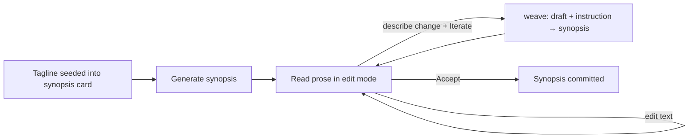

# Dungeon Master — Game Design Document

> An LLM-driven story workbench. The Dungeon Master (you) shapes a novel-length
> story not by writing it, but by **directing** it: type a tagline, then steer
> the machine's prose through small, reversible edits until it says what you mean.

This README is the design doctrine for the rebuild. The first prototype lives in
[`purgatory/`](purgatory/) — detached, not deleted. We mine it for proven
components and leave its scope behind.

---

## 1. Vision

A story is too big to hold in one prompt and too personal to hand off entirely to
a model. The Dungeon Master treats generation as a **conversation with the text**:
the machine proposes, the human disposes. Every artifact — the synopsis, later the
outline, later each beat — is a card you can read, edit in place, and *iterate* on
with a plain-language instruction.

The design north star: **the human is always one keystroke from changing anything,
and never more than one click from accepting it.**

---

## 2. First Goal (this milestone)

> **Iterative generation of the synopsis.**

Everything else (characters, chapter counts, outline, beats) is deferred. The whole
app, for now, is a single loop around one artifact:

1. The DM opens the app and sees a **tagline** prompt seeded into the synopsis
   card — no separate splash screen.
2. The machine generates a first **synopsis** from that tagline.
3. The DM reads it, edits the prose directly, or describes a change and
   **Iterates**.
4. When satisfied, the DM **Accepts**.

Character count, chapter count, and outline structure are *later* concerns and must
not leak into this loop.

> **Phase 2 (built):** the same loop now chains forward — **Accept** advances from
> the synopsis to a **plot** card (a plain three-act arc woven from the accepted
> synopsis), proving the stage-chain pattern. See
> [`docs/phase_2_plot.md`](docs/phase_2_plot.md). Chapters, cast, and counts remain
> deferred until they emerge from the work.

### Explicitly out of scope for this milestone
- The tagline splash/first screen (folded into the synopsis card).
- Outline, chapters, beats, weaving, turn-loop play.
- Asking for character or chapter counts up front.

---

## 3. Core Components (proven in the prototype)

These primitives carried the prototype and survive the rebuild.

### 3.1 Breadcrumbs — *where am I in the story?*

A live navigation strip (`#story-crumbs`) above the work area. Each view declares
its trail, e.g. `Story · Synopsis`. Because every interaction swaps a single
`#app-body` region (HTMX `innerHTML`), the breadcrumb stays continuous as the DM
moves between artifacts — it is the spine that keeps a fragmented, swap-driven UI
feeling like one place.

*Source mined from:* `purgatory/api/templates/components/breadcrumb.html`.

### 3.2 The Iterable Text Card — *read, edit, iterate, accept*

The heart of the interaction. One card renders any prose artifact as a working
surface, not a read-only result:

| Element | Behaviour |
|---|---|
| **Prose textarea** | Shows the current synopsis. Autosaves on `change` (HTMX `hx-swap="none"`) — no Save button, no lost edits. |
| **Prompt textarea** | A 3-line box, seeded with the tagline on the first turn, then "Describe the story, or a change to apply…". This is the natural-language instruction. |
| **↻ Iterate** | Sends the live text **and** the prompt to the single `weave` step. On an empty draft the prompt *is* the premise (first generation); on a non-empty draft it is a change to apply. An empty prompt is a pure save (no model call). |
| **✓ Accept** | Commits the artifact and freezes it read-only. (Phase 2 will make Accept advance to the next stage instead of dead-ending.) |

One generation mode, three URLs (`weave`, `edit`, `accept`), one card. *Generation
and iteration are the same operation* — the only difference is whether a draft
already exists. There is no separate Generate button and no throwaway Regenerate.

### 3.3 The single `weave` mode — *generate and iterate are one*

The prototype originally split a `synopsis` prompt (premise → prose) from a generic
`refine` prompt (instruction + text → revised text). v2 collapsed them: one prompt
takes the current draft (possibly empty) plus an instruction and returns the full
synopsis. Empty draft means the instruction is the premise; non-empty means apply
the change. This is the engine behind Iterate and it is the only generation path.

---

## 4. The Synopsis Loop (target flow)



The synopsis itself should be a **plain, reveal-all** summary — concrete nouns and
verbs, the actual ending included — not an atmospheric teaser. (The prototype's
synopsis prompt was rewritten away from mood adjectives toward substance; carry
that forward.)

---

## 5. Architecture Intent

YAMLGraph's three-layer split holds:

```
Presentation  →  FastAPI + HTMX + Jinja  (cards, breadcrumb, #app-body swaps)
Logic         →  YAML graph: synopsis generation as its own graph
Side effects   →  session persistence, the refine/synopsis prompts
```

**Synopsis generation becomes its own graph** — a small, self-contained YAML
pipeline (`draft` + `instruction` → `synopsis`) rather than an inline single-prompt
call. This makes the loop testable in isolation and reusable as the first node of a
larger story graph later.

---

## 6. Relationship to `purgatory/`

`purgatory/` is the **detached first prototype** — a working but over-scoped
turn-loop/outline/beat system. It is kept intact as a parts bin and reference, not
as live code. The rebuild pulls forward only the proven components above
(breadcrumb, the iterable text card, the plain-synopsis prompt direction) and
collapses the prototype's separate generate/refine prompts into the single `weave`
mode. Nothing in `purgatory/` is wired into the new app until it has earned its
place in the synopsis loop.
