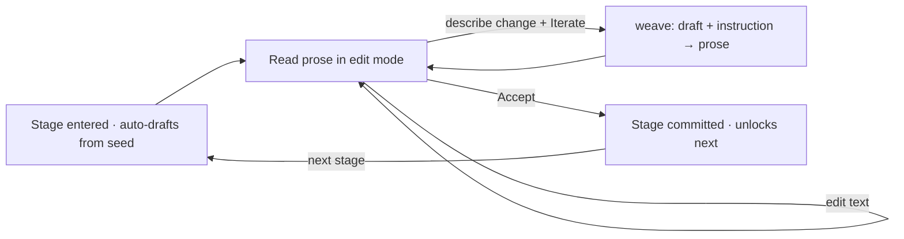
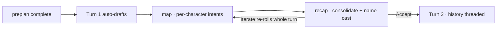

# Dungeon Master — Game Design Document

> An LLM-driven story workbench. The Dungeon Master (you) shapes a novel-length
> story not by writing it, but by **directing** it: type a tagline, then steer
> the machine's prose through small, reversible edits until it says what you mean.

This README is the design doctrine for the rebuild. The first prototype lives in
[`purgatory/`](purgatory/) — detached, not deleted. We mine it for proven
components and leave its scope behind.

---

## 1. Vision

A story is too big to hold in one prompt and too personal to hand off entirely to
a model. The Dungeon Master treats generation as a **conversation with the text**:
the machine proposes, the human disposes. Every artifact — the synopsis, later the
outline, later each beat — is a card you can read, edit in place, and *iterate* on
with a plain-language instruction.

The design north star: **the human is always one keystroke from changing anything,
and never more than one click from accepting it.**

---

## 2. What is built

The app started as a single loop around the **synopsis** and has grown — one
judged feature request at a time — into a **preplan tree** that feeds a **play
loop**. Every node is the same iterable card; what changes is the graph behind
it and the prior context it reads.

```
Synopsis (root — gates everything)
├── Key Scene            FR-475 · the single pivotal scene
└── Characters (roster)  FR-475 · one card per named principal
        └── Play (turns) FR-477 · unlocks once the whole preplan is reviewed
```

1. **Synopsis** — the DM opens the app to a **tagline** prompt seeded into the
   synopsis card (no splash). The machine drafts a plain, reveal-all synopsis;
   the DM edits in place or describes a change and **Iterates**, then **Accepts**.
   Accepting the synopsis is the gate that reveals its children (FR-470/473/474).
2. **Key Scene** (FR-475) — reads the accepted synopsis and drafts the single
   pivotal scene. Same weave → edit → accept.
3. **Characters** (FR-475) — accepting the synopsis derives a **roster** of
   names; each becomes a dynamic `char:<id>` card drafted from the shared
   `character.yaml` graph. The DM reviews each in turn.
4. **Play / Turns** (FR-477) — the moment synopsis ✓, key scene ✓, and *every*
   character card ✓, a **Play** branch appears and **Turn 1 auto-drafts**. Each
   turn runs the cast through private **intents** (THINKING + INTENT) which
   consolidate into one authoritative **recap**. Accepting a turn seeds the
   next, threading history forward.

> The original "phase 2 = plot card" milestone (see
> [`docs/phase_2_plot.md`](docs/phase_2_plot.md)) was superseded: the tree
> branches into Key Scene + Characters rather than a single linear plot stage.

### Still deferred (out of scope, by design)
- Outline, chapter counts, and beat-level weaving.
- Asking for character or chapter counts up front (the roster emerges from the
  synopsis instead).
- Hand-editable intents and any rules/dice engine (turns are narrative only).
- CAP/REQ/CI gates — this prototype lives under the FR-474 J3 regime; its
  walkthrough tests in [`tests/`](tests/) are a visibility harness, not a gate.

---

## 3. Core Components (proven in the prototype)

These primitives carried the prototype and survive the rebuild.

### 3.1 Breadcrumbs — *where am I in the story?*

A live navigation strip (`#story-crumbs`) above the work area. Each view declares
its trail, e.g. `Story · Synopsis`. Because every interaction swaps a single
`#app-body` region (HTMX `innerHTML`), the breadcrumb stays continuous as the DM
moves between artifacts — it is the spine that keeps a fragmented, swap-driven UI
feeling like one place.

*Source mined from:* `purgatory/api/templates/components/breadcrumb.html`.

### 3.2 The Iterable Text Card — *read, edit, iterate, accept*

The heart of the interaction. One card renders any prose artifact as a working
surface, not a read-only result:

| Element | Behaviour |
|---|---|
| **Prose textarea** | Shows the current synopsis. Autosaves on `change` (HTMX `hx-swap="none"`) — no Save button, no lost edits. |
| **Prompt textarea** | A 3-line box, seeded with the tagline on the first turn, then "Describe the story, or a change to apply…". This is the natural-language instruction. |
| **↻ Iterate** | Sends the live text **and** the prompt to the single `weave` step. On an empty draft the prompt *is* the premise (first generation); on a non-empty draft it is a change to apply. An empty prompt is a pure save (no model call). |
| **✓ Accept** | Commits the artifact and freezes it read-only. (Phase 2 will make Accept advance to the next stage instead of dead-ending.) |

One generation mode, three URLs (`weave`, `edit`, `accept`), one card. *Generation
and iteration are the same operation* — the only difference is whether a draft
already exists. There is no separate Generate button and no throwaway Regenerate.

### 3.3 The single `weave` mode — *generate and iterate are one*

The prototype originally split a `synopsis` prompt (premise → prose) from a generic
`refine` prompt (instruction + text → revised text). v2 collapsed them: one prompt
takes the current draft (possibly empty) plus an instruction and returns the full
synopsis. Empty draft means the instruction is the premise; non-empty means apply
the change. This is the engine behind Iterate and it is the only generation path.

---

## 4. The Card Loop (one operation, every stage)

Every node — synopsis, key scene, each character, each turn — is the identical
`{text, reviewed}` card driven by the same three URLs (`weave` / `edit` /
`accept`). The tree only decides *which graph* runs and *what prior context* it
reads.



The synopsis itself is a **plain, reveal-all** summary — concrete nouns and
verbs, the actual ending included — not an atmospheric teaser, and the key-scene
and turn-recap voices inherit that dry, factual register.

### The Play loop (FR-477)

A turn is the same card with a structured side-channel. `turn.yaml` is two
nodes: a **map** over the cast where each principal privately reasons
(`THINKING`) and commits one action (`INTENT`), then a **recap** node that
consolidates all intents into one authoritative "Turn N —" paragraph naming
every character. Intents render in a left aside; the recap is the editable card.
**Iterate** re-rolls the whole turn (intents + recap co-generated, so they can't
drift; a DM instruction steers only the recap). **Accept** seeds Turn N+1 with
the last three recaps as scene context and each character's prior intent.



---

## 5. Architecture Intent

YAMLGraph's three-layer split holds:

```
Presentation  →  FastAPI + HTMX + Jinja  (cards, breadcrumb, #app-body swaps)
Logic         →  YAML graphs: synopsis · key_scene · character · character_roster · turn
Side effects   →  session persistence (per-session story.json), the weave prompts
```

**Each stage is its own self-contained graph** rather than an inline prompt
call, which makes every loop testable in isolation. The turn graph (`turn.yaml`)
is the most structured: a `map` over the cast producing per-character intents
that a recap node consolidates. Its structured result is isolated to a dedicated
`_invoke_turn` path in `session.py`, so the shared stage interface stays a pure
`str → str` (FR-477 J3) and every preplan stage runs through the same code.

---

## 6. Relationship to `purgatory/`

`purgatory/` is the **detached first prototype** — a working but over-scoped
turn-loop/outline/beat system. It is kept intact as a parts bin and reference, not
as live code. The rebuild pulls forward only the proven components above
(breadcrumb, the iterable text card, the plain-synopsis prompt direction) and
collapses the prototype's separate generate/refine prompts into the single `weave`
mode. Nothing in `purgatory/` is wired into the new app until it has earned its
place in the synopsis loop.
