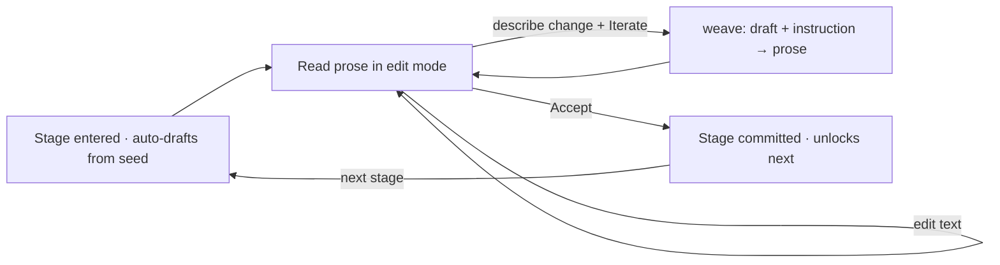
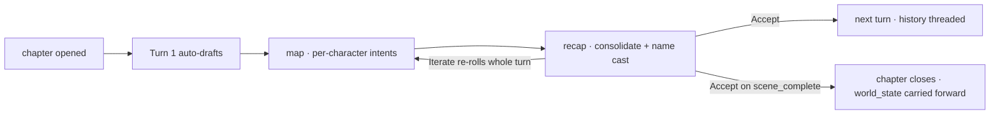

# Dungeon Master — Game Design Document

> An LLM-driven story workbench. The Dungeon Master (you) shapes a novel-length
> story not by writing it, but by **directing** it: type a tagline, then steer
> the machine's prose through small, reversible edits until it says what you mean.

This README is the design doctrine for the rebuild. The first prototype lives in
[`purgatory/`](purgatory/) — detached, not deleted. We mine it for proven
components and leave its scope behind.

---

## 1. Vision

A story is too big to hold in one prompt and too personal to hand off entirely to
a model. The Dungeon Master treats generation as a **conversation with the text**:
the machine proposes, the human disposes. Every artifact — the synopsis, later the
outline, later each beat — is a card you can read, edit in place, and *iterate* on
with a plain-language instruction.

The design north star: **the human is always one keystroke from changing anything,
and never more than one click from accepting it.**

---

## 2. What is built

The app started as a single loop around the **synopsis** and has grown — one
judged feature request at a time — into a **book**: the synopsis derives a cast,
the cast derives a chapter outline, **each chapter is played** turn by turn, and
the played chapters compose into **The Book**. Every visitable node is the same
iterable card; what changes is the graph behind it and the prior context it reads.

```
Synopsis (root — gates everything)
├── Characters (roster)    FR-475/491 · one char:<id> card per named principal
└── Chapters (overview)    FR-488/490/491 · the book split into an ordered chapter set
      └── chapter:<cid>    FR-491 · PLAYED in place, carrying world_state forward
            └── turn:<cid>:<n>   map(cast → intents) → director → recap (FR-477/479/481)
      The Book             FR-491/492 · deterministically composed from every played chapter (no LLM)
```

1. **Synopsis** — the DM opens the app to a **tagline** prompt seeded into the
   synopsis card (no splash). The machine drafts a plain, reveal-all synopsis;
   the DM edits in place or describes a change and **Iterates**, then **Accepts**.
   Accepting the synopsis is the gate that reveals its children, and the act that
   derives the character roster (FR-474/489/491).
2. **Characters** (FR-475/491) — accepting the synopsis derives a **roster** of
   names; each becomes a dynamic `char:<id>` card drafted from the shared
   `character.yaml` graph. The DM reviews each in turn. Accepting the **last**
   character derives the chapter outline — the cast is settled before the arc
   they will play is split out (FR-491 J1).
3. **Chapters** (FR-488/490/491) — the synopsis is split into a fixed, ordered
   set of one-paragraph chapter summaries. The **Chapters** crumb lands on a
   read-only **overview** (table of contents); each `chapter:<cid>` card is not
   *expanded* in one shot — it is **played** turn by turn (below), threading the
   previous chapter's **world state** forward (FR-491 B, preserving FR-488 J7) so
   the book stays continuous.
4. **Play / Turns** (FR-477/491) — visiting a chapter opens its **first turn**.
   Each turn runs the cast through private **intents** (a `map`: THINKING +
   INTENT, plus the outward DIALOGUE + EXPRESSION, FR-486), a **director** judges
   the arc against the chapter summary (phase, beats satisfied, continuity,
   scene-complete — FR-479/481), and a **recap** consolidates it into one
   authoritative paragraph. Accepting a turn seeds the next; when the director
   reports the chapter's scene **complete**, the chapter closes — its
   end-of-chapter `world_state` is derived and carried into the next chapter —
   and play moves on.
5. **The Book** (FR-491/492) — once **every** chapter has been played to its end,
   the terminal **Book** finish unlocks and **deterministically composes** the
   played chapters' per-chapter final texts into one continuous manuscript. The
   assembly is pure code — there is **no whole-book LLM call** (FR-492); each
   chapter's prose was already generated at its own close.

### Stand-alone generation — headless, no UI (FR-494)

The same drive — synopsis → cast → play every chapter → Book — runs without the
HTTP surface. [`scripts/generate.py`](scripts/generate.py) owns the single
end-to-end loop (`generate_story`, adapter-only: `weave`/`accept`/`navigate`),
stopping on `tree.all_chapters_played` and **raising** rather than emitting a
partial story if the turn cap is hit. It writes two artifacts side by side: the
machine `story.json` and a reader **`story.md`** — the pure, no-LLM full-story
render (`api/render.py`: tagline lead, `# Synopsis`, `# Cast`, then the Book).

```bash
PYTHONPATH="$PWD" python examples/dungeon_master/scripts/generate.py \
  --premise "A lone courier carries a sealed warning across a frozen river." \
  --out outputs/dungeon-master/courier
# → outputs/dungeon-master/courier/story.json  (machine)
# → outputs/dungeon-master/courier/story.md    (reader)

# A larger, multi-chapter premise derives more chapters, so raise --turn-cap
# above the default 24 (the gate raises rather than emit a partial book):
PYTHONPATH="$PWD" python examples/dungeon_master/scripts/generate.py \
  --premise "Romance, Adventure, Erotica. 10,000 BC, the great thaw — The Floodmark Saga. The glaciers are bleeding into the lowlands and three loosed rivers are drowning the valley; every clan must climb or die. Hilde, war-leader of the Aschenwulf band, raids the rival Bärenschädel clan at dawn just as the river breaks its banks, and is stranded on a shrinking ledge beside Gunnar, the man she came to kill — the survival truce between them hardening, against both clans' will, into something closer and far more dangerous, while in the same surge her brother Arnulf is swept downriver and mourned as drowned. A mature, explicit story of what people will break to stay alive — old laws, old loyalties, the line between enemy and lover — as a salt-road stranger named Reinmar steers the survivors toward the one high valley still standing by autumn, and the keeper of the old rites reads the truce itself as the judgment that called the flood. Romance, blood-feud, faith, and a returning ghost all converge on the same too-small patch of dry ground." \
  --out outputs/dungeon-master/10000-BC --turn-cap 96
```

The live witness [`scripts/witness_book_compose.py`](scripts/witness_book_compose.py)
is a thin caller over `generate_story` that keeps only the substance asserts.

### Auto-reviewing the generated book (examples/book_reviewer)

The reader `story.md` is a book-shaped Markdown manuscript (`# Synopsis`, `# Cast`,
then `# Chapter` headings), so it drops straight into the stand-alone
[`book_reviewer`](../book_reviewer/README.md) example — a decomposed
**map → reduce** critic where no single LLM call ever sees the whole book and every
score is computed by deterministic Python (only a one-line verdict is generative).

Point its `manuscript_path` at the generation `--out` directory (it accepts a
directory containing `story.md`, or the file directly) and it writes a
human-readable `review.md` **next to** the manuscript:

```bash
# 1. Generate the book (writes <out>/story.md)
PYTHONPATH="$PWD" python examples/dungeon_master/scripts/generate.py \
  --premise "A lone courier carries a sealed warning across a frozen river." \
  --out outputs/dungeon-master/courier

# 2. Review it — pass the directory (resolves <dir>/story.md) …
PYTHONPATH="$PWD" python -m yamlgraph.cli graph run \
  examples/book_reviewer/graph.yaml \
  --var manuscript_path=outputs/dungeon-master/courier \
  --full

# … or the file directly:
#   --var manuscript_path=outputs/dungeon-master/courier/story.md

# 3. Read the scored critique (per-chapter axes + book-level continuity)
cat outputs/dungeon-master/courier/review.md
```

The reviewer scores Coherence, Engagement, Prose, and Character **per chapter**,
plus book-level **Continuity** (pairwise chapter-seam checks) and **Relevance**
(synopsis-delivery) — the same cross-chapter continuity the
[ledger-as-memory](docs/architecture.md#5a-the-ledger-as-agent-memory-fr-513518)
forward-carry exists to hold, now independently witnessed by a separate critic.

### Continuity hardening — keeping the prose faithful to the recorded arc (FR-519/521/522)

A played chapter can drift from what the arc already knows — a character the river
swept away keeps climbing out turn after turn. Continuity is held at two scopes:

- **Cross-chapter**, by the typed
  [ledger-as-memory](docs/architecture.md#5a-the-ledger-as-agent-memory-fr-513518)
  forward-carry (FR-513–518) and the Final Cut's dead/possession constraints
  (FR-519).
- **Intra-chapter**, by **option removal, not advice** (FR-521): the director emits
  a structured `cast_exits` each turn; an actor it reports gone (swept away, killed)
  is **dropped from the running cast** for the rest of the chapter, so the intent
  map can no longer animate them. An earlier attempt to instead *feed the director's
  warning forward into the scene* was **witness-falsified** (re-flags rose 8/16 →
  13/16 — an instruction to a generator is not a gate) and reverted; the roster-drop
  took the same chapter to **0/16**.

That falsification was possible because of the **single-chapter replay witness**
(FR-522): [`scripts/replay_chapter_continuity.py`](scripts/replay_chapter_continuity.py)
re-plays one chapter from its inherited start (every prior chapter held constant)
and reports the director-flag count beside the independent intent-map acting count,
so a continuity change is measured as a controlled experiment instead of a
confounded full-book re-generation. It is an **instrument, not a gate** — never
wired into CI; its measurement is unit-tested, its live replay run by hand. See
[`docs/architecture.md`](docs/architecture.md#single-chapter-replay--the-controlled-continuity-witness-fr-522).

### Still deferred (out of scope, by design)
- Asking for character or chapter counts up front (the roster and the chapter set
  both emerge from the synopsis instead).
- Hand-editable intents and any rules/dice engine (turns are narrative only).
- CAP/REQ/CI gates — this prototype lives under the FR-474 J3 regime; its
  end-to-end tests in [`tests/`](tests/) are a visibility harness, not a gate.

---

## 3. Core Components (proven in the prototype)

These primitives carried the prototype and survive the rebuild.

### 3.1 Breadcrumbs — *where am I in the story?*

A live navigation strip (`#story-crumbs`) above the work area. Each view declares
its trail, e.g. `Story · Synopsis`. Because every interaction swaps a single
`#app-body` region (HTMX `innerHTML`), the breadcrumb stays continuous as the DM
moves between artifacts — it is the spine that keeps a fragmented, swap-driven UI
feeling like one place.

*Source mined from:* `purgatory/api/templates/components/breadcrumb.html`.

### 3.2 The Iterable Text Card — *read, edit, iterate, accept*

The heart of the interaction. One card renders any prose artifact as a working
surface, not a read-only result:

| Element | Behaviour |
|---|---|
| **Prose textarea** | Shows the current synopsis. Autosaves on `change` (HTMX `hx-swap="none"`) — no Save button, no lost edits. |
| **Prompt textarea** | A 3-line box, seeded with the tagline on the first turn, then "Describe the story, or a change to apply…". This is the natural-language instruction. |
| **↻ Iterate** | Sends the live text **and** the prompt to the single `weave` step. On an empty draft the prompt *is* the premise (first generation); on a non-empty draft it is a change to apply. An empty prompt is a pure save (no model call). |
| **✓ Accept** | Commits the artifact, freezes it read-only, and lands on the next sensible node (chosen by the tree, not a linear cursor), auto-drafting it on arrival. |

One generation mode, three URLs (`weave`, `edit`, `accept`) plus `/story/nav`,
one card. *Generation and iteration are the same operation* — the only difference
is whether a draft already exists. There is no separate Generate button and no
throwaway Regenerate.

### 3.3 The single `weave` mode — *generate and iterate are one*

The prototype originally split a `synopsis` prompt (premise → prose) from a generic
`refine` prompt (instruction + text → revised text). v2 collapsed them: one prompt
takes the current draft (possibly empty) plus an instruction and returns the full
prose. Empty draft means the instruction is the premise; non-empty means apply
the change. This is the engine behind Iterate and it is the only generation path —
ordinary cards run it through `doc_ops.invoke_stage`; the structured stages
(turns, chapters, the Book) run a *composed* variant
(`doc_ops.compose_stage`) that wraps the same weave contract around their
multi-node graphs and deterministic post-conditions (see
[`docs/architecture.md`](docs/architecture.md)).

---

## 4. The Card Loop (one operation, every stage)

Every node — synopsis, each character, the chapters overview, each chapter, each
turn, and the Book — is the identical `{text, reviewed}` card driven by
the same three URLs (`weave` / `edit` / `accept`) plus `/story/nav` for
breadcrumb jumps. The tree only decides *which graph* runs and *what prior
context* it reads.



The synopsis itself is a **plain, reveal-all** summary — concrete nouns and
verbs, the actual ending included — not an atmospheric teaser, and the chapter
and turn-recap voices inherit that dry, factual register.

### The Play loop (FR-477/491)

A turn is the same card with a structured side-channel, played **inside the
chapter that owns it** (`turn:<cid>:<n>`). `turn.yaml` is two
nodes: a **map** over the cast where each principal privately reasons
(`THINKING`) and commits one action (`INTENT`), then a **recap** node that
consolidates all intents into one authoritative "Turn N —" paragraph naming
every character. Intents render in a left aside; the recap is the editable card.
**Iterate** re-rolls the whole turn (intents + recap co-generated, so they can't
drift; a DM instruction steers only the recap). **Accept** seeds the next turn
with the last recaps as scene context and each character's prior intent — and
when the director reports the chapter complete, closes the chapter (deriving its
`world_state`) and moves play to the next chapter.



---

## 5. Architecture Intent

YAMLGraph's three-layer split holds:

```
Presentation  →  FastAPI + HTMX + Jinja  (cards, breadcrumb, #app-body swaps)
Logic         →  YAML graphs (one per stage) + prompts
Side effects   →  per-session story.json, the compiled-graph cache
```

**Each stage is its own self-contained graph** rather than an inline prompt call,
which makes every loop testable in isolation. The graphs are:

| Graph | Stage | Shape |
|---|---|---|
| `synopsis.yaml` | Synopsis | weave (draft + instruction → prose) |
| `character_roster.yaml` | Characters | derives the cast names from the synopsis |
| `character.yaml` | each `char:<id>` | weave, parameterised by the character name |
| `chapter_outline.yaml` | Chapters | splits the synopsis into `{title, summary}[]` |
| `turn.yaml` | each `turn:<cid>:<n>` | `map`(cast → intents) → director → recap |
| `chapter_close.yaml` | chapter close | inherited ledger + played recaps → end-of-chapter `world_state` |

The Book has **no graph** (FR-492): once every chapter is played, its terminal
stage is rendered by `chapter_ops.compose_book_deterministic` — pure code that
assembles the already-generated per-chapter final texts, never an LLM call.

The **shared card interface stays a pure `str → str`** (FR-477 J3). The structured
stages keep their side-channels (turn intents + director judgement; chapter
`summary` / `world_state`) out of that interface, isolated in `turn_ops.py` /
`chapter_ops.py`. Those modules also own the **deterministic seams** — pure code
the model is *not* trusted to do: the monotonic phase clamp, the cumulative beat
canonicalisation, the `world_state` forward-carry across chapters, and the
played-chapters assembly that **raises** rather than composing The Book from
nothing (Commandment 6). See [`docs/architecture.md`](docs/architecture.md) for
the full module map and the deterministic-vs-generative seam split.

---

## 6. Relationship to `purgatory/`

`purgatory/` is the **detached first prototype** — a working but over-scoped
turn-loop/outline/beat system. It is kept intact as a parts bin and reference, not
as live code. The rebuild pulls forward only the proven components above
(breadcrumb, the iterable text card, the plain-synopsis prompt direction) and
collapses the prototype's separate generate/refine prompts into the single `weave`
mode. Nothing in `purgatory/` is wired into the new app until it has earned its
place in the synopsis loop.
