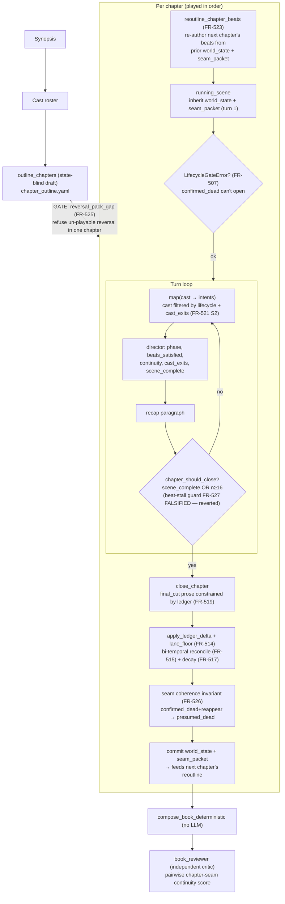
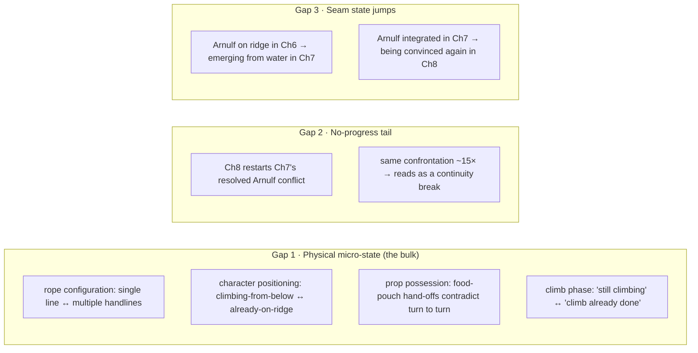

# Dungeon Master v2 — Continuity Issues

> The standing record of *why story continuity breaks in the generated book*, what
> we have tried, how the current pipeline holds the line, and where it still leaks.
> Companion to [`architecture.md`](architecture.md) (the *how* of the whole app) and
> the [README](../README.md) (the *why* of the design). This document is scoped to
> the **continuity problem** alone.

Last reconstructed: **2026-06-18**, against the FR-506 → FR-527 arc and the
`10025-BC` Floodmark run (book reviewer: overall 4/5, **continuity 1/5**).

---

## 1. What "continuity" means here

A DM v2 book is generated, never written: a synopsis derives a cast, the cast
derives an ordered chapter outline, each chapter is **played turn by turn**, and the
played chapters are composed into one manuscript. Nothing holds the whole book in a
single prompt — no LLM call ever sees more than one chapter's worth of context. So
*continuity is an emergent property of the seams*, and every seam is a place it can
break:

| Scope | The seam | The break it produces |
|-------|----------|------------------------|
| **Intra-turn** | map(cast → intents) → director → recap | A character acts against what the same turn just established. |
| **Intra-chapter** | turn N → turn N+1 (same chapter) | A character killed/swept away in turn 2 still acting in turn 8; an object used after it was dropped. |
| **Chapter seam** | chapter N close → chapter N+1 open | Lovers re-met as strangers; an actor teleported to satisfy a beat; a clan-flip; a death that silently un-happens. |
| **Planning seam** | synopsis → outline → per-chapter beats | The *planner* authors a physically impossible beat (a hazard death with no bridge beat to reach the hazard), which the player can only satisfy by teleporting the actor. |
| **Pacing** | director never says "done" | A chapter rides the 16-turn cap replaying a resolved confrontation — repetition that *reads* as a continuity break. |

The central design law inherited from the Scripture governs every fix below:

> **`the_one_law`: normalize at the boundary where the data enters, not downstream
> where the symptom manifests.** A continuity defect that *manifests* in chapter 8's
> prose is very often *authored* at the outliner, or *committed* at a chapter close.

A second law, learned the hard way (FR-521), governs *how* we fix:

> **An instruction to a generator is not a gate.** Feeding a warning into a prompt
> ("don't let the dead actor act") is advisory and is repeatedly falsified by live
> witnesses. The durable fixes are **deterministic option-removal** (drop the actor
> from the cast) and **deterministic gates** (refuse to commit an incoherent record).

---

## 2. The attempts so far (FR-506 → FR-527)

The continuity work falls into five waves. Each wave was witnessed, and several
proposed cures were **falsified or rejected** — those are kept in the record because
the rejections are the load-bearing lessons.

```mermaid
flowchart TD
    subgraph W1["Wave 1 · Chapter-seam contract (FR-506/507)"]
        A1[seam_packet: resolved_events / open_threads /<br/>must_carry_facts / opening_constraints]
        A2[character_lifecycle gate:<br/>existence_state + allowed_reappearance_from_chapter]
    end
    subgraph W2["Wave 2 · Ledger-as-memory (FR-499/508–518)"]
        B1[FR-499/513 typed world_state + relationships lane<br/>boundary grounding]
        B2[FR-514 delta-close + lane floor<br/>fixes zero-dropout reset]
        B3[FR-515 bi-temporal reconcile<br/>fixes enmity→bond type-lag]
        B4[FR-516 top-K retrieval · FR-517 decay · FR-518 consolidate]
        B5[FR-509/510 lifecycle cast filter + confirmed_dead prose exclusion]
        B6[FR-511/512 final-cut single revise + chapter-open slimming]
    end
    subgraph W3["Wave 3 · Intra-chapter enforcement (FR-519/520/521)"]
        C1[FR-519 prose-vs-state in final_cut<br/>dead actor can't act in closing prose]
        C2[FR-520 positional_memory module — REJECTED<br/>record already existed in director.continuity]
        C3[FR-521 S1 feed director warning forward — FALSIFIED 8/16→13/16]
        C4[FR-521 S2 cast_exits roster-drop — ENFORCED 8/16→0/16]
    end
    subgraph W4["Wave 4 · Planning-time continuity (FR-523/524/525/526)"]
        D1[FR-523 state-aware re-outline<br/>kill the seam teleport in the spec]
        D2[FR-524 synopsis-summary reweave — REJECTED<br/>re-weaving committed past = plausible-wrong]
        D3[FR-525 outliner split-gate<br/>forbid un-playable reversal in one capped chapter]
        D4[FR-526 close-seam lifecycle coherence<br/>confirmed_dead + reappearance → presumed_dead]
    end
    subgraph W5["Wave 5 · Pacing-as-continuity (FR-527 → FR-528)"]
        E1[FR-527 beat-progress stall guard — FALSIFIED at enforce<br/>a count plateau is mid-scene noise, not a scene-end signal<br/>cure moves upstream to the outliner: FR-528]
    end
    W1 --> W2 --> W3 --> W4 --> W5
```

### Wave 1 — the chapter-seam contract (FR-506/507)

The first explicit cross-chapter handoff beyond raw prose. `seam_packet.py` adds a
typed packet committed at each chapter close and injected into the next chapter's
turn 1: `resolved_events`, `open_threads`, `must_carry_facts`, `opening_constraints`,
and a `character_lifecycle` list (`existence_state`, `visibility_mode`,
`allowed_reappearance_from_chapter`). FR-507 lets a lifecycle constraint **hard-block**
turn-1 fanout (`LifecycleGateError`) so a confirmed-dead actor can't open the next
chapter.

### Wave 2 — the ledger became a memory system (FR-499/508–518)

The forward-carried `world_state` started as a free-prose `str`, which let every
close silently contradict an earlier chapter (a clan-flip, a phantom hand-axe, lovers
re-met as strangers) or **zero the relationship web** when one close forgot to re-list
it. The fix was to recognise the ledger *is an agent-memory store* and to apply the
memory-systems literature (Generative Agents, MemGPT, Zep/Graphiti bi-temporal, A-MEM):

| FR | Memory concern | Mechanism (pure code, no LLM) |
|----|----------------|-------------------------------|
| FR-499/513 | encode/ground | typed `WorldState`; drop a relationship with <2 named parties or no `recap_citation`. |
| FR-514 | persist (delta not regenerate) | close emits add/reaffirm/update/invalidate **operations**; zero ops carry the inherited set forward unchanged; lane floor stops an emptied lane zeroing state. |
| FR-515 | reconcile | edge identity = participant set, so `enmity → romantic_bond` lands on the same edge; old version closed (`valid_to`), new opened (`valid_from`). |
| FR-516 | retrieve | top-K cast-relevant ranking into turn context. |
| FR-517 | forget | mechanical decay `active → dormant` by ordinal arithmetic. |
| FR-518 | consolidate | grounded merge of overlapping edges (primitive shipped; cadence deferred). |
| FR-509/510 | lifecycle truth | the lifecycle record is the cast filter; confirmed-dead excluded from prose. |
| FR-511/512 | context hygiene | final-cut single revise cycle; chapter-open context slimming. |

> **Core insight (graduated to repo memory):** *the LLM authors meaning, deterministic
> code authors persistence.* Every place we let the model re-emit whole state, it
> dropped something.

### Wave 3 — intra-chapter enforcement (FR-519/520/521)

- **FR-519** threads the chapter's own committed ledger into `final_cut.yaml` as a hard
  constraint, so the closing prose can't contradict the chapter's own facts.
- **FR-520** proposed a new `positional_memory.py` to *produce* a turn-grained
  continuity record — **rejected** at gate-open because the record already existed (the
  director emits a per-turn `continuity` judgement). The fix was wiring, not a module.
- **FR-521** is the pivotal lesson. **S1** fed the director's warning forward into the
  next turn's scene context — and the single-chapter replay witness **falsified it**
  (re-flags rose 8/16 → 13/16: an instruction in the scene is not a gate). It was
  reverted. **S2** instead uses the director's structured `cast_exits` to **drop** an
  exited actor from the running cast — deterministic option-removal — and took the same
  chapter to **0/16**.

### Wave 4 — the bug moved upstream to the planner (FR-523/524/525/526)

Once the player and the seam were hardened, the residual breaks were traced to the
**outliner**, which authors every chapter's beats from the synopsis *alone*, blind to
the physical end-state the prior chapter carried:

- **FR-523** makes the next unplayed chapter's beats **state-aware**: re-author them
  from the prior chapter's committed `world_state` + `seam_packet`, so a hazard death
  is bridged by a reposition beat instead of teleporting the actor.
- **FR-524** proposed re-weaving the synopsis summary into committed chapters —
  **rejected** as the *plausible-wrong-past* error: the death already played; rewriting
  committed memory is dishonest. Forward an owed thread instead.
- **FR-525** adds an **outliner split-gate**: forbid packing a death-and-return
  *reversal* into one chapter the 16-turn cap can only half-play (the phantom-promise
  bug). Detected deterministically by `reversal_pack_gap`.
- **FR-526** adds a **close-seam coherence invariant**: a row that is `confirmed_dead`
  yet carries a reappearance allowance is self-contradictory; soften it to
  `missing_presumed_dead`, preserving the authored return intent.

### Wave 5 — pacing that reads as continuity (FR-527 FALSIFIED → FR-528)

A chapter's only natural exit is the director computing `scene_complete` (`k == n`
beats). When a chapter plateaus at `k < n` (e.g. an epilogue/time-skip beat the ridge
scene can never reach), `beats_satisfied` freezes but turns keep playing to the 16-turn
cap, **replaying the resolved confrontation**. Across the corpus the
`scan_turn_waste.py` witness measured **208 wasted turns over 127 chapters**.
`10025-BC` Ch8 is the worst single instance (4 of 5 beats reached at turn 6, frozen
through turn 16) and scored **engagement 1/5**.

FR-527 proposed a deterministic **no-progress stall guard** in `chapter_should_close`
(close once `beats_satisfied` has not grown for K turns). It was implemented under TDD
and **falsified by its own load-bearing J6 corpus safety check**: natural directors
routinely *pause* beat-marking mid-scene and resume — the longest such pause before a
natural `scene_complete` is **9 turns** (`10013-BC CH1`). A count plateau therefore
cannot distinguish a *finished* director from a *pausing* one; any stall window safe
for natural pauses (> 9) shrinks to the cap and saves ~0 turns, while 18 of 27 waste
chapters freeze for fewer than 9 turns and get no benefit at all. The guard was
reverted (production unchanged), the dead end pinned by
`test_beat_plateau_signal_is_non_separable`, and the cure moved **upstream to the
outliner (FR-528)**: stop authoring a final beat the capped scene can never reach, so
the plateau never forms. This is the same lesson as FR-521 S1 / FR-524 — *the symptom's
boundary is rarely the cure's boundary* — and it joins the falsified-cure record
deliberately. **Status: FALSIFIED at enforce; cure re-scoped to FR-528.**

---

## 3. The current process — where each guard sits

The continuity guards are not one module; they are distributed across the four seams.
This is the live generation pipeline with each guard annotated at the boundary it
defends.

### The instrument shelf (FR-522 posture — *instruments, not gates*)

Continuity efficacy is a non-deterministic, live-LLM property; a unit test can only
prove *wiring*. So the project relies on a shelf of **deterministic witnesses** that
measure recorded books, plus one controlled live replay. None are wired into CI.

| Instrument | File | What it measures |
|------------|------|------------------|
| Single-chapter replay | `scripts/replay_chapter_continuity.py` | Re-plays ONE chapter from its inherited start (all priors held constant) → director-flag count **beside** independent intent-map acting count. The controlled experiment that falsified FR-521 S1. |
| Continuity metrics | `scripts/witness_continuity_metrics.py` · `api/witness_metrics.py` | `chapter_actor_flag_metrics`, `beat_coverage_gap`, `reversal_pack_gap`. |
| Seam-gap scan | `scripts/scan_seam_gaps.py` | Cross-chapter seam contract violations over a corpus. |
| Beat-gap scan | `scripts/scan_beat_gaps.py` | Beats promised but never satisfied. |
| Turn-waste scan | `scripts/scan_turn_waste.py` | The no-progress tail (FR-527 evidence: 208 turns / 127 chapters). |
| Cue metrics | `api/cue_metrics.py` | Prose-cue consistency signals. |
| Independent critic | `examples/book_reviewer/` | Map→reduce critic; scores **book-level continuity** by pairwise chapter-seam checks. The reviewer the `10025-BC` continuity 1/5 came from. |

---

## 4. Analysis — what is solved and what still leaks

### What the machinery now holds reliably

- **Lifecycle continuity** (who is alive / dead / missing): strong. Confirmed-dead
  actors are filtered from the cast and excluded from prose; the cast_exits roster-drop
  (FR-521 S2) took the motivating chapter to 0/16 re-flags.
- **Relationship/emotional memory** (who loves/hates whom, faction allegiance): strong.
  Delta semantics + bi-temporal reconciliation + grounding stopped the bond-reset and
  the type-lag classes entirely.
- **The phantom-reversal class** (a death-and-return packed into one capped chapter):
  prevented at the outliner (FR-525) with close-seam recovery (FR-526).

### What still leaks — the `10025-BC` evidence (continuity 1/5)

The latest run scores **4/5 overall** but **1/5 on continuity**. Reading the reviewer's
actual complaints, the residual defects cluster into **three classes the current
machinery does not cover**:

**Gap 1 — physical/positional micro-state is untracked.** This is the largest share of
the `10025-BC` continuity complaints (rope config, who is above/below on the ridge,
which hand holds which food pouch, whether the climb is still happening). The ledger
tracks `characters[].location` and `objects[].holder/location` — but only at **chapter
grain**, as coarse labels ("the ledge", "high valley"). It was never designed to hold
turn-to-turn physical blocking (a rope's knot count, who is hauling whom, a pouch
changing hands). So the model improvises this micro-state every turn with no ledger to
contradict it — and the independent reviewer, which *does* read across seams, catches
the drift the generation pipeline cannot see.

**Gap 2 — the no-progress tail is a continuity defect in disguise.** Ch8's 1/5 is the
no-progress tail: the chapter replays Ch7's already-resolved Arnulf conflict ~15 times.
The repetition itself reads as the story "un-resolving." FR-527 tried to cut the tail at
the play boundary with a beat-stall guard but was **falsified at enforce** — a count
plateau is indistinguishable from a routine mid-scene pause (up to 9 turns in the
corpus). The cure moves upstream to the outliner (**FR-528**): stop authoring a final
beat the capped scene can never reach, so the plateau never forms.

**Gap 3 — seam state jumps at the chapter boundary.** Arnulf on the ridge in Ch6 then
"emerging from the water" in Ch7; integrated in Ch7 then re-convinced in Ch8. These are
partly the same repetition (Gap 2) and partly a positional seam the `seam_packet`'s
coarse lifecycle/facts don't pin down (it records *that* Arnulf returns, not *where he
physically is* at the seam).

### The meta-pattern

The continuity program has been an **upstream march**: each wave hardened a seam, and
the residual defect moved one boundary earlier (turn → chapter close → chapter open →
outliner → synopsis). The machinery is now strong on **identity state** (lifecycle,
faction, relationships) — the state that has a *typed lane in the ledger*. It is weak
on **physical state** (position, props, phase) — the state that has *no typed lane* and
is left to the prose. The reviewer's complaints are almost entirely in that untracked
lane. **The next boundary to normalize is positional/prop micro-state.**

The FR-527 falsification sharpened the same march once more: a defect that *manifests*
as pacing at the play boundary could not be cured there, because the only deterministic
"scene is over" signal at that boundary is `scene_complete` (`k == n`) — and the
plateau is precisely its absence. The cure had to retreat one boundary upstream to the
outliner that authored the unreachable beat. *Where a symptom can be measured is rarely
where it can be fixed.*

---

## 5. Recommended next steps

Ordered by leverage. The first two are already-scoped; the rest are new proposals.

### 5.1 FR-527 FALSIFIED at enforce — go straight to FR-528

FR-527 proposed a deterministic beat-progress stall guard in
`turn_ops.chapter_should_close`. **It was implemented under TDD and falsified by its
own load-bearing J6 corpus safety check:** natural directors routinely pause
beat-marking mid-scene for up to **9 turns** and resume (e.g. `10013-BC CH1` freezes
at count 2 for t2..t10, then closes at t13). The count-plateau signal cannot separate
a *finished* director from a *pausing* one — any stall window safe for natural pauses
(> 9) shrinks to the cap, saving ~0 turns on the waste cases. The production guard was
reverted; the cure is FR-528 (below). See FR-527 *Enforcement Outcome* for the full
corpus evidence. **The lesson: a count plateau is mid-scene noise, not a scene-end
signal — fix the unreachable beat at the source, not the symptom at the cap.**

### 5.2 New FR (the FR-527 J4 seed, ~FR-528) — outliner must not author un-satisfiable beats

FR-527's plateau root cause is the outliner authoring a **time-skip / epilogue beat**
("By autumn… a settlement that ends the feud") the capped ridge scene can never reach,
so `k` can never equal `n`. This is a cousin of FR-525. A deterministic detector +
prompt constraint: the final beat of a chapter must be *playable inside the scene*, not
a narrated time-jump. Kills the plateau at its source (the seam), so FR-527's guard
becomes a backstop rather than the primary cure.

### 5.3 New FR — a positional/prop micro-state lane (*the biggest structural gap*)

Gap 1 is the bulk of the residual continuity score and has **no typed home today**.
Two viable shapes, in increasing cost:

1. **Seam-level positional pin (cheaper).** Extend `seam_packet` with a small,
   *deterministically-rendered* `physical_state` block (per on-stage character: where
   they physically are at the seam; per tracked prop: who holds it). Inject it into the
   next chapter's turn-1 `running_scene` as a hard opening constraint — the same pattern
   that fixed lifecycle (FR-507). This closes Gap 3 (seam jumps) and the chapter-grain
   half of Gap 1, without a per-turn tracker.
2. **Turn-grained prop/position ledger (fuller, costlier).** A typed sub-state updated
   each turn (delta semantics, like the relationship lane) for a *bounded* set of
   tracked props (the rope, the food pouches) and a coarse position token per character
   (above/below/on-ridge). The director already emits a `continuity` signal; this gives
   it a typed state to check against instead of improvising. Highest fidelity, highest
   build cost — scope it only if (1) proves insufficient on a re-witnessed run.

> Follow the law that worked: a *typed lane the LLM never regenerates whole*, updated by
> a *delta the model authors and code applies*. Do **not** ask the prompt to "remember
> the rope" — that is the FR-521 S1 trap (an instruction is not a gate).

### 5.4 Promote the book_reviewer continuity check toward a generation-time signal

The independent critic already computes pairwise chapter-seam continuity and is the only
component that *sees across seams*. Today it runs **after** generation as a separate
example. Step it inward:

1. Run it (or just its `Continuity` axis) as a **post-generation witness** wired into
   `generate_and_review.sh` so every run reports a continuity score (visibility, not a
   gate — FR-522 posture).
2. Longer term, a per-seam continuity check at chapter close could trigger a **bounded
   re-roll** of the next chapter's opening (deterministic budget, like the turn cap),
   turning the critic from a post-hoc grade into a corrective signal.

### 5.5 Consolidate the instrument shelf

There are now six+ scan/witness scripts (`scan_seam_gaps`, `scan_beat_gaps`,
`scan_turn_waste`, `replay_chapter_continuity`, `witness_continuity_metrics`,
`cue_metrics`). They overlap and are run by hand. A single `continuity_report.py` over
an `--out` directory — one table of every deterministic metric per book — would make
"did this FR move the needle?" a one-command answer and reduce the chance a regression
hides between instruments.

### Summary table

| Step | Type | Effort | Closes |
|------|------|--------|--------|
| 5.1 FR-527 stall guard | FALSIFIED at enforce | — | dead end; cure → 5.2 |
| 5.2 Outliner playable-beat gate (FR-528) | New FR | ~1d | Gap 2 root cause |
| 5.3 Positional/prop state lane | New FR | 1–3d | Gap 1 + Gap 3 (the bulk) |
| 5.4 Reviewer continuity as in-loop signal | New FR | 1–2d | Visibility → correction |
| 5.5 Unify the instrument shelf | Chore | ~0.5d | Regression visibility |

---

## 6. References

- **FRs:** `feature-requests/FR-506`, `FR-507`, `FR-509`–`FR-519`, `FR-521`, `FR-523`–`FR-527`
- **Code:** `api/world_state.py`, `api/seam_packet.py`, `api/chapter_ops.py`,
  `api/turn_ops.py`, `api/witness_metrics.py`, `api/cue_metrics.py`
- **Instruments:** `scripts/replay_chapter_continuity.py`,
  `scripts/scan_seam_gaps.py`, `scripts/scan_beat_gaps.py`,
  `scripts/scan_turn_waste.py`, `scripts/witness_continuity_metrics.py`
- **Independent critic:** `examples/book_reviewer/`
- **Latest evidence:** `outputs/dungeon-master/10025-BC/review.md` (continuity 1/5)
- **Diary:** `docs/diary/diary-2026-06-16-the-ledger-that-was-a-string.md`,
  `diary-2026-06-17-the-ledger-was-a-memory-system.md`,
  `diary-2026-06-16-the-chapter-that-would-not-end.md`,
  `diary-2026-06-17-the-bond-that-reset-at-every-chapter-break.md`,
  `diary-2026-06-18-the-gate-that-failed-its-own-cure.md` (FR-527 falsification)
- **Architecture:** [`architecture.md` §5a — the ledger as agent memory](architecture.md#5a-the-ledger-as-agent-memory-fr-513518)
