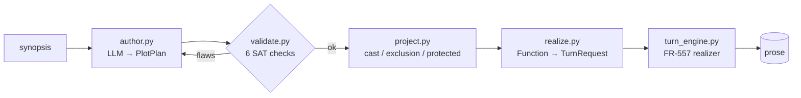

# Design: v3 Plot Model — Implementation Draft

**Status:** Implementation draft. The buildable companion to
[`plan-generative-plot-model.md`](plan-generative-plot-model.md) (the academic ADR). That
document argues *what* and *why* and keeps options open; **this document closes them**. Every
decision below is made, every type is concrete, every module has a home in the existing
`examples/dungeon_master/api/` tree. Read the ADR for the justification; read this to build.

**Companion docs:** [`plan-generative-plot-model.md`](plan-generative-plot-model.md) (decision
record), [`refactoring-plan.md`](refactoring-plan.md) (the v2 contract program this lands on),
[`architecture.md`](architecture.md) (v2 as-built).

---

## 0. Decisions locked

The ADR enumerated alternatives. Here they are resolved — no "either/or" survives into the build.

| Question (ADR) | Locked decision | Why this one |
|---|---|---|
| Build vs. embed a planner | **Embed [`unified-planning`](https://github.com/aiplan4eu/unified-planning) (Apache-2.0) as the causal solver; hand-write only the narrative checks.** Sabre stays a separate-process *oracle* for the M0 belief spike. | UP's `OneshotPlanner.solve()` *is* checks 1/5/6 (causal coherence, reachability, threat) — "no plan found" returns the open-condition flaw for free. We only hand-write the narrative-specific checks 2/3/4. A from-scratch POCL solver is wasted work. |
| Belief representation | **Belief-as-fluent.** `believes(Clan, alive(Arnulf))` is reified as an ordinary boolean fluent `bel_clan_alive_arnulf`, independent of the world fluent `alive_arnulf`. | Classical planners model no epistemics natively, but a reified belief atom needs none — the planner keeps world-truth and belief consistent automatically, and the floodmark distinction (world `alive`, belief `not alive`) is just two fluents. No belief-native planner (Sabre/Java) required in production. |
| Solver engine | **`fast-downward` with `astar(blind())` (complete search), pinned.** ~~`aries` preferred~~ — corrected as-built (FR-559 J3): `aries` *hangs* on untimed classical problems and no installed engine emits `UNSOLVABLE_PROVEN` (FD exits 12 → `UNSOLVABLE_INCOMPLETELY` even on a complete proof). A complete blind-A* exhaustion of the finite chapter-chain encoding *is* the proof. | A complete search proves unsolvability (the load-bearing negative); `aries`' partial-order output is moot when it never returns. Engines ship as separate wheels, so FD's GPL does not bleed into our code. The `PROVEN_UNSOLVABLE`/`GAVE_UP` discriminator preserves proof-vs-give-up. |
| Who authors `F`/`G` | **LLM up-front pass** (`synopsis → typed plan`), then deterministic SAT check with **bounded retry** (≤3), mirroring the v2 outline gate. | Reuses the v2 author-gate-retry pattern; keeps humans out of the inner loop. |
| First lane to ship | **Belief + monotonic-lifecycle**, strangler-fig onto the v2 `world_state` ledger. | Retires the reveal-timing class (the active floodmark defect) with the least surface area. |
| Plan representation | **Pydantic `PlotPlan`** (this doc §2), authored as JSON, parsed tolerantly at the boundary (like `parse_world_state`); compiled to a UP `Problem` by `api/plot/up_model.py`. | House style: typed island validated at entry, plain dict in storage. UP is an internal compile target, never the authoring surface. |
| Realizer | **v2 turn engine via `TurnRequest`/`TurnResult`** (refactoring-plan Contract B / FR-557). | The engine is already doc-free at the graph boundary; the plan feeds it. |
| Migration | **Strangler-fig.** Belief lane runs *alongside* v2 reconstruction, projecting the exclusion set; the SAT check gates only the belief/lifecycle lane in M1. | No big-bang rewrite; v2 stands while the lane proves out. |

---

## 1. Architecture at a glance

A new `api/plot/` package sits beside the v2 adapter modules. It is a **typed island with one
ingress (`author`) and two egresses (`validate`, `project`)** — the realizer reuses FR-557.

```
examples/dungeon_master/
  api/
    plot/                      # NEW — the v3 plot model (typed island)
      __init__.py
      schema.py                # PlotPlan + Function + Fluent + Belief + AffectDelta  (Pydantic)   [M1 ✓]
      up_model.py              # PlotPlan → unified_planning.Problem  (belief reified as fluents)   [M0 ✓]
      validate.py              # 1/5/6 via unified-planning, 2/3 hand-written → ValidationResult     [M0/M1 ✓; 4 = M3]
      project.py               # plan → chapter_cast / exclusion_set / protected_set                [M1 ✓]
      report.py                # human-inspectable table: protected / per-ch cast / exclusion / grounding  [M1 ✓]
      author.py                # boundary parse: LLM JSON → PlotPlan  (tolerant, like parse_world_state)  [M4]
      realize.py               # Function → TurnRequest  (binds to FR-557 turn_engine)              [M4]
    world_state.py             # v2 ledger — EXTENDED, not replaced (belief lane added)
    turn_engine.py             # FR-557 doc-free engine — the realizer
    chapter_nav.py             # FR-556 typed StoryDoc accessor — projection lands here
  prompts/
    author_plot_plan.yaml      # NEW — synopsis → typed plan (JSON output_schema)
  plot_plan.yaml               # NEW graph — author → validate (bounded retry)
```

Data flow (one book):



The LLM appears in exactly two places: `author` (writes the plan) and `turn_engine` (renders a
beat). It **never reads plot state back out of prose** — that inverse problem is deleted.

---

## 2. The schema (`api/plot/schema.py`)

Concrete Pydantic, house style (`from __future__`, `BaseModel`, `Field`, `Literal`, integer
ordinals for time). This is the **M4-target** vocabulary; the closed alphabets grow per milestone.
As-built (FR-560) the shipped `FunctionKind` is the 4-kind floodmark subset (`villainy`, `reveal`,
`reconciliation`, `return`), `AffectKind` is `loss`/`guilt`, and `FlawCode` is
`lifecycle_violation`/`ungrounded_reveal` — each widened only when a milestone's checks need it
(`regex_fourth_exclusion` discipline). The full alphabets below are the destination, not the
current state.

```python
"""Typed plot model for DM v3 (the generative spine).

A PlotPlan is authored BEFORE prose and validated by api/plot/validate.py. The
realizer (api/plot/realize.py → turn_engine) renders a plan that is already
proven consistent; plot state is never reconstructed from prose.

Pure: no LLM, no I/O. Stored as JSON; parsed at the boundary by api/plot/author.py.
"""

from __future__ import annotations

from typing import Literal

from pydantic import BaseModel, Field

CharacterId = str
Place = str

# The closed Propp-like function alphabet. Adding a kind is a deliberate vocab change.
FunctionKind = Literal[
    "villainy", "departure", "struggle", "victory", "reveal",
    "reconciliation", "death", "return", "pursuit", "rescue",
]
WorldPred = Literal["alive", "at", "faction", "rel", "holds"]
AffectKind = Literal[
    "loss", "retaliation", "betrayal", "reconciliation", "guilt", "hidden_blessing",
]
Grain = Literal["book", "chapter", "turn"]


class Fluent(BaseModel):
    """One world-truth atom. ``value`` is bool for alive/holds, str for at/faction/rel."""

    pred: WorldPred
    args: tuple[str, ...]                 # e.g. ("Arnulf",) or ("Arnulf", "H…llmark")
    value: bool | str = True

    def key(self) -> tuple[WorldPred, tuple[str, ...]]:
        return (self.pred, self.args)


class Belief(BaseModel):
    """Per-observer belief about a Fluent. ``held=False`` ⇒ believes-NOT."""

    observer: CharacterId
    fluent: Fluent
    held: bool = True


class AffectDelta(BaseModel):
    """Open or close one affect unit (Lehnert Plot Units)."""

    op: Literal["open", "close"]
    char: CharacterId
    kind: AffectKind


class Function(BaseModel):
    """One authored beat. Finite alphabet; grounded roles; typed pre/effects."""

    id: str
    kind: FunctionKind
    subject: CharacterId
    target: str | None = None
    observers: list[CharacterId] = Field(default_factory=list)
    chapter: int                          # scheduling ordinal (partial order refines it)
    grain: Grain = "chapter"
    cost_turns: int = 1                   # capped-reachability bound (check 5)

    pre_world: list[Fluent] = Field(default_factory=list)
    pre_belief: list[Belief] = Field(default_factory=list)
    pre_intent: list[str] = Field(default_factory=list)

    eff_world: list[Fluent] = Field(default_factory=list)   # asserted after the beat
    eff_belief: list[Belief] = Field(default_factory=list)
    eff_affect: list[AffectDelta] = Field(default_factory=list)


class PlotPlan(BaseModel):
    """⟨I, A, G, F, E⟩ — the whole authored plot."""

    initial_world: list[Fluent] = Field(default_factory=list)        # I (world)
    initial_belief: list[Belief] = Field(default_factory=list)       # I (belief)
    agents: list[CharacterId] = Field(default_factory=list)          # A
    goals: list[Fluent] = Field(default_factory=list)                # G — invariants
    functions: list[Function] = Field(default_factory=list)          # F
    order: list[tuple[str, str]] = Field(default_factory=list)       # E — (before_id, after_id)


class PlanFlaw(BaseModel):
    code: Literal[
        "open_condition", "lifecycle_violation", "ungrounded_reveal",
        "unclosed_affect", "unreachable", "causal_threat",
    ]
    function_id: str
    detail: str


class ValidationResult(BaseModel):
    ok: bool
    flaws: list[PlanFlaw] = Field(default_factory=list)
```

---

## 3. The validator (`api/plot/validate.py`)

The heart of v3. Pure, deterministic, no LLM. Six checks split by **who owns them**: an embedded
planner discharges the causal trio, hand-written passes own the narrative trio.

**The split (locked, see §0):**

| Check | Owner | Mechanism |
|---|---|---|
| 1 causal coherence | **`unified-planning`** | `OneshotPlanner.solve()` returns a plan ⇔ every precondition is establishable; a complete-search exhaustion (`PROVEN_UNSOLVABLE`, see §0 engine note) *is* the open-condition flaw |
| 5 capped reachability | **`unified-planning`** | action `cost_turns` → plan length bound; no plan within bound ⇒ `unreachable` |
| 6 causal-threat resolution | **`unified-planning`** | the solver's threat resolution (promotion/demotion) is native POCL |
| 2 monotonic lifecycle | **hand-written** | a narrative invariant the planner won't enforce — the floodmark keystone (below) |
| 3 belief grounding | **hand-written** | "no reveal of a thing nobody was wrong about" — narrative, not causal |
| 4 affect closure | **hand-written** | every opened affect unit has a later close — narrative debt, not a precondition |

**Belief-as-fluent** is what lets a *classical* planner carry checks 1/5/6 despite having no
epistemic model: each `Belief(observer, fluent, held)` compiles to an ordinary boolean fluent
(`bel_<obs>_<pred>_<args>`), independent of the world fluent. `F1` sets `bel_clan_alive_arnulf
:= false` while leaving `alive_arnulf := true`; an "Arnulf onstage at Ch3" action has precondition
`bel_onstage_alive_arnulf`, false until `Fr`, so **the planner cannot schedule it** — the
early-reveal class is unspellable, proven by a real solver, not asserted.

```python
"""Deterministic plan satisfiability check (api/plot/validate.py).

Checks 1/5/6 are discharged by an embedded unified-planning Problem
(api/plot/up_model.py); checks 2/3/4 are hand-written narrative invariants.
The recognition gates of v2 (reversal_pack_gap, composition_gap,
unplayable_beat_gap) collapse into checks 1, 5, 6.
"""

from __future__ import annotations

import unified_planning as up
from unified_planning.shortcuts import OneshotPlanner
from unified_planning.engines import PlanGenerationResultStatus as Status

from .schema import Fluent, Function, PlanFlaw, PlotPlan, ValidationResult
from .up_model import build_problem            # PlotPlan → up.Problem (belief reified)


def validate_plan(plan: PlotPlan) -> ValidationResult:
    flaws: list[PlanFlaw] = []
    flaws += _check_causal_solvable(plan)             # 1 + 5 + 6 (unified-planning)
    order = _topological_order(plan)                  # respects E; raises on cycle
    flaws += _check_monotonic_lifecycle(plan, order)  # 2 (hand-written)
    flaws += _check_belief_grounding(plan, order)     # 3 (hand-written)
    flaws += _check_affect_closure(plan)              # 4 (hand-written)
    return ValidationResult(ok=not flaws, flaws=flaws)


def _check_causal_solvable(plan: PlotPlan) -> list[PlanFlaw]:
    """Checks 1/5/6 via the embedded planner. A complete-search exhaustion ⇒ an
    open-condition / unreachable / unresolved-threat flaw — the planner does not
    distinguish, so we report a single causal flaw and let the lifecycle/grounding
    passes localize it.

    As-built (FR-559 J3): pin a COMPLETE config (`fast-downward` `astar(blind())`),
    NOT `aries` (it hangs on untimed classical problems). No installed engine emits
    `UNSOLVABLE_PROVEN` — FD exits 12 → `UNSOLVABLE_INCOMPLETELY` even on a proof — so
    `PROVEN_UNSOLVABLE = (UNSOLVABLE_PROVEN, UNSOLVABLE_INCOMPLETELY)` and the distinct
    `GAVE_UP = (TIMEOUT, MEMOUT, INTERNAL_ERROR)` set must FAIL (proves nothing)."""
    problem = build_problem(plan)                     # reifies belief as fluents
    with OneshotPlanner(name="fast-downward",
                        params={"fast_downward_search_config": "astar(blind())"}) as planner:
        result = planner.solve(problem)
    if result.status in up.engines.results.POSITIVE_OUTCOMES:
        return []
    return [PlanFlaw(code="open_condition", function_id="<plan>",
                    detail="no causal order satisfies all preconditions (unified-planning)")]


def _check_monotonic_lifecycle(plan: PlotPlan, order: list[Function]) -> list[PlanFlaw]:
    """Once world-truth says not-alive(c), no later function may assert world-truth
    alive(c). It MAY assert believes(obs, alive(c)) — that is the presumed-dead case.

    This is the single check that makes the floodmark premise representable and the
    'death that un-happens' bug ungrammatical. The planner won't enforce it because
    belief and world are independent fluents — that independence is the whole point.
    """
    flaws: list[PlanFlaw] = []
    dead: set[str] = {
        f.args[0] for f in plan.initial_world if f.pred == "alive" and f.value is False
    }
    for fn in order:
        for eff in fn.eff_world:
            if eff.pred != "alive":
                continue
            c = eff.args[0]
            if eff.value is False:
                dead.add(c)
            elif eff.value is True and c in dead:
                flaws.append(PlanFlaw(
                    code="lifecycle_violation",
                    function_id=fn.id,
                    detail=(
                        f"{fn.id} asserts world-truth alive({c}) after {c} died. "
                        f"Encode revival as belief: believes(observers, alive({c}))."
                    ),
                ))
    return flaws


def _check_belief_grounding(plan: PlotPlan, order: list[Function]) -> list[PlanFlaw]:
    """A 'reveal' function requires a prior belief it corrects:
    some observer must currently hold believes(obs, X) that the reveal flips.
    No reveal of a thing nobody was wrong about."""
    ...  # M1 deliverable


def _check_affect_closure(plan: PlotPlan, order: list[Function]) -> list[PlanFlaw]:
    """Every opened AffectDelta has a later 'close' of the same (char, kind), unless that
    (char, kind) is listed in plan.intentional_open (a per-unit allowlist, NOT a plan-level
    flag -- a single boolean would exempt every open affect and gut the check; FR-562 J1).
    Ordered pop-walk over `order`, not a symmetric count (close-then-reopen is debt, J3)."""
    ...  # M3 deliverable (FR-562, Enforced)


def _topological_order(plan: PlotPlan) -> list[Function]:
    """Order functions by chapter, refined by E edges; raise on cycle.
    Used only by the hand-written narrative passes; the causal trio (1/5/6) gets its
    order from the unified-planning solver, not from here."""
    ...
```

> **Checks 1, 5, 6 are not stubs — they are `build_problem` + `OneshotPlanner.solve()`.**
> The narrative passes (2, 3, 4) are the only Python we write. `api/plot/up_model.py` (the
> `PlotPlan → up.Problem` compiler, belief reified) is the M0 deliverable that unlocks them.

**The lifecycle check is the M0/M1 keystone** — fully written above because it is the one that
retires the active floodmark defect, and the planner *cannot* enforce it (belief and world are
independent fluents by design). The narrative passes are scheduled across milestones (§7).

---

## 4. Floodmark, encoded (the worked sample)

The premise that has defeated v2 all month, written as an actual `PlotPlan` literal. This is
both the M0 fixture and the regression corpus.

```python
from api.plot.schema import (
    AffectDelta, Belief, Fluent, Function, PlotPlan,
)

ARNULF, CLAN, HILDE = "Arnulf", "Clan", "Hilde"

floodmark = PlotPlan(
    agents=[ARNULF, HILDE],
    initial_world=[Fluent(pred="alive", args=(ARNULF,), value=True)],
    initial_belief=[Belief(observer=CLAN, fluent=Fluent(pred="alive", args=(ARNULF,)), held=True)],
    goals=[Fluent(pred="alive", args=(ARNULF,), value=True)],   # G: invariant through finale
    functions=[
        Function(
            id="F1", kind="villainy", subject=ARNULF, chapter=1, grain="turn",
            # WORLD-TRUTH STAYS ALIVE — only belief flips. (The floodmark distinction.)
            eff_world=[],
            eff_belief=[Belief(observer=CLAN, fluent=Fluent(pred="alive", args=(ARNULF,)), held=False)],
            eff_affect=[AffectDelta(op="open", char=HILDE, kind="loss")],
        ),
        Function(
            id="Fr", kind="reveal", subject=ARNULF, chapter=6, observers=[CLAN],
            pre_belief=[Belief(observer=CLAN, fluent=Fluent(pred="alive", args=(ARNULF,)), held=False)],
            eff_belief=[Belief(observer=CLAN, fluent=Fluent(pred="alive", args=(ARNULF,)), held=True)],
            eff_affect=[AffectDelta(op="close", char=HILDE, kind="loss"),
                        AffectDelta(op="open", char=HILDE, kind="guilt")],
        ),
        Function(
            id="Ff", kind="reconciliation", subject=HILDE, chapter=6,
            pre_belief=[Belief(observer=CLAN, fluent=Fluent(pred="alive", args=(ARNULF,)), held=True)],
            eff_affect=[AffectDelta(op="close", char=HILDE, kind="guilt")],
        ),
    ],
    order=[("F1", "Fr"), ("Fr", "Ff")],
)
```

The four historical break classes, now mechanically caught:

| Break class | Encoding move | Caught by |
|---|---|---|
| **Early reveal (Ch3)** | onstage beat needs `believes(onstage, alive(Arnulf))`, false on `[F1, Fr)` | `project.exclusion_set` excludes Arnulf in that interval |
| **Death-and-revival contradiction** | encode F1 as world-truth `not alive` ⇒ goal `alive` unsatisfiable | check 2 `lifecycle_violation` |
| **Dropped confrontation** | `Fr` opens `guilt(Hilde)`; deleting `Ff` leaves it open | check 4 `unclosed_affect` |
| **Intra-chapter revival (die t7, onstage t8)** | `F1.grain = "turn"` retires Arnulf for the chapter's remaining turns | grain, in `realize` |

The **GO test** is: `validate_plan(floodmark).ok is True`, and the same plan with F1's effect
moved to world-truth (`eff_world=[Fluent("alive",(ARNULF,),False)]`) yields one
`lifecycle_violation` flaw. That single assertion pair is the M0 acceptance test.

---

## 5. Projection replaces reconstruction (`api/plot/project.py`)

Everything v2 parsed out of prose is now read from the validated plan. Concrete signatures:

```python
"""Plan → derived sets (api/plot/project.py). Pure. Replaces the v2 reconstruction path."""

from __future__ import annotations

from .schema import PlotPlan


def chapter_cast(plan: PlotPlan, chapter: int) -> list[str]:
    """Subjects + targets + observers of functions scheduled at `chapter`."""


def exclusion_set(plan: PlotPlan, chapter: int) -> set[str]:
    """Characters the prose must NOT place onstage at `chapter`: those for whom
    no onstage observer believes alive, and who have not yet reached their reveal."""


def protected_set(plan: PlotPlan) -> list[str]:
    """Author invariants G, fed to BOTH the director and the final cut."""
```

| Derived set | v2 (reconstructed) | v3 (`api/plot/project.py`) |
|---|---|---|
| chapter cast | parsed from prose | `chapter_cast(plan, ch)` |
| exclusion set | inferred lifecycle ledger | `exclusion_set(plan, ch)` |
| protected set | bookkeeping precedence | `protected_set(plan)` (= `G`) |

These land on the FR-556 typed `StoryDoc` accessor (`chapter_nav`), so the projection has one
owner, not 21 reach-ins.

---

## 6. Authoring + realizing (the two LLM seams)

### 6a. Author (`prompts/author_plot_plan.yaml` + `plot_plan.yaml` graph)

The LLM turns a synopsis into a typed plan via `output_schema` (the `PlotPlan` JSON shape),
then the graph routes on the validator:

```yaml
# plot_plan.yaml  (new graph)
nodes:
  author_plan:
    type: llm
    prompt: author_plot_plan        # output_schema = PlotPlan JSON
    state_key: plan_json
  validate_plan:
    type: tool
    tool: plot.validate_plan        # wraps api/plot/validate.py
    state_key: validation
  route_validity:
    type: router
    condition: "validation.ok"
    routes:
      "true": done
      "false": repair_plan          # bounded retry (max_loops: 3)
  repair_plan:
    type: llm
    prompt: author_plot_plan        # re-prompt with validation.flaws in context
    state_key: plan_json
```

`author.py` is the tolerant boundary parse (mirrors `parse_world_state`): unknown fields
dropped, invalid predicates normalized, never trusting the provider's JSON shape blindly.

### 6b. Realize (`api/plot/realize.py` → FR-557 turn engine)

Each `Function` becomes a `TurnRequest` (refactoring-plan Contract B). The realizer renders the
beat against the **focalized** belief state — it cannot author world-truth.

```python
def to_turn_request(fn: Function, plan: PlotPlan) -> "TurnRequest":
    """Bind one authored beat to the doc-free turn engine.

    The realizer renders fn.eff_* as already-decided; it never writes back to the plan.
    Arnulf's grief in ch1-5 renders BECAUSE believes(clan, not alive(Arnulf)) — while
    world-truth alive(Arnulf) is untouched.
    """
    return TurnRequest(
        cast=chapter_cast(plan, fn.chapter),
        protected=protected_set(plan),
        instruction=_beat_instruction(fn),          # from fn.kind + effects
        belief_context=_focalize(fn, plan),         # what THIS beat's observers believe
        extras={"function_id": fn.id, "grain": fn.grain},   # opaque DM semantics
    )
```

---

## 7. Build sequence (milestones, each a testable deliverable)

Falsification-gated. Each milestone is a separately-judged FR; none merges without a RED test
proving the targeted break class is now caught.

| M | Status | Deliverable | Acceptance test (RED first) | Depends on |
|---|---|---|---|---|
| **M0** | ✅ **FR-559** | `schema.py` + `up_model.build_problem` (belief reified) + `solve_status` + `_check_monotonic_lifecycle` + floodmark fixture | `solve_status(floodmark) in POSITIVE_OUTCOMES`; world-truth-revival variant yields `lifecycle_violation`; **early-reveal variant `PROVEN_UNSOLVABLE`** (complete blind-A* exhaustion; Arnulf-onstage-Ch3 unspellable) | `unified-planning[fast-downward]` |
| **M0-spike (optional)** | deferred | Sabre oracle cross-check: floodmark as `.txt`, run JAR subprocess | Sabre independently confirms early-reveal unspellable, presumed-dead arc solves | Sabre (separate process) |
| **M1** | ✅ **FR-560** | Graduate `api/plot/` + `exclusion_set`/`chapter_cast`/`protected_set` + `_check_belief_grounding` + `report.py` + **live additive exclusion seam** in `chapter_open` | `exclusion_set(floodmark, 3)` excludes Arnulf, released at 6; ungrounded reveal flagged; seam unions into `must_exclude`; no-plan docs byte-identical | M0, **FR-556 (Enforced)** |
| **M2** | proposed **FR-561** | Causal trio hardened: `cost_turns` → per-chapter budget bound, phantom-reversal pure pre-check, threat scenarios proven via the planner | phantom-reversal plan yields `open_condition`; over-budget + threat plans `PROVEN_UNSOLVABLE` | M1 |
| **M3** | future | `_check_affect_closure` (hand-written) | dropped-confrontation plan yields `unclosed_affect` | M2 |
| **M4** | future | `realize.to_turn_request` + `author.py` + `plot_plan.yaml` graph wired end-to-end | floodmark renders 6 chapters with no continuity break in the witness metrics | M3, FR-557 |

M0+M1 (FR-559 + FR-560, both Enforced) retire the active floodmark defect — that is the shipped
strangler-fig increment. M0 is the **runnable spike** (FR-559): it proved an off-the-shelf planner
can tell floodmark before any DM code committed to the approach; M1 graduated it into the live
chapter-open director.

---

## 8. What this draft commits to (and what it still defers)

**Committed:** the `PlotPlan` schema (§2); the validator surface and the lifecycle check (§3);
the floodmark encoding as the regression fixture (§4); the projection signatures (§5); the
two-seam author/realize wiring (§6); the M0→M4 sequence (§7); strangler-fig migration on the v2
ledger.

**Deferred to the implementing FRs (not re-opened — parameterized):**
- Exact retry budget and repair-prompt phrasing in `plot_plan.yaml` (M1 tuning).
- Solver engine choice within `unified-planning` (`aries` vs `fast-downward`) — a `problem.kind`
  selection detail, not an architecture fork.
- Whether the Sabre oracle becomes a standing CI cross-check or a one-off M0 confirmation.
- Top-K fine-grain economics (FR-516 carry-forward): grain="turn" only for characters with an
  open belief-gap or affect-debt — an optimization, not a correctness question.
- The untyped physical/positional lane (`continuity-issues.md` §4) — addable behind the same
  validator boundary, still out of M0–M4 scope.

These are knobs, not forks. The architecture above does not change based on how they settle.
