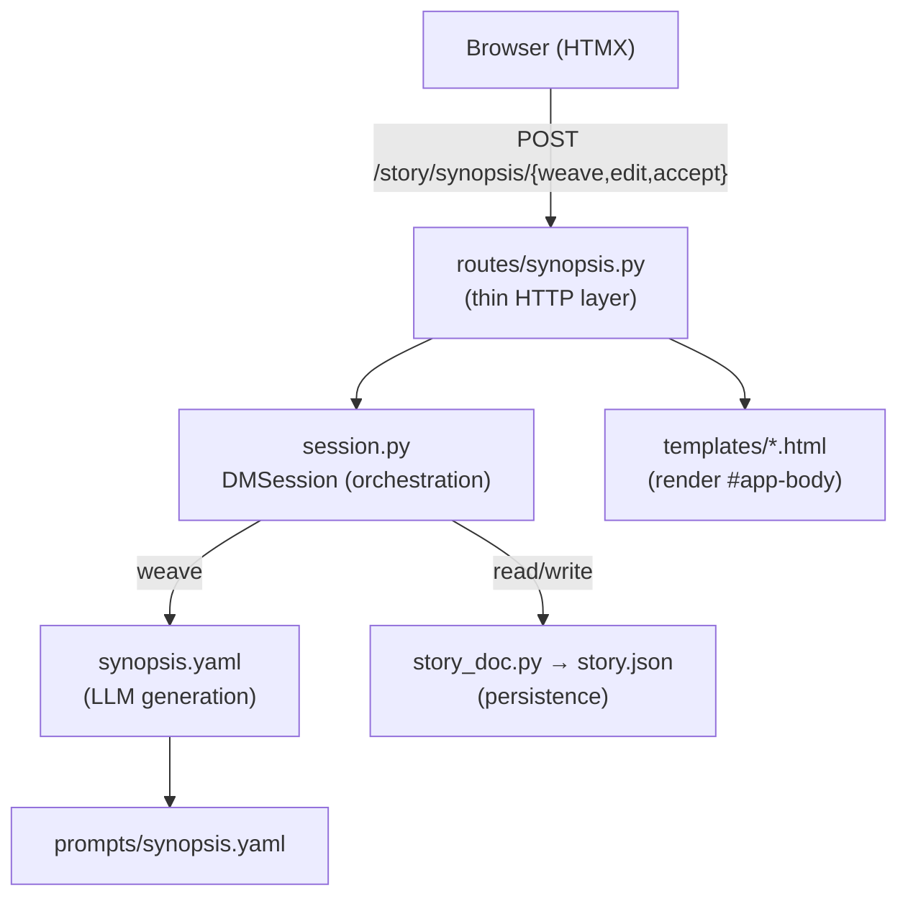

# Phase 1 — Synopsis

The first functional slice of Dungeon Master v2 and the skeleton for everything
that follows. One screen, one artifact (a synopsis), one generation mode.

## Goal

Interactive generation of a single full-disclosure synopsis: the writer gives a
tagline, the system writes the synopsis, and the writer iterates on it in natural
language until it reads true, then accepts it.

Everything beyond this — outline, chapters, characters, counts, durable sessions
— is deliberately out of scope and lives in [`../purgatory/`](../purgatory).

## The loop

```
weave (Iterate)  → graph runs synopsis.yaml, writes the synopsis
   ↑   ↓
edit (autosave)  → overwrites the synopsis text on change
   ↓
accept           → reviewed: true, the card becomes read-only
```

There is exactly **one generation mode**, `weave`:

- **Empty draft** → the prompt is the premise → first synopsis is written.
- **Non-empty draft** → the prompt is a change → it is applied to the draft.
- **Empty prompt** → pure save (no LLM call).

Generate and iterate are the same operation; the only difference is whether a
draft already exists. There is no separate "Generate" button.

## Structure



The three-layer pattern, applied:

| Layer | Files | Responsibility |
|-------|-------|----------------|
| Presentation | `api/app.py`, `api/routes/synopsis.py`, `api/templates/` | FastAPI routes, HTMX swaps of `#app-body`, session id |
| Logic (YAML) | `synopsis.yaml`, `prompts/synopsis.yaml` | The one LLM call: `draft` + `instruction` → `synopsis` |
| Side effects | `api/story_doc.py` | Read/write `story.json` |
| Adapter | `api/session.py` | `DMSession` glues HTTP ↔ graph ↔ doc; `StageView` view model |

### UI states

Rendered by `api/templates/components/stage_card.html`:

1. **Editing** — synopsis textarea (autosaves), a prompt box seeded with the
   tagline on the first turn, and the **Iterate** / **Accept** buttons.
2. **Accepted** — read-only prose (`white-space: pre-wrap` preserves the line
   breaks) plus an "Accepted ✓" badge. On Accept the app advances to the next
   stage (Phase 2: Plot) rather than dead-ending.

## Persistence

Yes, the synopsis is saved. Every action persists to a per-session JSON file at:

```
outputs/dungeon-master/<session_id>/story.json
```

written by `api/story_doc.py`. The document is **staged** (Phase 2 added the
`plot` stage; the shape generalizes to any number of stages):

```json
{
  "tagline": "...",
  "stage": "synopsis",
  "synopsis": { "text": "the full prose", "reviewed": false }
}
```

- **weave** writes the current stage's `text` and sets its `reviewed: false`.
- **edit** overwrites the current stage's `text` (autosave on textarea change).
- **accept** sets the current stage's `reviewed: true` and advances `stage` to
  the next one (see [phase_2_plot.md](phase_2_plot.md)).

### Limits of this version

- **Session-scoped, not durable across reloads.** `session_id` is a fresh
  `uuid[:8]` minted on every `GET /` (returned in the `x-session-id` header,
  carried in the live HTML via `hx-include`). Reloading the page mints a new
  session; the old `story.json` remains on disk but nothing links back to it.
  There is no resume or list UI yet.
- **No checkpointer.** The graph compiles without one — generation is stateless.
  All persistence is the JSON file, not LangGraph state.

## Files

| Path | Role |
|------|------|
| `synopsis.yaml` | Single-node graph: `draft` + `instruction` → `synopsis` |
| `prompts/synopsis.yaml` | Full-disclosure synopsis prompt (reveal everything, name every character) |
| `api/app.py` | FastAPI app; `GET /` lands on the seeded card, sets `x-session-id` |
| `api/routes/synopsis.py` | `POST /story/synopsis/{weave,edit,accept}` |
| `api/session.py` | `DMSession` orchestration + `StageView` |
| `api/story_doc.py` | Per-session `story.json` read/write |
| `api/templates/` | `base.html`, `index.html`, `components/{app_body,breadcrumb,stage_card,error}.html` |
| `tests/test_synopsis_prototype.py` | Walkthrough visibility harness (not a governance gate) |

## Run

```bash
uvicorn examples.dungeon_master.api.app:app --reload --port 8000
```

Generation calls a real LLM, so a provider must be configured (e.g.
`ANTHROPIC_API_KEY`, or `PROVIDER` + the matching key).

Tests (mocked, no API key needed):

```bash
pytest examples/dungeon_master/tests/test_synopsis_prototype.py --no-cov
```
