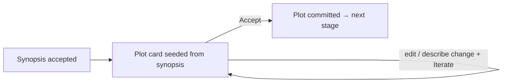

# Phase 2 — Plot (sketch)

> Status: **sketch, not built as of writing.** This records the reflection from
> mining `purgatory/preplan.yaml` and the decision that shapes Phase 2.

## What the old preplan spine contained

`purgatory/preplan.yaml` was a linear, fire-and-forget pipeline:

```
synopsis → plot → chapters → cast → save_story → END
```

Phase 1 reborn only `synopsis`. The remaining stages:

| Step | Output | Shape | Depends on |
|------|--------|-------|------------|
| `plot` | three-act arc (`acts[]`) | JSON | synopsis |
| `chapters` | chapter list | JSON | synopsis + plot |
| `cast` | principal characters | JSON | synopsis + plot |
| `save_story` | `story.json` + per-chapter files | side effect | all above |

## The tension this surfaced

The preplan spine and the v2 doctrine are philosophically opposed. The old spine
ran all stages in one `graph run`, asking for `chapter_count`/`cast_size` up front
as `--var` inputs. The v2 north star is the inverse: one artifact at a time,
human-in-the-loop, *numbers emerge later*. So no node can be lifted as-is — each
must become **its own iterable card stage**, the way synopsis did.

### The decision that gates Phase 2: prose, not JSON

`plot`/`chapters`/`cast` were all `parse_json: true` (structured objects). The
v2 iterable card edits **prose**, not lists of typed fields. Two paths:

- **(a) Keep the prose card.** Render each artifact as plain editable prose; the
  LLM re-reads it on Iterate. Uniform UX, one card type, honors "always one
  keystroke from changing anything". Loses field-level structure.
- **(b) Build a structured list card.** Per-item edit/iterate. More faithful to
  the data, but a second card type and much more surface.

**Decision: (a) for as long as it holds.** Plot in v2 is a plain-prose three-act
arc — concrete, reveal-all, same card and same `weave` mechanic as synopsis. We
do not introduce a structured editor until a stage genuinely needs one.

## Why plot is the right Phase 2

- It depends on **nothing but the accepted synopsis** — the cheapest place to
  answer the prose-vs-structured question once.
- `chapters` and `cast` are **siblings** (both depend only on plot), not a
  sequence — they wait until the prose-card pattern is proven on plot.
- Counts (`chapter_count`, `cast_size`) stay out until they *emerge* from the
  work, per doctrine.

## Target flow



Accept on synopsis stops dead-ending and **advances** to the plot card. The
breadcrumb (`Story · Synopsis` → `Story · Plot`) finally carries a real
progression — that is what it was built for.

## Shape changes Phase 2 requires

- **Story doc grows a stage cursor.** `story.json` is currently flat
  (`tagline`/`synopsis`/`reviewed`). It needs a notion of the current stage and a
  `plot` field with its own `reviewed` flag, e.g.
  `{ "stage": "plot", "synopsis": {...}, "plot": {"text": "...", "reviewed": false} }`.
  Decide the schema now rather than retrofit.
- **`weave` generalizes over stages.** The single weave mode already does
  "draft + instruction → prose"; plot adds upstream context (the accepted
  synopsis) as a variable. Either a `plot.yaml` graph mirroring `synopsis.yaml`,
  or one parameterized weave graph keyed by stage.
- **Accept routes forward.** `accept_synopsis` becomes "mark reviewed **and**
  set stage = next", and the card renders whichever stage is current.

## Out of scope for Phase 2

- `chapters`, `cast`, `save_story` per-chapter files, the turn-loop play graph.
- Any structured (non-prose) editor.
- Asking for counts up front.
