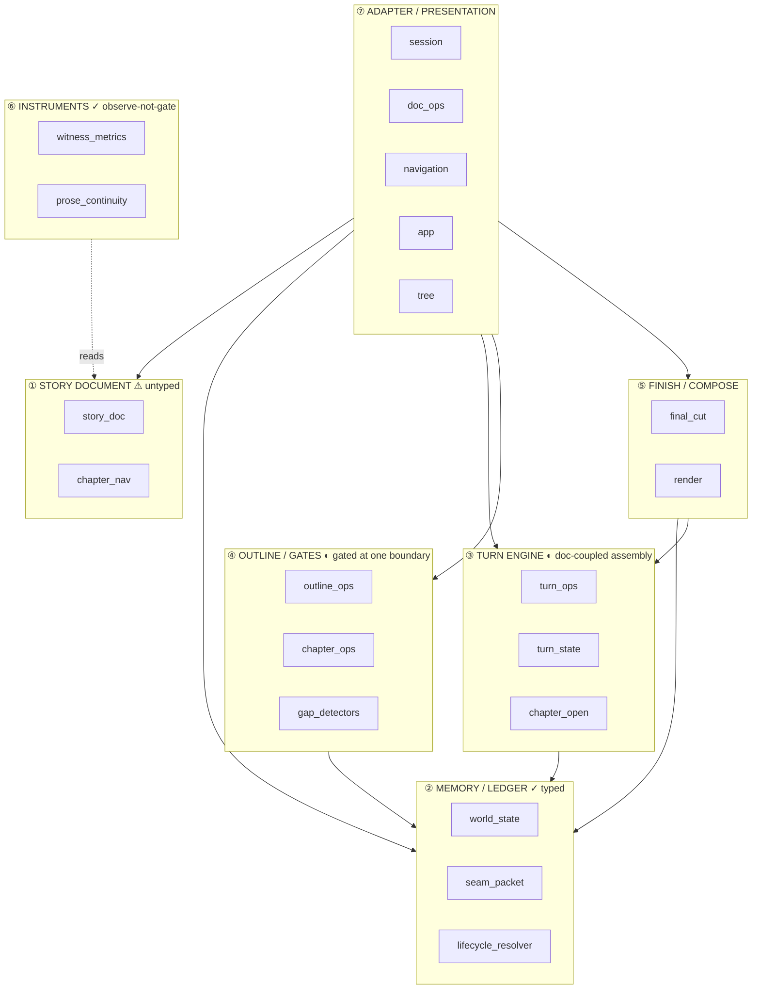

# Dungeon Master — Refactoring Plan (the contract program)

**Status:** Reference plan. The point of origin for the refactoring FRs that follow.
**Created:** 2026-06-21, from the FR-474 → FR-555 component analysis.
**Companion docs:** [`architecture.md`](architecture.md) (the v2 *how*),
[`continuity-issues.md`](continuity-issues.md) (the gap analysis),
[`v3-rewrite-guidance.md`](v3-rewrite-guidance.md) (the projection thesis).

> **Thesis.** v2's two strongest results — relationship memory and the chapter seam —
> both came from the *same* move: **a typed contract normalized at the boundary where
> the data enters** (`world_state`, `seam_packet`). The residual defects cluster at the
> **three boundaries where that move has not yet been made**: the story document, the
> turn payload, and the gate-to-artifact binding. This plan turns those three into typed
> contracts. Every item is **additive and v2-shippable** — it does not require the v3
> rewrite, and it makes that rewrite cheaper.

---

## 1. Why now, and why contracts

The component analysis (33 modules, 7301 lines) found that DM v2 has **two typed
islands floating in an untyped dict**:

- `world_state.py` (imported by 9 modules) and `seam_packet.py` (7) are Pydantic-typed,
  grounded at their boundary, and are exactly where continuity is *strong*.
- The story `doc` that carries them is an **untyped `dict`** whose shape
  (`doc["chapters"]["cards"][cid]["turns"][n]["recap"]["text"]`) is **re-derived inline
  in 14 of 32 modules** (~29 raw reach-in sites). An accessor module (`chapter_nav.py`)
  already exists and is imported by **10** modules — but it is **not the sole accessor**:
  6 of those importers still mix its typed getters with raw `doc[...]` reads, and there is
  **no typed setter at all**.

This is the governing law of the codebase applied unevenly. *Where the contract is
typed, the defects stopped. Where it is implicit, they persist.* The refactoring program
is to finish applying the one move that already worked.

> **The one law (Scripture).** Normalize at the boundary where external/derived data
> enters, not downstream where it manifests. A contract is how that normalization is made
> permanent and re-used.

---

## 2. The seven components

The dependency graph clusters the modules into seven components. Two have strong
contracts; three need one; two are healthy glue.

| # | Component | Modules (representative) | Contract today |
|---|-----------|--------------------------|----------------|
| ① | **Story document** | `story_doc`, `chapter_nav` | ⚠ **Untyped dict; `chapter_nav` partially adopted (10 importers), no typed setter; 14 modules still reach in raw** |
| ② | **Memory / Ledger** | `world_state`, `seam_packet`, `lifecycle_resolver`, `ledger_reconcile`, `allegiance_ledger` | ✓ **Typed, grounded, tested** (the model to copy) |
| ③ | **Turn engine** | `turn_ops`, `turn_state`, `character_overlay`, `chapter_open` | ◐ Graph payload is doc-free; assembly + gating fused into the loop |
| ④ | **Outline / Gates** | `outline_ops`, `chapter_ops`, `gap_detectors`, `composition_gap` | ◐ Detectors typed, but **bound to one call site**, not the artifact |
| ⑤ | **Finish / Compose** | `final_cut`, `render`, `cast_entrances`, `seam_entrance` | ✓ Pure, raises-on-empty; depends on ① and ② |
| ⑥ | **Continuity instruments** | `witness_metrics`, `cue_metrics`, `prose_continuity`, `fact_reversal`, `prompt_salience`, `chapter_replay` | ✓ Pure, deterministic, **observe-never-gate** |
| ⑦ | **Adapter / Presentation** | `session`, `doc_ops`, `navigation`, `app`, `tree` | ✓ Thin glue; shrinks automatically once ① is typed |



---

## 3. The three contracts to introduce

Each is a typed boundary that does not exist yet. Each maps to a track of refactoring FRs.

### Contract A — `StoryDoc` (component ①) · highest leverage

**Problem.** The doc shape is an implicit schema reached into by 14 modules (~29 sites), and the
`chapter_nav` accessor is only partially adopted (10 importers, no typed setter). Renaming a
key is a grep-and-pray; a new authoring path (FR-555's reoutline) can write a malformed
card and nothing catches it because there is no setter to catch it.

**Contract.** A typed `StoryDoc` (Pydantic, or `TypedDict` + a single accessor) defining
`synopsis / characters / chapters / cards / turns / recap` and the typed sub-objects that
already exist (`world_state`, `seam_packet`). `chapter_nav` becomes the **sole** accessor;
every read goes through a typed getter, every structural write through a typed setter.

**Why it helps v2 now.** A key rename becomes one line. The instruments (⑥) stop
re-deriving paths. Most important: **every `beats`/card write funnels through one typed
setter**, which is the structural place to bind the gates (Contract C) — closing the
FR-555 "second ungated boundary" class by construction.

**Migration shape (additive, behavior-preserving):**
1. Define the type; assert the live doc validates against it (a characterization test).
2. Make `chapter_nav` the typed accessor; re-export current helpers through it.
3. Migrate reach-in sites cluster by cluster — **instruments first** (⑥, read-only,
   safest), then planning/finish, then the adapter. Each migration is its own FR/commit.

### Contract B — `TurnRequest` / `TurnResult` (component ③)

**Problem.** `invoke_turn` fuses three concerns: prompt assembly (`running_scene`,
`_beats_block`), DM gating (roster scoping, lifecycle/memory gates), and the actual engine
(graph call + the beat/phase FSM + intent normalization). The graph payload is already
**doc-free** — the coupling is entirely in the Python that *builds* and *writes back* that
payload.

**Contract.** A typed `TurnRequest` (`cast`, `scene`, `turn_n`, `instruction`, opaque
`extras` for DM-semantic vars like `protected` / `gone_this_chapter`, `beats`,
`prior_direction`) and a typed `TurnResult` (`intents`, `direction`, `recap`). A
`turn_engine` module owns only: graph invocation + the beat-FSM (`_satisfied_indices` /
`_apply_beat_ledger` / `_phase_for_count`, already pure and tested) + typed normalization.
Assembly and gating stay in the adapter as the **projection** that builds the request.

**Why it helps v2 now.** The turn engine stops being an authoring boundary you must
remember. The beat-FSM — the single most reusable unit in the codebase — gets a name and a
contract. v3 keeps this engine verbatim and builds its projection layer around the request.

### Contract C — gate binds to the artifact, not the call site (component ④)

**Problem.** `reversal_pack_gap`, `unplayable_beat_gap`, `composition_gap` are applied
*only* inside `outline_chapters`. The FR-523 reoutline is a second authoring boundary that
re-enters the exact defect they prevent (FR-555). A gate bound to a call site cannot guard
an artifact written elsewhere.

**Contract.** The chapter-card gate set is a named list applied by **any** code that writes
a chapter card — ideally the typed setter from Contract A. "Author a chapter card" becomes
one funnel with one gate battery (detect → feedback retry → raise).

**Why it helps v2 now.** Closes the FR-555 class structurally rather than per-incident. New
authoring paths inherit the gates for free. This is `detection_without_enforcement` retired
at the boundary instead of at one call site.

---

## 4. Sequencing and dependencies

```
Contract A (StoryDoc)  ─┬─▶ enables ─▶  Contract C (gate-on-write)
                        └─▶ simplifies ─▶ Contract B (TurnRequest write-back)
```

- **A is the keystone** — do it first; B and C both get cheaper once the doc is typed.
- A migrates **incrementally** (instruments → planning/finish → adapter); it never needs a
  big-bang commit.
- **C can ship a minimal version before A completes** (extract the gate list, call it from
  both `outline_chapters` and `reoutline_chapter_beats` — this is essentially FR-555), then
  fold into the typed setter once A lands.
- **B is independent of A's completion** but reads cleaner after it; it can proceed in
  parallel.

**FR tracks (drafted, Status: Proposed):**
- *Track A* — **FR-556** typed `StoryDoc` accessor (instruments migration first), then
  per-cluster migration follow-up FRs.
- *Track B* — **FR-557** `TurnRequest`/`TurnResult` + `turn_engine` extraction.
- *Track C* — **FR-555** (minimal gate-on-reoutline) → **FR-558** gate-on-write funnel.

---

## 5. Guardrails (so the refactor stays honest)

- **No behavior change without a test.** Each migration commit is characterization-tested
  against the live doc shape before and after (RED only where behavior is *meant* to change
  — e.g. Contract C's new raise).
- **Instruments stay instruments.** Component ⑥ must remain observe-never-gate through the
  migration; do not let a typed setter tempt a witness into raising.
- **No speculative contract surface.** Type only what the 21 reach-in sites actually read.
  Do not invent fields for hypothetical v3 needs (the Scripture's *purge*). v3's extra
  fields are added when v3 needs them.
- **One concern per commit.** A type definition, an accessor consolidation, and a call-site
  migration are three commits, not one — clear blame, clear revert.
- **Example-exempt regime holds (FR-474 J3).** No `@pytest.mark.req`, no capability YAML,
  no CI gate; changelog fragments `scope: examples`, no `req:`.

---

## 6. What this plan is *not*

- **Not the v3 rewrite.** Every item here ships against current v2. v3 is the change in the
  *direction of truth* (reconstruction → projection) described in
  [`v3-rewrite-guidance.md`](v3-rewrite-guidance.md); this plan makes v2's contracts crisp so
  that change starts from a typed, gated base instead of an untyped one.
- **Not a continuity fix in itself.** Contracts A/B/C remove *classes of regression* and make
  the next continuity lane (the untyped positional/prop micro-state, `continuity-issues.md`
  §4) addable behind a typed boundary — they do not, alone, add that lane.
- **Not a module-count reduction goal.** The aim is fewer *implicit contracts*, not fewer
  files. A new `turn_engine` module is a win even though it adds a file.
