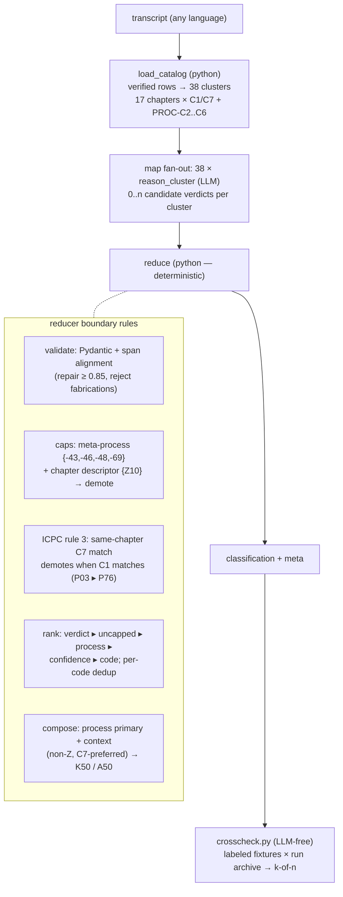

# ICPC-2 RFE Classifier (FR-722/724/725/727/730)

> **Purpose: YAMLGraph demo and research vehicle.** This example
> exists to demonstrate the framework's map/reduce pattern on a real
> taxonomy and to research LLM-classification discipline (verdict
> inflation, evidence fidelity, measurement-gated fixes — see the
> FR-72x arc). It is **not** a clinical or production coding tool: no
> calibration, no clinical validation, synthetic fixtures only.

Classifies a freeform encounter transcription into ICPC-2 **Reason for
Encounter** code(s) with titles, verdicts, short reasoning, and — for
process-code primaries — the composed combined code (K86 context +
`-50` → **K50**).

Phase ladder and per-phase evidence: see [PLAN.md](PLAN.md)
(FR-722, 724, 725, 727, 730 completed; FR-726 gated).
This example is the reference implementation of the generic
[Coded-Classification Pattern](../../reference/patterns/coded-classification.md).

## Architecture

One LLM judgement per cluster; everything else is deterministic code.



Data flow guarantees: evidence spans in the output are verbatim
transcript substrings *by construction*; candidate codes must exist in
the generated catalog (dropped process sigils repaired, inventions
rejected); the reducer never calls an LLM.

## Setup — generate the catalog first (required)

The ICPC-2 rubric data is **© Wonca** and is never committed to this
repository. You download it yourself, under your own acceptance of the
[Wonca licensing terms](http://www.ph3c.org/4daction/w3_CatVisu/en/rules-%26-ethics.html?wCatIDAdmin=1101),
from the official WICC-delegated repository (Norwegian Directorate of
Health). Two steps, both offline (no LLM key needed):

```bash
# 1. Download ICPC-2e-v7.0 (~290 kB) to tmp/ — your acceptance of Wonca terms
curl -L -o tmp/ICPC-2e-v7.0.zip \
  'https://www.helsedirektoratet.no/digitalisering-og-e-helse/helsefaglige-kodeverk/icpc/icpc-2e--english-version/_/attachment/inline/7c5c8e7f-8c5a-4a0d-97a7-49bb144a162c:22fb4d59b1033d44af1da42cb84897cb363f7136/ICPC-2e-v7.0.zip'

# 2. Generate the catalog (verifies sha256, parses ClaML)
python examples/icpc-2-rfe/nodes/build_catalog.py
# ✓ 726 rubrics → examples/icpc-2-rfe/data/icpc2_rfe_catalog.yaml (gitignored)
```

Run without arguments the builder expects `tmp/ICPC-2e-v7.0.zip`; a
different zip location can be passed as the first argument. If the zip
is missing or its sha256 differs from the pinned digest, the builder
refuses with the download URL — it never parses unverified input.

Running the classifier additionally needs an LLM provider key in the
environment (e.g. `AZURE_AI_API_KEY`/`ANTHROPIC_API_KEY` — see the
repo-root README for providers). The builder and the crosscheck
harness's default mode are LLM-free.

## Run

The runner classifies a transcript file (or stdin) and prints only the
answer; every run is archived for crosscheck as
`logs/icpc2-rfe/<input>-<timestamp>.{log,result.json}`:

```bash
examples/icpc-2-rfe/classify.sh examples/icpc-2-rfe/data/labeled/hp36-renewal-behalf.md

echo "Patient calls because of a dry cough for two weeks, worse at night." \
  | examples/icpc-2-rfe/classify.sh
```

```
PRIMARY
  K50 (-50)  Medication/prescription/renewal  [match, 0.99]
      context: K86 Hypertension uncomplicated
      The caller explicitly states the reason for contact is to renew ...
      evidence: "Haluaisin uusia hänen verenpainelääkereseptinsä."; ...
SECONDARY
  -62  Administrative procedure  [match, 0.98]
  ...
coverage: ICPC-2e-v7.0, components [1, 2, 3, 4, 5, 6, 7], 38 clusters, 44 candidates
run archived: logs/icpc2-rfe/hp36-renewal-behalf-20260714_152018.log + ...
```

Raw invocation (prints the entire graph state — large):

```bash
yamlgraph graph run examples/icpc-2-rfe/graph.yaml \
  --var transcript="Patient calls because of a dry cough for two weeks, worse at night." \
  --full 2>/dev/null | python3 examples/icpc-2-rfe/nodes/show_result.py
```

## Crosscheck harness (FR-725)

Labeled fixtures live in `data/labeled/` (`<name>.md` transcript +
`<name>.label.yaml` expectations with rationale). The harness evaluates
the run archive LLM-free and reports raw k-of-n agreement:

```bash
python3 examples/icpc-2-rfe/nodes/crosscheck.py            # existing archives
python3 examples/icpc-2-rfe/nodes/crosscheck.py --runs 5   # fresh baseline (slow, keys)
python3 examples/icpc-2-rfe/nodes/crosscheck.py --json     # machine-readable
```

Labels are rank-tolerant (`primary_any_of`) and coverage-aware
(`valid_for_components` — mismatched runs are skipped loudly). Advisory
report by design: no CI gate.

Output (state keys `classification` + `meta`):

```yaml
classification:
  primary:   {code: "-50", combined_code: K50, title: Medication/prescription/renewal,
              verdict: match, confidence: 0.99,
              chapter_context: {code: K86, title: Hypertension uncomplicated}, ...}
  secondary: []          # multi-label when justified
  low_confidence: false  # true + best_partial when nothing reaches "match"
  best_partial: [...]
meta:
  catalog_version: ICPC-2e-v7.0
  catalog_coverage: {components: [1, 2, 3, 4, 5, 6, 7], clusters_evaluated: 38}
```

## Contracts (enforced by tests, `tests/unit/test_fr72*_*.py`)

- **Evidence honesty** (FR-722): the model's `evidence_spans` are
  claims — the reducer aligns each claim to the transcript and outputs
  the verbatim substring (case-folds/quote-wrapping/1-char drift
  repaired at ≥ 0.85 similarity; below = fabrication, run fails).
  Five span failure shapes were field-collected; LLM quoting is
  fragile, so copying is done in code.
- **Catalog honesty** (FR-722/724): candidate codes must exist in the
  catalog (dropped process sigils "48"→"-48" repaired); coverage is
  declared in `meta` so "no match" is interpretable.
- **Verdict discipline in code** (FR-727/730): encounter-descriptor
  rubrics (`-43,-46,-48,-69`, `Z10`) can never reach primary/secondary
  — demoted, evidence preserved in best_partial; a same-chapter
  symptom match demotes diagnosis matches (ICPC practical rule 3);
  prompt discipline alone failed three times, hence code.
- **Deterministic ranking** (FR-722/724): verdict → uncapped-first →
  process-over-chapter (RFE primacy) → confidence → code; per-code
  dedup; no reducer LLM call.
- **Composition** (FR-727/730): process primaries compose
  `combined_code` from the best clinical context (non-Z, diseases
  preferred); chapter A when contextless.
- **Provenance** (FR-722): every generated row is `verified` with
  `source_reference: ICPC-2e-v7.0/<code>`; hand-added rows are
  `provisional` and excluded unless `--var include_provisional=1`.

## Assumptions / limits

- Research demo: confidence values are uncalibrated (within-rank
  tie-break only); no clinical validation; labeled fixtures are
  synthetic and non-clinical.
- Prompts are English; Finnish transcripts are field-proven (span
  alignment and rule mechanics are language-independent). Known open
  residuals are measured, not hidden: A13 over-claiming ~4/29, context
  churn among plausible clinical codes — see PLAN.md and the FR-730
  implementation notes.
- The committed `data/fixture_catalog.yaml` is a paraphrased 5-row
  test fixture, not clinical data.
