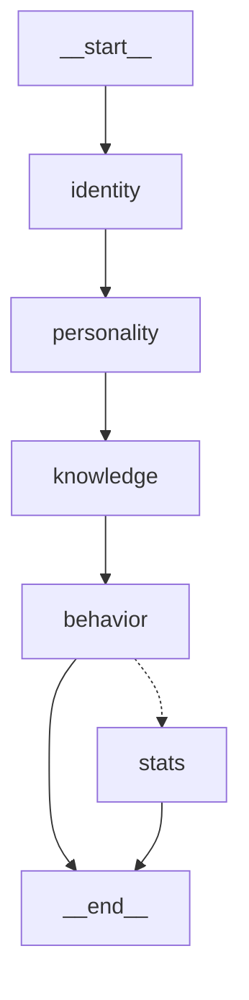
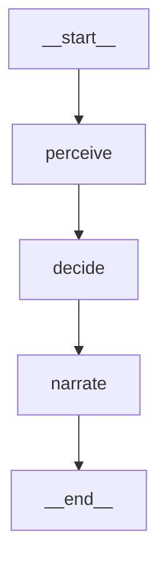

# NPC Generator - YAMLGraph Example

D&D NPC creation pipeline ported from Python to pure YAML graphs.

## Graphs

### NPC Creation (`npc-creation.yaml`)

Generate complete D&D NPCs from a concept:

```bash
yamlgraph graph run examples/npc/npc-creation.yaml \
  -v 'concept=grumpy dwarf blacksmith with a secret past'
```

**Pipeline flow:**


**Options:**
- `-v 'race=Dwarf'` - Specify race
- `-v 'character_class=Fighter'` - Specify class
- `-v 'location=The Red Dragon Inn'` - Where they're found
- `-v 'include_stats=true'` - Generate D&D 5e stats

### Encounter Turn (`encounter-turn.yaml`)

Process NPC actions in an encounter:

```bash
yamlgraph graph run examples/npc/encounter-turn.yaml \
  -v 'npc_name=Thorek Ironbellow' \
  -v 'location=The Rusty Anchor tavern' \
  -v 'recent_events=A hooded figure just entered'
```

**Pipeline flow:**


## Prompts

All prompts use Jinja2 templates with inline schemas for structured output:

- `prompts/npc/identity.yaml` - Name, race, appearance, voice
- `prompts/npc/personality.yaml` - Traits, ideals, bonds, flaws
- `prompts/npc/knowledge.yaml` - World, local, and secret knowledge
- `prompts/npc/behavior.yaml` - Goals, triggers, combat style
- `prompts/npc/stats.yaml` - D&D 5e ability scores
- `prompts/encounter/perceive.yaml` - What the NPC notices
- `prompts/encounter/decide.yaml` - What action to take
- `prompts/encounter/narrate.yaml` - Scene description

## Example Output

```
🚀 Running graph: npc-creation.yaml

📝 Generating identity...
   ✓ Thorek Ironbellow, Dwarf Blacksmith

📝 Generating personality...
   ✓ Gruff, Protective, Haunted by past

📝 Generating knowledge...
   ✓ 3 world facts, 4 local rumors, 2 secrets

📝 Generating behavior...
   ✓ Neutral disposition, 3 goals, 4 triggers

============================================================
RESULT
============================================================
{
  "name": "Thorek Ironbellow",
  "race": "Dwarf",
  "appearance": "Stocky even for a dwarf, with burn scars...",
  ...
}
```

## Ported From

Originally implemented in Python:
- `npc/showcase/npc_builder.py` (~250 LOC)
- `npc/showcase/nodes/npc_nodes.py`

Now pure YAML: ~150 lines total.
