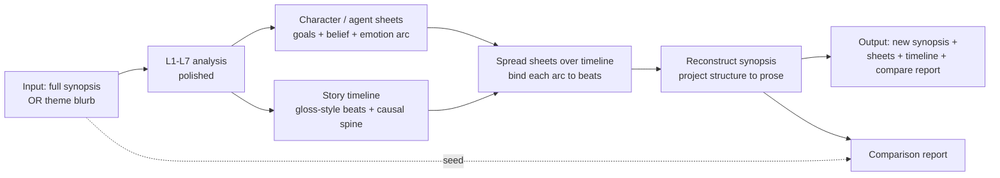

# Plan: The Generative Round-Trip — Synopsis In, Synopsis Out

**Date:** 2026-06-27
**Status:** Proposed (high-level architecture). This is the *destination* the measurement re-leveling
serves; [plan-next-phase.md](plan-next-phase.md) (steps N1–N6) is the prerequisite that makes the
analysis half honest enough to project back out.
**Companions:** [reflections-L1-L6.md](reflections-L1-L6.md) (why analysis alone was the wrong frame),
[status-L1-L7.md](status-L1-L7.md) (the per-layer verdicts this loop inherits),
[`../../dungeon_master/docs/research-results-modeling-plot.md`](../../dungeon_master/docs/research-results-modeling-plot.md)
(authored-and-projected, not recognised-back-out).

---

## The reframe in one line

The seven layers were built to **recognise** a plot from a synopsis and were graded on recall against
an authored gold. The research and the L1–L7 results both say the same thing: **plot is authored from
a closed vocabulary and projected into prose, never reliably recognised back out of it.** So the
pipeline's real job is not to *score* against gold — it is to *author* a structure and *project it
back into a new synopsis*. The input synopsis becomes a **seed**, not an answer key.

This dissolves the bottleneck the whole L1–L7 effort was straining against: hand-authoring per-layer
gold for the deep lanes (belief, goals, world, affect). In a round-trip, **the reconstruction is the
gold.** What survives synopsis → structure → synopsis' tells us which lane carried signal and which
lane dropped it — no per-layer answer key required.

---

## Hard requirement: this is a YAMLGraph sample, not a Python program

**The deliverable is a graph, not a runner.** The entire round-trip — analysis, sheet authoring,
timeline, spread, reconstruction, comparison — must be expressed as YAMLGraph **graphs + prompts +
schemas**. This is the framework's own three-layer law (CLAUDE.md), and the sample exists to prove it:

- **Logic lives in YAML.** Every LLM call, every route, every state key is a node in `graphs/*.yaml`
  with its prompt in `prompts/*.yaml` and its output shape in an inline or `schema/` Pydantic model.
- **Python is allowed in tools only.** Side effects — reading a synopsis file, writing the output
  bundle, the deterministic structural-diff in the comparison report, any sheet↔timeline join — live
  in `nodes/`/`tools/` as small, typed, single-purpose tool functions invoked *by* the graph.
- **No Python runners.** The current `spike_*.py` files are measurement scaffolding for the L1–L7
  *investigation* and do not graduate into the sample. The round-trip must run via
  `yamlgraph graph run graphs/plot_roundtrip.yaml --var synopsis=... ` (or the equivalent example
  entry that only parses args and hands off to the graph) — not via a bespoke Python orchestration
  script. If a step feels like it needs a Python runner, that is the signal it belongs in a tool the
  graph calls, or in another graph node — not in an imperative script around the graph.

The test of success is that a reader can understand the whole pipeline by reading the YAML, and the
only Python they must trust is leaf-level, typed, and side-effecting.

---

## Prior art — this is a recombination, not a greenfield build

Almost every *stage* of this loop already exists as a working YAMLGraph sample. The round-trip is not
new generation machinery; it is a **typed plot spine + coherence validation** wrapped around patterns
that are already proven in YAML. The build should *inherit* these, not reinvent them.

| Stage | Reuse from | What it already proves |
|---|---|---|
| Input (synopsis **or** blurb) | `demos/novel_generator` (premise), `dungeon_master` (tagline) | blurb-in generation works |
| Synopsis → timeline | `demos/novel_generator` `construct_timeline`, `book_reviewer` `synopsis_beats` | beat decomposition in pure YAML |
| Character / agent sheets | `npc` (identity/personality/knowledge/behavior), `dungeon_master` (`char:<id>` cards) | sheet authoring + the card model |
| Spread sheets over timeline | `dungeon_master` play-turns (map cast→intents), `npc` encounter map | per-agent fan-out/fan-in over beats |
| Reconstruct prose | `demos/novel_generator` `generate_prose` (map), `dungeon_master` played-chapters→Book | beat→prose projection |
| Deterministic assembly | `dungeon_master` Book compose (**no whole-book LLM**, FR-492) | no-LLM render of the final artifact |
| Comparison / continuity | `book_reviewer` `continuity` + `verdict` | extract structure back out and check it |

**The gold standard for the hard requirement is `demos/novel_generator`:** premise → synopsis →
timeline → prose in ~84 lines of YAML, run by pure `yamlgraph graph run` with **no Python runner at
all.** The line not to cross is `dungeon_master/scripts/generate.py` — an *adapter-only* orchestrator
(`weave`/`accept`/`navigate`) that is acceptable as a thin headless entry but must never grow into a
script that sequences LLM steps imperatively. A thin arg-parse → `graph run` entry is fine; an
imperative pipeline around the graph is the smell.

### The one genuinely new part

None of the prior samples carries a **typed, closed-vocabulary plot spine** (belief / goals / causal
partial-order / affect units) as the intermediate, and none **closes the loop to validate structural
preservation** — they all generate forward and judge quality with a *subjective LLM grade*
(novel_generator's "grade ≥ B"). The only net-new build here is therefore:

1. the **L1–L7 typed extractor** as a sub-graph (the plot_modeller contribution),
2. the **sheet ↔ timeline binding** as a typed join (`dungeon_master` already half-provides it via
   `motivation.goal` + `enables`), and
3. the **comparison report's deterministic coherence validators** (plan-exists, affect closure,
   belief grounding) *replacing* the subjective grade.

### Positioning relative to dungeon_master

`dungeon_master` is already a forward generative round-trip (synopsis → cast → outline → play → Book)
**and** it owns the plot-modeling research. To avoid duplicating it, `plot_modeller` is the **typed-spine
+ validator library**; `dungeon_master` and `novel_generator` are its **consumers**. The round-trip's
real job is to give those pipelines the coherence gate they currently lack — not to re-grow a
cast/outline/play loop they already have.

---

## The pipeline

### Stage map (what each stage *is*, in terms of the existing layers)

| Stage | Built from | Direction |
|---|---|---|
| **Input** | synopsis fixture *or* one-line theme blurb | given |
| **Analysis** | L1 agents, L2 goals, L3 glosses, L4 kinds, L5 belief/world, L6 causality, L7 affect | recognise (surface) / author (deep) |
| **Character sheets** | L1 agents + L2 goals + L5 belief + L7 affect arc | author |
| **Timeline (gloss-style)** | L3 glosses + L4 kinds + L6 causal spine | author |
| **Spread sheets over timeline** | the Phase-4 merge — bind each agent's goal/belief/affect arc to the beats that advance it | author |
| **Reconstruct synopsis** | new layer (call it L8): project the bound structure back to prose | author |
| **Comparison report** | the round-trip validator | validate |

The surface lanes (L3/L4/L6-edges) recognise the input; the deep lanes (L1/L2/L5/L7) **author onto the
sheets**. The merge spreads the authored arcs across the recognised timeline. The reconstruction
projects the whole thing back to prose. This is exactly the research's "projection replaces
reconstruction": deep facts are read from the plan and rendered, never re-parsed from prose.

---

## Two input modes test two different things

The "full synopsis OR theme blurb" choice is not a convenience — the two modes probe opposite halves
of the design:

- **Full synopsis in → round-trip fidelity.** The surface lanes have something real to recognise.
  The comparison report measures *how much structure survives the loop* — a reconstruction test. This
  is the honest replacement for per-layer recall: a lane that drops signal shows up as a divergence
  in the output, and the divergence **localises the lossy lane**.
- **Theme blurb in → generative coherence.** There is almost nothing to recognise, so every lane must
  **author**. This is the mode that proves the deep lanes are authoring, not extracting — because
  there is nothing to extract from. Here the comparison report cannot compare to an input plot (there
  is none); it falls back to the **coherence validators** (plan-exists, monotonic lifecycle, affect
  closure, belief grounding) and a standalone readability judgement of the output story.

Blurb mode is also the actual *product*: theme → full structure → synopsis is generation, which is
where this work earns its keep. Full-synopsis mode is the *diagnostic harness* that proves each lane
before we trust it to author from nothing.

---

## The comparison report — and the one trap it must not fall into

The comparison report is the linchpin, and it is exactly where the L7 mistake can repeat one level up.

**The trap:** scoring the reconstructed synopsis against the input synopsis by *prose similarity* (or
recall of the input's sentences) re-commits the original sin — *measuring the projection before the
thing it projects from.* Two faithful renderings of the same plot can share almost no surface text.

**The report must instead check structural preservation,** comparing the *structure recovered from the
output* against the *structure authored in the middle*:

- same agents and roles present,
- each authored goal still satisfied (or still failed) on the same side,
- causal spine preserved (the `enables` partial order is a sub-graph of the original, no antagonist
  goal as a hero's prerequisite — the L6 topology defect),
- every affect unit that opens also closes (affect closure — the kept-validator role for L7),
- belief grounding intact (no reveal without a prior mistaken belief).

Plus one orthogonal axis the round-trip uniquely enables: **a standalone readability / coherence
judgement of the output synopsis as a story** — does it read as a plot a human would accept,
independent of the input? That is the generative quality signal recall could never give us.

---

## Where affect lives now

L7-the-detector stays refuted (status-L1-L7.md). In this architecture affect is **authored onto the
character sheet as an arc** (open → carry → close), projected into the reconstructed prose by L8, and
**validated by affect closure** in the comparison report. The eleven affect prompt variants are
archived; the surviving affect artifact is a field on the sheet and a deterministic closure check —
never a recall number against a hand-authored gold the gold's own author could not keep on the page
(the FR-599/600 finding: 12 ground-truth deltas had to be moved or dropped because they lived in the
arc, not the gloss).

---

## Sequencing — how this relates to plan-next-phase.md

The round-trip does **not** wait for every layer to be perfect. Its power is that it is
**self-diagnosing**, so it can be stood up as a thin skeleton early and used to *drive* the N1–N6 work:

1. **Stand up the skeleton loop first** (full-synopsis mode, one genre): analysis → sheets → timeline
   → spread → reconstruct → structural compare, accepting whatever each layer currently produces.
2. **Read the comparison report to localise the lossy lane** — the divergence points straight at the
   weak layer (likely L1 belief and L5 world-state, the unmeasured/architectural ones).
3. **Spend N1–N6 on the lane the round-trip indicts**, in dependency order, and re-run the loop after
   each — the report quantifies the improvement without any new hand-authored gold.
4. **Add blurb mode** once full-synopsis round-trip fidelity clears a coherence bar, and gate it on
   the validator suite + standalone readability.

In short: [plan-next-phase.md](plan-next-phase.md) is the *how do we make each lane honest*; this doc
is the *what the honest lanes are for*, and the round-trip is the instrument that tells us which lane
to make honest next.

---

## Open questions to resolve before committing

- **L8 reconstruction layer** — one prompt that renders the bound structure, or a per-beat render +
  stitch? Per-beat is more controllable and lets the timeline drive ordering; whole-plan is more
  fluent. Likely per-beat render with a final coherence pass.
- **Sheet ↔ timeline binding** — is "spread" a deterministic join on `motivation.goal` + `enables`
  (cheap, what L6 already gives us), or an LLM step? Prefer deterministic; reserve LLM for gaps.
- **Comparison structure-extraction** — the report needs to re-run analysis on the *output* synopsis
  to compare structures. That means the analysis pipeline must be stable enough that re-analysis
  noise is below the divergence we care about — another reason to fix the deep lanes first.
- **Blurb expansion** — does a theme blurb seed the sheets directly (author agents+goals from theme),
  or seed a draft synopsis first and then analyse? The former is the truer generative path.

---

## Definition of done (for the skeleton, not the whole product)

1. One genre runs end-to-end: synopsis → sheets + timeline → reconstruction → comparison report.
2. The comparison report checks the five structural-preservation axes above, not prose similarity.
3. The report localises at least one lossy lane on a real run (proving it is diagnostic).
4. Affect appears only as an authored sheet arc + closure check (no recall gate anywhere in the loop).
5. A short write-up names which lane the round-trip indicted and feeds it into plan-next-phase.md.
6. **The loop runs entirely through `yamlgraph graph run` (graphs + prompts + schemas); the only
   Python is leaf tools in `nodes/`/`tools/`. No `spike_*.py`-style runner orchestrates the
   pipeline.** A `graph lint` of the round-trip graph passes as the sample's smoke test.
