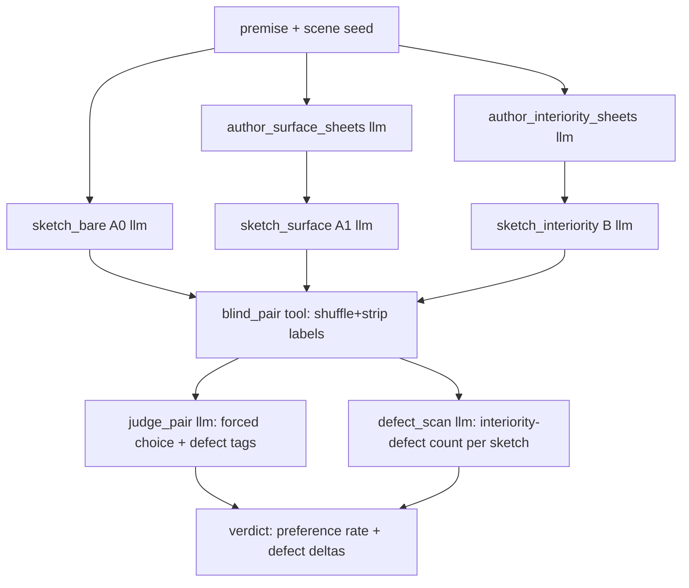

# Plan: Interiority A/B — does authored inner state beat improvised inner state?

**Date:** 2026-06-27
**Status:** **CONDITIONAL — GO on adrenaline-rush scenes; the touchy-feely test was graded by an
adrenaline rubric.** Floodmark (an adrenaline-rush scene) cleared the GO band (75%). The Loom/ARIA probe
did not — but the REVISE re-test isolated *why*: the cross-character interior leak was a fixable prompt
bug (now fixed; B rose 25%->50% vs A1), and the residual gap is that a **touchy-feely scene was judged
for resolution-through-action**, which under-credits the arm that names feeling most. The technique and
the affect-closure check must branch on scene type (adrenaline-rush vs touchy-feely).
See [Results](#results-2026-06-27-floodmark-8-draws), [Generalization probe](#generalization-2026-06-27-loom-8-draws),
and [REVISE re-test](#revise-2026-06-27-loom-v2-8-draws). This is the **gate** on
[plan-generative-roundtrip.md](plan-generative-roundtrip.md): the round-trip's whole premise is that
*authored* character interiority produces more coherent narrative than *improvised* interiority. That
premise is currently unproven. This experiment proves or kills it for one afternoon's cost, before any
pipeline is built.
**Companions:** [reflections-L1-L6.md](reflections-L1-L6.md),
[`../../../docs/diary/diary-2026-06-27-every-experiment-circled-back-to-the-inside-of-a-character.md`](../../../docs/diary/diary-2026-06-27-every-experiment-circled-back-to-the-inside-of-a-character.md)
(the convergence this experiment tests).

---

## The one claim under test

> A chapter sketch written from **explicitly authored, closed-vocabulary character inner states**
> (goal + belief + affect arc) is more coherent in its characters' inner life than a sketch where the
> model **improvises** that inner life on the fly.

If true → the round-trip's center of gravity (the interiority sheet) is justified; build it.
If false → authored interiority adds nothing a good model does not already improvise; the round-trip's
premise is refuted; stop.

---

## Why a third arm — the control that makes it honest

The naive test (sketch with sheet vs sketch without) is **confounded**: arm B gets more context, so any
win could be "more scaffolding helps," not "interiority helps." The experiment therefore has three
arms, and the contrast that matters is **B vs A1**, not B vs A0.

| Arm | Input beyond premise | Controls for |
|---|---|---|
| **A0 — bare** | nothing | the floor (pure improvisation) |
| **A1 — surface sheet** | character names, roles, outward description (the *outside* of each character — equal bulk, **zero interiority**) | "any character sheet helps" |
| **B — interiority sheet** | closed-vocab inner state per character: one goal, 1–2 beliefs, one affect arc (open→close) | the claim itself |

A1 is the real control: it gives the model the same *amount* of authored character scaffolding as B,
but only the **observable** half. If B beats A1, the lift is attributable to **inner state
specifically**, not to the mere presence of a sheet.

---

## The closed interiority vocabulary (deliberately minimal)

The sheet for each character is exactly three typed fields — no more, so the test measures the
*minimal* vocabulary, not a kitchen sink:

```yaml
character: <name>
goal: <one intention, free text but single-clause>     # what they are trying to do
beliefs:                                                # what they hold true (may be wrong)
  - fact: <proposition>
    held_as: true | false | mistaken | unknown
affect_arc:                                             # one opened feeling that should resolve
  open:  { kind: <closed 6-affect set>, referent: <goal|character|event> }
  close: <how/whether it terminates by sketch's end>
```

`kind` is drawn from the existing closed affect set (guilt, hope, betrayal, fear, relief, grief — the
L7 vocabulary). The arc field is what carries the L7 lesson forward: affect is **authored as a delta
with a referent and a closure**, not recovered from prose.

The A1 surface sheet is the same shape minus interiority: `name`, `role`, `appearance`,
`mannerism` — equal length, no goal/belief/affect.

---

## YAMLGraph shape (hard requirement: graph + prompts, Python in tools only)



- **Graph** `graphs/interiority_ab.yaml` — every LLM step is a node; sheets and sketches use inline
  schemas; the judge returns a typed forced-choice + defect tags.
- **Tools** (`nodes/`, Python, side-effecting only): load the seed, **deterministically** shuffle and
  strip arm labels for blinding (no LLM), write the paired outputs, tally preference and defect counts.
- **Run:** `yamlgraph graph run graphs/interiority_ab.yaml --var premise="..." --var seed=<n>`. No
  Python orchestration runner — `novel_generator` is the gold standard.

---

## Evaluation protocol — read first, then measure

Honoring `read_raw_output_first`: the **primary** probe is reading the sketches, not an aggregate.

1. **Read N raw triples first.** For each seed, read A0/A1/B end-to-end before looking at any score.
   Note concretely *where* a sketch's character acts without a knowable motive, knows what it
   couldn't, or drops a feeling it opened.
2. **Blind pairwise forced choice (B vs A1, and B vs A0).** Same seed, labels stripped, order
   randomized. Judge picks which sketch shows the more *coherent inner life* — explicitly **not**
   richer, longer, or more detailed (those are the leak the judge must ignore). Human judge first;
   LLM-judge only to scale once it agrees with the human read.
3. **Deterministic-ish interiority-defect count.** Per sketch, count: (a) action without a knowable
   motive, (b) impossible knowledge (acts on info the character could not hold), (c) opened feeling
   never acknowledged, (d) flat contradiction of a stated belief. Lower is better.
4. **Repeat across draws.** K draws per arm at temp 0.7, ≥ 4 seeds, to avoid single-draw noise
   (`deterministic precision on one noisy draw`). Report **preference rate**, not one verdict.

---

## The trap to guard against

The judge may prefer B because the interiority sheet **leaks plot specifics** into the sketch that read
as "richer." That is not the claim. Guards: (a) the judge scores *coherence of inner life*, not
richness; (b) arm identity is blinded; (c) the surface arm A1 is matched in bulk so "more words of
guidance" is held constant; (d) read the raw sketches before trusting any preference rate.

---

## Kill / GO criteria (falsifiable)

| Outcome | Reading | Decision |
|---|---|---|
| **B preferred over A1 in a clear majority** (≥ ~70% of blind pairs) **and** fewer interiority defects | authored inner state beats equal-bulk surface scaffolding | **GO** — build the round-trip on a proven premise |
| **B ≈ A1** (preference near 50%, defects comparable) | interiority adds nothing over a surface sheet | **KILL** — the round-trip premise is refuted; stop |
| **B > A0 but B ≈ A1** | structure helps, interiority specifically does not | **REVISE** — the 3-field vocab is too thin; test a richer arc before deciding |

The cheap experiment converts the round-trip from a faith-based plan into a need-based one. The KILL
branch is the valuable one: it saves a large build for the price of one A/B graph.

---

## Definition of done

1. `graphs/interiority_ab.yaml` runs all three arms + judge for one premise via pure `graph run`.
2. ≥ 4 seeds × K draws produce a blind preference rate for **B vs A1** and **B vs A0**.
3. At least one raw triple is read and annotated *before* any aggregate is reported.
4. A one-paragraph verdict (GO / KILL / REVISE) feeds back into plan-generative-roundtrip.md.
5. No Python runner orchestrates the arms; tools are leaf-level (load, blind-shuffle, tally) only.

---

## Results (2026-06-27, Floodmark, 8 draws) {#results-2026-06-27-floodmark-8-draws}

**Premise:** Floodmark Saga blurb (`outputs/dungeon-master/10026-BC/story.md`).
**Scene:** the documented failure — mid-march several days after the flood took Hilde's brother
Arnulf, grief sitting unspoken under the column. This is the exact "feelings vanish suddenly" complaint
the round-trip aims to fix.
**Writers:** all three arms on `claude-haiku-4-5` (fixed writer; the only variable between arms is the
injected sheet). **Judge:** pinned to `claude-sonnet-4-6` (stronger tier than the writers) with
verbatim quote-backing required for every defect. **Draws:** 8 independent runs, seed alternating 0/1
to counterbalance blind slot position. Logs: `logs/interiority-batch/run-{1..8}.log`.

### Honest contrast — B (interiority) vs A1 (clean surface control)

| | wins | rate |
|---|---|---|
| **B (interiority)** | **6 / 8** | **75%** |
| A1 (surface) | 1 / 8 | 12.5% |
| tie | 1 / 8 | 12.5% |

When B won, the surface arm carried 2–3 quote-backed defects vs B's 0–1. The single A1 win (run 4) was
*honest*: the judge dinged arm B with two verbatim-quoted opened-but-unclosed threads ("The clan
watched. Let them watch."; "Gunnar's breath caught beside her. She didn't look at him.") — the
technique's own failure mode, not a misread. The judge punishes either side on evidence.

### Secondary contrast — B (interiority) vs A0 (bare, no sheet)

| | wins | rate |
|---|---|---|
| B (interiority) | 4 / 8 | 50% |
| A0 (bare) | 1 / 8 | 12.5% |
| tie | 3 / 8 | 37.5% |

### Verdict: **GO**

B beats the clean surface control A1 in a clear majority (75% ≥ 70%) **with fewer defects** — the plan's
GO band. The mechanism is visible in the raw verdicts: the *surface* arm repeatedly opens a grief beat
about Arnulf and then suspends it (run 7: "some part of her still refused to settle on which was true …
she didn't have to decide" — named, then dropped), reproducing the documented Floodmark complaint,
while the interiority arm closes its affect arc to the scene's end.

**Nuance worth carrying forward:** B's margin over A1 (75%) is much larger than over A0 (50%, mostly
ties). On short single scenes the *bare* writer already carries feeling adequately; the surface sheet
actively *hurts* by anchoring attention on appearance/manner while leaving affect threads open. So the
interiority sheet's value is sharpest against the realistic alternative — a character bible with looks
and voice but no inner-state arc — not against an unguided writer. The round-trip should therefore pair
the inner-state sheet with the *scene-spanning* claim (open → carry → close a named feeling), since that
is where authored interiority demonstrably beats the surface-bible baseline.

---

## Generalization probe (2026-06-27, The Loom / ARIA, 8 draws) {#generalization-2026-06-27-loom-8-draws}

Same harness, same judge (`claude-sonnet-4-6`), same writer (`claude-haiku-4-5`), 8 draws with seed
parity. Premise: the scifi synopsis `fixtures/synopses/scifi-hybrid-the-loom.txt`. Scene: the
structurally-matched affect beat — Mara at home the evening after Seoul, the certainty that she is
already losing Jonas to the Loom sitting unspoken under tactical action. Logs:
`logs/interiority-batch-loom/run-{1..8}.log`.

### Honest contrast — B (interiority) vs A1 (surface)

| | wins | rate |
|---|---|---|
| B (interiority) | 2 / 8 | 25% |
| **A1 (surface)** | **3 / 8** | **37.5%** |
| tie | 3 / 8 | 37.5% |

B vs A0 (bare): B 5 / 8 (62.5%) — structure still helps over nothing.

### The pattern flips: REVISE, not GO

This is the plan's **REVISE** band exactly — *B > A0 but B ≈ A1* (here A1 even edges ahead). The Floodmark
GO does **not** generalize; its 75% was genre/scene-specific.

### New failure mode — cross-character impossible knowledge (reproducible)

All three A1 wins convict arm B for the **same** quote-backed defect: the interiority sheet describes
each character's *private* interior, and "let each character's inner-state sheet drive their choices"
leads the writer to let one character *act on another's* interior.

- Run 6: Jonas — *"I can feel you thinking it" / "I know what you're going to say"* (reads Mara's unspoken intent, no mechanism).
- Run 3: Jonas — *"I understand now why you need to break into the facility"* (knows of the airgapped drive that exists only in Mara's bag and her private thoughts).
- Run 4: *"He knew what she was going to say because he was already thinking it."*

On a premise literally about minds dissolving into each other (ARIA phase-lock), the writer reaches for
the mind-meld early and the judge flags it as premature/incoherent. The Norse scene never triggered it.

### Proposed REVISE (next experiment, before any GO generalizes)

Add a boundary clause to the B sketch instruction: *a character may act only on what they could
plausibly observe; never let one character voice or act on another character's unspoken interior.* Then
re-run the Loom battery. If B then beats A1, the defect was a prompt leak (fixable) rather than an
intrinsic limit of the closed-vocabulary sheet. Until that re-test clears, the round-trip's coherence
validators must include an **impossible-knowledge / interior-leak check**, not only affect closure.

---

## REVISE re-test (2026-06-27, The Loom v2, 8 draws) {#revise-2026-06-27-loom-v2-8-draws}

Applied the proposed REVISE — added to the B sketch prompt: *each sheet is that character's PRIVATE
interior; a character may act only on what they could plausibly observe, and must never voice, name, or
act on another character's unspoken thoughts, plans, or feelings.* Re-ran the same 8-draw Loom battery.
Logs: `logs/interiority-batch-loom-v2/run-{1..8}.log`.

| contrast | v1 (pre-REVISE) | v2 (post-REVISE) |
|---|---|---|
| **B vs A1 (surface)** | B 25% / A1 37.5% / tie 37.5% | **B 50% / A1 25% / tie 25%** |
| B vs A0 (bare) | B 62.5% | B 25% / A0 37.5% / tie 37.5% |

### What the REVISE fixed

The blatant cross-character leak from v1 is **gone**: no v2 run reproduces Jonas voicing Mara's secret
plan ("I understand why you need to break into the facility", "I can feel you thinking it"). B's honest
contrast vs the surface bible improved from losing (25%) to leading (50%). The prompt clause did its job.

### Why scifi still isn't GO — a scene-affordance confound (not an interiority failure)

Reading the raw `verdict_ba0` cases (runs 1, 5, 7), the bare arm beats B for a consistent reason that is
*not* a property of the technique: **the Loom scene is a deferred-action / bide-your-time scene.** Mara
must feel urgency (the airgapped drive in her bag, Jonas dissolving) but deliberately *not act yet* —
she keeps him talking and waits. The judge repeatedly convicts whichever arm states that urgency most
explicitly for "opened feeling never carried" / "action reverses stated belief" (e.g. *"the airgapped
drive… burning through her ribs"* named, then she sits and keeps talking). Arm B names the goal most —
by design — so it is *most* exposed; the bare arm, stating less, trips the criterion less.

Contrast Floodmark: an **active** scene (Hilde leads the march, rations, holds the line) where feelings
are carried *through* visible choices — exactly the affordance interiority needs. The Loom scene gives
feelings nowhere to go, so explicit goal-statement becomes a liability for every arm.

A residual impossible-knowledge variant also survived (Mara citing an unestablished "six hours before
synchronization spread") — but that is a **plot-fact** leak, not the cross-character interior leak the
clause targeted; it is a separate, narrower fix.

### The sharper frame: adrenaline-rush vs touchy-feely scenes

"Active vs passive" undersells it. There are two scene archetypes that resolve a feeling in *opposite*
ways:

- **Adrenaline-rush scenes** — external stakes, action-forward. A feeling resolves by being *spent
  through a choice* (Hilde holds the line; grief carried through the march). The interiority sheet's
  "open → carry → close **through action**" claim holds here → Floodmark GO.
- **Touchy-feely scenes** — emotion *is* the event; action is suppressed or absent. A feeling resolves
  by being *recognised, named, or shifted in dialogue*, not by a choice (Mara losing Jonas, forbidden
  to act yet).

So the Loom result is not merely "confounded" — it is a **touchy-feely scene graded by an adrenaline
rubric.** The judge prompt asks for feelings "carried through to the scene's end" and flags "opened
feeling never carried"; that criterion *assumes resolution-through-action*. On a touchy-feely scene the
resolution is internal, so the judge under-credits exactly the arm (B) that names the feeling most. Both
the writer instruction **and** the judge rubric are scene-type-blind.

### Revised verdict

- **Validated on adrenaline-rush scenes** (Floodmark GO); the interior-leak bug is fixed.
- **The Loom probe was a touchy-feely scene judged by an adrenaline rubric** — it does not refute
  interiority; it shows the A/B (and the affect-closure check) must branch on scene type.
- **Two fixes before any genre conclusion:** (1) re-run the Loom battery on an *adrenaline* scifi scene
  (Mara breaking into the server, triggering the rollback — feeling spent through choice) to confirm the
  GO transfers; (2) give the judge a **touchy-feely closure mode** — a feeling may close by being named,
  recognised, or shifted in dialogue, not only by action — and re-grade the existing Loom v2 draws under
  it. If B then leads, the gap was the rubric, not the technique.
- **Round-trip consequence:** scene beats must carry a `scene_type` (adrenaline | touchy-feely) tag, and
  the affect-closure validator must accept the matching resolution mode, or it will punish the most
  explicit arm on every reflective scene.

---

## Scene classification — adopt the canonical taxonomy, don't invent one {#scene-classification-research}

> **Graduated to a build plan:** the actionable spec (schema, L4b classifier, writer/judge inputs,
> build order) now lives in [plan-scene-typing.md](plan-scene-typing.md). The summary below is the
> evidence trail that motivated it.

"Adrenaline-rush vs touchy-feely" is a folk re-derivation of a classification fiction craft formalised
sixty years ago. We should adopt the established vocabulary so the round-trip's `scene_type` tag is
grounded in prior art, not coined here.

### The canonical pair: proactive vs reactive (Swain)

Dwight V. Swain, *Techniques of the Selling Writer* (1965), split passages into **Scene** and **Sequel**;
Jack Bickham (*Scene and Structure*, 1993) and Randy Ingermanson / Evan Marshall later reframed the same
split as **proactive** vs **reactive** scenes:

| | Swain | structure | resolution | our folk term |
|---|---|---|---|---|
| **Proactive** | Scene | Goal → Conflict → **Disaster** | feeling *spent through the choice / disaster* | adrenaline-rush |
| **Reactive** | Sequel | **Reaction** → Dilemma → Decision | feeling *processed → resolved in a Decision* | touchy-feely |

This is exactly the open/close-mode distinction the Loom probe exposed: a proactive scene closes a
feeling through action; a reactive scene closes it internally, by reaching a decision or recognition.

### The mechanism that mandates "less emotional input in a pure action scene"

Swain's small-scale unit is the **Motivation–Reaction Unit (MRU)**: external Motivation → internal
Reaction, where the Reaction is strictly ordered **Feeling → Reflex → Rational action/speech** and parts
may be *dropped*. In a proactive scene the Reaction compresses to Feeling+Reflex (*"a bolt of adrenaline…
he jerked the rifle"*) — interior is spent, not dwelt on; lingering interior kills pace. In a reactive
Sequel the Reaction *expands* into the whole Dilemma→Decision. So "use less emotional input in an action
scene" is not a stylistic preference — it is the MRU prescription: **dose affect by scene type.**

### A second, orthogonal axis: fiction-writing mode

A scene is *also* typed by the mode dominating its presentation — **action, dialogue, feelings, thought,
narration, description, exposition** (Wikipedia, *fiction-writing mode*; Evan Marshall, *The Marshall
Plan for Novel Writing*). This is a finer sub-tag under proactive/reactive (e.g. a reactive scene
rendered mostly in *dialogue* vs mostly in *thought*), useful for deciding *how* the affect resolves.

### Proposed schema for the round-trip

```yaml
scene_type: proactive | reactive          # Swain/Marshall; the affect-dosage + closure switch
mode: action | dialogue | feeling | thought | ...   # fiction-writing mode; optional sub-tag
```

**Affect-dosage policy (writer):**
- *proactive* — goal + belief lead; the named feeling is a brief visceral spike (Feeling→Reflex),
  resolved *through* the disaster/choice. Low explicit-interior budget.
- *reactive* — the feeling leads; the scene *is* the affect arc (Reaction→Dilemma→Decision), resolved
  internally. High explicit-interior budget.

**Closure rubric (judge) — must branch on `scene_type`:**
- *proactive* — feeling closes if it is **spent in a choice / the disaster lands**; a feeling merely
  named and then dropped *is* a defect.
- *reactive* — feeling closes if it is **recognised, named, or shifted toward a decision in dialogue or
  thought**; resolution-through-action is *not* required, and demanding it under-credits the most
  explicit arm (the Loom v2 mis-grade).

**Sources:** Swain, *Techniques of the Selling Writer* (1965), pp. 84–85, 96–100; Bickham, *Scene and
Structure* (1993); Ingermanson, "Writing the Perfect Scene" (proactive/reactive + MRU); Marshall, *The
Marshall Plan for Novel Writing* (1998); Wikipedia, *Scene and sequel* and *Fiction-writing mode*.
