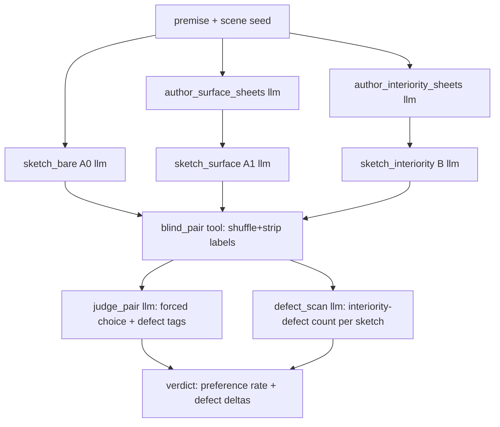

# Plan: Interiority A/B — does authored inner state beat improvised inner state?

**Date:** 2026-06-27
**Status:** Proposed (standalone falsification experiment). This is the **gate** on
[plan-generative-roundtrip.md](plan-generative-roundtrip.md): the round-trip's whole premise is that
*authored* character interiority produces more coherent narrative than *improvised* interiority. That
premise is currently unproven. This experiment proves or kills it for one afternoon's cost, before any
pipeline is built.
**Companions:** [reflections-L1-L6.md](reflections-L1-L6.md),
[`../../../docs/diary/diary-2026-06-27-every-experiment-circled-back-to-the-inside-of-a-character.md`](../../../docs/diary/diary-2026-06-27-every-experiment-circled-back-to-the-inside-of-a-character.md)
(the convergence this experiment tests).

---

## The one claim under test

> A chapter sketch written from **explicitly authored, closed-vocabulary character inner states**
> (goal + belief + affect arc) is more coherent in its characters' inner life than a sketch where the
> model **improvises** that inner life on the fly.

If true → the round-trip's center of gravity (the interiority sheet) is justified; build it.
If false → authored interiority adds nothing a good model does not already improvise; the round-trip's
premise is refuted; stop.

---

## Why a third arm — the control that makes it honest

The naive test (sketch with sheet vs sketch without) is **confounded**: arm B gets more context, so any
win could be "more scaffolding helps," not "interiority helps." The experiment therefore has three
arms, and the contrast that matters is **B vs A1**, not B vs A0.

| Arm | Input beyond premise | Controls for |
|---|---|---|
| **A0 — bare** | nothing | the floor (pure improvisation) |
| **A1 — surface sheet** | character names, roles, outward description (the *outside* of each character — equal bulk, **zero interiority**) | "any character sheet helps" |
| **B — interiority sheet** | closed-vocab inner state per character: one goal, 1–2 beliefs, one affect arc (open→close) | the claim itself |

A1 is the real control: it gives the model the same *amount* of authored character scaffolding as B,
but only the **observable** half. If B beats A1, the lift is attributable to **inner state
specifically**, not to the mere presence of a sheet.

---

## The closed interiority vocabulary (deliberately minimal)

The sheet for each character is exactly three typed fields — no more, so the test measures the
*minimal* vocabulary, not a kitchen sink:

```yaml
character: <name>
goal: <one intention, free text but single-clause>     # what they are trying to do
beliefs:                                                # what they hold true (may be wrong)
  - fact: <proposition>
    held_as: true | false | mistaken | unknown
affect_arc:                                             # one opened feeling that should resolve
  open:  { kind: <closed 6-affect set>, referent: <goal|character|event> }
  close: <how/whether it terminates by sketch's end>
```

`kind` is drawn from the existing closed affect set (guilt, hope, betrayal, fear, relief, grief — the
L7 vocabulary). The arc field is what carries the L7 lesson forward: affect is **authored as a delta
with a referent and a closure**, not recovered from prose.

The A1 surface sheet is the same shape minus interiority: `name`, `role`, `appearance`,
`mannerism` — equal length, no goal/belief/affect.

---

## YAMLGraph shape (hard requirement: graph + prompts, Python in tools only)



- **Graph** `graphs/interiority_ab.yaml` — every LLM step is a node; sheets and sketches use inline
  schemas; the judge returns a typed forced-choice + defect tags.
- **Tools** (`nodes/`, Python, side-effecting only): load the seed, **deterministically** shuffle and
  strip arm labels for blinding (no LLM), write the paired outputs, tally preference and defect counts.
- **Run:** `yamlgraph graph run graphs/interiority_ab.yaml --var premise="..." --var seed=<n>`. No
  Python orchestration runner — `novel_generator` is the gold standard.

---

## Evaluation protocol — read first, then measure

Honoring `read_raw_output_first`: the **primary** probe is reading the sketches, not an aggregate.

1. **Read N raw triples first.** For each seed, read A0/A1/B end-to-end before looking at any score.
   Note concretely *where* a sketch's character acts without a knowable motive, knows what it
   couldn't, or drops a feeling it opened.
2. **Blind pairwise forced choice (B vs A1, and B vs A0).** Same seed, labels stripped, order
   randomized. Judge picks which sketch shows the more *coherent inner life* — explicitly **not**
   richer, longer, or more detailed (those are the leak the judge must ignore). Human judge first;
   LLM-judge only to scale once it agrees with the human read.
3. **Deterministic-ish interiority-defect count.** Per sketch, count: (a) action without a knowable
   motive, (b) impossible knowledge (acts on info the character could not hold), (c) opened feeling
   never acknowledged, (d) flat contradiction of a stated belief. Lower is better.
4. **Repeat across draws.** K draws per arm at temp 0.7, ≥ 4 seeds, to avoid single-draw noise
   (`deterministic precision on one noisy draw`). Report **preference rate**, not one verdict.

---

## The trap to guard against

The judge may prefer B because the interiority sheet **leaks plot specifics** into the sketch that read
as "richer." That is not the claim. Guards: (a) the judge scores *coherence of inner life*, not
richness; (b) arm identity is blinded; (c) the surface arm A1 is matched in bulk so "more words of
guidance" is held constant; (d) read the raw sketches before trusting any preference rate.

---

## Kill / GO criteria (falsifiable)

| Outcome | Reading | Decision |
|---|---|---|
| **B preferred over A1 in a clear majority** (≥ ~70% of blind pairs) **and** fewer interiority defects | authored inner state beats equal-bulk surface scaffolding | **GO** — build the round-trip on a proven premise |
| **B ≈ A1** (preference near 50%, defects comparable) | interiority adds nothing over a surface sheet | **KILL** — the round-trip premise is refuted; stop |
| **B > A0 but B ≈ A1** | structure helps, interiority specifically does not | **REVISE** — the 3-field vocab is too thin; test a richer arc before deciding |

The cheap experiment converts the round-trip from a faith-based plan into a need-based one. The KILL
branch is the valuable one: it saves a large build for the price of one A/B graph.

---

## Definition of done

1. `graphs/interiority_ab.yaml` runs all three arms + judge for one premise via pure `graph run`.
2. ≥ 4 seeds × K draws produce a blind preference rate for **B vs A1** and **B vs A0**.
3. At least one raw triple is read and annotated *before* any aggregate is reported.
4. A one-paragraph verdict (GO / KILL / REVISE) feeds back into plan-generative-roundtrip.md.
5. No Python runner orchestrates the arms; tools are leaf-level (load, blind-shuffle, tally) only.
